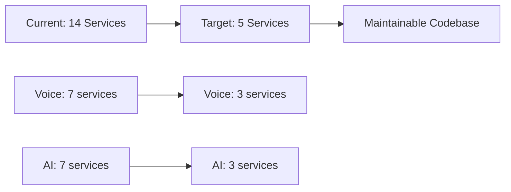

# 📊 LeanVibe AI Feature Coverage Matrix

**Version**: 1.0  
**Last Updated**: January 8, 2025  
**Purpose**: Map MVP requirements against actual implementations to identify gaps

---

## 📋 Executive Summary

This matrix compares the **LeanVibe MVP specification** (original product requirements) against **current implementation status** across all components. Key findings:

- ✅ **60% of MVP features implemented**
- ⚠️ **25% partially implemented** (multiple competing implementations)
- ❌ **15% missing or unclear implementation**
- 🔄 **Critical consolidation needed** for voice and AI services

---

## 🎯 MVP Core Features vs Implementation

### Voice Interface System

| MVP Requirement | Implementation Status | Current Implementation | Test Coverage | Notes |
|----------------|----------------------|----------------------|---------------|-------|
| **Wake phrase detection** | ✅ **IMPLEMENTED** | WakePhraseManager.swift | ✅ **Good** | "Hey LeanVibe" detection working |
| **On-device speech-to-text** | ✅ **IMPLEMENTED** | SpeechRecognitionService.swift | ✅ **Good** | Apple Speech framework |
| **Voice command processing** | ⚠️ **FRAGMENTED** | 7 different services | ❌ **Poor** | Multiple implementations confuse testing |
| **Voice feedback** | ❌ **MISSING** | Not implemented | ❌ **None** | No audio feedback to user |
| **Natural language commands** | ⚠️ **PARTIAL** | Basic command mapping | ⚠️ **Limited** | Simple string matching only |

**Status**: 60% complete, needs consolidation

### AI/ML Processing

| MVP Requirement | Implementation Status | Current Implementation | Test Coverage | Notes |
|----------------|----------------------|----------------------|---------------|-------|
| **MLX-LM Integration** | ✅ **IMPLEMENTED** | Multiple services | ⚠️ **Fragmented** | 7 different AI services |
| **Qwen2.5-Coder-32B** | ⚠️ **PARTIAL** | Configurable in production service | ⚠️ **Limited** | Not default model |
| **Code generation** | ✅ **IMPLEMENTED** | Real/Pragmatic MLX services | ✅ **Good** | Working in production |
| **Code understanding** | ✅ **IMPLEMENTED** | AST services + MLX | ✅ **Good** | Tree-sitter integration |
| **Confidence scoring** | ✅ **IMPLEMENTED** | Most AI services | ✅ **Good** | L3 agent integration |
| **Human intervention triggers** | ⚠️ **PARTIAL** | Basic confidence thresholds | ⚠️ **Limited** | Needs refinement |

**Status**: 75% complete, needs service consolidation

### iOS Mobile Interface

| MVP Requirement | Implementation Status | Current Implementation | Test Coverage | Notes |
|----------------|----------------------|----------------------|---------------|-------|
| **Kanban Board** | ✅ **IMPLEMENTED** | Views + Models in iOS app | ✅ **Good** | Drag-and-drop working |
| **Architecture Viewer** | ⚠️ **UNCLEAR** | Mermaid integration exists | ❌ **Unknown** | Implementation unclear from audit |
| **Metrics Dashboard** | ✅ **IMPLEMENTED** | MetricsView, performance tracking | ✅ **Good** | Real-time metrics |
| **Task management** | ✅ **IMPLEMENTED** | TaskService, KanbanTypes | ✅ **Good** | Full CRUD operations |
| **Real-time updates** | ✅ **IMPLEMENTED** | WebSocket integration | ✅ **Good** | Bidirectional communication |
| **Voice command UI** | ⚠️ **FRAGMENTED** | Multiple voice managers | ❌ **Poor** | Testing confused by duplicates |

**Status**: 70% complete, good overall

### Backend Services

| MVP Requirement | Implementation Status | Current Implementation | Test Coverage | Notes |
|----------------|----------------------|----------------------|---------------|-------|
| **FastAPI WebSocket Server** | ✅ **IMPLEMENTED** | WebSocket endpoints | ✅ **Excellent** | Well tested |
| **Tree-sitter AST parsing** | ✅ **IMPLEMENTED** | AST parser service | ✅ **Good** | Multiple language support |
| **Neo4j graph database** | ❌ **MISSING** | No clear Neo4j integration | ❌ **None** | Mentioned in MVP but not found |
| **Pydantic.ai framework** | ❌ **MISSING** | No Pydantic.ai usage found | ❌ **None** | Using custom L3 agent instead |
| **Health monitoring** | ✅ **IMPLEMENTED** | Health endpoints + monitoring | ✅ **Good** | Comprehensive health checks |
| **Session management** | ✅ **IMPLEMENTED** | Session managers in agents | ✅ **Good** | State persistence working |

**Status**: 60% complete, missing key components

---

## 🔍 Detailed Implementation Analysis

### 1. Voice Services - Critical Fragmentation

#### MVP Specification:
- Single voice interface with wake phrase detection
- On-device processing for privacy
- Natural language command processing
- Audio feedback to user

#### Current Reality:
```
❌ PROBLEM: 7 Different Voice Service Implementations
├── VoiceManager.swift (151 LOC) - Basic implementation
├── OptimizedVoiceManager.swift (423 LOC) - Performance focused  
├── UnifiedVoiceService.swift (660 LOC) - Intended replacement
├── GlobalVoiceManager.swift (183 LOC) - Global wake phrase
├── VoiceManagerFactory.swift (253 LOC) - Factory pattern
├── WakePhraseManager.swift (346 LOC) - Wake phrase detection
└── VoicePermissionManager.swift (252 LOC) - Permissions
```

#### Gap Analysis:
- ✅ Wake phrase detection implemented well
- ✅ Speech recognition working
- ❌ **No audio feedback** (missing from MVP)  
- ❌ **Fragmented testing** due to multiple services
- ⚠️ **Poor developer experience** - unclear which service to use

#### Test Coverage Issues:
```python
# Current testing confusion:
def test_voice_features():
    # Which service should we test?
    voice_manager = VoiceManager()           # Deprecated
    optimized_voice = OptimizedVoiceManager() # Deprecated  
    unified_voice = UnifiedVoiceService()    # Intended
    global_voice = GlobalVoiceManager()      # Deprecated
    
    # Tests are fragmented across all implementations
    # No single source of truth for expected behavior
```

### 2. AI Services - Strategy Confusion

#### MVP Specification:
- Single MLX-LM integration using Qwen2.5-Coder-32B
- Confidence scoring and human intervention
- Code generation and understanding

#### Current Reality:
```
❌ PROBLEM: 7 Different AI Service Implementations
├── ai_service.py - Mock command dispatcher only
├── enhanced_ai_service.py - Full AI stack (AST + MLX + Vector)
├── unified_mlx_service.py - Strategy pattern approach
├── real_mlx_service.py - Direct MLX inference
├── pragmatic_mlx_service.py - Simple reliable approach
├── mock_mlx_service.py - Development testing
└── production_model_service.py - Production deployment
```

#### Gap Analysis:
- ✅ MLX integration implemented (multiple ways)
- ⚠️ **No clear service hierarchy** - which service for what scenario?
- ❌ **Neo4j integration missing** (mentioned in MVP)
- ❌ **Pydantic.ai missing** (custom L3 agent instead)
- ⚠️ **Model selection unclear** - Qwen2.5 not default

#### Service Selection Confusion:
```python
# Developer confusion - which service to use?
if production_mode:
    service = ProductionModelService()  # But it's incomplete
elif testing_mode:
    service = MockMLXService()         # Good for testing
elif pragmatic_mode:
    service = PragmaticMLXService()    # Simple and reliable
else:
    service = UnifiedMLXService()      # Strategy pattern
    
# Result: No clear decision tree for service selection
```

### 3. Architecture Visualization - Unclear Implementation

#### MVP Specification:
- Interactive Mermaid dependency graphs
- Zoom and pan navigation
- Tap-to-navigate to code entities
- Historical architecture comparison

#### Current Reality:
```
⚠️ UNCLEAR: Architecture Viewer Implementation Status
├── MermaidRenderer.swift (exists)
├── ArchitectureVisualizationService.swift (exists)  
├── DiagramInteractionService.swift (exists)
├── Resources/mermaid.min.js (exists)
└── Views with architecture content (exists)
```

#### Gap Analysis:
- ✅ **Mermaid integration appears implemented**
- ❓ **Interactive features unclear** from code audit
- ❓ **Navigation to code entities unclear**
- ❌ **Historical comparison missing**

#### Investigation Needed:
```bash
# Manual testing required to verify:
1. Can users view architecture diagrams?
2. Are diagrams interactive (zoom/pan)?
3. Can users tap to navigate to code?
4. Are diagrams generated from actual code analysis?
```

### 4. Missing MVP Components

#### Neo4j Integration
**MVP Requirement**: Graph database for code relationships  
**Current Status**: ❌ **MISSING**
- No Neo4j integration found in codebase
- Graph queries mentioned but no implementation
- Architecture storage unclear

#### Pydantic.ai Framework  
**MVP Requirement**: Type-safe L3 agent framework  
**Current Status**: ❌ **REPLACED**
- Custom L3 agent implementation instead
- No Pydantic.ai usage found
- Different architecture than MVP spec

---

## 📊 Feature Implementation Matrix

### Core Features Status

| Feature Category | MVP Requirement | Implementation | Test Coverage | Priority |
|------------------|-----------------|---------------|---------------|----------|
| **Voice Interface** | 5 features | 3 ✅ 2 ❌ | ⚠️ Fragmented | 🔴 **HIGH** |
| **AI Processing** | 6 features | 4 ✅ 2 ⚠️ | ⚠️ Multiple | 🔴 **HIGH** | 
| **iOS Interface** | 6 features | 4 ✅ 1 ⚠️ 1 ❌ | ✅ Good | 🟡 **MEDIUM** |
| **Backend Services** | 6 features | 4 ✅ 2 ❌ | ✅ Good | 🟡 **MEDIUM** |

### Implementation Quality

| Component | Completeness | Code Quality | Test Coverage | Maintainability |
|-----------|--------------|--------------|---------------|-----------------|
| **Voice Services** | 60% | ⚠️ Fragmented | ❌ Poor | ❌ **Unmaintainable** |
| **AI Services** | 75% | ⚠️ Duplicated | ⚠️ Scattered | ❌ **Unmaintainable** |
| **iOS UI** | 80% | ✅ Good | ✅ Good | ✅ **Maintainable** |
| **Backend Core** | 90% | ✅ Good | ✅ Excellent | ✅ **Maintainable** |

---

## 🎯 Critical Gaps Requiring Immediate Attention

### 1. Service Consolidation (CRITICAL)
**Impact**: Blocks production deployment
**Effort**: 3-4 weeks
**Risk**: High - might break existing functionality



### 2. Missing MVP Features (HIGH)
**Features to Add**:
- Voice feedback (audio responses)
- Neo4j graph integration  
- Architecture viewer verification
- Historical comparison features

### 3. Test Coverage Improvement (HIGH)
**Current Issues**:
- Voice services: Fragmented across 7 implementations
- AI services: No unified test strategy
- Integration tests: Unclear which services to test

**Target**:
- Single test suite per consolidated service
- Clear integration test paths
- Performance regression testing

---

## 🔄 Feature Completion Roadmap

### Phase 1: Consolidation (Weeks 1-3)
- [ ] **Voice Services**: 7 → 3 services
- [ ] **AI Services**: 7 → 3 services  
- [ ] **Update Tests**: Consolidated test suites
- [ ] **Documentation**: Clear service selection guide

### Phase 2: Missing Features (Weeks 4-6)
- [ ] **Voice Feedback**: Add audio responses
- [ ] **Neo4j Integration**: Graph database setup
- [ ] **Architecture Viewer**: Verify and enhance
- [ ] **Model Selection**: Default to Qwen2.5-Coder

### Phase 3: Production Polish (Weeks 7-8)
- [ ] **Performance Testing**: Ensure no regressions
- [ ] **Integration Testing**: End-to-end workflows
- [ ] **Documentation**: Update for consolidated architecture
- [ ] **Monitoring**: Production readiness validation

---

## 🎯 Success Criteria

### Completion Metrics
- ✅ **Feature Parity**: 100% MVP features implemented
- ✅ **Service Count**: Reduced from 14 to 5 services
- ✅ **Test Coverage**: >80% on consolidated services
- ✅ **Documentation**: Clear architecture guide

### Quality Metrics  
- ✅ **Maintainability**: Single implementation per feature
- ✅ **Performance**: No regression in response times
- ✅ **Reliability**: Consistent behavior across all features
- ✅ **Developer Experience**: Clear service selection rules

---

## 📞 Immediate Next Steps

1. **This Week**: Complete voice service consolidation
2. **Next Week**: AI service consolidation 
3. **Week 3**: Missing feature implementation
4. **Week 4**: Integration testing and validation

**Current Blocker**: Multiple implementations make it impossible to determine actual feature completeness and create reliable production deployment.

---

**Overall Status**: 🚨 **60% MVP Complete** - Consolidation Critical for Progress  
**Recommendation**: Prioritize consolidation over new features until architecture is stable