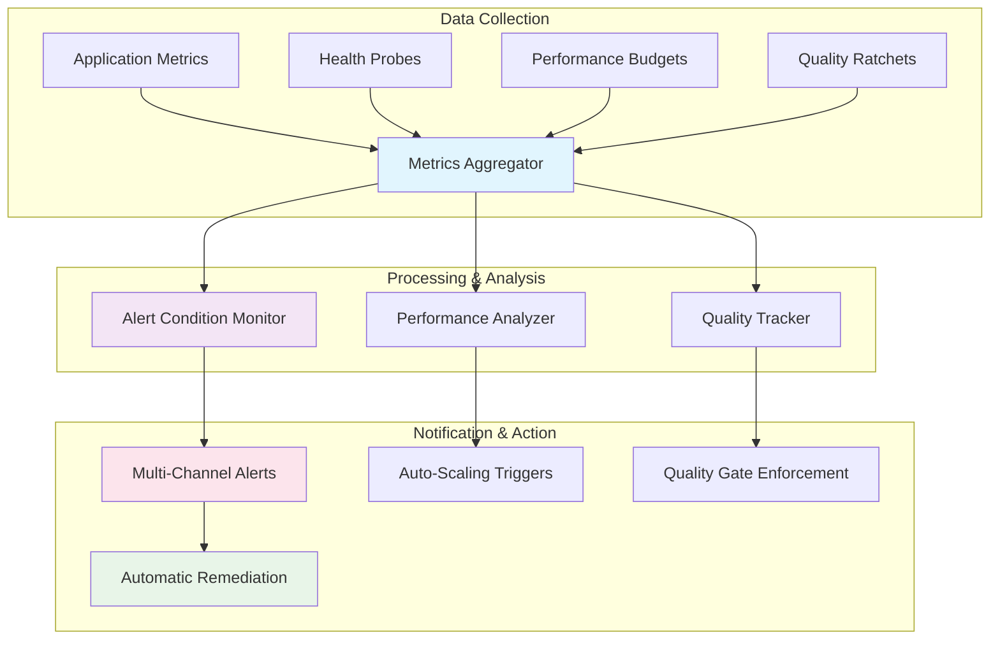

# LeanVibe AI - Monitoring and Observability Guide

**Status**: Production Ready | **Version**: 1.0 | **Last Updated**: 2025-01-13

## 🎯 Executive Summary

LeanVibe AI implements a **comprehensive observability system** designed for **autonomous operation** with minimal human intervention. The monitoring system follows XP principles with fast feedback loops, actionable alerts, and automated recovery mechanisms.

### Key Monitoring Principles
- **Fast Detection**: Issues detected in <60s, alerts within 120s
- **Actionable Alerts**: Every alert includes specific remediation steps
- **Autonomous Recovery**: Self-healing systems with automatic rollback
- **Quality-First**: Performance budgets and quality ratchets prevent regressions
- **Multi-Channel Alerting**: Console, email, Slack, and webhook notifications

---

## 📊 Monitoring Architecture Overview



---

## 🔍 Synthetic Probe System

### Comprehensive End-to-End Validation

The synthetic probe system provides continuous validation of system health and functionality:

**Location**: `/Users/bogdan/work/leanvibe-ai/leanvibe-backend/deploy/synthetic_probes.sh`

### Probe Categories

#### Basic Health Probes (Always Running)
```bash
# Essential system validation
/health                  # Basic service availability
/health/complete         # Comprehensive system health
/health/ready           # Readiness for traffic
/health/database        # Database connectivity
/health/redis          # Cache layer health
```

#### API Functionality Probes
```bash
# Core API validation
/api/                   # API root accessibility
/api/projects          # Project management API
/api/tasks             # Task management API
/api/ai/generate       # AI inference capability
```

#### WebSocket Communication Probes
```python
# Real-time communication validation
async def test_websocket():
    # Connection establishment: <500ms
    # Message round-trip: <100ms
    # Connection stability: >99.5%
    uri = "$WS_URL"
    async with websockets.connect(uri, timeout=30) as websocket:
        test_message = {"type": "ping", "data": "probe"}
        await websocket.send(json.dumps(test_message))
        response = await asyncio.wait_for(websocket.recv(), timeout=10)
```

#### Performance Benchmarks (Comprehensive Mode)
```bash
# Concurrent load testing
- 10 concurrent requests to critical endpoints
- Average response time tracking
- Throughput measurement
- Resource utilization monitoring
```

#### Security Validation Probes
```bash
# Security posture verification
- Unauthorized access protection (401/403 expected)
- HTTPS redirect validation (production)
- API authentication enforcement
- Input validation testing
```

### Probe Execution Modes

```bash
# Basic mode - Essential health checks only
./synthetic_probes.sh staging

# Comprehensive mode - Full validation suite
./synthetic_probes.sh staging --comprehensive

# Critical mode - Maximum validation depth
./synthetic_probes.sh production --critical --timeout=120
```

### Probe Success Criteria

```yaml
Basic Mode:
  Minimum Success Rate: 85%
  Critical Endpoints: Must pass 100%
  Execution Time: <2 minutes
  
Comprehensive Mode:
  Minimum Success Rate: 90%
  Performance Thresholds: Must meet SLA targets
  Execution Time: <5 minutes
  
Critical Mode:
  Minimum Success Rate: 95%
  Zero Tolerance: Security and core functionality
  Execution Time: <10 minutes
```

---

## 📈 Performance Budget Management

### SLA-Driven Performance Monitoring

**Location**: `/Users/bogdan/work/leanvibe-ai/leanvibe-backend/budgets/performance_sla.json`

### Performance Budgets by Component

#### API Endpoint Budgets
```json
{
  "api_endpoints": {
    "p50_response_time_ms": {"target": 200, "warning": 300, "critical": 500},
    "p95_response_time_ms": {"target": 400, "warning": 600, "critical": 1000},
    "p99_response_time_ms": {"target": 800, "warning": 1200, "critical": 2000},
    "error_rate_percent": {"target": 0.1, "warning": 1.0, "critical": 5.0},
    "throughput_requests_per_second": {"target": 100, "warning": 50, "critical": 25}
  }
}
```

#### Endpoint-Specific SLAs
```yaml
/health: P95 < 100ms          # Health checks must be very fast
/api/projects: P95 < 300ms    # Project listing with caching
/api/projects/{id}/ast: P95 < 1000ms  # AST parsing can be slower
/api/ai/completion: P95 < 2000ms      # AI inference budget
```

#### WebSocket Performance Budgets
```json
{
  "websocket_connections": {
    "handshake_time_ms": {"target": 500, "warning": 1000, "critical": 2000},
    "message_latency_ms": {"target": 50, "warning": 100, "critical": 200},
    "connection_success_rate_percent": {"target": 99.5, "warning": 98.0, "critical": 95.0}
  }
}
```

#### Test Suite Performance Budgets
```yaml
Tier 0 (Pre-commit):
  Target: <45s | Warning: <60s | Critical: <90s
  Purpose: Developer productivity - must be very fast
  
Tier 1 (PR Gate):
  Target: <180s | Warning: <300s | Critical: <450s
  Purpose: Integration validation - 3-5 minute window
  
Tier 2 (Nightly):
  Target: <900s | Warning: <1800s | Critical: <2700s
  Purpose: Comprehensive validation - up to 30 minutes
```

#### Resource Utilization Budgets
```yaml
Memory Usage:
  Application Heap: Target 256MB, Warning 400MB, Critical 500MB
  Test Execution Peak: Target 400MB, Warning 600MB, Critical 800MB
  
CPU Utilization:
  Average: Target 60%, Warning 80%, Critical 95%
  
Storage:
  Log Files: Target 100MB/day, Warning 250MB/day, Critical 500MB/day
  Cache Size: Target 200MB, Warning 400MB, Critical 600MB
```

### Performance Regression Detection

**Location**: `/Users/bogdan/work/leanvibe-ai/leanvibe-backend/tools/perf_regression.py`

```python
# Automated performance regression detection
class PerformanceMonitor:
    def __init__(self):
        self.budgets = {
            "api_response_time": 500,      # 500ms max API response
            "test_execution_time": 10000,  # 10s max test suite
            "memory_usage": 100 * 1024 * 1024,  # 100MB max memory
        }
        self.regression_threshold = 10.0  # 10% performance degradation
```

### Performance Measurement Suite

```bash
# Comprehensive performance validation
python tools/perf_regression.py --full-analysis

# API performance benchmarks
python tools/perf_regression.py --include-api

# Test suite performance tracking  
python tools/perf_regression.py --baseline=main
```

---

## 🎯 Quality Ratchet System

### Autonomous Quality Enforcement

**Location**: `/Users/bogdan/work/leanvibe-ai/leanvibe-backend/tools/quality_ratchet.py`

The quality ratchet system ensures metrics only improve over time - never regress.

### Quality Metrics Tracking

```json
{
  "global_targets": {
    "coverage_percent_min": 70.0,        // ↗️ Can only increase
    "mutation_score_min": 60.0,          // ↗️ Can only increase  
    "test_execution_time_max": 60.0,     // ↘️ Can only decrease
    "performance_p95_max": 500.0,        // ↘️ Can only decrease
    "memory_usage_mb_max": 500.0,        // ↘️ Can only decrease
    "flaky_test_count_max": 2,           // ↘️ Can only decrease
    "security_issues_max": 0,            // 🔒 Must remain zero
    "technical_debt_ratio_max": 0.05     // ↘️ Can only decrease
  }
}
```

### Per-Module Quality Targets
```json
{
  "per_module_targets": {
    "app/api": {"coverage_percent_min": 80.0},
    "app/core": {"coverage_percent_min": 85.0}, 
    "app/services": {"coverage_percent_min": 75.0}
  }
}
```

### Ratchet Configuration
```yaml
Improvement Requirements:
  minimum_improvement_threshold: 0.5%    # Minimum improvement to advance ratchet
  regression_tolerance: 1.0%             # Temporary regression allowed
  consecutive_improvements_required: 2    # Need 2 improvements to advance
  grace_period_hours: 24                 # Time to fix regressions
```

### Quality Gate Enforcement

```bash
# Pre-commit quality validation
python tools/quality_ratchet.py --enforce

# Generate quality report
python tools/quality_ratchet.py --report

# Quality metrics collection
python tools/quality_ratchet.py --no-record  # Don't update history
```

Example Quality Report:
```
🎯 Quality Ratchet Report
==================================================

📊 Current Metrics:
   Coverage: 78.5%
   Test Time: 42.3s
   Performance P95: 287.2ms
   Memory Usage: 245.8MB
   Flaky Tests: 1
   Security Issues: 0

✅ Ratchet Status: PASSED

📈 Historical Trend (Last 10 entries):
   Date                Coverage   TestTime   P95ms
   ----------------------------------------------- 
   2025-01-13 10:30:15  78.5%     42.3s     287ms
   2025-01-13 09:15:22  77.8%     43.1s     295ms
   2025-01-12 16:45:33  76.2%     44.7s     312ms
```

---

## 🚨 Alert Management System

### Multi-Channel Alert Architecture

**Location**: `/Users/bogdan/work/leanvibe-ai/leanvibe-backend/monitoring/alerts.py`

### Alert Conditions and Thresholds

```yaml
Health Probe Failures:
  Trigger: 3+ failures in 5-minute window
  Severity: Critical
  Actions: 
    - Check system health endpoints immediately
    - Investigate network connectivity issues
    - Validate all services are running correctly

Performance Budget Exceeded:
  Trigger: P95 > 500ms for 5+ minutes
  Severity: Warning → Critical (multiple budgets)
  Actions:
    - Investigate slow endpoints and database queries
    - Check system resource utilization
    - Review recent code changes for regressions

High Error Rate:
  Trigger: >5% error rate for 2+ minutes  
  Severity: Critical
  Actions:
    - Investigate error patterns and root causes
    - Check for recent deployments
    - Consider deployment rollback

WebSocket Issues:
  Trigger: Connection failures or high disconnection rate
  Severity: Warning
  Actions:
    - Check WebSocket server status and logs
    - Validate network connectivity
    - Test WebSocket endpoint manually
```

### Notification Channels

#### Console Output (Always Enabled)
```python
# Color-coded console alerts with full context
🚨 LEANVIBE ALERT [CRITICAL]
============================================================
Title: Health Probe Failures Detected
Component: health_probes
Message: 3 of 5 health probes failing
Time: 2025-01-13T15:30:45Z

Recommended Actions:
  1. Check system health endpoints immediately
  2. Investigate network connectivity issues
  3. Review recent deployments for breaking changes

Details: {"failed_probes": ["database", "redis", "ai_service"]}
============================================================
```

#### Email Notifications (Configurable)
```yaml
Configuration:
  smtp_server: smtp.gmail.com
  smtp_port: 587
  authentication: username/password
  recipients: [admin@leanvibe.ai, devops@leanvibe.ai]

Format:
  - Subject: [LeanVibe Alert] Alert Title
  - Body: Structured text with technical details
  - Actions: Numbered list of remediation steps
```

#### Slack Integration (Webhook)
```yaml
Configuration:
  webhook_url: https://hooks.slack.com/services/...
  channel: "#alerts"
  
Format:
  - Color-coded attachments (red=critical, yellow=warning, green=resolved)
  - Structured fields for quick scanning
  - Emoji indicators for alert levels
```

#### Webhook Integration (Custom)
```yaml
Configuration:
  webhook_url: Custom endpoint URL
  headers: Custom authentication headers
  
Payload: Complete alert data as JSON for external systems
```

### Rate Limiting and Alert Suppression

```python
# Prevent alert spam
rate_limit_window = 5 minutes
max_notifications_per_window = 10 per component

# Automatic suppression for known issues
consecutive_alerts_before_suppression = 3
suppression_duration = 30 minutes
```

### Alert Testing

```bash
# Test all notification channels
python monitoring/alerts.py --test-alerts

# Test specific alert scenarios
python monitoring/alerts.py --test-critical
python monitoring/alerts.py --test-resolution
```

---

## 📋 Health Dashboard

### Real-Time System Overview

The health dashboard provides a comprehensive view of system status and metrics:

**Location**: `/Users/bogdan/work/leanvibe-ai/leanvibe-backend/monitoring/dashboard.html`

### Dashboard Components

#### System Health Overview
```yaml
Service Status:
  - Backend API: Healthy/Degraded/Critical
  - Database: Connected/Disconnected/Slow
  - WebSocket: Active/Reconnecting/Failed
  - AI Service: Ready/Loading/Error

Real-time Metrics:
  - Request Rate: Requests per second
  - Response Time: P50, P95, P99 percentiles
  - Error Rate: Percentage of failed requests
  - Active Sessions: Current WebSocket connections
```

#### Performance Budgets Visualization
```yaml
Budget Status Cards:
  - Green: Within target (good performance)
  - Yellow: Warning threshold exceeded
  - Red: Critical threshold exceeded
  - Historical trends with 24-hour charts

Resource Utilization:
  - CPU Usage: Real-time percentage
  - Memory Usage: Current heap and RSS
  - Storage: Disk space and log growth
  - Network: Request/response rates
```

#### Quality Metrics Display
```yaml
Quality Ratchet Status:
  - Coverage percentage with trend arrow
  - Test execution time with history
  - Performance metrics vs. targets
  - Security issue count (must be zero)

Recent Quality Events:
  - Quality improvements detected
  - Ratchet violations (if any)
  - Quality gate pass/fail status
```

#### Alert and Incident Tracking
```yaml
Active Alerts:
  - Current critical and warning alerts
  - Time since alert triggered
  - Acknowledgment status
  - Recommended actions

Recent Incidents:
  - Resolved alerts in last 24 hours
  - Mean time to resolution
  - Root cause categorization
  - Lessons learned links
```

### Dashboard Access and Security

```bash
# Development access
http://localhost:8000/monitoring/dashboard

# Production access (authenticated)
https://leanvibe.ai/monitoring/dashboard
Authorization: Bearer <monitoring-token>
```

---

## 🔄 Automated Monitoring Workflows

### Continuous Monitoring Loop

```python
# monitoring/alerts.py - Main monitoring loop
async def run_monitoring_loop(config, check_interval_seconds=60):
    while True:
        # Collect system health data
        system_data = await get_system_health_summary()
        
        # Check alert conditions
        await condition_monitor.check_conditions(system_data)
        
        # Wait for next check
        await asyncio.sleep(check_interval_seconds)
```

### Monitoring Data Collection

```python
# Comprehensive system health aggregation
{
  "probe_summary": {
    "probes": {"health": {"status": "healthy"}, ...},
    "success_rate": 95.5,
    "total_probes": 12
  },
  "performance_budgets": {
    "api_endpoints": {"p95_ms": 287, "target": 400},
    "websocket": {"latency_ms": 45, "target": 50}
  },
  "error_budgets": {
    "api_errors": {"rate": 0.02, "target": 0.01},
    "websocket_errors": {"rate": 0.001, "target": 0.005}
  },
  "quality_metrics": {
    "coverage": 78.5,
    "test_time": 42.3,
    "security_issues": 0
  }
}
```

---

## 🎛️ Monitoring Configuration

### Environment-Specific Configuration

#### Development Environment
```yaml
monitoring_interval: 60 seconds
alert_channels: [console]
probe_timeout: 30 seconds
comprehensive_probes: false
```

#### Staging Environment
```yaml
monitoring_interval: 30 seconds
alert_channels: [console, email]
probe_timeout: 60 seconds
comprehensive_probes: true
canary_monitoring: true
```

#### Production Environment
```yaml
monitoring_interval: 15 seconds
alert_channels: [console, email, slack, webhook]
probe_timeout: 120 seconds
comprehensive_probes: true
critical_probes: true
```

### Monitoring Service Configuration

```bash
# Start monitoring service
python monitoring/alerts.py --monitor --interval=60

# Run monitoring with specific configuration
python monitoring/alerts.py --monitor --config=production

# Test monitoring setup
python monitoring/alerts.py --test-alerts
```

---

## 📊 Metrics Collection and Analysis

### Key Performance Indicators (KPIs)

#### System Health KPIs
```yaml
Availability Metrics:
  - System Uptime: >99.9% target
  - Service Availability: Individual service uptime
  - Mean Time Between Failures (MTBF): >7 days
  - Mean Time To Recovery (MTTR): <5 minutes

Performance KPIs:
  - API Response Time: P95 < 500ms
  - WebSocket Latency: <100ms
  - Throughput: >100 requests/second
  - Error Rate: <1%

Quality KPIs:
  - Code Coverage: >75%
  - Test Execution Time: <60s (Tier 0)
  - Build Success Rate: >95%
  - Security Issues: 0
```

#### Business Metrics
```yaml
Development Velocity:
  - Deployment Frequency: Multiple per day
  - Lead Time for Changes: <2 hours
  - Change Failure Rate: <5%
  - Recovery Time: <10 minutes

User Experience:
  - AI Response Time: <3s average
  - Voice Interface Latency: <500ms
  - App Launch Time: <1s
  - Session Success Rate: >99%
```

### Historical Data Management

```yaml
Data Retention:
  - Real-time metrics: 7 days high resolution
  - Daily aggregates: 90 days
  - Weekly aggregates: 1 year
  - Monthly summaries: 5 years

Storage Optimization:
  - Automatic data compression for historical data
  - Intelligent sampling for high-frequency metrics
  - Configurable retention policies by metric type
```

---

## 🚀 Monitoring in CI/CD Pipeline

### Continuous Monitoring Integration

#### Pre-Deployment Validation
```bash
# Quality gates before deployment
python tools/quality_ratchet.py --enforce
python tools/perf_regression.py --baseline=main
./deploy/synthetic_probes.sh staging --comprehensive
```

#### Post-Deployment Monitoring
```bash
# Canary deployment monitoring
./deploy/canary.sh production
./deploy/synthetic_probes.sh production --critical
```

#### Rollback Triggers
```yaml
Automatic Rollback Conditions:
  - Synthetic probe success rate <90%
  - API error rate >5% for 2 minutes
  - Performance P95 >2x baseline for 5 minutes
  - Critical health probe failures
  - Memory usage >95% sustained
```

---

## 🔧 Troubleshooting Monitoring Issues

### Common Monitoring Problems

#### False Positive Alerts
```yaml
Symptoms: Frequent alerts for transient issues
Solutions:
  - Adjust alert thresholds based on historical data
  - Implement alert suppression for known maintenance windows
  - Add minimum duration requirements for alerts
  - Improve probe reliability and timeout handling
```

#### Missing Alerts
```yaml
Symptoms: Real issues not generating alerts
Solutions:
  - Review alert condition logic and thresholds
  - Verify monitoring service is running continuously
  - Check notification channel configuration
  - Validate probe coverage for critical paths
```

#### Performance Impact
```yaml
Symptoms: Monitoring system affecting application performance
Solutions:
  - Optimize probe frequency and timeout settings
  - Implement efficient metrics collection strategies
  - Use asynchronous monitoring to prevent blocking
  - Monitor the monitoring system itself
```

### Monitoring Validation

```bash
# Validate monitoring configuration
python tools/validate_monitoring.py --comprehensive

# Test alert delivery
python monitoring/alerts.py --test-channels

# Verify probe coverage
./deploy/synthetic_probes.sh local --validate-coverage
```

---

## 📈 Monitoring Best Practices

### Development Best Practices

1. **Fail-Fast Monitoring**: Detect issues immediately with fast probes
2. **Actionable Alerts**: Every alert must include specific remediation steps
3. **Alert Fatigue Prevention**: Intelligent rate limiting and suppression
4. **Self-Healing Systems**: Automatic recovery where possible
5. **Comprehensive Testing**: Test monitoring systems as thoroughly as application code

### Operational Best Practices

1. **Regular Review**: Weekly review of alert patterns and thresholds
2. **Continuous Improvement**: Refine monitoring based on incidents
3. **Documentation**: Keep runbooks and troubleshooting guides updated
4. **Team Training**: Ensure team understands monitoring and alerting
5. **Capacity Planning**: Monitor resource usage trends for scaling decisions

---

## 📋 Monitoring Checklist

### Daily Operations Checklist

```yaml
✅ System Health Dashboard Review:
  - All services showing healthy status
  - No critical alerts active
  - Performance budgets within target ranges
  - Quality ratchets showing improvement trends

✅ Alert Review:
  - Resolve any active alerts
  - Review alert patterns from last 24 hours
  - Update alert thresholds if needed
  - Test notification channels

✅ Performance Review:
  - API response times within SLA
  - Database query performance stable
  - WebSocket connectivity healthy
  - Resource utilization trends normal

✅ Quality Metrics Review:
  - Test coverage maintaining or improving
  - Build success rate >95%
  - No security issues detected
  - Technical debt trends downward
```

### Weekly Operations Checklist

```yaml
✅ Comprehensive Health Assessment:
  - Run full synthetic probe suite
  - Performance regression analysis
  - Quality ratchet advancement review
  - Capacity planning assessment

✅ Monitoring System Maintenance:
  - Review and clean historical metrics data
  - Update monitoring configuration as needed
  - Test disaster recovery procedures
  - Update documentation and runbooks

✅ Team Coordination:
  - Review monitoring effectiveness with team
  - Update alert escalation procedures
  - Plan monitoring improvements
  - Schedule training if needed
```

---

## 🔗 Integration Points

### Monitoring Integration with Other Systems

#### Git Integration
```bash
# Quality metrics tracked per commit
git commit → quality_ratchet.py → metrics collection
git push → CI pipeline → performance validation
```

#### IDE Integration  
```bash
# Real-time quality feedback in development environment
IDE save → pre-commit hooks → quality validation → developer feedback
```

#### Deployment Integration
```bash
# Monitoring integrated with deployment pipeline
Deploy → canary monitoring → health validation → promote/rollback
```

#### External Systems
```bash
# Webhook integration for external monitoring systems
LeanVibe alerts → webhook → PagerDuty/DataDog/New Relic
```

---

## 📚 References and Tools

### Key Monitoring Files
- **[tools/quality_ratchet.py](./leanvibe-backend/tools/quality_ratchet.py)**: Quality enforcement automation
- **[tools/perf_regression.py](./leanvibe-backend/tools/perf_regression.py)**: Performance regression detection  
- **[monitoring/alerts.py](./leanvibe-backend/monitoring/alerts.py)**: Multi-channel alert system
- **[deploy/synthetic_probes.sh](./leanvibe-backend/deploy/synthetic_probes.sh)**: End-to-end health validation

### Configuration Files
- **[budgets/performance_sla.json](./leanvibe-backend/budgets/performance_sla.json)**: Performance SLA definitions
- **[quality_ratchet.json](./leanvibe-backend/quality_ratchet.json)**: Quality ratchet configuration
- **[monitoring/dashboard.html](./leanvibe-backend/monitoring/dashboard.html)**: Health dashboard interface

### Related Documentation
- **[ARCHITECTURE.md](./ARCHITECTURE.md)**: System architecture overview
- **[OPERATIONS_PLAYBOOK.md](./OPERATIONS_PLAYBOOK.md)**: Production operations guide
- **[TROUBLESHOOTING.md](./TROUBLESHOOTING.md)**: Common issues and solutions

---

**Last Updated**: 2025-01-13  
**Version**: 1.0  
**Status**: ✅ Production Ready Monitoring System  
**Next Review**: Monthly monitoring effectiveness review

This monitoring guide provides comprehensive coverage of the LeanVibe AI observability system, enabling autonomous operation with fast feedback loops and reliable alerting for production environments.