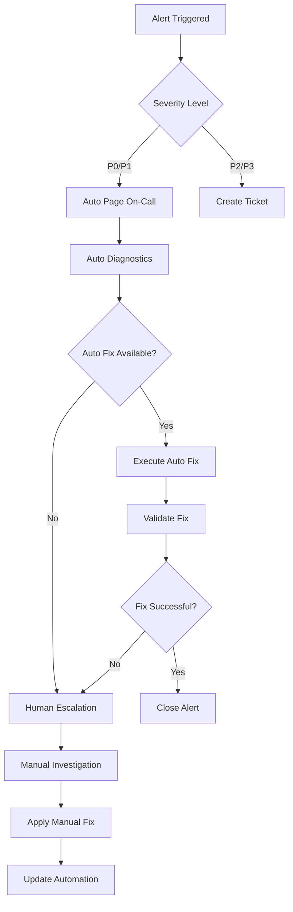

# LeanVibe AI - Operations Playbook

**Status**: Production Ready | **Version**: 1.0 | **Last Updated**: 2025-01-13

## 🎯 Executive Summary

This Operations Playbook provides **comprehensive production operations guidance** for the LeanVibe AI system. Designed for **autonomous operation** with minimal human intervention, this playbook emphasizes **self-healing systems**, **automated recovery**, and **fast incident response**.

### Operational Philosophy
- **Autonomous First**: Systems self-monitor, self-heal, and self-optimize
- **Fast Recovery**: <5 minute MTTR (Mean Time To Recovery)
- **Preventive Actions**: Quality ratchets and performance budgets prevent issues
- **Clear Escalation**: Defined escalation paths with specific triggers
- **Continuous Improvement**: Learn from every incident to prevent recurrence

---

## 📋 Daily Operations Procedures

### Morning Operations Checklist (5 minutes)

```bash
#!/bin/bash
# Daily operations validation script

echo "🌅 LeanVibe AI - Daily Operations Check"
echo "====================================="

# 1. System Health Overview
echo "📊 System Health Status:"
curl -s http://localhost:8765/health/complete | jq '.status'

# 2. Quality Ratchet Status  
echo "🎯 Quality Metrics:"
cd leanvibe-backend && python tools/quality_ratchet.py --report | head -15

# 3. Performance Budget Status
echo "⚡ Performance Budgets:"
python tools/perf_regression.py | grep -E "(✅|❌|⚠️)" | head -5

# 4. Alert Review
echo "🚨 Active Alerts:"
python monitoring/alerts.py --status | grep -E "(CRITICAL|WARNING)"

# 5. Resource Utilization
echo "💾 Resource Status:"
echo "  Memory: $(docker stats --no-stream --format '{{.MemUsage}}' leanvibe-backend || echo 'N/A')"
echo "  Disk: $(df -h / | awk 'NR==2{print $5}' | sed 's/%//')"

echo "✅ Daily check complete!"
```

### Automated Daily Tasks

```yaml
Automated Monitoring (Continuous):
  - Health probes every 60 seconds
  - Performance budget validation every 5 minutes
  - Quality ratchet evaluation on every commit
  - Resource utilization tracking every 30 seconds

Automated Maintenance:
  - Log rotation and cleanup (daily at 2 AM)
  - Database maintenance and optimization (daily at 3 AM)
  - Cache cleanup and warming (daily at 4 AM)
  - Metrics aggregation and archival (daily at 5 AM)

Automated Reporting:
  - Daily health summary email (8 AM)
  - Performance trend analysis (weekly)
  - Quality improvement reports (bi-weekly)
  - Capacity planning recommendations (monthly)
```

---

## 🚨 Incident Response Workflows

### Incident Severity Classification

```yaml
P0 - Critical (Response: Immediate):
  - Complete system outage
  - Data corruption or loss
  - Security breach detected
  - >90% error rate for >2 minutes
  
P1 - High (Response: 15 minutes):
  - Major feature unavailable
  - Performance degradation >50%
  - AI service completely down
  - WebSocket connectivity broken
  
P2 - Medium (Response: 2 hours):
  - Minor feature issues
  - Performance degradation 20-50%
  - Single component degraded
  - Quality ratchet violations
  
P3 - Low (Response: Next business day):
  - Cosmetic issues
  - Performance degradation <20%
  - Minor alerts
  - Documentation updates needed
```

### Automated Incident Response



### Incident Response Procedures

#### P0 - Critical Incident Response

```bash
# Immediate response for critical incidents

# 1. Assess system state
./deploy/synthetic_probes.sh production --critical --timeout=30

# 2. Check for automatic rollback opportunity
if [[ $(curl -s http://localhost:8765/health | jq -r '.status') != "healthy" ]]; then
    echo "🚨 System unhealthy - initiating emergency rollback"
    ./deploy/rollback.sh production
fi

# 3. Activate incident response
python monitoring/alerts.py --escalate --severity=P0

# 4. Start incident timeline
echo "$(date): P0 incident detected" >> incident_$(date +%Y%m%d_%H%M%S).log
```

#### P1 - High Priority Response

```bash
# High priority incident response

# 1. Detailed system diagnostics
python tools/system_diagnostics.py --comprehensive > diagnostics_$(date +%Y%m%d_%H%M%S).txt

# 2. Performance analysis
python tools/perf_regression.py --emergency-analysis

# 3. Quality metric evaluation
python tools/quality_ratchet.py --report --emergency

# 4. Component-specific checks
./scripts/validate_all_dependencies.py --fast-fail
```

### Auto-Healing Actions

```yaml
Memory Issues:
  Trigger: Memory usage >85% for 10 minutes
  Actions:
    1. Clear non-essential caches
    2. Garbage collect AI model instances
    3. Restart WebSocket connections
    4. Scale horizontally if configured
  
Performance Degradation:
  Trigger: P95 response time >2x baseline for 5 minutes
  Actions:
    1. Enable request rate limiting
    2. Warm critical caches
    3. Restart slow components
    4. Redirect traffic to healthy instances
    
Database Issues:
  Trigger: Database connection failures >5 in 1 minute
  Actions:
    1. Restart database connections
    2. Switch to read-only mode if needed
    3. Clear connection pools
    4. Validate database integrity
```

---

## 🚀 Deployment Operations

### Canary Deployment Process

**Location**: `leanvibe-backend/deploy/canary.sh`

#### Pre-Deployment Checklist

```yaml
✅ Quality Gates:
  - All tests passing (4-tier validation)
  - Quality ratchet approval
  - Performance budgets met
  - Security scan clean
  - Code review approved

✅ Environment Preparation:
  - Backup current deployment
  - Validate environment configuration
  - Ensure rollback capability
  - Alert team of deployment window

✅ Monitoring Setup:
  - Synthetic probes ready
  - Alert thresholds configured
  - Dashboard monitoring active
  - Escalation contacts available
```

#### Deployment Execution

```bash
# Canary deployment with automated monitoring
./deploy/canary.sh production <commit_sha>

# The script automatically:
# 1. Validates inputs and environment
# 2. Builds and tags Docker images
# 3. Deploys to 10% of traffic
# 4. Runs comprehensive health checks
# 5. Monitors key metrics for 5 minutes
# 6. Auto-promotes or auto-rollsback based on results
```

#### Post-Deployment Validation

```bash
# Comprehensive post-deployment validation

# 1. Full synthetic probe suite
./deploy/synthetic_probes.sh production --comprehensive

# 2. Performance validation
python tools/perf_regression.py --include-api --baseline=previous

# 3. Quality metrics verification
python tools/quality_ratchet.py --validate-deployment

# 4. End-to-end user journey validation
python tests/test_e2e_workflows.py --production
```

### Rollback Operations

**Location**: `leanvibe-backend/deploy/rollback.sh`

#### Automated Rollback Triggers

```yaml
Performance Triggers:
  - API P95 response time >2000ms for 5 minutes
  - Error rate >5% for 2 minutes
  - WebSocket connection success rate <95%
  
Health Triggers:
  - 3+ critical health probes failing
  - Database connectivity lost
  - AI service unavailable
  
Resource Triggers:
  - Memory usage >95% sustained
  - CPU usage >98% for 3 minutes
  - Disk space <5% available
```

#### Rollback Execution

```bash
# Emergency rollback procedure
./deploy/rollback.sh production

# Rollback process:
# 1. Stop traffic to new version immediately
# 2. Restore previous version from backup
# 3. Validate previous version health
# 4. Clear caches and restart connections
# 5. Run health validation
# 6. Send rollback notifications
# 7. Generate incident report
```

---

## 💾 Backup and Disaster Recovery

### Automated Backup Procedures

```yaml
Configuration Backups (Daily):
  - Application configuration files
  - Environment variables and secrets
  - Database schemas and critical data
  - Docker images and deployment artifacts
  
Code Backups (Continuous):
  - Git repository with all branches
  - Deployment scripts and configurations
  - Documentation and runbooks
  - Test data and fixtures

System State Backups (Hourly):
  - Application logs and metrics
  - Database incremental backups
  - Session state and cache data
  - Monitoring configuration
```

### Disaster Recovery Procedures

#### Complete System Recovery

```bash
#!/bin/bash
# Disaster recovery script

echo "🚨 Initiating disaster recovery for LeanVibe AI"

# 1. Assess damage and determine recovery scope
./scripts/assess_system_damage.py --comprehensive

# 2. Restore from latest backup
./scripts/restore_from_backup.py --latest --validate

# 3. Rebuild from source if needed
if [[ $RESTORE_SUCCESS != "true" ]]; then
    echo "📦 Rebuilding from source..."
    git clone https://github.com/leanvibe/leanvibe-ai.git recovery/
    cd recovery/
    ./install.sh --production
fi

# 4. Validate recovery
./deploy/synthetic_probes.sh production --critical

# 5. Restore traffic gradually
./deploy/canary.sh production --recovery-mode

echo "✅ Disaster recovery completed"
```

#### Database Recovery

```bash
# Database disaster recovery
./scripts/database_recovery.py --emergency

# Recovery steps:
# 1. Stop all database connections
# 2. Assess database corruption level
# 3. Restore from latest consistent backup
# 4. Replay transaction logs if available
# 5. Validate data integrity
# 6. Restart database services
# 7. Warm critical caches
```

### Recovery Time Objectives (RTO)

```yaml
System Recovery Times:
  - Application restart: <2 minutes
  - Database recovery: <10 minutes  
  - Full system recovery: <30 minutes
  - Complete disaster recovery: <2 hours

Data Loss Tolerance (RPO):
  - Configuration changes: <5 minutes
  - User sessions: <15 minutes
  - Development state: <1 hour
  - System logs: <24 hours
```

---

## 📊 Capacity Planning and Scaling

### Resource Monitoring and Thresholds

```yaml
Scaling Triggers:
  CPU Usage:
    Scale Up: >75% average for 15 minutes
    Scale Down: <30% average for 30 minutes
    
  Memory Usage:
    Scale Up: >80% for 10 minutes
    Scale Down: <40% for 30 minutes
    
  Request Volume:
    Scale Up: >80 requests/second sustained
    Scale Down: <20 requests/second sustained
    
  Response Time:
    Scale Up: P95 >600ms for 10 minutes
    Scale Down: P95 <200ms for 30 minutes
```

### Horizontal Scaling Procedures

```bash
# Manual scaling operations

# Scale backend services
docker-compose -f docker-compose.production.yml up -d --scale app=3

# Update load balancer configuration
./scripts/update_load_balancer.py --instances=3

# Validate scaling effectiveness
python tools/perf_regression.py --validate-scaling
```

### Capacity Planning Reports

```bash
# Generate capacity planning report
python tools/capacity_planning.py --analysis-period=30days

# Report includes:
# - Resource utilization trends
# - Growth rate projections
# - Scaling recommendations
# - Cost optimization opportunities
# - Performance bottleneck analysis
```

---

## 🔒 Security Operations

### Security Monitoring

```yaml
Continuous Security Monitoring:
  - Dependency vulnerability scanning (daily)
  - Security probe validation (hourly)
  - Authentication failure monitoring (real-time)
  - Suspicious activity detection (real-time)
  
Security Alerts:
  - Failed authentication attempts >10/minute
  - Unexpected network connections
  - File system modifications outside deployment
  - Memory dump attempts or debugging tools
```

### Security Incident Response

```bash
# Security incident response procedure
./scripts/security_incident_response.py --level=high

# Response steps:
# 1. Isolate affected systems immediately
# 2. Preserve evidence and logs
# 3. Assess scope of potential breach
# 4. Apply security patches if available
# 5. Reset authentication tokens and credentials
# 6. Notify stakeholders per security policy
# 7. Conduct post-incident review
```

### Regular Security Maintenance

```yaml
Weekly Security Tasks:
  - Update security dependencies
  - Review and rotate access credentials
  - Validate backup encryption
  - Test security monitoring alerts
  
Monthly Security Tasks:
  - Comprehensive vulnerability assessment
  - Security configuration review
  - Penetration testing validation
  - Security training review
```

---

## 💰 Cost Optimization Operations

### Resource Optimization

```bash
# Daily cost optimization analysis
python tools/cost_optimization.py --daily-analysis

# Optimization actions:
# - Identify idle resources
# - Optimize AI model instances
# - Right-size container resources
# - Schedule non-critical batch jobs
# - Clean up unused data
```

### Cost Monitoring and Alerts

```yaml
Cost Monitoring:
  - Daily resource usage tracking
  - Monthly budget variance analysis
  - Quarterly cost projection updates
  - Annual cost optimization planning
  
Cost Alerts:
  - Daily spending >120% of budget
  - Resource utilization <50% sustained
  - Unexpected scaling events
  - Storage growth >10% weekly
```

---

## 🔧 Maintenance Windows

### Scheduled Maintenance Operations

```yaml
Daily Maintenance (2-5 AM):
  Duration: 3 hours
  Impact: Minimal (background tasks)
  Tasks:
    - Log rotation and cleanup
    - Database optimization
    - Cache warming and cleanup
    - Metrics aggregation
    - Security updates
    
Weekly Maintenance (Sunday 1-4 AM):
  Duration: 3 hours  
  Impact: Possible brief interruptions
  Tasks:
    - Operating system updates
    - Database maintenance
    - Performance optimization
    - Configuration updates
    - Comprehensive testing
    
Monthly Maintenance (First Sunday 12-6 AM):
  Duration: 6 hours
  Impact: Planned service interruption
  Tasks:
    - Major version updates
    - Infrastructure improvements
    - Disaster recovery testing
    - Comprehensive security audit
    - Performance benchmarking
```

### Maintenance Procedures

```bash
# Pre-maintenance checklist
./scripts/pre_maintenance_checklist.py

# Execute maintenance window
./scripts/maintenance_window.py --type=weekly

# Post-maintenance validation
./deploy/synthetic_probes.sh production --comprehensive
python tools/quality_ratchet.py --post-maintenance-validation
```

---

## 📱 Mobile Operations (iOS)

### iOS App Operations

```yaml
iOS App Monitoring:
  - App Store Connect health monitoring
  - Crash reporting analysis (daily)
  - Performance metrics review
  - User feedback monitoring
  
iOS-Specific Alerts:
  - App crash rate >1% 
  - Voice interface failures >5%
  - WebSocket connection issues
  - Memory usage warnings
```

### iOS Deployment Operations

```bash
# iOS app deployment validation
cd leanvibe-ios/

# 1. Build validation
xcodebuild -project LeanVibe.xcodeproj -scheme LeanVibe build

# 2. Test execution
swift test --enable-code-coverage

# 3. Performance validation
python ../scripts/ios_performance_validation.py

# 4. Device testing
./scripts/ios_device_test_runner.py --production-validation
```

---

## 📞 Escalation Procedures

### On-Call Escalation Matrix

```yaml
Level 1 - Automated Systems (0-5 minutes):
  - Self-healing actions
  - Automatic rollback
  - Cache clearing
  - Service restarts
  
Level 2 - Platform Engineer (5-15 minutes):
  - Advanced diagnostics
  - Manual intervention
  - Configuration changes
  - Stakeholder communication
  
Level 3 - Senior Engineer (15-30 minutes):
  - Architecture decisions
  - Complex troubleshooting
  - Vendor coordination
  - Emergency patches
  
Level 4 - Engineering Manager (30+ minutes):
  - Strategic decisions
  - Customer communication
  - Resource allocation
  - Post-incident planning
```

### Escalation Contact Information

```yaml
# Emergency Contacts (Update as needed)
Platform Engineer:
  Primary: engineering@leanvibe.ai
  Secondary: platform-oncall@leanvibe.ai
  
Senior Engineer:
  Primary: senior-engineer@leanvibe.ai
  Secondary: technical-lead@leanvibe.ai
  
Engineering Manager:
  Primary: engineering-manager@leanvibe.ai
  Secondary: cto@leanvibe.ai

External Support:
  Cloud Provider: cloud-support@provider.com
  Security: security-vendor@security.com
```

### Communication Templates

#### P0 Incident Communication

```
Subject: [P0 INCIDENT] LeanVibe AI System Outage - Initial Response

Team,

We are experiencing a P0 incident affecting the LeanVibe AI system:

Incident ID: INC-2025-0113-001
Start Time: 2025-01-13 15:30 UTC
Impact: [Describe user impact]
Current Status: Investigating

Initial Actions Taken:
- Automated diagnostics executed
- Rollback initiated
- Monitoring increased

Next Update: 16:00 UTC (30 minutes)

Incident Commander: [Name]
```

---

## 📊 Operations Metrics and KPIs

### Operational Excellence KPIs

```yaml
Availability Metrics:
  - System Uptime: Target >99.9%
  - Mean Time Between Failures: Target >7 days
  - Mean Time To Detection: Target <60 seconds
  - Mean Time To Recovery: Target <5 minutes
  
Performance Metrics:
  - Deployment Frequency: Multiple per day
  - Lead Time for Changes: Target <2 hours
  - Change Failure Rate: Target <5%
  - Quality Gate Pass Rate: Target >95%
  
Operational Metrics:
  - Alert Noise Ratio: Target <5%
  - Runbook Accuracy: Target >95%
  - Automation Coverage: Target >80%
  - Documentation Currency: Target >90%
```

### Daily Operations Dashboard

```bash
# Generate operations dashboard
python tools/operations_dashboard.py --daily

# Dashboard includes:
# - System health overview
# - Performance trend analysis
# - Quality metrics summary
# - Alert pattern analysis
# - Resource utilization trends
# - Capacity planning status
```

---

## 📚 Operations Resources

### Essential Commands Reference

```bash
# System Health
curl http://localhost:8000/health/complete
./deploy/synthetic_probes.sh production --comprehensive

# Quality Validation  
python tools/quality_ratchet.py --report
python tools/perf_regression.py --include-api

# Deployment Operations
./deploy/canary.sh production <commit>
./deploy/rollback.sh production

# Incident Response
python monitoring/alerts.py --escalate --severity=P1
./scripts/emergency_diagnostics.py --comprehensive

# Maintenance Operations
./scripts/maintenance_window.py --type=daily
./scripts/backup_and_cleanup.py --comprehensive
```

### Runbook Quick Links

- **[ARCHITECTURE.md](./ARCHITECTURE.md)**: System architecture overview
- **[MONITORING.md](./MONITORING.md)**: Monitoring and alerting guide
- **[TROUBLESHOOTING.md](./TROUBLESHOOTING.md)**: Issue resolution procedures
- **[AGENTS.md](./AGENTS.md)**: Comprehensive system guide

### Configuration Files

- **[budgets/performance_sla.json](./leanvibe-backend/budgets/performance_sla.json)**: Performance budgets
- **[quality_ratchet.json](./leanvibe-backend/quality_ratchet.json)**: Quality standards
- **[docker-compose.yml](./docker-compose.yml)**: Container orchestration
- **[deploy/canary.sh](./leanvibe-backend/deploy/canary.sh)**: Deployment automation

---

## ✅ Operations Checklist Templates

### Weekly Operations Review

```yaml
✅ System Health Review:
  - Review system uptime and availability metrics
  - Analyze performance trends and identify patterns
  - Validate backup procedures and disaster recovery readiness
  - Check capacity utilization and scaling triggers
  
✅ Quality Metrics Review:
  - Review quality ratchet progress and improvements
  - Analyze test execution trends and optimize slow tests
  - Review security scan results and address findings
  - Validate monitoring effectiveness and alert accuracy
  
✅ Operational Process Review:
  - Review incident response effectiveness
  - Update runbooks based on recent experiences
  - Validate escalation procedures and contact information
  - Plan operational improvements for next week
```

### Monthly Operations Assessment

```yaml
✅ Performance Assessment:
  - Comprehensive performance benchmark analysis
  - Capacity planning review and projection updates
  - Cost optimization analysis and recommendations
  - Architecture review for scaling bottlenecks
  
✅ Security Assessment:
  - Comprehensive security audit and vulnerability assessment
  - Access review and credential rotation
  - Security monitoring effectiveness review
  - Disaster recovery testing and validation
  
✅ Process Improvement:
  - Operations metrics analysis and trend identification
  - Automation opportunities identification and planning
  - Team training needs assessment
  - Documentation updates and accuracy validation
```

---

**Last Updated**: 2025-01-13  
**Version**: 1.0  
**Status**: ✅ Production Ready Operations Playbook  
**Next Review**: Monthly operational effectiveness review

This Operations Playbook provides comprehensive guidance for maintaining the LeanVibe AI system in production with emphasis on autonomous operation, fast incident response, and continuous improvement.