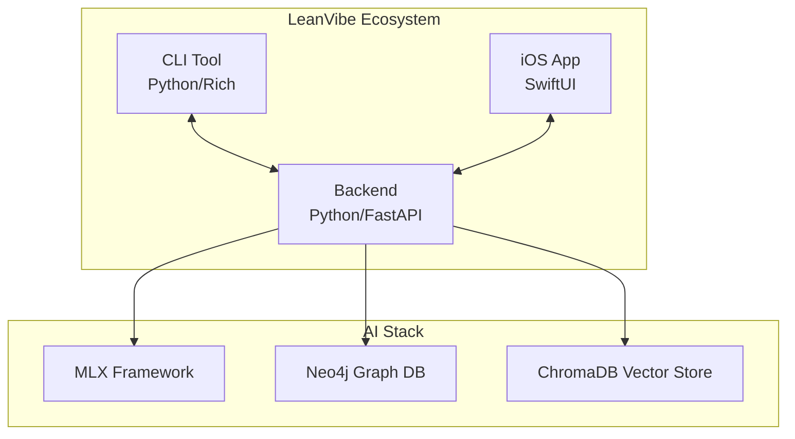

# 🚀 LeanVibe AI

[](https://opensource.org/licenses/MIT)
[](https://www.python.org/downloads/)
[](https://developer.apple.com/ios/)
[](https://swift.org/)

> **Local-first, AI-powered coding assistant designed to provide deep codebase analysis and real-time assistance to developers.**

LeanVibe is a comprehensive development assistant that runs entirely on-device, ensuring code privacy and security while delivering intelligent insights, real-time monitoring, and architectural analysis.

## ✨ Key Features

- **🔒 Privacy-First**: Completely local processing, no data leaves your machine
- **🧠 AI-Powered Analysis**: Deep codebase understanding using Apple Silicon MLX framework
- **📊 Real-Time Monitoring**: Live development insights and performance metrics
- **📱 Multi-Platform**: Backend service, CLI tool, and iOS companion app
- **🏗️ Architecture Visualization**: Interactive diagrams and dependency analysis
- **🎯 Task Management**: Integrated Kanban boards with voice commands
- **🗣️ Voice Integration**: Natural language commands for hands-free development

## 🏗️ Architecture

LeanVibe consists of three main components working together:



## 🚀 Quick Start

### Prerequisites

- **Hardware**: Mac with Apple Silicon (M1/M2/M3/M4)
- **Software**: macOS 13.0+, Python 3.11+, Xcode 15+

### 1. Backend Setup

```bash
cd leanvibe-backend
chmod +x start.sh
./start.sh
```

Verify at: http://localhost:8000/health

### 2. CLI Tool

```bash
cd leanvibe-cli
pip install -e .
leanvibe status
```

### 3. iOS App

```bash
cd leanvibe-ios
open LeanVibe.xcodeproj
# Build and run in Xcode (⌘+R)
```

## 📦 Project Structure

```
leanvibe-ai/
├── 📁 leanvibe-backend/     # Core AI backend service
│   ├── app/                 # FastAPI application
│   ├── tests/              # Comprehensive test suite
│   └── README.md           # Backend-specific documentation
├── 📁 leanvibe-cli/        # Command-line interface
│   ├── leanvibe_cli/       # CLI source code
│   ├── tests/              # CLI tests
│   └── README.md           # CLI-specific documentation
├── 📁 leanvibe-ios/        # iOS companion app
│   ├── LeanVibe/           # SwiftUI app source
│   ├── LeanVibeTests/      # iOS tests
│   └── README.md           # iOS-specific documentation
├── 📁 docs/                # Project documentation
│   └── archive/            # Historical documentation
└── 📁 .claude/             # AI agent configuration
```

## 🛠️ Technology Stack

### Backend
- **Framework**: FastAPI, Uvicorn
- **AI/ML**: MLX (Apple Silicon), Pydantic.ai
- **Databases**: Neo4j (graph), ChromaDB (vector)
- **Language**: Python 3.11+
- **Tools**: `uv` (package management), `ruff` (linting), `pytest` (testing)

### CLI
- **Framework**: Click (commands), Rich (UI)
- **Features**: Interactive dashboards, real-time monitoring
- **Language**: Python 3.11+

### iOS App
- **Framework**: SwiftUI (iOS 17+)
- **Communication**: WebSocket client
- **Language**: Swift 6
- **Features**: Voice commands, real-time metrics, Kanban boards

## 🔧 Development Workflow

### Quality Checks
```bash
# Backend
cd leanvibe-backend
ruff check . --fix && ruff format .
python run_tests.py

# iOS
open leanvibe-ios/LeanVibe.xcodeproj
# Use Xcode: Build (⌘+B), Test (⌘+U)
```

### Branching Strategy
- `main` - Production-ready code
- `develop` - Integration branch
- `feature/*` - New features
- `fix/*` - Bug fixes

### Commit Convention
```
feat: add new feature
fix: resolve bug
docs: update documentation
test: add/update tests
refactor: improve code structure
```

## 🚀 Getting Started Guide

1. **Clone the repository**
   ```bash
   git clone https://github.com/LeanVibe/leanvibe-ai.git
   cd leanvibe-ai
   ```

2. **Start the backend**
   ```bash
   cd leanvibe-backend
   ./start.sh
   ```

3. **Install CLI**
   ```bash
   cd leanvibe-cli
   pip install -e .
   ```

4. **Connect and explore**
   ```bash
   leanvibe status      # Check connection
   leanvibe analyze     # Analyze current project
   leanvibe monitor     # Start real-time monitoring
   ```

## 📱 Component Documentation

| Component | Description | Documentation |
|-----------|-------------|---------------|
| **Backend** | Core AI service with MLX integration | [Backend README](leanvibe-backend/README.md) |
| **CLI** | Terminal interface for developers | [CLI README](leanvibe-cli/README.md) |
| **iOS App** | Mobile companion with voice features | [iOS README](leanvibe-ios/README.md) |

## 🔍 Key Capabilities

### AI-Powered Analysis
- **Code Understanding**: Deep AST analysis and semantic understanding
- **Architecture Insights**: Automatic dependency mapping and visualization
- **Intelligent Suggestions**: Context-aware recommendations

### Real-Time Features
- **Live Monitoring**: File changes, build status, performance metrics
- **Voice Commands**: "Hey Lean, analyze this function"
- **WebSocket Integration**: Instant updates across all clients

### Privacy & Security
- **Local Processing**: No external API calls or data transmission
- **On-Device AI**: All models run locally using Apple Silicon
- **Zero Telemetry**: Complete privacy and security

## 🤝 Contributing

We welcome contributions! Please see our contributing guidelines in each component:

- [Backend Contributing](leanvibe-backend/README.md#contributing)
- [CLI Contributing](leanvibe-cli/README.md#contributing)
- [iOS Contributing](leanvibe-ios/README.md#contributing)

## 📄 License

This project is licensed under the MIT License - see the [LICENSE](LICENSE) file for details.

## 🆘 Support & Troubleshooting

### Common Issues

**Backend not starting?**
```bash
cd leanvibe-backend
lsof -ti:8000 | xargs kill -9  # Kill existing processes
uv sync                        # Sync dependencies
./start.sh                     # Restart
```

**iOS build errors?**
```bash
# Clean build folder in Xcode
# Product > Clean Build Folder
# Then rebuild (⌘+B)
```

### Need Help?

- 📖 Check component-specific README files
- 🐛 Report issues on GitHub
- 💬 Join our community discussions

---

**Made with ❤️ for developers who value privacy and productivity**

> LeanVibe - Your local AI coding companion