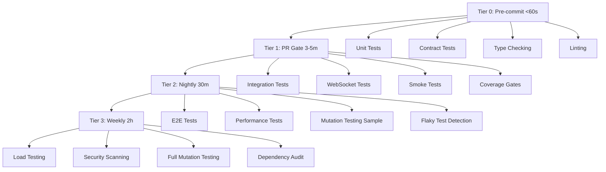

# LeanVibe Testing Guide

Comprehensive testing strategy guide for LeanVibe's 4-tier autonomous testing system. This guide covers everything from writing effective unit tests to developing synthetic probes for production monitoring.

## 🧪 Testing Philosophy

### Core Principles
- **Test Pyramid**: Fast unit tests form the foundation, comprehensive E2E tests at the top
- **Autonomous Quality**: Tests run automatically with quality ratchets preventing regression
- **Contract-First**: API contracts drive test development and validation
- **Fast Feedback**: Tier 0 tests complete in <60s for rapid development loops
- **Continuous Validation**: 4-tier system provides layered confidence

### Quality Targets
- **Test Coverage**: ≥75% (enforced), target 85%
- **Mutation Score**: ≥70% (weekly validation) 
- **Test Execution Speed**: Tier 0 <60s, Tier 1 <5m
- **Flaky Test Rate**: <1% of total test suite
- **Test Reliability**: 99.9% pass rate in CI

## 📊 4-Tier Testing System

### Overview


### Tier 0: Pre-Commit Tests (<60s)
**Purpose**: Fast feedback for developer inner loop
**Frequency**: Every commit via git hooks
**Target Time**: <60 seconds

```bash
# Run Tier 0 tests
vf  # Developer shortcut
make test-tier0  # Direct command
```

**Test Categories:**
- **Unit Tests** - Isolated function/class testing
- **Contract Tests** - API specification validation
- **Type Checking** - Static type analysis with mypy
- **Code Quality** - Linting, formatting, imports

**Quality Gates:**
- All unit tests must pass
- Contract validation successful
- No type errors
- Code style compliance

### Tier 1: PR Gate Tests (3-5m)
**Purpose**: Integration validation before merge
**Frequency**: Every PR automatically
**Target Time**: 3-5 minutes

```bash
# Run Tier 1 tests
vp  # Developer shortcut
make test-tier1  # Direct command
```

**Test Categories:**
- **Integration Tests** - Cross-component validation
- **WebSocket Tests** - Real-time communication
- **Smoke Tests** - Critical path verification
- **Coverage Analysis** - Quality ratchet enforcement

**Quality Gates:**
- All integration tests pass
- Coverage ≥75% (enforced by quality ratchet)
- No flaky test failures
- Performance within budgets

### Tier 2: Nightly Tests (30m)
**Purpose**: Regression detection and quality assurance
**Frequency**: Daily at 2 AM UTC
**Target Time**: 30 minutes

```bash
# Run Tier 2 tests
make test-tier2
```

**Test Categories:**
- **End-to-End Tests** - Complete user workflows
- **Performance Tests** - Response time and throughput
- **Mutation Testing Sample** - Test quality validation (5%)
- **Flaky Test Detection** - Reliability monitoring

**Quality Gates:**
- E2E scenarios complete successfully
- No performance regressions >10%
- Mutation score maintains ≥70%
- Flaky test rate <1%

### Tier 3: Weekly Tests (2h)
**Purpose**: Comprehensive validation and maintenance
**Frequency**: Sunday at 1 AM UTC
**Target Time**: 2 hours

```bash
# Run Tier 3 tests
make test-tier3
```

**Test Categories:**
- **Load Testing** - System under stress
- **Security Scanning** - Vulnerability detection
- **Full Mutation Testing** - Complete test quality (100%)
- **Dependency Audit** - Security and license compliance

**Quality Gates:**
- System handles expected load
- Zero critical security vulnerabilities
- Mutation score improvement or maintenance
- All dependencies secure and up-to-date

## 🧪 Writing Effective Tests

### Unit Tests

#### Test Structure (Given-When-Then)
```python
# tests/test_task_service.py
import pytest
from unittest.mock import Mock, patch
from app.services.task_service import TaskService
from app.models.task_models import CreateTaskRequest, Task, TaskStatus

class TestTaskService:
    def test_create_task_success(self):
        """Test successful task creation with valid input."""
        # Given - Setup test data and dependencies
        service = TaskService()
        request = CreateTaskRequest(
            title="Test Task",
            description="Test Description",
            priority="high"
        )
        
        # When - Execute the operation
        result = service.create_task(request)
        
        # Then - Verify the outcome
        assert isinstance(result, Task)
        assert result.title == "Test Task"
        assert result.description == "Test Description"
        assert result.status == TaskStatus.PENDING
        assert result.id is not None
        assert result.created_at is not None

    def test_create_task_with_invalid_priority_raises_error(self):
        """Test task creation fails with invalid priority."""
        # Given
        service = TaskService()
        request = CreateTaskRequest(
            title="Test Task",
            description="Test Description", 
            priority="invalid_priority"
        )
        
        # When/Then - Verify exception is raised
        with pytest.raises(ValueError, match="Invalid priority"):
            service.create_task(request)

    @patch('app.services.task_service.database')
    def test_create_task_database_error_handling(self, mock_db):
        """Test task creation handles database errors gracefully."""
        # Given
        mock_db.session.return_value.__enter__.return_value.add.side_effect = Exception("DB Error")
        service = TaskService()
        request = CreateTaskRequest(title="Test", description="Test")
        
        # When/Then
        with pytest.raises(DatabaseError):
            service.create_task(request)
```

#### Parameterized Tests
```python
@pytest.mark.parametrize("priority,expected_score", [
    ("low", 1),
    ("medium", 5),
    ("high", 10),
    ("critical", 20),
])
def test_priority_scoring(priority, expected_score):
    """Test priority scoring calculation."""
    score = TaskService.calculate_priority_score(priority)
    assert score == expected_score

@pytest.mark.parametrize("invalid_input", [
    ("", "Title cannot be empty"),
    ("x" * 1001, "Title too long"),
    (None, "Title is required"),
])
def test_task_validation_errors(invalid_input, expected_error):
    """Test various task validation scenarios."""
    with pytest.raises(ValidationError, match=expected_error):
        TaskService.validate_task_title(invalid_input)
```

#### Fixtures for Test Data
```python
# conftest.py
@pytest.fixture
def sample_task():
    """Provide a sample task for testing."""
    return Task(
        id="test-task-123",
        title="Sample Task",
        description="Sample Description",
        status=TaskStatus.PENDING,
        priority="medium"
    )

@pytest.fixture
def task_service():
    """Provide a configured task service instance."""
    return TaskService(database_url="sqlite:///:memory:")

@pytest.fixture
def mock_database():
    """Provide a mock database for testing."""
    with patch('app.services.task_service.database') as mock_db:
        yield mock_db
```

### Integration Tests

#### API Endpoint Testing
```python
# tests/test_task_api_integration.py
import pytest
from fastapi.testclient import TestClient
from app.main import app
from app.auth.api_key_auth import get_api_key
from tests.conftest import override_get_api_key

client = TestClient(app)

class TestTaskAPI:
    def test_create_task_endpoint_success(self):
        """Test successful task creation via API."""
        # Given
        task_data = {
            "title": "Integration Test Task",
            "description": "Testing API endpoint",
            "priority": "high"
        }
        
        # When
        response = client.post(
            "/api/v1/tasks",
            json=task_data,
            headers={"Authorization": "Bearer test-api-key"}
        )
        
        # Then
        assert response.status_code == 201
        data = response.json()
        assert data["title"] == task_data["title"]
        assert data["status"] == "pending"
        assert "id" in data
        assert "created_at" in data

    def test_get_tasks_with_filtering(self):
        """Test task retrieval with query parameters."""
        # Given - Create test tasks
        for i in range(3):
            client.post("/api/v1/tasks", json={
                "title": f"Task {i}",
                "priority": "high" if i % 2 == 0 else "low"
            }, headers={"Authorization": "Bearer test-api-key"})
        
        # When
        response = client.get(
            "/api/v1/tasks?status=pending&priority=high",
            headers={"Authorization": "Bearer test-api-key"}
        )
        
        # Then
        assert response.status_code == 200
        tasks = response.json()["tasks"]
        assert len(tasks) == 2  # Only high priority tasks
        assert all(task["priority"] == "high" for task in tasks)

    def test_unauthorized_request_returns_401(self):
        """Test API returns 401 for unauthorized requests."""
        response = client.post("/api/v1/tasks", json={"title": "Test"})
        assert response.status_code == 401
```

#### Database Integration Tests
```python
# tests/test_database_integration.py
import pytest
from sqlalchemy import create_engine, text
from app.core.database import get_database_session
from app.models.task_models import Task

class TestDatabaseIntegration:
    @pytest.fixture(autouse=True)
    def setup_database(self):
        """Set up test database for each test."""
        self.engine = create_engine("sqlite:///:memory:")
        # Create tables
        Task.metadata.create_all(self.engine)
        yield
        # Cleanup after test
        self.engine.dispose()

    def test_task_crud_operations(self):
        """Test complete CRUD operations on tasks."""
        with get_database_session() as session:
            # Create
            task = Task(
                title="CRUD Test Task",
                description="Testing database operations"
            )
            session.add(task)
            session.commit()
            assert task.id is not None
            
            # Read
            retrieved_task = session.get(Task, task.id)
            assert retrieved_task.title == "CRUD Test Task"
            
            # Update
            retrieved_task.status = TaskStatus.IN_PROGRESS
            session.commit()
            
            updated_task = session.get(Task, task.id)
            assert updated_task.status == TaskStatus.IN_PROGRESS
            
            # Delete
            session.delete(updated_task)
            session.commit()
            
            deleted_task = session.get(Task, task.id)
            assert deleted_task is None
```

### Contract Tests

#### OpenAPI Contract Validation
```python
# tests/test_contracts.py
import json
import pytest
from openapi_spec_validator import validate_spec, ValidationError
from app.contracts import get_openapi_spec
from fastapi.testclient import TestClient
from app.main import app

client = TestClient(app)

class TestAPIContracts:
    def test_openapi_specification_is_valid(self):
        """Ensure OpenAPI specification follows standard."""
        spec = get_openapi_spec()
        try:
            validate_spec(spec)
        except ValidationError as e:
            pytest.fail(f"OpenAPI spec is invalid: {e}")

    def test_task_creation_matches_contract(self):
        """Validate task creation response matches OpenAPI schema."""
        # Given
        spec = get_openapi_spec()
        task_schema = spec["components"]["schemas"]["Task"]
        
        # When
        response = client.post("/api/v1/tasks", json={
            "title": "Contract Test",
            "description": "Testing contract compliance"
        }, headers={"Authorization": "Bearer test-key"})
        
        # Then
        assert response.status_code == 201
        task_data = response.json()
        
        # Validate against schema
        self._validate_against_schema(task_data, task_schema)

    def test_all_endpoints_return_valid_responses(self):
        """Test all API endpoints return contract-compliant responses."""
        spec = get_openapi_spec()
        
        for path, methods in spec["paths"].items():
            for method, operation in methods.items():
                if method.upper() in ["GET", "POST", "PUT", "DELETE"]:
                    self._test_endpoint_contract_compliance(
                        method.upper(), path, operation
                    )

    def _validate_against_schema(self, data, schema):
        """Helper to validate data against JSON schema."""
        from jsonschema import validate as validate_json_schema
        validate_json_schema(data, schema)

    def _test_endpoint_contract_compliance(self, method, path, operation):
        """Helper to test individual endpoint contract compliance."""
        # Implementation depends on specific endpoint requirements
        # This would test that actual responses match OpenAPI definitions
        pass
```

#### AsyncAPI WebSocket Contract Tests
```python
# tests/test_websocket_contracts.py
import pytest
import json
from fastapi.testclient import TestClient
from app.main import app
from app.contracts import get_asyncapi_spec

class TestWebSocketContracts:
    def test_websocket_message_schemas(self):
        """Test WebSocket messages follow AsyncAPI specification."""
        # Given
        spec = get_asyncapi_spec()
        task_update_schema = spec["components"]["schemas"]["TaskUpdateEvent"]
        
        with TestClient(app).websocket_connect("/ws") as websocket:
            # Send task update
            update_message = {
                "type": "task_update",
                "data": {
                    "task_id": "test-123",
                    "status": "completed",
                    "updated_at": "2024-01-01T10:00:00Z"
                }
            }
            websocket.send_json(update_message)
            
            # Receive response
            response = websocket.receive_json()
            
            # Validate against AsyncAPI schema
            self._validate_websocket_message(response, task_update_schema)

    def test_websocket_event_flow(self):
        """Test complete WebSocket event flow follows contract."""
        with TestClient(app).websocket_connect("/ws") as websocket:
            # Test connection established message
            connection_msg = websocket.receive_json()
            assert connection_msg["type"] == "connection_established"
            
            # Test subscription to task updates
            websocket.send_json({
                "type": "subscribe",
                "channel": "tasks"
            })
            
            ack_msg = websocket.receive_json()
            assert ack_msg["type"] == "subscription_confirmed"
            assert ack_msg["channel"] == "tasks"
```

### End-to-End Tests

#### User Workflow Tests
```python
# tests/test_e2e_workflows.py
import pytest
from fastapi.testclient import TestClient
from app.main import app

class TestCompleteWorkflows:
    def test_complete_task_lifecycle(self):
        """Test complete task lifecycle from creation to completion."""
        client = TestClient(app)
        headers = {"Authorization": "Bearer test-api-key"}
        
        # Step 1: Create task
        create_response = client.post("/api/v1/tasks", json={
            "title": "E2E Test Task",
            "description": "Complete workflow test",
            "priority": "high"
        }, headers=headers)
        
        assert create_response.status_code == 201
        task = create_response.json()
        task_id = task["id"]
        
        # Step 2: Retrieve task
        get_response = client.get(f"/api/v1/tasks/{task_id}", headers=headers)
        assert get_response.status_code == 200
        assert get_response.json()["title"] == "E2E Test Task"
        
        # Step 3: Update task status
        update_response = client.patch(f"/api/v1/tasks/{task_id}", json={
            "status": "in_progress"
        }, headers=headers)
        assert update_response.status_code == 200
        
        # Step 4: Complete task
        complete_response = client.patch(f"/api/v1/tasks/{task_id}", json={
            "status": "completed"
        }, headers=headers)
        assert complete_response.status_code == 200
        
        # Step 5: Verify task completion
        final_response = client.get(f"/api/v1/tasks/{task_id}", headers=headers)
        final_task = final_response.json()
        assert final_task["status"] == "completed"
        assert final_task["completed_at"] is not None

    def test_websocket_real_time_updates(self):
        """Test real-time updates via WebSocket during task operations."""
        client = TestClient(app)
        headers = {"Authorization": "Bearer test-api-key"}
        
        with client.websocket_connect("/ws") as websocket:
            # Subscribe to task updates
            websocket.send_json({"type": "subscribe", "channel": "tasks"})
            websocket.receive_json()  # Subscription confirmation
            
            # Create task via REST API
            create_response = client.post("/api/v1/tasks", json={
                "title": "WebSocket Test Task"
            }, headers=headers)
            task_id = create_response.json()["id"]
            
            # Verify WebSocket received creation event
            create_event = websocket.receive_json()
            assert create_event["type"] == "task_created"
            assert create_event["data"]["task_id"] == task_id
            
            # Update task via REST API
            client.patch(f"/api/v1/tasks/{task_id}", json={
                "status": "completed"
            }, headers=headers)
            
            # Verify WebSocket received update event
            update_event = websocket.receive_json()
            assert update_event["type"] == "task_updated"
            assert update_event["data"]["task_id"] == task_id
            assert update_event["data"]["status"] == "completed"
```

### Performance Tests

#### Load Testing
```python
# tests/test_performance.py
import pytest
import asyncio
import aiohttp
import time
from concurrent.futures import ThreadPoolExecutor
from statistics import mean, stdev

class TestPerformance:
    @pytest.mark.performance
    def test_api_response_times(self):
        """Test API endpoints meet response time requirements."""
        base_url = "http://localhost:8000"
        headers = {"Authorization": "Bearer test-api-key"}
        
        endpoints = [
            ("GET", "/health"),
            ("GET", "/api/v1/tasks"),
            ("POST", "/api/v1/tasks", {"title": "Perf Test"}),
        ]
        
        for method, path, *data in endpoints:
            response_times = []
            
            for _ in range(10):  # 10 requests per endpoint
                start_time = time.time()
                
                if method == "GET":
                    response = requests.get(f"{base_url}{path}", headers=headers)
                elif method == "POST":
                    response = requests.post(
                        f"{base_url}{path}", 
                        json=data[0] if data else None, 
                        headers=headers
                    )
                
                response_time = (time.time() - start_time) * 1000  # ms
                response_times.append(response_time)
                
                assert response.status_code < 400
            
            # Performance assertions
            avg_response_time = mean(response_times)
            p95_response_time = sorted(response_times)[int(0.95 * len(response_times))]
            
            # Log metrics for monitoring
            print(f"{method} {path}: avg={avg_response_time:.2f}ms, p95={p95_response_time:.2f}ms")
            
            # Assert performance budgets
            if path == "/health":
                assert p95_response_time < 100  # Health check should be very fast
            else:
                assert p95_response_time < 500  # API endpoints under 500ms

    @pytest.mark.performance
    async def test_concurrent_load(self):
        """Test system behavior under concurrent load."""
        base_url = "http://localhost:8000"
        headers = {"Authorization": "Bearer test-api-key"}
        
        async def make_request(session, task_id):
            """Make concurrent request."""
            try:
                async with session.post(
                    f"{base_url}/api/v1/tasks",
                    json={"title": f"Concurrent Task {task_id}"},
                    headers=headers
                ) as response:
                    return response.status, await response.json()
            except Exception as e:
                return 500, {"error": str(e)}
        
        # Test with 50 concurrent requests
        async with aiohttp.ClientSession() as session:
            start_time = time.time()
            
            tasks = [make_request(session, i) for i in range(50)]
            results = await asyncio.gather(*tasks)
            
            total_time = time.time() - start_time
            
            # Analyze results
            success_count = sum(1 for status, _ in results if status < 400)
            error_count = len(results) - success_count
            
            # Performance assertions
            assert success_count >= 48  # 96% success rate minimum
            assert error_count <= 2     # Max 2 failures acceptable
            assert total_time < 10      # Complete within 10 seconds
            
            throughput = len(results) / total_time
            print(f"Throughput: {throughput:.2f} requests/second")
```

### Mutation Testing

#### Test Quality Validation
```python
# tests/test_mutation_examples.py
"""
Examples of tests that pass mutation testing.
These tests are designed to catch mutations in the code.
"""

def test_calculate_priority_score_boundary_conditions():
    """Test priority score calculation with boundary values."""
    from app.services.task_service import TaskService
    
    # Test each priority level explicitly
    assert TaskService.calculate_priority_score("low") == 1
    assert TaskService.calculate_priority_score("medium") == 5
    assert TaskService.calculate_priority_score("high") == 10
    assert TaskService.calculate_priority_score("critical") == 20
    
    # Test case sensitivity (catches string comparison mutations)
    with pytest.raises(ValueError):
        TaskService.calculate_priority_score("LOW")
    
    # Test invalid input (catches exception handling mutations)
    with pytest.raises(ValueError):
        TaskService.calculate_priority_score("invalid")
    
    # Test None input (catches null checking mutations)
    with pytest.raises(ValueError):
        TaskService.calculate_priority_score(None)

def test_task_status_transitions():
    """Test valid and invalid task status transitions."""
    from app.services.task_service import TaskService
    
    service = TaskService()
    
    # Test valid transitions (catches logic mutations)
    assert service.can_transition("pending", "in_progress") == True
    assert service.can_transition("in_progress", "completed") == True
    assert service.can_transition("pending", "cancelled") == True
    
    # Test invalid transitions (catches condition mutations)
    assert service.can_transition("completed", "in_progress") == False
    assert service.can_transition("cancelled", "in_progress") == False
    
    # Test same status (catches equality mutations)
    assert service.can_transition("pending", "pending") == False
```

### Synthetic Probes (Production Monitoring)

#### Health Check Probes
```python
# monitoring/synthetic_probes.py
import requests
import time
import logging
from typing import Dict, List
from dataclasses import dataclass

@dataclass
class ProbeResult:
    name: str
    success: bool
    response_time_ms: float
    status_code: int = None
    error_message: str = None

class SyntheticProbes:
    """Production monitoring probes that run continuously."""
    
    def __init__(self, base_url: str, api_key: str):
        self.base_url = base_url
        self.headers = {"Authorization": f"Bearer {api_key}"}
        
    def run_all_probes(self) -> List[ProbeResult]:
        """Run all synthetic probes and return results."""
        probes = [
            self.health_probe,
            self.api_functionality_probe,
            self.websocket_probe,
            self.database_probe,
            self.performance_probe,
        ]
        
        results = []
        for probe in probes:
            try:
                result = probe()
                results.append(result)
            except Exception as e:
                results.append(ProbeResult(
                    name=probe.__name__,
                    success=False,
                    response_time_ms=0,
                    error_message=str(e)
                ))
                
        return results
    
    def health_probe(self) -> ProbeResult:
        """Basic health check probe."""
        start_time = time.time()
        
        try:
            response = requests.get(
                f"{self.base_url}/health",
                timeout=5
            )
            
            response_time = (time.time() - start_time) * 1000
            
            return ProbeResult(
                name="health_check",
                success=response.status_code == 200,
                response_time_ms=response_time,
                status_code=response.status_code
            )
            
        except requests.RequestException as e:
            return ProbeResult(
                name="health_check",
                success=False,
                response_time_ms=(time.time() - start_time) * 1000,
                error_message=str(e)
            )
    
    def api_functionality_probe(self) -> ProbeResult:
        """Test critical API functionality."""
        start_time = time.time()
        
        try:
            # Create a test task
            create_response = requests.post(
                f"{self.base_url}/api/v1/tasks",
                json={
                    "title": "Synthetic Probe Test",
                    "description": "Automated monitoring test"
                },
                headers=self.headers,
                timeout=10
            )
            
            if create_response.status_code != 201:
                raise Exception(f"Task creation failed: {create_response.status_code}")
            
            task_id = create_response.json()["id"]
            
            # Retrieve the task
            get_response = requests.get(
                f"{self.base_url}/api/v1/tasks/{task_id}",
                headers=self.headers,
                timeout=5
            )
            
            if get_response.status_code != 200:
                raise Exception(f"Task retrieval failed: {get_response.status_code}")
            
            # Clean up - delete the test task
            requests.delete(
                f"{self.base_url}/api/v1/tasks/{task_id}",
                headers=self.headers,
                timeout=5
            )
            
            response_time = (time.time() - start_time) * 1000
            
            return ProbeResult(
                name="api_functionality",
                success=True,
                response_time_ms=response_time,
                status_code=200
            )
            
        except Exception as e:
            return ProbeResult(
                name="api_functionality",
                success=False,
                response_time_ms=(time.time() - start_time) * 1000,
                error_message=str(e)
            )
    
    def websocket_probe(self) -> ProbeResult:
        """Test WebSocket connectivity and messaging."""
        import websocket
        
        start_time = time.time()
        
        try:
            ws_url = self.base_url.replace("http", "ws") + "/ws"
            ws = websocket.create_connection(ws_url, timeout=10)
            
            # Send test message
            test_message = {"type": "ping", "timestamp": time.time()}
            ws.send(json.dumps(test_message))
            
            # Receive response
            response = ws.recv()
            ws.close()
            
            response_time = (time.time() - start_time) * 1000
            
            return ProbeResult(
                name="websocket_connectivity",
                success=True,
                response_time_ms=response_time
            )
            
        except Exception as e:
            return ProbeResult(
                name="websocket_connectivity",
                success=False,
                response_time_ms=(time.time() - start_time) * 1000,
                error_message=str(e)
            )
    
    def database_probe(self) -> ProbeResult:
        """Test database connectivity and performance."""
        start_time = time.time()
        
        try:
            response = requests.get(
                f"{self.base_url}/health/database",
                timeout=10
            )
            
            response_time = (time.time() - start_time) * 1000
            
            if response.status_code != 200:
                raise Exception(f"Database health check failed: {response.status_code}")
            
            health_data = response.json()
            if not health_data.get("database_connected"):
                raise Exception("Database connection check failed")
            
            return ProbeResult(
                name="database_connectivity",
                success=True,
                response_time_ms=response_time,
                status_code=response.status_code
            )
            
        except Exception as e:
            return ProbeResult(
                name="database_connectivity",
                success=False,
                response_time_ms=(time.time() - start_time) * 1000,
                error_message=str(e)
            )
    
    def performance_probe(self) -> ProbeResult:
        """Test system performance characteristics."""
        start_time = time.time()
        
        try:
            # Test multiple endpoints for performance
            endpoints = ["/health", "/api/v1/tasks"]
            total_requests = 0
            total_time = 0
            
            for endpoint in endpoints:
                for _ in range(5):  # 5 requests per endpoint
                    request_start = time.time()
                    response = requests.get(
                        f"{self.base_url}{endpoint}",
                        headers=self.headers if endpoint != "/health" else {},
                        timeout=5
                    )
                    request_time = time.time() - request_start
                    
                    if response.status_code >= 400:
                        raise Exception(f"Performance test failed for {endpoint}")
                    
                    total_requests += 1
                    total_time += request_time
            
            avg_response_time = (total_time / total_requests) * 1000
            total_probe_time = (time.time() - start_time) * 1000
            
            # Performance threshold check
            if avg_response_time > 1000:  # 1 second threshold
                raise Exception(f"Average response time too high: {avg_response_time:.2f}ms")
            
            return ProbeResult(
                name="performance_check",
                success=True,
                response_time_ms=total_probe_time
            )
            
        except Exception as e:
            return ProbeResult(
                name="performance_check",
                success=False,
                response_time_ms=(time.time() - start_time) * 1000,
                error_message=str(e)
            )

# Production monitoring script
if __name__ == "__main__":
    import os
    import json
    
    base_url = os.getenv("LEANVIBE_API_URL", "https://api.leanvibe.ai")
    api_key = os.getenv("LEANVIBE_API_KEY")
    
    if not api_key:
        print("ERROR: LEANVIBE_API_KEY environment variable required")
        exit(1)
    
    probes = SyntheticProbes(base_url, api_key)
    results = probes.run_all_probes()
    
    # Output results for monitoring system
    output = {
        "timestamp": time.time(),
        "overall_success": all(result.success for result in results),
        "results": [
            {
                "name": result.name,
                "success": result.success,
                "response_time_ms": result.response_time_ms,
                "status_code": result.status_code,
                "error_message": result.error_message
            }
            for result in results
        ]
    }
    
    print(json.dumps(output, indent=2))
    
    # Exit with error code if any probes failed
    if not output["overall_success"]:
        exit(1)
```

## 🔧 Test Configuration and Tools

### pytest Configuration
```ini
# pytest.ini
[tool:pytest]
minversion = 6.0
addopts = 
    -ra
    --strict-markers
    --strict-config
    --cov=app
    --cov-report=term-missing
    --cov-report=html:test_results/coverage_html
    --cov-report=xml:test_results/coverage.xml
testpaths = tests
python_files = test_*.py
python_classes = Test*
python_functions = test_*
markers =
    unit: Unit tests (fast, isolated)
    integration: Integration tests (cross-component)
    e2e: End-to-end tests (full workflows)
    performance: Performance and load tests
    contract: Contract validation tests
    websocket: WebSocket functionality tests
    smoke: Smoke tests (critical paths)
    flaky: Tests marked as flaky (quarantined)
    slow: Tests that take >5 seconds
filterwarnings =
    error
    ignore::DeprecationWarning
    ignore::PendingDeprecationWarning
```

### Coverage Configuration
```ini
# .coveragerc
[run]
source = app
omit = 
    */tests/*
    */venv/*
    */migrations/*
    */__pycache__/*
    */conftest.py

[report]
exclude_lines =
    pragma: no cover
    def __repr__
    raise AssertionError
    raise NotImplementedError
    if __name__ == .__main__.:
    class .*\bProtocol\):
    @(abc\.)?abstractmethod

[html]
directory = test_results/coverage_html
```

### Quality Ratchet Integration
```python
# tools/quality_ratchet.py integration example
def validate_test_quality():
    """Validate test suite meets quality standards."""
    current_metrics = collect_test_metrics()
    
    # Coverage validation
    if current_metrics.coverage_percent < QUALITY_RATCHET['coverage_min']:
        raise QualityGateError(f"Coverage {current_metrics.coverage_percent}% below minimum {QUALITY_RATCHET['coverage_min']}%")
    
    # Mutation score validation (if available)
    if current_metrics.mutation_score < QUALITY_RATCHET['mutation_score_min']:
        raise QualityGateError(f"Mutation score {current_metrics.mutation_score}% below minimum {QUALITY_RATCHET['mutation_score_min']}%")
    
    # Test execution time validation
    if current_metrics.tier0_execution_time > 60:
        raise QualityGateError(f"Tier 0 tests took {current_metrics.tier0_execution_time}s (max 60s)")
    
    # Flaky test validation
    if current_metrics.flaky_test_count > QUALITY_RATCHET['flaky_test_max']:
        raise QualityGateError(f"Too many flaky tests: {current_metrics.flaky_test_count} (max {QUALITY_RATCHET['flaky_test_max']})")
```

## 🚀 Advanced Testing Techniques

### Flaky Test Detection and Management
```python
# tools/flaky_detector.py
import json
import pytest
from collections import defaultdict, Counter

class FlakyTestDetector:
    """Detects and manages flaky tests."""
    
    def __init__(self, results_file="test_results/flaky_tests.json"):
        self.results_file = results_file
        self.load_historical_data()
    
    def analyze_test_run(self, pytest_json_report):
        """Analyze test run for flaky behavior."""
        for test in pytest_json_report["tests"]:
            test_id = f"{test['nodeid']}"
            outcome = test["outcome"]
            
            # Track test outcomes
            self.test_history[test_id].append(outcome)
            
            # Keep only recent history (last 50 runs)
            if len(self.test_history[test_id]) > 50:
                self.test_history[test_id] = self.test_history[test_id][-50:]
        
        self.save_historical_data()
        return self.identify_flaky_tests()
    
    def identify_flaky_tests(self):
        """Identify tests with inconsistent outcomes."""
        flaky_tests = []
        
        for test_id, outcomes in self.test_history.items():
            if len(outcomes) < 10:  # Need enough history
                continue
            
            outcome_counts = Counter(outcomes)
            failure_rate = outcome_counts["failed"] / len(outcomes)
            
            # Consider flaky if fails 5-95% of the time
            if 0.05 <= failure_rate <= 0.95:
                flaky_tests.append({
                    "test_id": test_id,
                    "failure_rate": failure_rate,
                    "total_runs": len(outcomes),
                    "recent_outcomes": outcomes[-10:]
                })
        
        return sorted(flaky_tests, key=lambda x: x["failure_rate"], reverse=True)
    
    def quarantine_flaky_tests(self, flaky_tests):
        """Add flaky marker to problematic tests."""
        for test in flaky_tests:
            test_file = test["test_id"].split("::")[0]
            # Add @pytest.mark.flaky decorator
            self._add_flaky_marker(test_file, test["test_id"])

# Usage in CI pipeline
@pytest.fixture(autouse=True)
def track_test_outcomes(request):
    """Track test outcomes for flaky detection."""
    outcome = yield
    # Log outcome for analysis
    with open("test_results/outcomes.log", "a") as f:
        f.write(f"{request.node.nodeid},{outcome}\n")
```

### Property-Based Testing
```python
# tests/test_property_based.py
from hypothesis import given, strategies as st, example
from app.services.task_service import TaskService

class TestTaskServiceProperties:
    @given(st.text(min_size=1, max_size=100))
    def test_task_title_always_preserved(self, title):
        """Property: Task title is always preserved after creation."""
        service = TaskService()
        
        # Assume title is valid (no control characters, etc.)
        assume(title.strip() and title.isprintable())
        
        task = service.create_task(CreateTaskRequest(title=title))
        assert task.title == title.strip()
    
    @given(st.lists(st.text(min_size=1, max_size=50), min_size=0, max_size=10))
    def test_task_list_operations_are_consistent(self, task_titles):
        """Property: Task list operations maintain consistency."""
        service = TaskService()
        
        # Create tasks
        created_tasks = []
        for title in task_titles:
            if title.strip() and title.isprintable():
                task = service.create_task(CreateTaskRequest(title=title.strip()))
                created_tasks.append(task)
        
        # Retrieve all tasks
        all_tasks = service.get_all_tasks()
        
        # Property: All created tasks should be retrievable
        created_ids = {task.id for task in created_tasks}
        retrieved_ids = {task.id for task in all_tasks if task.id in created_ids}
        
        assert created_ids.issubset(retrieved_ids)
    
    @given(
        st.integers(min_value=1, max_value=1000),
        st.sampled_from(["low", "medium", "high", "critical"])
    )
    @example(task_count=1, priority="low")  # Edge case
    @example(task_count=1000, priority="critical")  # Boundary case
    def test_priority_scoring_is_monotonic(self, task_count, priority):
        """Property: Higher priority always yields higher scores."""
        service = TaskService()
        
        priorities = ["low", "medium", "high", "critical"]
        priority_index = priorities.index(priority)
        
        score = service.calculate_priority_score(priority)
        
        # Property: Each priority level has higher score than previous
        if priority_index > 0:
            lower_priority = priorities[priority_index - 1]
            lower_score = service.calculate_priority_score(lower_priority)
            assert score > lower_score
        
        if priority_index < len(priorities) - 1:
            higher_priority = priorities[priority_index + 1]
            higher_score = service.calculate_priority_score(higher_priority)
            assert higher_score > score
```

### Contract Drift Detection
```python
# tools/schema_drift.py
import json
import hashlib
from deepdiff import DeepDiff
from app.contracts import get_openapi_spec

class SchemaDriftDetector:
    """Detects breaking changes in API contracts."""
    
    def __init__(self, baseline_file="contracts/baseline_schema.json"):
        self.baseline_file = baseline_file
    
    def detect_drift(self):
        """Detect changes in API schema."""
        current_schema = get_openapi_spec()
        
        try:
            with open(self.baseline_file, 'r') as f:
                baseline_schema = json.load(f)
        except FileNotFoundError:
            # First run - establish baseline
            self.save_baseline(current_schema)
            return {"status": "baseline_established"}
        
        diff = DeepDiff(baseline_schema, current_schema, ignore_order=True)
        
        changes = self.categorize_changes(diff)
        return changes
    
    def categorize_changes(self, diff):
        """Categorize schema changes by impact."""
        breaking_changes = []
        non_breaking_changes = []
        
        # Removed endpoints or fields are breaking
        if 'dictionary_item_removed' in diff:
            for removed_item in diff['dictionary_item_removed']:
                if 'paths' in removed_item:
                    breaking_changes.append({
                        "type": "endpoint_removed",
                        "item": removed_item,
                        "impact": "breaking"
                    })
        
        # Added required fields are breaking
        if 'dictionary_item_added' in diff:
            for added_item in diff['dictionary_item_added']:
                if 'required' in added_item:
                    breaking_changes.append({
                        "type": "required_field_added",
                        "item": added_item,
                        "impact": "breaking"
                    })
        
        # Type changes are breaking
        if 'type_changes' in diff:
            for type_change in diff['type_changes']:
                breaking_changes.append({
                    "type": "type_changed",
                    "item": type_change,
                    "impact": "breaking"
                })
        
        return {
            "breaking_changes": breaking_changes,
            "non_breaking_changes": non_breaking_changes,
            "has_breaking_changes": len(breaking_changes) > 0
        }
```

## 📊 Test Metrics and Reporting

### Comprehensive Test Metrics
```python
# tools/test_metrics.py
import json
import time
from dataclasses import dataclass, asdict
from typing import Dict, List
from pathlib import Path

@dataclass
class TestMetrics:
    timestamp: float
    total_tests: int
    passed_tests: int
    failed_tests: int
    skipped_tests: int
    test_duration_seconds: float
    coverage_percent: float
    lines_covered: int
    lines_total: int
    mutation_score: float = None
    flaky_test_count: int = 0
    performance_regressions: int = 0
    
    @property
    def pass_rate(self) -> float:
        return (self.passed_tests / self.total_tests) * 100 if self.total_tests > 0 else 0
    
    @property
    def failure_rate(self) -> float:
        return (self.failed_tests / self.total_tests) * 100 if self.total_tests > 0 else 0

class MetricsCollector:
    """Collect and analyze test metrics."""
    
    def __init__(self, metrics_file="test_results/metrics/test_metrics.json"):
        self.metrics_file = Path(metrics_file)
        self.metrics_file.parent.mkdir(parents=True, exist_ok=True)
    
    def collect_pytest_metrics(self, json_report_path: str) -> TestMetrics:
        """Collect metrics from pytest JSON report."""
        with open(json_report_path, 'r') as f:
            report = json.load(f)
        
        summary = report.get('summary', {})
        
        return TestMetrics(
            timestamp=time.time(),
            total_tests=summary.get('total', 0),
            passed_tests=summary.get('passed', 0),
            failed_tests=summary.get('failed', 0),
            skipped_tests=summary.get('skipped', 0),
            test_duration_seconds=report.get('duration', 0),
            coverage_percent=0,  # Will be filled from coverage report
            lines_covered=0,
            lines_total=0
        )
    
    def collect_coverage_metrics(self, coverage_json_path: str) -> Dict:
        """Extract coverage metrics from coverage.py JSON report."""
        with open(coverage_json_path, 'r') as f:
            coverage_data = json.load(f)
        
        totals = coverage_data.get('totals', {})
        
        return {
            'coverage_percent': totals.get('percent_covered', 0),
            'lines_covered': totals.get('covered_lines', 0),
            'lines_total': totals.get('num_statements', 0)
        }
    
    def save_metrics(self, metrics: TestMetrics):
        """Save metrics to historical file."""
        # Load existing metrics
        historical_metrics = []
        if self.metrics_file.exists():
            with open(self.metrics_file, 'r') as f:
                historical_metrics = json.load(f)
        
        # Add new metrics
        historical_metrics.append(asdict(metrics))
        
        # Keep only last 100 entries
        historical_metrics = historical_metrics[-100:]
        
        # Save back to file
        with open(self.metrics_file, 'w') as f:
            json.dump(historical_metrics, f, indent=2)
    
    def generate_trend_report(self) -> Dict:
        """Generate trend analysis report."""
        if not self.metrics_file.exists():
            return {"error": "No historical metrics available"}
        
        with open(self.metrics_file, 'r') as f:
            historical_metrics = json.load(f)
        
        if len(historical_metrics) < 2:
            return {"error": "Not enough data for trend analysis"}
        
        recent_metrics = historical_metrics[-10:]  # Last 10 runs
        older_metrics = historical_metrics[-20:-10]  # Previous 10 runs
        
        def avg(metrics_list, field):
            values = [m.get(field, 0) for m in metrics_list if m.get(field) is not None]
            return sum(values) / len(values) if values else 0
        
        trends = {
            "coverage_trend": {
                "recent_avg": avg(recent_metrics, "coverage_percent"),
                "previous_avg": avg(older_metrics, "coverage_percent"),
            },
            "pass_rate_trend": {
                "recent_avg": avg(recent_metrics, "pass_rate"), 
                "previous_avg": avg(older_metrics, "pass_rate"),
            },
            "execution_time_trend": {
                "recent_avg": avg(recent_metrics, "test_duration_seconds"),
                "previous_avg": avg(older_metrics, "test_duration_seconds"),
            }
        }
        
        # Calculate trend directions
        for trend_name, trend_data in trends.items():
            recent = trend_data["recent_avg"]
            previous = trend_data["previous_avg"]
            
            if previous > 0:
                change_percent = ((recent - previous) / previous) * 100
                trend_data["change_percent"] = change_percent
                trend_data["direction"] = "improving" if change_percent > 0 else "declining"
            else:
                trend_data["change_percent"] = 0
                trend_data["direction"] = "stable"
        
        return trends
```

## 🚨 Troubleshooting Tests

### Common Test Issues

#### Slow Tests
```bash
# Identify slow tests
pytest tests/ --durations=20

# Profile specific slow test
pytest tests/test_slow_endpoint.py --profile

# Use parallel execution
pytest tests/ -n auto
```

#### Flaky Tests
```bash
# Run test multiple times to identify flakiness
pytest tests/test_potentially_flaky.py --count=20

# Analyze flaky test patterns
python tools/flaky_detector.py --analyze

# Quarantine flaky tests
pytest tests/ -m "not flaky"
```

#### Memory Leaks in Tests
```bash
# Memory profiling
pytest tests/ --memray --memray-path=test_memory.bin

# Monitor memory usage during test run
pytest tests/ --monitor-memory
```

#### Test Data Pollution
```python
# Use proper test isolation
@pytest.fixture(autouse=True)
def clean_database():
    """Clean database before each test."""
    database.drop_all_tables()
    database.create_all_tables()
    yield
    database.drop_all_tables()

# Use transaction rollback for faster cleanup
@pytest.fixture(autouse=True)
def database_transaction():
    """Use database transaction that rolls back after test."""
    connection = database.engine.connect()
    transaction = connection.begin()
    
    # Use this connection for the test
    database.session = sessionmaker(bind=connection)
    
    yield
    
    # Rollback transaction
    transaction.rollback()
    connection.close()
```

## 🎯 Testing Best Practices

### Test Organization
- **One assertion per test** when possible
- **Clear test names** that describe the scenario
- **Arrange-Act-Assert** structure
- **Independent tests** that can run in any order
- **Minimal test data** focused on the scenario

### Performance Testing Guidelines
- **Establish baselines** before making changes
- **Test realistic scenarios** with representative data
- **Monitor resource usage** (CPU, memory, database connections)
- **Use statistical analysis** for performance comparisons
- **Set performance budgets** and enforce them

### Security Testing Integration
- **Input validation tests** for all API endpoints
- **Authentication bypass attempts**
- **SQL injection prevention**
- **XSS protection validation**
- **Rate limiting verification**

### Maintenance and Hygiene
- **Regular flaky test cleanup** (weekly reviews)
- **Test suite performance monitoring**
- **Dead test elimination** (tests for removed features)
- **Test data freshness** (realistic, up-to-date scenarios)
- **Documentation synchronization** (tests match current behavior)

---

**🧪 This testing guide ensures LeanVibe maintains the highest quality standards while enabling rapid, autonomous development. The 4-tier system provides confidence at every stage from development to production.**