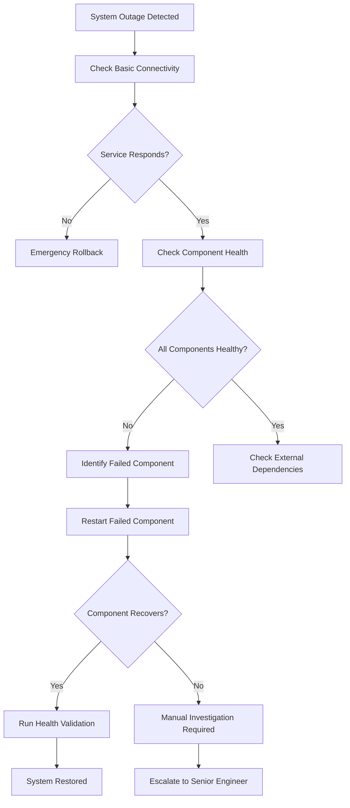
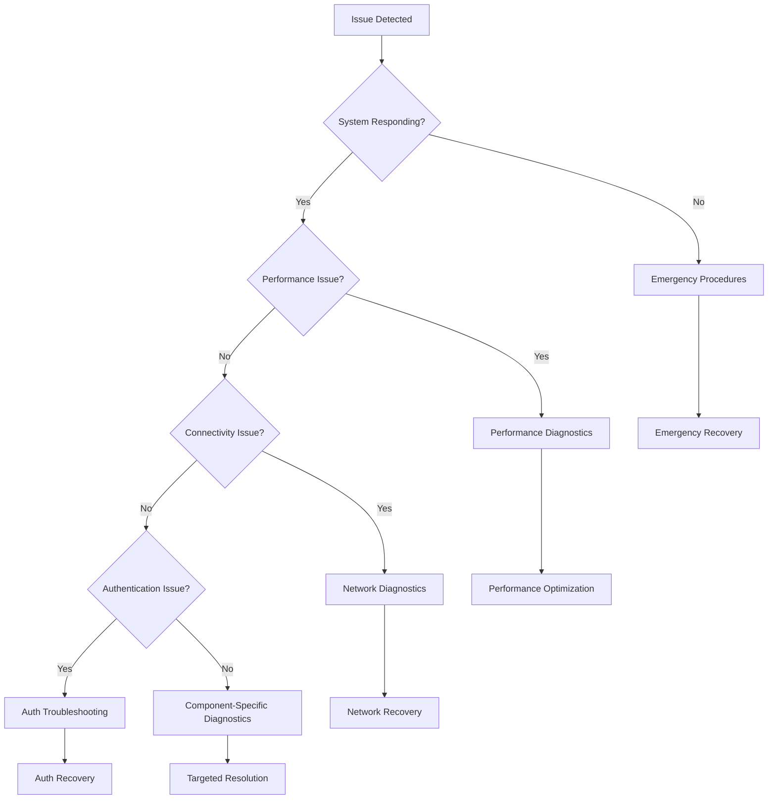

# LeanVibe AI - Troubleshooting Guide

**Status**: Production Ready | **Version**: 1.0 | **Last Updated**: 2025-01-13

## 🎯 Executive Summary

This Troubleshooting Guide provides **comprehensive issue resolution procedures** for the LeanVibe AI system. Designed with **autonomous recovery** and **fast resolution** principles, this guide emphasizes **automated fixes**, **clear decision trees**, and **escalation procedures**.

### Troubleshooting Philosophy
- **Automated First**: Attempt automated recovery before manual intervention
- **Fast Resolution**: Target <5 minute resolution for common issues
- **Root Cause Analysis**: Fix the cause, not just the symptoms
- **Prevention Focus**: Update automation to prevent recurrence
- **Clear Escalation**: Know when to escalate vs. continue troubleshooting

---

## 🚨 Emergency Response Procedures

### Critical System Failures

#### Complete System Outage


**Emergency Response Script:**
```bash
#!/bin/bash
# Emergency system recovery script

echo "🚨 EMERGENCY: LeanVibe AI System Recovery"
echo "========================================"

# 1. Quick health assessment
echo "📊 Checking system health..."
HEALTH_STATUS=$(curl -s --connect-timeout 5 http://localhost:8000/health 2>/dev/null || echo "UNREACHABLE")

if [[ "$HEALTH_STATUS" == "UNREACHABLE" ]]; then
    echo "❌ System completely unreachable - initiating emergency rollback"
    ./deploy/rollback.sh production --emergency
    exit $?
fi

# 2. Component health check
echo "🔍 Checking individual components..."
python scripts/emergency_diagnostics.py --fast-fail

# 3. Database connectivity
echo "💾 Checking database..."
python scripts/validate_neo4j.py --emergency || echo "⚠️ Database issues detected"

# 4. AI service check
echo "🧠 Checking AI service..."
curl -s http://localhost:8000/health/ai | grep -q "healthy" || echo "⚠️ AI service issues"

# 5. WebSocket connectivity
echo "🔗 Checking WebSocket..."
python scripts/websocket_health_check.py --timeout=10 || echo "⚠️ WebSocket issues"

# 6. Full system validation
echo "✅ Running comprehensive validation..."
./deploy/synthetic_probes.sh production --critical

echo "🏁 Emergency assessment complete!"
```

---

## 🔧 Backend Service Issues

### FastAPI Backend Problems

#### High Response Times (P95 > 1000ms)

**Symptoms:**
- API responses slower than expected
- Performance budget violations
- User-reported slowness

**Automated Diagnosis:**
```bash
# Performance diagnostics script
python tools/perf_regression.py --detailed-analysis

# Check for common causes
echo "🔍 Analyzing performance issues..."

# 1. Database query performance
echo "💾 Database query analysis:"
python scripts/analyze_db_performance.py --top-slow-queries=10

# 2. Memory usage patterns
echo "🧠 Memory utilization:"
ps aux | grep -E "(python|uvicorn)" | awk '{print $4 " " $11}' | sort -rn | head -5

# 3. Active connections
echo "🔗 Connection analysis:"
netstat -an | grep :8000 | wc -l

# 4. Cache effectiveness
echo "💡 Cache hit rates:"
python scripts/cache_analysis.py --summary
```

**Automated Fixes:**
```bash
# Performance optimization actions
echo "🚀 Applying performance optimizations..."

# 1. Clear caches
redis-cli FLUSHALL || echo "Redis not available for cache clear"

# 2. Restart worker processes
pkill -f uvicorn && sleep 2
./start.sh --optimized

# 3. Warm critical caches
python scripts/cache_warming.py --priority=high

# 4. Optimize database connections
python scripts/optimize_db_connections.py --reset-pools
```

**Manual Investigation Required When:**
- Automated fixes don't improve performance within 10 minutes
- Database queries consistently taking >5 seconds
- Memory usage increasing continuously (memory leak suspected)
- External API dependencies timing out

#### Memory Usage Warnings (>400MB)

**Symptoms:**
- Memory alerts from monitoring
- Gradual performance degradation
- Out of memory errors in logs

**Diagnostic Commands:**
```bash
# Memory usage analysis
echo "🧠 Memory Analysis"
echo "=================="

# 1. Process memory usage
echo "Process Memory:"
ps aux | grep -E "(python|uvicorn)" | awk '{sum+=$6} END {print "Total RSS: " sum/1024 " MB"}'

# 2. Python memory profiler
echo "Python Memory Profile:"
python -c "
import psutil
import gc
proc = psutil.Process()
print(f'Memory Info: {proc.memory_info()}')
print(f'Memory Percent: {proc.memory_percent()}%')
print(f'Python Objects: {len(gc.get_objects())}')
"

# 3. Check for memory leaks
echo "Memory Leak Detection:"
python scripts/memory_leak_detector.py --quick-scan
```

**Automated Recovery:**
```bash
# Memory cleanup procedures
echo "🧹 Memory Cleanup Procedures"
echo "============================="

# 1. Force Python garbage collection
python -c "import gc; print(f'Collected: {gc.collect()} objects')"

# 2. Clear AI model caches
curl -X POST http://localhost:8000/admin/clear-model-cache

# 3. Restart if memory usage critical
MEMORY_PERCENT=$(python -c "import psutil; print(psutil.virtual_memory().percent)")
if (( $(echo "$MEMORY_PERCENT > 85" | bc -l) )); then
    echo "⚠️ High memory usage detected - restarting service"
    ./scripts/graceful_restart.py --reason="memory_cleanup"
fi
```

#### Database Connection Issues

**Symptoms:**
- "Connection refused" errors
- Database timeout errors
- Failed health checks for database endpoints

**Diagnostic Tree:**
```bash
# Database connectivity diagnostics
echo "💾 Database Connection Diagnostics"
echo "=================================="

# 1. Basic connectivity test
echo "Testing Neo4j connectivity..."
python scripts/validate_neo4j.py --connectivity-only

# 2. Connection pool status
echo "Connection Pool Analysis:"
python -c "
from app.core.database import get_db_pool
pool = get_db_pool()
print(f'Active connections: {pool.active_count}')
print(f'Pool size: {pool.pool_size}')
print(f'Max pool size: {pool.max_pool_size}')
"

# 3. Database service status
echo "Database Service Status:"
if command -v docker >/dev/null; then
    docker ps | grep neo4j || echo "Neo4j container not running"
else
    systemctl status neo4j || echo "Neo4j service status unknown"
fi
```

**Automated Resolution:**
```bash
# Database connection recovery
echo "🔧 Database Connection Recovery"
echo "==============================="

# 1. Reset connection pools
python scripts/reset_db_connections.py

# 2. Restart database service if needed
if ! python scripts/validate_neo4j.py --quick-test; then
    echo "⚠️ Database unresponsive - attempting restart"
    docker restart leanvibe-neo4j || systemctl restart neo4j
    
    # Wait for database to be ready
    echo "⏳ Waiting for database to be ready..."
    for i in {1..30}; do
        if python scripts/validate_neo4j.py --quick-test; then
            echo "✅ Database is ready!"
            break
        fi
        sleep 2
    done
fi

# 3. Validate database integrity
python scripts/validate_neo4j.py --integrity-check
```

---

## 📱 iOS Application Issues

### WebSocket Connection Problems

**Symptoms:**
- "Connection failed" errors in iOS logs
- Real-time features not working
- Frequent reconnection attempts

**Diagnostic Commands:**
```swift
// iOS diagnostic code snippets
// Add to iOS debug console or diagnostic view

// 1. WebSocket status check
if let webSocketService = WebSocketService.shared {
    print("WebSocket Status: \(webSocketService.connectionStatus)")
    print("Last Error: \(webSocketService.lastError?.localizedDescription ?? "None")")
    print("Reconnection Attempts: \(webSocketService.reconnectionAttempts)")
}

// 2. Network reachability
import Network
let monitor = NWPathMonitor()
monitor.pathUpdateHandler = { path in
    print("Network Status: \(path.status)")
    print("Available Interfaces: \(path.availableInterfaces)")
}
```

**Automated Recovery (iOS):**
```swift
// WebSocket recovery procedures
class WebSocketRecoveryManager {
    func performRecovery() {
        // 1. Clear connection state
        WebSocketService.shared.clearConnectionState()
        
        // 2. Validate network connectivity
        guard isNetworkAvailable() else {
            showNetworkError()
            return
        }
        
        // 3. Attempt reconnection with exponential backoff
        WebSocketService.shared.reconnectWithBackoff()
        
        // 4. Validate connection after recovery
        DispatchQueue.main.asyncAfter(deadline: .now() + 10) {
            self.validateRecovery()
        }
    }
    
    private func validateRecovery() {
        guard WebSocketService.shared.isConnected else {
            // Escalate to manual troubleshooting
            escalateToManualTroubleshooting()
            return
        }
        
        // Test connection with ping message
        WebSocketService.shared.sendPing { success in
            if success {
                print("✅ WebSocket recovery successful")
            } else {
                self.escalateToManualTroubleshooting()
            }
        }
    }
}
```

### Voice Interface Issues

**Symptoms:**
- "Hey LeanVibe" not responding
- Speech recognition errors
- Audio permission issues

**Diagnostic Checklist:**
```swift
// Voice interface diagnostics
class VoiceDiagnostics {
    func runDiagnostics() {
        // 1. Check microphone permissions
        checkMicrophonePermissions()
        
        // 2. Validate speech recognition availability
        checkSpeechRecognitionAvailability()
        
        // 3. Test audio session configuration
        validateAudioSession()
        
        // 4. Check for audio interruptions
        checkAudioInterruptions()
    }
    
    private func checkMicrophonePermissions() {
        let status = AVAudioSession.sharedInstance().recordPermission
        print("Microphone Permission: \(status)")
        
        if status != .granted {
            print("❌ Microphone permission required")
        }
    }
    
    private func checkSpeechRecognitionAvailability() {
        let status = SFSpeechRecognizer.authorizationStatus()
        print("Speech Recognition Status: \(status)")
        
        guard let recognizer = SFSpeechRecognizer() else {
            print("❌ Speech recognizer not available")
            return
        }
        
        print("Speech Recognizer Available: \(recognizer.isAvailable)")
    }
}
```

**Automated Recovery (Voice):**
```swift
// Voice interface recovery
class VoiceRecoveryManager {
    func performVoiceRecovery() {
        // 1. Reset audio session
        do {
            let audioSession = AVAudioSession.sharedInstance()
            try audioSession.setCategory(.playAndRecord, mode: .default)
            try audioSession.setActive(true)
            print("✅ Audio session reset successful")
        } catch {
            print("❌ Audio session reset failed: \(error)")
        }
        
        // 2. Restart speech recognition
        VoiceManager.shared.stopListening()
        DispatchQueue.main.asyncAfter(deadline: .now() + 1) {
            VoiceManager.shared.startListening()
        }
        
        // 3. Test voice recognition
        DispatchQueue.main.asyncAfter(deadline: .now() + 3) {
            self.testVoiceRecognition()
        }
    }
    
    private func testVoiceRecognition() {
        // Automated voice test would go here
        // For production, this might be a synthetic test
        print("🎤 Voice recognition test initiated")
    }
}
```

---

## 💻 CLI Tool Issues

### Command Execution Failures

**Symptoms:**
- CLI commands hang or timeout
- "Connection refused" errors
- Authentication failures

**Diagnostic Commands:**
```bash
# CLI diagnostics script
echo "🖥️ CLI Diagnostics"
echo "=================="

# 1. Check CLI configuration
leanvibe config show

# 2. Test backend connectivity
leanvibe status --verbose

# 3. Validate authentication
leanvibe config validate-auth

# 4. Check CLI version compatibility
leanvibe --version
curl -s http://localhost:8000/version
```

**Automated Recovery:**
```bash
# CLI recovery procedures
echo "🔧 CLI Recovery Procedures"
echo "=========================="

# 1. Reset CLI configuration
if [[ ! -f ~/.leanvibe/config.backup ]]; then
    cp ~/.leanvibe/config.json ~/.leanvibe/config.backup 2>/dev/null || true
fi

# 2. Regenerate configuration
leanvibe config reset --keep-projects

# 3. Test backend connectivity
if ! leanvibe status --timeout=10; then
    echo "❌ Backend unreachable - check if backend is running"
    echo "   Run: cd leanvibe-backend && ./start.sh"
    exit 1
fi

# 4. Validate CLI functionality
leanvibe project list --test-mode
```

---

## 🧠 AI Model Issues

### Model Loading Failures

**Symptoms:**
- AI endpoints returning errors
- Model initialization timeouts
- "Model not available" errors

**Diagnostic Commands:**
```bash
# AI model diagnostics
echo "🧠 AI Model Diagnostics"
echo "======================"

# 1. Check model files
echo "Model Files Status:"
ls -la ~/.leanvibe/models/ 2>/dev/null || echo "Models directory not found"

# 2. Test model loading
python -c "
try:
    from app.services.unified_mlx_service import UnifiedMLXService
    service = UnifiedMLXService()
    print('✅ MLX service initialized successfully')
    
    # Test model loading
    response = service.generate('test prompt', max_tokens=5)
    print('✅ Model inference test successful')
except Exception as e:
    print(f'❌ Model test failed: {e}')
"

# 3. Check Apple MLX compatibility
python -c "
try:
    import mlx.core as mx
    print(f'✅ MLX version: {mx.__version__}')
    
    # Test basic MLX operations
    x = mx.array([1.0, 2.0, 3.0])
    print(f'✅ MLX basic operations working: {x.sum()}')
except ImportError:
    print('❌ MLX not installed or not compatible')
except Exception as e:
    print(f'❌ MLX error: {e}')
"
```

**Automated Recovery:**
```bash
# AI model recovery procedures
echo "🔧 AI Model Recovery"
echo "==================="

# 1. Clear model cache
echo "Clearing model cache..."
rm -rf ~/.cache/huggingface/transformers/models--*mlx* 2>/dev/null || true

# 2. Reinstall MLX if needed
echo "Validating MLX installation..."
python -c "import mlx" 2>/dev/null || {
    echo "Reinstalling MLX..."
    pip install mlx mlx-lm --upgrade
}

# 3. Re-download models if necessary
echo "Validating model availability..."
python scripts/setup_real_inference.py --validate-only

# 4. Test AI service after recovery
curl -X POST http://localhost:8000/api/v1/ai/chat \
  -H "Content-Type: application/json" \
  -d '{"message": "test", "session_id": "recovery_test"}' \
  --timeout 30
```

### Model Performance Issues

**Symptoms:**
- AI responses taking >10 seconds
- High memory usage during inference
- Model accuracy degradation

**Performance Optimization:**
```bash
# AI performance optimization
echo "⚡ AI Performance Optimization"
echo "============================="

# 1. Memory optimization
echo "Optimizing model memory usage..."
python -c "
import gc
import torch
gc.collect()
torch.cuda.empty_cache() if torch.cuda.is_available() else None
print('✅ Memory cleared')
"

# 2. Model optimization settings
echo "Applying model optimizations..."
export MLX_METAL_BUFFER_SIZE=4096
export OMP_NUM_THREADS=4

# 3. Restart AI service with optimizations
echo "Restarting AI service..."
curl -X POST http://localhost:8000/admin/restart-ai-service

# 4. Benchmark performance
echo "Running performance benchmark..."
python tools/benchmark_ai_performance.py --quick-test
```

---

## 🔍 Common Issue Resolution Patterns

### Issue Classification Decision Tree



### Resolution Time Expectations

```yaml
Issue Classification & Target Resolution Times:

P0 - System Outage:
  - Detection: <60 seconds (automated)
  - Initial Response: <2 minutes (automated)
  - Resolution: <10 minutes (with rollback)
  
P1 - Major Feature Down:
  - Detection: <2 minutes (automated)
  - Diagnosis: <5 minutes
  - Resolution: <15 minutes
  
P2 - Performance Degradation:
  - Detection: <5 minutes (automated)
  - Diagnosis: <10 minutes
  - Resolution: <30 minutes
  
P3 - Minor Issues:
  - Detection: <15 minutes
  - Diagnosis: <30 minutes
  - Resolution: <2 hours
```

---

## 🔄 Automated Recovery Scripts

### Master Recovery Script

```bash
#!/bin/bash
# Master automated recovery script
# Usage: ./automated_recovery.sh [issue_type] [severity]

ISSUE_TYPE=${1:-"general"}
SEVERITY=${2:-"medium"}

echo "🔄 LeanVibe AI Automated Recovery"
echo "================================"
echo "Issue Type: $ISSUE_TYPE"
echo "Severity: $SEVERITY"
echo ""

# Set timeouts based on severity
case $SEVERITY in
    "critical")
        TIMEOUT=30
        RETRIES=3
        ;;
    "high")
        TIMEOUT=60
        RETRIES=5
        ;;
    *)
        TIMEOUT=120
        RETRIES=3
        ;;
esac

# Recovery procedures by issue type
case $ISSUE_TYPE in
    "performance")
        echo "🚀 Performance Recovery Procedures"
        python tools/perf_regression.py --auto-fix
        curl -X POST http://localhost:8000/admin/optimize-performance
        ;;
        
    "connectivity")
        echo "🔗 Connectivity Recovery Procedures"
        ./scripts/network_recovery.py --timeout=$TIMEOUT
        python scripts/websocket_recovery.py --restart
        ;;
        
    "database")
        echo "💾 Database Recovery Procedures"
        python scripts/reset_db_connections.py
        ./scripts/validate_neo4j.py --repair
        ;;
        
    "ai")
        echo "🧠 AI Service Recovery Procedures"
        curl -X POST http://localhost:8000/admin/restart-ai-service
        python scripts/validate_ai_service.py --comprehensive
        ;;
        
    *)
        echo "🔧 General Recovery Procedures"
        ./scripts/general_system_recovery.py --severity=$SEVERITY
        ;;
esac

# Validate recovery success
echo ""
echo "✅ Running post-recovery validation..."
./deploy/synthetic_probes.sh production --timeout=$TIMEOUT

if [ $? -eq 0 ]; then
    echo "✅ Automated recovery successful!"
    exit 0
else
    echo "❌ Automated recovery incomplete - manual intervention required"
    exit 1
fi
```

### Component-Specific Recovery

```bash
# Backend service recovery
recover_backend() {
    echo "🔧 Backend Recovery"
    
    # 1. Health check
    if curl -f -s http://localhost:8000/health >/dev/null; then
        echo "✅ Backend responding"
    else
        echo "⚠️ Backend unresponsive - restarting"
        pkill -f uvicorn
        sleep 3
        ./start.sh --recovery-mode &
        
        # Wait for startup
        for i in {1..30}; do
            if curl -f -s http://localhost:8000/health >/dev/null; then
                break
            fi
            sleep 2
        done
    fi
    
    # 2. Clear caches
    curl -X POST http://localhost:8000/admin/clear-cache >/dev/null 2>&1
    
    # 3. Validate services
    python scripts/validate_all_dependencies.py --essential-only
}

# iOS app recovery guidance
recover_ios() {
    echo "📱 iOS Recovery Guidance"
    
    cat << EOF
iOS Recovery Steps:
1. Force quit the LeanVibe app
2. Restart the app
3. Check microphone permissions in Settings
4. Verify network connectivity
5. Test "Hey LeanVibe" wake phrase

If issues persist:
- Restart iPhone/iPad
- Reinstall the app
- Check iOS version compatibility (iOS 18.0+ required)
EOF
}

# CLI tool recovery
recover_cli() {
    echo "💻 CLI Recovery"
    
    # 1. Reset configuration
    leanvibe config reset --keep-projects
    
    # 2. Test connectivity
    if ! leanvibe status --timeout=10; then
        echo "❌ Backend connectivity issues"
        return 1
    fi
    
    # 3. Validate installation
    leanvibe --version
    pip show leanvibe-cli | grep Version
    
    echo "✅ CLI recovery complete"
}
```

---

## 📞 Escalation Procedures

### When to Escalate

#### Automatic Escalation Triggers
```yaml
Immediate Escalation (P0):
  - System outage >10 minutes
  - Data corruption detected
  - Security breach indicators
  - Automated recovery fails 3 times
  
Escalate within 30 minutes (P1):
  - Performance degradation >50% sustained
  - AI service completely unavailable
  - Multiple component failures
  - Unknown error patterns
  
Escalate within 2 hours (P2):
  - Persistent quality ratchet violations
  - Intermittent issues affecting users
  - Resource utilization trending toward limits
  - Monitoring system failures
```

#### Escalation Communication Template

```
Subject: [P1 ESCALATION] LeanVibe AI Issue Requires Senior Engineer

Issue Summary:
- Issue Type: [Performance/Connectivity/System/Security]
- Severity: P1 - High Priority
- Duration: [X minutes/hours]
- User Impact: [Describe impact]

Attempted Resolutions:
✅ [List completed automated recovery attempts]
❌ [List failed resolution attempts]
⏳ [Currently running diagnostics/fixes]

Current Status:
- System Health: [Healthy/Degraded/Critical]
- Performance: [Within SLA/Degraded/Critical]
- User Impact: [Minimal/Moderate/Significant]

Next Steps Needed:
- [ ] Senior engineer investigation required
- [ ] Potential architecture review needed
- [ ] Manual intervention required for: [specific area]

Diagnostic Data:
- Logs: [relevant log snippets]
- Metrics: [key performance indicators]
- Error Messages: [specific error messages]

On-Call Engineer: [Your name and contact]
Incident ID: [Tracking ID]
Timestamp: [Current time]
```

### Escalation Contacts

```yaml
Level 1 - Automated Recovery (0-10 minutes):
  Contact: Automated systems
  Scope: Self-healing, rollbacks, restarts
  
Level 2 - Platform Engineer (10-30 minutes):
  Contact: platform-engineer@leanvibe.ai
  Scope: Advanced diagnostics, manual fixes
  
Level 3 - Senior Engineer (30 minutes - 2 hours):
  Contact: senior-engineer@leanvibe.ai
  Scope: Architecture issues, complex troubleshooting
  
Level 4 - Engineering Manager (>2 hours):
  Contact: engineering-manager@leanvibe.ai
  Scope: Strategic decisions, resource allocation
```

---

## 🎯 Prevention and Continuous Improvement

### Post-Incident Procedures

#### Automated Post-Incident Analysis

```bash
# Post-incident analysis script
post_incident_analysis() {
    local incident_id=$1
    echo "📊 Post-Incident Analysis: $incident_id"
    
    # 1. Collect incident data
    echo "Collecting incident data..."
    python scripts/incident_data_collector.py --incident-id="$incident_id"
    
    # 2. Timeline reconstruction
    echo "Reconstructing timeline..."
    python scripts/timeline_analyzer.py --incident-id="$incident_id"
    
    # 3. Root cause analysis
    echo "Performing root cause analysis..."
    python scripts/root_cause_analyzer.py --incident-id="$incident_id"
    
    # 4. Generate improvement recommendations
    echo "Generating improvement recommendations..."
    python scripts/improvement_recommender.py --incident-id="$incident_id"
    
    # 5. Update automation based on learnings
    echo "Updating automated recovery procedures..."
    python scripts/update_recovery_automation.py --incident-id="$incident_id"
}
```

#### Incident Learning Integration

```python
# Incident learning system
class IncidentLearningSystem:
    def process_incident(self, incident_data):
        # 1. Extract patterns from incident
        patterns = self.extract_patterns(incident_data)
        
        # 2. Update detection rules
        self.update_detection_rules(patterns)
        
        # 3. Improve automated recovery
        self.enhance_recovery_procedures(patterns)
        
        # 4. Update monitoring thresholds
        self.optimize_monitoring_thresholds(patterns)
        
        # 5. Generate preventive measures
        self.create_preventive_measures(patterns)
        
    def extract_patterns(self, incident_data):
        return {
            'failure_sequence': incident_data.get('failure_sequence', []),
            'error_patterns': incident_data.get('error_patterns', []),
            'performance_indicators': incident_data.get('metrics', {}),
            'environmental_factors': incident_data.get('environment', {})
        }
```

### Continuous Improvement Tracking

```yaml
Weekly Improvement Metrics:
  - Mean Time To Detection: Track trending improvement
  - Mean Time To Recovery: Target consistent reduction
  - Automated Recovery Success Rate: Target >80%
  - Incident Recurrence Rate: Target <5%
  
Monthly Improvement Reviews:
  - Update troubleshooting procedures based on incidents
  - Enhance automated recovery scripts
  - Refine monitoring and alerting thresholds
  - Train team on new troubleshooting techniques
  
Quarterly Improvement Planning:
  - Architecture improvements to prevent classes of issues
  - Tool investments for better diagnostics
  - Process improvements for faster resolution
  - Team skill development planning
```

---

## 📋 Troubleshooting Checklists

### Quick Diagnostic Checklist (2 minutes)

```yaml
✅ System Health:
  [ ] curl http://localhost:8000/health returns 200
  [ ] All core services respond to health checks
  [ ] Database connectivity confirmed
  [ ] AI service responds to basic prompts

✅ Performance Check:
  [ ] API response times <1000ms
  [ ] Memory usage <500MB
  [ ] CPU usage <80%
  [ ] No error rate spikes in last 10 minutes

✅ Connectivity Check:
  [ ] WebSocket connections successful
  [ ] iOS app can connect to backend
  [ ] CLI tool can communicate with backend
  [ ] External dependencies reachable

✅ Recent Changes:
  [ ] No deployments in last 30 minutes
  [ ] No configuration changes
  [ ] No infrastructure changes
  [ ] No external dependency updates
```

### Comprehensive Diagnostic Checklist (10 minutes)

```yaml
✅ Detailed System Analysis:
  [ ] Full synthetic probe suite execution
  [ ] Performance regression analysis
  [ ] Quality ratchet validation
  [ ] Resource utilization trends review

✅ Component Deep Dive:
  [ ] Backend service logs analysis
  [ ] Database query performance review
  [ ] AI model performance validation
  [ ] WebSocket connection stability check

✅ Integration Testing:
  [ ] iOS-Backend integration validation
  [ ] CLI-Backend integration testing
  [ ] End-to-end user workflow testing
  [ ] Cross-component communication verification

✅ Infrastructure Review:
  [ ] Container health and resource usage
  [ ] Network connectivity and latency
  [ ] Storage space and performance
  [ ] Security posture validation
```

---

## 🛠️ Diagnostic Tools and Commands

### Essential Diagnostic Commands

```bash
# System health and status
curl http://localhost:8000/health/complete | jq '.'
./deploy/synthetic_probes.sh production --comprehensive
python tools/quality_ratchet.py --report

# Performance analysis
python tools/perf_regression.py --detailed-analysis
python tools/memory_profiler.py --quick-scan
netstat -an | grep :8000 | wc -l

# Database diagnostics
python scripts/validate_neo4j.py --comprehensive
python scripts/analyze_db_performance.py --slow-queries

# AI service diagnostics
curl -X POST http://localhost:8000/api/v1/ai/chat \
  -H "Content-Type: application/json" \
  -d '{"message": "diagnostic test", "session_id": "diag"}' \
  --timeout 10

# WebSocket testing
python scripts/websocket_health_check.py --comprehensive

# iOS integration testing (run from iOS project)
swift test --filter IntegrationTests
python scripts/ios_backend_integration_test.py

# CLI testing
leanvibe status --verbose
leanvibe project list --timeout=30
```

### Advanced Diagnostic Scripts

```bash
# Comprehensive system diagnostics
python scripts/comprehensive_diagnostics.py --all-components

# Performance bottleneck analysis
python scripts/bottleneck_analyzer.py --identify-top-issues

# Memory leak detection
python scripts/memory_leak_detector.py --continuous-monitoring

# Network connectivity matrix
python scripts/network_diagnostics.py --full-matrix

# Security posture assessment
python scripts/security_diagnostics.py --quick-assessment
```

---

## 📚 Reference Information

### Log File Locations

```yaml
Backend Logs:
  - Application: ./leanvibe-backend/logs/app.log
  - Errors: ./leanvibe-backend/logs/error.log
  - Performance: ./leanvibe-backend/logs/performance.log
  - Security: ./leanvibe-backend/logs/security.log

System Logs:
  - Docker: docker logs leanvibe-backend
  - System: /var/log/syslog (Linux) or Console.app (macOS)
  - Database: ./leanvibe-backend/logs/neo4j.log

iOS Logs:
  - Xcode Console: Window > Devices and Simulators
  - Simulator: ~/Library/Logs/CoreSimulator/
  - Device: Connect device and use Xcode Console
```

### Configuration File Locations

```yaml
Backend Configuration:
  - Main: ./leanvibe-backend/app/config/settings.py
  - Environment: ./.env
  - Docker: ./docker-compose.yml
  - Performance SLA: ./leanvibe-backend/budgets/performance_sla.json
  - Quality Ratchet: ./leanvibe-backend/quality_ratchet.json

iOS Configuration:
  - Project: ./leanvibe-ios/LeanVibe.xcodeproj/project.pbxproj
  - Info: ./leanvibe-ios/LeanVibe/Info.plist
  - Configurations: ./leanvibe-ios/LeanVibe/Configuration/

CLI Configuration:
  - Global: ~/.leanvibe/config.json
  - Project: ./.leanvibe/project.json
```

### Network Ports and Endpoints

```yaml
Backend Services:
  - Main API: http://localhost:8000
  - Health Check: http://localhost:8000/health
  - WebSocket: ws://localhost:8000/ws
  - Admin API: http://localhost:8000/admin

Database Services:
  - Neo4j HTTP: http://localhost:7474
  - Neo4j Bolt: bolt://localhost:7687
  - Redis: redis://localhost:6379

Development Tools:
  - Monitoring Dashboard: http://localhost:8000/monitoring/dashboard
  - API Documentation: http://localhost:8000/docs
  - Metrics Endpoint: http://localhost:8000/metrics
```

---

## 📞 Emergency Contacts and Resources

### Technical Support Contacts

```yaml
Internal Team:
  - Platform Engineer: platform@leanvibe.ai
  - Senior Engineer: senior-eng@leanvibe.ai
  - Engineering Manager: eng-manager@leanvibe.ai
  - On-Call Rotation: oncall@leanvibe.ai

External Resources:
  - Apple MLX Support: github.com/ml-explore/mlx/issues
  - FastAPI Documentation: fastapi.tiangolo.com
  - Neo4j Support: neo4j.com/support
  - SwiftUI Resources: developer.apple.com/swiftui
```

### Documentation Quick Links

- **[ARCHITECTURE.md](./ARCHITECTURE.md)**: Complete system architecture
- **[MONITORING.md](./MONITORING.md)**: Monitoring and observability
- **[OPERATIONS_PLAYBOOK.md](./OPERATIONS_PLAYBOOK.md)**: Daily operations procedures
- **[AGENTS.md](./AGENTS.md)**: Comprehensive system guide

### Emergency Procedures Quick Reference

```bash
# Emergency system shutdown
./scripts/emergency_shutdown.py --confirm

# Emergency rollback
./deploy/rollback.sh production --emergency

# Emergency diagnostics
./scripts/emergency_diagnostics.py --all-systems

# Emergency contact notification
python monitoring/alerts.py --escalate --severity=P0
```

---

**Last Updated**: 2025-01-13  
**Version**: 1.0  
**Status**: ✅ Production Ready Troubleshooting Guide  
**Next Review**: Quarterly troubleshooting effectiveness review

This Troubleshooting Guide provides comprehensive issue resolution procedures for the LeanVibe AI system with emphasis on automated recovery, fast resolution times, and clear escalation paths for production environments.