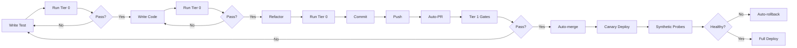

# Extreme Programming Autonomous Workflow
## Maximum Hands-Off Development Time

### Core Principles
- **Trunk-based development**: Direct commits to main, feature flags for WIP
- **Tiny vertical slices**: <300 LOC per change, always deployable
- **Contract-first**: OpenAPI/AsyncAPI schemas drive everything
- **TDD always**: Red → Green → Refactor → Commit
- **Fast feedback**: <60s local, <5m CI, rollback in <30s

## Workflow Architecture

### 1. Contract-Driven Development
```yaml
flow:
  1. Define/update OpenAPI spec (backend)
  2. Define/update AsyncAPI spec (WebSocket)
  3. Auto-generate:
     - Python models (FastAPI)
     - Swift models (iOS)
     - TypeScript types (CLI)
  4. Contract tests validate all responses
```

### 2. Test Tiers (Speed-Optimized)

#### Tier 0: Pre-commit (<60s)
- Unit tests (focused)
- Contract validation
- Type checking
- Linting
```bash
make verify-fast  # Must pass before commit
```

#### Tier 1: PR Gate (3-5m)
- Contract tests (full)
- WebSocket handshake tests
- API smoke tests
- Coverage check (ratchet)
- Schema drift detection
```bash
make verify-pr  # Auto-runs on PR
```

#### Tier 2: Nightly (30m)
- End-to-end tests
- Mutation testing (sample)
- Performance regression
- Flaky test detection
```bash
make verify-nightly  # Scheduled, non-blocking
```

#### Tier 3: Weekly (2h)
- Load testing
- Security scanning
- Dependency audit
- Full mutation testing
```bash
make verify-weekly  # Maintenance window
```

### 3. Development Loop



### 4. Automation Components

#### A. Schema Management
```python
# contracts/openapi.yaml → Generated code
contracts/
  openapi.yaml         # REST API spec
  asyncapi.yaml       # WebSocket spec
  generate.py         # Codegen script
generated/
  python/models.py    # FastAPI models
  swift/Models.swift  # iOS models
  typescript/types.ts # CLI types
```

#### B. Test Automation
```makefile
# Makefile targets
verify-fast:      # <60s - pre-commit
	@pytest -k "unit or contract" --tb=short
	@mypy app/
	@ruff check
	
verify-pr:        # 3-5m - PR gate
	@pytest tests/ --cov=app --cov-report=term
	@python contracts/validate.py
	@python tools/schema_drift.py
	
verify-nightly:   # 30m - scheduled
	@pytest tests/ --mutation
	@python tools/flaky_detector.py
	@python tools/perf_regression.py
```

#### C. CI/CD Pipeline
```yaml
# .github/workflows/autonomous.yml
on:
  push:
    branches: [main]
  pull_request:

jobs:
  tier-0:
    timeout-minutes: 2
    steps:
      - run: make verify-fast
      
  tier-1:
    timeout-minutes: 5
    if: github.event_name == 'pull_request'
    steps:
      - run: make verify-pr
      - run: make coverage-gate
      
  auto-merge:
    if: success() && contains(labels, 'auto-merge')
    steps:
      - run: gh pr merge --auto
      
  canary:
    if: github.ref == 'refs/heads/main'
    steps:
      - deploy: canary
      - run: make synthetic-probes
      - if: failure()
        run: make rollback
```

### 5. Quality Ratchets

```python
# tools/quality_ratchet.py
RATCHETS = {
    "coverage": {
        "current": 75,
        "target": 80,
        "increment": 1,  # Per PR
    },
    "mutation_score": {
        "current": 60,
        "target": 80,
        "increment": 2,  # Per week
    },
    "response_time_p95": {
        "current": 500,  # ms
        "target": 200,
        "decrement": 10,  # Per sprint
    }
}
```

### 6. Observability as Tests

```python
# synthetic/probes.py
PROBES = [
    HealthProbe("/health", expect=200, timeout=1),
    MetricsProbe("/metrics", expect=200, timeout=2),
    WebSocketProbe("/ws", handshake=True, timeout=5),
    APIProbe("/api/projects", auth=True, timeout=3),
]

# Runs every 60s in production
# Alerts if 2+ failures in 5min window
# Auto-rollback if 3+ failures
```

### 7. Risk Reduction

#### Feature Flags
```python
# app/features.py
FLAGS = {
    "new_ai_model": {"enabled": False, "rollout": 0.1},
    "websocket_v2": {"enabled": True, "rollout": 0.5},
}

@feature_flag("new_ai_model")
def use_new_model():
    return NewModel()
```

#### Blast Radius Limiting
```yaml
# Canary deployment: 10% traffic for 10min
# Blue-green: Instant switch with <30s rollback
# Feature flags: Gradual rollout over days
```

### 8. Developer Ergonomics

```bash
# Quick commands for speed
alias vf="make verify-fast"        # Pre-commit
alias vp="make verify-pr"          # Before push
alias fix="make auto-fix"          # Format + lint fix
alias gen="make generate-types"    # Update from schemas

# Git hooks
pre-commit: verify-fast
pre-push: verify-pr
```

### 9. Autonomous Operation Metrics

```python
# Track effectiveness
METRICS = {
    "time_without_intervention": "8h average",
    "auto_merge_rate": "85% of PRs",
    "rollback_rate": "<2% of deploys",
    "flaky_test_rate": "<1% of suite",
    "mean_time_to_recovery": "<5min",
}
```

## Implementation Priority

### Phase 1: Foundation (Day 1)
1. Contract schemas (OpenAPI/AsyncAPI)
2. Codegen pipeline
3. Tier 0 tests
4. Pre-commit hooks

### Phase 2: Automation (Day 2)
1. CI/CD pipeline
2. Auto-merge rules
3. Synthetic probes
4. Rollback automation

### Phase 3: Intelligence (Day 3)
1. Flaky test detection
2. Quality ratchets
3. Performance budgets
4. Mutation testing

### Phase 4: Optimization (Day 4)
1. Test parallelization
2. Incremental testing
3. Smart test selection
4. Cache optimization

## Success Criteria
- Can work 8+ hours without human intervention
- <5% of changes require manual review
- <2min from commit to canary
- <5min to detect and rollback failures
- 99.9% uptime with autonomous recovery