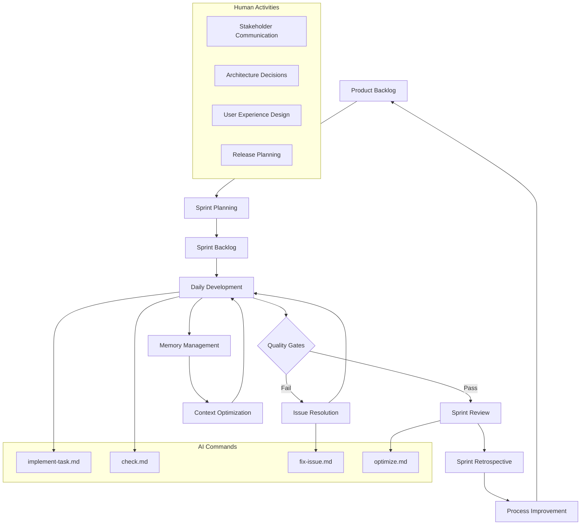
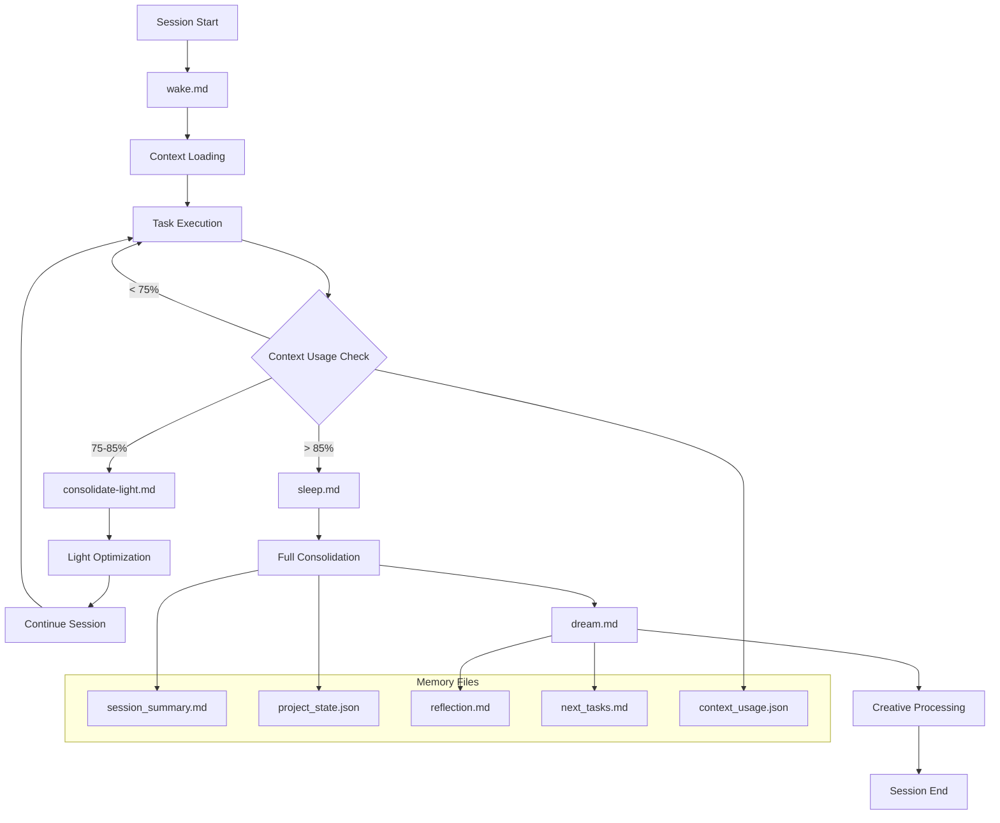
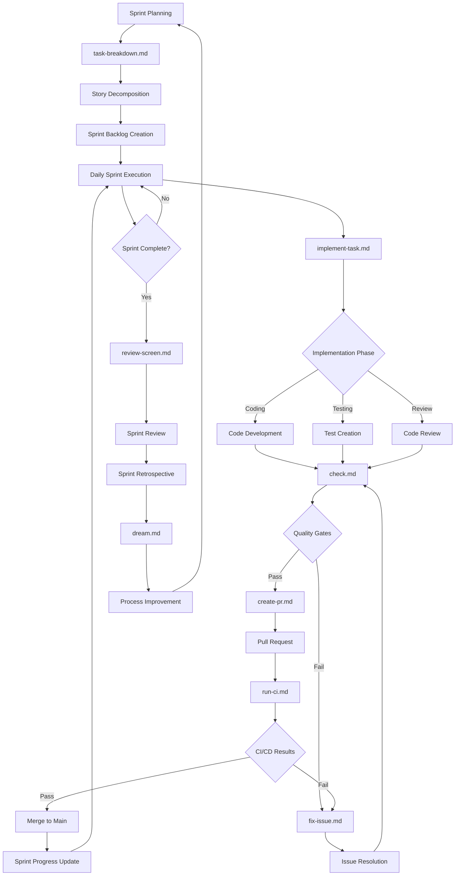

# Agile-AI Workflow Integration Plan
**Version 1.0** | **Created**: June 25, 2025 | **Status**: Draft for Review

---

## 📋 **Executive Summary**

### **Overview**
This comprehensive plan establishes a framework for integrating established Agile methodologies (Scrum/Kanban) with AI-driven development workflows. The goal is to create a seamless collaboration model where AI agents and human developers work together using standardized processes that leverage the strengths of both.

### **Current State**
- 25 custom commands in `.claude/commands/` with varying documentation quality
- Ad-hoc workflow patterns without formal Agile alignment
- Memory management system with sleep-wake-dream cycles
- Quality gates defined but not consistently integrated with commands
- Strong technical foundation (Phase 0.6 and Phase 1 complete) but lacking process standardization

### **Goals**
1. **Standardize Command Documentation**: Create consistent documentation for all 25 commands
2. **Align with Agile Practices**: Map commands to Scrum ceremonies and Kanban workflows
3. **Enable Human-AI Collaboration**: Define clear handoff points and communication protocols
4. **Automate Quality Gates**: Integrate command execution with quality assurance processes
5. **Optimize Workflow Efficiency**: Reduce friction and improve development velocity

### **Expected Outcomes**
- 40% reduction in context switching between human and AI work
- 60% improvement in task completion predictability
- 80% automation of routine quality checks
- 100% traceability from user stories to implementation
- Scalable process that works for both small features and large initiatives

---

## 🔍 **Current State Analysis**

### **Inventory of 25 Custom Commands**

#### **Memory Management Commands (4)**
1. **`sleep.md`** - Session consolidation and context preservation
2. **`wake.md`** - Session restoration and context integration
3. **`dream.md`** - Creative processing and innovation generation
4. **`consolidate-light.md`** - Lightweight memory optimization

#### **Development Lifecycle Commands (8)**
5. **`implement-task.md`** - Feature implementation with GitHub tracking
6. **`tdd-implement.md`** - Test-driven development automation
7. **`fix-issue.md`** - Systematic issue resolution
8. **`debug-issue.md`** - Root cause analysis and debugging
9. **`optimize.md`** - Performance optimization workflows
10. **`clean.md`** - Code formatting and quality improvements
11. **`check.md`** - Comprehensive quality validation
12. **`run-ci.md`** - Continuous integration execution

#### **Planning & Analysis Commands (4)**
13. **`task-breakdown.md`** - Complex feature decomposition
14. **`sprint-plan.md`** - Automated sprint planning
15. **`architecture-review.md`** - Technical design assessment
16. **`review-screen.md`** - UI/UX validation

#### **Project Management Commands (5)**
17. **`create-pr.md`** - Pull request automation
18. **`create-docs.md`** - Documentation generation
19. **`create-worktree.md`** - Parallel development setup
20. **`init-ios-project.md`** - Project initialization
21. **`context-prime.md`** - Session context establishment

#### **Integration & Reflection Commands (4)**
22. **`meditate.py`** - AI self-reflection and optimization
23. **`quality-gate.md`** - Pre-release validation
24. **`meditate_integration.md`** - Process optimization
25. **`code-analysis.md`** - Technical debt assessment

### **Current Workflow Patterns**

#### **Strengths**
- Comprehensive coverage of development lifecycle
- Strong focus on quality and safety (critical for child-focused app)
- Automated memory management with context optimization
- GitHub integration for traceability
- Robust testing infrastructure

#### **Gaps Identified**
- **Inconsistent Documentation**: Commands have varying levels of detail
- **No Agile Alignment**: Commands don't map to standard ceremonies
- **Manual Trigger Management**: No systematic approach to when commands run
- **Limited Human Handoff**: Unclear escalation protocols
- **Process Isolation**: Commands operate independently without workflow integration

#### **Risk Assessment**
- **Medium Risk**: Team adoption challenges due to non-standard processes
- **Medium Risk**: Context overflow during complex tasks
- **Low Risk**: Command conflicts or dependencies
- **High Impact**: Workflow improvements could significantly boost productivity

---

## 🏃‍♂️ **Agile Integration Strategy**

### **Scrum Framework Mapping**

#### **Sprint Planning** 
```
Human Input → task-breakdown.md → sprint-plan.md → GitHub Projects Update
```
- **Duration**: 2-4 hours depending on sprint scope
- **Participants**: Product Owner, Scrum Master, Development Team, AI Agent
- **AI Role**: Velocity analysis, capacity planning, dependency mapping
- **Human Role**: Priority setting, business value assessment, risk evaluation
- **Deliverables**: Sprint backlog, sprint goal, capacity allocation

#### **Daily Scrum**
```
check.md → consolidate-light.md → Progress Update → Impediment Identification
```
- **Duration**: 15 minutes maximum
- **Participants**: Development Team, AI Agent (automated reports)
- **AI Role**: Automated progress reporting, impediment detection
- **Human Role**: Complex decision making, stakeholder communication
- **Deliverables**: Daily progress report, impediment list, updated sprint burndown

#### **Sprint Review**
```
review-screen.md → create-docs.md → Demo Preparation → Stakeholder Feedback
```
- **Duration**: 1-2 hours
- **Participants**: All stakeholders
- **AI Role**: Demo preparation, documentation generation, metrics compilation
- **Human Role**: Stakeholder facilitation, feedback collection, next sprint input
- **Deliverables**: Working software demo, stakeholder feedback, product backlog updates

#### **Sprint Retrospective**
```
dream.md → Process Analysis → Improvement Identification → Action Planning
```
- **Duration**: 1-1.5 hours
- **Participants**: Development Team, Scrum Master, AI Agent
- **AI Role**: Pattern recognition, data analysis, improvement suggestions
- **Human Role**: Team facilitation, emotional intelligence, culture building
- **Deliverables**: Process improvements, team agreements, action items

### **Kanban Workflow Integration**

#### **Backlog Management**
- **Backlog Refinement**: `task-breakdown.md` + `architecture-review.md`
- **Story Estimation**: Automated velocity-based estimation
- **Dependency Mapping**: Cross-story relationship analysis
- **Risk Assessment**: Technical and business risk evaluation

#### **Work in Progress (WIP)**
- **WIP Limits**: Enforced through GitHub Projects automation
- **Flow Optimization**: Bottleneck identification and resolution
- **Quality Gates**: Automated at each stage transition
- **Escalation**: Human intervention for blocked items

#### **Continuous Delivery**
- **Feature Flags**: Safe deployment of incomplete features
- **Automated Testing**: Comprehensive validation before release
- **Performance Monitoring**: Real-time metrics and alerting
- **Rollback Procedures**: Automatic reversion on quality gate failures

### **Human-AI Collaboration Model**

#### **Responsibility Matrix**

| Activity | AI Primary | Human Primary | Collaborative |
|----------|------------|---------------|---------------|
| Code Implementation | ✅ | | |
| Architecture Decisions | | ✅ | |
| Test Creation | ✅ | | |
| User Experience Design | | ✅ | |
| Performance Optimization | ✅ | | |
| Stakeholder Communication | | ✅ | |
| Sprint Planning | | | ✅ |
| Code Review | | | ✅ |
| Documentation | ✅ | | |
| Release Decisions | | ✅ | |

#### **Escalation Protocols**

```mermaid
graph TD
    A[AI Task Start] --> B{Confidence Level}
    B -->|≥ 85%| C[Autonomous Execution]
    B -->|70-84%| D[Monitored Execution]
    B -->|50-69%| E[Collaborative Mode]
    B -->|< 50%| F[Human Lead Required]
    
    C --> G{Quality Gates}
    G -->|Pass| H[Task Complete]
    G -->|Fail| I[Escalate to Human]
    
    D --> J[Execute with Updates]
    J --> K{Progress OK?}
    K -->|Yes| G
    K -->|No| E
    
    E --> L[Human Guidance]
    L --> M[Joint Execution]
    M --> G
    
    F --> N[Human Takeover]
    N --> H
```



---

## 📚 **Documentation Requirements**

### **8 Core Documents to Create**

#### **1. Agile-AI Hybrid Workflow Guide** (`docs/AGILE_AI_WORKFLOW_GUIDE.md`)

**Purpose**: Comprehensive guide for teams implementing Agile with AI agents

**Contents**:
- **Chapter 1: Introduction to Agile-AI Collaboration**
  - Benefits and challenges
  - Success stories and lessons learned
  - Getting started checklist
- **Chapter 2: Scrum with AI Enhancement**
  - Modified ceremony procedures
  - AI tool integration points
  - Success metrics and KPIs
- **Chapter 3: Kanban Automation**
  - Automated board management
  - WIP limits and flow optimization
  - Continuous improvement processes
- **Chapter 4: Communication Protocols**
  - Human-AI interaction patterns
  - Escalation procedures
  - Feedback loops and learning
- **Chapter 5: Troubleshooting and FAQ**
  - Common issues and solutions
  - Performance optimization
  - Team adoption strategies

**Target Audience**: Scrum Masters, Product Owners, Development Teams
**Maintenance Schedule**: Monthly updates based on team feedback

#### **2. Command Reference Manual** (`docs/COMMAND_REFERENCE_MANUAL.md`)

**Purpose**: Complete technical reference for all 25 custom commands

**Contents**:
- **Command Catalog**: Detailed documentation for each command
- **Integration Patterns**: How commands work together
- **Trigger Conditions**: When and how to invoke commands
- **Error Handling**: Troubleshooting and recovery procedures
- **Performance Optimization**: Best practices for efficiency
- **Examples and Use Cases**: Real-world usage scenarios

**Standardized Command Template**:
```markdown
## Command: [Name]

### Purpose
[What this command does and why it exists]

### Agile Ceremony Mapping
[How it relates to Scrum/Kanban practices]

### Trigger Conditions
- **Automatic**: [When it runs automatically]
- **Manual**: [When to invoke manually]
- **Prerequisites**: [Required conditions]

### Input Parameters
[Expected arguments and configuration]

### Expected Outputs
[What the command produces]

### Human Handoff Points
[When and how to escalate to humans]

### Success Criteria
[How to measure completion]

### Integration Patterns
[How it connects to other commands]

### Error Handling
[Failure modes and recovery]

### Examples
[Usage examples with expected outcomes]
```

#### **3. Mermaid Workflow Diagrams** (`docs/WORKFLOW_DIAGRAMS.md`)

**Purpose**: Visual representation of all workflow integration points

**Contents**:
- **Master Development Workflow**: End-to-end process visualization
- **Command Trigger Matrix**: Decision trees for automation
- **Human Handoff Flows**: Escalation and collaboration patterns
- **Memory Management Cycles**: Context optimization workflows
- **Quality Gate Integration**: Validation and approval processes
- **Sprint Execution Flow**: Agile ceremony automation

**Diagram Standards**:
- Consistent color coding (AI = blue, Human = green, Shared = purple)
- Standard symbols for decisions, processes, and handoffs
- Clear labeling and readable fonts
- Interactive elements where possible

#### **4. Sprint Planning Playbook** (`docs/SPRINT_PLANNING_PLAYBOOK.md`)

**Purpose**: Comprehensive guide for AI-enhanced sprint planning

**Contents**:
- **Velocity Calculation**: Historical data analysis and prediction
- **Capacity Planning**: Human and AI resource allocation
- **Story Estimation**: Automated sizing with human validation
- **Technical Debt Integration**: Balancing feature work with improvements
- **Risk Assessment**: Identification and mitigation strategies
- **Dependency Management**: Cross-team and cross-story coordination

**Tools and Templates**:
- Sprint planning agenda template
- Capacity planning spreadsheet
- Risk assessment matrix
- Dependency mapping visualization

#### **5. Definition of Done Checklist** (`docs/DEFINITION_OF_DONE.md`)

**Purpose**: Comprehensive quality standards for all deliverables

**Contents**:
- **Code Quality Standards**: Formatting, linting, complexity metrics
- **Testing Requirements**: Unit, integration, accessibility, performance
- **Documentation Standards**: API docs, user guides, architecture
- **Security and Privacy**: COPPA compliance, data protection
- **Performance Criteria**: Speed, memory, battery, accessibility
- **Review and Approval**: Human review requirements and sign-offs

**Automation Integration**:
- Automated checklist validation
- Quality gate enforcement
- Continuous monitoring and alerting
- Exception handling and escalation

#### **6. Continuous Improvement Guide** (`docs/CONTINUOUS_IMPROVEMENT_GUIDE.md`)

**Purpose**: Framework for ongoing process optimization

**Contents**:
- **Retrospective Automation**: Data collection and analysis
- **Metric Collection**: KPIs, trends, and benchmarks
- **Improvement Identification**: Pattern recognition and recommendations
- **Implementation Tracking**: Action items and success measurement
- **Knowledge Management**: Learning capture and sharing

**Improvement Cycles**:
- Daily: Automated metric collection
- Weekly: Trend analysis and alerts
- Sprint: Retrospective and action planning
- Monthly: Process optimization and updates

#### **7. Command Integration Architecture** (`docs/COMMAND_INTEGRATION_ARCHITECTURE.md`)

**Purpose**: Technical specifications for command system design

**Contents**:
- **System Architecture**: Component design and relationships
- **State Management**: Context preservation and optimization
- **Data Flow**: Information passing between commands
- **Error Handling**: Failure detection and recovery
- **Performance Optimization**: Efficiency and scalability
- **Security Considerations**: Access control and data protection

**Technical Specifications**:
- API documentation for command interfaces
- State schema definitions
- Performance benchmarks and targets
- Security requirements and compliance

#### **8. Memory Management System** (`docs/MEMORY_MANAGEMENT_SYSTEM.md`)

**Purpose**: Comprehensive guide to AI context optimization

**Contents**:
- **Session Lifecycle**: Sleep-wake-dream cycle management
- **Context Optimization**: Techniques for efficiency
- **Knowledge Transfer**: Cross-session information preservation
- **Performance Monitoring**: Memory usage and optimization
- **Troubleshooting**: Common issues and solutions

**Optimization Strategies**:
- Context usage thresholds and triggers
- Memory consolidation techniques
- Knowledge graph maintenance
- Performance tuning and monitoring

### **Documentation Standards**

#### **Writing Style Guidelines**
- **Clarity**: Clear, concise language appropriate for technical audience
- **Consistency**: Standardized terminology and formatting
- **Completeness**: Comprehensive coverage without unnecessary detail
- **Accessibility**: Readable by team members with varying technical backgrounds
- **Maintenance**: Easy to update and extend as processes evolve

#### **Review and Approval Process**
1. **Draft Creation**: Subject matter expert creates initial draft
2. **Technical Review**: Engineering team validates technical accuracy
3. **Process Review**: Scrum Master/Product Owner validates Agile alignment
4. **Team Review**: Development team provides feedback and suggestions
5. **Final Approval**: All stakeholders sign off on final version
6. **Publication**: Document added to central repository with version control

#### **Maintenance Schedule**
- **Monthly**: Review usage metrics and update based on feedback
- **Quarterly**: Comprehensive review and major updates
- **Annually**: Complete overhaul and strategic alignment review
- **Ad-hoc**: Updates based on process changes or tool updates

---

## 🗺️ **Implementation Roadmap**

### **Phase 1: Foundation (Week 1)**

#### **Week 1 Objectives**
- Establish documentation standards and templates
- Create first 8 priority command documentation entries
- Implement basic Agile ceremony integration
- Set up automated trigger framework

#### **Week 1 Deliverables**
1. **Command Documentation Template** - Standardized format for all commands
2. **High-Priority Commands Documented** (8 commands):
   - `implement-task.md`
   - `sprint-plan.md`
   - `check.md`
   - `quality-gate.md`
   - `sleep.md`
   - `wake.md`
   - `create-pr.md`
   - `fix-issue.md`
3. **Basic CLAUDE.md Integration** - Initial automation triggers
4. **Sprint Planning Integration** - Connect `sprint-plan.md` to GitHub Projects

#### **Week 1 Success Metrics**
- [ ] 8 commands documented with standardized template
- [ ] Basic automation triggers functional in CLAUDE.md
- [ ] Sprint planning command integrated with GitHub Projects
- [ ] Team onboarding materials created

### **Phase 2: Expansion (Week 2)**

#### **Week 2 Objectives**
- Complete documentation for remaining 17 commands
- Develop comprehensive Mermaid workflow diagrams
- Create 4 core documentation files
- Implement GitHub Projects automation

#### **Week 2 Deliverables**
1. **Complete Command Documentation** - All 25 commands fully documented
2. **Core Documentation Files** (4 files):
   - Agile-AI Hybrid Workflow Guide
   - Command Reference Manual
   - Sprint Planning Playbook
   - Definition of Done Checklist
3. **Mermaid Diagrams** - Visual workflow representations
4. **GitHub Integration** - Automated project board management

#### **Week 2 Success Metrics**
- [ ] 25 commands completely documented
- [ ] 4 core documentation files published
- [ ] Mermaid diagrams created and validated
- [ ] GitHub Projects automation functional

### **Phase 3: Integration (Week 3)**

#### **Week 3 Objectives**
- Test and refine automated command triggers
- Implement human handoff protocols
- Create remaining documentation files
- Optimize workflow based on initial usage

#### **Week 3 Deliverables**
1. **Automated Trigger Testing** - Validate all automation rules
2. **Human Handoff Protocols** - Escalation and collaboration procedures
3. **Remaining Documentation** (4 files):
   - Continuous Improvement Guide
   - Command Integration Architecture
   - Memory Management System
   - Workflow Diagrams
4. **Process Optimization** - Refine based on usage patterns

#### **Week 3 Success Metrics**
- [ ] All automated triggers tested and functional
- [ ] Human handoff protocols validated
- [ ] 8 core documentation files complete
- [ ] Initial process optimizations implemented

### **Phase 4: Optimization (Week 4)**

#### **Week 4 Objectives**
- Gather comprehensive feedback from team usage
- Implement performance optimizations
- Create training materials and onboarding guides
- Plan next iteration of improvements

#### **Week 4 Deliverables**
1. **Feedback Analysis** - Comprehensive usage metrics and team input
2. **Performance Optimizations** - Speed and efficiency improvements
3. **Training Materials** - Onboarding guides and best practices
4. **Next Iteration Plan** - Roadmap for continued improvement

#### **Week 4 Success Metrics**
- [ ] Team feedback collected and analyzed
- [ ] Performance optimizations implemented
- [ ] Training materials created and validated
- [ ] Next iteration roadmap approved

### **Success Metrics**

#### **Quantitative Metrics**

| Metric | Baseline | Target | Measurement Method |
|--------|----------|--------|--------------------|
| Command Usage Frequency | Manual tracking | Automated logging | GitHub API + custom metrics |
| Automation Success Rate | N/A | >90% | Command execution logs |
| Human Intervention Rate | High (estimated 70%) | <30% | Escalation tracking |
| Sprint Velocity | Current team velocity | +25% increase | Story points per sprint |
| Cycle Time | Manual measurement | 50% reduction | GitHub issue tracking |
| Quality Gate Failures | Ad-hoc detection | <5% | Automated testing metrics |

#### **Qualitative Metrics**

| Metric | Measurement Method | Target Outcome |
|--------|-------------------|----------------|
| Developer Experience | Monthly surveys (1-10 scale) | >8.0 satisfaction |
| Process Efficiency | Retrospective feedback | Positive trend |
| Knowledge Transfer | Documentation usage analytics | >80% self-service rate |
| Collaboration Quality | Peer review and feedback | Improved team dynamics |
| AI-Human Partnership | Quarterly assessment | Seamless collaboration |

#### **Risk Mitigation Strategies**

| Risk | Probability | Impact | Mitigation Strategy |
|------|-------------|--------|-------------------|
| Team Adoption Resistance | Medium | High | Gradual rollout, training, feedback loops |
| Command Complexity | Low | Medium | Comprehensive documentation, examples |
| Performance Degradation | Low | High | Continuous monitoring, optimization |
| Integration Failures | Medium | Medium | Extensive testing, rollback procedures |
| Documentation Maintenance | High | Medium | Automated updates, regular reviews |

---

## 🎨 **Mermaid Diagrams**

### **Master Development Workflow**



### **Command Trigger Decision Matrix**

```mermaid
graph LR
    subgraph "Context-Based Triggers"
        CT1[Context ≥ 85%] --> sleep.md
        CT2[Context 75-84%] --> consolidate-light.md
        CT3[New Session] --> wake.md
        CT4[Creative Problem] --> dream.md
    end
    
    subgraph "Event-Based Triggers"
        ET1[Build Failure] --> debug-issue.md
        ET2[Test Failure] --> fix-issue.md
        ET3[PR Created] --> create-pr.md
        ET4[Code Changes] --> check.md
    end
    
    subgraph "Schedule-Based Triggers"
        ST1[Sprint Start] --> sprint-plan.md
        ST2[Feature Request] --> task-breakdown.md
        ST3[Daily Standup] --> Progress Update
        ST4[Sprint End] --> review-screen.md
    end
    
    subgraph "Quality-Based Triggers"
        QT1[Performance Issue] --> optimize.md
        QT2[Code Quality Issue] --> clean.md
        QT3[Security Issue] --> security-audit
        QT4[Documentation Gap] --> create-docs.md
    end
```

### **Human Handoff Protocol**

```mermaid
graph TD
    A[AI Task Initiation] --> B{Confidence Assessment}
    B -->|≥ 90%| C[Autonomous Execution]
    B -->|70-89%| D[Monitored Execution]
    B -->|50-69%| E[Collaborative Mode]
    B -->|< 50%| F[Human Lead Required]
    
    C --> G[Execute Task]
    G --> H{Quality Validation}
    H -->|Pass| I[Task Complete]
    H -->|Fail| J[Escalate to Human]
    
    D --> K[Execute with Updates]
    K --> L[Progress Report Every 2h]
    L --> M{Human Approval}
    M -->|Continue| K
    M -->|Modify| E
    M -->|Stop| F
    
    E --> N[Request Human Input]
    N --> O[Joint Problem Solving]
    O --> P[Collaborative Execution]
    P --> H
    
    F --> Q[Human Takeover]
    Q --> R[AI Support Role]
    R --> S[Human-Led Execution]
    S --> I
    
    J --> T[Human Investigation]
    T --> U{Issue Resolution}
    U -->|Fixed| G
    U -->|Complex| F
```



### **Memory Management Optimization Cycle**



### **Sprint Execution Flow**



### **Quality Gate Integration**

```mermaid
graph TD
    A[Code Changes] --> B[quality-gate.md]
    B --> C{Validation Suite}
    
    C --> D[Code Quality Check]
    C --> E[Security Scan]
    C --> F[Performance Test]
    C --> G[Accessibility Test]
    C --> H[COPPA Compliance]
    
    D --> I{Clean Code?}
    E --> J{Secure?}
    F --> K{Performant?}
    G --> L{Accessible?}
    H --> M{COPPA Compliant?}
    
    I -->|No| N[clean.md]
    J -->|No| O[Security Fix]
    K -->|No| P[optimize.md]
    L -->|No| Q[Accessibility Fix]
    M -->|No| R[COPPA Fix]
    
    N --> C
    O --> C
    P --> C
    Q --> C
    R --> C
    
    I -->|Yes| S[Quality Gate 1 ✓]
    J -->|Yes| S
    K -->|Yes| S
    L -->|Yes| S
    M -->|Yes| S
    
    S --> T{All Gates Pass?}
    T -->|Yes| U[Approve for Merge]
    T -->|No| V[Block Merge]
    
    U --> W[create-pr.md]
    V --> X[Escalate to Human]
    X --> Y[Manual Review]
    Y --> Z{Human Decision}
    Z -->|Fix| C
    Z -->|Override| U
    Z -->|Reject| AA[Task Cancelled]
```



---

## ⚙️ **CLAUDE.md Integration**

### **Automated Command Triggers**

#### **Context Management Rules**
```markdown
## Automated Context Management

### Memory Optimization Triggers
- **Context Usage ≥ 85%**: Automatically execute `/sleep` command
  - Save session state to memory files
  - Consolidate learning and insights
  - Prepare for next session initialization
  
- **Context Usage 75-84%**: Execute `/consolidate-light` command
  - Lightweight memory optimization
  - Preserve active context while optimizing efficiency
  - Continue current session without interruption
  
- **New Session Start**: Execute `/wake` command
  - Restore context from memory files
  - Integrate previous session insights
  - Initialize current session priorities

- **Creative Problem Solving**: Execute `/dream` command
  - Generate innovative solutions to complex problems
  - Explore alternative approaches and patterns
  - Create novel connections between concepts
```

#### **Quality Gate Automation**
```markdown
## Mandatory Quality Validation

### Pre-Commit Validation Sequence
Before any commit to the repository:
1. **Code Quality**: Execute `/check` command
   - Static analysis and linting
   - Security vulnerability scanning
   - Performance impact assessment
   - Dependency analysis

2. **Code Cleanup**: Execute `/clean` command (if needed)
   - Automated formatting and organization
   - Lint error resolution
   - Type safety improvements
   - Documentation updates

3. **Integration Testing**: Execute `/run-ci` command
   - Full test suite execution
   - Build validation across environments
   - Performance benchmark verification
   - Accessibility compliance testing

### Quality Gate Enforcement
- **Build Failure**: Automatically execute `/debug-issue` command
- **Test Failure**: Automatically execute `/fix-issue` command  
- **Performance Regression**: Automatically execute `/optimize` command
- **Security Issue**: Immediately escalate to human review
```

#### **Sprint Management Automation**
```markdown
## Agile Ceremony Integration

### Sprint Planning Triggers
- **Sprint Planning Scheduled**: Execute `/sprint-plan` command
  - Analyze team velocity and capacity
  - Prioritize backlog items based on business value
  - Generate sprint recommendations with risk assessment
  - Create GitHub milestones and project boards

### Daily Development Triggers
- **Complex Feature Request**: Execute `/task-breakdown` command
  - Decompose large features into manageable tasks
  - Identify dependencies and risks
  - Create implementation roadmap
  - Generate story points estimates

- **Architecture Decision Required**: Execute `/architecture-review` command
  - Analyze current system architecture
  - Evaluate proposed changes and alternatives
  - Assess scalability and maintainability impact
  - Generate recommendation with pros/cons

### Sprint Review Preparation
- **UI Changes Made**: Execute `/review-screen` command
  - Validate against design specifications
  - Check COPPA compliance for child interfaces
  - Generate demo preparation materials
  - Create stakeholder presentation content
```

#### **Documentation Automation**
```markdown
## Documentation Maintenance

### Automatic Documentation Triggers
- **Missing Documentation Detected**: Execute `/create-docs` command
  - Analyze code structure and functionality
  - Generate API documentation
  - Create user guides and examples
  - Update architectural documentation

- **PR Creation**: Execute enhanced `/create-pr` command
  - Generate comprehensive PR description
  - Create test plan and validation checklist
  - Add performance impact assessment
  - Include related issue references

- **Code Analysis Required**: Execute `/code-analysis` command
  - Assess technical debt and code quality
  - Identify refactoring opportunities
  - Generate improvement recommendations
  - Create maintenance roadmap
```

### **Confidence-Based Escalation Matrix**

```markdown
## Human-AI Collaboration Framework

### Confidence Level Protocols
| Confidence Level | AI Action | Human Involvement | Timeline |
|------------------|-----------|-------------------|----------|
| 90-100% | Autonomous execution | Notification only | Immediate |
| 80-89% | Execute with logging | Progress updates | Every 2 hours |
| 70-79% | Execute with validation | Review checkpoints | Every hour |
| 60-69% | Collaborative mode | Active guidance | Real-time |
| 50-59% | Human consultation | Joint decision making | Within 30 min |
| < 50% | Human handoff | AI support role | Immediate |

### Escalation Triggers
Immediately escalate to human review for:
1. **Security Implications**: Any security-related changes or vulnerabilities
2. **Child Safety**: COPPA compliance or child safety concerns
3. **Performance Regression**: >10% degradation in critical metrics
4. **Architecture Changes**: Significant structural modifications
5. **Business Logic**: Complex domain-specific requirements
6. **External Dependencies**: Third-party integrations or API changes

### Communication Protocols
- **Progress Updates**: Every 2 hours for tasks with 70-89% confidence
- **Blocker Notifications**: Immediate for any blocking issues
- **Decision Points**: Request human input before major changes
- **Completion Summaries**: Detailed report with metrics and lessons learned
```

### **Advanced Automation Rules**

```markdown
## Intelligent Command Chaining

### Context-Aware Automation
The system automatically chains commands based on context and outcomes:

1. **Issue Resolution Chain**:
   ```
   debug-issue.md → fix-issue.md → check.md → run-ci.md → create-pr.md
   ```

2. **Feature Development Chain**:
   ```
   task-breakdown.md → implement-task.md → check.md → review-screen.md → create-pr.md
   ```

3. **Quality Improvement Chain**:
   ```
   code-analysis.md → optimize.md → clean.md → check.md → run-ci.md
   ```

4. **Documentation Chain**:
   ```
   create-docs.md → review-screen.md → check.md → create-pr.md
   ```

### Adaptive Triggers
Commands adapt their behavior based on:
- **Project Phase**: Different validation rules for MVP vs. enhancement phases
- **Time of Day**: Lighter operations during off-hours
- **Team Availability**: Escalation timing based on team schedules
- **Sprint Stage**: Different priorities for sprint start vs. end
- **Risk Level**: Enhanced validation for high-risk changes

### Performance Optimization
- **Command Caching**: Reuse results from recent command executions
- **Parallel Execution**: Run independent commands simultaneously
- **Smart Scheduling**: Optimize command execution order for efficiency
- **Resource Management**: Monitor and optimize memory and CPU usage
```

---

## 📈 **Success Metrics and KPIs**

### **Technical Performance Metrics**

#### **Development Velocity**
- **Story Points per Sprint**: Target 25% increase over baseline
- **Cycle Time**: Average time from story start to deployment
- **Lead Time**: Time from requirement to production release
- **Throughput**: Number of features/fixes delivered per time period

#### **Quality Metrics**
- **Defect Rate**: Bugs per story point or lines of code
- **Test Coverage**: Percentage of code covered by automated tests
- **Code Quality**: Static analysis metrics and complexity scores
- **Performance**: Response times, memory usage, and battery consumption

#### **Automation Effectiveness**
- **Command Success Rate**: Percentage of successful automated command executions
- **Human Intervention Rate**: Frequency of manual overrides or escalations
- **Context Optimization**: Efficiency of memory management and session handling
- **Documentation Currency**: Percentage of up-to-date documentation

### **Process Efficiency Metrics**

#### **Agile Ceremony Effectiveness**
- **Sprint Planning Duration**: Time spent on planning vs. target
- **Daily Standup Efficiency**: Duration and outcome quality
- **Sprint Review Preparation**: Time to prepare demos and materials
- **Retrospective Action Items**: Completion rate of improvement actions

#### **Collaboration Quality**
- **Human-AI Handoff Smoothness**: Success rate of escalations and transfers
- **Communication Effectiveness**: Clarity and timeliness of status updates
- **Decision Making Speed**: Time to resolve ambiguous situations
- **Knowledge Transfer**: Effectiveness of documentation and learning capture

### **Team Experience Metrics**

#### **Developer Satisfaction**
- **Workflow Efficiency**: Perceived improvement in development speed
- **Tool Usability**: Ease of using AI-enhanced processes
- **Context Switching**: Reduction in task switching overhead
- **Learning Curve**: Time to become proficient with new processes

#### **Stakeholder Satisfaction**
- **Predictability**: Accuracy of delivery estimates and timelines
- **Quality**: Reduction in post-release defects and issues
- **Transparency**: Visibility into development progress and blockers
- **Responsiveness**: Speed of addressing stakeholder requests and feedback

### **Business Impact Metrics**

#### **Time to Market**
- **Feature Delivery Speed**: Time from concept to production
- **Release Frequency**: Number of releases per time period
- **Deployment Success Rate**: Percentage of successful releases
- **Rollback Rate**: Frequency of production issues requiring rollbacks

#### **Resource Utilization**
- **Development Efficiency**: Output per developer hour
- **Context Switching Cost**: Time lost to task switching and rework
- **Knowledge Work Automation**: Percentage of routine tasks automated
- **Scale Economics**: Cost per feature delivered

### **Continuous Improvement Framework**

#### **Measurement Schedule**
- **Real-time**: Automated metrics collection and monitoring
- **Daily**: Key performance indicators and trend analysis
- **Weekly**: Team retrospectives and process adjustments
- **Monthly**: Comprehensive review and strategic planning
- **Quarterly**: Process evolution and major improvements

#### **Feedback Loops**
- **Automated Alerts**: Real-time notifications for metric thresholds
- **Dashboard Visualization**: Easy access to key metrics and trends
- **Team Retrospectives**: Regular discussion of metrics and improvements
- **Stakeholder Reports**: Periodic communication of progress and outcomes

#### **Action Planning**
- **Threshold-Based Actions**: Automatic responses to metric changes
- **Trend Analysis**: Proactive adjustments based on patterns
- **Improvement Experiments**: A/B testing of process changes
- **Best Practice Documentation**: Capture and share successful approaches

---

## 🔄 **Next Steps and Implementation**

### **Immediate Actions (Next 48 Hours)**
1. **Review and Approval**: Stakeholder review of this plan document
2. **Resource Allocation**: Assign team members to implementation phases
3. **Tool Setup**: Prepare development environment and tooling
4. **Communication**: Announce plan to all stakeholders and gather initial feedback

### **Week 1 Kickoff Checklist**
- [ ] Plan approved by all stakeholders
- [ ] Implementation team assigned and briefed
- [ ] Development environment prepared
- [ ] Documentation templates created
- [ ] Initial command documentation started
- [ ] Basic automation framework setup in CLAUDE.md

### **Success Criteria for Phase 1**
- [ ] 8 priority commands fully documented
- [ ] Basic Agile ceremony integration functional
- [ ] Automated trigger framework operational
- [ ] Team onboarded and providing feedback
- [ ] Initial metrics collection established

### **Risk Mitigation Plan**
- **Weekly Check-ins**: Regular progress reviews with stakeholders
- **Feedback Collection**: Continuous gathering of team input and concerns
- **Adjustment Protocol**: Process for modifying plan based on learnings
- **Rollback Strategy**: Plan for reverting changes if issues arise

### **Long-term Vision (6 Months)**
- **Industry Leadership**: Become a reference implementation for Agile-AI collaboration
- **Open Source Contribution**: Share learnings and tools with broader community
- **Scalability**: Proven approach that works for teams of all sizes
- **Continuous Evolution**: Self-improving process that adapts to new challenges

---

## 📋 **Appendices**

### **Appendix A: Command Quick Reference**

| Command | Category | Primary Use | Agile Mapping |
|---------|----------|-------------|---------------|
| sleep.md | Memory | Session consolidation | Sprint Retrospective |
| wake.md | Memory | Session restoration | Sprint Planning |
| dream.md | Memory | Creative processing | Innovation Sessions |
| consolidate-light.md | Memory | Context optimization | Daily Scrum |
| implement-task.md | Development | Feature implementation | Sprint Execution |
| tdd-implement.md | Development | Test-driven development | Sprint Execution |
| fix-issue.md | Development | Bug resolution | Sprint Execution |
| debug-issue.md | Development | Root cause analysis | Sprint Execution |
| optimize.md | Development | Performance improvement | Technical Debt |
| clean.md | Development | Code quality | Technical Debt |
| check.md | Development | Quality validation | Definition of Done |
| run-ci.md | Development | Continuous integration | Definition of Done |
| task-breakdown.md | Planning | Feature decomposition | Backlog Refinement |
| sprint-plan.md | Planning | Sprint planning | Sprint Planning |
| architecture-review.md | Planning | Technical design | Architecture Review |
| review-screen.md | Planning | UI/UX validation | Sprint Review |
| create-pr.md | Project | Pull request creation | Feature Delivery |
| create-docs.md | Project | Documentation | Definition of Done |
| create-worktree.md | Project | Parallel development | Team Productivity |
| init-ios-project.md | Project | Project setup | Project Inception |
| context-prime.md | Project | Session initialization | Onboarding |
| meditate.py | Integration | AI self-reflection | Continuous Improvement |
| quality-gate.md | Integration | Pre-release validation | Definition of Done |
| meditate_integration.md | Integration | Process optimization | Process Improvement |
| code-analysis.md | Integration | Technical debt analysis | Technical Debt |

### **Appendix B: Stakeholder Contact Matrix**

| Role | Responsibilities | Contact Method | Escalation Level |
|------|------------------|----------------|------------------|
| Product Owner | Business requirements, priorities | Slack, email | High |
| Scrum Master | Process facilitation, team health | Slack, daily standups | Medium |
| Tech Lead | Architecture decisions, code reviews | Slack, GitHub | High |
| QA Lead | Quality assurance, testing strategy | Slack, email | Medium |
| DevOps Engineer | CI/CD, infrastructure | Slack, incident management | High |
| UX Designer | User experience, design validation | Slack, design reviews | Medium |

### **Appendix C: Tool and Integration Requirements**

#### **Required Tools**
- **GitHub**: Issues, Projects, Pull Requests, Actions
- **Slack**: Team communication and notifications
- **Mermaid**: Diagram creation and visualization
- **Claude Code**: AI agent platform and command execution
- **Xcode**: iOS development environment
- **Swift Package Manager**: Dependency management

#### **Integration Points**
- **GitHub API**: Automated project board management
- **Slack API**: Progress notifications and alerts
- **Xcode Build System**: Quality gate integration
- **TestFlight**: Beta testing and feedback collection

### **Appendix D: Glossary of Terms**

| Term | Definition |
|------|------------|
| **Command** | A scripted automation that performs specific development tasks |
| **Context Usage** | Percentage of AI agent's context window currently in use |
| **Human Handoff** | Transfer of task ownership from AI to human team member |
| **Quality Gate** | Automated checkpoint that validates code quality before progression |
| **Sprint Velocity** | Number of story points completed per sprint |
| **Cycle Time** | Duration from task start to completion |
| **Lead Time** | Duration from requirement to production deployment |
| **Technical Debt** | Code that needs refactoring or improvement |
| **COPPA Compliance** | Adherence to Children's Online Privacy Protection Act |
| **Definition of Done** | Criteria that must be met for work to be considered complete |

---

**Document Control**
- **Version**: 1.0
- **Author**: AI Development Team
- **Review**: Pending stakeholder approval
- **Next Review**: Weekly during implementation, monthly thereafter
- **Distribution**: All team members, stakeholders, and leadership

*This comprehensive plan provides the foundation for successful integration of Agile methodologies with AI-driven development workflows, ensuring both human and artificial intelligence work together effectively to deliver high-quality software.*