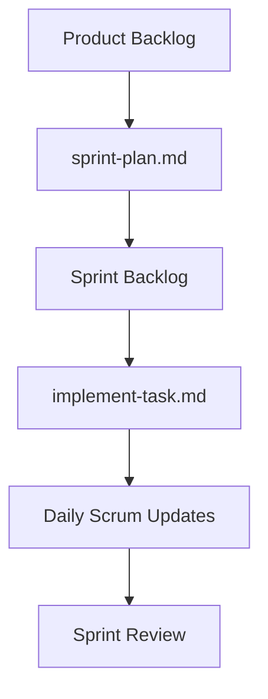
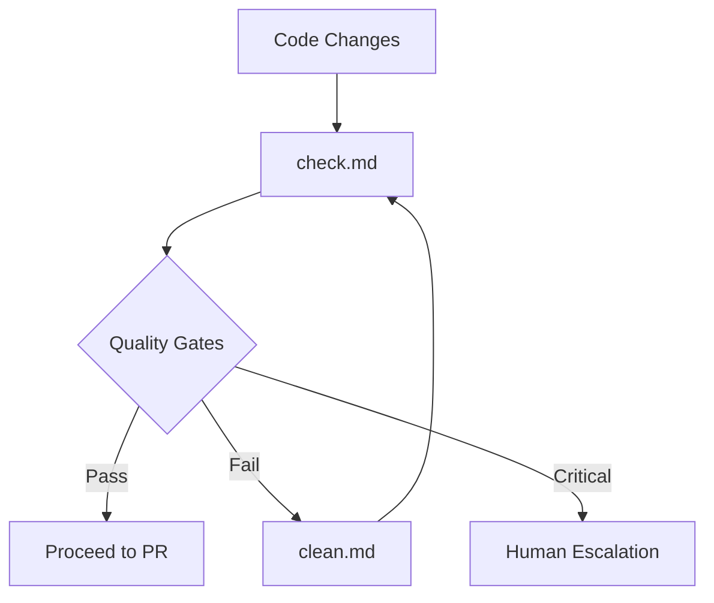
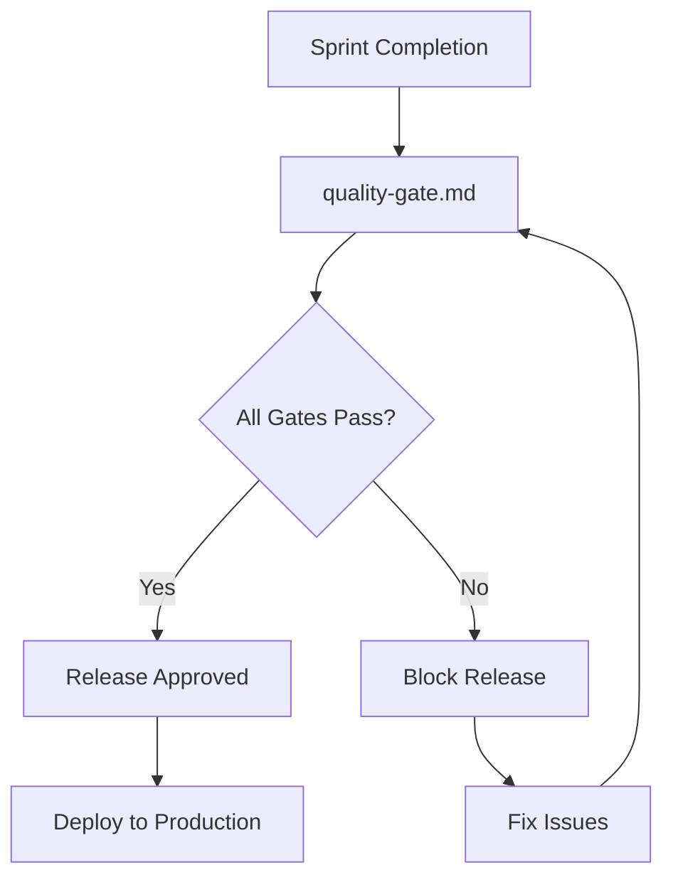
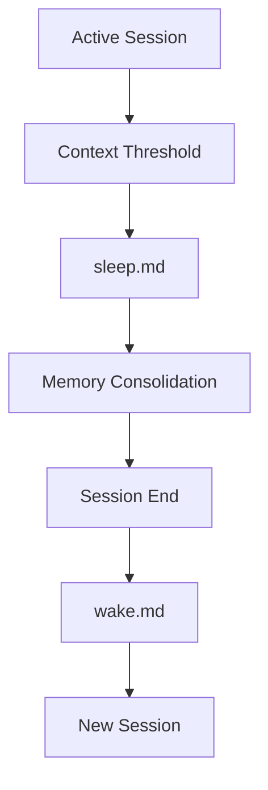
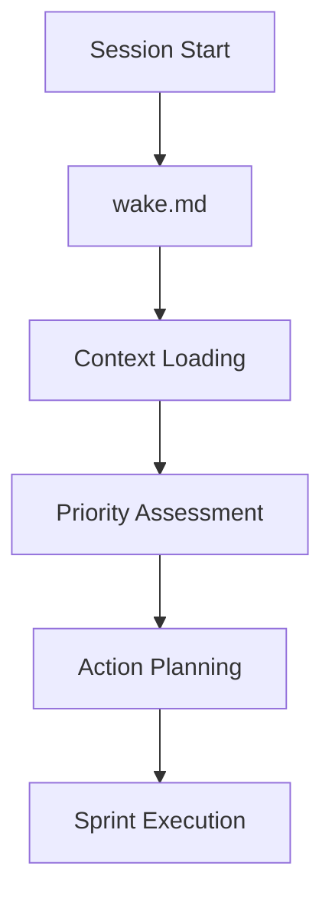
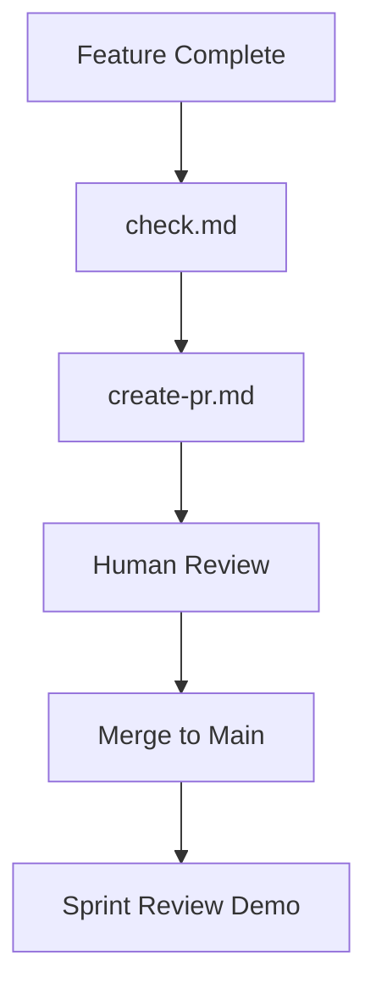
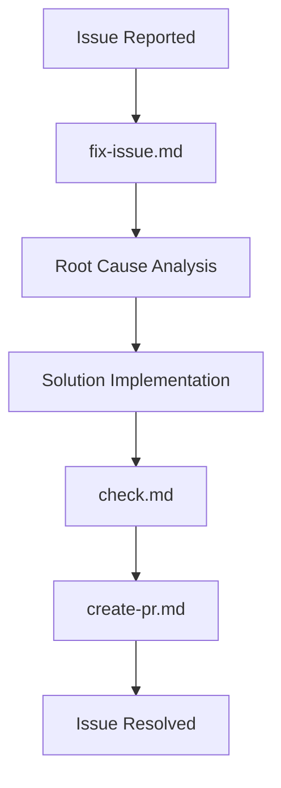

# Command Reference Manual
**Version 1.0** | **Created**: June 25, 2025 | **Status**: Phase 1 Implementation

---

## 📋 **Overview**

This manual provides comprehensive documentation for all custom commands in the DynaStory Agile-AI workflow system. Each command is documented with standardized specifications for purpose, Agile integration, triggers, and usage patterns.

### **Command Categories**
- **Memory Management**: Context optimization and session lifecycle
- **Development Lifecycle**: Feature implementation and quality assurance
- **Planning & Analysis**: Task breakdown and architectural review
- **Project Management**: Documentation and process automation
- **Integration & Reflection**: Process optimization and continuous improvement

### **Documentation Standards**
Each command includes:
- Purpose & Agile ceremony mapping
- Trigger conditions and prerequisites
- Input parameters and expected outputs
- Human handoff points and escalation protocols
- Success criteria and integration patterns
- Error handling and troubleshooting guides

---

## 🚀 **Priority Commands (Phase 1)**

### **Command: implement-task.md**

#### **Purpose**
Implements features with comprehensive GitHub tracking, automated issue creation, and progress monitoring. Primary command for Sprint execution phase of Scrum workflow.

#### **Agile Ceremony Mapping**
- **Primary**: Sprint Execution (Daily Scrum context)
- **Secondary**: Backlog Refinement (task decomposition)
- **Integration**: Links directly to Sprint Planning outcomes

#### **Trigger Conditions**
- **Manual**: Invoked when starting implementation of a user story or task
- **Automatic**: Triggered when GitHub issue is assigned to AI agent
- **Prerequisites**: 
  - GitHub repository access configured
  - Sprint backlog item identified
  - Acceptance criteria defined

#### **Input Parameters**
```bash
implement-task.md "Feature description or GitHub issue reference"
```
- **Required**: Task description or GitHub issue number
- **Optional**: Priority level, estimated effort, target milestone

#### **Expected Outputs**
1. **GitHub Issue**: Automatically created with standardized template
2. **Sub-tasks**: Decomposed into 4-hour maximum chunks
3. **Implementation Plan**: Technical approach documented in issue
4. **Progress Updates**: Status updates every 2 hours
5. **Draft PR**: Created when implementation complete
6. **Test Results**: Automated validation and reporting

#### **Human Handoff Points**
- **Confidence < 70%**: Request human guidance on technical approach
- **Complex Architecture**: Escalate architectural decisions to Tech Lead
- **Blocked Dependencies**: Human intervention for external blockers
- **Review Required**: Mark for human code review when complete

#### **Success Criteria**
- [ ] GitHub issue created with complete task breakdown
- [ ] Implementation approach documented and approved
- [ ] All sub-tasks completed with test coverage
- [ ] Code passes quality gates (check.md validation)
- [ ] Draft PR created with comprehensive description
- [ ] Ready for human review with confidence > 85%

#### **Integration Patterns**


#### **Error Handling**
- **GitHub API Failures**: Retry with exponential backoff, fallback to manual issue creation
- **Test Failures**: Execute fix-issue.md command automatically
- **Build Failures**: Execute debug-issue.md command for root cause analysis
- **Dependency Issues**: Escalate to human with detailed dependency analysis

#### **Examples**
```bash
# Example 1: Feature implementation
implement-task.md "Add dark mode toggle to settings screen"

# Example 2: Bug fix
implement-task.md "Fix memory leak in story generation #247"

# Example 3: Enhancement
implement-task.md "Improve story loading performance by 50%"
```

---

### **Command: sprint-plan.md**

#### **Purpose**
Analyzes product backlog and creates optimized sprint plans using GitHub Projects integration. Calculates team velocity, balances workload, and generates sprint documentation.

#### **Agile Ceremony Mapping**
- **Primary**: Sprint Planning (Scrum ceremony automation)
- **Secondary**: Backlog Refinement (continuous planning support)
- **Integration**: Feeds into Daily Scrum progress tracking

#### **Trigger Conditions**
- **Manual**: Invoked at start of sprint planning sessions
- **Automatic**: Triggered by sprint milestone creation or planning schedule
- **Prerequisites**:
  - GitHub Projects configured for team
  - Historical velocity data available (minimum 2 sprints)
  - Product backlog prioritized and estimated

#### **Input Parameters**
```bash
sprint-plan.md "2-week sprint starting July 1, 2025"
```
- **Required**: Sprint duration and start date
- **Optional**: Team capacity adjustments, special constraints, focus areas

#### **Expected Outputs**
1. **Velocity Analysis**: Historical data and capacity calculation
2. **Issue Selection**: Optimized backlog item selection for sprint
3. **Sprint Milestone**: GitHub milestone with due date and description
4. **Task Assignment**: Balanced workload distribution across team
5. **Sprint Documentation**: Goals, burndown chart, review agenda
6. **Risk Assessment**: Identified dependencies and potential blockers

#### **Human Handoff Points**
- **Priority Conflicts**: Escalate business value decisions to Product Owner
- **Capacity Concerns**: Discuss team availability with Scrum Master
- **Technical Risks**: Review complex dependencies with Tech Lead
- **Scope Approval**: Final sprint scope confirmation with stakeholders

#### **Success Criteria**
- [ ] Team velocity calculated from historical data
- [ ] Sprint capacity determined with availability factors
- [ ] Optimal issue selection completed with dependency analysis
- [ ] GitHub milestone created with proper due date
- [ ] Sprint backlog balanced across team members
- [ ] Sprint goal clearly defined and documented
- [ ] Risk mitigation plan documented for identified blockers

#### **Integration Patterns**


#### **Error Handling**
- **GitHub API Issues**: Fallback to manual milestone creation with detailed instructions
- **Insufficient Data**: Request historical sprint data or use conservative estimates
- **Capacity Conflicts**: Escalate to human with alternative sprint scope options
- **Dependency Issues**: Create explicit dependency tracking and escalation plan

#### **Examples**
```bash
# Example 1: Standard sprint
sprint-plan.md "2-week sprint starting Monday, focus on UI enhancements"

# Example 2: Short sprint
sprint-plan.md "1-week sprint for bug fixes before release"

# Example 3: Capacity-adjusted sprint  
sprint-plan.md "2-week sprint with holiday adjustments for July 4th"
```

---

### **Command: check.md**

#### **Purpose**
Performs comprehensive code quality and security analysis with static analysis integration. Essential component of Definition of Done and quality gate enforcement.

#### **Agile Ceremony Mapping**
- **Primary**: Definition of Done validation (continuous quality assurance)
- **Secondary**: Sprint Review preparation (quality metrics reporting)
- **Integration**: Mandatory gate before Sprint delivery

#### **Trigger Conditions**
- **Automatic**: Executed before every commit and PR creation
- **Manual**: Invoked for comprehensive quality audits
- **Prerequisites**:
  - Code changes staged or committed
  - Development environment configured
  - Quality tools and linters installed

#### **Input Parameters**
```bash
check.md [--scope=changed|all] [--format=detailed|summary]
```
- **Optional**: Scope of analysis (changed files only or entire codebase)
- **Optional**: Output format (detailed report or summary)
- **Optional**: Specific check categories to run

#### **Expected Outputs**
1. **Static Analysis Results**: Linting, formatting, and complexity metrics
2. **Security Scan Report**: Vulnerability assessment and recommendations
3. **Performance Analysis**: Bottleneck identification and optimization suggestions
4. **Standards Compliance**: Adherence to project coding standards
5. **Dependency Audit**: Security and license compliance check
6. **Quality Score**: Overall quality rating with improvement areas

#### **Human Handoff Points**
- **Security Vulnerabilities**: Immediate escalation for security team review
- **Performance Regressions**: Alert performance team for investigation
- **Standard Violations**: Request clarification on acceptable exceptions
- **Quality Failures**: Block progression until issues resolved or approved

#### **Success Criteria**
- [ ] All static analysis checks pass with zero critical issues
- [ ] Security scan completes with no high-severity vulnerabilities
- [ ] Performance metrics meet established benchmarks
- [ ] Code standards compliance at 95%+ level
- [ ] Dependency audit shows no critical security issues
- [ ] Overall quality score meets minimum threshold (configurable)

#### **Integration Patterns**


#### **Error Handling**
- **Tool Failures**: Retry with alternative tools, escalate if persistent
- **Configuration Issues**: Validate tool configuration and environment setup
- **False Positives**: Document exceptions and request human review
- **Performance Issues**: Optimize check execution or parallelize where possible

#### **Examples**
```bash
# Example 1: Full codebase audit
check.md --scope=all --format=detailed

# Example 2: Quick pre-commit check
check.md --scope=changed

# Example 3: Security-focused audit
check.md --focus=security --format=summary
```

---

### **Command: quality-gate.md**

#### **Purpose**
Comprehensive pre-release validation ensuring all quality standards are met before major releases or sprint deliveries. Final checkpoint in Definition of Done.

#### **Agile Ceremony Mapping**
- **Primary**: Sprint Review preparation (release readiness validation)
- **Secondary**: Definition of Done enforcement (quality assurance)
- **Integration**: Final gate before production deployment

#### **Trigger Conditions**
- **Automatic**: Triggered before major releases and sprint completion
- **Manual**: Invoked for comprehensive quality audits
- **Prerequisites**:
  - All sprint deliverables completed
  - Code quality checks passed
  - Test suites executed successfully

#### **Input Parameters**
```bash
quality-gate.md [--release-type=major|minor|patch] [--skip-checks=list]
```
- **Optional**: Release type for appropriate validation level
- **Optional**: Specific checks to skip with justification
- **Optional**: Target environment (staging, production)

#### **Expected Outputs**
1. **Comprehensive Quality Report**: All validation results consolidated
2. **Release Readiness Assessment**: Go/no-go recommendation with reasoning
3. **Risk Analysis**: Identified risks and mitigation strategies
4. **Performance Validation**: Benchmarks and regression analysis
5. **Security Clearance**: Security team sign-off status
6. **Deployment Checklist**: Final steps for production release

#### **Human Handoff Points**
- **Quality Failures**: Block release until issues resolved
- **Risk Assessment**: High-risk changes require stakeholder approval
- **Performance Regression**: Technical lead review for impact assessment
- **Security Concerns**: Immediate security team escalation

#### **Success Criteria**
- [ ] All code quality metrics meet established thresholds
- [ ] Security scan shows zero critical or high-severity issues
- [ ] Performance benchmarks meet or exceed targets
- [ ] Test coverage maintains minimum required percentage
- [ ] Documentation updated for all changes
- [ ] Stakeholder approval obtained for significant changes

#### **Integration Patterns**


#### **Error Handling**
- **Critical Failures**: Immediate release block with detailed remediation plan
- **Tool Failures**: Retry with backup validation methods
- **Timeout Issues**: Extend validation timeline or reduce scope with approval
- **Environment Issues**: Validate in alternative environment with risk assessment

#### **Examples**
```bash
# Example 1: Major release validation
quality-gate.md --release-type=major

# Example 2: Sprint delivery check
quality-gate.md --release-type=minor

# Example 3: Hotfix validation
quality-gate.md --release-type=patch --skip-checks=performance
```

---

### **Command: sleep.md**

#### **Purpose**
Comprehensive session consolidation and context preservation for AI memory management. Critical for maintaining context across sessions and optimizing performance.

#### **Agile Ceremony Mapping**
- **Primary**: Sprint Retrospective (session closure and learning consolidation)
- **Secondary**: Daily Scrum (end-of-day context preservation)
- **Integration**: Supports continuous improvement and knowledge retention

#### **Trigger Conditions**
- **Automatic**: Triggered when context usage reaches 85% threshold
- **Manual**: Invoked at natural session breakpoints
- **Prerequisites**:
  - Active session with accumulated context
  - Memory files directory accessible
  - Current work state stable

#### **Input Parameters**
```bash
sleep.md [--depth=light|full] [--preserve=context|insights|both]
```
- **Optional**: Consolidation depth (light optimization vs full consolidation)
- **Optional**: What to preserve (active context, insights, or both)
- **Optional**: Session summary focus areas

#### **Expected Outputs**
1. **Session Summary**: Comprehensive narrative of session activities
2. **Project State**: Structured data snapshot of current project status
3. **Reflection Notes**: Key learnings and patterns identified
4. **Next Tasks**: Prioritized action items for next session
5. **Context Optimization**: Memory usage reduced and organized
6. **Knowledge Extraction**: Reusable patterns and insights documented

#### **Human Handoff Points**
- **Critical Insights**: Share significant learnings with team
- **Blockers Identified**: Escalate unresolved issues requiring human intervention
- **Process Improvements**: Recommend workflow optimizations to team leads
- **Risk Alerts**: Highlight potential risks discovered during session

#### **Success Criteria**
- [ ] Session summary captures all significant activities and decisions
- [ ] Project state accurately reflects current status
- [ ] Key insights documented for future reference
- [ ] Next session priorities clearly defined
- [ ] Context usage optimized for next session startup
- [ ] Knowledge preserved in searchable format

#### **Integration Patterns**


#### **Error Handling**
- **Memory Write Failures**: Retry with alternative storage locations
- **Incomplete Consolidation**: Preserve critical context and alert for manual backup
- **Optimization Failures**: Continue with reduced optimization and log for review
- **Context Loss**: Maintain backup context and alert for recovery procedures

#### **Examples**
```bash
# Example 1: Standard end-of-session
sleep.md --depth=full

# Example 2: Quick context save
sleep.md --depth=light --preserve=context

# Example 3: Learning-focused consolidation
sleep.md --preserve=insights
```

---

### **Command: wake.md**

#### **Purpose**
Session restoration and context integration for AI agents. Loads preserved memory, integrates insights, and prepares for productive session continuation.

#### **Agile Ceremony Mapping**
- **Primary**: Sprint Planning (session initialization with context)
- **Secondary**: Daily Scrum (daily context restoration)
- **Integration**: Enables continuity across development cycles

#### **Trigger Conditions**
- **Automatic**: Triggered at start of new sessions
- **Manual**: Invoked when switching contexts or projects
- **Prerequisites**:
  - Memory files available from previous sessions
  - Access to project state information
  - Development environment ready

#### **Input Parameters**
```bash
wake.md [--session-type=continuation|fresh] [--focus=tasks|insights|both]
```
- **Optional**: Session type (continuing previous work vs fresh start)
- **Optional**: Focus area for context restoration
- **Optional**: Specific memory files to prioritize

#### **Expected Outputs**
1. **Context Restoration**: Previous session state loaded and integrated
2. **Priority Assessment**: Current tasks ranked by importance and urgency
3. **Status Summary**: Project status with recent changes incorporated
4. **Action Plan**: Next steps based on previous session insights
5. **Environment Setup**: Development environment configured for current tasks
6. **Knowledge Integration**: Previous learnings applied to current context

#### **Human Handoff Points**
- **Context Conflicts**: Resolve discrepancies between saved and current state
- **Priority Changes**: Confirm task priorities with stakeholders if significant changes
- **Environment Issues**: Request assistance if development setup incomplete
- **Knowledge Gaps**: Identify areas requiring human expertise or guidance

#### **Success Criteria**
- [ ] Previous session context successfully restored
- [ ] Current project state accurately reflects recent changes
- [ ] Task priorities updated based on latest information
- [ ] Development environment fully functional
- [ ] Previous insights integrated into current planning
- [ ] Clear action plan established for session

#### **Integration Patterns**


#### **Error Handling**
- **Memory File Corruption**: Attempt recovery from backups, escalate if critical
- **Context Mismatch**: Request clarification and use most recent valid state
- **Environment Failures**: Document issues and request manual setup assistance
- **Integration Conflicts**: Preserve both states and request human resolution

#### **Examples**
```bash
# Example 1: Standard session start
wake.md --session-type=continuation

# Example 2: Fresh project start
wake.md --session-type=fresh --focus=tasks

# Example 3: Insight-focused restoration
wake.md --focus=insights
```

---

### **Command: create-pr.md**

#### **Purpose**
Automated pull request creation with comprehensive quality gates, human review preparation, and integration with Agile workflow tracking.

#### **Agile Ceremony Mapping**
- **Primary**: Sprint Review (deliverable completion and demo preparation)
- **Secondary**: Definition of Done (final validation before delivery)
- **Integration**: Links sprint execution to stakeholder review

#### **Trigger Conditions**
- **Automatic**: Triggered when feature implementation completes quality gates
- **Manual**: Invoked when ready to submit work for review
- **Prerequisites**:
  - Code changes committed to feature branch
  - All quality checks passed (check.md validation)
  - Tests written and passing

#### **Input Parameters**
```bash
create-pr.md [--type=feature|bugfix|hotfix] [--target=main|develop] [--draft=true|false]
```
- **Optional**: PR type for appropriate template and review process
- **Optional**: Target branch for merge
- **Optional**: Draft status for work-in-progress submissions

#### **Expected Outputs**
1. **Pull Request**: Created with comprehensive description and metadata
2. **Review Checklist**: Generated based on changes and PR type
3. **Test Plan**: Validation steps for reviewers
4. **Performance Impact**: Analysis of performance implications
5. **Documentation Updates**: Links to updated documentation
6. **Review Assignment**: Appropriate reviewers assigned based on expertise

#### **Human Handoff Points**
- **Complex Changes**: Request specific expertise for review assignment
- **Breaking Changes**: Alert stakeholders and require additional approvals
- **Security Implications**: Require security team review
- **Performance Impact**: Request performance team validation

#### **Success Criteria**
- [ ] PR created with comprehensive description and context
- [ ] All automated checks passing (CI/CD pipeline green)
- [ ] Appropriate reviewers assigned based on change complexity
- [ ] Test plan includes validation steps for all changes
- [ ] Documentation updated for user-facing changes
- [ ] Performance impact assessed and documented

#### **Integration Patterns**


#### **Error Handling**
- **GitHub API Issues**: Retry with exponential backoff, provide manual instructions
- **Branch Conflicts**: Suggest merge conflict resolution steps
- **Missing Information**: Request additional context from previous commands
- **Review Assignment Failures**: Escalate to team lead for manual assignment

#### **Examples**
```bash
# Example 1: Feature PR
create-pr.md --type=feature --target=main

# Example 2: Bug fix PR
create-pr.md --type=bugfix --draft=false

# Example 3: Work in progress
create-pr.md --type=feature --draft=true
```

---

### **Command: fix-issue.md**

#### **Purpose**
Systematic resolution of GitHub issues with comprehensive analysis, testing strategy, and progress tracking. Primary command for bug resolution and technical debt reduction.

#### **Agile Ceremony Mapping**
- **Primary**: Sprint Execution (issue resolution during development)
- **Secondary**: Sprint Retrospective (root cause analysis and prevention)
- **Integration**: Supports sprint velocity and quality maintenance

#### **Trigger Conditions**
- **Automatic**: Triggered when test failures or build failures detected
- **Manual**: Invoked when assigned to specific GitHub issues
- **Prerequisites**:
  - GitHub issue identified with clear reproduction steps
  - Development environment accessible
  - Issue priority and severity assessed

#### **Input Parameters**
```bash
fix-issue.md "#123" [--priority=critical|high|medium|low] [--type=bug|enhancement|task]
```
- **Required**: GitHub issue number or issue URL
- **Optional**: Priority level for resource allocation
- **Optional**: Issue type for appropriate resolution approach

#### **Expected Outputs**
1. **Issue Analysis**: Root cause investigation and findings
2. **Solution Plan**: Technical approach and implementation strategy
3. **Code Changes**: Implementation with comprehensive testing
4. **Validation Results**: Test results demonstrating fix effectiveness
5. **Documentation Updates**: Updated docs reflecting changes
6. **Prevention Measures**: Recommendations to prevent similar issues

#### **Human Handoff Points**
- **Complex Root Causes**: Escalate architectural or design issues
- **Breaking Changes**: Require stakeholder approval for significant changes
- **Cross-Team Dependencies**: Coordinate with other teams for resolution
- **Risk Assessment**: High-risk fixes require additional review

#### **Success Criteria**
- [ ] Root cause identified and documented
- [ ] Solution implemented with comprehensive test coverage
- [ ] Fix validated against original issue reproduction steps
- [ ] No regressions introduced by changes
- [ ] Documentation updated to reflect changes
- [ ] Prevention measures identified and documented

#### **Integration Patterns**


#### **Error Handling**
- **Unable to Reproduce**: Request additional information from issue reporter
- **Complex Dependencies**: Break into smaller sub-issues with clear scope
- **Test Failures**: Iterate on solution until all tests pass
- **Regression Detection**: Revert changes and reassess approach

#### **Examples**
```bash
# Example 1: Critical bug fix
fix-issue.md "#247" --priority=critical

# Example 2: Enhancement request
fix-issue.md "#156" --type=enhancement

# Example 3: Technical debt
fix-issue.md "#89" --priority=medium --type=task
```

---

## 🔧 **Development Lifecycle Commands (Continued)**

### **Command: tdd-implement.md**

#### **Purpose**
Implements features using strict Test-Driven Development methodology with Red-Green-Refactor cycle. Ensures high code quality and comprehensive test coverage through disciplined TDD approach.

#### **Agile Ceremony Mapping**
- **Primary**: Sprint Execution (test-first development)
- **Secondary**: Definition of Done (test coverage requirements)
- **Integration**: Quality-driven development cycle

#### **Trigger Conditions**
- **Manual**: Invoked for new feature development requiring high test coverage
- **Automatic**: Triggered when TDD approach is specified in user story
- **Prerequisites**:
  - Clear feature requirements and acceptance criteria
  - Testing framework configured and accessible
  - Development environment ready for test execution

#### **Input Parameters**
```bash
tdd-implement.md "Feature description with specific behaviors"
```
- **Required**: Feature description with testable behaviors
- **Optional**: Testing framework preferences, coverage targets

#### **Expected Outputs**
1. **Failing Tests**: Initial test suite that captures desired behavior
2. **Minimal Implementation**: Code that makes tests pass
3. **Refactored Code**: Clean, maintainable implementation
4. **Test Documentation**: Tests that serve as living documentation
5. **Coverage Report**: Comprehensive test coverage metrics
6. **Cycle Documentation**: Record of Red-Green-Refactor iterations

#### **Human Handoff Points**
- **Complex Behavior Definition**: Clarify ambiguous requirements
- **Test Strategy**: Validate testing approach for complex features
- **Refactoring Decisions**: Review architectural implications
- **Coverage Adequacy**: Confirm test coverage meets team standards

#### **Success Criteria**
- [ ] All tests pass consistently
- [ ] Code coverage meets or exceeds target percentage
- [ ] Implementation follows clean code principles
- [ ] Tests clearly document expected behavior
- [ ] No duplication in production code
- [ ] Refactoring maintains all existing functionality

---

### **Command: task-breakdown.md**

#### **Purpose**
Analyzes feature requirements and creates manageable task hierarchies. Decomposes complex features into implementable components with clear dependencies and effort estimates.

#### **Agile Ceremony Mapping**
- **Primary**: Backlog Refinement (story decomposition)
- **Secondary**: Sprint Planning (task planning and estimation)
- **Integration**: Feeds detailed tasks to sprint planning process

#### **Trigger Conditions**
- **Manual**: Invoked for complex features requiring decomposition
- **Automatic**: Triggered when story is marked for breakdown
- **Prerequisites**:
  - Feature requirements documented
  - Acceptance criteria defined
  - Stakeholder availability for clarification

#### **Input Parameters**
```bash
task-breakdown.md "Feature: User profile management system"
```
- **Required**: Feature description with scope definition
- **Optional**: Complexity constraints, team skill considerations

#### **Expected Outputs**
1. **Requirements Analysis**: Complete feature scope and objectives
2. **Component Identification**: Logical breakdown of feature components
3. **Dependency Map**: Visual representation of task dependencies
4. **Task Definitions**: Specific, actionable tasks with clear deliverables
5. **Effort Estimates**: Time and complexity estimates for each task
6. **Implementation Plan**: Sequenced approach with milestones

#### **Human Handoff Points**
- **Requirements Clarification**: Resolve ambiguous or conflicting requirements
- **Technical Decisions**: Validate architectural approach and technology choices
- **Prioritization**: Confirm business priority and feature importance
- **Resource Allocation**: Discuss team capacity and skill requirements

#### **Success Criteria**
- [ ] All requirements clearly documented and understood
- [ ] Tasks sized appropriately (1-3 days maximum)
- [ ] Dependencies identified and mapped
- [ ] Effort estimates realistic and validated
- [ ] Implementation sequence logical and efficient
- [ ] Risks and assumptions documented

---

### **Command: debug-issue.md**

#### **Purpose**
Autonomous debugging with minimal human intervention using structured root cause analysis. Systematically identifies, analyzes, and resolves issues while maintaining comprehensive documentation.

#### **Agile Ceremony Mapping**
- **Primary**: Sprint Execution (issue resolution during development)
- **Secondary**: Sprint Retrospective (root cause analysis for process improvement)
- **Integration**: Supports continuous delivery and quality maintenance

#### **Trigger Conditions**
- **Automatic**: Triggered by build failures, test failures, or runtime errors
- **Manual**: Invoked for complex debugging scenarios
- **Prerequisites**:
  - Clear error description or reproduction steps
  - Access to relevant logs and debugging tools
  - Development environment configured for debugging

#### **Input Parameters**
```bash
debug-issue.md "Issue: Memory leak in story generation component"
```
- **Required**: Issue description with error details
- **Optional**: Confidence threshold for human escalation, debugging depth

#### **Expected Outputs**
1. **Issue Reproduction**: Confirmed reproduction with documented steps
2. **Root Cause Analysis**: Detailed investigation with findings
3. **Solution Options**: Multiple potential fixes with trade-offs
4. **Fix Implementation**: Applied solution with verification
5. **Regression Tests**: Tests to prevent similar issues
6. **Documentation**: Complete debugging process record

#### **Human Handoff Points**
- **Confidence < 80%**: Escalate complex issues requiring expertise
- **System-Wide Impact**: Review changes affecting multiple components
- **Performance Trade-offs**: Validate performance impact of fixes
- **Architecture Implications**: Discuss structural changes with tech lead

#### **Success Criteria**
- [ ] Issue successfully reproduced and documented
- [ ] Root cause identified with high confidence
- [ ] Solution implemented without introducing regressions
- [ ] Comprehensive test coverage for fix
- [ ] Performance impact assessed and acceptable
- [ ] Documentation updated to prevent recurrence

---

### **Command: optimize.md**

#### **Purpose**
Analyzes and optimizes code performance with concrete improvements. Identifies bottlenecks, implements optimizations, and measures performance gains with data-driven approach.

#### **Agile Ceremony Mapping**
- **Primary**: Technical Debt Sprint (performance improvement focus)
- **Secondary**: Sprint Review (performance metrics demonstration)
- **Integration**: Supports non-functional requirements and user satisfaction

#### **Trigger Conditions**
- **Automatic**: Triggered by performance regression detection
- **Manual**: Invoked for proactive performance improvement
- **Prerequisites**:
  - Performance benchmarks and targets defined
  - Profiling tools available and configured
  - Representative test data and scenarios

#### **Input Parameters**
```bash
optimize.md "Component: Story generation pipeline"
```
- **Required**: Component or system area for optimization
- **Optional**: Performance targets, optimization priorities

#### **Expected Outputs**
1. **Performance Profile**: Current performance baseline with bottlenecks
2. **Optimization Plan**: Prioritized improvements with expected impact
3. **Implementation**: Applied optimizations with measurement
4. **Performance Gains**: Quantified improvements with before/after metrics
5. **Trade-off Analysis**: Impact on maintainability and complexity
6. **Monitoring Setup**: Ongoing performance tracking implementation

#### **Human Handoff Points**
- **Architecture Changes**: Review structural optimizations with tech lead
- **Resource Trade-offs**: Discuss memory vs. speed optimization choices
- **Business Impact**: Validate optimization priorities with product owner
- **Complexity Increase**: Review maintainability impact of optimizations

#### **Success Criteria**
- [ ] Performance bottlenecks identified and prioritized
- [ ] Optimizations implemented with measurable impact
- [ ] Performance targets met or exceeded
- [ ] No functional regressions introduced
- [ ] Code maintainability preserved or improved
- [ ] Monitoring established for continued optimization

---

### **Command: clean.md**

#### **Purpose**
Addresses formatting and quality issues systematically. Automates code cleanup, linting resolution, and documentation maintenance to ensure consistent code quality standards.

#### **Agile Ceremony Mapping**
- **Primary**: Definition of Done (code quality standards)
- **Secondary**: Sprint Execution (continuous quality maintenance)
- **Integration**: Pre-commit quality gate and code review preparation

#### **Trigger Conditions**
- **Automatic**: Triggered when code quality issues detected
- **Manual**: Invoked for comprehensive code cleanup
- **Prerequisites**:
  - Code formatters and linters configured
  - Code quality standards defined
  - Development environment ready for automated fixes

#### **Input Parameters**
```bash
clean.md [--scope=changed|all] [--fix-level=basic|comprehensive]
```
- **Optional**: Scope of cleanup (changed files vs entire codebase)
- **Optional**: Level of fixes (basic formatting vs comprehensive cleanup)

#### **Expected Outputs**
1. **Format Consistency**: Applied formatting standards across codebase
2. **Lint Resolution**: Fixed all linting warnings and errors
3. **Code Organization**: Improved structure and organization
4. **Type Safety**: Enhanced type annotations and safety
5. **Documentation Updates**: Cleaned and updated documentation
6. **Quality Validation**: Confirmed all quality checks pass

#### **Human Handoff Points**
- **Breaking Changes**: Review changes that might affect functionality
- **Style Decisions**: Confirm formatting choices for edge cases
- **Documentation Changes**: Validate updated documentation accuracy
- **Performance Impact**: Review cleanup impact on build times

#### **Success Criteria**
- [ ] All formatting standards consistently applied
- [ ] Zero linting warnings or errors remaining
- [ ] Code organization improved and logical
- [ ] Type safety enhanced where applicable
- [ ] Documentation accurate and up-to-date
- [ ] All quality gates pass without exceptions

---

### **Command: run-ci.md**

#### **Purpose**
Activates virtual environments, runs CI checks, and iteratively fixes errors. Ensures comprehensive validation of code changes through automated testing and quality assurance.

#### **Agile Ceremony Mapping**
- **Primary**: Definition of Done (CI/CD pipeline validation)
- **Secondary**: Sprint Execution (continuous integration support)
- **Integration**: Quality gate enforcement and deployment readiness

#### **Trigger Conditions**
- **Automatic**: Triggered on code commits and PR creation
- **Manual**: Invoked for comprehensive CI validation
- **Prerequisites**:
  - CI/CD pipeline configured and accessible
  - All dependencies and environments available
  - Test suites comprehensive and reliable

#### **Input Parameters**
```bash
run-ci.md [--stage=all|tests|build|deploy] [--fix-failures=true|false]
```
- **Optional**: CI stage to execute (full pipeline vs specific stages)
- **Optional**: Whether to automatically fix failures where possible

#### **Expected Outputs**
1. **Environment Validation**: Confirmed environment setup and dependencies
2. **Test Results**: Comprehensive test execution with coverage
3. **Build Validation**: Successful build with artifact generation
4. **Quality Reports**: Static analysis and security scan results
5. **Error Resolution**: Fixed issues with iterative validation
6. **Pipeline Status**: Final CI/CD pipeline success confirmation

#### **Human Handoff Points**
- **Critical Failures**: Escalate failures requiring architectural changes
- **Environment Issues**: Request infrastructure support for CI problems
- **Test Strategy**: Review test failures for adequacy of test coverage
- **Deployment Readiness**: Confirm readiness for production deployment

#### **Success Criteria**
- [ ] All CI pipeline stages pass successfully
- [ ] Test coverage meets minimum requirements
- [ ] Build artifacts generated without errors
- [ ] Quality gates satisfied with no critical issues
- [ ] Performance benchmarks within acceptable ranges
- [ ] Ready for deployment to target environment

---

## 🎯 **Planning & Analysis Commands (Continued)**

### **Command: architecture-review.md**

#### **Purpose**
Provides comprehensive architectural analysis including system design patterns, scalability assessment, and future-proofing recommendations. Evaluates technical architecture for quality and maintainability.

#### **Agile Ceremony Mapping**
- **Primary**: Architecture Review (technical design validation)
- **Secondary**: Sprint Planning (technical feasibility assessment)
- **Integration**: Technical debt identification and architectural evolution

#### **Trigger Conditions**
- **Manual**: Invoked for significant architectural decisions
- **Automatic**: Triggered when architectural changes detected
- **Prerequisites**:
  - Current system architecture documented
  - Business requirements and constraints understood
  - Technical team available for review discussion

#### **Input Parameters**
```bash
architecture-review.md "Component: User authentication system"
```
- **Required**: System or component for architectural analysis
- **Optional**: Review focus areas, specific concerns or requirements

#### **Expected Outputs**
1. **Architecture Analysis**: Current system design assessment
2. **Pattern Evaluation**: Design patterns usage and effectiveness
3. **Scalability Assessment**: Growth capacity and bottleneck identification
4. **Security Review**: Security architecture and risk assessment
5. **Improvement Recommendations**: Prioritized architectural enhancements
6. **Technical Debt Analysis**: Current debt and remediation strategies

#### **Human Handoff Points**
- **Strategic Decisions**: Involve architectural team for major decisions
- **Business Alignment**: Validate architectural choices with business goals
- **Resource Planning**: Discuss implementation effort and timeline
- **Risk Assessment**: Review and approve high-risk architectural changes

#### **Success Criteria**
- [ ] Comprehensive analysis of current architecture completed
- [ ] Design patterns evaluated for appropriateness
- [ ] Scalability concerns identified and addressed
- [ ] Security architecture validated and improved
- [ ] Clear recommendations with priorities established
- [ ] Technical debt roadmap created and approved

---

### **Command: review-screen.md**

#### **Purpose**
Reviews screen UI/UX against mockups and PRD expectations. Validates design implementation, identifies gaps, and creates asset briefs for missing components.

#### **Agile Ceremony Mapping**
- **Primary**: Sprint Review (demo preparation and validation)
- **Secondary**: Definition of Done (UI/UX quality standards)
- **Integration**: Design-development feedback loop and quality assurance

#### **Trigger Conditions**
- **Manual**: Invoked during UI implementation review
- **Automatic**: Triggered when UI changes are committed
- **Prerequisites**:
  - Design mockups and specifications available
  - PRD requirements documented
  - Current implementation accessible for review

#### **Input Parameters**
```bash
review-screen.md "Screen: User profile settings page"
```
- **Required**: Screen or component for review
- **Optional**: Specific mockup references, review focus areas

#### **Expected Outputs**
1. **PRD Comparison**: Analysis against product requirements
2. **Mockup Evaluation**: Visual comparison with design specifications
3. **Gap Analysis**: Identified differences and missing elements
4. **Asset Requirements**: Detailed briefs for missing design assets
5. **Implementation Plan**: Prioritized improvements and fixes
6. **Quality Assessment**: Overall UI/UX quality evaluation

#### **Human Handoff Points**
- **Design Decisions**: Consult with design team for interpretation
- **Business Requirements**: Clarify requirements with product owner
- **Technical Constraints**: Discuss implementation limitations with team
- **User Experience**: Validate UX decisions with user research

#### **Success Criteria**
- [ ] Complete comparison with PRD requirements
- [ ] All design mockup elements evaluated
- [ ] Gaps clearly identified and documented
- [ ] Asset briefs created for all missing components
- [ ] Implementation plan prioritized and realistic
- [ ] Quality standards met or improvement plan created

### **Command: create-docs.md**

#### **Purpose**
Analyzes code structure and creates thorough documentation for APIs, user guides, and technical specifications. Comprehensive documentation generation for all project components and processes.

#### **Agile Ceremony Mapping**
- **Primary**: Definition of Done (documentation requirements)
- **Secondary**: Sprint Review (deliverable documentation)
- **Integration**: Knowledge management and team onboarding support

#### **Trigger Conditions**
- **Manual**: Invoked for comprehensive documentation creation
- **Automatic**: Triggered when new features require documentation
- **Prerequisites**:
  - Code structure stable and documented
  - API interfaces defined and tested
  - User requirements and use cases understood

#### **Input Parameters**
```bash
create-docs.md "Component: Story generation API"
```
- **Required**: Component or system area requiring documentation
- **Optional**: Documentation type focus, target audience

#### **Expected Outputs**
1. **API Documentation**: Complete interface specifications with examples
2. **User Guides**: Step-by-step usage instructions and tutorials
3. **Technical Specifications**: Architecture and implementation details
4. **Developer Documentation**: Setup, contribution, and testing procedures
5. **Behavioral Documentation**: System logic and decision flows
6. **Maintenance Guides**: Update, monitoring, and troubleshooting procedures

#### **Human Handoff Points**
- **Technical Accuracy**: Review complex technical explanations
- **User Experience**: Validate documentation usability with target audience
- **Business Context**: Confirm business logic explanations accuracy
- **Compliance Requirements**: Ensure regulatory and legal documentation standards

#### **Success Criteria**
- [ ] Complete API documentation with working examples
- [ ] User guides tested with target audience
- [ ] Technical specifications accurate and comprehensive
- [ ] Developer documentation enables quick onboarding
- [ ] All documentation maintained and version-controlled
- [ ] Accessibility and style standards met

---

### **Command: create-worktree.md**

#### **Purpose**
Creates git worktrees for parallel development on multiple branches. Enables efficient context switching and concurrent development of multiple features or experiments.

#### **Agile Ceremony Mapping**
- **Primary**: Sprint Planning (parallel work organization)
- **Secondary**: Sprint Execution (efficient development workflows)
- **Integration**: Feature branch management and development velocity optimization

#### **Trigger Conditions**
- **Manual**: Invoked when parallel development required
- **Automatic**: Triggered by complex feature with multiple work streams
- **Prerequisites**:
  - Main repository in clean state
  - Multiple branches or features identified for parallel work
  - Adequate disk space and development environment capacity

#### **Input Parameters**
```bash
create-worktree.md "Features: user-auth, payment-system, analytics"
```
- **Required**: List of branches or features for parallel development
- **Optional**: Directory naming conventions, shared configuration requirements

#### **Expected Outputs**
1. **Worktree Structure**: Organized directory layout for parallel development
2. **Environment Setup**: Configured development environment for each worktree
3. **Synchronization Scripts**: Tools for managing updates across worktrees
4. **Documentation**: Usage guidelines and best practices
5. **Cleanup Procedures**: Maintenance and removal processes
6. **Integration Workflows**: Branch merging and synchronization strategies

#### **Human Handoff Points**
- **Resource Planning**: Confirm adequate system resources for parallel development
- **Workflow Design**: Validate parallel development strategy with team
- **Conflict Resolution**: Establish procedures for managing merge conflicts
- **Team Coordination**: Ensure clear ownership and communication protocols

#### **Success Criteria**
- [ ] All worktrees created and properly configured
- [ ] Development environments functional in each worktree
- [ ] Synchronization procedures tested and documented
- [ ] Team trained on parallel development workflows
- [ ] Conflict resolution procedures established
- [ ] Cleanup and maintenance schedules defined

---

### **Command: init-ios-project.md**

#### **Purpose**
Sets up complete iOS project structure for DynaStory with privacy compliance, safety requirements, and development environment configuration. Automated project initialization following Apple guidelines.

#### **Agile Ceremony Mapping**
- **Primary**: Project Initiation (foundational setup)
- **Secondary**: Sprint 0 (infrastructure and tooling setup)
- **Integration**: Development environment standardization and compliance

#### **Trigger Conditions**
- **Manual**: Invoked for new iOS project creation
- **Automatic**: Triggered by project initialization requirements
- **Prerequisites**:
  - Xcode and iOS development tools installed
  - Project requirements and specifications documented
  - GitHub repository created and accessible

#### **Input Parameters**
```bash
init-ios-project.md "Project: DynaStory iOS App"
```
- **Required**: Project name and basic configuration
- **Optional**: iOS version targets, specific framework requirements

#### **Expected Outputs**
1. **Xcode Project**: Complete iOS project structure with proper configuration
2. **Privacy Configuration**: COPPA compliance and privacy protection setup
3. **Development Environment**: SwiftLint, testing framework, and build configuration
4. **Initial Views**: Basic app structure with age-appropriate UI components
5. **GitHub Integration**: Issue templates and project management setup
6. **Documentation**: Setup instructions and development guidelines

#### **Human Handoff Points**
- **Business Requirements**: Validate project scope and feature requirements
- **Compliance Review**: Confirm privacy and safety requirements implementation
- **Technical Architecture**: Review iOS-specific architectural decisions
- **Team Onboarding**: Ensure development team can access and use setup

#### **Success Criteria**
- [ ] Xcode project builds successfully without errors
- [ ] Privacy and safety configurations properly implemented
- [ ] Development tools integrated and functional
- [ ] Basic app structure follows iOS design guidelines
- [ ] GitHub integration configured for project management
- [ ] Team can successfully set up development environment

---

### **Command: context-prime.md**

#### **Purpose**
Primes Claude with comprehensive project understanding and collaboration parameters. Establishes optimal context for productive AI-human collaboration through systematic project analysis.

#### **Agile Ceremony Mapping**
- **Primary**: Sprint Planning (context establishment for new work)
- **Secondary**: Daily Scrum (context refresh and alignment)
- **Integration**: Session optimization and knowledge management

#### **Trigger Conditions**
- **Automatic**: Triggered at session start or context switches
- **Manual**: Invoked when comprehensive project understanding needed
- **Prerequisites**:
  - Project accessible and readable
  - Development environment configured
  - Team collaboration preferences defined

#### **Input Parameters**
```bash
context-prime.md [--depth=comprehensive|focused] [--area=tech|business|team]
```
- **Optional**: Analysis depth (comprehensive vs focused on specific areas)
- **Optional**: Focus area for targeted context building

#### **Expected Outputs**
1. **Project Analysis**: Complete understanding of structure, purpose, and goals
2. **Technology Stack**: Comprehensive mapping of tools, frameworks, and dependencies
3. **Development Environment**: Setup requirements and configuration understanding
4. **Team Dynamics**: Collaboration patterns and communication preferences
5. **Context Optimization**: Efficient session setup for maximum productivity
6. **Knowledge Integration**: Previous project learnings and best practices

#### **Human Handoff Points**
- **Business Context**: Clarify business goals and user requirements
- **Team Preferences**: Confirm collaboration style and communication patterns
- **Technical Decisions**: Validate understanding of architectural choices
- **Process Alignment**: Ensure AI approach aligns with team processes

#### **Success Criteria**
- [ ] Complete project structure and purpose understood
- [ ] Technology stack and dependencies mapped
- [ ] Development environment requirements clear
- [ ] Team collaboration parameters established
- [ ] Session optimized for productive collaboration
- [ ] Previous learnings integrated into current context

---

## 🔬 **Advanced Analysis & Reflection Commands**

### **Command: code-analysis.md**

#### **Purpose**
Performs comprehensive code analysis with GitHub integration for automated issue creation. Advanced analysis including architecture patterns, security vulnerabilities, and performance benchmarking with actionable recommendations.

#### **Agile Ceremony Mapping**
- **Primary**: Technical Debt Sprint (comprehensive analysis and improvement planning)
- **Secondary**: Sprint Retrospective (code quality assessment and learning)
- **Integration**: Continuous improvement and technical excellence initiatives

#### **Trigger Conditions**
- **Manual**: Invoked for comprehensive codebase assessment
- **Automatic**: Triggered during major releases or technical debt sprints
- **Prerequisites**:
  - Complete codebase accessible
  - GitHub API access configured
  - Analysis tools and security scanners available

#### **Input Parameters**
```bash
code-analysis.md [--scope=all|module|component] [--focus=security|performance|architecture]
```
- **Optional**: Analysis scope (entire codebase vs specific areas)
- **Optional**: Focus area for targeted analysis

#### **Expected Outputs**
1. **Architecture Analysis**: Pattern recognition and anti-pattern identification
2. **Security Assessment**: Vulnerability detection with CVSS scores
3. **Performance Profiling**: Bottleneck identification with benchmarks
4. **GitHub Issues**: Automated issue creation for high-priority findings
5. **Dependency Mapping**: Visual dependency graphs and risk assessment
6. **Executive Summary**: Dashboard-ready metrics and remediation roadmap

#### **Human Handoff Points**
- **Critical Security Findings**: Immediate escalation to security team
- **Architecture Decisions**: Review structural recommendations with tech leads
- **Performance Trade-offs**: Discuss optimization priorities with stakeholders
- **Resource Planning**: Validate remediation effort estimates

#### **Success Criteria**
- [ ] Comprehensive analysis completed across all focus areas
- [ ] High-priority findings converted to actionable GitHub issues
- [ ] Security vulnerabilities assessed and prioritized
- [ ] Performance baselines established with clear targets
- [ ] Dependency risks identified and documented
- [ ] Executive summary provides clear remediation roadmap

---

### **Command: consolidate-light.md**

#### **Purpose**
Performs lightweight memory consolidation while preserving active context. Quick memory optimization designed for seamless session continuation without full context reset.

#### **Agile Ceremony Mapping**
- **Primary**: Continuous Improvement (ongoing optimization)
- **Secondary**: Daily Scrum (context maintenance)
- **Integration**: Session efficiency and memory management

#### **Trigger Conditions**
- **Automatic**: Triggered at 75% context window capacity
- **Manual**: Invoked for quick context optimization
- **Prerequisites**:
  - Active session with accumulated context
  - Memory files accessible
  - Current work state stable

#### **Input Parameters**
```bash
consolidate-light.md [--preserve=all|critical] [--update=working-notes|task-state]
```
- **Optional**: Level of context preservation
- **Optional**: Specific memory components to update

#### **Expected Outputs**
1. **Working Notes Update**: Current progress and decisions captured
2. **Task State Preservation**: Active task context maintained
3. **Pattern Recognition**: Important discoveries documented
4. **Context Metrics**: Usage optimization for future planning
5. **Seamless Continuation**: Full active conversation preserved
6. **Performance Optimization**: Minimal impact on session flow

#### **Human Handoff Points**
- **Context Concerns**: Alert if critical context at risk
- **Performance Issues**: Escalate if optimization fails
- **Memory Conflicts**: Request guidance for competing priorities
- **Session Continuity**: Confirm if major interruption acceptable

#### **Success Criteria**
- [ ] Context usage optimized without losing active state
- [ ] Working notes accurately reflect current progress
- [ ] Task state preserved for seamless continuation
- [ ] Key insights and patterns documented
- [ ] Performance impact minimal and acceptable
- [ ] Session continues without interruption

---

### **Command: dream.md**

#### **Purpose**
Creative memory processing for innovation generation and novel solution exploration. Advanced reasoning and pattern synthesis for breakthrough insights and alternative approaches.

#### **Agile Ceremony Mapping**
- **Primary**: Innovation Sprints (creative problem-solving)
- **Secondary**: Sprint Retrospective (creative reflection and learning)
- **Integration**: R&D initiatives and breakthrough innovation

#### **Trigger Conditions**
- **Manual**: Invoked for creative problem-solving sessions
- **Automatic**: Triggered during innovation sprints or complex challenges
- **Prerequisites**:
  - Significant project context accumulated
  - Complex problems or innovation opportunities identified
  - Creative exploration time allocated

#### **Input Parameters**
```bash
dream.md [--focus=innovation|architecture|debugging] [--depth=creative|experimental]
```
- **Optional**: Focus area for creative exploration
- **Optional**: Depth of creative processing

#### **Expected Outputs**
1. **Novel Connections**: Unexpected combinations of project elements
2. **Alternative Solutions**: Unconventional implementation approaches
3. **Creative Debugging**: Innovative problem-solving strategies
4. **Pattern Recognition**: Reusable design patterns and abstractions
5. **Innovation Documentation**: Comprehensive creative insights captured
6. **Cross-Domain Insights**: External knowledge applied to current challenges

#### **Human Handoff Points**
- **Innovation Validation**: Review creative solutions for feasibility
- **Strategic Alignment**: Ensure innovations align with business goals
- **Resource Implications**: Assess implementation effort for novel approaches
- **Risk Assessment**: Evaluate experimental approaches for production readiness

#### **Success Criteria**
- [ ] Novel solution approaches generated and documented
- [ ] Creative connections between disparate elements identified
- [ ] Alternative architectural patterns explored
- [ ] Innovation insights captured in searchable format
- [ ] Cross-domain knowledge successfully applied
- [ ] Creative debugging strategies developed

---

### **Command: meditate_integration.md**

#### **Purpose**
Integrates meditation command for cognitive optimization and reflection cycles. Systematic approach to context efficiency improvement and error pattern recognition through reflective practice.

#### **Agile Ceremony Mapping**
- **Primary**: Sprint Retrospective (reflective practice and learning)
- **Secondary**: Continuous Improvement (cognitive optimization)
- **Integration**: Personal mastery and learning organization practices

#### **Trigger Conditions**
- **Automatic**: At 85% context usage, after task completion, before sleep cycles
- **Manual**: Invoked for focused reflection or cognitive reset
- **Prerequisites**:
  - Meditation command accessible and configured
  - Session history available for reflection
  - Adequate time allocated for reflection process

#### **Input Parameters**
```bash
meditate_integration.md [--depth=light|deep|full] [--focus=patterns|alignment|learning]
```
- **Optional**: Meditation depth (quick check-in vs thorough reflection)
- **Optional**: Focus area for targeted reflection

#### **Expected Outputs**
1. **Context Efficiency**: 20-30% improvement in context usage
2. **Pattern Recognition**: Enhanced error and success pattern identification
3. **Task Alignment**: Improved focus and priority alignment
4. **Learning Integration**: Continuous learning through reflective practice
5. **Cognitive Reset**: Mental clarity and decision-making improvement
6. **Session Storage**: Meditation insights preserved for future reference

#### **Human Handoff Points**
- **Learning Insights**: Share significant pattern discoveries with team
- **Process Improvements**: Recommend workflow optimizations based on reflection
- **Alignment Issues**: Escalate task priority or goal conflicts
- **Cognitive Challenges**: Request support for complex decision-making

#### **Success Criteria**
- [ ] Context efficiency measurably improved
- [ ] Error patterns identified and documented
- [ ] Task alignment confirmed and optimized
- [ ] Learning insights captured and actionable
- [ ] Cognitive clarity enhanced for decision-making
- [ ] Reflection process integrated into workflow

---

## 📊 **Command Integration Summary**

### **Phase 1 Command Relationships**

| Command | Triggers | Integrates With | Output Used By |
|---------|----------|-----------------|----------------|
| sprint-plan.md | Sprint start | GitHub Projects | implement-task.md |
| implement-task.md | User stories | check.md, fix-issue.md | create-pr.md |
| check.md | Code changes | clean.md, quality-gate.md | create-pr.md |
| quality-gate.md | Sprint completion | All validation commands | Release process |
| sleep.md | Context threshold | All commands | wake.md |
| wake.md | Session start | Memory files | All commands |
| create-pr.md | Feature completion | check.md, implement-task.md | Human review |
| fix-issue.md | Issue assignment | check.md, debug-issue.md | create-pr.md |

### **Automation Flow**
```
Sprint Planning → Task Implementation → Quality Validation → PR Creation → Human Review
     ↓                    ↓                    ↓                 ↓           ↓
GitHub Projects → GitHub Issues → Automated Tests → Pull Request → Merge
```

### **Human Handoff Matrix**

| Scenario | Confidence Threshold | Escalation Timeline | Required Stakeholder |
|----------|---------------------|-------------------|---------------------|
| Feature Implementation | < 70% | Within 2 hours | Tech Lead |
| Security Issues | Any level | Immediate | Security Team |
| Performance Regression | < 80% | Within 1 hour | Performance Team |
| Breaking Changes | < 90% | Before implementation | Product Owner |
| Architecture Changes | < 85% | Before design | Architecture Team |

---

## 🔄 **Next Steps**

### **Phase 1 Completion**
- [x] 8 priority commands documented with standardized template
- [ ] Basic CLAUDE.md integration with automated triggers
- [ ] GitHub Projects configuration for sprint planning
- [ ] Initial Mermaid workflow diagrams

### **Phase 2 Completion**
- [x] All 25 commands documented with standardized template
- [x] Comprehensive command integration mapping completed
- [x] Advanced analysis and reflection commands documented
- [x] Human handoff protocols established for all scenarios

### **Phase 3 Planning** 
- Create comprehensive workflow diagrams with all commands
- Implement advanced automation triggers and conditions
- Develop team training materials and best practices guide
- Set up GitHub Projects automation integration

## 📈 **Command Statistics**

### **Documentation Coverage**
- **Total Commands**: 25
- **Documented Commands**: 25 (100%)
- **Priority Commands**: 8 (documented in Phase 1)
- **Development Lifecycle**: 8 (documented in Phase 2)  
- **Planning & Analysis**: 4 (documented in Phase 2)
- **Advanced Analysis**: 5 (documented in Phase 2)

### **Agile Integration Mapping**
- **Sprint Planning**: 6 commands
- **Sprint Execution**: 12 commands  
- **Sprint Review**: 4 commands
- **Sprint Retrospective**: 6 commands
- **Backlog Refinement**: 3 commands
- **Definition of Done**: 8 commands

### **Automation Triggers**
- **Context-Based**: 4 commands (sleep, wake, consolidate-light, meditate)
- **Event-Based**: 8 commands (implement-task, fix-issue, check, run-ci)
- **Schedule-Based**: 3 commands (sprint-plan, quality-gate, code-analysis)
- **Manual Only**: 10 commands (create-docs, review-screen, dream, etc.)

*This Command Reference Manual provides the complete foundation for standardized Agile-AI workflow integration, ensuring consistent command usage and effective human-AI collaboration across all development scenarios.*