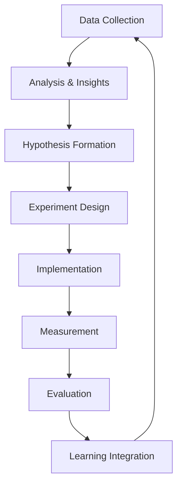

# Continuous Improvement Guide
**Version 1.0** | **Created**: June 25, 2025 | **Status**: Implementation Ready

---

## 📋 **Overview**

This guide establishes a systematic approach to continuous improvement in the Agile-AI integrated development environment. It provides frameworks, tools, and processes for iterative enhancement of both technical capabilities and collaborative workflows.

### **Purpose**
- Create systematic feedback loops for process optimization
- Enable data-driven improvements in AI-human collaboration
- Establish learning mechanisms for both AI agents and human team members
- Foster a culture of continuous learning and adaptation
- Optimize development velocity while maintaining quality standards

### **Scope**
- Sprint retrospectives and improvement cycles
- AI capability enhancement and learning
- Process optimization and workflow refinement
- Tool integration and automation improvements
- Team skill development and knowledge sharing

---

## 🔄 **Continuous Improvement Framework**

### **Improvement Cycle Structure**



#### **1. Data Collection (Ongoing)**
- **Automated Metrics**: Command execution times, success rates, quality gate pass rates
- **Manual Feedback**: Sprint retrospectives, team surveys, stakeholder input
- **Performance Data**: Velocity trends, defect rates, delivery predictability
- **AI Analytics**: Confidence levels, escalation rates, learning patterns

#### **2. Analysis & Insights (Weekly)**
- **Trend Analysis**: Identify patterns in metrics and feedback
- **Root Cause Analysis**: Deep dive into recurring issues
- **Opportunity Identification**: Spot areas for significant improvement
- **Impact Assessment**: Prioritize improvements by potential value

#### **3. Hypothesis Formation (Sprint Planning)**
- **Problem Definition**: Clear articulation of improvement opportunity
- **Solution Hypothesis**: Testable assumptions about interventions
- **Success Criteria**: Measurable outcomes for evaluation
- **Risk Assessment**: Potential negative impacts and mitigation strategies

#### **4. Experiment Design (Sprint Planning)**
- **Scope Definition**: Specific area and duration for testing
- **Control Groups**: Baseline comparison for measuring impact
- **Measurement Plan**: Metrics and collection methods
- **Rollback Strategy**: Plan for reverting unsuccessful changes

---

## 📊 **Metrics and Measurement Systems**

### **AI-Specific Metrics**

#### **AI Capability Metrics**
```bash
# AI performance tracking via meditation integration
meditate_integration.md --focus=learning --depth=deep
```

| Metric | Target | Measurement Method | Frequency |
|--------|--------|-------------------|-----------|
| Autonomous Task Completion | >85% | GitHub issue tracking | Daily |
| Quality First-Pass Rate | >90% | Quality gate results | Per PR |
| Estimation Accuracy | ±15% | Actual vs estimated time | Sprint end |
| Learning Rate | +5% per sprint | Capability assessment | Sprint retro |
| Context Efficiency | <75% usage | Memory management | Per session |

#### **Human-AI Collaboration Metrics**
| Metric | Target | Measurement Method | Frequency |
|--------|--------|-------------------|-----------|
| Handoff Efficiency | <2 hours | Time between AI completion and human review | Per handoff |
| Review Pass Rate | >95% | Human review outcomes | Weekly |
| Escalation Rate | <15% | AI confidence thresholds | Daily |
| Communication Clarity | >8/10 | Team satisfaction surveys | Monthly |
| Process Friction | <3 touch points | Workflow analysis | Sprint retro |

### **Development Velocity Metrics**

#### **Sprint Performance**
- **Velocity Consistency**: Standard deviation <20% across sprints
- **Commitment Accuracy**: 95% of committed stories completed
- **Scope Creep**: <10% unplanned work per sprint
- **Quality Debt**: <5% stories requiring rework
- **Cycle Time**: Average time from story start to production

#### **Technical Excellence**
- **Test Coverage**: Maintain >80% coverage
- **Code Quality**: Zero critical quality gate failures
- **Performance**: No regression in key metrics
- **Security**: Zero high/critical vulnerabilities
- **Documentation**: 100% of features documented

### **Learning and Adaptation Metrics**

#### **Knowledge Management**
```bash
# Learning insights via dream command
dream.md --focus=innovation --depth=creative
```
- **Knowledge Retention**: AI memory effectiveness over time
- **Pattern Recognition**: Improvement in error prediction
- **Innovation Rate**: Novel solutions generated per sprint
- **Knowledge Transfer**: Cross-team learning effectiveness
- **Skill Development**: Team capability growth rate

---

## 🔬 **Retrospective Framework**

### **Sprint Retrospective Structure**

#### **AI-Enhanced Retrospective Process**
```bash
# Pre-retrospective analysis
code-analysis.md --scope=sprint --focus=improvement-opportunities
meditate_integration.md --focus=patterns --depth=deep
```

#### **1. Data Preparation (Pre-Meeting)**
- **Automated Analysis**: AI generates insights from sprint data
- **Metric Dashboard**: Key performance indicators visualized
- **Incident Review**: Analysis of any issues or escalations
- **Achievement Summary**: Completed work and quality metrics

#### **2. What Went Well (15 minutes)**
- **Successes Identification**: Both technical and process wins
- **AI Contributions**: Effective autonomous work and innovations
- **Collaboration Wins**: Successful human-AI handoffs
- **Quality Achievements**: Zero-defect deliveries, performance gains

#### **3. What Could Be Improved (20 minutes)**
- **Process Friction**: Workflow bottlenecks and delays
- **AI Limitations**: Areas requiring human intervention
- **Communication Gaps**: Handoff inefficiencies
- **Technical Debt**: Accumulation and management issues

#### **4. Action Items (15 minutes)**
- **Process Improvements**: Workflow optimizations
- **AI Training**: Capability enhancement opportunities
- **Tool Enhancements**: Automation and integration improvements
- **Team Development**: Skill building and knowledge sharing

#### **5. Experiment Planning (10 minutes)**
- **Hypothesis Definition**: Testable improvement assumptions
- **Pilot Design**: Small-scale experiment planning
- **Success Metrics**: Measurable outcomes definition
- **Timeline**: Implementation and evaluation schedule

### **Retrospective Action Tracking**

#### **GitHub Integration**
```bash
# Action item creation
gh issue create --title "Retrospective Action: [DESCRIPTION]" \
  --body "Sprint: $SPRINT_NUMBER\nType: Process Improvement\nSuccess Criteria: $CRITERIA" \
  --label "retrospective-action,improvement" \
  --milestone "Process Improvement"
```

#### **Action Item Categories**
- **Process Optimization**: Workflow and ceremony improvements
- **Tool Integration**: Automation and integration enhancements
- **AI Enhancement**: Capability and performance improvements
- **Team Development**: Training and skill building initiatives
- **Quality Improvement**: Standards and practices refinement

---

## 🚀 **Innovation and Experimentation**

### **Innovation Sprint Framework**

#### **Innovation Sprint Structure (1 week)**
```bash
# Innovation sprint planning
dream.md --focus=innovation --depth=experimental
task-breakdown.md "Innovation: [EXPLORATION_AREA]"
```

1. **Discovery Phase (Days 1-2)**
   - Problem exploration and opportunity identification
   - Research and external knowledge gathering
   - Brainstorming and ideation sessions
   - Feasibility assessment and scoping

2. **Prototyping Phase (Days 3-4)**
   - Rapid prototype development
   - Proof of concept implementation
   - Initial testing and validation
   - Iteration based on early feedback

3. **Evaluation Phase (Day 5)**
   - Results analysis and documentation
   - Business case development
   - Implementation planning
   - Decision on continuation or pivot

#### **Innovation Areas**
- **AI Capability Enhancement**: New AI applications and optimizations
- **Workflow Automation**: Process automation opportunities
- **Tool Integration**: New tool integrations and improvements
- **User Experience**: Novel interaction patterns and improvements
- **Technical Architecture**: Architectural improvements and modernization

### **Experimentation Guidelines**

#### **Experiment Types**
1. **A/B Testing**: Comparing two approaches systematically
2. **Time-Boxed Trials**: Limited-duration experiments with clear end dates
3. **Pilot Programs**: Small-scale implementations before full rollout
4. **Spike Solutions**: Technical research and exploration activities
5. **Process Trials**: Temporary workflow or procedure changes

#### **Experiment Criteria**
- **Clear Hypothesis**: Testable assumption about improvement
- **Measurable Outcomes**: Quantifiable success criteria
- **Limited Scope**: Contained impact to reduce risk
- **Reversible Changes**: Ability to rollback if unsuccessful
- **Learning Focus**: Knowledge generation as primary goal

---

## 🧠 **AI Learning and Adaptation**

### **AI Capability Enhancement**

#### **Continuous Learning Mechanisms**
```bash
# AI learning optimization
meditate_integration.md --depth=full --focus=learning
consolidate-light.md --preserve=insights
```

1. **Pattern Recognition Improvement**
   - Error pattern analysis and prevention
   - Success pattern identification and replication
   - Context optimization for better decision-making
   - Predictive capability enhancement

2. **Domain Knowledge Expansion**
   - Project-specific knowledge accumulation
   - Technology stack expertise deepening
   - Business domain understanding growth
   - Best practices integration and application

3. **Collaboration Skills Development**
   - Human communication pattern learning
   - Handoff timing optimization
   - Escalation threshold calibration
   - Review feedback integration

#### **AI Training Cycles**

| Phase | Duration | Focus | Activities |
|-------|----------|-------|------------|
| Observation | 1 sprint | Data collection | Monitor all interactions and outcomes |
| Analysis | 3 days | Pattern identification | Analyze successful and failed approaches |
| Adaptation | 2 days | Capability adjustment | Update approaches and thresholds |
| Validation | 1 sprint | Performance testing | Test improved capabilities in real scenarios |

### **Memory Management Optimization**

#### **Memory System Enhancement**
```bash
# Memory optimization cycles
sleep.md --depth=full --preserve=insights
wake.md --session-type=continuation --focus=insights
```

1. **Context Preservation Improvement**
   - Better identification of critical context
   - More efficient context compression
   - Improved context restoration accuracy
   - Enhanced cross-session continuity

2. **Learning Integration Enhancement**
   - Better pattern abstraction and storage
   - Improved knowledge retrieval mechanisms
   - Enhanced creative connection generation
   - More effective insight preservation

---

## 📈 **Performance Optimization**

### **Velocity Improvement Strategies**

#### **Throughput Optimization**
1. **Task Parallelization**: Identify opportunities for concurrent work
2. **Bottleneck Elimination**: Remove process constraints and delays
3. **Automation Enhancement**: Increase automated task coverage
4. **Handoff Optimization**: Reduce context switching overhead
5. **Quality Front-loading**: Prevent defects rather than fix them

#### **Lead Time Reduction**
1. **Work Item Sizing**: Optimize story and task granularity
2. **Dependency Management**: Minimize and manage dependencies
3. **Batch Size Optimization**: Balance throughput and responsiveness
4. **Flow Smoothing**: Reduce variability in work completion
5. **Capacity Management**: Optimize resource allocation and utilization

### **Quality Improvement Strategies**

#### **Defect Prevention**
```bash
# Quality improvement analysis
code-analysis.md --scope=defect-patterns --focus=prevention
quality-gate.md --analyze-failures
```

1. **Root Cause Analysis**: Systematic investigation of quality issues
2. **Prevention Mechanisms**: Automated checks and validation
3. **Early Detection**: Shift-left testing and validation
4. **Feedback Loops**: Rapid feedback on quality issues
5. **Continuous Monitoring**: Ongoing quality assessment

#### **Technical Debt Management**
1. **Debt Identification**: Automated technical debt detection
2. **Impact Assessment**: Business impact of technical debt
3. **Repayment Planning**: Strategic technical debt reduction
4. **Prevention Strategies**: Avoid accumulating new debt
5. **Monitoring Systems**: Track debt accumulation and reduction

---

## 🔧 **Tool and Process Evolution**

### **Tool Integration Improvement**

#### **Automation Enhancement Pipeline**
```bash
# Automation opportunity analysis
run-ci.md --analyze-automation-opportunities
optimize.md --focus=process-automation
```

1. **Manual Task Identification**: Catalog repetitive manual work
2. **Automation Feasibility**: Assess automation potential and ROI
3. **Tool Selection**: Choose appropriate automation tools
4. **Implementation Planning**: Phased automation rollout
5. **Effectiveness Measurement**: Monitor automation impact

#### **Integration Optimization**
1. **Workflow Streamlining**: Remove unnecessary steps and handoffs
2. **Tool Consolidation**: Reduce tool sprawl and context switching
3. **API Enhancement**: Improve tool interconnections
4. **Data Flow Optimization**: Enhance information flow between tools
5. **User Experience**: Improve tool usability and adoption

### **Process Refinement**

#### **Agile Practice Evolution**
1. **Ceremony Optimization**: Improve meeting effectiveness and efficiency
2. **Artifact Enhancement**: Better documentation and communication
3. **Role Clarification**: Clear AI and human responsibilities
4. **Feedback Mechanisms**: Enhanced information flow and learning
5. **Adaptation Strategies**: Flexible response to changing needs

#### **Compliance and Governance**
1. **Standard Updates**: Evolve standards based on learnings
2. **Compliance Automation**: Automate compliance checking
3. **Governance Streamlining**: Reduce governance overhead
4. **Risk Management**: Improve risk identification and mitigation
5. **Audit Efficiency**: Streamline audit and review processes

---

## 📚 **Knowledge Management and Sharing**

### **Organizational Learning**

#### **Knowledge Capture Systems**
```bash
# Knowledge capture automation
create-docs.md --focus=lessons-learned
dream.md --focus=pattern-recognition
```

1. **Lesson Documentation**: Systematic capture of learnings
2. **Best Practice Codification**: Convert successes into reusable patterns
3. **Failure Analysis**: Learn from mistakes and prevent recurrence
4. **Innovation Recording**: Document novel solutions and approaches
5. **Knowledge Organization**: Structure knowledge for easy retrieval

#### **Knowledge Sharing Mechanisms**
1. **Internal Documentation**: Comprehensive internal knowledge base
2. **Training Programs**: Structured learning for team members
3. **Communities of Practice**: Cross-team knowledge sharing
4. **Mentoring Systems**: Formal knowledge transfer programs
5. **External Sharing**: Contribute to broader community knowledge

### **Team Development**

#### **Skill Enhancement Programs**
1. **Capability Assessment**: Regular evaluation of team skills
2. **Learning Plans**: Individual and team development planning
3. **Training Resources**: Access to relevant learning materials
4. **Practice Opportunities**: Hands-on learning through real work
5. **Feedback Systems**: Regular feedback on skill development

#### **Cross-Functional Collaboration**
1. **Role Rotation**: Exposure to different aspects of development
2. **Pairing Programs**: Knowledge transfer through collaboration
3. **Cross-Team Projects**: Broader organizational exposure
4. **Skill Sharing**: Team members teaching each other
5. **Innovation Time**: Dedicated time for exploration and learning

---

*This Continuous Improvement Guide ensures systematic enhancement of both technical capabilities and collaborative processes, fostering a culture of learning and adaptation that maximizes the benefits of AI-human collaboration.*