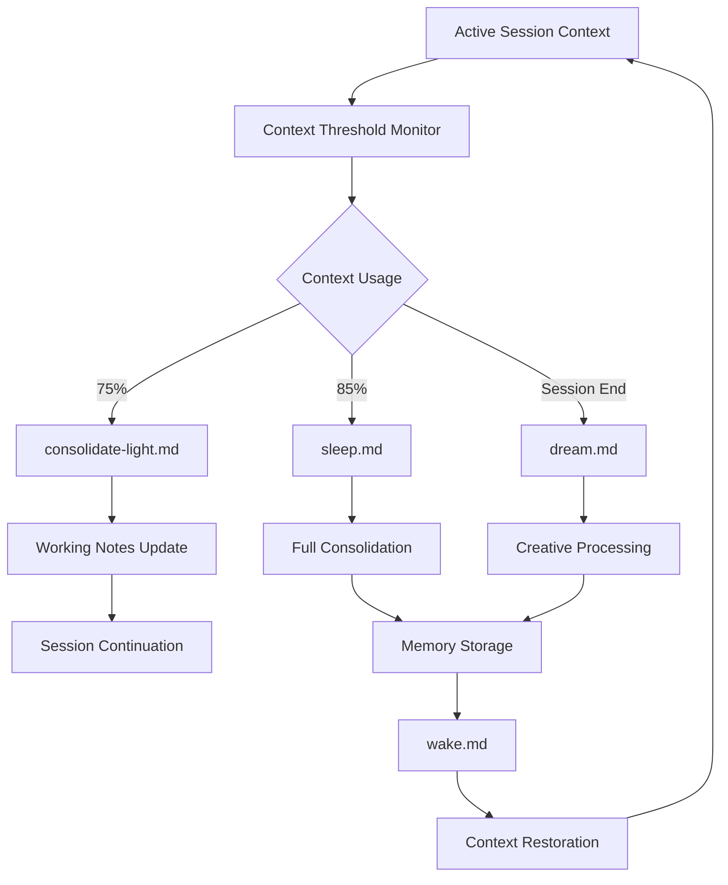

# Memory Management System
**Version 1.0** | **Created**: June 25, 2025 | **Status**: Implementation Ready

---

## 📋 **Overview**

This document provides comprehensive guidance for the AI memory management system that enables efficient context preservation, learning retention, and session optimization in the Agile-AI development environment.

### **Purpose**
- Optimize AI context usage for extended productive sessions
- Preserve critical project knowledge across session boundaries
- Enable continuous learning and pattern recognition
- Support seamless project context restoration
- Facilitate efficient human-AI collaboration through maintained context

### **Scope**
- Sleep-Wake-Dream memory cycles
- Context optimization and consolidation strategies
- Knowledge preservation and retrieval systems
- Learning integration and pattern recognition
- Session continuity and state management

---

## 🧠 **Memory Architecture**

### **Memory System Components**



#### **Memory File Structure**
```
.claude/memory/
├── session_summary.md          # Current session overview
├── project_state.json          # Structured project data
├── working_notes.md            # Active development notes
├── reflection_notes.md         # Learning insights and patterns
├── task_context.json          # Current task state and priorities
├── dream_insights.md          # Creative processing results
├── innovation_log.json        # Novel solutions and approaches
├── exploration_notes.md       # Alternative approaches and experiments
├── creative_connections.json  # Cross-domain insights
└── meditations/               # Meditation session records
    ├── session_[timestamp].md
    └── insights_[timestamp].json
```

### **Context Lifecycle Management**

#### **Context Usage Monitoring**
- **0-50%**: Normal operation, no intervention needed
- **50-75%**: Monitor for optimization opportunities
- **75-85%**: Light consolidation triggers (`consolidate-light.md`)
- **85-95%**: Full consolidation required (`sleep.md`)
- **95%+**: Emergency consolidation and session reset

#### **Automated Context Management**
```bash
# Context monitoring automation in CLAUDE.md
if [[ $(context_usage) -ge 75 ]]; then
    consolidate-light.md --preserve=all --update=working-notes
elif [[ $(context_usage) -ge 85 ]]; then
    sleep.md --depth=full --preserve=insights
fi
```

---

## 🌙 **Sleep Command System**

### **Sleep Command Architecture**

#### **Purpose and Triggers**
```bash
sleep.md [--depth=light|full] [--preserve=context|insights|both]
```

**Automatic Triggers:**
- Context usage ≥85%
- Session duration >4 hours
- Major task completion
- End of work day/session

**Manual Triggers:**
- Natural breakpoints in work
- Before switching to complex tasks
- When feeling context overload
- Before important decisions

#### **Sleep Process Workflow**

1. **Context Assessment (5 minutes)**
   - Analyze current session content and priorities
   - Identify critical knowledge that must be preserved
   - Evaluate learning patterns and insights
   - Assess current task state and dependencies

2. **Memory Consolidation (10-15 minutes)**
   - **Session Summary**: Comprehensive narrative of activities
   - **Project State**: Structured data about current status
   - **Task Context**: Active work and next priorities
   - **Reflection Notes**: Key learnings and patterns
   - **Decision Log**: Important decisions and rationale

3. **Knowledge Extraction (5-10 minutes)**
   - **Pattern Recognition**: Identify recurring themes
   - **Best Practices**: Extract reusable approaches
   - **Lessons Learned**: Document insights and improvements
   - **Innovation Opportunities**: Note creative possibilities

4. **Context Optimization (5 minutes)**
   - **Memory Compression**: Optimize stored information
   - **Priority Ranking**: Order information by importance
   - **Cross-Reference**: Link related concepts and decisions
   - **Cleanup**: Remove redundant or outdated information

#### **Sleep Output Artifacts**

##### **Session Summary Template**
```markdown
# Session Summary - [DATE]

## 🎯 **Session Objectives**
- Primary goals and intended outcomes
- Success criteria and completion status

## 🔧 **Work Completed**
- Features implemented or tasks completed
- Code changes and their impact
- Issues resolved and bugs fixed
- Documentation created or updated

## 💡 **Key Decisions**
- Technical decisions and rationale
- Process improvements implemented
- Problem-solving approaches chosen

## 🔍 **Insights and Learnings**
- Patterns observed during development
- Successful approaches worth repeating
- Challenges encountered and solutions
- Improvements for future sessions

## 📋 **Current State**
- Active tasks and their status
- Next priorities and dependencies
- Blockers or issues requiring attention
- Context for next session startup

## 🚀 **Next Session Planning**
- Immediate next steps
- Priority tasks to tackle
- Required context for continuation
- Estimated effort and timeline
```

##### **Project State Schema**
```json
{
  "session_id": "unique-session-identifier",
  "timestamp": "2025-06-25T10:30:00Z",
  "project_status": {
    "current_phase": "Phase 1 Critical Fixes",
    "active_branch": "feature/phase1-critical-fixes",
    "last_commit": "commit-hash",
    "build_status": "passing",
    "test_coverage": "85%"
  },
  "active_tasks": [
    {
      "id": "task-id",
      "title": "Task description",
      "status": "in_progress",
      "priority": "high",
      "estimated_effort": "4 hours",
      "completion_percentage": 75
    }
  ],
  "context_priorities": [
    "Priority context item 1",
    "Priority context item 2"
  ],
  "knowledge_state": {
    "key_learnings": ["Learning 1", "Learning 2"],
    "patterns_identified": ["Pattern 1", "Pattern 2"],
    "decisions_made": ["Decision 1", "Decision 2"]
  }
}
```

### **Sleep Optimization Strategies**

#### **Contextual Sleep Depth**
- **Light Sleep (75-80% context)**: Quick working notes update, preserve active context
- **Medium Sleep (80-85% context)**: Consolidate session learnings, optimize active tasks
- **Deep Sleep (85%+ context)**: Full consolidation, comprehensive knowledge extraction

#### **Preservation Strategies**
- **Context-Heavy**: Preserve detailed conversation and decision context
- **Insight-Heavy**: Focus on learnings, patterns, and creative insights
- **Balanced**: Equal emphasis on context preservation and insight extraction

---

## 🌅 **Wake Command System**

### **Wake Command Architecture**

#### **Purpose and Triggers**
```bash
wake.md [--session-type=continuation|fresh] [--focus=tasks|insights|both]
```

**Automatic Triggers:**
- New session startup
- After sleep command execution
- Context switching between projects
- Daily session initialization

**Manual Triggers:**
- Need to restore specific context
- Switching focus areas
- After extended breaks
- Before important work sessions

#### **Wake Process Workflow**

1. **Memory Recovery (5 minutes)**
   - Load previous session state and context
   - Restore project status and active tasks
   - Integrate stored insights and learnings
   - Rebuild priority understanding

2. **Context Integration (10 minutes)**
   - **Current State Assessment**: Evaluate what has changed
   - **Priority Reconciliation**: Update priorities based on latest information
   - **Gap Analysis**: Identify missing context or information
   - **Continuity Planning**: Establish clear continuation strategy

3. **Environment Preparation (5 minutes)**
   - **Tool Readiness**: Ensure development environment is functional
   - **Resource Access**: Verify access to required systems and files
   - **Context Loading**: Import relevant files and information
   - **Workflow Setup**: Prepare for efficient work continuation

4. **Action Planning (5 minutes)**
   - **Immediate Next Steps**: Define first actions to take
   - **Session Goals**: Establish objectives for current session
   - **Success Criteria**: Define completion criteria
   - **Time Management**: Plan session duration and breaks

#### **Wake Output Artifacts**

##### **Context Restoration Report**
```markdown
# Context Restoration - [DATE]

## 📁 **Previous Session State**
- Last session date and duration
- Work completed and current status
- Active tasks and priorities
- Key decisions and context

## 🔄 **State Changes**
- Changes since last session
- New priorities or requirements
- Updated project status
- Environmental changes

## 🎯 **Current Session Plan**
- Primary objectives for this session
- Priority tasks and order
- Expected outcomes and deliverables
- Session duration and break planning

## 🔗 **Continuity Links**
- Relevant files and resources
- Previous decision context
- Active conversation threads
- Important insights to remember

## ⚠️ **Attention Items**
- Urgent issues requiring immediate attention
- Blockers or dependencies to resolve
- Questions needing clarification
- Risks or concerns to monitor
```

### **Wake Optimization Strategies**

#### **Session Type Optimization**
- **Continuation Sessions**: Focus on active task resumption
- **Fresh Sessions**: Broader context restoration and planning
- **Switching Sessions**: Context bridging between different work areas

#### **Focus Area Strategies**
- **Task-Focused**: Emphasize active work and immediate priorities
- **Insight-Focused**: Prioritize learnings and knowledge integration
- **Balanced**: Equal attention to tasks and insights

---

## 🌈 **Dream Command System**

### **Dream Command Architecture**

#### **Purpose and Creative Processing**
```bash
dream.md [--focus=innovation|architecture|debugging] [--depth=creative|experimental]
```

**Automatic Triggers:**
- End of major work sessions
- After significant breakthroughs
- During innovation sprints
- Before complex problem-solving

**Manual Triggers:**
- Need for creative problem-solving
- Stuck on complex challenges
- Innovation exploration sessions
- Cross-domain insight generation

#### **Dream Process Workflow**

1. **Creative Synthesis (15-20 minutes)**
   - **Novel Connection Generation**: Combine disparate project elements
   - **Cross-Domain Application**: Apply external knowledge to current challenges
   - **Metaphorical Thinking**: Explore alternative perspectives and frameworks
   - **Boundary Exploration**: Investigate edge cases and unconventional approaches

2. **Alternative Solution Exploration (10-15 minutes)**
   - **What-If Scenarios**: Simulate alternative architectural approaches
   - **Unconventional Methods**: Explore creative implementation strategies
   - **Creative Debugging**: Generate innovative problem-solving approaches
   - **Stress Testing**: Design scenarios to test solution robustness

3. **Pattern Recognition and Abstraction (10 minutes)**
   - **Reusable Patterns**: Identify generalizable design patterns
   - **Anti-Pattern Recognition**: Spot and document problematic approaches
   - **Improvement Opportunities**: Recognize optimization possibilities
   - **Principle Extraction**: Connect work to broader software engineering principles

4. **Innovation Documentation (5-10 minutes)**
   - **Insight Capture**: Document creative discoveries and connections
   - **Solution Alternatives**: Record innovative approaches for future use
   - **Exploration Notes**: Log alternative approaches and experiments
   - **Creative Connections**: Map cross-domain insights and applications

#### **Dream Output Artifacts**

##### **Innovation Log Entry**
```json
{
  "dream_session_id": "dream-[timestamp]",
  "focus_area": "architecture|innovation|debugging",
  "creative_insights": [
    {
      "insight_type": "novel_connection",
      "description": "Insight description",
      "application_area": "Where this could be applied",
      "potential_impact": "Expected benefits"
    }
  ],
  "alternative_solutions": [
    {
      "problem": "Problem being addressed",
      "conventional_approach": "Standard solution",
      "alternative_approach": "Creative alternative",
      "trade_offs": "Pros and cons analysis"
    }
  ],
  "pattern_discoveries": [
    {
      "pattern_name": "Identified pattern",
      "context": "Where it applies",
      "implementation": "How to use it",
      "benefits": "Why it's valuable"
    }
  ],
  "cross_domain_connections": [
    {
      "source_domain": "External knowledge area",
      "target_application": "Project application",
      "connection_type": "metaphor|analogy|principle",
      "implementation_ideas": "Practical applications"
    }
  ]
}
```

### **Dream Enhancement Strategies**

#### **Focus Area Specialization**
- **Innovation Dreams**: Breakthrough solutions and novel approaches
- **Architecture Dreams**: Structural improvements and design alternatives
- **Debugging Dreams**: Creative problem-solving and root cause analysis

#### **Creative Depth Levels**
- **Creative**: Standard creative processing with novel connections
- **Experimental**: Deep exploration with high-risk, high-reward ideas

---

## 🧘 **Meditation Integration System**

### **Meditation Command Integration**

#### **Purpose and Cognitive Optimization**
```bash
meditate_integration.md [--depth=light|deep|full] [--focus=patterns|alignment|learning]
```

**Automatic Triggers:**
- Context usage reaches 85%
- After major task completion
- Before sleep cycles
- After error recovery

**Manual Triggers:**
- Need for cognitive reset
- Pattern recognition sessions
- Learning integration
- Alignment verification

#### **Meditation Process Benefits**

1. **Context Efficiency (20-30% improvement)**
   - Better organization of active context
   - Reduced redundancy in working memory
   - Improved focus on relevant information
   - Enhanced decision-making clarity

2. **Pattern Recognition Enhancement**
   - Better identification of recurring patterns
   - Improved error pattern detection
   - Enhanced success pattern recognition
   - Stronger connection recognition between concepts

3. **Task Alignment Optimization**
   - Clearer priority understanding
   - Better goal alignment assessment
   - Improved resource allocation decisions
   - Enhanced strategic thinking

4. **Learning Integration**
   - Better consolidation of new knowledge
   - Improved connection to existing knowledge
   - Enhanced creative insight generation
   - Stronger pattern abstraction capabilities

### **Meditation Integration Patterns**

#### **Daily Meditation Cycles**
- **Morning Meditation**: Session startup and alignment verification
- **Midday Meditation**: Progress check and pattern recognition
- **Evening Meditation**: Learning integration and reflection

#### **Project Phase Meditations**
- **Phase Start**: Vision alignment and approach clarification
- **Phase Progress**: Pattern recognition and course correction
- **Phase Completion**: Learning extraction and knowledge integration

---

## 📊 **Memory Performance Optimization**

### **Memory Efficiency Metrics**

#### **Context Usage Optimization**
- **Target Context Usage**: 60-75% for optimal performance
- **Consolidation Frequency**: 2-3 times per 8-hour session
- **Restoration Accuracy**: >95% critical context preserved
- **Integration Speed**: <5 minutes for full context restoration

#### **Knowledge Retention Metrics**
- **Learning Persistence**: Key insights retained across sessions
- **Pattern Recognition**: Improvement in pattern identification over time
- **Creative Output**: Novel solutions generated per session
- **Decision Quality**: Improved decision-making based on accumulated knowledge

### **Performance Tuning Strategies**

#### **Context Compression Techniques**
1. **Hierarchical Summarization**: Multi-level summary structures
2. **Semantic Clustering**: Group related concepts and decisions
3. **Priority Weighting**: Emphasize critical information
4. **Redundancy Elimination**: Remove duplicate or outdated information
5. **Reference Linking**: Use pointers to external detailed information

#### **Memory Access Optimization**
1. **Index Creation**: Build searchable indexes of stored knowledge
2. **Tagging Systems**: Categorize information for easy retrieval
3. **Cross-References**: Link related concepts and decisions
4. **Version Control**: Track knowledge evolution over time
5. **Query Optimization**: Improve search and retrieval mechanisms

---

## 🔧 **Memory System Maintenance**

### **Regular Maintenance Tasks**

#### **Weekly Maintenance**
- **Memory Cleanup**: Remove outdated or irrelevant information
- **Index Rebuilding**: Update search indexes and cross-references
- **Performance Assessment**: Evaluate memory system effectiveness
- **Knowledge Validation**: Verify accuracy of stored information

#### **Monthly Optimization**
- **Pattern Analysis**: Identify memory usage patterns and optimize
- **Storage Optimization**: Compress and reorganize memory files
- **Retention Review**: Assess knowledge retention and decay
- **System Tuning**: Adjust parameters based on performance data

### **Troubleshooting and Recovery**

#### **Common Issues and Solutions**
1. **Context Loss**: Recovery procedures from backup memory
2. **Corruption**: Integrity checking and repair mechanisms
3. **Performance Degradation**: Optimization and cleanup procedures
4. **Integration Failures**: Fallback and manual recovery options

#### **Backup and Recovery Strategies**
- **Incremental Backups**: Regular automated memory backups
- **Version History**: Maintain multiple versions of critical memory
- **Recovery Testing**: Regular testing of recovery procedures
- **Redundancy**: Multiple storage locations for critical information

---

*This Memory Management System ensures optimal AI performance through efficient context management, knowledge preservation, and continuous learning integration, enabling sustained productive collaboration with human team members.*