# Phase 2: MVP Bridge Implementation Plan
## Connect Infrastructure to Core AI Functionality

*Planning Date: December 27, 2024*

---

## Executive Summary

**Objective**: Bridge existing sophisticated infrastructure to deliver core coding assistant functionality using 80/20 Pareto principle.

**Strategy**: Connect existing components rather than rebuild. Test-first approach to validate each connection point.

**Timeline**: 1-2 weeks (8-10 sessions)  
**Success Criteria**: iOS app can trigger real AI-powered code suggestions on Mac

---

## 80/20 Analysis

### 20% Effort → 80% Value
1. **Fix circular imports** → Enable all testing infrastructure
2. **Connect AST → L3 Agent** → Leverage existing sophisticated analysis  
3. **Mock MLX responses** → Prove end-to-end workflow before complexity
4. **Basic iOS commands** → Unlock core user value

### 80% Effort → 20% Additional Value  
1. Real MLX inference (after workflow proven)
2. Advanced AI features
3. Performance optimization
4. Enterprise polish

---

## Phase 2 Task Breakdown

### **PHASE 2.0: Enable Testing Infrastructure** ⚡ HIGH IMPACT
**Duration**: 2-3 hours  
**Priority**: CRITICAL (blocks all validation)

#### Problem
Circular imports between `leenvibe_cli.config` and `leenvibe_cli.config/*` prevent test execution

#### Solution Strategy
```python
# Move CLIConfig to resolve circular dependency
leenvibe_cli/
├── config.py              # Legacy CLIConfig (keep as-is)
├── config/
│   ├── __init__.py        # Remove circular import
│   ├── legacy.py          # Import CLIConfig from ../config.py
│   └── ...               # New schema system
```

#### Implementation Steps
1. **Create `config/legacy.py`** - Import CLIConfig from parent
2. **Update all imports** - Change `from .config import CLIConfig` to `from .config.legacy import CLIConfig`
3. **Test validation** - Run comprehensive test suite
4. **Quality gate** - All Sprint 2.3 tests passing

#### Acceptance Criteria
- [ ] `uv run python run_tests.py` executes without import errors
- [ ] Sprint 2.3 quality gates pass (notification system validated)
- [ ] All existing imports work correctly
- [ ] No functionality regression

---

### **PHASE 2.1: Test L3 Agent Framework** 🧪 TEST FIRST
**Duration**: 1-2 hours  
**Priority**: HIGH (validate existing capabilities)

#### Objective
Understand what L3 agent framework can already do before connecting new components

#### Implementation
```python
# File: tests/test_l3_agent_capabilities.py

class TestL3AgentFramework:
    async def test_agent_initialization(self):
        """Test L3 agent can be created and configured"""
        
    async def test_agent_context_management(self):
        """Test agent maintains conversation context"""
        
    async def test_agent_tool_integration(self):
        """Test agent can use existing tools"""
        
    async def test_agent_mock_responses(self):
        """Test agent generates structured responses"""
```

#### Test Strategy
1. **Standalone agent testing** - Test L3 framework isolation
2. **Tool integration testing** - Validate existing AST tools work
3. **Context management testing** - Session persistence validation  
4. **Mock response testing** - Structured output validation

#### Success Metrics
- [ ] L3 agent framework functional and testable
- [ ] Existing AST tools accessible from agent
- [ ] Context management working
- [ ] Clear interface for adding AI responses

---

### **PHASE 2.2: Connect AST Analysis to L3 Agent** 🔗 CORE VALUE
**Duration**: 4-6 hours  
**Priority**: HIGH (leverages sophisticated infrastructure)

#### Objective
Feed existing AST analysis and symbol extraction into L3 agent context for intelligent code suggestions

#### Current Assets
- ✅ Tree-sitter AST parsing (Python, JS/TS, Swift)
- ✅ Symbol extraction with cross-references
- ✅ Complexity analysis and metrics
- ✅ Dependency relationship mapping

#### Implementation Strategy
```python
# File: leenvibe-backend/app/agent/ast_context_provider.py

class ASTContextProvider:
    """Provides rich AST context to L3 agent"""
    
    async def get_file_context(self, file_path: str) -> Dict[str, Any]:
        """Get comprehensive context for a file"""
        return {
            "symbols": await self.ast_service.get_symbols(file_path),
            "dependencies": await self.ast_service.get_dependencies(file_path),
            "complexity": await self.ast_service.get_complexity(file_path),
            "relationships": await self.graph_service.get_relationships(file_path)
        }
    
    async def get_symbol_context(self, symbol_id: str) -> Dict[str, Any]:
        """Get context for specific symbol"""
        return {
            "definition": await self.ast_service.get_symbol(symbol_id),
            "usages": await self.ast_service.get_symbol_references(symbol_id),
            "related_symbols": await self.graph_service.get_related_symbols(symbol_id)
        }
```

#### Test Strategy
```python
# File: tests/test_ast_agent_integration.py

class TestASTAgentIntegration:
    async def test_file_context_provision(self):
        """Test AST context provided to agent"""
        
    async def test_symbol_context_provision(self):
        """Test symbol-specific context"""
        
    async def test_dependency_context_provision(self):
        """Test dependency relationship context"""
        
    async def test_agent_context_understanding(self):
        """Test agent can use AST context in responses"""
```

#### Acceptance Criteria
- [ ] L3 agent receives rich AST context for any file
- [ ] Agent can access symbol definitions and relationships
- [ ] Agent understands code complexity and dependencies
- [ ] Context provision tested and validated

---

### **PHASE 2.3: Mock MLX Integration** 🎭 RAPID VALIDATION
**Duration**: 2-3 hours  
**Priority**: HIGH (prove workflow before complexity)

#### Objective  
Create sophisticated mock responses that simulate real MLX output to validate entire workflow

#### Implementation Strategy
```python
# File: leenvibe-backend/app/services/mock_mlx_service.py

class MockMLXService:
    """Sophisticated mock MLX service for workflow validation"""
    
    async def generate_code_completion(self, context: Dict[str, Any]) -> Dict[str, Any]:
        """Generate realistic code completion based on AST context"""
        
        # Extract context information
        file_type = context.get('file_type', 'python')
        current_symbol = context.get('current_symbol')
        dependencies = context.get('dependencies', [])
        
        # Generate contextually appropriate mock response
        if file_type == 'python':
            return self._generate_python_suggestions(context)
        elif file_type == 'javascript':
            return self._generate_js_suggestions(context)
        
    def _generate_python_suggestions(self, context: Dict[str, Any]) -> Dict[str, Any]:
        """Generate Python-specific mock suggestions"""
        return {
            "suggestions": [
                {
                    "type": "function_completion",
                    "code": "def process_data(data: List[str]) -> Dict[str, int]:\n    return {item: len(item) for item in data}",
                    "confidence": 0.92,
                    "explanation": "Based on the function signature and dependencies, this implementation processes string data into length mapping"
                }
            ],
            "confidence": 0.92,
            "processing_time_ms": 150
        }
```

#### Test Strategy
```python
# File: tests/test_mock_mlx_integration.py

class TestMockMLXIntegration:
    async def test_context_aware_suggestions(self):
        """Test mock generates different suggestions based on AST context"""
        
    async def test_multi_language_support(self):
        """Test mock handles Python, JS, Swift appropriately"""
        
    async def test_confidence_scoring(self):
        """Test mock provides realistic confidence scores"""
        
    async def test_response_format(self):
        """Test mock responses match expected MLX format"""
```

#### Success Metrics
- [ ] Mock generates contextually appropriate responses
- [ ] Different languages get appropriate suggestions
- [ ] Confidence scoring realistic and useful
- [ ] Response format matches real MLX expectations

---

### **PHASE 2.4: Code Completion Endpoint** 🔌 USER INTERFACE
**Duration**: 2-3 hours  
**Priority**: HIGH (user-facing value)

#### Objective
Create simple, well-tested endpoint that combines AST context + L3 agent + mock MLX for code suggestions

#### Implementation Strategy
```python
# File: leenvibe-backend/app/api/completion.py

@router.post("/api/completion/suggest")
async def suggest_code_completion(request: CodeCompletionRequest) -> CodeCompletionResponse:
    """Generate code suggestions based on context"""
    
    # 1. Get AST context for file/position
    ast_context = await ast_context_provider.get_file_context(
        request.file_path, request.cursor_position
    )
    
    # 2. Enhance context with L3 agent analysis
    agent_context = await l3_agent.analyze_code_context(
        file_content=request.file_content,
        ast_context=ast_context,
        user_intent=request.intent
    )
    
    # 3. Generate suggestions using mock MLX
    suggestions = await mock_mlx_service.generate_code_completion(
        agent_context
    )
    
    return CodeCompletionResponse(
        suggestions=suggestions,
        context_used=agent_context,
        processing_time_ms=response_time
    )
```

#### Test Strategy
```python
# File: tests/test_completion_endpoint.py

class TestCompletionEndpoint:
    async def test_basic_code_completion(self):
        """Test basic code suggestion workflow"""
        
    async def test_context_integration(self):
        """Test AST context properly integrated"""
        
    async def test_multi_language_completion(self):
        """Test completion works for Python, JS, Swift"""
        
    async def test_error_handling(self):
        """Test graceful handling of invalid requests"""
        
    async def test_response_time(self):
        """Test completion responds within 2s target"""
```

#### Acceptance Criteria
- [ ] `/api/completion/suggest` endpoint functional
- [ ] Integrates AST context + L3 agent + mock MLX
- [ ] Responds within 2-second target
- [ ] Handles multiple programming languages
- [ ] Comprehensive error handling and logging

---

### **PHASE 2.5: iOS Coding Commands** 📱 MOBILE VALUE
**Duration**: 3-4 hours  
**Priority**: HIGH (core MVP differentiation)

#### Objective
Add specific coding assistant commands to iOS WebSocket interface

#### Implementation Strategy
```python
# File: leenvibe-backend/app/websocket/coding_commands.py

class CodingCommandHandler:
    """Handle iOS coding assistant commands"""
    
    async def handle_suggest_code(self, message: Dict[str, Any]) -> Dict[str, Any]:
        """Handle 'suggest code' command from iOS"""
        file_path = message.get('file_path')
        cursor_position = message.get('cursor_position', 0)
        context = message.get('context', '')
        
        # Use completion endpoint
        completion_request = CodeCompletionRequest(
            file_path=file_path,
            cursor_position=cursor_position,
            file_content=context,
            intent="suggest_improvement"
        )
        
        suggestions = await suggest_code_completion(completion_request)
        
        return {
            "type": "code_suggestions",
            "suggestions": suggestions.suggestions,
            "confidence": suggestions.confidence,
            "command_id": message.get('command_id')
        }
    
    async def handle_explain_code(self, message: Dict[str, Any]) -> Dict[str, Any]:
        """Handle 'explain code' command from iOS"""
        # Similar pattern for code explanation
        
    async def handle_refactor_suggestion(self, message: Dict[str, Any]) -> Dict[str, Any]:
        """Handle 'suggest refactoring' command from iOS"""
        # Similar pattern for refactoring suggestions
```

#### iOS Integration
```swift
// File: LeenVibe-SwiftPM/Sources/LeenVibe/Services/CodingAssistantService.swift

class CodingAssistantService {
    func suggestCode(for filePath: String, at position: Int, context: String) async -> CodeSuggestions? {
        let message = [
            "type": "coding_command",
            "command": "suggest_code", 
            "file_path": filePath,
            "cursor_position": position,
            "context": context,
            "command_id": UUID().uuidString
        ]
        
        return await webSocketService.sendMessage(message)
    }
}
```

#### Test Strategy
```python
# File: tests/test_ios_coding_commands.py

class TestiOSCodingCommands:
    async def test_suggest_code_command(self):
        """Test iOS suggest code command end-to-end"""
        
    async def test_explain_code_command(self):
        """Test iOS explain code command"""
        
    async def test_command_response_format(self):
        """Test iOS receives properly formatted responses"""
        
    async def test_concurrent_commands(self):
        """Test multiple iOS clients can send commands"""
```

#### Acceptance Criteria
- [ ] iOS can send "suggest code" command via WebSocket
- [ ] iOS can send "explain code" command
- [ ] iOS can send "refactor suggestion" command  
- [ ] Commands trigger backend completion pipeline
- [ ] Responses properly formatted for iOS consumption

---

### **PHASE 2.6: End-to-End MVP Testing** 🎯 VALIDATION
**Duration**: 2-3 hours  
**Priority**: HIGH (prove MVP works)

#### Objective
Test complete workflow: iOS command → WebSocket → L3 Agent → AST Context → Mock MLX → Response

#### Test Strategy
```python
# File: tests/test_mvp_workflow.py

class TestMVPWorkflow:
    async def test_complete_coding_workflow(self):
        """Test complete iOS → Mac coding suggestion workflow"""
        
        # 1. Setup test environment
        test_file = "test_project/main.py"
        test_content = "def process_data(items):\n    # TODO: implement"
        
        # 2. Send iOS command
        ios_command = {
            "type": "coding_command",
            "command": "suggest_code",
            "file_path": test_file,
            "cursor_position": 45,  # After TODO comment
            "context": test_content
        }
        
        # 3. Process through complete pipeline
        response = await websocket_handler.handle_message(ios_command)
        
        # 4. Validate response
        assert response["type"] == "code_suggestions"
        assert len(response["suggestions"]) > 0
        assert response["confidence"] > 0.7
        assert "processing_time_ms" in response
        
    async def test_multi_language_workflow(self):
        """Test workflow with Python, JavaScript, Swift files"""
        
    async def test_performance_targets(self):
        """Test all responses within 2-second target"""
        
    async def test_error_resilience(self):
        """Test workflow handles errors gracefully"""
```

#### Performance Testing
```python
# File: tests/test_mvp_performance.py

class TestMVPPerformance:
    async def test_response_time_target(self):
        """Test <2s response time for code suggestions"""
        
    async def test_concurrent_users(self):
        """Test multiple iOS clients simultaneously"""
        
    async def test_memory_usage(self):
        """Test memory usage stays reasonable under load"""
```

#### Acceptance Criteria
- [ ] Complete iOS → Mac workflow functional
- [ ] All responses within 2-second target
- [ ] Multi-language support working
- [ ] Error handling graceful and informative
- [ ] Performance targets met under test load

---

### **PHASE 2.7: Real MLX Integration** 🧠 PRODUCTION READY
**Duration**: 4-6 hours  
**Priority**: MEDIUM (after workflow proven)

#### Objective
Replace mock MLX service with real Phi-3-Mini inference

#### Implementation Strategy
```python
# File: leenvibe-backend/app/services/mlx_service.py

class MLXService:
    """Real MLX service using Phi-3-Mini-128K-Instruct"""
    
    def __init__(self):
        self.model = None
        self.tokenizer = None
        self._initialize_model()
    
    async def _initialize_model(self):
        """Load Phi-3-Mini model with MLX optimization"""
        try:
            # Load model from MLX community or HuggingFace
            self.model = await load_phi3_mini_model()
            self.tokenizer = await load_phi3_mini_tokenizer()
        except Exception as e:
            logger.error(f"Failed to load MLX model: {e}")
            # Fall back to mock service
            self._use_fallback = True
    
    async def generate_code_completion(self, context: Dict[str, Any]) -> Dict[str, Any]:
        """Generate real code completion using Phi-3-Mini"""
        
        if self._use_fallback:
            return await MockMLXService().generate_code_completion(context)
        
        # Construct prompt from AST context
        prompt = self._build_prompt_from_context(context)
        
        # Generate with MLX
        start_time = time.time()
        response = await self.model.generate(
            prompt=prompt,
            max_tokens=200,
            temperature=0.2,
            stop_tokens=["</code>", "\n\n"]
        )
        processing_time = (time.time() - start_time) * 1000
        
        # Parse and format response
        return self._format_mlx_response(response, processing_time)
```

#### Test Strategy
```python
# File: tests/test_real_mlx_integration.py

class TestRealMLXIntegration:
    async def test_model_loading(self):
        """Test Phi-3-Mini model loads successfully"""
        
    async def test_real_inference(self):
        """Test real MLX inference generates reasonable code"""
        
    async def test_fallback_behavior(self):
        """Test fallback to mock if model fails"""
        
    async def test_performance_with_real_model(self):
        """Test real MLX meets performance targets"""
```

#### Acceptance Criteria
- [ ] Phi-3-Mini model loads and initializes
- [ ] Real inference generates contextually appropriate code
- [ ] Graceful fallback to mock if model unavailable
- [ ] Performance targets still met with real inference

---

## Implementation Order & Dependencies

```mermaid
graph TD
    A[2.0: Fix Imports] --> B[2.1: Test L3 Agent]
    B --> C[2.2: AST→Agent Context]
    C --> D[2.3: Mock MLX Integration]
    D --> E[2.4: Completion Endpoint]
    E --> F[2.5: iOS Commands]
    F --> G[2.6: End-to-End Testing]
    G --> H[2.7: Real MLX]
    
    style A fill:#ff6b6b
    style G fill:#51cf66
    style H fill:#ffd43b
```



## Risk Mitigation

### High Risk: Import Issues Block Everything
- **Mitigation**: Quick fix in Phase 2.0, all other phases depend on this
- **Contingency**: Minimal viable import fix just to enable testing

### Medium Risk: L3 Agent Framework Gaps
- **Mitigation**: Comprehensive testing in Phase 2.1 before building on it
- **Contingency**: Simplify L3 integration if framework insufficient

### Low Risk: Performance Targets
- **Mitigation**: Mock service proves workflow, optimize in Phase 2.7
- **Contingency**: Accept slightly slower responses for MVP

## Success Metrics

### Phase Completion Gates
- **Phase 2.0**: All tests runnable, Sprint 2.3 quality gates pass
- **Phase 2.3**: Mock MLX generates contextually appropriate responses  
- **Phase 2.6**: Complete iOS → Mac workflow demonstrated
- **Phase 2.7**: Real MLX inference functional

### MVP Success Criteria
- [ ] iOS app can request code suggestions from Mac
- [ ] Suggestions are contextually relevant (using AST analysis)
- [ ] Response time <2 seconds for basic requests
- [ ] Support for Python, JavaScript, Swift files
- [ ] Graceful error handling and fallback behavior

### Performance Targets
- [ ] Code completion endpoint: <2s response time
- [ ] Memory usage: <16GB during operation  
- [ ] Concurrent users: Support 3+ iOS clients
- [ ] AST context provision: <200ms
- [ ] Mock/real MLX inference: <1.5s

This plan focuses on connecting existing sophisticated infrastructure to deliver MVP value using test-first development and the 80/20 principle.