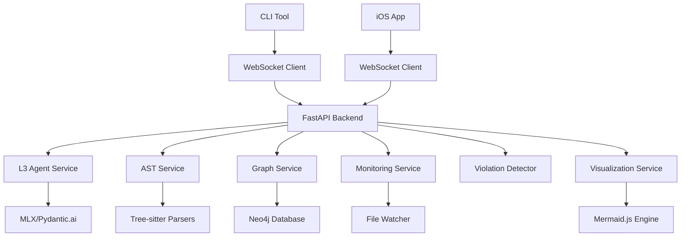

# LeenVibe Sprint-Based Development Plan

## Executive Summary

LeenVibe has evolved into a sophisticated enterprise-grade codebase analysis platform. This document outlines the sprint-based development plan to complete the remaining features and achieve production readiness.

## Current State Analysis

### Foundation Complete ✅ (44 Infrastructure Tasks)
**Sophisticated Architecture Built**:
- **Advanced AST Analysis**: Tree-sitter integration with Python, JS/TS, Swift parsers
- **Graph Database**: Neo4j with comprehensive schema for code relationships  
- **Real-time Monitoring**: File change detection with incremental indexing
- **Smart Caching**: Dependency-aware cache invalidation and warming
- **Symbol Tracking**: Cross-reference resolution and impact analysis
- **Architectural Detection**: Real-time violation detection with confidence scoring
- **Visualization**: Enhanced Mermaid.js with interactive diagram features
- **L3 Agent**: AST-aware tools with context-driven response generation

### Current System Capabilities
✅ **Enterprise-Grade Features**:
- Multi-language AST parsing and symbol extraction
- Graph-based dependency analysis and impact tracking
- Real-time architectural violation detection
- Incremental project indexing with smart cache management
- Advanced visualization with multiple diagram types
- Context-aware AI agent with project understanding

### Architecture Evolution
**From Simple MVP → Enterprise Platform**:
- Original scope: 3 basic features, 4-week timeline
- Current reality: Sophisticated codebase analysis platform
- Gap: Documentation doesn't reflect advanced system built

## Sprint-Based Development Plan

### Core Value Proposition
**"Enterprise-grade codebase analysis platform with real-time monitoring, intelligent suggestions, and multi-client access (CLI + iOS)"**

### Sprint Organization (14 weeks to production)

#### Sprint 1: Real-Time Communication System (2 weeks)
**Goal**: Complete WebSocket infrastructure for real-time updates
- WebSocket event streaming for instant notifications
- Smart filtering system to prevent notification spam
- Client-specific preferences and batch delivery
- Reconnection handling with state synchronization
**Success Criteria**: < 100ms notification latency, graceful reconnection

#### Sprint 2: CLI Tool Development (3 weeks)  
**Goal**: Terminal-native interface (inspired by Claude Code CLI)
- Click/Typer framework with advanced command structure
- WebSocket client for seamless backend communication
- Session management with persistence across restarts
- Core commands: analyze, monitor, visualize, status
- vim/tmux integration with real-time notifications
**Success Criteria**: < 500ms CLI response time, terminal workflow integration

#### Sprint 3: iOS Companion App (2 weeks)
**Goal**: Mobile monitoring and control interface
- SwiftUI architecture visualization views
- Interactive diagram rendering with WebView integration
- Real-time monitoring dashboard with metrics
**Success Criteria**: Full stack integration (CLI + Backend + iOS)

#### Sprint 4: Performance & Scale (2 weeks)
**Goal**: Production-ready performance optimization
- Distributed caching with Redis integration
- Background task processing with Celery
- Connection pooling for Neo4j and file operations
- Rate limiting and circuit breakers
**Success Criteria**: Load testing with realistic large projects

#### Sprint 5: Intelligence Layer (3 weeks)
**Goal**: Advanced AI-powered analysis features
- Semantic code search with vector embeddings
- Code quality scoring with trend analysis
- Automated documentation generation
- Intelligent code review suggestions
- Predictive bug and issue analysis
**Success Criteria**: Advanced AI features demo-ready

#### Sprint 6: Production Readiness (2 weeks)
**Goal**: Security, monitoring, and deployment
- JWT-based authentication and authorization
- Comprehensive API documentation with OpenAPI
- Health monitoring with detailed diagnostics
- Audit logging for all operations
- Environment-specific configuration management
**Success Criteria**: Security audit passed, production deployment ready

## Current Implementation Status

### ✅ Foundation Complete (Advanced Infrastructure)
**Implemented Systems**:
- **AST Analysis**: Tree-sitter parsers for Python, JavaScript/TypeScript, Swift
- **Symbol Extraction**: Comprehensive symbol table with cross-references
- **Graph Database**: Neo4j with relationship mapping and impact analysis
- **Real-time Monitoring**: File change detection with incremental updates
- **Smart Caching**: Dependency-aware invalidation and warming strategies
- **Architectural Analysis**: Real-time violation detection with confidence scoring
- **Visualization**: Mermaid.js with interactive features and multiple diagram types
- **L3 Agent**: Context-aware AI with project understanding

### 🔄 Sprint 1 In Progress (Real-Time Communication)
**Current Focus**:
- WebSocket event streaming implementation (in progress)
- Notification priority system design
- Client preference management architecture
- Reconnection handling with state preservation

### 📋 Remaining Sprints Overview
- **Sprint 2**: CLI tool with terminal-native interface
- **Sprint 3**: iOS companion app with visualization
- **Sprint 4**: Performance optimization and scaling
- **Sprint 5**: Advanced AI features and intelligence
- **Sprint 6**: Production readiness and security

## Technical Architecture Overview

### Current System Components

### Key Technologies
- **Backend**: FastAPI, WebSockets, Pydantic.ai
- **AI**: MLX framework with local model inference
- **Database**: Neo4j for graph relationships
- **Parsing**: Tree-sitter for multi-language AST
- **Monitoring**: Real-time file system watching
- **Visualization**: Mermaid.js with interactive features
- **Caching**: Smart dependency-aware caching system

## Next Steps: Sprint 1 Implementation

### Sprint 1.1: Complete WebSocket Event Streaming
**Current Status**: In Progress
**Tasks**:
1. Enhance WebSocket connection manager with event routing
2. Implement real-time notification streaming
3. Add event filtering and prioritization
4. Test notification delivery reliability

### Sprint 1.2: Notification Priority System
**Objective**: Smart filtering to prevent notification spam
**Implementation**:
1. Create notification classification system
2. Add priority levels (critical, high, medium, low)
3. Implement smart filtering based on client preferences
4. Add rate limiting for high-frequency events

### Sprint 1.3: Client-Specific Preferences
**Objective**: Customizable notification preferences per client
**Implementation**:
1. Design preference storage system
2. Add client registration and identification
3. Implement preference-based filtering
4. Create preference management API

### Sprint 1.4: Batch Delivery & Compression
**Objective**: Efficient notification delivery
**Implementation**:
1. Add notification batching for high-frequency events
2. Implement compression for large payloads
3. Add delivery acknowledgment system
4. Optimize network usage

### Sprint 1.5: Reconnection Handling
**Objective**: Robust connection management
**Implementation**:
1. Add automatic reconnection logic
2. Implement state synchronization after reconnection
3. Add missed notification replay
4. Handle connection failures gracefully

## Quality Gates & Checkpoints

### Sprint 1 Success Criteria
- [ ] WebSocket event streaming with < 100ms latency
- [ ] Smart notification filtering reduces spam by 80%
- [ ] Client preferences persist across reconnections
- [ ] Graceful reconnection with state synchronization
- [ ] Batch delivery improves network efficiency by 50%

### Sprint 2 Success Criteria  
- [ ] CLI response time < 500ms for all commands
- [ ] Seamless vim/tmux workflow integration
- [ ] Real-time terminal notifications
- [ ] Session persistence across CLI restarts
- [ ] ASCII visualization + web link integration

### Sprint 3 Success Criteria
- [ ] Full stack integration (CLI + Backend + iOS)
- [ ] Interactive iOS architecture diagrams
- [ ] Real-time monitoring dashboard
- [ ] Native iOS user experience with SwiftUI

### Overall Production Readiness
- [ ] Security audit passed (Sprint 6)
- [ ] Load testing with large codebases (Sprint 4)
- [ ] Advanced AI features operational (Sprint 5)
- [ ] Comprehensive monitoring and logging
- [ ] Documentation complete and tested

## Documentation Requirements

### High Priority Updates
1. **ARCHITECTURE.md**: Document sophisticated AST/graph/monitoring system
2. **Sprint Documentation**: Individual sprint goals and acceptance criteria
3. **MVP Spec Update**: Acknowledge evolution beyond original scope

### Sprint-Specific Documentation
- Sprint 1: WebSocket event streaming architecture
- Sprint 2: CLI tool usage guide and integration
- Sprint 3: iOS app user guide and setup
- Sprint 4: Performance optimization guide
- Sprint 5: AI features and capabilities guide
- Sprint 6: Production deployment guide

## Risk Mitigation & Next Steps

### Technical Risks
1. **WebSocket Stability**: Implement comprehensive reconnection logic
2. **CLI Performance**: Optimize command parsing and execution
3. **iOS Memory Usage**: Monitor and optimize diagram rendering
4. **Scale Testing**: Validate with large enterprise codebases

### Implementation Focus
1. **Sprint 1**: Foundation for real-time communication
2. **Documentation**: Keep pace with implementation
3. **Testing**: Maintain 90% coverage throughout
4. **Integration**: Ensure smooth handoffs between sprints

---

**Next Action**: Begin Sprint 1 implementation with WebSocket event streaming completion