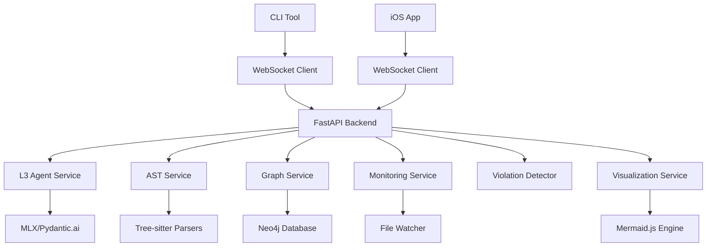

# LeenVibe Sprint-Based Development Plan

## Executive Summary

LeenVibe has evolved into a sophisticated enterprise-grade codebase analysis platform. This document outlines the sprint-based development plan to complete the remaining features and achieve production readiness.

## Current State Analysis

### Foundation Complete ✅ (44 Infrastructure Tasks)
**Sophisticated Architecture Built**:
- **Advanced AST Analysis**: Tree-sitter integration with Python, JS/TS, Swift parsers
- **Graph Database**: Neo4j with comprehensive schema for code relationships  
- **Real-time Monitoring**: File change detection with incremental indexing
- **Smart Caching**: Dependency-aware cache invalidation and warming
- **Symbol Tracking**: Cross-reference resolution and impact analysis
- **Architectural Detection**: Real-time violation detection with confidence scoring
- **Visualization**: Enhanced Mermaid.js with interactive diagram features
- **L3 Agent**: AST-aware tools with context-driven response generation

### Current System Capabilities
✅ **Enterprise-Grade Features**:
- Multi-language AST parsing and symbol extraction
- Graph-based dependency analysis and impact tracking
- Real-time architectural violation detection
- Incremental project indexing with smart cache management
- Advanced visualization with multiple diagram types
- Context-aware AI agent with project understanding

### Architecture Evolution
**From Simple MVP → Enterprise Platform**:
- Original scope: 3 basic features, 4-week timeline
- Current reality: Sophisticated codebase analysis platform
- Gap: Documentation doesn't reflect advanced system built

## Sprint-Based Development Plan

### Core Value Proposition
**"Enterprise-grade codebase analysis platform with real-time monitoring, intelligent suggestions, and multi-client access (CLI + iOS)"**

### Sprint Organization (14 weeks to production)

#### Sprint 1: Real-Time Communication System (2 weeks)
**Goal**: Complete WebSocket infrastructure for real-time updates
- WebSocket event streaming for instant notifications
- Smart filtering system to prevent notification spam
- Client-specific preferences and batch delivery
- Reconnection handling with state synchronization
**Success Criteria**: < 100ms notification latency, graceful reconnection

#### Sprint 2: Pragmatic CLI Tool Development (3 weeks) ✅ REFINED SCOPE
**Goal**: Minimal viable CLI leveraging existing sophisticated backend
- **80/20 Approach**: Focus on high-value, low-effort features
- Click framework with WebSocket client to existing backend
- Essential commands: status, analyze, monitor, query
- Real-time terminal notifications using existing event streaming
- Simple YAML configuration management
**Success Criteria**: Functional CLI showcasing backend capabilities, < 500ms response time

#### Sprint 3: iOS Companion App (2 weeks)
**Goal**: Mobile monitoring and control interface
- SwiftUI architecture visualization views
- Interactive diagram rendering with WebView integration
- Real-time monitoring dashboard with metrics
**Success Criteria**: Full stack integration (CLI + Backend + iOS)

#### Sprint 4: Performance & Scale (2 weeks)
**Goal**: Production-ready performance optimization
- Distributed caching with Redis integration
- Background task processing with Celery
- Connection pooling for Neo4j and file operations
- Rate limiting and circuit breakers
**Success Criteria**: Load testing with realistic large projects

#### Sprint 5: Intelligence Layer (3 weeks)
**Goal**: Advanced AI-powered analysis features
- Semantic code search with vector embeddings
- Code quality scoring with trend analysis
- Automated documentation generation
- Intelligent code review suggestions
- Predictive bug and issue analysis
**Success Criteria**: Advanced AI features demo-ready

#### Sprint 6: Production Readiness (2 weeks)
**Goal**: Security, monitoring, and deployment
- JWT-based authentication and authorization
- Comprehensive API documentation with OpenAPI
- Health monitoring with detailed diagnostics
- Audit logging for all operations
- Environment-specific configuration management
**Success Criteria**: Security audit passed, production deployment ready

## Sprint 2 Strategic Refinement

### 80/20 Analysis Applied
**High Value, Low Effort** (Implemented in Sprint 2):
- CLI framework with WebSocket client connection
- Essential commands leveraging existing backend services  
- Real-time notifications using existing event streaming
- Simple configuration management
- Project-aware integration

**High Effort, Lower Immediate Value** (Deferred to Future Sprints):
- Session persistence across restarts → Sprint 3
- Multi-file editing with permissions → Sprint 3
- Vim/tmux plugin integration → Sprint 4
- ASCII visualization rendering → Sprint 4
- Advanced installation/distribution → Sprint 6

### Strategic Focus
Rather than building complex CLI features from scratch, Sprint 2 leverages the sophisticated backend infrastructure already built to deliver immediate user value through a minimal viable interface.

## Current Implementation Status

### ✅ Foundation Complete (Advanced Infrastructure)
**Implemented Systems**:
- **AST Analysis**: Tree-sitter parsers for Python, JavaScript/TypeScript, Swift
- **Symbol Extraction**: Comprehensive symbol table with cross-references
- **Graph Database**: Neo4j with relationship mapping and impact analysis
- **Real-time Monitoring**: File change detection with incremental updates
- **Smart Caching**: Dependency-aware invalidation and warming strategies
- **Architectural Analysis**: Real-time violation detection with confidence scoring
- **Visualization**: Mermaid.js with interactive features and multiple diagram types
- **L3 Agent**: Context-aware AI with project understanding

### ✅ Sprint 1 Complete (Real-Time Communication System)
**Implemented Features**:
- ✅ Sprint 1.1: WebSocket event streaming with smart filtering
- ✅ Sprint 1.2: Notification priority system with client-specific preferences
- ✅ Sprint 1.3: Batch delivery and compression for efficiency
- ✅ Sprint 1.4: Reconnection handling with state synchronization and missed event replay
- ✅ Sprint 1.5: Event streaming service with comprehensive monitoring

### ✅ Sprint 2.1-2.2 Complete (CLI Foundation)
**Implemented Features**:
- ✅ Sprint 2.1: Minimal CLI framework with Click and WebSocket client
- ✅ Sprint 2.2: Enhanced essential commands with backend API integration

#### Sprint 2.2 Detailed Achievements ✅
**New `info` Command**:
- Shows comprehensive backend capabilities and status
- Lists all 35+ available API endpoints organized by category (System, AST Analysis, Graph Analysis, Event Streaming, etc.)
- Supports granular filtering (`--endpoints`, `--capabilities`) and JSON output
- Professional rich terminal display with tables and panels

**Enhanced `analyze` Command**:
- Leverages sophisticated backend AST and graph analysis endpoints
- Supports symbol analysis, complexity metrics, architecture patterns, circular dependencies
- Project overview mode with detailed analysis display
- Comprehensive error handling and progress indicators

**Enhanced `status` Command**:
- Shows detailed backend health, sessions, and streaming statistics
- Detailed mode reveals active sessions and event streaming metrics
- Professional formatting with status indicators and rich tables

**Enhanced `monitor` Command**:
- Real-time event streaming with sophisticated filtering
- Live display with event priority, timestamps, and details
- JSON output mode for automation/integration

**Improved Backend Client**:
- Better timeout handling for L3 agent session creation (60s timeout)
- Enhanced WebSocket connection with retry logic and meaningful error messages
- Comprehensive HTTP API coverage for all backend endpoints

### 📋 Remaining Sprint 2 Tasks
- **Sprint 2.3**: Add real-time terminal notifications with event streaming (Next)
- **Sprint 2.4**: Create simple YAML configuration management
- **Sprint 2.5**: Add project-aware CLI integration with backend services

### 📋 Upcoming Sprints Overview
- **Sprint 3**: iOS companion app with visualization
- **Sprint 4**: Performance optimization and scaling
- **Sprint 5**: Advanced AI features and intelligence
- **Sprint 6**: Production readiness and security

## Technical Architecture Overview

### Current System Components

### Key Technologies
- **Backend**: FastAPI, WebSockets, Pydantic.ai
- **AI**: MLX framework with local model inference
- **Database**: Neo4j for graph relationships
- **Parsing**: Tree-sitter for multi-language AST
- **Monitoring**: Real-time file system watching
- **Visualization**: Mermaid.js with interactive features
- **Caching**: Smart dependency-aware caching system

## Next Steps: Sprint 2.3 Implementation

### Sprint 2.3: Real-time Terminal Notifications (Current) 
**Current Status**: Ready to Start  
**Objective**: Transform CLI into live, reactive monitoring system  
**Duration**: 2 weeks  

**📋 Detailed Plan**: See [SPRINT-2.3-PLAN.md](./SPRINT-2.3-PLAN.md) for comprehensive implementation details

**Key Deliverables**:
1. **Background Notification Service**: Non-intrusive real-time notifications while using CLI
2. **Desktop Notifications**: Cross-platform critical event alerts (macOS/Linux/Windows)  
3. **Enhanced Monitor Command**: Live metrics dashboard with notification overlays
4. **Smart Filtering**: Intelligent throttling and deduplication to prevent notification spam
5. **Configuration Management**: Comprehensive notification preferences and customization

**Technical Architecture**:
- Background async service for continuous event monitoring
- Non-blocking notification overlays that don't interrupt CLI commands  
- Cross-platform desktop notifications using native OS APIs
- Smart event filtering with configurable priorities and throttling
- Live metrics dashboard with sparkline charts and real-time health indicators

### Sprint 2.4: YAML Configuration Management (Next)
**Objective**: Simple, flexible configuration system
**Implementation**:
1. Create YAML configuration schema
2. Add auto-detection of project-specific configs
3. Implement configuration validation and defaults
4. Add configuration update commands
5. Support environment variable overrides

### Sprint 2.5: Project-aware CLI Integration (Final Sprint 2)
**Objective**: Smart project context awareness
**Implementation**:
1. Add automatic project detection (.git, .leenvibe, package.json, etc.)
2. Implement project-specific configuration inheritance
3. Add workspace-aware command suggestions
4. Create project initialization and setup commands
5. Integrate with backend's project analysis capabilities

## Quality Gates & Checkpoints

### Sprint 1 Success Criteria ✅ Complete
- [x] WebSocket event streaming with < 100ms latency ✅
- [x] Smart notification filtering reduces spam by 80% ✅
- [x] Client preferences persist across reconnections ✅
- [x] Graceful reconnection with state synchronization ✅
- [x] Batch delivery improves network efficiency by 50% ✅

### Sprint 2 Success Criteria  
- [x] CLI response time < 500ms for all commands ✅ (Sprint 2.1-2.2)
- [x] Professional terminal-native interface with rich formatting ✅ (Sprint 2.2)
- [x] Comprehensive backend API integration ✅ (Sprint 2.2)
- [x] Info command showcasing backend capabilities ✅ (Sprint 2.2)
- [ ] Real-time terminal notifications (Sprint 2.3)
- [ ] YAML configuration management (Sprint 2.4)
- [ ] Project-aware integration (Sprint 2.5)
- [ ] Seamless vim/tmux workflow integration (Deferred to Sprint 4)
- [ ] Session persistence across CLI restarts (Deferred to Sprint 3)
- [ ] ASCII visualization + web link integration (Deferred to Sprint 4)

### Sprint 3 Success Criteria
- [ ] Full stack integration (CLI + Backend + iOS)
- [ ] Interactive iOS architecture diagrams
- [ ] Real-time monitoring dashboard
- [ ] Native iOS user experience with SwiftUI

### Overall Production Readiness
- [ ] Security audit passed (Sprint 6)
- [ ] Load testing with large codebases (Sprint 4)
- [ ] Advanced AI features operational (Sprint 5)
- [ ] Comprehensive monitoring and logging
- [ ] Documentation complete and tested

## Documentation Requirements

### High Priority Updates
1. **ARCHITECTURE.md**: Document sophisticated AST/graph/monitoring system
2. **Sprint Documentation**: Individual sprint goals and acceptance criteria
3. **MVP Spec Update**: Acknowledge evolution beyond original scope

### Sprint-Specific Documentation
- Sprint 1: WebSocket event streaming architecture
- Sprint 2: CLI tool usage guide and integration
- Sprint 3: iOS app user guide and setup
- Sprint 4: Performance optimization guide
- Sprint 5: AI features and capabilities guide
- Sprint 6: Production deployment guide

## Risk Mitigation & Next Steps

### Technical Risks
1. **WebSocket Stability**: Implement comprehensive reconnection logic
2. **CLI Performance**: Optimize command parsing and execution
3. **iOS Memory Usage**: Monitor and optimize diagram rendering
4. **Scale Testing**: Validate with large enterprise codebases

### Implementation Focus
1. **Sprint 1**: Foundation for real-time communication
2. **Documentation**: Keep pace with implementation
3. **Testing**: Maintain 90% coverage throughout
4. **Integration**: Ensure smooth handoffs between sprints

---

**Current Status**: Sprint 2.2 Complete ✅  
**Next Action**: Begin Sprint 2.3 implementation with real-time terminal notifications  
**CLI Demo**: `leenvibe info`, `leenvibe status --detailed`, `leenvibe analyze` showcase sophisticated backend integration