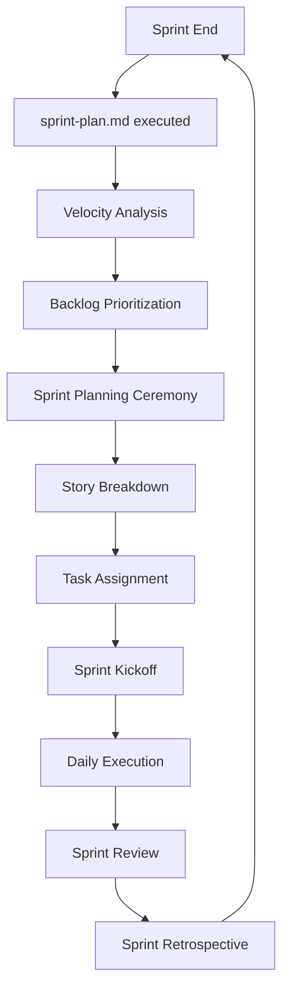
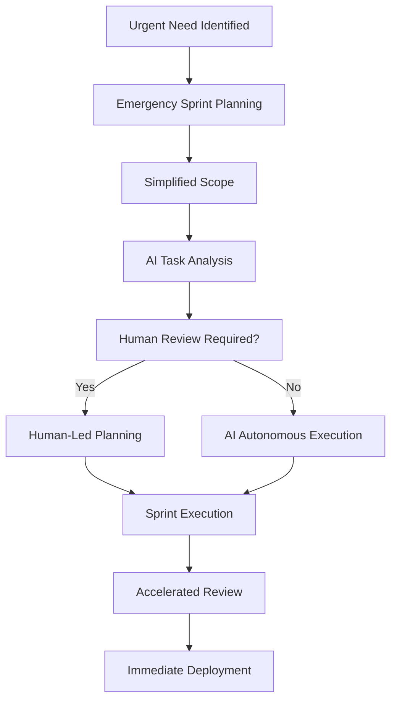
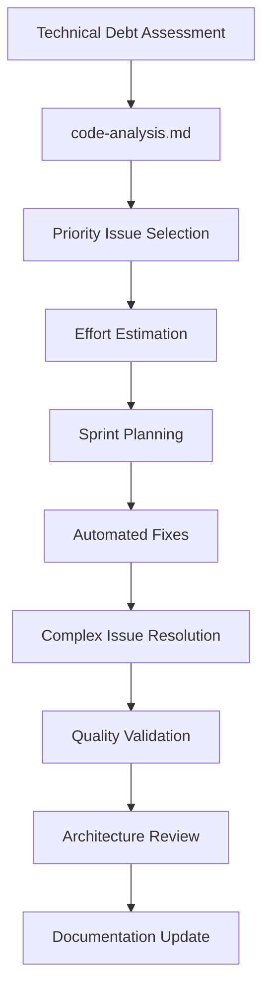

# Sprint Planning Playbook
**Version 1.0** | **Created**: June 25, 2025 | **Status**: Implementation Ready

---

## 📋 **Overview**

This playbook provides a comprehensive guide for executing Sprint Planning ceremonies in an Agile-AI integrated environment. It combines traditional Scrum practices with AI-enhanced planning capabilities for optimal sprint delivery.

### **Purpose**
- Standardize sprint planning process across AI and human team members
- Maximize velocity through intelligent task breakdown and estimation
- Ensure consistent quality and delivery predictability
- Enable seamless handoffs between AI and human work streams

### **Scope**
- 2-week sprint cycles (adaptable to 1-week for urgent releases)
- Mixed AI-human development teams
- GitHub Projects integration for tracking and automation
- DynaStory iOS project context with COPPA compliance requirements

---

## 🎯 **Sprint Planning Framework**

### **Pre-Planning Preparation (AI-Automated)**

#### **Command: `sprint-plan.md`**
Execute 2 days before Sprint Planning ceremony:

```bash
sprint-plan.md "2-week sprint starting [DATE], focus: [THEME]"
```

**AI Responsibilities:**
1. **Velocity Analysis**
   - Calculate team velocity from last 3 sprints
   - Account for team capacity changes (holidays, new members)
   - Generate velocity confidence intervals (80%, 90%, 95%)

2. **Backlog Analysis**
   - Review and prioritize product backlog items
   - Identify dependencies and blockers
   - Suggest story splitting for large items (>8 story points)

3. **Risk Assessment**
   - Flag high-risk items requiring human expertise
   - Identify external dependencies needing coordination
   - Assess technical debt impact on velocity

4. **Draft Sprint Scope**
   - Generate optimized story selection
   - Balance feature work vs. technical debt (70/30 ratio)
   - Ensure COPPA compliance requirements covered

### **Sprint Planning Ceremony Structure**

#### **Part 1: Sprint Goal Definition (30 minutes)**
**Participants:** Product Owner, Scrum Master, Development Team
**AI Role:** Context provider and analysis support

1. **Review Sprint Objective**
   - Product Owner presents sprint theme
   - AI provides velocity analysis and capacity assessment
   - Team validates scope feasibility

2. **Sprint Goal Formulation**
   - Define clear, measurable sprint goal
   - Align with product roadmap and user outcomes
   - Document in GitHub milestone

3. **High-Level Scope Agreement**
   - Review AI-suggested story selection
   - Adjust based on business priorities
   - Confirm preliminary sprint commitment

#### **Part 2: Task Breakdown and Estimation (60 minutes)**
**AI Commands Used:** `task-breakdown.md`, `implement-task.md`

1. **Story Decomposition**
   ```bash
   task-breakdown.md "Feature: [STORY TITLE]"
   ```
   - AI breaks stories into 1-3 day tasks
   - Identifies technical dependencies
   - Suggests implementation approach

2. **Estimation Session**
   - Team estimates using Planning Poker
   - AI provides complexity analysis as input
   - Document estimates in GitHub issues

3. **Capacity Validation**
   - Validate total commitment against team capacity
   - Account for code review, testing, documentation time
   - Buffer for unplanned work (15-20%)

#### **Part 3: Sprint Backlog Creation (30 minutes)**

1. **Final Story Selection**
   - Confirm stories fitting within sprint capacity
   - Prioritize by business value and dependencies
   - Create GitHub milestone and link stories

2. **Task Assignment Strategy**
   ```bash
   implement-task.md "[STORY] - [COMPONENT]"
   ```
   - Assign AI-suitable tasks to AI agents
   - Reserve complex/creative tasks for humans
   - Define handoff points and review criteria

3. **Definition of Done Validation**
   - Review DoD criteria for each story
   - Ensure quality gates are understood
   - Plan automated validation sequence

---

## 🤖 **AI Integration Patterns**

### **Automated Sprint Planning Triggers**

#### **Context-Based Triggers**
```markdown
## Auto-Sprint Planning Conditions
- **Sprint End -2 days**: Execute `sprint-plan.md`
- **Velocity Change >20%**: Recalculate capacity
- **Backlog Priority Shift**: Re-analyze story selection
- **Team Capacity Change**: Adjust sprint scope
```

#### **GitHub Integration**
```bash
# Automated milestone creation
gh milestone create "Sprint $(date +%Y-%m-%d)" \
  --due-date "$(date -d '+14 days' +%Y-%m-%d)" \
  --description "Sprint Goal: $SPRINT_GOAL"

# Story assignment to milestone
gh issue edit $ISSUE_NUMBER --milestone "Sprint $(date +%Y-%m-%d)"

# Label application for tracking
gh issue edit $ISSUE_NUMBER --add-label "sprint-active,ai-task"
```

### **Human-AI Collaboration Matrix**

| Task Type | AI Capability | Human Involvement | Handoff Protocol |
|-----------|---------------|-------------------|------------------|
| Feature Implementation | 90%+ autonomous | Code review only | `create-pr.md` → Human review |
| Bug Fixes | 85% autonomous | Complex issues escalation | `fix-issue.md` → Confidence <70% escalate |
| Architecture Design | 60% autonomous | Design review required | `architecture-review.md` → Human approval |
| UI/UX Implementation | 75% autonomous | Design validation | `review-screen.md` → Design team review |
| Performance Optimization | 80% autonomous | Impact assessment | `optimize.md` → Performance team validation |
| Security Implementation | 50% autonomous | Security review mandatory | `check.md` → Security team approval |

### **Quality Gate Integration**

#### **Sprint Planning Quality Checklist**
```markdown
- [ ] All stories have clear acceptance criteria
- [ ] Dependencies identified and managed
- [ ] COPPA compliance requirements addressed
- [ ] Performance impact assessed for UI changes
- [ ] Security implications reviewed
- [ ] Test strategy defined for each story
- [ ] Documentation requirements specified
- [ ] Rollback plan for high-risk changes
```

#### **Automated Validation Commands**
```bash
# Pre-sprint validation
check.md --scope=sprint-backlog --focus=completeness

# Capacity validation
sprint-plan.md --validate-capacity --team-velocity=$VELOCITY

# Risk assessment
code-analysis.md --scope=sprint-stories --focus=risk-assessment
```

---

## 📊 **Sprint Metrics and Tracking**

### **Velocity Tracking**

#### **Story Point Velocity**
- **Planned vs. Actual**: Track commitment accuracy
- **AI vs. Human**: Compare velocity by work type
- **Story Size Distribution**: Optimize for consistent delivery

#### **AI-Specific Metrics**
- **Autonomous Completion Rate**: % of AI tasks completed without human intervention
- **Quality Gate Pass Rate**: % of AI work passing quality checks on first attempt
- **Estimation Accuracy**: AI estimation vs. actual completion time
- **Handoff Efficiency**: Time between AI completion and human review

### **Sprint Burndown Automation**

#### **Daily Updates via GitHub Actions**
```yaml
# .github/workflows/sprint-burndown.yml
name: Update Sprint Burndown
on:
  schedule:
    - cron: '0 9 * * 1-5'  # 9 AM weekdays
  issues:
    types: [closed, reopened]

jobs:
  update_burndown:
    runs-on: ubuntu-latest
    steps:
      - name: Update Sprint Metrics
        run: |
          # Calculate remaining story points
          # Update burndown chart
          # Post to team channel
```

#### **AI Progress Reporting**
```bash
# Automated progress updates
implement-task.md --update-progress --issue=$ISSUE_NUMBER
sprint-plan.md --generate-burndown --format=slack
```

---

## 🔄 **Sprint Planning Workflows**

### **Standard 2-Week Sprint**



### **Accelerated 1-Week Sprint (Hotfix/Urgent)**



### **Technical Debt Sprint**



---

## 📚 **Templates and Checklists**

### **Sprint Planning Meeting Template**

#### **Pre-Meeting Checklist**
- [ ] `sprint-plan.md` executed and results reviewed
- [ ] Product backlog prioritized and estimated
- [ ] Team capacity confirmed (vacation, holidays, etc.)
- [ ] Previous sprint retrospective actions addressed
- [ ] Dependencies and blockers identified

#### **Meeting Agenda**
1. **Opening (5 min)**
   - Review previous sprint results
   - Confirm team availability

2. **Sprint Goal (15 min)**
   - Product Owner presents objectives
   - Team discusses and refines goal
   - Document in GitHub milestone

3. **Story Selection (30 min)**
   - Review AI-recommended scope
   - Adjust based on business priorities
   - Validate against team capacity

4. **Task Breakdown (45 min)**
   - Execute `task-breakdown.md` for complex stories
   - Estimate effort using Planning Poker
   - Identify AI vs. Human task distribution

5. **Sprint Commitment (15 min)**
   - Final scope confirmation
   - Risk mitigation planning
   - Next steps and kickoff

#### **Post-Meeting Actions**
- [ ] Create GitHub milestone with due date
- [ ] Assign all stories to milestone
- [ ] Apply appropriate labels (ai-task, human-required, etc.)
- [ ] Schedule daily standups
- [ ] Set up automated tracking and reporting

### **Story Acceptance Criteria Template**

```markdown
## User Story
As a [user type], I want [functionality] so that [benefit/outcome].

## Acceptance Criteria
Given [context/precondition]
When [action/trigger]
Then [expected outcome]

## AI Implementation Notes
- **AI Confidence Level**: [High/Medium/Low]
- **Automated Testing**: [Required test coverage %]
- **Human Review Points**: [Specific areas requiring human validation]
- **Quality Gates**: [Specific checks required]

## COPPA Compliance
- [ ] No data collection without parental consent
- [ ] Age-appropriate content validation
- [ ] Privacy protection measures

## Definition of Done
- [ ] Code complete and reviewed
- [ ] Tests written and passing (>90% coverage)
- [ ] Documentation updated
- [ ] Performance benchmarks met
- [ ] Security scan passed
- [ ] Accessibility requirements met
- [ ] Demo-ready for Sprint Review
```

---

## 🎯 **Success Metrics**

### **Sprint Planning Effectiveness**
- **Planning Time Reduction**: Target 50% reduction with AI assistance
- **Estimation Accuracy**: ±20% variance between planned and actual
- **Scope Stability**: <10% scope change during sprint
- **Commitment Reliability**: 95% sprint goal achievement

### **AI Integration Success**
- **Autonomous Task Completion**: >80% of AI-assigned tasks
- **Quality First-Pass Rate**: >90% of AI work passes quality gates
- **Human Review Efficiency**: <2 hours average review time per AI deliverable
- **Escalation Rate**: <15% of AI tasks require human intervention

### **Team Velocity Optimization**
- **Sprint Velocity**: 20% improvement over 6 months
- **Lead Time**: 30% reduction in feature delivery time
- **Defect Rate**: <5% production defects from sprint deliverables
- **Team Satisfaction**: >8/10 satisfaction with planning process

---

*This Sprint Planning Playbook ensures consistent, efficient sprint planning that maximizes the benefits of AI-human collaboration while maintaining high-quality delivery standards.*