# Workflow Diagrams
**Version 1.0** | **Created**: June 25, 2025 | **Status**: Phase 1 Implementation

---

## 📊 **Overview**

This document contains comprehensive Mermaid diagrams visualizing the Agile-AI workflow integration for DynaStory. These diagrams show command relationships, decision flows, and human-AI collaboration patterns.

### **Diagram Categories**
- **Master Development Workflow**: End-to-end development process
- **Command Trigger Matrix**: Automated and manual command execution
- **Human Handoff Protocols**: Escalation and collaboration patterns
- **Memory Management Cycles**: Context optimization workflows
- **Quality Gate Integration**: Validation and approval processes
- **Sprint Execution Flow**: Agile ceremony automation
- **GitHub Projects Integration**: Automated sprint planning and tracking
- **AI Learning and Adaptation**: Continuous improvement cycles
- **Technical Debt Management**: Systematic debt resolution workflow
- **Innovation Sprint Process**: Creative exploration and breakthrough development
- **COPPA Compliance Validation**: Child safety and privacy protection
- **Performance Optimization Pipeline**: Systematic performance improvement

### **Legend**
- 🔵 **Blue**: AI Autonomous Actions
- 🟢 **Green**: Human-Led Activities
- 🟣 **Purple**: Collaborative Activities
- 🟡 **Yellow**: Decision Points
- 🔴 **Red**: Escalation/Error Handling

---

## 🔄 **Master Development Workflow**

### **Complete Development Lifecycle**


### **Development Phase Integration**


---

## 🎯 **Command Trigger Decision Matrix**

### **Automated Trigger Conditions**

```mermaid
graph TD
    A[System State Monitor] --> B{Trigger Condition}
    
    B -->|Context ≥ 85%| C[sleep.md]
    B -->|Context 75-84%| D[consolidate-light.md]
    B -->|New Session| E[wake.md]
    B -->|Creative Problem| F[dream.md]
    
    B -->|Build Failure| G[debug-issue.md]
    B -->|Test Failure| H[fix-issue.md]
    B -->|PR Created| I[create-pr.md]
    B -->|Code Changes| J[check.md]
    
    B -->|Sprint Start| K[sprint-plan.md]
    B -->|Feature Request| L[task-breakdown.md]
    B -->|Performance Issue| M[optimize.md]
    B -->|Quality Issue| N[clean.md]
    
    C --> O[Memory Consolidation]
    D --> P[Context Optimization]
    E --> Q[Session Restoration]
    F --> R[Innovation Processing]
    
    G --> S[Root Cause Analysis]
    H --> T[Issue Resolution]
    I --> U[Review Preparation]
    J --> V[Quality Validation]
    
    K --> W[Sprint Creation]
    L --> X[Task Decomposition]
    M --> Y[Performance Tuning]
    N --> Z[Code Cleanup]
    
    classDef contextTrigger fill:#e1f5fe
    classDef eventTrigger fill:#e8f5e8
    classDef scheduleTrigger fill:#fff3e0
    classDef qualityTrigger fill:#fce4ec
    
    class C,D,E,F contextTrigger
    class G,H,I,J eventTrigger
    class K,L scheduleTrigger
    class M,N qualityTrigger
```


### **Manual Command Invocation Flow**


---

## 🤝 **Human Handoff Protocol**

### **Confidence-Based Escalation Flow**


### **Stakeholder Notification Matrix**


---

## 🧠 **Memory Management Optimization Cycle**

### **Context Lifecycle Management**


### **Knowledge Transfer Process**


---

## 📈 **GitHub Projects Integration Flow**

### **Automated Sprint Planning and Tracking**


### **Issue Lifecycle Automation**


---

## 🧠 **AI Learning and Adaptation Cycle**

### **Continuous Improvement Through AI Learning**


### **Confidence Evolution Tracking**


---

## 🔧 **Technical Debt Management Workflow**

### **Systematic Debt Identification and Resolution**


### **Debt Prevention Pipeline**


---

## 💡 **Innovation Sprint Process**

### **Creative Exploration and Breakthrough Development**


### **Innovation Pipeline Management**


---

## 🔒 **COPPA Compliance Validation Flow**

### **Child Safety and Privacy Protection Workflow**


---

## ⚡ **Performance Optimization Pipeline**

### **Systematic Performance Improvement Process**


---

*These comprehensive workflow diagrams provide visual guidance for all aspects of the Agile-AI development process, ensuring clear understanding of command relationships, decision flows, and collaboration patterns.*

---

## ✅ **Quality Gate Integration**

### **Comprehensive Validation Pipeline**

```mermaid
graph TD
    A[Code Changes] --> B[check.md]
    B --> C{Validation Suite}
    
    C --> D[Code Quality Check]
    C --> E[Security Scan]
    C --> F[Performance Test]
    C --> G[Accessibility Test]
    C --> H[COPPA Compliance]
    
    D --> I{Clean Code?}
    E --> J{Secure?}
    F --> K{Performant?}
    G --> L{Accessible?}
    H --> M{COPPA Compliant?}
    
    I -->|No| N[clean.md]
    J -->|No| O[Security Fix]
    K -->|No| P[optimize.md]
    L -->|No| Q[Accessibility Fix]
    M -->|No| R[COPPA Fix]
    
    N --> C
    O --> C
    P --> C
    Q --> C
    R --> C
    
    I -->|Yes| S[Quality Gate 1 ✓]
    J -->|Yes| S
    K -->|Yes| S
    L -->|Yes| S
    M -->|Yes| S
    
    S --> T{All Gates Pass?}
    T -->|Yes| U[quality-gate.md]
    T -->|No| V[Block Progress]
    
    U --> W[Final Validation]
    W --> X{Release Ready?}
    X -->|Yes| Y[Approve for Release]
    X -->|No| Z[Additional Work Required]
    
    V --> AA[Issue Resolution]
    Z --> AA
    AA --> B
    
    classDef validation fill:#e3f2fd
    classDef gate fill:#e8f5e8
    classDef fix fill:#fff3e0
    classDef decision fill:#fce4ec
    classDef outcome fill:#e1f5fe
    
    class B,C,D,E,F,G,H,W validation
    class S,U gate
    class N,O,P,Q,R,AA fix
    class I,J,K,L,M,T,X decision
    class Y,Z,V outcome
```


### **Quality Metrics Dashboard Flow**


---

## 🏃‍♂️ **Sprint Execution Flow**

### **Complete Sprint Lifecycle**
```mermaid
graph TD
    A[Sprint Planning] --> B[task-breakdown.md]
    B --> C[Story Decomposition]
    C --> D[Sprint Backlog Creation]
    D --> E[Daily Sprint Execution]
    
    E --> F[implement-task.md]
    F --> G{Implementation Phase}
    G -->|Coding| H[Code Development]
    G -->|Testing| I[Test Creation]
    G -->|Review| J[Code Review]
    
    H --> K[check.md]
    I --> K
    J --> K
    K --> L{Quality Gates}
    L -->|Pass| M[create-pr.md]
    L -->|Fail| N[fix-issue.md]
    
    N --> O[Issue Resolution]
    O --> K
    
    M --> P[Pull Request]
    P --> Q[run-ci.md]
    Q --> R{CI/CD Results}
    R -->|Pass| S[Merge to Main]
    R -->|Fail| N
    
    S --> T[Sprint Progress Update]
    T --> E
    
    E --> U{Sprint Complete?}
    U -->|No| E
    U -->|Yes| V[review-screen.md]
    V --> W[Sprint Review]
    W --> X[Sprint Retrospective]
    X --> Y[dream.md]
    Y --> Z[Process Improvement]
    Z --> A
    
    classDef planning fill:#e3f2fd
    classDef execution fill:#e8f5e8
    classDef quality fill:#fff3e0
    classDef review fill:#fce4ec
    classDef improvement fill:#e1f5fe
    
    class A,B,C,D planning
    class E,F,G,H,I,J execution
    class K,L,M,N,O,P,Q,R quality
    class S,T,U,V,W review
    class X,Y,Z improvement
```

### **Daily Scrum Integration**
```mermaid
graph LR
    A[Daily Scrum Start] --> B[consolidate-light.md]
    B --> C[Context Optimization]
    C --> D[Progress Review]
    D --> E[Sprint Burndown Update]
    
    E --> F{Impediments?}
    F -->|Yes| G[Impediment Analysis]
    F -->|No| H[Plan Today's Work]
    
    G --> I{Blocker Type}
    I -->|Technical| J[debug-issue.md]
    I -->|Process| K[Human Escalation]
    I -->|External| L[Dependency Tracking]
    
    J --> M[Technical Resolution]
    K --> N[Process Discussion]
    L --> O[Stakeholder Communication]
    
    M --> H
    N --> H
    O --> H
    
    H --> P[Task Assignment]
    P --> Q[implement-task.md]
    Q --> R[Development Work]
    R --> S[End of Day Status]
    S --> T[Daily Scrum End]
    
    classDef scrum fill:#e3f2fd
    classDef optimization fill:#e8f5e8
    classDef impediment fill:#fff3e0
    classDef execution fill:#fce4ec
    
    class A,B,C,D,E,T scrum
    class B,C optimization
    class F,G,I,J,K,L,M,N,O impediment
    class H,P,Q,R,S execution
```

---

## 📋 **Diagram Usage Guidelines**

### **For Development Teams**
- Use **Master Development Workflow** for onboarding new team members
- Reference **Command Trigger Matrix** for understanding automation
- Follow **Human Handoff Protocol** for escalation procedures
- Monitor **Quality Gate Integration** for release readiness

### **For Scrum Masters**
- Use **Sprint Execution Flow** for ceremony planning
- Reference **Daily Scrum Integration** for standup optimization
- Monitor **Human Handoff Protocol** for team collaboration
- Track **Memory Management Cycle** for session efficiency

### **for Product Owners**
- Reference **Master Development Workflow** for delivery planning
- Use **Quality Gate Integration** for release decision making
- Monitor **Human Handoff Protocol** for stakeholder involvement
- Track **Sprint Execution Flow** for velocity optimization

### **For Technical Leads**
- Use **Command Trigger Matrix** for automation optimization
- Reference **Quality Gate Integration** for technical standards
- Monitor **Memory Management Cycle** for performance tuning
- Follow **Human Handoff Protocol** for architectural decisions

---

## 🔄 **Diagram Maintenance**

### **Update Schedule**
- **Weekly**: Review automation triggers and adjust based on usage
- **Sprint End**: Update sprint flow based on retrospective feedback
- **Monthly**: Comprehensive review of all diagrams for accuracy
- **Quarterly**: Major updates based on process evolution

### **Version Control**
- All diagrams are versioned with this document
- Changes tracked through git commits
- Major updates require team review and approval
- Backward compatibility maintained for training materials

*These workflow diagrams provide visual guidance for effective Agile-AI collaboration, ensuring clear understanding of process flows and decision points for all team members.*