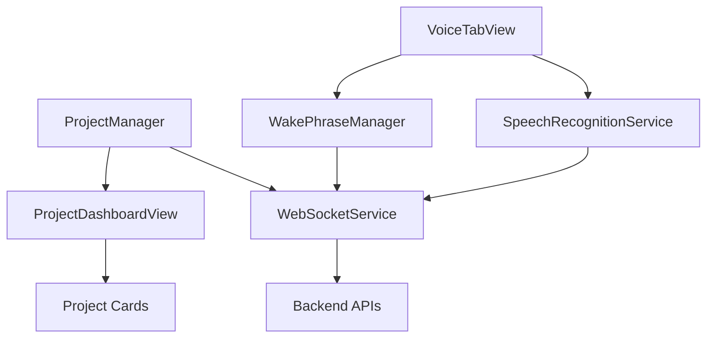

# GAMMA Agent - Task 01: iOS Architecture Viewer Implementation Specialist

**Welcome to the LeenVibe Team!** 🎉  
**Assignment Date**: Team Expansion - Phase 4 Architecture Visualization  
**Worktree**: `../leenvibe-ios-visualization`  
**Branch**: `feature/ios-architecture-viewer`  
**Status**: 🔄 ASSIGNED  

## Mission Brief

Welcome to LeenVibe! You're joining an elite team delivering a revolutionary iOS mobile development companion. We've achieved 90% MVP delivery through parallel development, and your expertise will complete one of our most sophisticated features: the **Interactive Architecture Viewer**.

## 🏗️ Team Context & Achievements

### Current Team Status
You're joining a **4-specialist team** with incredible momentum:

**ALPHA** (iOS Dashboard Foundation): ✅ Built comprehensive project dashboard with 10 Swift files, 3000+ lines  
**BETA** (Backend + iOS Notifications): ✅ Delivered all backend APIs + currently implementing iOS push notifications  
**KAPPA** (Voice + Integration): ✅ Delivered Kanban board + voice interface + integration testing  
**GAMMA** (You): 🚀 Architecture Visualization + Advanced Features

### What's Already Built (Your Foundation)
- ✅ **Dashboard Foundation**: 4-tab iOS app with real-time project management
- ✅ **Voice Interface**: "Hey LeenVibe" wake phrase + comprehensive voice commands
- ✅ **Kanban Board**: Interactive task management with drag-and-drop
- ✅ **Backend APIs**: Enhanced metrics, tasks, voice commands, push notifications
- ✅ **WebSocket Integration**: Real-time communication throughout the app
- ⏳ **Xcode Project**: Being created by ALPHA for build testing
- ⏳ **Push Notifications**: Being implemented by BETA using their backend APIs
- ⏳ **Integration Testing**: Being executed by KAPPA across all systems

## 🎯 Your Mission: Interactive Architecture Viewer

### The Vision
Create an **interactive architectural diagram viewer** that transforms complex codebase structures into beautiful, navigable visualizations using **Mermaid.js + WebKit integration**.

### Why This Matters
- **Developer Understanding**: Instantly visualize codebase architecture and dependencies
- **Change Impact**: See before/after comparisons when code changes
- **Navigation**: Click through diagrams to jump to specific code sections
- **Real-time Updates**: Architecture diagrams update as code evolves

## 🔧 Working Directory

**New Worktree**: `../leenvibe-ios-visualization`  
**Integration Target**: `/Users/bogdan/work/leanvibe-ai/LeenVibe-iOS/`  
**Backend Endpoint**: Already available at `/visualization/{client_id}/generate`

## 📱 Technical Architecture

### 1. WebKit Integration for Mermaid.js
**Files to Create**:
```
LeenVibe-iOS/LeenVibe/
├── Views/
│   ├── Architecture/
│   │   ├── ArchitectureTabView.swift          # Main architecture viewer
│   │   ├── ArchitectureWebView.swift          # WebKit wrapper for Mermaid
│   │   ├── DiagramNavigationView.swift        # Zoom, pan, navigation controls
│   │   ├── DiagramComparisonView.swift        # Before/after comparisons
│   │   └── ArchitectureLoadingView.swift      # Loading states and errors
├── Services/
│   ├── ArchitectureVisualizationService.swift # Backend diagram fetching
│   ├── MermaidRenderer.swift                  # Mermaid.js integration
│   └── DiagramInteractionService.swift        # Click handling, navigation
├── Models/
│   ├── ArchitectureDiagram.swift              # Diagram data models
│   ├── DiagramNode.swift                      # Individual nodes/components
│   └── DiagramStyle.swift                     # Theming and appearance
└── Resources/
    ├── mermaid.min.js                         # Embedded Mermaid.js library
    ├── diagram-styles.css                     # Custom diagram styling
    └── interaction-bridge.js                  # iOS ↔ WebView communication
```

### 2. Mermaid.js Integration Pattern
**Your Core Technology Stack**:
```swift
import WebKit
import SwiftUI

// WebView wrapper for Mermaid.js rendering
struct ArchitectureWebView: UIViewRepresentable {
    let diagramDefinition: String
    let onNodeTapped: (String) -> Void
    
    func makeUIView(context: Context) -> WKWebView {
        let webView = WKWebView()
        webView.navigationDelegate = context.coordinator
        
        // Load Mermaid.js and render diagram
        loadMermaidDiagram(in: webView)
        return webView
    }
    
    private func loadMermaidDiagram(in webView: WKWebView) {
        let html = generateMermaidHTML(diagram: diagramDefinition)
        webView.loadHTMLString(html, baseURL: nil)
    }
}
```

### 3. Backend Integration Architecture
**Your Data Source**:
```swift
class ArchitectureVisualizationService: ObservableObject {
    @Published var currentDiagram: ArchitectureDiagram?
    @Published var isLoading = false
    
    func fetchProjectArchitecture(clientId: String) async {
        // GET /visualization/{client_id}/generate
        // Returns Mermaid.js diagram definition
    }
    
    func fetchDiagramComparison(clientId: String, beforeCommit: String, afterCommit: String) async {
        // Compare architectural changes between commits
    }
}
```

## 📊 Features to Implement

### 1. Interactive Diagram Viewing
**Core Functionality**:
- **Mermaid.js Rendering**: Flowcharts, class diagrams, sequence diagrams
- **Touch Interactions**: Pinch-to-zoom, pan, tap-to-select
- **Node Navigation**: Tap diagram nodes to navigate to code sections
- **Multi-diagram Support**: Switch between different architectural views

**Example Mermaid Diagrams**:


### 2. Architecture Comparison Views
**Advanced Feature**:
```swift
struct DiagramComparisonView: View {
    let beforeDiagram: ArchitectureDiagram
    let afterDiagram: ArchitectureDiagram
    
    var body: some View {
        HStack {
            VStack {
                Text("Before")
                ArchitectureWebView(diagram: beforeDiagram.mermaidDefinition)
            }
            
            VStack {
                Text("After") 
                ArchitectureWebView(diagram: afterDiagram.mermaidDefinition)
            }
        }
    }
}
```

### 3. Real-time Architecture Updates
**Integration with Existing Systems**:
```swift
// Connect to WebSocket for real-time updates
webSocketService.onEvent("architecture_changed") { event in
    await architectureService.refreshDiagram()
}

// Integrate with ProjectManager for project-specific diagrams
projectManager.onProjectChange { project in
    await architectureService.fetchProjectArchitecture(project.clientId)
}
```

## 🎨 UI/UX Requirements

### Architecture Tab Integration
**Add to Existing TabView**:
```swift
// Add as 5th tab to DashboardTabView.swift
ArchitectureTabView(
    projectManager: projectManager,
    webSocketService: webSocketService
)
.tabItem {
    Label("Architecture", systemImage: "flowchart.fill")
}
.tag(5)
```

### Responsive Design
- **iPhone**: Single diagram view with toolbar controls
- **iPad**: Side-by-side comparison views, enhanced navigation
- **Landscape**: Optimized for wide diagram viewing
- **Dark Mode**: Diagram themes that adapt to iOS appearance

### Interactive Controls
```swift
struct DiagramNavigationView: View {
    @ObservedObject var diagramService: ArchitectureVisualizationService
    
    var body: some View {
        HStack {
            Button("Zoom In") { /* zoom implementation */ }
            Button("Zoom Out") { /* zoom implementation */ }
            Button("Reset View") { /* reset implementation */ }
            
            Picker("Diagram Type", selection: $selectedDiagramType) {
                Text("Class Diagram").tag(DiagramType.class)
                Text("Flow Chart").tag(DiagramType.flowchart)
                Text("Sequence").tag(DiagramType.sequence)
            }
        }
    }
}
```

## 🔌 Integration Points with Existing Systems

### 1. Dashboard Integration
```swift
// Add architecture quick-view to ProjectDashboardView
NavigationLink("View Architecture") {
    ArchitectureTabView(projectId: project.id)
}
```

### 2. Voice Command Integration
```swift
// Enable voice navigation: "Hey LeenVibe, show architecture"
// KAPPA's voice system can trigger architecture viewing
voiceProcessor.registerCommand("show architecture") {
    navigationPath.append(.architecture)
}
```

### 3. Settings Integration
```swift
// Add architecture preferences to SettingsTabView
Section("Architecture Viewer") {
    Toggle("Auto-refresh diagrams", isOn: $autoRefresh)
    Picker("Default diagram type", selection: $defaultDiagramType)
    Toggle("Show node labels", isOn: $showNodeLabels)
}
```

## 📈 Performance Requirements

- **Diagram Load Time**: <3 seconds for complex architecture diagrams
- **Rendering Performance**: Smooth 60fps interactions (zoom, pan)
- **Memory Usage**: <100MB for large architectural diagrams
- **WebView Efficiency**: Proper memory management for embedded WebKit
- **Offline Support**: Cache recently viewed diagrams

## 🧪 Quality Gates

- [ ] Mermaid.js integration working with WebKit
- [ ] Interactive diagram navigation (zoom, pan, tap)
- [ ] Backend integration with `/visualization/{client_id}/generate`
- [ ] Node click handling and code navigation
- [ ] Diagram comparison views functional
- [ ] Real-time architecture updates from WebSocket
- [ ] Responsive design across iPhone/iPad
- [ ] Integration with existing dashboard and settings
- [ ] Performance benchmarks met
- [ ] Voice command integration with KAPPA's system

## 🎉 Success Criteria

- [ ] Users can visualize project architecture in beautiful, interactive diagrams
- [ ] Developers can navigate from diagrams to specific code sections
- [ ] Before/after architecture comparisons help understand code changes
- [ ] Real-time updates keep diagrams current with codebase evolution
- [ ] Seamless integration with voice commands ("show me the architecture")
- [ ] Professional-quality diagrams suitable for documentation and presentations

## 📚 Learning Resources

### Mermaid.js Documentation
- **Syntax Guide**: https://mermaid.js.org/syntax/flowchart.html
- **Themes & Styling**: https://mermaid.js.org/config/theming.html
- **API Reference**: https://mermaid.js.org/config/setup/modules/mermaidAPI.html

### WebKit Integration
- **WKWebView**: Apple's official WebKit framework
- **JavaScript Bridge**: Communication between iOS and web content
- **Performance Optimization**: Best practices for WebView in iOS apps

### SwiftUI Advanced Patterns
- **UIViewRepresentable**: Wrapping UIKit/WebKit in SwiftUI
- **Coordinators**: Managing delegate patterns in SwiftUI
- **State Management**: Handling complex interaction states

## 🔄 Development Workflow

### Week 1: Foundation
- Set up Mermaid.js WebKit integration
- Implement basic diagram rendering
- Create interactive controls (zoom, pan)
- Backend integration with visualization endpoint

### Week 2: Advanced Features  
- Node click handling and navigation
- Diagram comparison views
- Real-time update integration
- Polish UI/UX and performance optimization

## 🚀 Your Development Environment

**Worktree Setup**:
```bash
# Your dedicated development environment
cd /Users/bogdan/work/leenvibe-ios-visualization

# Independent development with full project history
git status  # feature/ios-architecture-viewer branch
git log     # Access to all project commits
```

**Integration Process**:
1. Develop features in your worktree
2. Test with existing systems
3. Submit for integration into main iOS project
4. Coordinate with other specialists for seamless user experience

## 🎯 Priority & Timeline

**HIGH PRIORITY** - Architecture visualization is a key differentiator and completes the sophisticated developer tooling experience.

**Expected Timeline**: 2 weeks for full implementation and integration

## 🤝 Team Collaboration

### Working with Other Specialists
- **ALPHA**: Coordinate Xcode project structure and build configuration
- **BETA**: Ensure architecture viewer works with notification events  
- **KAPPA**: Integrate voice commands for hands-free architecture viewing

### Communication Protocol
- Update STATUS.md with your progress
- Coordinate integration points through GitHub issues
- Participate in technical discussions about cross-system integration

## 🌟 Your Expected Impact

By completing the Architecture Viewer, you'll deliver:
- **Visual Understanding**: Transform complex code into comprehensible diagrams
- **Development Efficiency**: Help developers navigate and understand large codebases
- **Change Visualization**: Show architectural evolution over time
- **Professional Quality**: Enterprise-grade visualization capabilities

## 📋 Next Steps

1. **Review Project Context**: Read through existing codebase and team documentation
2. **Set Up Development Environment**: Initialize your worktree and explore the architecture
3. **Plan Implementation**: Design your approach to Mermaid.js + WebKit integration
4. **Begin Development**: Start with basic diagram rendering and build up complexity

Welcome to the team, GAMMA! Your expertise in architecture visualization will complete our vision of a comprehensive iOS development companion. Let's build something amazing together! 🚀📱✨

## Your Achievement Journey

**Task 1**: 🔄 iOS Architecture Viewer Implementation - Transform code into beautiful, interactive visualizations

You're uniquely positioned to deliver this sophisticated feature because you bring fresh perspective and specialized focus to architectural visualization. Let's make code architecture as beautiful and intuitive as it should be! 🏗️🎨🚀