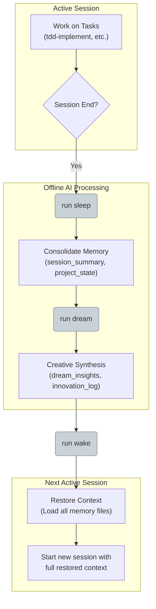

# AI Operational Cycle: Sleep, Dream, and Wake

**Purpose**: To document the autonomous, offline processing cycle used by the AI to consolidate learning, generate innovative solutions, and prepare for subsequent work sessions.

---

## Cycle Overview

The `sleep -> dream -> wake` cycle is a structured workflow that allows the AI to perform deep analysis and creative synthesis between active user sessions. This process ensures that learnings are retained, project context is maintained, and novel insights are generated.

-   **`sleep`**: A session-end routine to consolidate and store the current state.
-   **`dream`**: An offline creative phase for exploring alternative solutions and identifying abstract patterns.
-   **`wake`**: A session-start routine to restore context and integrate new insights.

---

## Cycle Diagram

---

## 1. The `sleep` Phase: Session Consolidation

When a work session concludes, the `sleep` command is triggered to systematically save the project's state and the session's learnings.

-   **Objective**: To achieve perfect context retention.
-   **Process**:
    1.  **Summarize Session**: Creates a comprehensive summary (`session_summary.md`) covering key decisions, progress, and outstanding issues.
    2.  **Store Structured State**: Saves technical details like file status and metrics to `project_state.json`.
    3.  **Reflect on Learnings**: Documents lessons learned and potential improvements in `reflection.md`.
    4.  **Prioritize Next Steps**: Generates a clear, prioritized list of action items in `next_tasks.md`.

---

## 2. The `dream` Phase: Creative Synthesis

While "asleep," the `dream` phase uses the consolidated context to perform creative and exploratory processing that would be too time-consuming during an interactive session.

-   **Objective**: To generate novel solutions and architectural insights.
-   **Process**:
    1.  **Generate Novel Connections**: Explores unconventional links between project components and applies metaphors or external concepts to existing problems.
    2.  **Explore Alternatives**: Simulates "what-if" scenarios for architecture and implementation.
    3.  **Recognize Patterns**: Identifies reusable design patterns and abstracts common problems into general, efficient solutions.
    4.  **Document Innovation**: Saves generated insights into dedicated files like `dream_insights.md` and `innovation_log.json`.

---

## 3. The `wake` Phase: Context Restoration

At the beginning of a new session, the `wake` command restores the AI's operational context, integrating all information gathered during the previous `sleep` and `dream` phases.

-   **Objective**: To start the new session with full awareness and a clear action plan.
-   **Process**:
    1.  **Integrate Memory**: Loads and processes all memory files (`session_summary.md`, `project_state.json`, `reflection.md`, etc.) to rebuild a complete picture.
    2.  **Analyze Project Changes**: Scans the workspace for any file modifications that occurred while it was offline.
    3.  **Apply Learnings**: Integrates insights from the reflection and dream phases to adapt its working methods and suggest improved strategies.
    4.  **Initialize Session**: Generates a contextualized task list and project status summary, establishing a clear plan for the work ahead. 