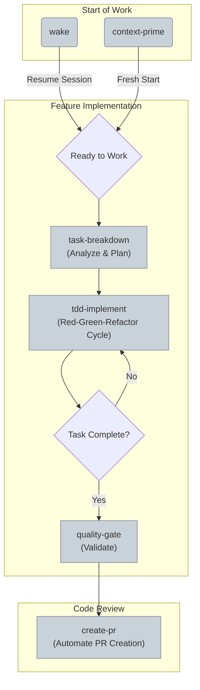

# Custom AI Commands Guide
**Version 1.1** | **Last Updated**: June 2025

---

## 🎯 **Overview**

This document provides a curated list of essential, high-value AI commands that codify our engineering principles and core workflows. These commands should be used to ensure consistency, quality, and efficiency. Redundant or overly specific commands have been deprecated.

---

## 🚀 **Workflow Initialization: `wake` vs. `context-prime`**

You have two ways to begin a work session. Choosing the right one is critical for efficiency.

-   **`wake`**: Use this to **resume** a previous, continuous train of thought. It loads the AI's structured memory from the last `sleep` cycle.
-   **`context-prime`**: Use this to **start fresh**. It performs a new analysis of the repository, ignoring previous memory. This is best for new tasks or after manual changes.

### Core Development Workflow

This diagram shows how both commands feed into our standard development process.

*For more detail on the `wake` command's context, see the [AI Operational Cycle guide](./AI_OPERATIONAL_CYCLE.md).*

---

## 🧰 **Command Reference**

### 1. `context-prime`
- **Purpose**: To initialize the AI's understanding of the project from a fresh slate by analyzing the current state of the repository.
- **Process**:
    - Scans the project structure, technology stack, and documentation.
    - Analyzes code standards and establishes collaboration parameters.
- **When to Use**: At the beginning of a new, standalone development session.

### 2. `task-breakdown "FEATURE_NAME"`
- **Purpose**: To analyze a high-level feature and break it down into small, manageable, vertical slices, aligning with our development methodology.
- **Process**:
    - Analyzes requirements and defines acceptance criteria.
    - Identifies logical components and maps their dependencies.
    - Creates specific, actionable tasks (1-3 days max).
- **When to Use**: Before starting implementation on any non-trivial feature.

### 3. `tdd-implement "TASK_DESCRIPTION"`
- **Purpose**: To implement a single, well-defined task using our non-negotiable Test-Driven Development (TDD) methodology.
- **Process**:
    - **Red**: Writes a failing test that defines the desired behavior.
    - **Green**: Implements the minimal code required to make the test pass.
    - **Refactor**: Improves the code's structure and clarity while keeping all tests green.
    - Repeats this cycle until the task is complete.
- **When to Use**: For all feature implementation and bug fixing. This is our cornerstone command.

---

## 🔍 **Analysis & Review Commands**

These commands are used to maintain quality and adherence to our architectural principles.

### `quality-gate`
- **Purpose**: To run a comprehensive suite of checks before work is considered complete or merged. It acts as a final validation step.
- **Process**:
    - Runs all automated tests (unit, integration).
    - Checks for code standards compliance (linting).
    - Verifies documentation and error handling coverage.
- **When to Use**: Before creating a pull request or at the end of a major work session.

### `architecture-review`
- **Purpose**: To perform a structured review of the codebase against our established clean architecture principles.
- **Process**:
    - Maps system components and dependencies to evaluate separation of concerns.
    - Assesses the use of design patterns and identifies anti-patterns.
    - Analyzes scalability and security.
- **When to Use**: Periodically, or when significant new components are added to the system.

### `code-analysis`
- **Purpose**: To perform a deep static analysis of the codebase, identify potential issues, and create actionable items.
- **Process**:
    - Identifies performance bottlenecks, security vulnerabilities, and test coverage gaps.
    - Can automatically generate GitHub issues for high-priority findings.
- **When to Use**: As a precursor to a major refactoring effort or sprint planning session.

---

## 🛠️ **Workflow & Debugging Commands**

### `create-pr`
- **Purpose**: To automate the creation of a pull request, ensuring it adheres to our standards.
- **Process**:
    - Runs the `quality-gate` checks.
    - Populates the PR template with a structured summary, linking to the relevant issue.
    - Adds a human review checklist to the PR.
- **When to Use**: When a feature is complete and ready for code review.

### `debug-issue "ISSUE_DESCRIPTION"`
- **Purpose**: To systematically diagnose and find the root cause of a bug or issue.
- **Process**:
    - Sets up a reproducible test case.
    - Performs root cause analysis by adding diagnostics and tracing execution flow.
    - Proposes an optimal solution after evaluating alternatives.
- **When to Use**: When starting work on a bug report. This command should be followed by `tdd-implement` to fix the issue. 