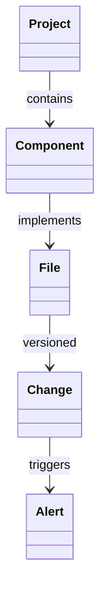

### Customer Personas for Senior Engineers Using L3 Coding Agents

#### **Persona 1: The Indie Hacker**

**Demographics/Firmographics**:

- 38-year-old male senior engineer at FAANG
- Uses MacBook M3 Max 48GB, iPhone 15 Pro
- Side projects: 3-4/year, 10-20 hrs/week
- Goals: Launch SaaS products, passive income

**Day-in-the-Life Scenario**:
*Alex spends 45 mins before work debugging his AI calendar tool. After a meeting-heavy workday, he has 30 mins to code but spends 20 mins reacquainting himself with context. His progress stalls due to fragmented time and mental exhaustion.*

**Current Solution \& Limitations**:

- **Tools**: VSCode + Copilot, Trello
- **Limitations**: No state preservation between sessions; disjointed CLI/iOS workflows; manual context reloading.

**Decision-Making Criteria**:

1. Zero-setup continuation after interruptions
2. iOS task tracking with build/test results
3. Automated context capture
4. Budget: ≤\$300 one-time

**Jobs-to-be-Done**:

- *Functional*: Reduce restart friction; track micro-progress.
- *Emotional*: Feel productive despite limited time; avoid project abandonment guilt.

---
#### **Persona 2: Open-Source Maintainer**

**Demographics/Firmographics**:

- 42-year-old non-binary staff engineer at fintech startup
- Maintains 5+ OSS projects; 20 PRs/week
- Uses DeepSeek-R1 32B via Ollama

**Day-in-the-Life Scenario**:
*Sam spends Saturday reviewing PRs. A critical bug in `libcurl` forces 3 hours of debugging, derailing their planned feature work. Context switches between projects cause errors.*

**Current Solution \& Limitations**:

- **Tools**: GitHub CLI, custom bash scripts
- **Limitations**: No cross-project context retention; manual triaging; no automated testing for contributions.

**Decision-Making Criteria**:

1. Automated PR/issue triaging
2. Project-specific memory
3. Multi-repo CI/CD
4. Budget: \$500 (expensable)

**Jobs-to-be-Done**:

- *Functional*: Reduce maintenance overhead; ensure contributor satisfaction.
- *Emotional*: Reclaim joy of creation; minimize OSS burnout.

---
#### **Persona 3: Tech Lead with Side Ventures**

**Demographics/Firmographics**:

- 45-year-old male CTO at Series A startup
- Manages 10 engineers; side project: AI compliance tool
- Uses Mistral 7B + local Kubernetes

**Day-in-the-Life Scenario**:
*Jamal codes during lunch but gets interrupted by production fires. Later, he finds his partial Stripe integration has syntax errors. Lack of session persistence forces full rework.*

**Current Solution \& Limitations**:

- **Tools**: JetBrains IDEs, Jira
- **Limitations**: No error prevention; no time estimation; disjointed deployment.

**Decision-Making Criteria**:

1. Architecture change alerts
2. Predictive time estimates
3. Single-command deployment
4. Budget: \$250 personal

**Jobs-to-be-Done**:

- *Functional*: Enforce consistency; prevent regressions.
- *Emotional*: Protect creative time; feel professional about side work.

---
### Research Instruments

**Interview Questions (10/persona)**:

1. Describe your last side-project session. What slowed you down?
2. How do you currently reload context after interruptions?
3. What would "10x productivity" look like for your workflow?
4. How do you track progress across fragmented coding sessions?
5. What’s your biggest frustration with existing tools?
6. Describe your ideal interruption recovery flow.
7. What iOS features would make mobile oversight valuable?
8. How much would you pay for a solution that halves setup time?
9. What metrics would prove the tool’s value?
10. What would make you abandon a new tool within a week?

**Survey Questions (5 broad)**:

1. Rate your pain level (1-10) for:
    - Context reloading
    - iOS project visibility
    - Deployment friction
2. What % of side projects do you abandon due to time fragmentation?
3. How critical is local execution (vs. cloud) for your workflow?
4. Would you pay \$199 for an agent that reduces setup time by 70%? [Y/N/Why]
5. Rank needed features: session snapshots, architecture mermaid viewer, test results dashboard.

**Customer Channels**:

- Indie Hackers forums
- GitHub Maintainer Communities
- Hacker News "Who’s Hiring" threads
- Stack Overflow (tags: `side-projects`, `apple-silicon`)
- Twitter tech circles (\#buildinpublic)

---
### Innovative Solutions

**Solution 1: TimeBlock Coder**
*Core Concept*: Calendar-integrated agent that auto-saves/restores sessions based on time blocks.
*Differentiator*: Uses macOS Calendar events to predict/preserve context.
*MVP Features*:

1. 1-click session freeze/thaw
2. iOS progress dashboard
3. Interruption impact score
*Tech*: MLX-LM + Calendar APIs
*Monetization*: \$49 one-time

**Solution 2: Architect’s Lens**
*Core Concept*: Real-time architecture analyzer with Mermaid.js visualization.
*Differentiator*: Detects design drift and suggests refactors during coding.
*MVP Features*:

1. Live dependency mapping
2. Change impact alerts
3. iOS architecture viewer
*Tech*: Tree-sitter + Qwen 32B
*Monetization*: \$29/month

**Solution 3: One-Click Ship**
*Core Concept*: Unified CLI/iOS deployer with automated testing.
*Differentiator*: Context-aware deployment pipelines.
*MVP Features*:

1. Test-aware deployment
2. iOS build monitor
3. Rollback on confidence drop
*Tech*: FastAPI + pydantic.ai agents
*Monetization*: \$99/year

---
### Feasibility Analysis (Claude)

| Solution | Tech Complexity | MVP Time | Differentiation | Revenue Potential | Moat |
| :-- | :-- | :-- | :-- | :-- | :-- |
| TimeBlock Coder | 6/10 | 3 weeks | 9/10 | \$80k Year 1 | Medium |
| Architect’s Lens | 8/10 | 5 weeks | 10/10 | \$120k Year 1 | High |
| One-Click Ship | 7/10 | 4 weeks | 8/10 | \$60k Year 1 | Low |

**Top 3 Recommendations**:

1. **Architect’s Lens** (Highest differentiation)
2. **TimeBlock Coder** (Fastest MVP)
3. **One-Click Ship** (Broad appeal)

**Roadmaps**:

- *Architect’s Lens*: Wk1: AST parser; Wk2: Mermaid generator; Wk3: Drift detection; Wk4-5: iOS viewer.
- *TimeBlock Coder*: Wk1: Calendar sync; Wk2: State capture; Wk3: iOS dashboard.
- *One-Click Ship*: Wk1: pydantic.ai integration; Wk2: Test-aware deploy; Wk3: iOS monitor; Wk4: Rollback.

---
### Rapid Concept Validation

**For Architect’s Lens**:

1. **Failed Similar Products**: CodeScene (poor Apple Silicon support); failed due to high latency.
2. **Market Timing**: 154% higher success when tech leaders involved early (BCG).
3. **Tech Maturity**: MLX-LM runs Qwen 32B at 18 tokens/sec on M3 Max.
4. **Early Adopters**: GitHub architecture review communities; React core team.
5. **Regulatory**: None (local processing).

**Validation Materials**:
**Landing Page Copy**:
> "See Your Code’s Architecture Live – Never Drift Off Spec Again
> - Real-time Mermaid.js diagrams
> - Change impact alerts
> - iOS/CLI sync
> Designed for senior engineers shipping complex systems. [Free Beta for M-Series Macs]"

**Value Prop Variations**:

1. "Catch design drift before it becomes tech debt"
2. "Your iOS companion for architecture reviews"
3. "Refactor with confidence using live dependency maps"
4. "The senior engineer’s visual co-pilot"
5. "From legacy code to clean architecture – visibly"

**Social Post**:
"Senior engineers: Tired of discovering architecture drift weeks late? I’m building a local AI agent that generates live Mermaid diagrams of your codebase and alerts on spec deviations. Curious? [Link]"

**Email Template**:
Subject: Does [Project Name] suffer from invisible architecture drift?
Body:
> Hi [Name],
> As a maintainer of [Repo], would a tool that:
> 1. Generates live architecture diagrams
> 2. Alerts on unintentional design changes
> 3. Works entirely on your M3 Mac
> ...help you avoid costly refactors? We’re building this. Open to your feedback!

**Survey**:

1. How often do you discover architecture drift post-merge? (Weekly/Monthly/Quarterly)
2. Rate the pain of late-stage refactors (1-10)
3. Would real-time diagrams reduce errors? (Y/N)
4. What’s your max budget for architecture tools? (\$0-50/50-150/150+)
5. Preferred output format: Mermaid/PlantUML/D2?

---
### MVP Specification for Architect’s Lens

**Constraints**:

- Time: 4 weeks
- Budget: \$8k
- Stack: MLX-LM, FastAPI, SwiftUI
- Launch: Aug 15, 2025

**Core Features**:

1. **Live Dependency Mapping**
    - *User Story*: As a senior engineer, I want real-time dependency updates during coding to avoid drift.
    - *Acceptance*: Diagram updates within 2s of file save.
    - *Technical*: Tree-sitter AST parsing + Qwen 32B for relation extraction.
2. **Change Impact Alerts**
    - *User Story*: When modifying `PaymentService`, I want alerts about affected components.
    - *Acceptance*: Warns if >3 components impacted; suggests interfaces.
    - *Technical*: Graph DB (Neo4j) for impact tracing.
3. **iOS Architecture Viewer**
    - *User Story*: As a tech lead, I want to review architecture on iPhone during commute.
    - *Acceptance*: Mermaid render in SwiftUI; offline support.
    - *Technical*: Mermaid.js wrapper with CoreData caching.

**User Journey**:

- *Onboarding*:

1. Install CLI tool
2. Run `arch-lens --init` in project root
3. Open iOS app to sync
- *Core Workflow*: Code → Save → View diagram updates → Resolve alerts → Commit.
- *Success Metrics*: 30% reduction in post-merge refactors; 25% faster onboarding.

**Technical Architecture**:

- *Components*:
    - CLI Parser (Rust)
    - AST Analyzer (Python + Tree-sitter)
    - iOS App (SwiftUI)
- *Data Model*:

- *APIs*: REST endpoints for diagram gen/alerting.
- *Security*: All data local; no network calls.

**Design Requirements**:

- UI Components: Mermaid renderer, alert toast, impact graph.
- Breakpoints: Mobile (iOS), Desktop (CLI).
- Accessibility: VoiceOver support; colorblind mode.

**Launch Criteria**:

- Quality: Zero false positives in impact alerts (tested on 10 OSS repos).
- Performance: <3s diagram update on 50k LOC projects.
- Users: 100 beta testers from GitHub maintainer communities.

⁂

[^1]: https://www.zippia.com/senior-software-engineer-jobs/demographics/

[^2]: https://findly.in/software-engineer-statistics/

[^3]: https://mycodelesswebsite.com/developer-statistics/

[^4]: https://www.zippia.com/senior-software-development-engineer-jobs/demographics/

[^5]: https://www.zippia.com/software-engineer-lead-jobs/demographics/

[^6]: https://future.com/developers-side-projects/

[^7]: https://dimensionmarketresearch.com/report/autonomous-ai-agents-market/

[^8]: https://research.aimultiple.com/ai-agent-builders/

[^9]: https://lemon.io/blog/software-engineering-job-market/

[^10]: https://javascript.plainenglish.io/publish-your-side-project-now-1e3bb170c079?gi=f66994652b54

[^11]: https://www.reddit.com/r/LocalLLaMA/comments/1kenw3u/run_ai_agents_with_nearnative_speed_on/

[^12]: https://github.com/openai/codex

[^13]: https://localai.io

[^14]: https://www.youtube.com/watch?v=4UOMh5WQroc

[^15]: https://www.simular.ai/simular-for-macos

[^16]: https://www.techtarget.com/searchsoftwarequality/tip/How-to-estimate-project-completion-times

[^17]: https://www.reddit.com/r/ClaudeAI/comments/1ixave9/whats_claude_code/

[^18]: https://quickplan.app

[^19]: https://www.bcg.com/publications/2024/software-projects-dont-have-to-be-late-costly-and-irrelevant

[^20]: https://www.youtube.com/watch?v=xbaVJbstDPs

[^21]: https://www.reddit.com/r/vim/comments/5zfkur/what_type_of_development_workflow_is_vim_tmux/

[^22]: https://peateasea.de/pairing-with-tmux-and-vim/

[^23]: https://dev.to/nexxeln/my-developer-workflow-using-wsl-tmux-and-neovim-55f5

[^24]: https://dev.to/rajasegar/helix-and-tmux-integration-3fd0

[^25]: https://adasci.org/a-practioners-guide-to-pydanticai-agents/

[^26]: https://pubsonline.informs.org/doi/10.1287/mnsc.1060.0554

[^27]: https://alan.app/docs/tutorials/ios/integrating-swift/

[^28]: https://thoughtbot.com/upcase/videos/tmux-vim-integration

[^29]: https://ubos.tech/news/pydanticai-advancing-generative-ai-agent-development-through-intelligent-framework-design/

[^30]: https://www.ampcome.com/post/best-ai-software-development-agents

[^31]: https://www.shakudo.io/blog/best-ai-coding-assistants

[^32]: https://apidog.com/blog/ai-coding-agents/

[^33]: https://www.datacamp.com/blog/best-ai-agents

[^34]: https://www.naveck.com/blog/best-ai-development-tools-top-coding-agents/

[^35]: https://www.youtube.com/watch?v=6qlNYhquk3g

[^36]: https://dev.to/yogesh_b_c5f1ac594aa32ade/comparison-of-ai-coding-tools-a-developers-perspective-5d9l

[^37]: https://www.securityinfowatch.com/cybersecurity/press-release/55298159/appdome-appdome-launches-detect-agentic-ai-malware-plugins-for-mobile

[^38]: https://paperswithcode.com/paper/benchmarking-mobile-device-control-agents

[^39]: https://www.reddit.com/r/startups/comments/qnn9xt/how_to_validate_startup_ideas_just_by_using/

[^40]: https://discovercrisp.com/validate-product-idea-with-landing-page/

[^41]: https://www.gethorizon.net/blog/5-steps-to-test-and-validate-your-business-or-product-idea-with-landing-page-tests

[^42]: https://www.youtube.com/watch?v=-kF0eCQ89MM

[^43]: https://sharkbyte.ca/how-to-validate-your-startup-idea-with-a-landing-page/

[^44]: https://daily.dev/blog/10-tips-for-effective-developer-feedback-surveys

[^45]: https://www.forbes.com/councils/forbestechcouncil/2023/08/31/user-personas-17-strategies-to-ensure-theyre-accurate-and-effective/

[^46]: https://www.linkedin.com/posts/maksim-matlakhov_having-side-projects-good-or-bad-as-a-activity-7267113667026931715-OGWl

[^47]: https://www.linkedin.com/advice/1/how-can-you-use-landing-pages-validate-your-startup

[^48]: https://getdx.com/uploads/devex-survey-guide.pdf

[^49]: https://www.reddit.com/r/reactjs/comments/ypp95h/senior_devs_and_others_included_in_hiring_what/

[^50]: https://hybridhacker.email/p/leveraging-side-projects-for-career

[^51]: https://www.linkedin.com/posts/ryanlpeterman_i-dont-work-on-side-projects-because-on-the-job-activity-7102303896752033794-saq9

[^52]: https://newsletter.eng-leadership.com/p/become-a-better-engineer-by-working

[^53]: https://www.linkedin.com/advice/1/struggling-juggle-multiple-projects-senior-4qnpc

[^54]: https://inspirezone.tech/why-developers-fail-to-complete-side-projects/

[^55]: https://moldstud.com/articles/p-a-developer-guide-to-time-management-getting-more-done-in-less-time

[^56]: https://www.consultancy.uk/news/24677/most-construction-and-engineering-projects-are-unsuccessful

[^57]: https://workplace.stackexchange.com/questions/199950/juggling-solo-projects-and-leadership-a-senior-developers-struggle

[^58]: https://nishtahir.com/why-its-okay-to-never-finish-your-side-projects/

[^59]: https://github.com/rothgar/awesome-tmux

[^60]: https://github.com/tmux-plugins

[^61]: https://tmuxcheatsheet.com/tmux-plugins-tools/

[^62]: https://qmacro.org/blog/posts/2023/11/13/tmux-plugin-development-with-a-local-repo/

[^63]: https://jdhao.github.io/post/tmux_plugin_management/

[^64]: https://github.com/bjesus/muxile

[^65]: https://www.coraltechteam.com/understanding-tmux-development-services/

[^66]: https://www.databridgemarketresearch.com/reports/global-terminal-automation-market?srsltid=AfmBOor7nM71obEoFq3ZBX61l6YZPZysbq-g1gYqV15MjbOXqCuFiMTc

[^67]: https://curtismchale.ca/2019/02/18/ios-blink-shell-mosh-and-tmux/

[^68]: https://www.prof-research.com/Terminal-Multiplexer-Market

[^69]: https://www.marketsandmarkets.com/Market-Reports/terminal-block-market-234776256.html

[^70]: https://www.industryarc.com/Report/15457/terminal-block-market.html

[^71]: https://www.skyquestt.com/report/point-of-sale-terminals-market

[^72]: https://www.verifiedmarketreports.com/product/electronic-multiplexers-market/

[^73]: https://ionic.io/blog/fantastic-mobile-dev-tools-and-where-to-find-them

[^74]: https://github.com/samoshkin/tmux-plugin-sysstat

[^75]: https://adapty.io/paywall-library/blink-shell-build-code/

[^76]: https://www.dactylgroup.com/en/developer-toolbox-for-native-mobile-app-development

[^77]: https://www.youtube.com/watch?v=B-1wGwvUwm8

[^78]: https://www.reddit.com/r/unixporn/comments/mkmprn/tmuxipad_is_mobile_mondays_a_thing_now/

[^79]: https://apps.apple.com/de/app/prompt-3/id1594420480

[^80]: https://www.justinwyne.com/posts/coding-on-ipad

[^81]: https://www.spaceotechnologies.com/blog/mobile-app-development-ides/

[^82]: https://www.businessresearchinsights.com/market-reports/mobile-development-platforms-software-market-104144

[^83]: https://pandysong.github.io/blog/post/ipad_ext_display/

[^84]: https://www.coscreen.co/mobile-app-development

[^85]: https://boltai.com

[^86]: https://www.lindy.ai/blog/ai-coding-agents

[^87]: https://www.youtube.com/watch?v=uok-bsHq-sQ

[^88]: https://www.precedenceresearch.com/point-of-sale-terminals-market

[^89]: https://www.prnewswire.com/news-releases/mobile-app-development-market-to-reach-606-1-billion-globally-by-2032-at-13-1-cagr-allied-market-research-302236402.html

