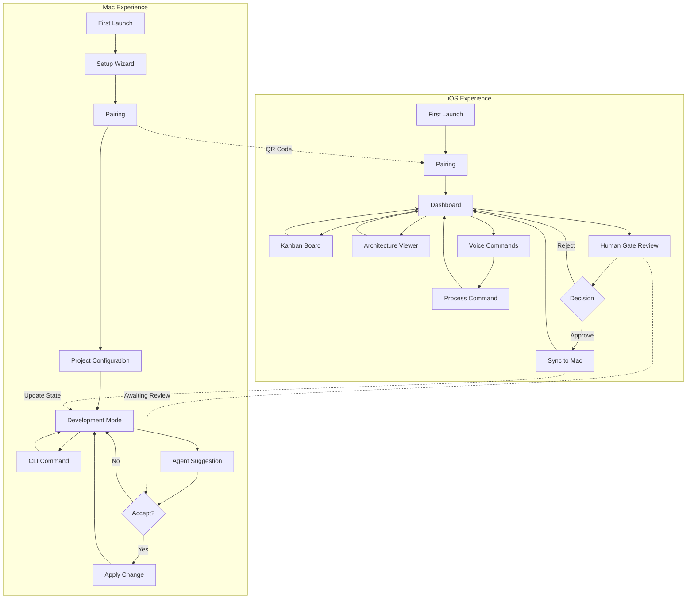
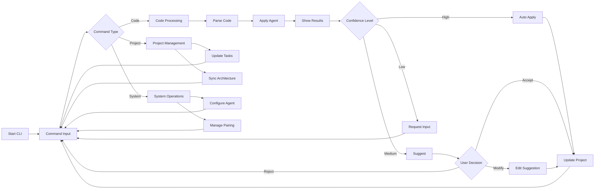
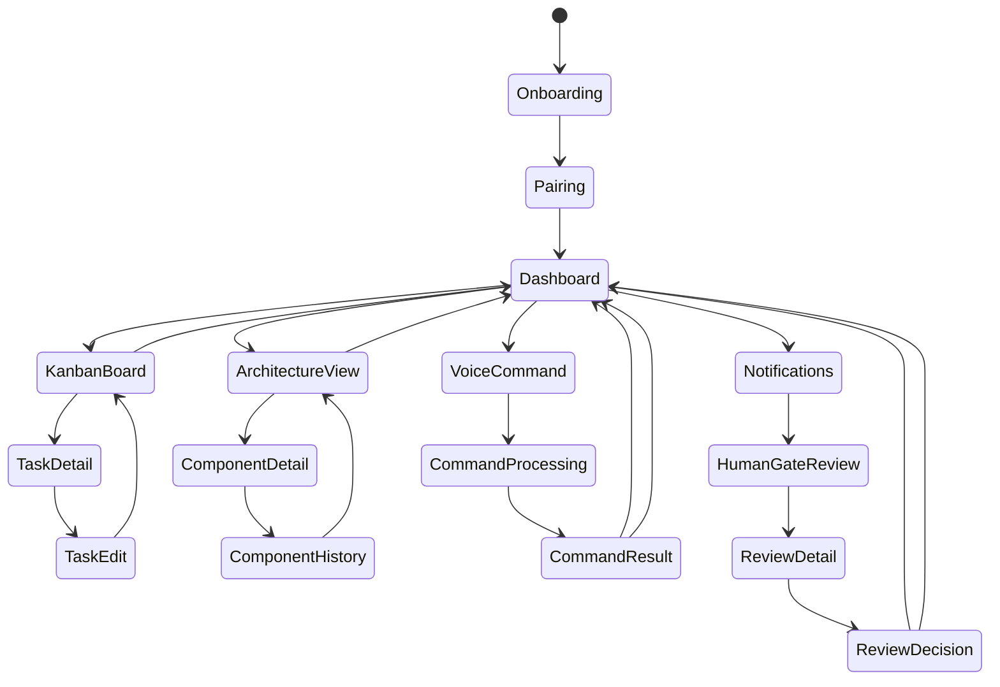
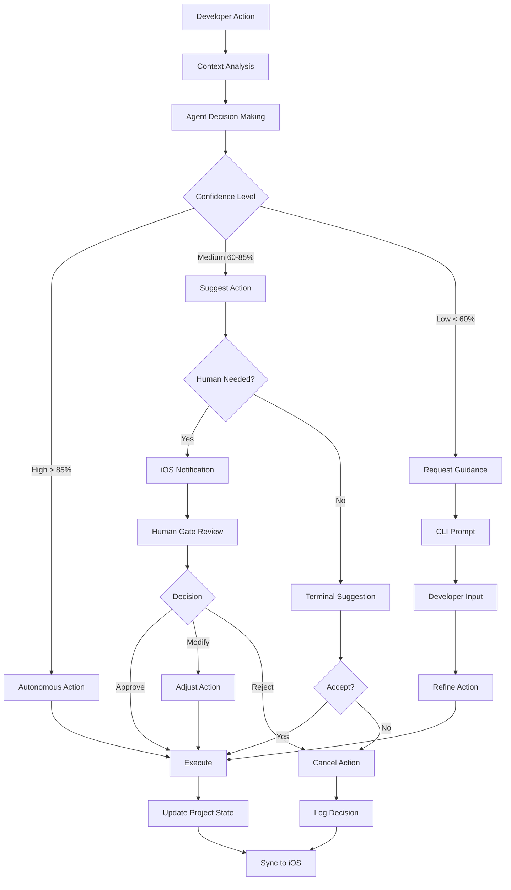

# LeenVibe UI/UX Design: A First Principles Approach

## 1. Identifying Fundamental Truths

When designing LeenVibe's interface, we must start by identifying the most basic truths about our users, their context, and their needs[^1][^2]:

### User Truths

- Senior engineers value efficiency and keyboard-driven workflows[^3][^4]
- They prefer minimal context switching and appreciate spatial memory[^5][^6]
- They need privacy and control over their data[^7][^8]

### Technical Truths

- Apple Silicon (M3 Max with 48GB RAM) enables complex local processing[^9][^10]
- Terminal interfaces prioritize text density and immediate feedback[^11][^12]
- iOS Liquid Glass design language enables depth, translucency, and layering[^7][^8]

### Cognitive Truths

- Human attention is finite and easily disrupted during coding[^5][^6]
- Visual processing is faster than textual for status comprehension[^13][^8]
- Trust in AI suggestions correlates with transparency of confidence metrics[^14][^10]

LeenVibe UI Design System - Mac Terminal (top) and iOS Liquid Glass (bottom) interfaces showing the cohesive design language across platforms

## 2. Questioning Assumptions

Before proceeding, we must challenge conventional wisdom about coding interfaces[^1][^2][^5]:

### Challenged Assumptions

- **Assumption:** "More visual detail improves user experience"
    - **Reality:** For code-focused work, visual minimalism reduces cognitive load[^6][^8]
- **Assumption:** "Mobile and desktop experiences should be identical"
    - **Reality:** Each platform should optimize for its natural interaction model[^12][^15]
- **Assumption:** "AI agents should mimic human collaborators"
    - **Reality:** AI should complement, not replace, human problem-solving patterns[^14][^10]
- **Assumption:** "Glass/translucency always enhances design"
    - **Reality:** Translucency works for contextual elements but hinders readability of primary content[^7][^8]

## 3. Deconstructing Essential Components

Breaking down the interface into atomic components reveals the true design challenges[^5][^13]:

### Terminal Interface Components

- **Command Input:** Must be immediate, predictable, and context-aware[^4][^11]
- **Code Display:** Must prioritize readability with syntax highlighting and clear boundaries[^11][^10]
- **Agent Feedback:** Must be unobtrusive yet accessible, with clear confidence indicators[^14][^4]
- **Status Information:** Must be glanceable without disrupting flow[^8][^11]

### iOS Interface Components

- **Project Overview:** Must communicate critical status efficiently[^12][^15]
- **Kanban Interface:** Must enable quick task reorganization with minimal friction[^16][^12]
- **Architecture Visualization:** Must render complex structures clearly on small screens[^16][^15]
- **Voice Input:** Must provide clear feedback on recognition and confidence[^12][^15]
- **Human Gate Reviews:** Must present sufficient context for informed decisions[^16][^15]

## 4. Building from First Principles

Using these fundamental components, we can design interfaces that truly serve our users' needs[^1][^2][^13]:

### Terminal Design Philosophy

- **Fundamental Principle:** Information density without cognitive overload[^4][^11]
    - Implement: Solid backgrounds for code areas; Liquid Glass effects only for peripheral elements[^7][^8]
    - Implement: Color-coding only for actionable insights (suggestions, errors, confirmations)[^11][^10]
    - Implement: Animation limited to progress indicators and notifications[^8][^4]

### iOS Design Philosophy

- **Fundamental Principle:** Glanceability with rich context on demand[^12][^15]
    - Implement: Liquid Glass for panels and cards; solid backgrounds for text and critical data[^7][^8]
    - Implement: Haptic feedback paired with visual changes for important notifications[^12][^15]
    - Implement: Layered information architecture with progressive disclosure[^7][^15]

### Cross-Platform Integration

- **Fundamental Principle:** Unified mental model across devices[^7][^8]
    - Implement: Consistent color coding for confidence levels and status indicators[^8][^12]
    - Implement: Synchronous state representation with clear ownership indicators[^7][^15]
    - Implement: Seamless handoff between platforms without data loss[^16][^12]

## 5. Screen Flow Architecture

The complete user journey must be coherent across platforms while respecting each context's strengths[^17][^16]:

### Mac-iOS Integration Flow

### Detailed Mac CLI Flow

### iOS User Journey

### L3 Agent Decision Flow

## 6. Verifying Against First Principles

To validate our design decisions, we must evaluate them against our identified fundamental truths[^1][^2][^5]:

### Verification Questions

1. **Does it minimize cognitive load?** Yes - Terminal uses solid backgrounds for code; iOS uses Liquid Glass only for contextual elements[^7][^8]
2. **Does it respect platform-specific interaction models?** Yes - Terminal is keyboard-optimized; iOS is touch/voice-optimized[^11][^12]
3. **Does it provide appropriate confidence indicators?** Yes - Consistent color-coding and clear visibility of agent confidence levels[^14][^10]
4. **Does it maintain privacy?** Yes - All processing runs locally; visual cues reinforce this security model[^7][^9]
5. **Does it enable efficient task switching?** Yes - Both platforms preserve context and provide clear status indicators[^16][^12]

## 7. Implementation Guidelines

The final design system provides clear guidelines for development[^1][^13][^8]:

### Terminal Implementation

- Background: Solid Jet Black (\#0D1117) for all code areas[^11]
- Text: SF Mono with precise syntax highlighting[^11]
- Accents: Neon Blue (\#0A84FF) for progress; Success Green (\#32D74B) for confirmation; Error Red (\#FF453A) for errors[^8]
- Liquid Glass: Reserved only for non-code UI elements like status bars and modals[^7][^8]

### iOS Implementation

- Background: Liquid Glass panels with appropriate depth and translucency[^7][^12]
- Cards: Floating glass panels with subtle drop shadows for hierarchy[^7][^8]
- Text: Always on solid, high-contrast backgrounds for readability[^12][^15]
- Touch Targets: Minimum 44px size with clear hit states[^12][^15]
- Voice UI: Glass sheet rising from bottom with solid transcript overlay[^7][^12]

## 8. Conclusion

By designing from first principles rather than conventions, LeenVibe's interface achieves the perfect balance between powerful functionality and intuitive usability[^1][^2][^13]. The unified design language across terminal and mobile creates a seamless experience that respects each platform's strengths while maintaining a consistent mental model[^7][^8][^12]. This approach ensures that senior engineers can leverage the full power of their local Apple Silicon hardware while enjoying the flexibility of mobile monitoring and control[^4][^9][^10].

⁂

[^1]: https://www.uxpin.com/studio/blog/ux-design-principles/

[^2]: https://www.nngroup.com/articles/ux-reset-2025/

[^3]: https://www.qodo.ai/blog/best-ai-coding-assistant-tools/

[^4]: https://www.shakudo.io/blog/best-ai-coding-assistants

[^5]: https://uxplanet.org/7-concepts-every-ui-ux-designer-should-know-in-2025-accea5d71b06

[^6]: https://www.designstudiouiux.com/blog/top-ux-design-principles/

[^7]: https://nerdschalk.com/apple-introduces-liquid-glass-design-language-at-wwdc-2025/

[^8]: https://screenroot.com/blog/ui-ux-principles/

[^9]: https://blog.google/technology/developers/google-ai-developer-updates-io-2025/

[^10]: https://dev.to/soumyadeepdey/the-rise-of-ai-powered-code-assistants-in-2025-revolutionizing-development-4kgb

[^11]: https://www.builder.io/blog/best-ai-code-editors

[^12]: https://www.gearbrain.com/uiux-design-principles-trends-2025-2671177589.html

[^13]: https://cpluz.com/blog/top-7-ui-ux-design-principles-for-a-winning-website-in-2025/

[^14]: https://blog.dailydoseofds.com/p/5-agentic-ai-design-patterns

[^15]: https://sjinnovation.com/best-UI-practices-for-IOS-app-design-success

[^16]: https://www.softwareideas.net/wireframing-screen-flow-diagram

[^17]: https://friendlyuser.github.io/posts/tech/2024/mermaid_diagram_creation/

[^18]: https://mermaid.js.org/syntax/sequenceDiagram.html

[^19]: https://www.flowmapp.com/features/user-flow-map-15-tips-for-best-ux-design

[^20]: https://blog.stackademic.com/10-ai-tools-i-tried-in-2025-that-actually-made-me-worse-at-programming-8f8acb70053d

