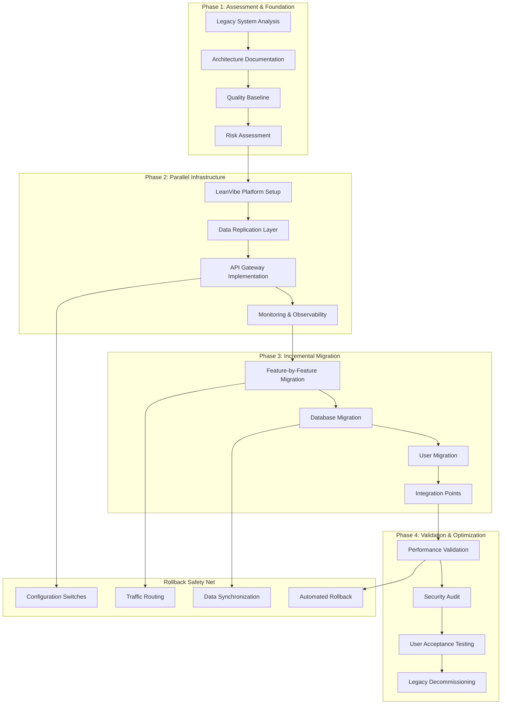

# Brownfield Migration Guide - Legacy System Modernization with LeanVibe XP

**Status**: Strategic Migration Framework  
**Target**: Existing Enterprise Applications  
**Timeline**: 6-12 months for complete migration  
**Risk Level**: MEDIUM (Structured approach with rollback capabilities)

## 🎯 Executive Summary

This guide provides a comprehensive framework for migrating existing legacy applications to the LeanVibe autonomous XP platform. The approach uses the Strangler Fig pattern for gradual migration, minimizing business disruption while modernizing architecture, improving quality, and establishing autonomous workflows.

### Key Migration Benefits
- **Risk Mitigation**: Gradual migration with rollback capabilities at each stage
- **Business Continuity**: Zero-downtime migration with parallel system operation
- **Quality Improvement**: Automated testing and quality ratchets prevent regression
- **Team Enablement**: Knowledge transfer and skill development throughout migration
- **Cost Optimization**: Reduced maintenance costs and improved development velocity

---

## 🏗️ Migration Architecture Strategy

### Strangler Fig Pattern Implementation



### Migration Phases Overview

| Phase | Duration | Risk Level | Success Criteria |
|-------|----------|------------|------------------|
| **Assessment & Foundation** | 2-4 weeks | LOW | Complete system documentation, quality baseline established |
| **Parallel Infrastructure** | 4-6 weeks | MEDIUM | New platform operational, monitoring active |
| **Incremental Migration** | 12-20 weeks | MEDIUM-HIGH | Features migrated with <5% performance regression |
| **Validation & Optimization** | 4-6 weeks | LOW | User acceptance >95%, legacy system decommissioned |

---

## 📊 Legacy System Assessment Framework

### Automated Technical Debt Analysis

```python
# Technical debt analyzer for legacy systems
import ast
import os
import subprocess
from dataclasses import dataclass
from typing import Dict, List, Optional
from pathlib import Path

@dataclass
class TechnicalDebtMetrics:
    complexity_score: float
    duplication_percentage: float
    test_coverage: float
    security_vulnerabilities: int
    outdated_dependencies: int
    code_smells: int
    maintainability_index: float

class LegacySystemAnalyzer:
    def __init__(self, project_path: str):
        self.project_path = Path(project_path)
        self.results = {}
    
    async def analyze_codebase(self) -> TechnicalDebtMetrics:
        """Comprehensive analysis of legacy codebase"""
        
        # Code complexity analysis
        complexity = await self.analyze_complexity()
        
        # Duplication detection
        duplication = await self.detect_duplication()
        
        # Test coverage assessment
        coverage = await self.analyze_test_coverage()
        
        # Security vulnerability scan
        security = await self.scan_security_vulnerabilities()
        
        # Dependency analysis
        dependencies = await self.analyze_dependencies()
        
        # Code smell detection
        code_smells = await self.detect_code_smells()
        
        # Maintainability calculation
        maintainability = await self.calculate_maintainability()
        
        return TechnicalDebtMetrics(
            complexity_score=complexity,
            duplication_percentage=duplication,
            test_coverage=coverage,
            security_vulnerabilities=security,
            outdated_dependencies=dependencies,
            code_smells=code_smells,
            maintainability_index=maintainability
        )
    
    async def analyze_complexity(self) -> float:
        """Calculate cyclomatic complexity across codebase"""
        total_complexity = 0
        file_count = 0
        
        for file_path in self.project_path.rglob("*.py"):
            try:
                with open(file_path, 'r', encoding='utf-8') as f:
                    tree = ast.parse(f.read())
                    complexity = self.calculate_cyclomatic_complexity(tree)
                    total_complexity += complexity
                    file_count += 1
            except Exception as e:
                print(f"Error analyzing {file_path}: {e}")
        
        return total_complexity / max(file_count, 1)
    
    def calculate_cyclomatic_complexity(self, tree: ast.AST) -> int:
        """Calculate cyclomatic complexity for AST"""
        complexity = 1  # Base complexity
        
        for node in ast.walk(tree):
            if isinstance(node, (ast.If, ast.While, ast.For, ast.AsyncFor)):
                complexity += 1
            elif isinstance(node, ast.BoolOp):
                complexity += len(node.values) - 1
            elif isinstance(node, (ast.ExceptHandler,)):
                complexity += 1
        
        return complexity
    
    async def detect_duplication(self) -> float:
        """Detect code duplication using hash comparison"""
        # Implementation using tools like PMD CPD or similar
        result = subprocess.run([
            "jscpd", "--min-lines", "10", "--format", "json", str(self.project_path)
        ], capture_output=True, text=True)
        
        if result.returncode == 0:
            import json
            data = json.loads(result.stdout)
            return data.get("statistics", {}).get("percentage", 0)
        
        return 0.0
    
    async def analyze_test_coverage(self) -> float:
        """Analyze existing test coverage"""
        try:
            result = subprocess.run([
                "coverage", "run", "-m", "pytest", "--quiet"
            ], cwd=self.project_path, capture_output=True)
            
            result = subprocess.run([
                "coverage", "report", "--format=json"
            ], cwd=self.project_path, capture_output=True, text=True)
            
            if result.returncode == 0:
                import json
                data = json.loads(result.stdout)
                return data.get("totals", {}).get("percent_covered", 0)
        except Exception:
            pass
        
        return 0.0
    
    async def generate_migration_plan(self, metrics: TechnicalDebtMetrics) -> Dict:
        """Generate prioritized migration plan based on analysis"""
        
        migration_priority = []
        
        # High-risk areas need immediate attention
        if metrics.security_vulnerabilities > 0:
            migration_priority.append({
                "priority": "CRITICAL",
                "area": "Security Vulnerabilities",
                "effort": "2-3 weeks",
                "description": f"{metrics.security_vulnerabilities} security issues found"
            })
        
        # Complex code needs careful migration
        if metrics.complexity_score > 10:
            migration_priority.append({
                "priority": "HIGH", 
                "area": "High Complexity Modules",
                "effort": "4-6 weeks",
                "description": f"Complexity score: {metrics.complexity_score:.1f}"
            })
        
        # Low test coverage increases migration risk
        if metrics.test_coverage < 70:
            migration_priority.append({
                "priority": "HIGH",
                "area": "Test Coverage Improvement", 
                "effort": "3-4 weeks",
                "description": f"Current coverage: {metrics.test_coverage:.1f}%"
            })
        
        # Duplicated code should be refactored first
        if metrics.duplication_percentage > 15:
            migration_priority.append({
                "priority": "MEDIUM",
                "area": "Code Deduplication",
                "effort": "2-3 weeks", 
                "description": f"Duplication: {metrics.duplication_percentage:.1f}%"
            })
        
        return {
            "total_effort_weeks": sum(self.extract_effort(item) for item in migration_priority),
            "critical_issues": len([i for i in migration_priority if i["priority"] == "CRITICAL"]),
            "migration_tasks": migration_priority,
            "recommended_approach": self.recommend_migration_strategy(metrics)
        }
    
    def recommend_migration_strategy(self, metrics: TechnicalDebtMetrics) -> str:
        """Recommend migration strategy based on system characteristics"""
        
        if metrics.security_vulnerabilities > 5 or metrics.maintainability_index < 20:
            return "BIG_BANG_REWRITE"  # System too risky for gradual migration
        elif metrics.complexity_score > 20 or metrics.test_coverage < 30:
            return "GRADUAL_WITH_EXTENSIVE_TESTING"  # Need extra testing during migration
        elif metrics.duplication_percentage > 30:
            return "REFACTOR_FIRST_THEN_MIGRATE"  # Clean up code before migration
        else:
            return "STANDARD_STRANGLER_FIG"  # Standard gradual migration
```

### Database Migration Assessment

```python
# Database schema analysis and migration planning
import sqlalchemy
from sqlalchemy import inspect
from typing import Dict, List, Tuple

class DatabaseMigrationAnalyzer:
    def __init__(self, legacy_db_url: str):
        self.legacy_engine = sqlalchemy.create_engine(legacy_db_url)
        self.inspector = inspect(self.legacy_engine)
    
    async def analyze_schema(self) -> Dict:
        """Analyze legacy database schema for migration planning"""
        
        analysis = {
            "tables": await self.analyze_tables(),
            "relationships": await self.analyze_relationships(), 
            "indexes": await self.analyze_indexes(),
            "constraints": await self.analyze_constraints(),
            "data_volume": await self.analyze_data_volume(),
            "migration_complexity": "MEDIUM"  # Will be calculated
        }
        
        # Calculate overall migration complexity
        analysis["migration_complexity"] = self.calculate_migration_complexity(analysis)
        
        return analysis
    
    async def analyze_tables(self) -> List[Dict]:
        """Analyze each table's characteristics"""
        tables = []
        
        for table_name in self.inspector.get_table_names():
            columns = self.inspector.get_columns(table_name)
            
            table_info = {
                "name": table_name,
                "column_count": len(columns),
                "primary_keys": self.inspector.get_pk_constraint(table_name),
                "foreign_keys": self.inspector.get_foreign_keys(table_name),
                "indexes": self.inspector.get_indexes(table_name),
                "migration_strategy": self.determine_table_migration_strategy(table_name, columns)
            }
            
            tables.append(table_info)
        
        return tables
    
    def determine_table_migration_strategy(self, table_name: str, columns: List) -> str:
        """Determine best migration strategy for each table"""
        
        # Look for audit columns or timestamps for incremental sync
        has_timestamp = any(col["name"].lower() in ["updated_at", "modified_date", "timestamp"] 
                           for col in columns)
        has_id = any(col["name"].lower() in ["id", "primary_key"] for col in columns)
        
        if has_timestamp and has_id:
            return "INCREMENTAL_SYNC"
        elif len(columns) > 50:
            return "BATCH_MIGRATION"  # Large tables need batch processing
        elif table_name.lower() in ["users", "accounts", "customers"]:
            return "CAREFUL_MIGRATION"  # Critical business data
        else:
            return "STANDARD_MIGRATION"
    
    async def generate_migration_scripts(self) -> Dict[str, str]:
        """Generate database migration scripts"""
        
        scripts = {}
        
        # Data replication setup
        scripts["setup_replication"] = f"""
-- Setup triggers for real-time data synchronization
CREATE OR REPLACE FUNCTION sync_to_new_system()
RETURNS TRIGGER AS $$
BEGIN
    -- Insert into replication queue
    INSERT INTO migration_sync_queue (table_name, record_id, operation, timestamp)
    VALUES (TG_TABLE_NAME, NEW.id, TG_OP, NOW());
    RETURN NEW;
END;
$$ LANGUAGE plpgsql;

-- Add triggers to all tables
{"".join([f"CREATE TRIGGER sync_{table}_trigger AFTER INSERT OR UPDATE OR DELETE ON {table} FOR EACH ROW EXECUTE FUNCTION sync_to_new_system();" for table in self.inspector.get_table_names()])}
"""
        
        # Data validation queries
        scripts["validation_queries"] = f"""
-- Data consistency validation queries
{chr(10).join([f"SELECT COUNT(*) as {table}_count FROM {table};" for table in self.inspector.get_table_names()])}

-- Referential integrity checks
{chr(10).join([self.generate_integrity_check(table) for table in self.inspector.get_table_names()])}
"""
        
        return scripts
    
    def generate_integrity_check(self, table_name: str) -> str:
        """Generate referential integrity check for a table"""
        foreign_keys = self.inspector.get_foreign_keys(table_name)
        
        checks = []
        for fk in foreign_keys:
            referenced_table = fk["referred_table"]
            local_columns = fk["constrained_columns"]
            referenced_columns = fk["referred_columns"]
            
            check = f"""
SELECT COUNT(*) as {table_name}_{referenced_table}_orphans
FROM {table_name} t1 
LEFT JOIN {referenced_table} t2 ON t1.{local_columns[0]} = t2.{referenced_columns[0]}
WHERE t2.{referenced_columns[0]} IS NULL AND t1.{local_columns[0]} IS NOT NULL;"""
            
            checks.append(check)
        
        return "\n".join(checks)
```

---

## 🔄 Gradual Migration Strategies

### Feature-by-Feature Migration Pattern

```python
# Feature migration orchestrator
from enum import Enum
from dataclasses import dataclass
from typing import Dict, List, Optional
import asyncio

class MigrationStatus(str, Enum):
    PLANNING = "planning"
    IN_PROGRESS = "in_progress" 
    TESTING = "testing"
    DEPLOYED = "deployed"
    VALIDATED = "validated"
    COMPLETE = "complete"
    ROLLED_BACK = "rolled_back"

@dataclass
class FeatureMigration:
    name: str
    description: str
    legacy_endpoints: List[str]
    new_endpoints: List[str]
    database_tables: List[str]
    dependencies: List[str]
    estimated_effort_hours: int
    risk_level: str  # LOW, MEDIUM, HIGH, CRITICAL
    status: MigrationStatus = MigrationStatus.PLANNING
    
class MigrationOrchestrator:
    def __init__(self, legacy_system_url: str, new_system_url: str):
        self.legacy_url = legacy_system_url
        self.new_url = new_system_url
        self.migrations: Dict[str, FeatureMigration] = {}
        self.traffic_router = TrafficRouter()
    
    async def plan_feature_migration(
        self, 
        feature_name: str,
        legacy_analysis: Dict
    ) -> FeatureMigration:
        """Plan migration for a specific feature"""
        
        # Analyze feature boundaries
        endpoints = await self.analyze_feature_endpoints(feature_name, legacy_analysis)
        tables = await self.analyze_feature_data(feature_name, legacy_analysis)
        dependencies = await self.analyze_dependencies(feature_name, legacy_analysis)
        
        # Estimate effort based on complexity
        effort = self.estimate_migration_effort(endpoints, tables, dependencies)
        
        # Assess risk level
        risk = self.assess_migration_risk(endpoints, tables, dependencies)
        
        migration = FeatureMigration(
            name=feature_name,
            description=f"Migration of {feature_name} from legacy system",
            legacy_endpoints=endpoints["legacy"],
            new_endpoints=endpoints["new"],
            database_tables=tables,
            dependencies=dependencies,
            estimated_effort_hours=effort,
            risk_level=risk
        )
        
        self.migrations[feature_name] = migration
        return migration
    
    async def execute_migration(self, feature_name: str) -> bool:
        """Execute migration for a specific feature"""
        
        migration = self.migrations[feature_name]
        migration.status = MigrationStatus.IN_PROGRESS
        
        try:
            # Step 1: Implement feature in new system
            await self.implement_feature_in_new_system(migration)
            
            # Step 2: Set up data synchronization
            await self.setup_data_sync(migration)
            
            # Step 3: Implement traffic routing
            await self.setup_traffic_routing(migration)
            
            # Step 4: Deploy with 0% traffic
            await self.deploy_new_feature(migration, traffic_percentage=0)
            
            # Step 5: Run validation tests
            migration.status = MigrationStatus.TESTING
            validation_passed = await self.validate_feature(migration)
            
            if not validation_passed:
                await self.rollback_migration(migration)
                return False
            
            # Step 6: Gradual traffic increase
            for traffic_percentage in [1, 5, 10, 25, 50, 100]:
                await self.adjust_traffic_routing(migration, traffic_percentage)
                await asyncio.sleep(300)  # Wait 5 minutes between increases
                
                # Monitor for issues
                health_check = await self.monitor_feature_health(migration)
                if not health_check.healthy:
                    await self.rollback_migration(migration)
                    return False
            
            # Step 7: Mark as complete
            migration.status = MigrationStatus.COMPLETE
            await self.cleanup_legacy_feature(migration)
            
            return True
            
        except Exception as e:
            await self.rollback_migration(migration)
            raise MigrationException(f"Migration failed for {feature_name}: {e}")
    
    async def setup_traffic_routing(self, migration: FeatureMigration):
        """Set up intelligent traffic routing between legacy and new systems"""
        
        routing_rules = []
        
        for endpoint in migration.legacy_endpoints:
            rule = {
                "path": endpoint,
                "legacy_url": f"{self.legacy_url}{endpoint}",
                "new_url": f"{self.new_url}{endpoint}",
                "traffic_percentage": 0,  # Start with 0% to new system
                "canary_rules": {
                    "user_percentage": 1,  # Route 1% of users to new system
                    "header_based": {"X-Migration-Test": "true"},  # Test users
                    "feature_flag": f"migrate_{migration.name.lower()}"
                }
            }
            routing_rules.append(rule)
        
        await self.traffic_router.configure_rules(routing_rules)
    
    async def validate_feature(self, migration: FeatureMigration) -> bool:
        """Comprehensive validation of migrated feature"""
        
        validations = []
        
        # Functional testing
        validations.append(await self.run_functional_tests(migration))
        
        # Performance testing
        validations.append(await self.run_performance_tests(migration))
        
        # Data consistency validation
        validations.append(await self.validate_data_consistency(migration))
        
        # Security testing
        validations.append(await self.run_security_tests(migration))
        
        # Integration testing
        validations.append(await self.run_integration_tests(migration))
        
        return all(validations)
    
    async def monitor_feature_health(self, migration: FeatureMigration) -> 'HealthStatus':
        """Monitor health metrics during gradual rollout"""
        
        metrics = await self.collect_feature_metrics(migration)
        
        health = HealthStatus(
            healthy=True,
            response_time=metrics.get("avg_response_time", 0),
            error_rate=metrics.get("error_rate", 0),
            throughput=metrics.get("requests_per_second", 0)
        )
        
        # Check against SLA thresholds
        if health.response_time > 2000:  # 2 second SLA
            health.healthy = False
            health.issues.append("Response time exceeds SLA")
        
        if health.error_rate > 0.05:  # 5% error rate threshold
            health.healthy = False
            health.issues.append("Error rate too high")
        
        # Compare with legacy system baseline
        legacy_metrics = await self.collect_legacy_metrics(migration)
        if health.response_time > legacy_metrics.get("avg_response_time", 0) * 1.2:
            health.healthy = False
            health.issues.append("Performance regression vs legacy")
        
        return health

@dataclass
class HealthStatus:
    healthy: bool
    response_time: float
    error_rate: float
    throughput: float
    issues: List[str] = None
    
    def __post_init__(self):
        if self.issues is None:
            self.issues = []
```

### API Gateway Migration Pattern

```python
# Intelligent API gateway for gradual migration
from fastapi import FastAPI, Request, HTTPException
from fastapi.responses import JSONResponse
import httpx
import random
from typing import Optional

class MigrationAPIGateway:
    def __init__(self):
        self.app = FastAPI(title="Migration API Gateway")
        self.legacy_client = httpx.AsyncClient()
        self.new_client = httpx.AsyncClient()
        self.routing_rules = {}
        self.feature_flags = {}
        
        self.setup_routes()
    
    def setup_routes(self):
        """Setup dynamic routing based on migration status"""
        
        @self.app.middleware("http")
        async def migration_routing_middleware(request: Request, call_next):
            path = request.url.path
            
            # Check if this endpoint is being migrated
            if path in self.routing_rules:
                return await self.route_request(request)
            
            # Default: pass through to legacy system
            return await self.proxy_to_legacy(request)
    
    async def route_request(self, request: Request) -> JSONResponse:
        """Intelligent request routing based on migration rules"""
        
        path = request.url.path
        rule = self.routing_rules[path]
        
        # Determine routing decision
        route_to_new = await self.should_route_to_new(request, rule)
        
        if route_to_new:
            try:
                # Route to new system
                response = await self.proxy_to_new(request)
                
                # Log success for monitoring
                await self.log_routing_decision(request, "new", "success", response.status_code)
                
                return response
                
            except Exception as e:
                # Fallback to legacy on error
                await self.log_routing_decision(request, "new", "error", str(e))
                return await self.proxy_to_legacy(request)
        else:
            # Route to legacy system
            response = await self.proxy_to_legacy(request)
            await self.log_routing_decision(request, "legacy", "success", response.status_code)
            return response
    
    async def should_route_to_new(self, request: Request, rule: Dict) -> bool:
        """Decision logic for routing requests"""
        
        # Check feature flag
        feature_flag = rule.get("feature_flag")
        if feature_flag and not self.feature_flags.get(feature_flag, False):
            return False
        
        # Check traffic percentage
        traffic_percentage = rule.get("traffic_percentage", 0)
        if random.randint(1, 100) > traffic_percentage:
            return False
        
        # Check header-based routing (for testing)
        header_rules = rule.get("header_based", {})
        for header, expected_value in header_rules.items():
            if request.headers.get(header) == expected_value:
                return True
        
        # Check user-based canary rollout
        user_percentage = rule.get("user_percentage", 0)
        user_id = request.headers.get("X-User-ID")
        if user_id:
            # Consistent user assignment using hash
            user_hash = hash(user_id) % 100
            if user_hash < user_percentage:
                return True
        
        # Default decision based on traffic percentage
        return random.randint(1, 100) <= traffic_percentage
    
    async def proxy_to_new(self, request: Request) -> JSONResponse:
        """Proxy request to new system"""
        
        url = f"{NEW_SYSTEM_URL}{request.url.path}"
        
        # Forward request
        response = await self.new_client.request(
            method=request.method,
            url=url,
            headers=dict(request.headers),
            content=await request.body(),
            params=dict(request.query_params)
        )
        
        return JSONResponse(
            content=response.json() if response.headers.get("content-type", "").startswith("application/json") else response.text,
            status_code=response.status_code,
            headers=dict(response.headers)
        )
    
    async def proxy_to_legacy(self, request: Request) -> JSONResponse:
        """Proxy request to legacy system"""
        
        url = f"{LEGACY_SYSTEM_URL}{request.url.path}"
        
        # Forward request
        response = await self.legacy_client.request(
            method=request.method,
            url=url,
            headers=dict(request.headers),
            content=await request.body(),
            params=dict(request.query_params)
        )
        
        return JSONResponse(
            content=response.json() if response.headers.get("content-type", "").startswith("application/json") else response.text,
            status_code=response.status_code,
            headers=dict(response.headers)
        )
    
    async def update_routing_rule(self, path: str, traffic_percentage: int):
        """Update traffic percentage for gradual rollout"""
        
        if path in self.routing_rules:
            self.routing_rules[path]["traffic_percentage"] = traffic_percentage
            
            # Log routing change
            await self.log_routing_change(path, traffic_percentage)
    
    async def log_routing_decision(self, request: Request, target: str, result: str, details: str):
        """Log routing decisions for monitoring and analysis"""
        
        log_entry = {
            "timestamp": datetime.utcnow(),
            "path": request.url.path,
            "method": request.method,
            "target_system": target,
            "result": result,
            "details": details,
            "user_agent": request.headers.get("user-agent", ""),
            "user_id": request.headers.get("X-User-ID", "")
        }
        
        # Send to monitoring system
        await self.send_to_monitoring(log_entry)
```

---

## 🔒 Risk Mitigation & Rollback Strategies

### Automated Rollback System

```python
# Comprehensive rollback system with automated triggers
from enum import Enum
from dataclasses import dataclass
from typing import List, Dict, Optional
import asyncio
import time

class RollbackTrigger(str, Enum):
    MANUAL = "manual"
    ERROR_RATE_THRESHOLD = "error_rate_threshold"
    RESPONSE_TIME_THRESHOLD = "response_time_threshold"
    USER_FEEDBACK = "user_feedback"
    BUSINESS_METRIC_DECLINE = "business_metric_decline"
    SECURITY_INCIDENT = "security_incident"

@dataclass
class RollbackConfiguration:
    feature_name: str
    error_rate_threshold: float = 0.05  # 5%
    response_time_threshold: int = 2000  # 2 seconds
    min_sample_size: int = 100  # Minimum requests before triggering
    monitoring_window_minutes: int = 5
    auto_rollback_enabled: bool = True
    notification_channels: List[str] = None

class AutomatedRollbackSystem:
    def __init__(self):
        self.rollback_configs: Dict[str, RollbackConfiguration] = {}
        self.monitoring_active = False
        self.rollback_history: List[Dict] = []
    
    async def start_monitoring(self, feature_name: str, config: RollbackConfiguration):
        """Start monitoring feature for rollback triggers"""
        
        self.rollback_configs[feature_name] = config
        
        if not self.monitoring_active:
            self.monitoring_active = True
            asyncio.create_task(self.monitoring_loop())
    
    async def monitoring_loop(self):
        """Continuous monitoring loop for all active migrations"""
        
        while self.monitoring_active:
            for feature_name, config in self.rollback_configs.items():
                try:
                    await self.check_rollback_triggers(feature_name, config)
                except Exception as e:
                    await self.log_monitoring_error(feature_name, e)
            
            await asyncio.sleep(30)  # Check every 30 seconds
    
    async def check_rollback_triggers(self, feature_name: str, config: RollbackConfiguration):
        """Check all rollback triggers for a feature"""
        
        # Collect metrics for the monitoring window
        metrics = await self.collect_feature_metrics(
            feature_name, 
            window_minutes=config.monitoring_window_minutes
        )
        
        # Skip if not enough data
        if metrics.get("request_count", 0) < config.min_sample_size:
            return
        
        rollback_reasons = []
        
        # Check error rate threshold
        error_rate = metrics.get("error_rate", 0)
        if error_rate > config.error_rate_threshold:
            rollback_reasons.append(f"Error rate {error_rate:.3f} exceeds threshold {config.error_rate_threshold:.3f}")
        
        # Check response time threshold
        avg_response_time = metrics.get("avg_response_time", 0)
        if avg_response_time > config.response_time_threshold:
            rollback_reasons.append(f"Response time {avg_response_time}ms exceeds threshold {config.response_time_threshold}ms")
        
        # Check for significant performance regression
        legacy_baseline = await self.get_legacy_baseline(feature_name)
        if legacy_baseline and avg_response_time > legacy_baseline["avg_response_time"] * 1.5:
            rollback_reasons.append(f"Performance regression: {avg_response_time}ms vs baseline {legacy_baseline['avg_response_time']}ms")
        
        # Check user feedback sentiment
        user_sentiment = await self.analyze_user_feedback(feature_name)
        if user_sentiment and user_sentiment.negative_ratio > 0.3:
            rollback_reasons.append(f"Negative user feedback: {user_sentiment.negative_ratio:.2f}")
        
        # Trigger rollback if any conditions are met
        if rollback_reasons and config.auto_rollback_enabled:
            await self.trigger_automatic_rollback(
                feature_name, 
                RollbackTrigger.ERROR_RATE_THRESHOLD,
                rollback_reasons
            )
    
    async def trigger_automatic_rollback(
        self, 
        feature_name: str, 
        trigger: RollbackTrigger,
        reasons: List[str]
    ):
        """Execute automatic rollback"""
        
        rollback_id = f"rollback_{feature_name}_{int(time.time())}"
        
        # Log rollback initiation
        rollback_record = {
            "rollback_id": rollback_id,
            "feature_name": feature_name,
            "trigger": trigger,
            "reasons": reasons,
            "initiated_at": datetime.utcnow(),
            "status": "in_progress"
        }
        
        self.rollback_history.append(rollback_record)
        
        try:
            # Step 1: Immediately route 100% traffic to legacy
            await self.route_traffic_to_legacy(feature_name)
            
            # Step 2: Disable feature flags
            await self.disable_feature_flags(feature_name)
            
            # Step 3: Stop data synchronization to prevent corruption
            await self.pause_data_sync(feature_name)
            
            # Step 4: Verify legacy system is handling traffic correctly
            await self.verify_legacy_system_health(feature_name)
            
            # Step 5: Send notifications
            await self.send_rollback_notifications(rollback_record)
            
            # Step 6: Generate rollback report
            await self.generate_rollback_report(rollback_record)
            
            rollback_record["status"] = "completed"
            rollback_record["completed_at"] = datetime.utcnow()
            
        except Exception as e:
            rollback_record["status"] = "failed"
            rollback_record["error"] = str(e)
            
            # This is critical - rollback failed!
            await self.send_critical_alert(rollback_record)
            
            raise RollbackException(f"Rollback failed for {feature_name}: {e}")
    
    async def manual_rollback(self, feature_name: str, reason: str, user_id: str):
        """Execute manual rollback with user context"""
        
        await self.trigger_automatic_rollback(
            feature_name,
            RollbackTrigger.MANUAL,
            [f"Manual rollback by {user_id}: {reason}"]
        )
    
    async def generate_rollback_report(self, rollback_record: Dict):
        """Generate detailed rollback analysis report"""
        
        feature_name = rollback_record["feature_name"]
        
        # Collect comprehensive metrics around rollback time
        metrics = await self.collect_extended_metrics(
            feature_name,
            start_time=rollback_record["initiated_at"] - timedelta(hours=1),
            end_time=rollback_record["initiated_at"] + timedelta(minutes=30)
        )
        
        report = {
            "rollback_summary": rollback_record,
            "performance_impact": {
                "before_rollback": metrics["before"],
                "after_rollback": metrics["after"],
                "improvement": {
                    "error_rate_reduction": metrics["before"]["error_rate"] - metrics["after"]["error_rate"],
                    "response_time_improvement": metrics["before"]["avg_response_time"] - metrics["after"]["avg_response_time"]
                }
            },
            "root_cause_analysis": await self.analyze_root_cause(rollback_record),
            "lessons_learned": await self.extract_lessons_learned(rollback_record),
            "prevention_recommendations": await self.generate_prevention_recommendations(rollback_record)
        }
        
        # Store report for future reference
        await self.store_rollback_report(report)
        
        return report
```

### Data Consistency Management

```python
# Advanced data consistency management during migration
from typing import Dict, List, Any, Optional
from dataclasses import dataclass
from enum import Enum
import asyncio
import hashlib

class SyncStatus(str, Enum):
    IN_SYNC = "in_sync"
    OUT_OF_SYNC = "out_of_sync"
    SYNCING = "syncing"
    ERROR = "error"

@dataclass
class DataSyncConfiguration:
    table_name: str
    primary_key_column: str
    timestamp_column: Optional[str] = None
    sync_direction: str = "bidirectional"  # legacy_to_new, new_to_legacy, bidirectional
    conflict_resolution: str = "timestamp_wins"  # timestamp_wins, legacy_wins, new_wins
    sync_frequency_seconds: int = 60
    batch_size: int = 1000

class DataConsistencyManager:
    def __init__(self, legacy_db, new_db):
        self.legacy_db = legacy_db
        self.new_db = new_db
        self.sync_configs: Dict[str, DataSyncConfiguration] = {}
        self.sync_status: Dict[str, SyncStatus] = {}
        self.sync_tasks: Dict[str, asyncio.Task] = {}
    
    async def setup_table_sync(self, config: DataSyncConfiguration):
        """Setup bidirectional data synchronization for a table"""
        
        self.sync_configs[config.table_name] = config
        self.sync_status[config.table_name] = SyncStatus.SYNCING
        
        # Create sync triggers on legacy database
        await self.create_legacy_triggers(config)
        
        # Create sync triggers on new database  
        await self.create_new_triggers(config)
        
        # Start initial data sync
        await self.perform_initial_sync(config)
        
        # Start continuous sync monitoring
        sync_task = asyncio.create_task(self.continuous_sync_loop(config))
        self.sync_tasks[config.table_name] = sync_task
    
    async def create_legacy_triggers(self, config: DataSyncConfiguration):
        """Create database triggers on legacy system for change capture"""
        
        trigger_sql = f"""
        CREATE OR REPLACE FUNCTION sync_{config.table_name}_to_new()
        RETURNS TRIGGER AS $$
        BEGIN
            INSERT INTO migration_sync_queue (
                table_name,
                record_id, 
                operation,
                record_data,
                timestamp
            ) VALUES (
                '{config.table_name}',
                COALESCE(NEW.{config.primary_key_column}, OLD.{config.primary_key_column}),
                TG_OP,
                CASE 
                    WHEN TG_OP = 'DELETE' THEN row_to_json(OLD)
                    ELSE row_to_json(NEW)
                END,
                NOW()
            );
            
            -- Return appropriate record
            CASE TG_OP
                WHEN 'DELETE' THEN RETURN OLD;
                ELSE RETURN NEW;
            END CASE;
        END;
        $$ LANGUAGE plpgsql;
        
        DROP TRIGGER IF EXISTS {config.table_name}_sync_trigger ON {config.table_name};
        CREATE TRIGGER {config.table_name}_sync_trigger
            AFTER INSERT OR UPDATE OR DELETE ON {config.table_name}
            FOR EACH ROW EXECUTE FUNCTION sync_{config.table_name}_to_new();
        """
        
        await self.legacy_db.execute(trigger_sql)
    
    async def perform_initial_sync(self, config: DataSyncConfiguration):
        """Perform initial bulk data synchronization"""
        
        # Get total record count for progress tracking
        count_query = f"SELECT COUNT(*) FROM {config.table_name}"
        total_records = await self.legacy_db.fetch_val(count_query)
        
        synced_records = 0
        
        # Process in batches
        offset = 0
        while offset < total_records:
            # Fetch batch from legacy system
            batch_query = f"""
            SELECT * FROM {config.table_name} 
            ORDER BY {config.primary_key_column}
            LIMIT {config.batch_size} OFFSET {offset}
            """
            
            legacy_batch = await self.legacy_db.fetch_all(batch_query)
            
            # Process each record in the batch
            for record in legacy_batch:
                await self.sync_record_to_new(config, record, "INSERT")
                synced_records += 1
            
            offset += config.batch_size
            
            # Log progress
            progress = (synced_records / total_records) * 100
            await self.log_sync_progress(config.table_name, progress, synced_records, total_records)
        
        await self.log_sync_completion(config.table_name, synced_records)
    
    async def continuous_sync_loop(self, config: DataSyncConfiguration):
        """Continuous monitoring and synchronization loop"""
        
        while True:
            try:
                # Process queued changes from legacy system
                await self.process_sync_queue(config)
                
                # Verify data consistency
                consistency_check = await self.verify_data_consistency(config)
                
                if consistency_check.status == SyncStatus.OUT_OF_SYNC:
                    await self.handle_inconsistency(config, consistency_check)
                
                # Update sync status
                self.sync_status[config.table_name] = consistency_check.status
                
                await asyncio.sleep(config.sync_frequency_seconds)
                
            except Exception as e:
                self.sync_status[config.table_name] = SyncStatus.ERROR
                await self.log_sync_error(config.table_name, e)
                
                # Wait longer on error before retrying
                await asyncio.sleep(config.sync_frequency_seconds * 2)
    
    async def process_sync_queue(self, config: DataSyncConfiguration):
        """Process queued database changes"""
        
        # Get pending changes from sync queue
        queue_query = f"""
        SELECT * FROM migration_sync_queue 
        WHERE table_name = '{config.table_name}'
        AND processed = FALSE
        ORDER BY timestamp ASC
        LIMIT {config.batch_size}
        """
        
        pending_changes = await self.legacy_db.fetch_all(queue_query)
        
        for change in pending_changes:
            try:
                await self.apply_change_to_new_system(config, change)
                
                # Mark as processed
                await self.legacy_db.execute(
                    "UPDATE migration_sync_queue SET processed = TRUE WHERE id = $1",
                    change["id"]
                )
                
            except Exception as e:
                # Mark as error for later retry
                await self.legacy_db.execute(
                    "UPDATE migration_sync_queue SET error = $1, error_count = error_count + 1 WHERE id = $2",
                    str(e), change["id"]
                )
    
    async def verify_data_consistency(self, config: DataSyncConfiguration) -> 'ConsistencyCheckResult':
        """Verify data consistency between legacy and new systems"""
        
        # Sample-based consistency check for performance
        sample_size = min(1000, await self.get_table_size(config.table_name))
        
        # Get random sample from both systems
        legacy_sample = await self.get_random_sample(config, sample_size, "legacy")
        new_sample = await self.get_random_sample(config, sample_size, "new")
        
        # Compare samples
        inconsistencies = []
        
        for legacy_record in legacy_sample:
            pk_value = legacy_record[config.primary_key_column]
            new_record = next((r for r in new_sample if r[config.primary_key_column] == pk_value), None)
            
            if not new_record:
                inconsistencies.append({
                    "type": "missing_in_new",
                    "primary_key": pk_value,
                    "legacy_record": legacy_record
                })
            else:
                # Compare record contents
                if not self.records_match(legacy_record, new_record):
                    inconsistencies.append({
                        "type": "data_mismatch",
                        "primary_key": pk_value,
                        "legacy_record": legacy_record,
                        "new_record": new_record,
                        "differences": self.find_record_differences(legacy_record, new_record)
                    })
        
        # Check for records only in new system
        for new_record in new_sample:
            pk_value = new_record[config.primary_key_column]
            legacy_record = next((r for r in legacy_sample if r[config.primary_key_column] == pk_value), None)
            
            if not legacy_record:
                inconsistencies.append({
                    "type": "missing_in_legacy",
                    "primary_key": pk_value,
                    "new_record": new_record
                })
        
        return ConsistencyCheckResult(
            table_name=config.table_name,
            status=SyncStatus.OUT_OF_SYNC if inconsistencies else SyncStatus.IN_SYNC,
            inconsistencies=inconsistencies,
            sample_size=sample_size,
            checked_at=datetime.utcnow()
        )
    
    def records_match(self, record1: Dict, record2: Dict) -> bool:
        """Compare two database records for equality"""
        
        # Normalize records for comparison
        normalized1 = self.normalize_record(record1)
        normalized2 = self.normalize_record(record2)
        
        return normalized1 == normalized2
    
    def normalize_record(self, record: Dict) -> str:
        """Normalize record for consistent comparison"""
        
        # Convert to sorted JSON string for comparison
        normalized = {}
        for key, value in record.items():
            if isinstance(value, datetime):
                normalized[key] = value.isoformat()
            elif value is None:
                normalized[key] = None
            else:
                normalized[key] = str(value)
        
        return json.dumps(normalized, sort_keys=True)

@dataclass
class ConsistencyCheckResult:
    table_name: str
    status: SyncStatus
    inconsistencies: List[Dict]
    sample_size: int
    checked_at: datetime
```

---

## 👥 Team Training & Change Management

### Skills Assessment & Training Program

```python
# Automated skills assessment and training program
from dataclasses import dataclass
from typing import Dict, List, Optional
from enum import Enum

class SkillLevel(str, Enum):
    BEGINNER = "beginner"
    INTERMEDIATE = "intermediate" 
    ADVANCED = "advanced"
    EXPERT = "expert"

@dataclass
class SkillAssessment:
    technology: str
    current_level: SkillLevel
    target_level: SkillLevel
    assessment_score: float
    learning_path: List[str]
    estimated_learning_hours: int

@dataclass
class TeamMember:
    name: str
    role: str
    current_skills: Dict[str, SkillLevel]
    migration_responsibilities: List[str]
    availability_hours_per_week: int

class TeamTrainingOrchestrator:
    def __init__(self):
        self.team_members: Dict[str, TeamMember] = {}
        self.training_modules = self.load_training_modules()
        self.skill_requirements = self.define_migration_skill_requirements()
    
    def define_migration_skill_requirements(self) -> Dict[str, Dict[str, SkillLevel]]:
        """Define required skills for different migration roles"""
        
        return {
            "migration_lead": {
                "fastapi": SkillLevel.ADVANCED,
                "database_migration": SkillLevel.ADVANCED,
                "system_architecture": SkillLevel.EXPERT,
                "project_management": SkillLevel.ADVANCED,
                "testing_strategies": SkillLevel.ADVANCED
            },
            "backend_developer": {
                "python": SkillLevel.ADVANCED,
                "fastapi": SkillLevel.INTERMEDIATE,
                "postgresql": SkillLevel.INTERMEDIATE,
                "api_design": SkillLevel.INTERMEDIATE,
                "testing": SkillLevel.INTERMEDIATE
            },
            "frontend_developer": {
                "typescript": SkillLevel.ADVANCED,
                "react": SkillLevel.ADVANCED,
                "nextjs": SkillLevel.INTERMEDIATE,
                "api_integration": SkillLevel.INTERMEDIATE,
                "testing": SkillLevel.INTERMEDIATE
            },
            "devops_engineer": {
                "docker": SkillLevel.ADVANCED,
                "kubernetes": SkillLevel.INTERMEDIATE,
                "ci_cd": SkillLevel.ADVANCED,
                "monitoring": SkillLevel.INTERMEDIATE,
                "infrastructure_as_code": SkillLevel.INTERMEDIATE
            },
            "qa_engineer": {
                "test_automation": SkillLevel.ADVANCED,
                "api_testing": SkillLevel.ADVANCED,
                "performance_testing": SkillLevel.INTERMEDIATE,
                "migration_testing": SkillLevel.INTERMEDIATE
            }
        }
    
    async def assess_team_readiness(self) -> Dict[str, Any]:
        """Comprehensive team readiness assessment"""
        
        readiness_report = {
            "overall_readiness": 0.0,
            "individual_assessments": {},
            "skill_gaps": [],
            "training_plan": {},
            "estimated_training_duration": 0
        }
        
        total_readiness = 0
        
        for member_name, member in self.team_members.items():
            assessment = await self.assess_individual_readiness(member)
            readiness_report["individual_assessments"][member_name] = assessment
            total_readiness += assessment["readiness_score"]
            
            # Identify skill gaps
            for gap in assessment["skill_gaps"]:
                readiness_report["skill_gaps"].append({
                    "team_member": member_name,
                    "skill": gap["skill"],
                    "current_level": gap["current_level"],
                    "required_level": gap["required_level"],
                    "priority": gap["priority"]
                })
        
        readiness_report["overall_readiness"] = total_readiness / len(self.team_members)
        
        # Generate training plan
        readiness_report["training_plan"] = await self.generate_training_plan(
            readiness_report["skill_gaps"]
        )
        
        return readiness_report
    
    async def assess_individual_readiness(self, member: TeamMember) -> Dict[str, Any]:
        """Assess individual team member's migration readiness"""
        
        role_requirements = self.skill_requirements.get(member.role, {})
        
        assessment = {
            "member_name": member.name,
            "role": member.role,
            "readiness_score": 0.0,
            "skill_gaps": [],
            "strengths": [],
            "development_priorities": []
        }
        
        total_required_skills = len(role_requirements)
        met_requirements = 0
        
        for skill, required_level in role_requirements.items():
            current_level = member.current_skills.get(skill, SkillLevel.BEGINNER)
            
            if self.skill_level_meets_requirement(current_level, required_level):
                met_requirements += 1
                assessment["strengths"].append({
                    "skill": skill,
                    "current_level": current_level,
                    "required_level": required_level
                })
            else:
                gap_severity = self.calculate_skill_gap_severity(current_level, required_level)
                assessment["skill_gaps"].append({
                    "skill": skill,
                    "current_level": current_level,
                    "required_level": required_level,
                    "gap_severity": gap_severity,
                    "priority": "HIGH" if gap_severity > 2 else "MEDIUM"
                })
        
        assessment["readiness_score"] = met_requirements / total_required_skills if total_required_skills > 0 else 1.0
        
        return assessment
    
    async def generate_training_plan(self, skill_gaps: List[Dict]) -> Dict[str, Any]:
        """Generate comprehensive team training plan"""
        
        # Group gaps by skill
        skills_to_develop = {}
        for gap in skill_gaps:
            skill = gap["skill"]
            if skill not in skills_to_develop:
                skills_to_develop[skill] = []
            skills_to_develop[skill].append(gap)
        
        training_plan = {
            "phases": [],
            "total_duration_weeks": 0,
            "parallel_training_tracks": [],
            "mentorship_pairs": [],
            "practical_projects": []
        }
        
        # Phase 1: Critical Skills (High priority gaps)
        phase_1_skills = [skill for skill, gaps in skills_to_develop.items() 
                         if any(gap["priority"] == "HIGH" for gap in gaps)]
        
        if phase_1_skills:
            training_plan["phases"].append({
                "phase": 1,
                "name": "Critical Skills Development",
                "duration_weeks": 4,
                "skills": phase_1_skills,
                "approach": "Intensive training with hands-on projects"
            })
        
        # Phase 2: Supporting Skills (Medium priority gaps)
        phase_2_skills = [skill for skill, gaps in skills_to_develop.items() 
                         if skill not in phase_1_skills]
        
        if phase_2_skills:
            training_plan["phases"].append({
                "phase": 2,
                "name": "Supporting Skills Development", 
                "duration_weeks": 6,
                "skills": phase_2_skills,
                "approach": "Progressive learning with migration project integration"
            })
        
        # Set up mentorship pairs
        training_plan["mentorship_pairs"] = await self.create_mentorship_pairs()
        
        # Design practical projects
        training_plan["practical_projects"] = await self.design_training_projects()
        
        training_plan["total_duration_weeks"] = sum(phase["duration_weeks"] for phase in training_plan["phases"])
        
        return training_plan
    
    async def create_mentorship_pairs(self) -> List[Dict]:
        """Create mentorship pairs for knowledge transfer"""
        
        mentorship_pairs = []
        
        # Find experts who can mentor others
        experts = {}
        learners = {}
        
        for member_name, member in self.team_members.items():
            for skill, level in member.current_skills.items():
                if level in [SkillLevel.ADVANCED, SkillLevel.EXPERT]:
                    if skill not in experts:
                        experts[skill] = []
                    experts[skill].append(member_name)
                elif level == SkillLevel.BEGINNER:
                    if skill not in learners:
                        learners[skill] = []
                    learners[skill].append(member_name)
        
        # Match experts with learners
        for skill in learners.keys():
            if skill in experts:
                for learner in learners[skill]:
                    if experts[skill]:  # Still have available mentors
                        mentor = experts[skill].pop(0)  # Take first available mentor
                        mentorship_pairs.append({
                            "mentor": mentor,
                            "mentee": learner,
                            "skill": skill,
                            "duration_weeks": 8,
                            "meeting_frequency": "weekly"
                        })
        
        return mentorship_pairs
    
    async def design_training_projects(self) -> List[Dict]:
        """Design hands-on training projects that simulate migration scenarios"""
        
        return [
            {
                "name": "Mini Migration Project",
                "description": "Migrate a small feature from legacy system to new platform",
                "duration_weeks": 2,
                "skills_practiced": ["api_development", "database_migration", "testing"],
                "deliverables": ["Working API endpoint", "Database schema", "Test suite"],
                "participants": "2-3 team members"
            },
            {
                "name": "Data Synchronization Challenge",
                "description": "Implement bidirectional data sync between two databases",
                "duration_weeks": 1,
                "skills_practiced": ["database_migration", "data_consistency", "monitoring"],
                "deliverables": ["Sync mechanism", "Consistency checks", "Monitoring dashboard"],
                "participants": "1-2 backend developers"
            },
            {
                "name": "API Gateway Implementation",
                "description": "Build routing layer for gradual migration",
                "duration_weeks": 1,
                "skills_practiced": ["api_design", "traffic_routing", "observability"],
                "deliverables": ["API Gateway", "Routing configuration", "Metrics collection"],
                "participants": "1 backend + 1 devops engineer"
            }
        ]

    def skill_level_meets_requirement(self, current: SkillLevel, required: SkillLevel) -> bool:
        """Check if current skill level meets requirement"""
        
        level_hierarchy = {
            SkillLevel.BEGINNER: 0,
            SkillLevel.INTERMEDIATE: 1,
            SkillLevel.ADVANCED: 2,
            SkillLevel.EXPERT: 3
        }
        
        return level_hierarchy[current] >= level_hierarchy[required]
    
    def calculate_skill_gap_severity(self, current: SkillLevel, required: SkillLevel) -> int:
        """Calculate severity of skill gap (0-3 scale)"""
        
        level_hierarchy = {
            SkillLevel.BEGINNER: 0,
            SkillLevel.INTERMEDIATE: 1,
            SkillLevel.ADVANCED: 2,
            SkillLevel.EXPERT: 3
        }
        
        return max(0, level_hierarchy[required] - level_hierarchy[current])
```

### Knowledge Transfer System

```python
# Structured knowledge transfer and documentation system
from dataclasses import dataclass
from typing import List, Dict, Optional
import asyncio

@dataclass
class KnowledgeItem:
    title: str
    description: str
    category: str  # business_logic, technical_architecture, operational_procedures
    priority: str  # critical, high, medium, low
    source_person: str
    documented: bool = False
    validated: bool = False
    last_updated: Optional[datetime] = None

class KnowledgeTransferSystem:
    def __init__(self):
        self.knowledge_items: List[KnowledgeItem] = []
        self.transfer_sessions: List[Dict] = []
        self.documentation_templates = self.load_documentation_templates()
    
    async def identify_critical_knowledge(self, legacy_system_analysis: Dict) -> List[KnowledgeItem]:
        """Identify critical knowledge that must be transferred"""
        
        critical_knowledge = []
        
        # Business logic knowledge
        for module in legacy_system_analysis.get("business_modules", []):
            if module.get("complexity_score", 0) > 8:
                critical_knowledge.append(KnowledgeItem(
                    title=f"Business Logic: {module['name']}",
                    description=f"Complex business rules in {module['name']} module",
                    category="business_logic",
                    priority="critical",
                    source_person=module.get("primary_maintainer", "unknown")
                ))
        
        # Technical architecture knowledge
        for integration in legacy_system_analysis.get("integrations", []):
            critical_knowledge.append(KnowledgeItem(
                title=f"Integration: {integration['name']}",
                description=f"Integration details for {integration['name']}",
                category="technical_architecture",
                priority="high" if integration.get("critical", False) else "medium",
                source_person=integration.get("owner", "unknown")
            ))
        
        # Operational procedures
        for procedure in legacy_system_analysis.get("operational_procedures", []):
            critical_knowledge.append(KnowledgeItem(
                title=f"Ops Procedure: {procedure['name']}",
                description=f"Operational procedure for {procedure['name']}",
                category="operational_procedures", 
                priority=procedure.get("priority", "medium"),
                source_person=procedure.get("owner", "unknown")
            ))
        
        self.knowledge_items.extend(critical_knowledge)
        return critical_knowledge
    
    async def schedule_knowledge_transfer_sessions(self) -> List[Dict]:
        """Schedule structured knowledge transfer sessions"""
        
        sessions = []
        
        # Group knowledge items by source person and priority
        knowledge_by_person = {}
        for item in self.knowledge_items:
            if item.source_person not in knowledge_by_person:
                knowledge_by_person[item.source_person] = []
            knowledge_by_person[item.source_person].append(item)
        
        session_id = 1
        for person, items in knowledge_by_person.items():
            # Sort by priority
            priority_order = {"critical": 0, "high": 1, "medium": 2, "low": 3}
            items.sort(key=lambda x: priority_order.get(x.priority, 4))
            
            # Group into sessions (max 3 items per session)
            for i in range(0, len(items), 3):
                session_items = items[i:i+3]
                
                session = {
                    "session_id": session_id,
                    "title": f"Knowledge Transfer Session {session_id}",
                    "source_expert": person,
                    "knowledge_items": session_items,
                    "estimated_duration_hours": len(session_items) * 2,
                    "scheduled_date": None,
                    "attendees": self.determine_session_attendees(session_items),
                    "preparation_materials": self.generate_preparation_materials(session_items),
                    "documentation_template": self.select_documentation_template(session_items),
                    "status": "scheduled"
                }
                
                sessions.append(session)
                session_id += 1
        
        self.transfer_sessions = sessions
        return sessions
    
    def determine_session_attendees(self, knowledge_items: List[KnowledgeItem]) -> List[str]:
        """Determine who should attend each knowledge transfer session"""
        
        attendees = set()
        
        for item in knowledge_items:
            if item.category == "business_logic":
                attendees.update(["business_analyst", "senior_developer", "project_manager"])
            elif item.category == "technical_architecture":
                attendees.update(["tech_lead", "senior_developer", "devops_engineer"])
            elif item.category == "operational_procedures":
                attendees.update(["devops_engineer", "support_engineer", "project_manager"])
        
        return list(attendees)
    
    async def conduct_knowledge_transfer_session(self, session_id: int) -> Dict:
        """Conduct and document a knowledge transfer session"""
        
        session = next((s for s in self.transfer_sessions if s["session_id"] == session_id), None)
        if not session:
            raise ValueError(f"Session {session_id} not found")
        
        session["status"] = "in_progress"
        session["actual_start_time"] = datetime.utcnow()
        
        # Session structure
        session_notes = {
            "session_id": session_id,
            "date": datetime.utcnow(),
            "attendees_present": [],  # Will be filled during session
            "knowledge_items_covered": [],
            "questions_and_answers": [],
            "action_items": [],
            "follow_up_sessions_needed": []
        }
        
        # For each knowledge item in the session
        for item in session["knowledge_items"]:
            item_notes = await self.document_knowledge_item(item)
            session_notes["knowledge_items_covered"].append(item_notes)
        
        # Generate action items
        action_items = []
        for item in session["knowledge_items"]:
            if not item.documented:
                action_items.append({
                    "description": f"Complete documentation for {item.title}",
                    "assigned_to": "documentation_team",
                    "due_date": datetime.utcnow() + timedelta(days=7),
                    "priority": item.priority
                })
            
            if not item.validated:
                action_items.append({
                    "description": f"Validate understanding of {item.title}",
                    "assigned_to": "migration_team",
                    "due_date": datetime.utcnow() + timedelta(days=3),
                    "priority": item.priority
                })
        
        session_notes["action_items"] = action_items
        
        # Complete the session
        session["status"] = "completed"
        session["actual_end_time"] = datetime.utcnow()
        session["session_notes"] = session_notes
        
        return session_notes
    
    async def document_knowledge_item(self, item: KnowledgeItem) -> Dict:
        """Create structured documentation for a knowledge item"""
        
        documentation = {
            "knowledge_item": item.title,
            "category": item.category,
            "priority": item.priority,
            "documentation": {},
            "validation_questions": [],
            "related_code_references": [],
            "migration_implications": []
        }
        
        # Category-specific documentation structure
        if item.category == "business_logic":
            documentation["documentation"] = {
                "business_rules": "",
                "input_validation": "",
                "processing_logic": "",
                "output_format": "",
                "edge_cases": [],
                "dependencies": [],
                "performance_characteristics": ""
            }
            
            documentation["validation_questions"] = [
                "What are the key business rules?",
                "What inputs are required and how are they validated?", 
                "What are the expected outputs?",
                "What edge cases need special handling?",
                "Are there any performance requirements?"
            ]
            
        elif item.category == "technical_architecture":
            documentation["documentation"] = {
                "system_overview": "",
                "integration_points": [],
                "data_flow": "",
                "configuration_requirements": {},
                "monitoring_requirements": [],
                "security_considerations": []
            }
            
            documentation["validation_questions"] = [
                "How does this component integrate with other systems?",
                "What configuration is required?",
                "How do we monitor this in production?",
                "What are the security implications?",
                "What happens if this component fails?"
            ]
            
        elif item.category == "operational_procedures":
            documentation["documentation"] = {
                "procedure_steps": [],
                "required_access": [],
                "tools_required": [],
                "frequency": "",
                "escalation_procedures": [],
                "rollback_procedures": []
            }
            
            documentation["validation_questions"] = [
                "What are the exact steps to follow?",
                "What access/permissions are needed?",
                "What tools are required?",
                "How often is this performed?",
                "What do we do if something goes wrong?"
            ]
        
        return documentation
    
    async def validate_knowledge_transfer(self) -> Dict:
        """Validate that knowledge transfer was successful"""
        
        validation_results = {
            "overall_completion": 0.0,
            "category_completion": {},
            "critical_gaps": [],
            "validation_sessions_needed": [],
            "knowledge_retention_test_results": {}
        }
        
        # Calculate completion by category
        categories = set(item.category for item in self.knowledge_items)
        
        for category in categories:
            category_items = [item for item in self.knowledge_items if item.category == category]
            documented_items = [item for item in category_items if item.documented]
            validated_items = [item for item in category_items if item.validated]
            
            validation_results["category_completion"][category] = {
                "total_items": len(category_items),
                "documented": len(documented_items),
                "validated": len(validated_items),
                "completion_percentage": (len(validated_items) / len(category_items)) * 100
            }
        
        # Identify critical gaps
        for item in self.knowledge_items:
            if item.priority == "critical" and not item.validated:
                validation_results["critical_gaps"].append({
                    "knowledge_item": item.title,
                    "category": item.category,
                    "source_person": item.source_person,
                    "risk_level": "HIGH"
                })
        
        # Calculate overall completion
        total_items = len(self.knowledge_items)
        validated_items = [item for item in self.knowledge_items if item.validated]
        validation_results["overall_completion"] = (len(validated_items) / total_items) * 100 if total_items > 0 else 100
        
        return validation_results
```

---

## 🚀 Performance Optimization During Migration

### Legacy System Performance Monitoring

```python
# Performance monitoring and optimization during migration
from dataclasses import dataclass
from typing import Dict, List, Optional
import asyncio
import statistics

@dataclass
class PerformanceMetric:
    timestamp: datetime
    metric_name: str
    value: float
    system: str  # legacy, new, or hybrid
    context: Dict[str, str]

@dataclass
class PerformanceBaseline:
    system_name: str
    baseline_date: datetime
    metrics: Dict[str, float]
    percentiles: Dict[str, Dict[str, float]]  # metric_name -> percentile -> value

class MigrationPerformanceManager:
    def __init__(self, legacy_monitor, new_system_monitor):
        self.legacy_monitor = legacy_monitor
        self.new_monitor = new_system_monitor
        self.baselines: Dict[str, PerformanceBaseline] = {}
        self.metrics_history: List[PerformanceMetric] = []
        self.performance_slas = self.load_performance_slas()
    
    async def establish_legacy_baseline(self, duration_hours: int = 24) -> PerformanceBaseline:
        """Establish performance baseline for legacy system"""
        
        # Collect metrics from legacy system for baseline period
        start_time = datetime.utcnow() - timedelta(hours=duration_hours)
        
        baseline_metrics = await self.collect_baseline_metrics(
            "legacy",
            start_time,
            datetime.utcnow()
        )
        
        baseline = PerformanceBaseline(
            system_name="legacy",
            baseline_date=datetime.utcnow(),
            metrics=self.calculate_average_metrics(baseline_metrics),
            percentiles=self.calculate_percentiles(baseline_metrics)
        )
        
        self.baselines["legacy"] = baseline
        return baseline
    
    async def collect_baseline_metrics(
        self, 
        system: str,
        start_time: datetime,
        end_time: datetime
    ) -> List[PerformanceMetric]:
        """Collect performance metrics for baseline calculation"""
        
        metrics = []
        
        # Key metrics to collect
        metric_queries = {
            "response_time_avg": "SELECT AVG(response_time_ms) FROM request_logs WHERE timestamp BETWEEN %s AND %s",
            "response_time_p95": "SELECT PERCENTILE_CONT(0.95) WITHIN GROUP (ORDER BY response_time_ms) FROM request_logs WHERE timestamp BETWEEN %s AND %s",
            "requests_per_second": "SELECT COUNT(*) / EXTRACT(EPOCH FROM (MAX(timestamp) - MIN(timestamp))) FROM request_logs WHERE timestamp BETWEEN %s AND %s",
            "error_rate": "SELECT COUNT(*) FILTER (WHERE status_code >= 400) * 100.0 / COUNT(*) FROM request_logs WHERE timestamp BETWEEN %s AND %s",
            "cpu_utilization_avg": "SELECT AVG(cpu_percent) FROM system_metrics WHERE timestamp BETWEEN %s AND %s",
            "memory_utilization_avg": "SELECT AVG(memory_percent) FROM system_metrics WHERE timestamp BETWEEN %s AND %s",
            "database_response_time": "SELECT AVG(query_time_ms) FROM database_logs WHERE timestamp BETWEEN %s AND %s"
        }
        
        monitor = self.legacy_monitor if system == "legacy" else self.new_monitor
        
        for metric_name, query in metric_queries.items():
            try:
                result = await monitor.execute_query(query, start_time, end_time)
                if result:
                    metrics.append(PerformanceMetric(
                        timestamp=datetime.utcnow(),
                        metric_name=metric_name,
                        value=float(result[0][0] or 0),
                        system=system,
                        context={"query_period": f"{start_time} to {end_time}"}
                    ))
            except Exception as e:
                # Log error but continue with other metrics
                logger.warning(f"Failed to collect {metric_name} for {system}: {e}")
        
        return metrics
    
    def calculate_percentiles(self, metrics: List[PerformanceMetric]) -> Dict[str, Dict[str, float]]:
        """Calculate percentiles for each metric"""
        
        metric_groups = {}
        for metric in metrics:
            if metric.metric_name not in metric_groups:
                metric_groups[metric.metric_name] = []
            metric_groups[metric.metric_name].append(metric.value)
        
        percentiles_result = {}
        for metric_name, values in metric_groups.items():
            if values:
                percentiles_result[metric_name] = {
                    "p50": statistics.quantiles(values, n=2)[0] if len(values) > 1 else values[0],
                    "p90": statistics.quantiles(values, n=10)[8] if len(values) > 1 else values[0],
                    "p95": statistics.quantiles(values, n=20)[18] if len(values) > 1 else values[0],
                    "p99": statistics.quantiles(values, n=100)[98] if len(values) > 1 else values[0]
                }
        
        return percentiles_result
    
    async def monitor_migration_performance(self, feature_name: str) -> Dict[str, Any]:
        """Monitor performance during feature migration"""
        
        monitoring_results = {
            "feature_name": feature_name,
            "monitoring_start": datetime.utcnow(),
            "performance_comparison": {},
            "sla_violations": [],
            "optimization_recommendations": [],
            "rollback_recommendation": False
        }
        
        # Compare current performance with baseline
        current_metrics = await self.collect_current_metrics("hybrid")
        legacy_baseline = self.baselines.get("legacy")
        
        if legacy_baseline:
            performance_comparison = await self.compare_with_baseline(
                current_metrics, 
                legacy_baseline
            )
            monitoring_results["performance_comparison"] = performance_comparison
            
            # Check for SLA violations
            sla_violations = await self.check_sla_violations(current_metrics)
            monitoring_results["sla_violations"] = sla_violations
            
            # Generate optimization recommendations
            recommendations = await self.generate_optimization_recommendations(
                performance_comparison, 
                sla_violations
            )
            monitoring_results["optimization_recommendations"] = recommendations
            
            # Determine if rollback is recommended
            monitoring_results["rollback_recommendation"] = await self.should_recommend_rollback(
                performance_comparison,
                sla_violations
            )
        
        return monitoring_results
    
    async def compare_with_baseline(
        self, 
        current_metrics: List[PerformanceMetric],
        baseline: PerformanceBaseline
    ) -> Dict[str, Any]:
        """Compare current performance with established baseline"""
        
        comparison = {
            "response_time": {},
            "throughput": {},
            "error_rate": {},
            "resource_utilization": {},
            "overall_performance_score": 0.0
        }
        
        current_averages = self.calculate_average_metrics(current_metrics)
        
        # Response time comparison
        if "response_time_avg" in current_averages and "response_time_avg" in baseline.metrics:
            current_rt = current_averages["response_time_avg"]
            baseline_rt = baseline.metrics["response_time_avg"]
            
            comparison["response_time"] = {
                "current": current_rt,
                "baseline": baseline_rt,
                "change_percent": ((current_rt - baseline_rt) / baseline_rt) * 100 if baseline_rt > 0 else 0,
                "performance_impact": self.categorize_performance_change(current_rt, baseline_rt)
            }
        
        # Throughput comparison
        if "requests_per_second" in current_averages and "requests_per_second" in baseline.metrics:
            current_tps = current_averages["requests_per_second"]
            baseline_tps = baseline.metrics["requests_per_second"]
            
            comparison["throughput"] = {
                "current": current_tps,
                "baseline": baseline_tps,
                "change_percent": ((current_tps - baseline_tps) / baseline_tps) * 100 if baseline_tps > 0 else 0,
                "performance_impact": self.categorize_performance_change(baseline_tps, current_tps)  # Higher is better for throughput
            }
        
        # Error rate comparison
        if "error_rate" in current_averages and "error_rate" in baseline.metrics:
            current_er = current_averages["error_rate"]
            baseline_er = baseline.metrics["error_rate"]
            
            comparison["error_rate"] = {
                "current": current_er,
                "baseline": baseline_er,
                "change_percent": ((current_er - baseline_er) / baseline_er) * 100 if baseline_er > 0 else 0,
                "performance_impact": self.categorize_performance_change(current_er, baseline_er)
            }
        
        # Calculate overall performance score
        comparison["overall_performance_score"] = self.calculate_overall_performance_score(comparison)
        
        return comparison
    
    def categorize_performance_change(self, current: float, baseline: float) -> str:
        """Categorize performance change magnitude"""
        
        if baseline == 0:
            return "UNKNOWN"
        
        change_percent = abs((current - baseline) / baseline) * 100
        
        if change_percent <= 5:
            return "MINIMAL"
        elif change_percent <= 15:
            return "MODERATE"
        elif change_percent <= 30:
            return "SIGNIFICANT"
        else:
            return "MAJOR"
    
    async def generate_optimization_recommendations(
        self,
        performance_comparison: Dict[str, Any],
        sla_violations: List[Dict]
    ) -> List[Dict]:
        """Generate specific optimization recommendations"""
        
        recommendations = []
        
        # Response time optimization
        rt_comparison = performance_comparison.get("response_time", {})
        if rt_comparison.get("change_percent", 0) > 20:
            recommendations.append({
                "category": "response_time",
                "priority": "HIGH",
                "issue": f"Response time increased by {rt_comparison.get('change_percent', 0):.1f}%",
                "recommendations": [
                    "Review database query performance",
                    "Check for N+1 query patterns",
                    "Implement caching for frequently accessed data",
                    "Optimize API endpoint logic",
                    "Review external service call patterns"
                ],
                "expected_improvement": "10-30% response time reduction"
            })
        
        # Error rate optimization
        er_comparison = performance_comparison.get("error_rate", {})
        if er_comparison.get("current", 0) > 2:  # > 2% error rate
            recommendations.append({
                "category": "reliability",
                "priority": "CRITICAL",
                "issue": f"Error rate is {er_comparison.get('current', 0):.2f}%",
                "recommendations": [
                    "Implement circuit breakers for external services",
                    "Add comprehensive error handling",
                    "Review input validation logic",
                    "Implement graceful degradation",
                    "Add better logging for error diagnosis"
                ],
                "expected_improvement": "Error rate reduction to <1%"
            })
        
        # Throughput optimization
        tp_comparison = performance_comparison.get("throughput", {})
        if tp_comparison.get("change_percent", 0) < -15:  # Throughput decreased by >15%
            recommendations.append({
                "category": "throughput",
                "priority": "MEDIUM",
                "issue": f"Throughput decreased by {abs(tp_comparison.get('change_percent', 0)):.1f}%",
                "recommendations": [
                    "Implement connection pooling",
                    "Optimize database queries",
                    "Add appropriate indexing",
                    "Implement request queuing",
                    "Scale horizontally if needed"
                ],
                "expected_improvement": "15-25% throughput increase"
            })
        
        return recommendations
    
    async def should_recommend_rollback(
        self,
        performance_comparison: Dict[str, Any],
        sla_violations: List[Dict]
    ) -> bool:
        """Determine if performance degradation warrants rollback recommendation"""
        
        # Critical thresholds for rollback
        critical_response_time_regression = 50  # 50% worse than baseline
        critical_error_rate = 5.0  # 5% error rate
        critical_throughput_degradation = -40  # 40% reduction in throughput
        
        # Check response time
        rt_comparison = performance_comparison.get("response_time", {})
        if rt_comparison.get("change_percent", 0) > critical_response_time_regression:
            return True
        
        # Check error rate
        er_comparison = performance_comparison.get("error_rate", {})
        if er_comparison.get("current", 0) > critical_error_rate:
            return True
        
        # Check throughput
        tp_comparison = performance_comparison.get("throughput", {})
        if tp_comparison.get("change_percent", 0) < critical_throughput_degradation:
            return True
        
        # Check number of SLA violations
        critical_violations = len([v for v in sla_violations if v.get("severity") == "CRITICAL"])
        if critical_violations > 2:
            return True
        
        return False
```

---

## 📋 Implementation Checklist

### Phase 1: Assessment & Planning (Weeks 1-4)
- [ ] **Legacy System Analysis**
  - [ ] Technical debt assessment with automated tools
  - [ ] Database schema analysis and migration complexity rating
  - [ ] API endpoint inventory and usage analysis
  - [ ] Integration point mapping
  - [ ] Performance baseline establishment
  
- [ ] **Team Readiness Assessment**
  - [ ] Skills gap analysis for all team members
  - [ ] Training plan development
  - [ ] Mentorship pair assignments
  - [ ] Knowledge transfer session scheduling
  
- [ ] **Risk Assessment & Mitigation Planning**
  - [ ] Business impact analysis
  - [ ] Technical risk identification
  - [ ] Rollback strategy development
  - [ ] Communication plan creation

### Phase 2: Infrastructure Setup (Weeks 5-8)
- [ ] **LeanVibe Platform Deployment**
  - [ ] New system environment setup
  - [ ] Quality ratchet configuration
  - [ ] Performance SLA definition
  - [ ] Monitoring and alerting setup
  
- [ ] **Migration Tools Development**
  - [ ] Data synchronization system
  - [ ] API gateway with traffic routing
  - [ ] Automated rollback system
  - [ ] Performance monitoring dashboard
  
- [ ] **Parallel System Operation**
  - [ ] Database replication setup
  - [ ] Real-time data synchronization
  - [ ] Health monitoring implementation

### Phase 3: Incremental Migration (Weeks 9-20)
- [ ] **Feature-by-Feature Migration**
  - [ ] Feature prioritization and sequencing
  - [ ] First feature migration (low-risk)
  - [ ] Gradual traffic increase (1%, 5%, 10%, 25%, 50%, 100%)
  - [ ] Performance validation and optimization
  - [ ] User feedback collection and analysis
  
- [ ] **Data Migration & Consistency**
  - [ ] Bidirectional data synchronization
  - [ ] Data consistency validation
  - [ ] Conflict resolution implementation
  - [ ] Data integrity monitoring
  
- [ ] **Quality Assurance**
  - [ ] Comprehensive test suite development
  - [ ] Automated testing integration
  - [ ] Performance regression testing
  - [ ] Security validation

### Phase 4: Validation & Completion (Weeks 21-24)
- [ ] **Final Validation**
  - [ ] End-to-end system testing
  - [ ] Performance benchmark comparison
  - [ ] Security audit completion
  - [ ] Business process validation
  
- [ ] **Legacy System Decommissioning**
  - [ ] Final data migration
  - [ ] System shutdown planning
  - [ ] Data archival and backup
  - [ ] Infrastructure cleanup
  
- [ ] **Post-Migration Optimization**
  - [ ] Performance fine-tuning
  - [ ] Cost optimization
  - [ ] Documentation updates
  - [ ] Team knowledge validation

### Continuous Activities (Throughout Migration)
- [ ] **Monitoring & Alerting**
  - [ ] Daily health checks
  - [ ] Weekly performance reviews
  - [ ] Monthly rollback readiness validation
  
- [ ] **Communication & Reporting**
  - [ ] Weekly stakeholder updates
  - [ ] Risk assessment updates
  - [ ] Performance dashboards maintenance
  
- [ ] **Team Development**
  - [ ] Ongoing training sessions
  - [ ] Knowledge transfer documentation
  - [ ] Skills validation checkpoints

---

## 🎯 Success Metrics & KPIs

### Migration Progress Metrics

```yaml
Technical Metrics:
  Feature Migration Progress: >90% features migrated successfully
  Data Consistency Rate: >99.5% across all synchronized data
  Performance Regression: <10% degradation from baseline
  System Uptime: >99.9% availability during migration
  Rollback Incidents: <3 rollback events per feature

Quality Metrics:
  Test Coverage: >95% for migrated components
  Bug Escape Rate: <1% post-migration defects
  Security Vulnerabilities: 0 critical, <5 medium issues
  Code Quality Score: >8.5/10 maintainability index

Business Metrics:
  Migration Timeline: Complete within planned timeframe ±10%
  Budget Adherence: Within approved budget ±15%
  User Impact: <5% user-reported issues during migration
  Business Continuity: 0 business-critical process interruptions

Team Metrics:
  Skills Development: 100% team members meeting target skill levels
  Knowledge Transfer: >95% critical knowledge documented and validated
  Team Satisfaction: >8/10 team satisfaction with migration process
  Retention Rate: >95% team retention during migration period
```

### Risk Monitoring Dashboard

```yaml
Risk Categories:
  Technical Risks:
    - Performance degradation alerts
    - Data consistency violations
    - System integration failures
    - Security vulnerability discoveries
  
  Business Risks:
    - User adoption resistance
    - Business process disruptions
    - Compliance requirement gaps
    - Cost overrun indicators
  
  Team Risks:
    - Skills gap identification
    - Key person dependencies
    - Knowledge transfer failures
    - Team burnout indicators

Alert Thresholds:
  GREEN: All metrics within acceptable ranges
  YELLOW: 1-2 minor threshold violations, monitoring increased
  RED: Major threshold violation or multiple yellow alerts
  CRITICAL: Business-critical system at risk, immediate intervention required
```

---

**This comprehensive brownfield migration guide provides a structured approach to migrating legacy systems to the LeanVibe autonomous XP platform while minimizing risk and maintaining business continuity. The framework emphasizes gradual migration, continuous monitoring, and team enablement throughout the process.**

**Last Updated**: 2025-01-13  
**Status**: ✅ Complete Migration Framework  
**Next Review**: Updates based on migration execution feedback and lessons learned