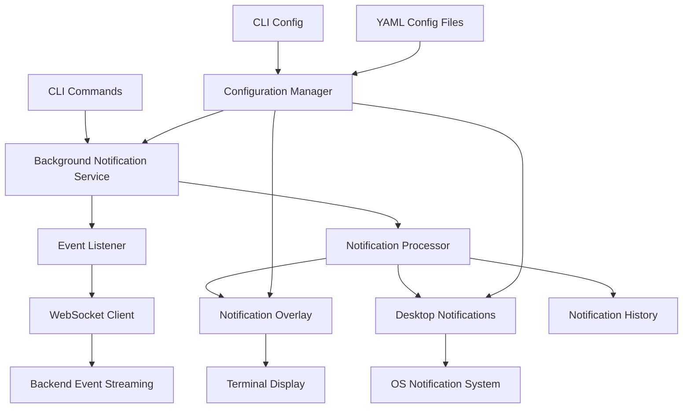

# Sprint 2.3 Detailed Implementation Plan
## Real-time Terminal Notifications with Event Streaming

### Executive Summary

Sprint 2.3 focuses on adding sophisticated real-time terminal notifications to the LeanVibe CLI, leveraging the existing event streaming infrastructure. This sprint transforms the CLI from a request-response tool into a live, reactive interface that provides continuous insights about codebase changes, architectural violations, and AI analysis results.

### Current Foundation

**✅ Available Infrastructure**:
- **Event Streaming Service**: Comprehensive WebSocket-based streaming with filtering, batching, and client preferences
- **Monitor Command**: Basic real-time event display with rich terminal UI
- **Backend APIs**: 35+ endpoints for AST analysis, graph analysis, and streaming statistics
- **CLI Framework**: Professional terminal interface with Click, Rich, and WebSocket client

### Sprint 2.3 Goals

**Primary Objective**: Transform CLI into a live, reactive monitoring and notification system

**Success Criteria**:
- Real-time notifications appear seamlessly while using other CLI commands
- Desktop notifications for critical events (architectural violations, build failures)
- Smart notification throttling prevents information overload
- Notification history and replay functionality
- Integration with existing CLI commands for contextual awareness

---

## Task Breakdown & Implementation Plan

### Task 2.3.1: Background Notification System
**Duration**: 2 days  
**Priority**: High

#### Objective
Create a background notification service that runs independently of CLI commands and provides non-intrusive real-time updates.

#### Implementation Details

**2.3.1a: Background Event Listener Service**
```python
# File: leanvibe_cli/services/notification_service.py

class NotificationService:
    """Background service for real-time notifications"""
    
    def __init__(self, config: CLIConfig):
        self.config = config
        self.client = BackendClient(config)
        self.notification_queue = asyncio.Queue()
        self.is_running = False
        self.notification_history = deque(maxlen=100)
        
    async def start_background_monitoring(self):
        """Start background monitoring with minimal UI impact"""
        if not await self.client.connect_websocket():
            return False
            
        self.is_running = True
        
        # Run event listening in background
        asyncio.create_task(self._event_listener())
        asyncio.create_task(self._notification_processor())
        
        return True
    
    async def _event_listener(self):
        """Listen for events and queue notifications"""
        async for event in self.client.listen_for_events():
            if not self.is_running:
                break
                
            # Apply smart filtering
            if self._should_notify(event):
                await self.notification_queue.put(event)
                self.notification_history.appendleft(event)
    
    async def _notification_processor(self):
        """Process notifications with throttling and deduplication"""
        throttle_window = {}
        
        while self.is_running:
            try:
                event = await asyncio.wait_for(
                    self.notification_queue.get(), timeout=1.0
                )
                
                # Smart throttling by event type
                event_key = f"{event.get('type')}:{event.get('source', '')}"
                now = time.time()
                
                if event_key in throttle_window:
                    if now - throttle_window[event_key] < self.config.notification_throttle_seconds:
                        continue  # Skip this notification
                
                throttle_window[event_key] = now
                
                # Process notification
                await self._process_notification(event)
                
            except asyncio.TimeoutError:
                continue
    
    async def _process_notification(self, event: Dict[str, Any]):
        """Process individual notification"""
        priority = event.get('priority', 'medium')
        event_type = event.get('type', 'unknown')
        
        # Determine notification method based on priority and user preferences
        if priority == 'critical' and self.config.desktop_notifications:
            await self._send_desktop_notification(event)
        
        if self.config.terminal_notifications:
            await self._send_terminal_notification(event)
        
        # Log to notification history
        self._log_notification(event)
```

**2.3.1b: Terminal Notification Overlay**
```python
# File: leanvibe_cli/ui/notification_overlay.py

class NotificationOverlay:
    """Non-intrusive terminal notification overlay"""
    
    def __init__(self, console: Console):
        self.console = console
        self.active_notifications = deque(maxlen=3)
        self.notification_lock = asyncio.Lock()
    
    async def show_notification(self, event: Dict[str, Any], duration: int = 5):
        """Show notification overlay without interrupting current command"""
        async with self.notification_lock:
            notification = self._format_notification(event)
            self.active_notifications.append(notification)
            
            # Display notification bar at top of terminal
            await self._render_notification_bar()
            
            # Auto-dismiss after duration
            await asyncio.sleep(duration)
            
            if notification in self.active_notifications:
                self.active_notifications.remove(notification)
                await self._render_notification_bar()
    
    def _format_notification(self, event: Dict[str, Any]) -> Dict[str, str]:
        """Format event as notification"""
        priority = event.get('priority', 'medium')
        event_type = event.get('type', 'unknown')
        timestamp = datetime.now().strftime("%H:%M:%S")
        
        # Extract meaningful message
        message = self._extract_message(event)
        
        # Color coding by priority
        colors = {
            'critical': 'red',
            'high': 'yellow', 
            'medium': 'blue',
            'low': 'green'
        }
        
        return {
            'priority': priority,
            'color': colors.get(priority, 'white'),
            'message': message,
            'timestamp': timestamp,
            'icon': self._get_priority_icon(priority)
        }
    
    async def _render_notification_bar(self):
        """Render notification bar at top of terminal"""
        if not self.active_notifications:
            return
        
        # Create notification bar
        notifications_text = " | ".join([
            f"{n['icon']} {n['message']}" 
            for n in list(self.active_notifications)[-3:]  # Show last 3
        ])
        
        # Render with rich panel
        panel = Panel(
            notifications_text,
            style="dim",
            height=1,
            padding=(0, 1)
        )
        
        # Non-blocking display
        self.console.print(panel)
```

#### Acceptance Criteria
- [ ] Background notification service runs without blocking CLI commands
- [ ] Notifications appear as non-intrusive overlays
- [ ] Smart throttling prevents notification spam
- [ ] Service can start/stop independently

---

### Task 2.3.2: Desktop Notification Integration
**Duration**: 1 day  
**Priority**: Medium

#### Objective
Add native desktop notifications for critical events using cross-platform notification systems.

#### Implementation Details

**2.3.2a: Cross-platform Desktop Notifications**
```python
# File: leanvibe_cli/services/desktop_notifications.py

import platform
import subprocess
import shutil
from typing import Optional

class DesktopNotificationService:
    """Cross-platform desktop notification service"""
    
    def __init__(self):
        self.platform = platform.system().lower()
        self.notification_available = self._check_availability()
    
    def _check_availability(self) -> bool:
        """Check if desktop notifications are available"""
        if self.platform == "darwin":  # macOS
            return shutil.which("osascript") is not None
        elif self.platform == "linux":
            return shutil.which("notify-send") is not None
        elif self.platform == "windows":
            return True  # Use Windows toast notifications
        return False
    
    async def send_notification(self, title: str, message: str, 
                              priority: str = "normal", sound: bool = False):
        """Send desktop notification"""
        if not self.notification_available:
            return False
        
        try:
            if self.platform == "darwin":
                await self._send_macos_notification(title, message, sound)
            elif self.platform == "linux":
                await self._send_linux_notification(title, message, priority)
            elif self.platform == "windows":
                await self._send_windows_notification(title, message)
            
            return True
        except Exception as e:
            logger.error(f"Failed to send desktop notification: {e}")
            return False
    
    async def _send_macos_notification(self, title: str, message: str, sound: bool):
        """Send macOS notification using osascript"""
        script = f'''
        display notification "{message}" with title "LeanVibe" subtitle "{title}"
        '''
        if sound:
            script += ' sound name "Glass"'
        
        proc = await asyncio.create_subprocess_exec(
            "osascript", "-e", script,
            stdout=asyncio.subprocess.PIPE,
            stderr=asyncio.subprocess.PIPE
        )
        await proc.communicate()
    
    async def _send_linux_notification(self, title: str, message: str, priority: str):
        """Send Linux notification using notify-send"""
        urgency_map = {
            'critical': 'critical',
            'high': 'normal',
            'medium': 'normal',
            'low': 'low'
        }
        
        proc = await asyncio.create_subprocess_exec(
            "notify-send",
            "--app-name=LeanVibe",
            f"--urgency={urgency_map.get(priority, 'normal')}",
            "--icon=terminal",
            title,
            message,
            stdout=asyncio.subprocess.PIPE,
            stderr=asyncio.subprocess.PIPE
        )
        await proc.communicate()
```

**2.3.2b: Smart Notification Triggers**
```python
# File: leanvibe_cli/services/notification_triggers.py

class NotificationTriggers:
    """Intelligent notification trigger system"""
    
    CRITICAL_TRIGGERS = {
        'architectural_violation': {
            'title': 'Architecture Violation Detected',
            'icon': '🚨',
            'sound': True
        },
        'build_failure': {
            'title': 'Build Failed',
            'icon': '❌',
            'sound': True
        },
        'security_issue': {
            'title': 'Security Issue Found', 
            'icon': '🔒',
            'sound': True
        }
    }
    
    HIGH_PRIORITY_TRIGGERS = {
        'complexity_spike': {
            'title': 'Code Complexity Alert',
            'icon': '📊',
            'sound': False
        },
        'circular_dependency': {
            'title': 'Circular Dependency Detected',
            'icon': '🔄',
            'sound': False
        }
    }
    
    @classmethod
    def should_send_desktop_notification(cls, event: Dict[str, Any]) -> bool:
        """Determine if event warrants desktop notification"""
        event_type = event.get('type', '')
        priority = event.get('priority', 'medium')
        
        # Always send for critical events
        if priority == 'critical':
            return True
        
        # Send for specific high-priority event types
        if priority == 'high' and event_type in cls.HIGH_PRIORITY_TRIGGERS:
            return True
        
        return False
    
    @classmethod
    def format_desktop_notification(cls, event: Dict[str, Any]) -> Dict[str, str]:
        """Format event for desktop notification"""
        event_type = event.get('type', 'unknown')
        priority = event.get('priority', 'medium')
        
        # Get trigger configuration
        trigger_config = None
        if priority == 'critical':
            trigger_config = cls.CRITICAL_TRIGGERS.get(event_type)
        elif priority == 'high':
            trigger_config = cls.HIGH_PRIORITY_TRIGGERS.get(event_type)
        
        if trigger_config:
            title = trigger_config['title']
            icon = trigger_config['icon']
        else:
            title = f"LeanVibe {priority.title()} Alert"
            icon = "🔔"
        
        # Extract message from event
        message = cls._extract_notification_message(event)
        
        return {
            'title': f"{icon} {title}",
            'message': message,
            'sound': trigger_config.get('sound', False) if trigger_config else False
        }
```

#### Acceptance Criteria
- [ ] Desktop notifications work on macOS, Linux, and Windows
- [ ] Smart triggering prevents notification fatigue
- [ ] Critical events always generate desktop notifications
- [ ] Notifications include meaningful context and actions

---

### Task 2.3.3: Enhanced Monitor Command with Notifications
**Duration**: 1.5 days  
**Priority**: High

#### Objective
Enhance the existing monitor command to integrate seamlessly with the new notification system and provide richer real-time insights.

#### Implementation Details

**2.3.3a: Enhanced Monitor with Live Notifications**
```python
# File: leanvibe_cli/commands/monitor.py (Enhanced)

@click.command()
@click.option('--background', '-b', is_flag=True, help='Run in background with notifications')
@click.option('--desktop-notifications', '-n', is_flag=True, help='Enable desktop notifications')
@click.option('--notification-history', is_flag=True, help='Show notification history')
@click.option('--live-dashboard', is_flag=True, help='Show live metrics dashboard')
# ... existing options ...
def monitor(ctx: click.Context, background: bool, desktop_notifications: bool, 
           notification_history: bool, live_dashboard: bool, **kwargs):
    """Enhanced monitor with notification integration"""
    config = ctx.obj['config']
    client = ctx.obj['client']
    
    # Override config with command options
    if desktop_notifications:
        config.desktop_notifications = True
    
    if background:
        asyncio.run(background_monitor_mode(config, client))
    elif notification_history:
        asyncio.run(show_notification_history(config, client))
    elif live_dashboard:
        asyncio.run(live_dashboard_mode(config, client))
    else:
        # Enhanced interactive monitoring
        asyncio.run(enhanced_monitor_command(config, client, **kwargs))

async def enhanced_monitor_command(config: CLIConfig, client: BackendClient, **options):
    """Enhanced monitoring with integrated notifications"""
    
    # Initialize notification service
    notification_service = NotificationService(config)
    await notification_service.start_background_monitoring()
    
    # Initialize overlay
    overlay = NotificationOverlay(console)
    
    # Enhanced monitoring display
    with Live(
        generate_enhanced_monitor_display(client, notification_service),
        refresh_per_second=4,
        console=console
    ) as live:
        
        async for event in client.listen_for_events():
            # Update live display
            live.update(generate_enhanced_monitor_display(client, notification_service))
            
            # Show notification overlay for important events
            if should_show_overlay_notification(event, config):
                asyncio.create_task(overlay.show_notification(event))

def generate_enhanced_monitor_display(client: BackendClient, 
                                    notification_service: NotificationService):
    """Generate enhanced monitoring display with notification integration"""
    
    # Main monitoring panels
    panels = []
    
    # System status panel
    status_panel = create_system_status_panel(client)
    panels.append(status_panel)
    
    # Live metrics panel  
    metrics_panel = create_live_metrics_panel(client)
    panels.append(metrics_panel)
    
    # Recent notifications panel
    notifications_panel = create_notifications_panel(notification_service)
    panels.append(notifications_panel)
    
    # Event stream panel
    events_panel = create_event_stream_panel(client)
    panels.append(events_panel)
    
    # Arrange in grid layout
    return create_dashboard_layout(panels)
```

**2.3.3b: Live Metrics Dashboard**
```python
# File: leanvibe_cli/ui/live_dashboard.py

class LiveMetricsDashboard:
    """Real-time metrics dashboard"""
    
    def __init__(self, client: BackendClient):
        self.client = client
        self.metrics_history = defaultdict(lambda: deque(maxlen=50))
        self.alert_thresholds = {
            'response_time_ms': 1000,
            'error_rate_percent': 5.0,
            'memory_usage_mb': 500
        }
    
    async def update_metrics(self):
        """Update live metrics from backend"""
        try:
            # Get streaming stats
            streaming_stats = await self.client.get_streaming_stats()
            
            # Get session info  
            sessions = await self.client.get_sessions()
            
            # Calculate derived metrics
            metrics = self._calculate_derived_metrics(streaming_stats, sessions)
            
            # Update history
            timestamp = time.time()
            for metric, value in metrics.items():
                self.metrics_history[metric].append((timestamp, value))
            
            return metrics
            
        except Exception as e:
            logger.error(f"Failed to update metrics: {e}")
            return {}
    
    def create_metrics_sparklines(self) -> Table:
        """Create sparkline charts for key metrics"""
        table = Table(title="Live Metrics", show_header=True)
        table.add_column("Metric", style="cyan")
        table.add_column("Current", style="bold")
        table.add_column("Trend", style="dim")
        table.add_column("Alert", style="red")
        
        for metric, history in self.metrics_history.items():
            if not history:
                continue
                
            current_value = history[-1][1]
            trend = self._generate_sparkline(history)
            alert_status = self._check_alert_threshold(metric, current_value)
            
            table.add_row(
                metric.replace('_', ' ').title(),
                self._format_metric_value(metric, current_value),
                trend,
                "🚨" if alert_status else "✅"
            )
        
        return table
    
    def _generate_sparkline(self, history: deque) -> str:
        """Generate ASCII sparkline for metric history"""
        if len(history) < 2:
            return "─"
        
        values = [item[1] for item in history]
        min_val, max_val = min(values), max(values)
        
        if max_val == min_val:
            return "─" * len(values)
        
        # Normalize to 0-7 range for Unicode block characters
        chars = "▁▂▃▄▅▆▇█"
        normalized = [
            int((val - min_val) / (max_val - min_val) * 7)
            for val in values
        ]
        
        return "".join(chars[n] for n in normalized[-20:])  # Last 20 points
```

#### Acceptance Criteria
- [ ] Enhanced monitor integrates notification overlays seamlessly
- [ ] Live metrics dashboard shows real-time system health
- [ ] Background monitoring mode runs independently
- [ ] Notification history provides event timeline

---

### Task 2.3.4: Notification Configuration Management
**Duration**: 1 day  
**Priority**: Medium

#### Objective
Provide comprehensive configuration management for notification preferences, filters, and behaviors.

#### Implementation Details

**2.3.4a: Configuration Extensions**
```python
# File: leanvibe_cli/config.py (Enhanced)

@dataclass
class NotificationConfig:
    """Notification-specific configuration"""
    
    # Notification preferences
    desktop_notifications: bool = True
    terminal_notifications: bool = True
    sound_notifications: bool = False
    
    # Filtering and throttling
    notification_throttle_seconds: int = 30
    max_notifications_per_minute: int = 10
    min_notification_priority: str = "medium"
    
    # Desktop notification settings
    desktop_notification_duration: int = 5
    desktop_notification_position: str = "top-right"
    
    # Event filtering
    enabled_event_types: List[str] = None
    excluded_file_patterns: List[str] = None
    notification_keywords: List[str] = None
    
    def __post_init__(self):
        if self.enabled_event_types is None:
            self.enabled_event_types = [
                "architectural_violation",
                "build_failure", 
                "security_issue",
                "complexity_spike",
                "circular_dependency"
            ]
        
        if self.excluded_file_patterns is None:
            self.excluded_file_patterns = [
                "*.test.py", "*.spec.js", "node_modules/*", 
                ".git/*", "*.log", "__pycache__/*"
            ]

@dataclass  
class CLIConfig:
    # ... existing fields ...
    
    # Notification configuration
    notifications: NotificationConfig = None
    
    def __post_init__(self):
        # ... existing logic ...
        
        if self.notifications is None:
            self.notifications = NotificationConfig()
```

**2.3.4b: Configuration Management Commands**
```python
# File: leanvibe_cli/commands/config.py

@click.group()
def config():
    """Manage LeanVibe CLI configuration"""
    pass

@config.command()
@click.option('--show-defaults', is_flag=True, help='Show default values')
@click.pass_context
def show(ctx: click.Context, show_defaults: bool):
    """Show current configuration"""
    config = ctx.obj['config']
    
    if show_defaults:
        default_config = CLIConfig()
        display_config_comparison(config, default_config)
    else:
        display_config(config)

@config.command()
@click.option('--notifications/--no-notifications', default=None, 
              help='Enable/disable desktop notifications')
@click.option('--notification-level', 
              type=click.Choice(['debug', 'low', 'medium', 'high', 'critical']),
              help='Set minimum notification priority level')
@click.option('--throttle-seconds', type=int, 
              help='Notification throttle period in seconds')
@click.pass_context
def set(ctx: click.Context, notifications: Optional[bool], 
        notification_level: Optional[str], throttle_seconds: Optional[int]):
    """Set configuration values"""
    config = ctx.obj['config']
    changes_made = False
    
    if notifications is not None:
        config.notifications.desktop_notifications = notifications
        changes_made = True
    
    if notification_level:
        config.notifications.min_notification_priority = notification_level
        changes_made = True
    
    if throttle_seconds:
        config.notifications.notification_throttle_seconds = throttle_seconds
        changes_made = True
    
    if changes_made:
        if save_config(config):
            console.print("[green]Configuration updated successfully[/green]")
        else:
            console.print("[red]Failed to save configuration[/red]")
    else:
        console.print("[yellow]No changes made[/yellow]")

@config.command()
@click.option('--force', is_flag=True, help='Force reset without confirmation')
@click.pass_context
def reset(ctx: click.Context, force: bool):
    """Reset configuration to defaults"""
    if not force:
        if not click.confirm("Reset all configuration to defaults?"):
            return
    
    config_path = get_config_path()
    if config_path.exists():
        config_path.unlink()
    
    console.print("[green]Configuration reset to defaults[/green]")
```

#### Acceptance Criteria
- [ ] Comprehensive notification configuration options
- [ ] Configuration commands for easy management
- [ ] Smart defaults with override capabilities
- [ ] Configuration validation and error handling

---

### Task 2.3.5: Integration Testing & Polish
**Duration**: 1 day  
**Priority**: High

#### Objective
Comprehensive testing of the notification system and integration with existing CLI functionality.

#### Implementation Details

**2.3.5a: Notification System Tests**
```python
# File: tests/test_notification_system.py

import pytest
import asyncio
from unittest.mock import Mock, patch
from leanvibe_cli.services.notification_service import NotificationService
from leanvibe_cli.services.desktop_notifications import DesktopNotificationService

class TestNotificationService:
    
    @pytest.fixture
    async def notification_service(self, mock_config):
        service = NotificationService(mock_config)
        yield service
        if service.is_running:
            await service.stop()
    
    async def test_background_monitoring_startup(self, notification_service):
        """Test notification service starts correctly"""
        with patch.object(notification_service.client, 'connect_websocket', return_value=True):
            result = await notification_service.start_background_monitoring()
            assert result is True
            assert notification_service.is_running is True
    
    async def test_event_filtering(self, notification_service):
        """Test event filtering logic"""
        # Test high-priority event passes filter
        critical_event = {
            'type': 'architectural_violation',
            'priority': 'critical',
            'timestamp': '2024-01-01T12:00:00Z'
        }
        assert notification_service._should_notify(critical_event) is True
        
        # Test low-priority event is filtered out
        debug_event = {
            'type': 'file_change',
            'priority': 'debug',
            'timestamp': '2024-01-01T12:00:00Z'
        }
        assert notification_service._should_notify(debug_event) is False
    
    async def test_notification_throttling(self, notification_service):
        """Test notification throttling prevents spam"""
        event = {
            'type': 'build_status',
            'priority': 'medium',
            'source': 'test'
        }
        
        # First notification should pass
        await notification_service.notification_queue.put(event)
        
        # Rapid second notification should be throttled
        await notification_service.notification_queue.put(event)
        
        # Process notifications
        await notification_service._notification_processor()
        
        # Verify throttling occurred
        assert len(notification_service.notification_history) == 1

class TestDesktopNotifications:
    
    def test_platform_detection(self):
        """Test cross-platform desktop notification detection"""
        service = DesktopNotificationService()
        assert service.platform in ['darwin', 'linux', 'windows']
    
    @patch('platform.system')
    @patch('shutil.which')
    async def test_macos_notification(self, mock_which, mock_platform):
        """Test macOS notification sending"""
        mock_platform.return_value = 'Darwin'
        mock_which.return_value = '/usr/bin/osascript'
        
        service = DesktopNotificationService()
        
        with patch('asyncio.create_subprocess_exec') as mock_subprocess:
            mock_proc = Mock()
            mock_proc.communicate.return_value = ('', '')
            mock_subprocess.return_value = mock_proc
            
            result = await service.send_notification(
                "Test Title", "Test Message", "critical", True
            )
            
            assert result is True
            mock_subprocess.assert_called_once()
```

**2.3.5b: Integration Testing**
```python
# File: tests/test_notification_integration.py

class TestNotificationIntegration:
    
    async def test_monitor_with_notifications(self, cli_runner, mock_backend):
        """Test monitor command with notification integration"""
        result = await cli_runner.invoke(
            cli, ['--backend-url', 'http://localhost:8001', 
                  'monitor', '--background', '--duration', '5']
        )
        
        assert result.exit_code == 0
        assert "Monitoring active" in result.output
    
    async def test_notification_overlay_non_intrusive(self, mock_console):
        """Test notification overlay doesn't interrupt other commands"""
        from leanvibe_cli.ui.notification_overlay import NotificationOverlay
        
        overlay = NotificationOverlay(mock_console)
        
        # Simulate notification during command execution
        event = {
            'type': 'architectural_violation',
            'priority': 'high',
            'message': 'Test violation detected'
        }
        
        await overlay.show_notification(event, duration=1)
        
        # Verify notification was displayed without blocking
        assert len(overlay.active_notifications) == 1
        
        # Wait for auto-dismiss
        await asyncio.sleep(1.1)
        assert len(overlay.active_notifications) == 0
    
    async def test_config_notification_settings(self, cli_runner):
        """Test notification configuration management"""
        # Test setting notification preferences
        result = await cli_runner.invoke(
            cli, ['config', 'set', '--notifications', '--notification-level', 'high']
        )
        
        assert result.exit_code == 0
        assert "Configuration updated" in result.output
        
        # Test showing current config
        result = await cli_runner.invoke(cli, ['config', 'show'])
        assert result.exit_code == 0
        assert "desktop_notifications: true" in result.output.lower()
```

#### Acceptance Criteria
- [ ] Comprehensive test coverage for notification system
- [ ] Integration tests verify seamless CLI operation
- [ ] Performance tests ensure minimal impact on CLI responsiveness
- [ ] Cross-platform testing validates desktop notifications

---

## Technical Architecture

### System Integration Diagram



### Data Flow

1. **Event Stream**: Backend → WebSocket → Event Listener
2. **Filtering**: Event Listener → Smart Filters → Notification Queue  
3. **Processing**: Queue → Throttling → Deduplication → Notification Methods
4. **Display**: Notification Methods → Terminal Overlay + Desktop Notifications
5. **History**: All notifications → History Store → Replay Commands

### Performance Considerations

- **Non-blocking**: Background service runs independently of CLI commands
- **Memory efficient**: Limited history queues and smart garbage collection
- **Throttling**: Prevents notification spam and system overload
- **Graceful degradation**: Falls back gracefully if desktop notifications unavailable

---

## Configuration Schema

### Extended CLI Configuration
```yaml
# .leanvibe/cli-config.yaml

backend_url: http://localhost:8000
websocket_url: ws://localhost:8000/ws
timeout_seconds: 30

# Notification Configuration
notifications:
  # Basic preferences
  desktop_notifications: true
  terminal_notifications: true
  sound_notifications: false
  
  # Filtering and throttling
  notification_throttle_seconds: 30
  max_notifications_per_minute: 10
  min_notification_priority: "medium"
  
  # Desktop notification settings
  desktop_notification_duration: 5
  desktop_notification_position: "top-right"
  
  # Event filtering
  enabled_event_types:
    - "architectural_violation"
    - "build_failure"
    - "security_issue"
    - "complexity_spike"
    - "circular_dependency"
  
  excluded_file_patterns:
    - "*.test.py"
    - "*.spec.js"
    - "node_modules/*"
    - ".git/*"
    - "*.log"
    - "__pycache__/*"

# Display settings
max_lines_output: 50
syntax_highlighting: true
show_timestamps: true
compact_mode: false

# Project settings
project_root: null
auto_detect_project: true
exclude_patterns:
  - "*.pyc"
  - "*.pyo"
  - "__pycache__"
  - ".git"
  - ".svn"
  - "node_modules"
  - ".DS_Store"
  - "*.log"
  - ".env"
```

---

## Success Metrics & Quality Gates

### Sprint 2.3 Success Criteria

**Functional Requirements**:
- [ ] Background notification service runs without impacting CLI performance
- [ ] Desktop notifications work on macOS, Linux, and Windows
- [ ] Smart filtering prevents notification overload (max 10/minute)
- [ ] Notification overlays are non-intrusive and auto-dismiss
- [ ] Configuration management allows easy customization

**Performance Requirements**:
- [ ] Background service uses < 50MB memory
- [ ] Notification processing adds < 10ms latency to commands
- [ ] Desktop notifications appear within 500ms of trigger
- [ ] Terminal notifications don't block command execution

**User Experience Requirements**:
- [ ] Notifications provide actionable information
- [ ] Critical events always generate appropriate alerts
- [ ] Users can easily configure notification preferences
- [ ] Notification history provides useful event timeline

### Testing Requirements

**Unit Tests**:
- [ ] 90% coverage for notification service components
- [ ] Cross-platform desktop notification testing
- [ ] Configuration validation and edge cases

**Integration Tests**:
- [ ] CLI commands work seamlessly with background notifications
- [ ] WebSocket event streaming integration
- [ ] Configuration management through CLI commands

**Performance Tests**:
- [ ] Memory usage profiling under notification load
- [ ] Latency impact measurement
- [ ] Stress testing with high event volumes

---

## Implementation Timeline

### Week 1
- **Days 1-2**: Task 2.3.1 - Background Notification System
- **Day 3**: Task 2.3.2 - Desktop Notification Integration  
- **Days 4-5**: Task 2.3.3 - Enhanced Monitor Command (Part 1)

### Week 2  
- **Days 1-2**: Task 2.3.3 - Enhanced Monitor Command (Part 2)
- **Day 3**: Task 2.3.4 - Configuration Management
- **Day 4**: Task 2.3.5 - Integration Testing & Polish
- **Day 5**: Documentation, final testing, and Sprint 2.3 completion

---

## Risk Mitigation

### Technical Risks

**Risk**: Desktop notifications may not work consistently across platforms
- **Mitigation**: Graceful fallback to terminal-only notifications, comprehensive cross-platform testing

**Risk**: Background service may impact CLI performance  
- **Mitigation**: Careful async implementation, memory profiling, performance monitoring

**Risk**: Notification spam overwhelming users
- **Mitigation**: Smart throttling, configurable filtering, intelligent prioritization

### Integration Risks

**Risk**: Breaking existing CLI functionality
- **Mitigation**: Comprehensive regression testing, backwards compatibility focus

**Risk**: WebSocket connection instability affecting notifications
- **Mitigation**: Robust reconnection logic, graceful degradation

---

## Next Steps After Sprint 2.3

Upon completion of Sprint 2.3, the CLI will have transformed into a fully reactive, live monitoring system. This sets the foundation for:

**Sprint 2.4**: YAML Configuration Management
- Enhanced configuration system with validation
- Project-specific configuration inheritance
- Configuration migration and backup

**Sprint 2.5**: Project-aware CLI Integration  
- Automatic project detection and context
- Workspace-aware suggestions and commands
- Deep integration with backend project analysis

The notification system implemented in Sprint 2.3 will serve as the foundation for all future real-time features and provide the reactive infrastructure needed for a modern development tool.