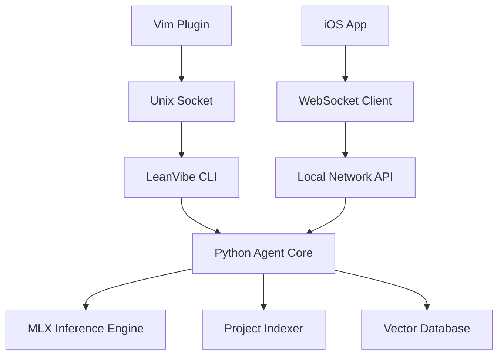

# LeanVibe MVP Specification

## Project Overview
**Product**: LeanVibe - Semi-autonomous coding agent for senior engineers  
**Development Time**: 4 weeks (April 1-28, 2025)  
**Budget**: $20,000  
**Technical Stack**: Python (backend/agent), SwiftUI (iOS), LitePWA (optional web dashboard)  
**Target Launch**: April 28, 2025  

## 1. CORE FEATURES (Maximum 3)

### Feature 1: Local AI Code Assistant with Project Context
**User Story**: As a senior engineer, I want an AI assistant that understands my entire project context so I can get intelligent code suggestions without compromising privacy.

**Acceptance Criteria**:
- Runs 100% locally on Apple Silicon (M3 Max+)
- Provides code completion with <500ms latency
- Understands project structure and dependencies
- Works offline without any cloud dependencies
- Supports Python, JavaScript, Swift, and TypeScript

**Technical Requirements**:
- MLX framework for local LLM inference
- CodeLlama 13B quantized model (Q4_0)
- Vector database (ChromaDB) for code embeddings
- File watcher for real-time project indexing
- Maximum 16GB memory footprint

### Feature 2: Terminal-First CLI Interface
**User Story**: As a vim/tmux user, I want a CLI tool that integrates seamlessly with my workflow so I can interact with the AI without leaving my terminal.

**Acceptance Criteria**:
- Single command installation via pip
- Works within existing tmux sessions
- Supports vim-style keybindings
- Provides inline code suggestions
- Git-aware with automatic semantic commits

**Technical Requirements**:
- Python Click framework for CLI
- Unix socket for vim plugin communication
- YAML configuration with dotfile support
- Process daemon for background indexing
- <100ms response time for completions

### Feature 3: iOS Monitoring App
**User Story**: As a mobile developer, I want to monitor my AI agent's activity from my iPhone so I can stay informed about project progress while away from my desk.

**Acceptance Criteria**:
- Real-time agent status updates
- View recent code changes and decisions
- Basic metrics (files processed, suggestions made)
- Push notifications for important events
- Works over local network only (no cloud)

**Technical Requirements**:
- SwiftUI with iOS 17+ target
- Bonjour/mDNS for local discovery
- WebSocket connection to agent
- Local notifications framework
- Secure storage with Face ID/Touch ID

## 2. USER JOURNEY

### Onboarding Flow (3 Steps Maximum)

**Step 1: Installation (5 minutes)**
```bash
# Install CLI tool
pip install leanvibe

# Initialize in project directory
leanvibe init
```
- Auto-detects project type and structure
- Downloads appropriate AI model (~4GB)
- Creates `.leanvibe` config directory

**Step 2: Configuration (2 minutes)**
```yaml
# .leanvibe/config.yaml
model: codellama-13b-q4
memory_limit: 16GB
auto_index: true
vim_plugin: true
```
- Interactive setup wizard for first-time users
- Sensible defaults for senior engineers
- Optional vim plugin installation

**Step 3: iOS App Pairing (1 minute)**
- Download LeanVibe from App Store
- Scan QR code from CLI
- Automatic local network discovery
- Test notification sent

### Core Workflow

1. **Code Writing**: Developer writes code in vim/terminal as usual
2. **Context Building**: Agent continuously indexes project changes
3. **Intelligent Assistance**: 
   - Type `##` for inline suggestions
   - Run `leanvibe explain` for code analysis
   - Use `leanvibe refactor` for improvements
4. **Mobile Monitoring**: Check iOS app for progress/metrics
5. **Iteration**: Agent learns from accepted/rejected suggestions

### Success Metrics
- Time to first suggestion: <30 seconds
- Daily active usage: >10 interactions
- Code suggestion acceptance rate: >40%
- Setup completion rate: >80%
- User satisfaction (NPS): >50

## 3. TECHNICAL ARCHITECTURE

### System Components



### Data Model

```python
# Core entities
class Project:
    id: UUID
    path: str
    language: str
    indexed_at: datetime
    file_count: int

class CodeContext:
    project_id: UUID
    file_path: str
    content: str
    embedding: Vector[1536]
    last_modified: datetime

class Suggestion:
    id: UUID
    context_id: UUID
    prompt: str
    suggestion: str
    confidence: float
    accepted: Optional[bool]
    created_at: datetime

class AgentMetrics:
    project_id: UUID
    suggestions_made: int
    suggestions_accepted: int
    files_processed: int
    tokens_generated: int
    timestamp: datetime
```

### API Structure

**Local REST API** (Python FastAPI):
```python
GET  /api/status          # Agent health check
GET  /api/projects        # List indexed projects
POST /api/suggestions     # Request code suggestion
GET  /api/metrics         # Retrieve agent metrics
WS   /api/stream          # Real-time updates
```

**CLI Commands**:
```bash
leanvibe init             # Initialize project
leanvibe suggest          # Get suggestion at cursor
leanvibe explain          # Explain selected code
leanvibe refactor         # Suggest improvements
leanvibe status           # Show agent status
```

### Security Considerations

1. **Local-Only Processing**
   - No external API calls
   - All data stays on device
   - Network traffic limited to local subnet

2. **Access Control**
   - Token-based authentication for iOS app
   - File system permissions for project access
   - Secure WebSocket with TLS

3. **Data Protection**
   - Embeddings stored encrypted at rest
   - iOS app data in secure enclave
   - No telemetry or usage tracking

4. **Code Safety**
   - Sandboxed execution environment
   - No automatic code execution
   - Human-in-the-loop for all changes

## 4. DESIGN REQUIREMENTS

### UI Components Needed

**CLI Interface**:
- Rich terminal UI with syntax highlighting
- Progress bars for indexing operations
- Inline diff display for suggestions
- ASCII-based status dashboard

**iOS App Components**:
- SwiftUI TabView (Status, Metrics, Logs)
- Real-time chart for metrics
- Code snippet viewer with syntax highlighting
- Native iOS design language
- Pull-to-refresh functionality

### Responsive Breakpoints
- iOS App: iPhone 14 Pro minimum (393pt width)
- iPad support: Optional post-MVP
- No web interface in MVP

### Accessibility Standards
- VoiceOver support for iOS app
- Terminal UI compatible with screen readers
- Keyboard-only navigation
- High contrast mode support
- WCAG 2.1 AA compliance

## 5. LAUNCH CRITERIA

### Quality Benchmarks
- **Code Coverage**: >80% for critical paths
- **Crash-Free Rate**: >99.5%
- **Memory Usage**: <16GB under load
- **Model Accuracy**: >70% useful suggestions
- **Zero network dependencies**: Full offline functionality

### Performance Targets
- **Startup Time**: <5 seconds
- **First Suggestion**: <500ms
- **Project Indexing**: <1 minute for 10K files
- **iOS App Launch**: <2 seconds
- **WebSocket Latency**: <50ms local network

### Initial User Target
- **Week 1**: 10 beta testers (friendly senior engineers)
- **Week 2**: 50 early adopters from indie hacker community
- **Week 4**: 200 users from iOS developer forums
- **Success Metric**: 50+ daily active users by week 4

## Implementation Priority

### Week 1: Core Foundation
- Python agent architecture
- MLX model integration
- Basic CLI interface
- Project indexing system

### Week 2: Intelligence Layer
- Context-aware suggestions
- Vector database integration
- Vim plugin development
- Performance optimization

### Week 3: iOS App
- SwiftUI app structure
- WebSocket communication
- Real-time metrics display
- Local network security

### Week 4: Polish & Launch
- Bug fixes and optimization
- Documentation and tutorials
- Beta testing program
- App Store submission

## MVP Exclusions (Future Releases)
- Web dashboard (use iOS app only)
- Multiple AI model support
- Team collaboration features
- Cloud backup/sync
- Advanced Kanban board
- Voice interaction
- Architecture diagrams
- CI/CD integration

## Risk Mitigation
1. **Technical Risk**: Use proven MLX framework instead of experimental solutions
2. **Timeline Risk**: Focus on 3 core features only, defer nice-to-haves
3. **Adoption Risk**: Target early adopters who value privacy and control
4. **Performance Risk**: Start with smaller 13B model, upgrade post-MVP