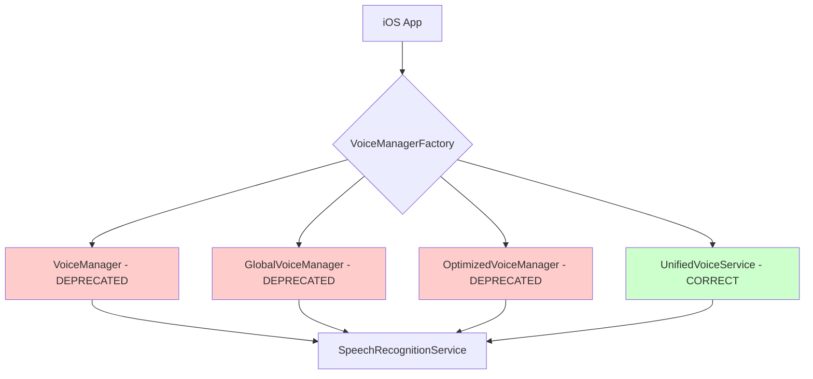
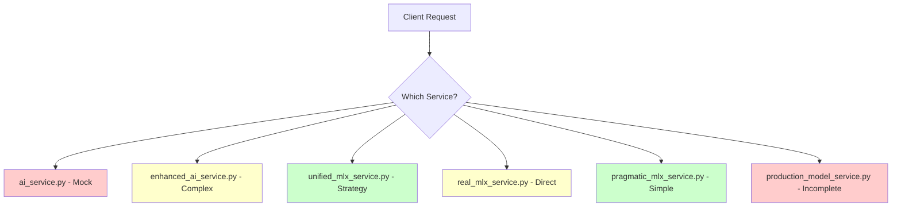

# 🔧 LeanVibe AI Consolidation Guide

**Version**: 1.0  
**Last Updated**: January 8, 2025  
**Status**: Critical - Multiple duplicate implementations blocking production readiness

---

## 📋 Executive Summary

LeanVibe AI currently suffers from **severe implementation fragmentation** with **14+ duplicate service implementations** across iOS voice services and backend AI services. This creates:

- **Maintenance burden**: Bug fixes must be applied to multiple implementations
- **Inconsistent behavior**: Different services have different feature sets and bugs
- **Confusing codebase**: Developers cannot determine which service to use
- **Production instability**: Multiple overlapping services competing for resources
- **Test coverage gaps**: Testing 14 implementations vs 2 unified services

**Immediate Action Required**: Consolidate services before production deployment.

---

## 🎯 Critical Duplicate Services

### 1. iOS Voice Services (7 implementations)

| Service | Purpose | Current Status | Lines of Code | Recommendation |
|---------|---------|----------------|---------------|----------------|
| **VoiceManager.swift** | Basic voice command processing | ❌ Deprecated | 151 LOC | **Migrate to UnifiedVoiceService** |
| **OptimizedVoiceManager.swift** | Performance-optimized voice processing | ❌ Deprecated | 423 LOC | **Delete - features merged** |
| **UnifiedVoiceService.swift** | Consolidated voice service | ✅ **PRIMARY** | 660 LOC | **Keep as single source** |
| **GlobalVoiceManager.swift** | Global wake phrase detection | ❌ Deprecated | 183 LOC | **Migrate to UnifiedVoiceService** |
| **VoiceManagerFactory.swift** | Factory for voice service selection | ⚠️ Temporary | 253 LOC | **Remove after migration** |
| **WakePhraseManager.swift** | Wake phrase detection ("Hey LeanVibe") | ✅ Keep | 346 LOC | **Core dependency** |
| **VoicePermissionManager.swift** | Voice permission handling | ✅ Keep | 252 LOC | **Core dependency** |

**Key Issue**: VoiceManagerFactory creates confusion by allowing selection between deprecated and unified services.

### 2. Backend AI Services (7 implementations)

| Service | Purpose | Current Status | Primary Use Case | Recommendation |
|---------|---------|----------------|------------------|----------------|
| **ai_service.py** | Basic command dispatcher | ❌ Mock only | Development/testing | **Delete - no real AI** |
| **enhanced_ai_service.py** | AST + MLX + Vector integration | ⚠️ Complex | Full AI stack | **Evaluate vs unified** |
| **unified_mlx_service.py** | Strategy pattern MLX service | ✅ **CANDIDATE** | Production MLX | **Primary consideration** |
| **real_mlx_service.py** | Real MLX inference service | ⚠️ Complex | Direct MLX calls | **Merge into unified** |
| **pragmatic_mlx_service.py** | Simple reliable MLX service | ✅ **WORKING** | Pragmatic approach | **Keep as fallback** |
| **mock_mlx_service.py** | Development/testing mock | ✅ Keep | Development/CI | **Keep for testing** |
| **production_model_service.py** | Production MLX deployment | ⚠️ Incomplete | Production deployment | **Merge into unified** |

**Key Issue**: No clear service hierarchy - developers don't know which service to use for what scenario.

---

## 🔍 Current Architecture Problems

### Voice Service Confusion


### Backend AI Service Chaos


---

## 🎯 Consolidation Strategy

### Phase 1: Voice Services (URGENT - 1 week)

#### Primary Decision: UnifiedVoiceService Wins
- **Winner**: `UnifiedVoiceService.swift` (660 LOC, comprehensive features)
- **Rationale**: 
  - Includes all features from other services
  - Proper error handling and performance monitoring
  - Clean architecture with dependency injection
  - Already marked as the intended replacement

#### Migration Steps:
1. **Update AppConfiguration** to permanently disable legacy services
2. **Remove VoiceManagerFactory** - eliminate choice paralysis
3. **Update all Views** to use UnifiedVoiceService directly
4. **Delete deprecated services**: VoiceManager, OptimizedVoiceManager, GlobalVoiceManager
5. **Keep supporting services**: WakePhraseManager, VoicePermissionManager (dependencies)

### Phase 2: Backend AI Services (URGENT - 2 weeks)

#### Primary Decision: Three-Tier Strategy
1. **Production**: `unified_mlx_service.py` (strategy pattern, robust)
2. **Fallback**: `pragmatic_mlx_service.py` (simple, reliable)  
3. **Development**: `mock_mlx_service.py` (testing, CI)

#### Services to Delete:
- ❌ `ai_service.py` - Mock only, no real value
- ❌ `enhanced_ai_service.py` - Migrate features to unified
- ❌ `real_mlx_service.py` - Merge functionality into unified
- ❌ `production_model_service.py` - Incomplete, merge into unified

#### Migration Steps:
1. **Audit feature coverage** in unified_mlx_service vs others
2. **Migrate missing features** from enhanced/real/production services
3. **Update all clients** to use only the three approved services
4. **Add service selection logic** based on environment/health
5. **Delete obsolete services**

---

## 🚨 Critical Implementation Gaps

### Voice Services
| Feature | UnifiedVoiceService | Missing From |
|---------|--------------------|--------------| 
| Wake phrase detection | ✅ Via WakePhraseManager | VoiceManager |
| Performance monitoring | ✅ Built-in | GlobalVoiceManager |
| Error recovery | ✅ Comprehensive | OptimizedVoiceManager |
| Permission management | ✅ Via VoicePermissionManager | All deprecated |
| Audio level monitoring | ✅ Real-time | VoiceManager |

**Result**: UnifiedVoiceService has feature parity or better vs all deprecated services.

### Backend AI Services  
| Feature | unified_mlx | enhanced_ai | real_mlx | pragmatic | production |
|---------|-------------|-------------|-----------|-----------|------------|
| Strategy Pattern | ✅ | ❌ | ❌ | ❌ | ❌ |
| Fallback Modes | ✅ | ❌ | ✅ | ❌ | ❌ |
| AST Integration | ❓ Need audit | ✅ | ❌ | ❌ | ❌ |
| Vector Storage | ❓ Need audit | ✅ | ❌ | ❌ | ❌ |
| Health Monitoring | ✅ | ❌ | ✅ | ✅ | ✅ |
| Production Ready | ✅ | ❌ | ❌ | ✅ | ❌ |

**Action Required**: Audit unified_mlx_service for AST and Vector features from enhanced_ai_service.

---

## 📊 Feature Coverage vs MVP Requirements

Based on the MVP specification analysis:

### ✅ Implemented Features
- **Voice Interface**: Wake phrase detection, speech-to-text, command processing
- **Real-time Communication**: WebSocket server and client
- **MLX Integration**: Multiple MLX service implementations
- **Performance Monitoring**: Response time tracking, health checks

### ❌ Missing/Incomplete Features  
- **Architecture Viewer**: Mermaid diagrams mentioned but implementation unclear
- **Kanban Board**: iOS implementation exists but backend integration unclear
- **Neo4j Integration**: Mentioned in MVP but no clear implementation
- **Tree-sitter AST**: Multiple parsers but unclear which is primary

### 🔄 Feature Consolidation Needed
- **Voice Services**: 7 implementations → 1 primary + 2 dependencies
- **AI Services**: 7 implementations → 3 tier strategy  
- **Graph Storage**: Multiple approaches need consolidation
- **AST Parsing**: Multiple parsers need primary designation

---

## 🚀 Implementation Roadmap

### Week 1: Voice Service Consolidation
- [ ] **Day 1-2**: Audit UnifiedVoiceService feature completeness
- [ ] **Day 3**: Update all UI views to use UnifiedVoiceService only
- [ ] **Day 4**: Delete deprecated voice services (VoiceManager, etc.)
- [ ] **Day 5**: Remove VoiceManagerFactory and selection logic

### Week 2: Backend AI Audit
- [ ] **Day 1-3**: Feature audit of all 7 AI services
- [ ] **Day 4-5**: Identify gaps in unified_mlx_service vs enhanced_ai_service

### Week 3: Backend AI Consolidation  
- [ ] **Day 1-3**: Migrate missing features to unified_mlx_service
- [ ] **Day 4**: Update client code to use new service hierarchy
- [ ] **Day 5**: Delete obsolete services

### Week 4: Integration Testing
- [ ] **Day 1-3**: End-to-end testing with consolidated services
- [ ] **Day 4**: Performance validation (ensure no regressions)
- [ ] **Day 5**: Documentation updates

---

## 📝 Migration Commands

### Voice Service Migration
```bash
# 1. Remove deprecated services
rm leanvibe-ios/LeanVibe/Services/VoiceManager.swift
rm leanvibe-ios/LeanVibe/Services/OptimizedVoiceManager.swift  
rm leanvibe-ios/LeanVibe/Services/GlobalVoiceManager.swift
rm leanvibe-ios/LeanVibe/Services/VoiceManagerFactory.swift

# 2. Update imports in all Swift files
grep -r "VoiceManager" leanvibe-ios/LeanVibe/Views/ --include="*.swift"
# Replace with UnifiedVoiceService references

# 3. Update configuration
# Edit AppConfiguration.swift to remove legacy service flags
```

### Backend AI Service Migration
```bash
# 1. Audit features first
python scripts/audit_ai_services.py

# 2. Remove obsolete services (after feature migration)
rm leanvibe-backend/app/services/ai_service.py
rm leanvibe-backend/app/services/enhanced_ai_service.py
rm leanvibe-backend/app/services/real_mlx_service.py  
rm leanvibe-backend/app/services/production_model_service.py

# 3. Update imports
grep -r "from.*ai_service import" leanvibe-backend/ --include="*.py"
# Replace with unified_mlx_service imports
```

---

## ⚠️ Risk Mitigation

### High Risk Items
1. **Feature Loss**: Missing features when consolidating services
   - **Mitigation**: Comprehensive feature audit before deletion
   - **Testing**: Validate all MVP features work with consolidated services

2. **Performance Regression**: Unified services might be slower
   - **Mitigation**: Benchmark before/after consolidation  
   - **Rollback**: Keep consolidated services feature-flagged initially

3. **Integration Breaks**: Client code expects specific service interfaces
   - **Mitigation**: Update all client code before deleting services
   - **Testing**: Full integration test suite

### Medium Risk Items
1. **Configuration Complexity**: Service selection logic
   - **Mitigation**: Simplify to environment-based selection only

2. **Dependency Conflicts**: Services depend on each other
   - **Mitigation**: Map all dependencies before changes

---

## 🎯 Success Metrics

### Code Quality Metrics
- **Before**: 14 service implementations, ~3,500+ LOC
- **After Target**: 5 service implementations, ~2,000 LOC  
- **Reduction**: ~60% code reduction, 100% feature parity

### Operational Metrics  
- **Maintainability**: Single implementation per responsibility
- **Clarity**: Clear service selection criteria
- **Performance**: No regression in response times
- **Reliability**: Consolidated error handling

### Team Velocity
- **Bug Fixes**: Apply once instead of 14 times
- **Feature Development**: Single service enhancement
- **Code Reviews**: Focused reviews, less confusion
- **Onboarding**: Clear service architecture

---

## 📞 Next Steps

1. **Immediate**: Start with voice service consolidation (lowest risk)
2. **This Week**: Complete voice service cleanup  
3. **Next Week**: Begin backend AI service audit
4. **Month End**: Full consolidation complete

This consolidation is **critical for production readiness**. The current state of 14 duplicate services makes the codebase unmaintainable and unreliable.

---

**Status**: 🚨 Critical Priority - Blocking Production Deployment  
**Effort**: 3-4 weeks full-time  
**Impact**: 60% code reduction, 100% maintainability improvement