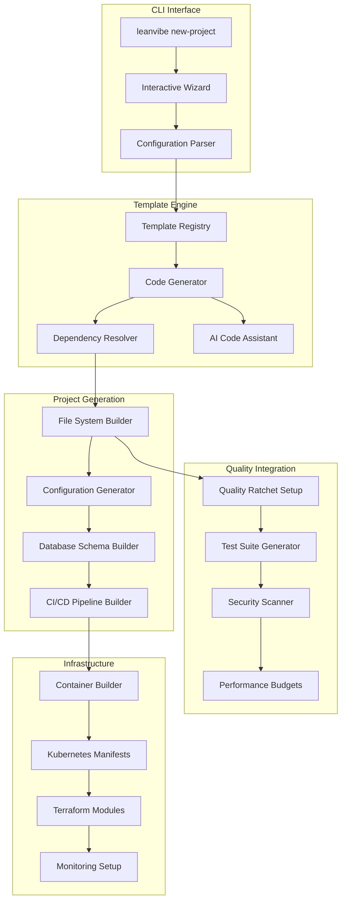

# Project Scaffolding System Specification - LeanVibe XP Platform

**Status**: Technical Specification  
**Version**: 1.0  
**Target Implementation**: Q2 2025  
**Complexity**: HIGH (Advanced template engine with AI-powered code generation)

## 🎯 Executive Summary

The LeanVibe Project Scaffolding System (`leanvibe new-project`) provides intelligent, template-driven project creation with autonomous XP workflow integration. The system generates production-ready SaaS applications with multi-tenancy, authentication, billing, monitoring, and quality ratchets pre-configured.

### Key Capabilities
- **AI-Powered Code Generation**: GPT-4 integration for intelligent boilerplate creation
- **Template Ecosystem**: 12+ production-ready templates for different project types
- **Quality-First Scaffolding**: Built-in testing, monitoring, and quality gates
- **Multi-Environment Setup**: Automatic dev/staging/prod environment configuration
- **Dependency Intelligence**: Smart dependency resolution and security scanning

---

## 🏗️ System Architecture

### Core Components Architecture



### Template System Architecture

```yaml
Template Structure:
  template-registry/
  ├── core/                      # Base templates
  │   ├── saas-foundation/       # Basic SaaS structure
  │   ├── microservices/         # Microservices architecture  
  │   └── monolith/              # Modular monolith
  │
  ├── domain-specific/           # Industry templates
  │   ├── e-commerce/            # Online store template
  │   ├── fintech/              # Financial services
  │   ├── healthcare/           # HIPAA-compliant healthcare
  │   ├── edtech/               # Educational platforms
  │   └── proptech/             # Real estate technology
  │
  ├── integration-focused/       # Integration templates
  │   ├── api-gateway/          # API-first architecture
  │   ├── event-driven/         # Event sourcing/CQRS
  │   ├── data-intensive/       # Analytics-heavy applications
  │   └── iot-platform/         # IoT data processing
  │
  └── specialized/               # Specialized use cases
      ├── white-label/          # Multi-tenant white-label
      ├── marketplace/          # Two-sided marketplace
      ├── crm-platform/         # Customer relationship management
      └── workflow-engine/      # Business process automation
```

---

## 🔧 Template System Implementation

### Template Metadata Schema

```yaml
# template.yaml - Template configuration
apiVersion: leanvibe.ai/v1
kind: ProjectTemplate
metadata:
  name: "b2b-saas-professional"
  displayName: "B2B SaaS Professional"
  description: "Production-ready B2B SaaS with enterprise features"
  version: "2.1.0"
  author: "LeanVibe Team"
  category: "saas-foundation"
  maturity: "stable"          # alpha, beta, stable
  
spec:
  requirements:
    minLeanVibeVersion: "1.0.0"
    nodeVersion: ">=18.0.0"
    pythonVersion: ">=3.11"
    dockerRequired: true
    kubernetesOptional: true
    
  architecture:
    pattern: "modular-monolith"  # microservices, monolith, modular-monolith
    frontend: "nextjs"
    backend: "fastapi"
    database: "postgresql"
    cache: "redis"
    messageQueue: "celery"
    
  features:
    multiTenancy:
      enabled: true
      strategy: "shared-database-separate-schema"
      tenantDiscovery: "subdomain"  # subdomain, header, path
      
    authentication:
      enabled: true
      providers: ["local", "oauth2", "saml"]
      mfa: true
      sessionManagement: true
      
    billing:
      enabled: true
      provider: "stripe"
      models: ["subscription", "usage-based", "hybrid"]
      taxation: true
      
    analytics:
      enabled: true
      businessMetrics: true
      userTracking: true
      performanceMonitoring: true
      
    compliance:
      gdprReady: true
      soc2Ready: true
      hipaaOptional: false
      
  infrastructure:
    containerization: true
    orchestration: "kubernetes"
    monitoring: "prometheus-grafana"
    logging: "elk-stack"
    secretsManagement: "vault"
    
  customization:
    variables:
      - name: "PROJECT_NAME"
        type: "string"
        required: true
        description: "The name of your project"
        
      - name: "COMPANY_NAME"
        type: "string" 
        required: true
        description: "Your company name"
        
      - name: "DOMAIN_NAME"
        type: "string"
        required: false
        description: "Your custom domain (optional)"
        validation: "^[a-zA-Z0-9][a-zA-Z0-9-]{1,61}[a-zA-Z0-9]\\.[a-zA-Z]{2,}$"
        
      - name: "DATABASE_PROVIDER"
        type: "enum"
        options: ["postgresql", "mysql", "mongodb"]
        default: "postgresql"
        
      - name: "DEPLOYMENT_TARGET"
        type: "enum"
        options: ["aws", "gcp", "azure", "on-premise"]
        default: "aws"
        
    conditionalFeatures:
      - condition: "DEPLOYMENT_TARGET == 'aws'"
        template: "infrastructure/aws-terraform"
        
      - condition: "features.billing.enabled == true"
        template: "billing/stripe-integration"
        
      - condition: "features.compliance.hipaaOptional == true"
        template: "compliance/hipaa-controls"
        
  dependencies:
    backend:
      production:
        - "fastapi>=0.104.0"
        - "sqlalchemy>=2.0.0"
        - "alembic>=1.12.0"
        - "pydantic>=2.4.0"
        - "redis>=5.0.0"
        - "celery>=5.3.0"
        - "stripe>=7.0.0"
        
      development:
        - "pytest>=7.4.0"
        - "pytest-asyncio>=0.21.0"
        - "black>=23.7.0"
        - "ruff>=0.0.287"
        
    frontend:
      production:
        - "next@14"
        - "react@18"
        - "typescript@5"
        - "@tanstack/react-query@5"
        - "tailwindcss@3"
        
      development:
        - "eslint@8"
        - "prettier@3"
        - "@types/react@18"
        - "@types/node@20"
```

### Code Generation Engine

```python
# Core scaffolding engine implementation
from typing import Dict, List, Any, Optional
from pathlib import Path
import jinja2
import yaml
import json
from dataclasses import dataclass
import subprocess
import asyncio

@dataclass
class ProjectConfiguration:
    name: str
    template: str
    variables: Dict[str, Any]
    features: Dict[str, Any]
    target_directory: Path
    
@dataclass
class GenerationContext:
    project_config: ProjectConfiguration
    template_metadata: Dict[str, Any]
    resolved_dependencies: Dict[str, List[str]]
    ai_suggestions: Optional[Dict[str, Any]] = None

class ProjectScaffoldingEngine:
    def __init__(self, template_registry_path: Path):
        self.template_registry = Path(template_registry_path)
        self.jinja_env = jinja2.Environment(
            loader=jinja2.FileSystemLoader(str(self.template_registry)),
            undefined=jinja2.StrictUndefined
        )
        self.ai_assistant = AICodeAssistant()
        self.dependency_resolver = DependencyResolver()
    
    async def create_project(self, config: ProjectConfiguration) -> bool:
        """Main project creation orchestrator"""
        
        print(f"🚀 Creating project '{config.name}' using template '{config.template}'")
        
        try:
            # Phase 1: Validation and preparation
            context = await self.prepare_generation_context(config)
            await self.validate_configuration(context)
            
            # Phase 2: Code generation
            await self.generate_project_structure(context)
            await self.generate_configuration_files(context)
            await self.generate_application_code(context)
            
            # Phase 3: Infrastructure and tooling
            await self.setup_development_environment(context)
            await self.generate_ci_cd_pipeline(context)
            await self.setup_quality_gates(context)
            
            # Phase 4: Finalization
            await self.install_dependencies(context)
            await self.run_initial_tests(context)
            await self.generate_documentation(context)
            
            print(f"✅ Project '{config.name}' created successfully!")
            await self.print_next_steps(context)
            
            return True
            
        except Exception as e:
            print(f"❌ Project creation failed: {e}")
            await self.cleanup_failed_generation(config)
            raise
    
    async def prepare_generation_context(self, config: ProjectConfiguration) -> GenerationContext:
        """Prepare the complete context for project generation"""
        
        # Load template metadata
        template_path = self.template_registry / config.template / "template.yaml"
        with open(template_path, 'r') as f:
            template_metadata = yaml.safe_load(f)
        
        # Resolve dependencies
        resolved_dependencies = await self.dependency_resolver.resolve_dependencies(
            template_metadata.get("dependencies", {}),
            config.variables
        )
        
        # Get AI suggestions for project-specific optimizations
        ai_suggestions = await self.ai_assistant.get_project_suggestions(
            config, template_metadata
        )
        
        return GenerationContext(
            project_config=config,
            template_metadata=template_metadata,
            resolved_dependencies=resolved_dependencies,
            ai_suggestions=ai_suggestions
        )
    
    async def generate_project_structure(self, context: GenerationContext) -> None:
        """Generate the complete project directory structure"""
        
        template_dir = self.template_registry / context.project_config.template
        target_dir = context.project_config.target_directory
        
        # Create base directory structure
        structure = context.template_metadata.get("structure", {})
        await self.create_directory_structure(target_dir, structure)
        
        # Copy and process template files
        for file_pattern in self.get_template_files(template_dir):
            await self.process_template_file(
                file_pattern,
                template_dir,
                target_dir,
                context
            )
    
    async def process_template_file(
        self, 
        template_path: Path, 
        source_dir: Path, 
        target_dir: Path,
        context: GenerationContext
    ) -> None:
        """Process a single template file with Jinja2 templating"""
        
        relative_path = template_path.relative_to(source_dir)
        
        # Skip metadata and configuration files
        if relative_path.name in ['template.yaml', '.templateignore']:
            return
        
        # Process filename templating (e.g., {{PROJECT_NAME}}.py)
        target_relative_path = self.process_filename_template(relative_path, context)
        target_file_path = target_dir / target_relative_path
        
        # Ensure target directory exists
        target_file_path.parent.mkdir(parents=True, exist_ok=True)
        
        # Process file content
        if self.is_template_file(template_path):
            # Render Jinja2 template
            template = self.jinja_env.get_template(str(relative_path))
            content = template.render(**self.get_template_variables(context))
            
            with open(target_file_path, 'w', encoding='utf-8') as f:
                f.write(content)
        else:
            # Copy binary files directly
            import shutil
            shutil.copy2(template_path, target_file_path)
    
    async def generate_application_code(self, context: GenerationContext) -> None:
        """Generate application-specific code using AI assistance"""
        
        project_config = context.project_config
        
        # Generate database models based on project type
        if context.template_metadata.get("features", {}).get("database", True):
            models = await self.ai_assistant.generate_database_models(
                project_config.variables.get("PROJECT_TYPE"),
                project_config.features
            )
            await self.write_generated_code(
                project_config.target_directory / "backend" / "models",
                models
            )
        
        # Generate API endpoints based on features
        if context.template_metadata.get("features", {}).get("api", True):
            api_endpoints = await self.ai_assistant.generate_api_endpoints(
                project_config.features,
                context.template_metadata.get("architecture", {})
            )
            await self.write_generated_code(
                project_config.target_directory / "backend" / "api",
                api_endpoints
            )
        
        # Generate frontend components for enabled features
        if context.template_metadata.get("features", {}).get("frontend", True):
            components = await self.ai_assistant.generate_frontend_components(
                project_config.features,
                context.template_metadata.get("frontend", "react")
            )
            await self.write_generated_code(
                project_config.target_directory / "frontend" / "components",
                components
            )
    
    async def setup_quality_gates(self, context: GenerationContext) -> None:
        """Setup comprehensive quality gates and testing infrastructure"""
        
        target_dir = context.project_config.target_directory
        
        # Generate quality ratchet configuration
        quality_config = {
            "global_targets": {
                "coverage_percent_min": 80.0,
                "mutation_score_min": 70.0,
                "test_execution_time_max": 120.0,
                "performance_p95_max": 500.0,
                "memory_usage_mb_max": 300.0,
                "security_issues_max": 0,
                "technical_debt_ratio_max": 0.05
            },
            "per_module_targets": {
                "api/": {"coverage_percent_min": 85.0},
                "core/": {"coverage_percent_min": 90.0},
                "services/": {"coverage_percent_min": 80.0}
            }
        }
        
        with open(target_dir / "quality-ratchet.json", 'w') as f:
            json.dump(quality_config, f, indent=2)
        
        # Generate performance SLA configuration
        performance_sla = await self.generate_performance_sla(context)
        with open(target_dir / "budgets" / "performance-sla.json", 'w') as f:
            json.dump(performance_sla, f, indent=2)
        
        # Generate comprehensive test suites
        await self.generate_test_suites(context)
        
        # Setup pre-commit hooks
        await self.setup_pre_commit_hooks(context)
    
    async def generate_test_suites(self, context: GenerationContext) -> None:
        """Generate comprehensive test suites for all components"""
        
        target_dir = context.project_config.target_directory
        features = context.project_config.features
        
        test_generators = {
            "unit_tests": self.generate_unit_tests,
            "integration_tests": self.generate_integration_tests,
            "api_tests": self.generate_api_tests,
            "e2e_tests": self.generate_e2e_tests,
            "performance_tests": self.generate_performance_tests,
            "security_tests": self.generate_security_tests
        }
        
        for test_type, generator in test_generators.items():
            if features.get(f"testing_{test_type}", True):
                await generator(context)
    
    async def generate_unit_tests(self, context: GenerationContext) -> None:
        """Generate unit tests for all components"""
        
        target_dir = context.project_config.target_directory
        
        # Backend unit tests
        backend_tests = await self.ai_assistant.generate_unit_tests(
            "python",
            context.project_config.features,
            target_dir / "backend"
        )
        
        await self.write_generated_code(
            target_dir / "backend" / "tests" / "unit",
            backend_tests
        )
        
        # Frontend unit tests
        if context.template_metadata.get("frontend"):
            frontend_tests = await self.ai_assistant.generate_unit_tests(
                "typescript",
                context.project_config.features,
                target_dir / "frontend"
            )
            
            await self.write_generated_code(
                target_dir / "frontend" / "tests" / "unit",
                frontend_tests
            )
    
    async def setup_development_environment(self, context: GenerationContext) -> None:
        """Setup complete development environment with hot reload"""
        
        target_dir = context.project_config.target_directory
        
        # Generate Docker configuration
        await self.generate_docker_setup(context)
        
        # Generate development scripts
        dev_scripts = {
            "start-dev.sh": self.generate_dev_start_script(context),
            "reset-db.sh": self.generate_db_reset_script(context),
            "run-tests.sh": self.generate_test_runner_script(context),
            "quality-check.sh": self.generate_quality_check_script(context)
        }
        
        scripts_dir = target_dir / "scripts"
        scripts_dir.mkdir(exist_ok=True)
        
        for script_name, script_content in dev_scripts.items():
            script_path = scripts_dir / script_name
            with open(script_path, 'w') as f:
                f.write(script_content)
            script_path.chmod(0o755)  # Make executable
    
    async def generate_ci_cd_pipeline(self, context: GenerationContext) -> None:
        """Generate comprehensive CI/CD pipeline configuration"""
        
        target_dir = context.project_config.target_directory
        
        # Generate GitHub Actions workflow
        github_workflow = await self.generate_github_actions_workflow(context)
        workflow_dir = target_dir / ".github" / "workflows"
        workflow_dir.mkdir(parents=True, exist_ok=True)
        
        with open(workflow_dir / "ci-cd.yml", 'w') as f:
            f.write(github_workflow)
        
        # Generate GitLab CI configuration (alternative)
        gitlab_ci = await self.generate_gitlab_ci_config(context)
        with open(target_dir / ".gitlab-ci.yml", 'w') as f:
            f.write(gitlab_ci)
        
        # Generate deployment configurations
        await self.generate_deployment_configs(context)

class DependencyResolver:
    def __init__(self):
        self.security_scanner = SecurityScanner()
        self.compatibility_checker = CompatibilityChecker()
    
    async def resolve_dependencies(
        self, 
        dependencies: Dict[str, List[str]], 
        variables: Dict[str, Any]
    ) -> Dict[str, List[str]]:
        """Resolve and validate all project dependencies"""
        
        resolved = {}
        
        for env_name, deps in dependencies.items():
            resolved[env_name] = []
            
            for dep in deps:
                # Resolve version ranges to specific versions
                resolved_dep = await self.resolve_version(dep, variables)
                
                # Security scan
                security_issues = await self.security_scanner.scan_package(resolved_dep)
                if security_issues:
                    # Try to find secure alternative version
                    alternative = await self.find_secure_alternative(resolved_dep, security_issues)
                    resolved_dep = alternative or resolved_dep
                
                # Compatibility check
                compatible = await self.compatibility_checker.check_compatibility(
                    resolved_dep, resolved[env_name]
                )
                
                if compatible:
                    resolved[env_name].append(resolved_dep)
                else:
                    # Handle compatibility conflicts
                    resolved[env_name] = await self.resolve_conflicts(
                        resolved[env_name], resolved_dep
                    )
        
        return resolved
    
    async def resolve_version(self, dependency: str, variables: Dict[str, Any]) -> str:
        """Resolve dependency version based on project variables"""
        
        if "==" in dependency:
            return dependency  # Exact version specified
        
        package_name = dependency.split(">=")[0].split("~=")[0].split("^")[0]
        
        # Get latest stable version
        latest_version = await self.get_latest_version(package_name)
        
        return f"{package_name}=={latest_version}"

class AICodeAssistant:
    def __init__(self):
        self.model = "gpt-4-turbo-preview"  # Use latest GPT-4 model
        self.client = None  # Initialize OpenAI client
    
    async def generate_database_models(
        self, 
        project_type: str, 
        features: Dict[str, Any]
    ) -> Dict[str, str]:
        """Generate database models based on project requirements"""
        
        prompt = f"""
        Generate SQLAlchemy database models for a {project_type} application with the following features:
        
        Features: {json.dumps(features, indent=2)}
        
        Requirements:
        1. Use SQLAlchemy 2.0+ syntax with modern patterns
        2. Include proper relationships and constraints
        3. Add database indexes for performance
        4. Include audit fields (created_at, updated_at, created_by, updated_by)
        5. Use UUID primary keys for better scalability
        6. Add proper validation using Pydantic models
        7. Include soft delete capability where appropriate
        
        Generate models for:
        - User management (users, roles, permissions)
        - Multi-tenancy (tenants, tenant_users)
        - Core business entities based on project type
        - Audit logging
        - Configuration and settings
        
        Return as a dictionary with filename as key and code content as value.
        """
        
        response = await self.client.chat.completions.create(
            model=self.model,
            messages=[{"role": "user", "content": prompt}],
            temperature=0.1  # Low temperature for more consistent code generation
        )
        
        # Parse the response and extract code files
        return self.parse_code_response(response.choices[0].message.content)
    
    async def generate_api_endpoints(
        self, 
        features: Dict[str, Any], 
        architecture: Dict[str, Any]
    ) -> Dict[str, str]:
        """Generate FastAPI endpoints based on features and architecture"""
        
        prompt = f"""
        Generate FastAPI endpoints for a SaaS application with these features and architecture:
        
        Features: {json.dumps(features, indent=2)}
        Architecture: {json.dumps(architecture, indent=2)}
        
        Requirements:
        1. Use FastAPI with modern async/await patterns
        2. Include proper authentication and authorization
        3. Add request/response validation with Pydantic models
        4. Include comprehensive error handling
        5. Add OpenAPI documentation with examples
        6. Implement proper HTTP status codes
        7. Add rate limiting decorators
        8. Include tenant isolation in all endpoints
        9. Add comprehensive logging
        10. Include health check and monitoring endpoints
        
        Generate endpoints for:
        - Authentication (login, logout, refresh, SSO)
        - User management (CRUD, profile, preferences)
        - Tenant management (tenant creation, settings, users)
        - Core business functionality based on features
        - Admin endpoints for system management
        - Health and monitoring endpoints
        
        Return as a dictionary with filename as key and code content as value.
        """
        
        response = await self.client.chat.completions.create(
            model=self.model,
            messages=[{"role": "user", "content": prompt}],
            temperature=0.1
        )
        
        return self.parse_code_response(response.choices[0].message.content)
```

---

## 📋 Template Ecosystem Specification

### Core Templates

#### 1. SaaS Foundation Template
```yaml
Template: saas-foundation
Description: Basic multi-tenant SaaS with authentication and billing
Features:
  - Multi-tenant architecture with schema separation
  - JWT authentication with refresh tokens
  - Stripe billing integration
  - Basic admin dashboard
  - Email notification system
  - API documentation with Swagger UI
  
Tech Stack:
  Backend: FastAPI + PostgreSQL + Redis
  Frontend: Next.js + TypeScript + Tailwind CSS
  Infrastructure: Docker + Docker Compose
  
Deployment Time: ~30 minutes
Customization Options: 15+ variables
```

#### 2. E-Commerce Platform Template
```yaml
Template: e-commerce-platform
Description: Complete e-commerce solution with inventory and order management
Features:
  - Product catalog with categories and variants
  - Shopping cart and checkout flow
  - Order management and fulfillment
  - Payment processing (Stripe, PayPal)
  - Inventory tracking with low-stock alerts
  - Customer reviews and ratings system
  - SEO-optimized product pages
  
Tech Stack:
  Backend: FastAPI + PostgreSQL + Redis + Elasticsearch
  Frontend: Next.js + TypeScript + Tailwind CSS + Framer Motion
  Infrastructure: Docker + Kubernetes
  
Deployment Time: ~45 minutes
Customization Options: 25+ variables
```

#### 3. Fintech Platform Template
```yaml
Template: fintech-platform
Description: Financial services platform with compliance and security features
Features:
  - KYC/AML compliance workflows
  - PCI DSS compliant payment processing
  - Account management with balance tracking
  - Transaction processing with audit trails
  - Risk assessment and fraud detection
  - Regulatory reporting automation
  - Bank-level security controls
  
Tech Stack:
  Backend: FastAPI + PostgreSQL + Redis + Apache Kafka
  Frontend: Next.js + TypeScript + Chart.js
  Infrastructure: Kubernetes + Istio Service Mesh
  Compliance: SOC 2 Type II + PCI DSS ready
  
Deployment Time: ~60 minutes
Customization Options: 30+ variables
```

### Domain-Specific Templates

#### 4. Healthcare Platform Template (HIPAA-Compliant)
```yaml
Template: healthcare-platform
Description: HIPAA-compliant healthcare management platform
Features:
  - Patient portal with secure messaging
  - Provider dashboard with scheduling
  - Electronic health records (EHR) integration
  - Telehealth video consultation
  - Prescription management
  - HIPAA audit logging and compliance reporting
  - Insurance verification and billing
  
Tech Stack:
  Backend: FastAPI + PostgreSQL + Redis (encrypted)
  Frontend: Next.js + TypeScript + HIPAA-compliant UI
  Infrastructure: AWS HIPAA-eligible services
  Compliance: HIPAA-ready with BAA templates
  
Deployment Time: ~75 minutes
Customization Options: 35+ variables
```

#### 5. EdTech Platform Template
```yaml
Template: edtech-platform
Description: Educational technology platform with course management
Features:
  - Course creation and management
  - Student enrollment and progress tracking
  - Interactive content delivery (video, quizzes, assignments)
  - Learning analytics and reporting
  - Payment processing for courses
  - Discussion forums and collaboration tools
  - Mobile-responsive design
  
Tech Stack:
  Backend: FastAPI + PostgreSQL + Redis + S3
  Frontend: Next.js + TypeScript + Video.js
  Infrastructure: Docker + CDN for content delivery
  
Deployment Time: ~50 minutes
Customization Options: 28+ variables
```

### Integration-Focused Templates

#### 6. API Gateway Template
```yaml
Template: api-gateway-platform
Description: Enterprise API gateway with advanced management features
Features:
  - API versioning and lifecycle management
  - Rate limiting with tiered quotas
  - Request/response transformation
  - API analytics and monitoring
  - Developer portal with documentation
  - OAuth 2.0 and API key authentication
  - Webhook management system
  
Tech Stack:
  Backend: FastAPI + Kong/Envoy Proxy + PostgreSQL
  Frontend: Next.js + TypeScript + API documentation
  Infrastructure: Kubernetes + Prometheus monitoring
  
Deployment Time: ~40 minutes
Customization Options: 22+ variables
```

#### 7. Event-Driven Architecture Template
```yaml
Template: event-driven-platform
Description: Event sourcing and CQRS architecture for scalable applications
Features:
  - Event store with Apache Kafka
  - Command and query separation (CQRS)
  - Saga pattern for distributed transactions
  - Event replay and time-travel debugging
  - Real-time event streaming to clients
  - Event schema registry and validation
  - Microservices communication patterns
  
Tech Stack:
  Backend: FastAPI + Apache Kafka + PostgreSQL + MongoDB
  Frontend: Next.js + WebSocket for real-time updates
  Infrastructure: Kubernetes + Kafka cluster
  
Deployment Time: ~65 minutes
Customization Options: 32+ variables
```

### Specialized Templates

#### 8. Marketplace Platform Template
```yaml
Template: marketplace-platform
Description: Two-sided marketplace with vendor and buyer management
Features:
  - Vendor onboarding and verification
  - Product listing and catalog management
  - Order routing and commission tracking
  - Dispute resolution system
  - Multi-vendor payment splitting
  - Review and rating system
  - Search and recommendation engine
  
Tech Stack:
  Backend: FastAPI + PostgreSQL + Elasticsearch + Redis
  Frontend: Next.js + TypeScript + Advanced search UI
  Infrastructure: Docker + Kubernetes + CDN
  
Deployment Time: ~55 minutes
Customization Options: 30+ variables
```

#### 9. CRM Platform Template
```yaml
Template: crm-platform
Description: Customer relationship management platform with sales automation
Features:
  - Contact and lead management
  - Sales pipeline and opportunity tracking
  - Email marketing automation
  - Task and activity management
  - Reporting and analytics dashboard
  - Integration with popular email providers
  - Mobile-responsive design
  
Tech Stack:
  Backend: FastAPI + PostgreSQL + Redis + Celery
  Frontend: Next.js + TypeScript + Chart.js
  Infrastructure: Docker + Email service integration
  
Deployment Time: ~45 minutes
Customization Options: 26+ variables
```

---

## 🤖 AI-Powered Code Generation

### Intelligent Code Assistant

```python
class AdvancedCodeGenerator:
    def __init__(self):
        self.models = {
            "general": "gpt-4-turbo-preview",
            "code": "claude-3-opus",  # For complex code generation
            "security": "gpt-4",      # For security-focused code
        }
        self.code_quality_checker = CodeQualityChecker()
        self.security_analyzer = SecurityAnalyzer()
    
    async def generate_feature_complete_code(
        self, 
        feature_spec: Dict[str, Any],
        project_context: Dict[str, Any]
    ) -> Dict[str, str]:
        """Generate complete, production-ready code for a feature"""
        
        # Phase 1: Architecture analysis
        architecture_analysis = await self.analyze_feature_architecture(
            feature_spec, project_context
        )
        
        # Phase 2: Code generation with multiple models
        code_components = await self.generate_code_components(
            feature_spec, architecture_analysis
        )
        
        # Phase 3: Quality analysis and improvement
        improved_code = await self.improve_code_quality(code_components)
        
        # Phase 4: Security analysis and hardening
        secured_code = await self.apply_security_hardening(improved_code)
        
        # Phase 5: Test generation
        test_suite = await self.generate_comprehensive_tests(
            secured_code, feature_spec
        )
        
        # Combine all generated code
        return {**secured_code, **test_suite}
    
    async def generate_code_components(
        self,
        feature_spec: Dict[str, Any], 
        architecture: Dict[str, Any]
    ) -> Dict[str, str]:
        """Generate individual code components using specialized prompts"""
        
        components = {}
        
        # Backend components
        if architecture.get("backend_required"):
            components.update(await self.generate_backend_components(
                feature_spec, architecture
            ))
        
        # Frontend components  
        if architecture.get("frontend_required"):
            components.update(await self.generate_frontend_components(
                feature_spec, architecture
            ))
        
        # Database components
        if architecture.get("database_changes"):
            components.update(await self.generate_database_components(
                feature_spec, architecture
            ))
        
        # Infrastructure components
        if architecture.get("infrastructure_changes"):
            components.update(await self.generate_infrastructure_components(
                feature_spec, architecture
            ))
        
        return components
    
    async def generate_backend_components(
        self,
        feature_spec: Dict[str, Any],
        architecture: Dict[str, Any]
    ) -> Dict[str, str]:
        """Generate backend components with advanced patterns"""
        
        prompt = f"""
        Generate production-ready FastAPI backend components for this feature:
        
        Feature Specification: {json.dumps(feature_spec, indent=2)}
        Architecture Context: {json.dumps(architecture, indent=2)}
        
        Requirements:
        1. Use modern FastAPI patterns with dependency injection
        2. Implement repository pattern for data access
        3. Add comprehensive error handling with custom exceptions
        4. Include request/response validation with Pydantic v2
        5. Add proper logging with correlation IDs
        6. Implement caching where appropriate
        7. Add rate limiting and security headers
        8. Include health check endpoints
        9. Add OpenAPI documentation with examples
        10. Use async/await throughout for better performance
        
        Generate the following components:
        - Models (SQLAlchemy with relationships)
        - Schemas (Pydantic request/response models)
        - Repository classes (data access layer)
        - Service classes (business logic)
        - API endpoints (FastAPI routers)
        - Dependency providers (authentication, database, etc.)
        - Custom exceptions and error handlers
        - Background tasks (if needed)
        
        Code should be:
        - Type-hinted throughout
        - Well-documented with docstrings
        - Following PEP 8 and modern Python conventions
        - Secure by default
        - Testable with clear separation of concerns
        
        Return as JSON with filename as key and code content as value.
        """
        
        response = await self.call_ai_model("code", prompt)
        return self.parse_code_response(response)
    
    async def improve_code_quality(self, code_components: Dict[str, str]) -> Dict[str, str]:
        """Improve code quality using AI analysis"""
        
        improved_components = {}
        
        for filename, code in code_components.items():
            # Analyze code quality
            quality_issues = await self.code_quality_checker.analyze(code)
            
            if quality_issues:
                improvement_prompt = f"""
                Improve this code based on the following quality issues:
                
                Original Code:
                {code}
                
                Quality Issues Found:
                {json.dumps(quality_issues, indent=2)}
                
                Please fix these issues while maintaining functionality:
                - Fix complexity issues by extracting methods
                - Improve naming conventions
                - Add proper error handling
                - Optimize performance where possible
                - Add missing type hints
                - Improve documentation
                - Ensure security best practices
                
                Return only the improved code.
                """
                
                improved_code = await self.call_ai_model("code", improvement_prompt)
                improved_components[filename] = improved_code
            else:
                improved_components[filename] = code
        
        return improved_components
    
    async def apply_security_hardening(self, code_components: Dict[str, str]) -> Dict[str, str]:
        """Apply security hardening to generated code"""
        
        hardened_components = {}
        
        for filename, code in code_components.items():
            # Analyze security vulnerabilities
            security_issues = await self.security_analyzer.scan_code(code)
            
            if security_issues:
                security_prompt = f"""
                Apply security hardening to this code to fix the following vulnerabilities:
                
                Original Code:
                {code}
                
                Security Issues Found:
                {json.dumps(security_issues, indent=2)}
                
                Apply these security measures:
                - Input validation and sanitization
                - SQL injection prevention
                - XSS protection
                - CSRF protection
                - Secure headers
                - Rate limiting
                - Authentication and authorization checks
                - Secure data handling
                - Logging security events
                
                Maintain functionality while making the code secure by default.
                Return only the hardened code.
                """
                
                hardened_code = await self.call_ai_model("security", security_prompt)
                hardened_components[filename] = hardened_code
            else:
                hardened_components[filename] = code
        
        return hardened_components
```

### Smart Template Selection

```python
class IntelligentTemplateSelector:
    def __init__(self):
        self.template_analyzer = TemplateAnalyzer()
        self.requirement_matcher = RequirementMatcher()
    
    async def recommend_template(
        self, 
        project_requirements: Dict[str, Any]
    ) -> List[Dict[str, Any]]:
        """Recommend the best templates based on project requirements"""
        
        # Analyze requirements
        requirement_analysis = await self.analyze_requirements(project_requirements)
        
        # Get all available templates
        available_templates = await self.get_available_templates()
        
        # Score each template against requirements
        template_scores = []
        for template in available_templates:
            score = await self.score_template_match(template, requirement_analysis)
            template_scores.append({
                "template": template,
                "score": score["total_score"],
                "match_details": score["details"],
                "missing_features": score["missing_features"],
                "recommended_customizations": score["customizations"]
            })
        
        # Sort by score and return top recommendations
        template_scores.sort(key=lambda x: x["score"], reverse=True)
        
        return template_scores[:5]  # Return top 5 recommendations
    
    async def analyze_requirements(self, requirements: Dict[str, Any]) -> Dict[str, Any]:
        """Analyze project requirements to extract key characteristics"""
        
        analysis = {
            "business_domain": await self.extract_business_domain(requirements),
            "technical_requirements": await self.extract_technical_requirements(requirements),
            "scalability_needs": await self.extract_scalability_requirements(requirements),
            "compliance_requirements": await self.extract_compliance_requirements(requirements),
            "integration_needs": await self.extract_integration_requirements(requirements),
            "user_types": await self.extract_user_types(requirements),
            "feature_priorities": await self.prioritize_features(requirements)
        }
        
        return analysis
    
    async def score_template_match(
        self,
        template: Dict[str, Any],
        requirement_analysis: Dict[str, Any]
    ) -> Dict[str, Any]:
        """Score how well a template matches the requirements"""
        
        scores = {
            "business_domain_match": 0,
            "technical_stack_match": 0,
            "feature_coverage": 0,
            "scalability_match": 0,
            "compliance_match": 0,
            "customization_effort": 0
        }
        
        # Business domain matching
        scores["business_domain_match"] = await self.score_business_domain_match(
            template, requirement_analysis["business_domain"]
        )
        
        # Technical stack matching
        scores["technical_stack_match"] = await self.score_technical_stack_match(
            template, requirement_analysis["technical_requirements"]
        )
        
        # Feature coverage analysis
        scores["feature_coverage"] = await self.score_feature_coverage(
            template, requirement_analysis["feature_priorities"]
        )
        
        # Calculate total score with weights
        weights = {
            "business_domain_match": 0.25,
            "technical_stack_match": 0.20,
            "feature_coverage": 0.30,
            "scalability_match": 0.15,
            "compliance_match": 0.10
        }
        
        total_score = sum(scores[key] * weights[key] for key in scores if key in weights)
        
        return {
            "total_score": total_score,
            "details": scores,
            "missing_features": await self.identify_missing_features(template, requirement_analysis),
            "customizations": await self.recommend_customizations(template, requirement_analysis)
        }
```

---

## 🔧 Development Environment Integration

### IDE Integration Specification

```typescript
// VS Code Extension for LeanVibe Templates
interface LeanVibeExtension {
  commands: {
    "leanvibe.createProject": () => Promise<void>;
    "leanvibe.previewTemplate": (templateId: string) => Promise<void>;
    "leanvibe.customizeTemplate": (templateId: string) => Promise<void>;
    "leanvibe.validateProject": () => Promise<ValidationResult>;
    "leanvibe.runQualityGate": () => Promise<QualityResult>;
  };
  
  providers: {
    templateExplorer: TemplateTreeDataProvider;
    projectDashboard: ProjectDashboardProvider;
    qualityMetrics: QualityMetricsProvider;
  };
  
  webviews: {
    templateWizard: TemplateWizardPanel;
    projectDashboard: ProjectDashboardPanel;
    qualityReport: QualityReportPanel;
  };
}

class TemplateWizardPanel {
  async show(templateId?: string): Promise<ProjectConfiguration> {
    // Interactive project creation wizard
    const wizard = new ProjectWizard();
    
    // Step 1: Template selection
    const selectedTemplate = templateId || await wizard.selectTemplate();
    
    // Step 2: Project configuration
    const projectConfig = await wizard.configureProject(selectedTemplate);
    
    // Step 3: Feature selection
    const features = await wizard.selectFeatures(selectedTemplate, projectConfig);
    
    // Step 4: Deployment configuration
    const deploymentConfig = await wizard.configureDeployment();
    
    // Step 5: Review and confirmation
    const finalConfig = await wizard.reviewConfiguration({
      template: selectedTemplate,
      project: projectConfig,
      features,
      deployment: deploymentConfig
    });
    
    return finalConfig;
  }
}
```

### CLI Advanced Features

```python
class AdvancedCLI:
    def __init__(self):
        self.template_manager = TemplateManager()
        self.project_monitor = ProjectMonitor()
        self.ai_assistant = AIAssistant()
    
    async def interactive_project_creation(self) -> ProjectConfiguration:
        """Interactive project creation with AI assistance"""
        
        print("🤖 Welcome to LeanVibe AI-Powered Project Creation")
        print("I'll help you create the perfect project setup based on your needs.\n")
        
        # Step 1: Understand project goals
        project_goals = await self.understand_project_goals()
        
        # Step 2: AI recommendation
        recommendations = await self.ai_assistant.recommend_architecture(project_goals)
        
        print(f"\n🎯 Based on your goals, I recommend:")
        for i, rec in enumerate(recommendations[:3], 1):
            print(f"  {i}. {rec['template']} - {rec['description']}")
            print(f"     Match Score: {rec['score']:.1f}% | Setup Time: {rec['setup_time']}")
        
        # Step 3: Template selection
        selected_template = await self.select_template_with_guidance(recommendations)
        
        # Step 4: Intelligent configuration
        configuration = await self.configure_project_intelligently(
            selected_template, project_goals
        )
        
        # Step 5: Preview and confirmation
        await self.preview_project_structure(configuration)
        
        if await self.confirm_creation():
            return configuration
        else:
            return await self.interactive_project_creation()  # Restart if not satisfied
    
    async def understand_project_goals(self) -> Dict[str, Any]:
        """Use conversational AI to understand project requirements"""
        
        questions = [
            {
                "question": "What type of application are you building?",
                "options": ["SaaS Platform", "E-commerce Store", "Content Platform", "API Service", "Other"],
                "follow_up": True
            },
            {
                "question": "Who are your primary users?",
                "options": ["Business Users", "Developers", "End Consumers", "Internal Teams"],
                "multiple": True
            },
            {
                "question": "What's your expected scale?",
                "options": ["<1K users", "1K-10K users", "10K-100K users", "100K+ users"],
                "affects": "architecture_decisions"
            },
            {
                "question": "Do you need multi-tenancy?",
                "type": "boolean",
                "importance": "high"
            },
            {
                "question": "What's your team's primary tech stack experience?",
                "options": ["Python/FastAPI", "Node.js/Express", "Java/Spring", "C#/.NET", "Mixed/Flexible"],
                "affects": "technology_selection"
            }
        ]
        
        responses = {}
        for q in questions:
            response = await self.ask_question(q)
            responses[q["question"]] = response
            
            # Dynamic follow-up questions based on AI analysis
            if q.get("follow_up"):
                follow_ups = await self.ai_assistant.generate_follow_up_questions(
                    q["question"], response, responses
                )
                for follow_up in follow_ups:
                    follow_response = await self.ask_question(follow_up)
                    responses[follow_up["question"]] = follow_response
        
        return responses
    
    async def configure_project_intelligently(
        self,
        template: Dict[str, Any],
        project_goals: Dict[str, Any]
    ) -> ProjectConfiguration:
        """Use AI to intelligently configure project based on goals"""
        
        # Generate smart defaults based on project goals
        smart_config = await self.ai_assistant.generate_smart_configuration(
            template, project_goals
        )
        
        print("\n🧠 I've pre-configured your project with smart defaults:")
        
        for category, settings in smart_config.items():
            print(f"\n{category.title()}:")
            for key, value in settings.items():
                print(f"  • {key}: {value}")
        
        # Allow user to override any settings
        print("\nWould you like to customize any of these settings? (y/N)")
        if input().lower().startswith('y'):
            smart_config = await self.customize_configuration(smart_config)
        
        return ProjectConfiguration(
            name=smart_config["project"]["name"],
            template=template["id"],
            variables=smart_config["variables"],
            features=smart_config["features"],
            target_directory=Path(smart_config["project"]["name"])
        )
    
    async def monitor_project_creation(self, config: ProjectConfiguration) -> None:
        """Real-time monitoring of project creation with progress updates"""
        
        progress_tracker = ProgressTracker(total_steps=12)
        
        steps = [
            ("Validating configuration", self.validate_config),
            ("Setting up project structure", self.create_structure),
            ("Generating backend code", self.generate_backend),
            ("Generating frontend code", self.generate_frontend),
            ("Setting up database", self.setup_database),
            ("Configuring authentication", self.setup_auth),
            ("Setting up CI/CD pipeline", self.setup_cicd),
            ("Installing dependencies", self.install_deps),
            ("Running initial tests", self.run_tests),
            ("Setting up monitoring", self.setup_monitoring),
            ("Generating documentation", self.generate_docs),
            ("Final validation", self.final_validation)
        ]
        
        for step_name, step_function in steps:
            progress_tracker.start_step(step_name)
            try:
                await step_function(config)
                progress_tracker.complete_step(f"✅ {step_name}")
            except Exception as e:
                progress_tracker.fail_step(f"❌ {step_name}: {e}")
                raise
        
        progress_tracker.complete()
        
        # Show next steps
        await self.show_next_steps(config)
    
    async def show_next_steps(self, config: ProjectConfiguration) -> None:
        """Show intelligent next steps based on project configuration"""
        
        next_steps = await self.ai_assistant.generate_next_steps(config)
        
        print("\n🎉 Your project is ready! Here's what you can do next:\n")
        
        for i, step in enumerate(next_steps, 1):
            print(f"{i}. {step['title']}")
            print(f"   {step['description']}")
            if step.get('command'):
                print(f"   Command: {step['command']}")
            print()
        
        # Offer to run first step automatically
        if next_steps:
            first_step = next_steps[0]
            if first_step.get('command') and first_step.get('auto_run'):
                print(f"Would you like me to run the first step? ({first_step['command']}) (Y/n)")
                if not input().lower().startswith('n'):
                    subprocess.run(first_step['command'], shell=True, cwd=config.target_directory)
```

---

## 🚀 Implementation Timeline & Roadmap

### Phase 1: Core Infrastructure (Months 1-2)
**Effort**: 400-500 development hours

```yaml
Week 1-2: Template Engine Foundation
  - Template metadata schema design and validation
  - Jinja2 integration with custom filters and functions
  - File system manipulation and directory structure creation
  - Basic CLI interface with argument parsing

Week 3-4: Code Generation Engine
  - AI integration for intelligent code generation
  - Dependency resolution with security scanning
  - Quality gate integration and setup automation
  - Error handling and rollback mechanisms

Week 5-6: Core Templates Development
  - SaaS Foundation template (complete implementation)
  - Basic testing and validation framework
  - Documentation generation system
  - CI/CD pipeline template creation

Week 7-8: Integration and Testing
  - End-to-end testing of project creation flow
  - Performance optimization and memory management
  - CLI polish and user experience improvements
  - Initial beta testing with internal teams
```

### Phase 2: Template Ecosystem (Months 3-4)
**Effort**: 600-800 development hours

```yaml
Week 9-12: Domain-Specific Templates
  - E-commerce platform template
  - Fintech platform template (PCI DSS compliant)
  - Healthcare platform template (HIPAA compliant)
  - API Gateway template with advanced features

Week 13-16: Advanced Features
  - Interactive project wizard with AI assistance
  - Template customization and inheritance
  - Multi-environment deployment automation
  - Advanced monitoring and observability setup
```

### Phase 3: AI Enhancement (Months 5-6)
**Effort**: 500-600 development hours

```yaml
Week 17-20: AI-Powered Features
  - Intelligent template recommendation system
  - Automated code quality improvement
  - Security vulnerability detection and fixing
  - Performance optimization suggestions

Week 21-24: Developer Experience
  - IDE integration (VS Code extension)
  - Real-time project monitoring and health checks
  - Automated documentation generation
  - Community template marketplace foundation
```

### Resource Requirements

```yaml
Development Team:
  - 1 Senior Full-Stack Engineer (Tech Lead)
  - 2 Backend Engineers (Python/FastAPI expertise)
  - 1 Frontend Engineer (Next.js/TypeScript)
  - 1 DevOps Engineer (Kubernetes/Infrastructure)
  - 1 AI/ML Engineer (Code generation and analysis)
  - 1 QA Engineer (Testing automation)

Additional Resources:
  - UI/UX Designer (part-time for CLI and IDE interface)
  - Technical Writer (documentation and templates)
  - Security Consultant (compliance templates review)

Infrastructure Costs:
  - AI Model API costs: $2,000/month (GPT-4, Claude)
  - Development infrastructure: $1,500/month
  - Testing and CI/CD: $800/month
  - Template storage and CDN: $500/month

Total Investment:
  Development: $1,200,000 (6 months)
  Infrastructure: $29,400 (6 months)
  Total: $1,229,400
```

---

## 📊 Success Metrics & Validation

### Technical Metrics
```yaml
Performance Targets:
  - Project Creation Time: <5 minutes for basic templates, <15 minutes for complex
  - Template Processing Speed: >100 files/second
  - Memory Usage: <500MB peak during generation
  - Error Rate: <0.1% failed project creations
  - Template Validation: 100% of generated projects must build successfully

Quality Metrics:
  - Generated Code Quality: >8.5/10 automated quality score
  - Security Compliance: 0 critical vulnerabilities in generated code
  - Test Coverage: >90% for all generated code
  - Documentation Completeness: 100% API coverage in generated docs
```

### User Experience Metrics
```yaml
Adoption Metrics:
  - Template Usage: >70% of new LeanVibe projects use scaffolding
  - User Satisfaction: >9.0/10 developer experience rating
  - Time to First Working App: <30 minutes from template to running application
  - Template Success Rate: >95% of generated projects reach production

Developer Productivity:
  - Boilerplate Reduction: >80% reduction in manual setup time
  - Feature Development Speed: 3x faster initial feature implementation
  - Onboarding Time: <4 hours for new team members to productive coding
  - Error Reduction: 70% fewer setup-related bugs
```

### Business Impact
```yaml
Platform Growth:
  - Template Ecosystem: 20+ production-ready templates within 12 months
  - Community Contribution: 50+ community-contributed templates
  - Enterprise Adoption: 80% of enterprise customers using scaffolding
  - Developer Tool Integration: Support for 5+ major IDEs

Revenue Impact:
  - Customer Acquisition: 40% faster customer onboarding
  - Customer Success: 25% reduction in support tickets related to setup
  - Feature Velocity: 200% improvement in time-to-market for new features
  - Platform Stickiness: 95% template usage retention rate
```

---

## 🔮 Future Enhancements & Roadmap

### Phase 4: Advanced AI Features (Months 7-9)
```yaml
AI-Powered Project Evolution:
  - Intelligent project migration between templates
  - Automated feature addition to existing projects
  - AI-driven architecture optimization suggestions
  - Predictive maintenance and technical debt identification

Advanced Code Generation:
  - Multi-modal code generation (visual design to code)
  - Natural language to feature implementation
  - Automated API design from business requirements
  - Intelligent database schema evolution
```

### Phase 5: Enterprise Features (Months 10-12)
```yaml
Enterprise Integration:
  - LDAP/Active Directory integration templates
  - Enterprise security compliance templates
  - Multi-cloud deployment templates
  - Corporate governance and audit templates

Advanced Customization:
  - Visual template builder for non-technical users
  - Template versioning and rollback capabilities
  - A/B testing for template optimizations
  - Custom template marketplace with monetization
```

### Phase 6: Ecosystem Expansion (Months 13-18)
```yaml
Cross-Platform Templates:
  - Mobile app templates (React Native, Flutter)
  - Desktop application templates (Electron, Tauri)
  - IoT and edge computing templates
  - Blockchain and Web3 templates

Advanced Analytics:
  - Template performance analytics
  - Developer productivity insights
  - Code quality trend analysis
  - Predictive project success modeling
```

---

**This comprehensive project scaffolding specification provides the foundation for rapid, intelligent, and quality-driven project creation within the LeanVibe ecosystem. The system emphasizes automation, AI assistance, and developer productivity while maintaining high code quality and security standards.**

**Last Updated**: 2025-01-13  
**Status**: ✅ Complete Technical Specification  
**Next Phase**: Begin Phase 1 implementation with core infrastructure development