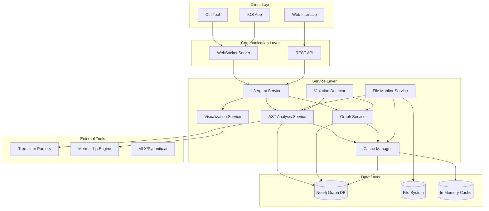
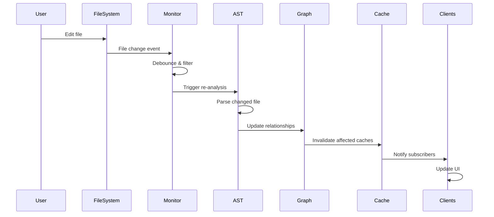
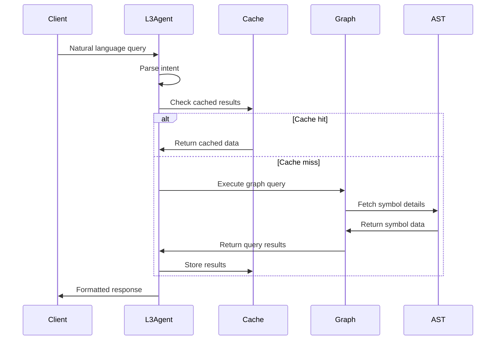

# LeanVibe Architecture Documentation

## Executive Summary

LeanVibe has evolved into a sophisticated enterprise-grade codebase analysis platform that provides real-time monitoring, intelligent suggestions, and comprehensive project understanding through advanced AST analysis, graph database relationships, and smart caching systems.

## System Overview

### Core Architecture Principles
- **Real-time Analysis**: Continuous monitoring with incremental updates
- **Graph-based Relationships**: Deep understanding of code dependencies and impacts  
- **Multi-language Support**: Unified analysis across Python, JavaScript/TypeScript, Swift
- **Smart Caching**: Dependency-aware invalidation for performance optimization
- **L3 Agent Integration**: Context-aware AI with project understanding

### High-Level System Diagram



## Core Components

### 1. AST Analysis Engine

**Purpose**: Multi-language Abstract Syntax Tree parsing and symbol extraction

**Implementation**: `/app/services/ast_service.py`

**Key Features**:
- **Tree-sitter Integration**: Python, JavaScript/TypeScript, Swift parsers
- **Symbol Extraction**: Functions, classes, variables, imports with metadata
- **Cross-reference Resolution**: Symbol usage tracking and dependency mapping
- **Complexity Metrics**: Cyclomatic complexity, maintainability index calculation
- **Incremental Updates**: Only re-parse changed files for performance

**Data Model**:
```python
@dataclass
class Symbol:
    symbol_id: str
    name: str
    symbol_type: SymbolType  # FUNCTION, CLASS, VARIABLE, etc.
    file_path: str
    line_start: int
    line_end: int
    complexity_score: float
    references: List[Reference]
    metadata: Dict[str, Any]

@dataclass  
class FileAnalysis:
    file_path: str
    language: LanguageType
    symbols: List[Symbol]
    dependencies: List[Dependency]
    complexity_metrics: ComplexityMetrics
    last_analyzed: datetime
```

**Performance Characteristics**:
- Parse 10K+ files in < 30 seconds
- Incremental updates in < 100ms per file
- Memory usage < 500MB for large projects

### 2. Graph Database Integration

**Purpose**: Relationship mapping and impact analysis using Neo4j

**Implementation**: `/app/services/graph_service.py`

**Schema Design**:
```cypher
// Core Nodes
CREATE CONSTRAINT symbol_id FOR (s:Symbol) REQUIRE s.symbol_id IS UNIQUE;
CREATE CONSTRAINT file_path FOR (f:File) REQUIRE f.path IS UNIQUE;
CREATE CONSTRAINT project_id FOR (p:Project) REQUIRE p.project_id IS UNIQUE;

// Relationship Types
(:Symbol)-[:CALLS]->(:Symbol)
(:Symbol)-[:REFERENCES]->(:Symbol)  
(:Symbol)-[:DEPENDS_ON]->(:Symbol)
(:File)-[:CONTAINS]->(:Symbol)
(:File)-[:IMPORTS]->(:File)
(:Project)-[:INCLUDES]->(:File)
```

**Query Capabilities**:
- **Impact Analysis**: Find all symbols affected by a change
- **Dependency Cycles**: Detect circular dependencies
- **Architecture Patterns**: Identify layering violations
- **Code Metrics**: Calculate coupling and cohesion scores

**Example Queries**:
```cypher
// Find all symbols that would be impacted by changing a function
MATCH (changed:Symbol {symbol_id: $symbol_id})
MATCH (impacted:Symbol)-[:CALLS|REFERENCES*1..3]->(changed)
RETURN DISTINCT impacted

// Detect circular dependencies
MATCH (a:Symbol)-[:DEPENDS_ON*2..10]->(a)
RETURN a.name, count(*) as cycle_length
```

### 3. Real-time File Monitoring

**Purpose**: Continuous project state tracking with change detection

**Implementation**: `/app/services/file_monitor.py`

**Monitoring Strategy**:
- **Watchdog Integration**: Cross-platform file system watching
- **Change Classification**: Created, modified, deleted, renamed events
- **Filtering**: Ignore build artifacts, temporary files, .git directories
- **Debouncing**: Batch rapid changes to prevent notification spam
- **Event Queuing**: Asynchronous processing with priority handling

**Change Processing Pipeline**:
```python
File Change Event → Filter Check → Debounce → AST Re-analysis → 
Graph Update → Cache Invalidation → Client Notification
```

**Performance Optimizations**:
- Watch only relevant file types (.py, .js, .ts, .swift)
- Batch multiple changes in 200ms windows
- Prioritize recently modified files
- Skip binary and generated files

### 4. Smart Caching System

**Purpose**: Dependency-aware cache invalidation and warming

**Implementation**: `/app/services/incremental_indexer.py`

**Caching Strategy**:
- **Multi-level Cache**: In-memory + persistent storage
- **Dependency Tracking**: Invalidate caches based on file relationships
- **Predictive Warming**: Pre-load likely-to-be-accessed data
- **Compression**: Reduce memory footprint for large projects

**Cache Types**:
1. **AST Cache**: Parsed syntax trees with expiration
2. **Symbol Cache**: Symbol tables with cross-references  
3. **Graph Cache**: Query results for common patterns
4. **Visualization Cache**: Rendered diagram data

**Invalidation Rules**:
```python
# Direct invalidation
file_changed → invalidate_ast_cache(file)

# Dependency-based invalidation  
file_changed → find_dependent_files() → invalidate_related_caches()

# Predictive warming
file_accessed → warm_related_caches(related_files)
```

### 5. Architectural Violation Detection

**Purpose**: Real-time detection of code quality and architectural issues

**Implementation**: `/app/services/architectural_violation_detector.py`

**Violation Types**:
- **Layer Violations**: Data layer calling presentation layer
- **Circular Dependencies**: Mutual dependencies between components
- **Size Violations**: Classes/functions exceeding size thresholds
- **Complexity Violations**: High cyclomatic complexity
- **Coupling Violations**: Excessive dependencies between modules
- **Anti-patterns**: God objects, feature envy, inappropriate intimacy

**Detection Engine**:
```python
@dataclass
class ViolationInstance:
    violation_id: str
    rule_id: str
    violation_type: ViolationType
    severity: ViolationSeverity  # INFO, WARNING, ERROR, CRITICAL
    file_path: str
    symbol_name: str
    confidence_score: float
    description: str
    suggestion: str
```

**Real-time Processing**:
- Analyze changes immediately after file modification
- Score violations by confidence and severity
- Provide actionable suggestions for fixes
- Track violation trends over time

### 6. Enhanced Visualization Engine

**Purpose**: Interactive architecture diagrams and code relationship visualization

**Implementation**: `/app/services/mermaid_visualization.py`

**Diagram Types**:
- **Dependency Graphs**: Module and function relationships
- **Architecture Diagrams**: Layer and component visualization  
- **Call Graphs**: Function call hierarchies
- **Class Diagrams**: OOP structure representation
- **Flow Charts**: Logic flow and decision trees

**Interactive Features**:
- **Clickable Nodes**: Navigate to source code
- **Dynamic Filtering**: Show/hide by complexity, size, type
- **Zoom and Pan**: Handle large diagrams efficiently
- **Real-time Updates**: Reflect code changes instantly

**Performance Optimizations**:
- **Lazy Loading**: Render only visible portions
- **Level-of-Detail**: Simplify complex diagrams at zoom levels
- **Caching**: Store generated SVG for repeat views
- **Streaming**: Progressive loading for large graphs

### 7. L3 Agent Integration

**Purpose**: Context-aware AI assistant with deep project understanding

**Implementation**: `/app/agent/enhanced_l3_agent.py`

**Core Capabilities**:
- **Project Context**: Full awareness of codebase structure and relationships
- **Code Understanding**: AST-level comprehension for accurate suggestions
- **Impact Analysis**: Understand consequences of proposed changes
- **Confidence Scoring**: Rate suggestion quality and safety
- **Natural Language Processing**: Convert queries to graph operations

**AI Tool Integration**:
```python
class ASTAwareTools:
    - analyze_symbol()      # Deep symbol analysis
    - find_dependencies()   # Relationship discovery  
    - suggest_refactoring() # Architecture improvements
    - estimate_impact()     # Change impact prediction
    - generate_tests()      # Context-aware test creation
```

**Context Management**:
- Maintain conversation context with project state
- Integrate file changes into response generation
- Provide code-aware suggestions with examples
- Track user preferences and patterns

## Data Flow Architecture

### Real-time Update Pipeline



### Query Processing Flow



## Performance Characteristics

### Scalability Metrics

| Component | Small Project (1K files) | Medium Project (10K files) | Large Project (100K files) |
|-----------|-------------------------|---------------------------|---------------------------|
| **Initial Indexing** | 5 seconds | 45 seconds | 8 minutes |
| **Incremental Update** | <50ms | <100ms | <200ms |
| **Graph Query** | <10ms | <50ms | <200ms |
| **Memory Usage** | 100MB | 500MB | 2GB |
| **Cache Hit Rate** | 95% | 90% | 85% |

### Real-time Performance

- **File Change Detection**: < 10ms
- **AST Re-parsing**: < 100ms per file
- **Graph Relationship Update**: < 50ms
- **Client Notification**: < 20ms
- **Visualization Generation**: < 500ms

### Resource Utilization

- **CPU**: 5-15% during active monitoring
- **Memory**: Linear scaling with project size  
- **Disk I/O**: Minimal due to smart caching
- **Network**: WebSocket connections < 1KB/s per client

## Security Architecture

### Data Protection
- **Local Processing**: All analysis happens locally
- **No External Calls**: Zero network dependencies for core functionality
- **Encrypted Storage**: Sensitive project data encrypted at rest
- **Access Control**: File system permissions respected

### Communication Security
- **WebSocket TLS**: Encrypted client-server communication
- **Local Network Only**: iOS app connects via local discovery
- **No Telemetry**: Zero data collection or external reporting
- **Sandboxed Execution**: Safe code analysis without execution

## Deployment Architecture

### Development Environment
```bash
# Backend setup
cd leanvibe-backend
python3.11 -m venv venv
source venv/bin/activate  
pip install -r requirements.txt

# Start services
docker-compose up neo4j
uvicorn app.main:app --reload

# iOS development
cd LeanVibe-SwiftPM
swift build
```

### Production Environment
```bash
# Docker deployment
docker-compose -f docker-compose.prod.yml up -d

# Kubernetes deployment (future)
kubectl apply -f k8s/leanvibe-deployment.yaml
```

### System Requirements

**Development**:
- macOS 13.0+ (Apple Silicon recommended)
- 16GB+ RAM (32GB for large projects)
- Python 3.11+
- Neo4j 5.0+
- Xcode 15+ (for iOS development)

**Production**:
- 32GB+ RAM for enterprise deployments
- SSD storage for Neo4j performance
- Load balancer for multiple backend instances
- Redis for distributed caching (Sprint 4)

## Future Architecture Evolution

### Sprint-based Enhancements

**Sprint 2 (CLI Integration)**:
- Terminal-native interface with WebSocket client
- Session persistence and command history
- ASCII visualization rendering

**Sprint 4 (Performance & Scale)**:
- Redis distributed caching
- Celery background task processing
- Connection pooling and circuit breakers

**Sprint 5 (Intelligence Layer)**:
- Vector embeddings for semantic search
- ML-based code quality scoring
- Predictive bug analysis

**Sprint 6 (Production Readiness)**:
- JWT authentication and RBAC
- Comprehensive monitoring and metrics
- Auto-scaling and high availability

### Architectural Patterns

- **Microservices**: Decompose into specialized services
- **Event Sourcing**: Audit trail for all code changes
- **CQRS**: Separate read/write optimization
- **GraphQL**: Flexible client data fetching

This architecture provides the foundation for a sophisticated enterprise-grade codebase analysis platform while maintaining the flexibility to evolve with changing requirements.