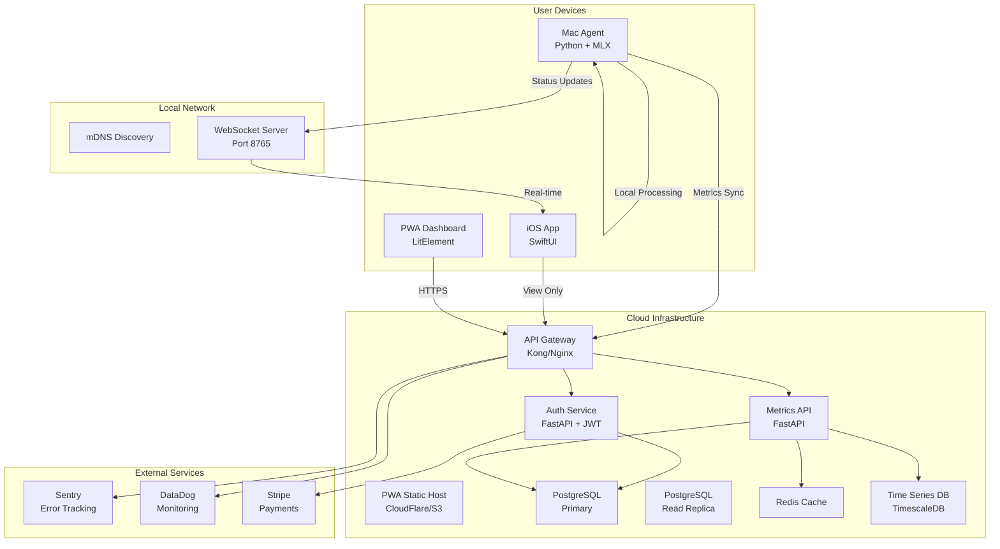

# LeanVibe Production Architecture

## 1. SYSTEM ARCHITECTURE

### Component Diagram with Data Flow



### Service Boundaries and Responsibilities

**1. Mac Agent (Local)**
```python
# agent/core.py
class LeanVibeAgent:
    """
    Responsibilities:
    - Local AI inference
    - Project indexing
    - Code suggestions
    - Optional cloud sync
    """
    def __init__(self):
        self.llm = MLXCodeLlama()
        self.indexer = ProjectIndexer()
        self.vector_db = ChromaDB()
        self.sync_service = CloudSyncService(optional=True)
```

**2. Auth Service (Cloud)**
```python
# services/auth/main.py
class AuthService:
    """
    Responsibilities:
    - User registration/login
    - JWT token management
    - Device pairing
    - Subscription management
    """
    async def authenticate(self, credentials: UserCredentials) -> Token:
        # Verify user and generate JWT
        pass
```

**3. Metrics Service (Cloud)**
```python
# services/metrics/main.py
class MetricsService:
    """
    Responsibilities:
    - Aggregate usage data
    - Performance analytics
    - Dashboard data API
    - Time-series storage
    """
    async def record_metrics(self, metrics: AgentMetrics) -> None:
        # Store in TimescaleDB for analytics
        pass
```

**4. PWA Dashboard (Cloud)**
```javascript
// pwa/src/components/dashboard.js
export class LeanVibeDashboard extends LitElement {
    /**
     * Responsibilities:
     * - Visualize metrics
     * - Project management
     * - Settings configuration
     * - Team collaboration (future)
     */
}
```

### Scaling Considerations for 10x Growth

**Current Scale**: 200 users → **Target Scale**: 2,000 users

1. **Database Scaling**
   - Implement read replicas for metrics queries
   - Partition tables by user_id and timestamp
   - Use connection pooling (pgBouncer)

2. **API Scaling**
   ```python
   # infrastructure/scaling.py
   SCALING_CONFIG = {
       "api_servers": {
           "current": 2,
           "target": 6,
           "auto_scale": True,
           "min_instances": 2,
           "max_instances": 10
       },
       "database": {
           "connection_pool": 100,
           "read_replicas": 2,
           "sharding_strategy": "user_id_hash"
       },
       "cache": {
           "redis_cluster": True,
           "nodes": 3,
           "memory_per_node": "4GB"
       }
   }
   ```

3. **CDN Strategy**
   - Static assets on CloudFlare
   - PWA cached at edge locations
   - Model downloads via BitTorrent (future)

## 2. DATABASE SCHEMA

### Entity Relationships

```sql
-- Users and Authentication
CREATE TABLE users (
    id UUID PRIMARY KEY DEFAULT gen_random_uuid(),
    email VARCHAR(255) UNIQUE NOT NULL,
    password_hash VARCHAR(255) NOT NULL,
    created_at TIMESTAMPTZ DEFAULT NOW(),
    updated_at TIMESTAMPTZ DEFAULT NOW(),
    subscription_tier VARCHAR(50) DEFAULT 'free',
    subscription_expires_at TIMESTAMPTZ
);

CREATE TABLE devices (
    id UUID PRIMARY KEY DEFAULT gen_random_uuid(),
    user_id UUID REFERENCES users(id) ON DELETE CASCADE,
    device_type VARCHAR(50) NOT NULL, -- 'mac_agent', 'ios_app', 'pwa'
    device_name VARCHAR(255) NOT NULL,
    device_token VARCHAR(255) UNIQUE NOT NULL,
    last_seen_at TIMESTAMPTZ DEFAULT NOW(),
    created_at TIMESTAMPTZ DEFAULT NOW()
);

-- Projects and Code Context
CREATE TABLE projects (
    id UUID PRIMARY KEY DEFAULT gen_random_uuid(),
    user_id UUID REFERENCES users(id) ON DELETE CASCADE,
    name VARCHAR(255) NOT NULL,
    path VARCHAR(1024) NOT NULL,
    language VARCHAR(50) NOT NULL,
    file_count INTEGER DEFAULT 0,
    total_lines INTEGER DEFAULT 0,
    indexed_at TIMESTAMPTZ,
    created_at TIMESTAMPTZ DEFAULT NOW(),
    UNIQUE(user_id, path)
);

-- Suggestions and Learning
CREATE TABLE suggestions (
    id UUID PRIMARY KEY DEFAULT gen_random_uuid(),
    project_id UUID REFERENCES projects(id) ON DELETE CASCADE,
    file_path VARCHAR(1024) NOT NULL,
    line_number INTEGER NOT NULL,
    prompt TEXT NOT NULL,
    suggestion TEXT NOT NULL,
    confidence FLOAT NOT NULL CHECK (confidence >= 0 AND confidence <= 1),
    accepted BOOLEAN,
    rejected BOOLEAN,
    created_at TIMESTAMPTZ DEFAULT NOW(),
    response_time_ms INTEGER
);

-- Metrics (TimescaleDB Hypertable)
CREATE TABLE agent_metrics (
    time TIMESTAMPTZ NOT NULL,
    user_id UUID NOT NULL,
    project_id UUID NOT NULL,
    suggestions_made INTEGER DEFAULT 0,
    suggestions_accepted INTEGER DEFAULT 0,
    files_processed INTEGER DEFAULT 0,
    tokens_generated INTEGER DEFAULT 0,
    memory_usage_mb INTEGER,
    cpu_usage_percent FLOAT
);

-- Convert to TimescaleDB hypertable
SELECT create_hypertable('agent_metrics', 'time');

-- Audit and Security
CREATE TABLE audit_log (
    id BIGSERIAL PRIMARY KEY,
    user_id UUID,
    action VARCHAR(255) NOT NULL,
    resource_type VARCHAR(100),
    resource_id UUID,
    ip_address INET,
    user_agent TEXT,
    created_at TIMESTAMPTZ DEFAULT NOW()
);
```

### Performance Indexes

```sql
-- User and auth indexes
CREATE INDEX idx_users_email ON users(email);
CREATE INDEX idx_users_subscription ON users(subscription_tier, subscription_expires_at);
CREATE INDEX idx_devices_user_token ON devices(user_id, device_token);

-- Project indexes
CREATE INDEX idx_projects_user_id ON projects(user_id);
CREATE INDEX idx_projects_indexed ON projects(indexed_at) WHERE indexed_at IS NOT NULL;

-- Suggestion indexes for ML improvement
CREATE INDEX idx_suggestions_project_file ON suggestions(project_id, file_path);
CREATE INDEX idx_suggestions_accepted ON suggestions(accepted) WHERE accepted = true;
CREATE INDEX idx_suggestions_confidence ON suggestions(confidence);

-- Metrics indexes (TimescaleDB auto-creates time-based indexes)
CREATE INDEX idx_metrics_user_time ON agent_metrics(user_id, time DESC);
CREATE INDEX idx_metrics_project_time ON agent_metrics(project_id, time DESC);

-- Audit log indexes
CREATE INDEX idx_audit_user_time ON audit_log(user_id, created_at DESC);
CREATE INDEX idx_audit_action ON audit_log(action, created_at DESC);
```

### Migration Strategy

```python
# migrations/env.py
from alembic import context
from sqlalchemy import engine_from_config, pool

class MigrationManager:
    """
    Zero-downtime migration strategy:
    1. Add new columns as nullable
    2. Backfill data in batches
    3. Add constraints after backfill
    4. Create indexes CONCURRENTLY
    """
    
    @staticmethod
    def safe_add_column(table, column, type, default=None):
        op.add_column(table, sa.Column(column, type, nullable=True))
        if default:
            op.execute(f"UPDATE {table} SET {column} = {default} WHERE {column} IS NULL")
        op.alter_column(table, column, nullable=False)
    
    @staticmethod
    def create_index_safely(name, table, columns):
        # PostgreSQL concurrent index creation
        op.execute(f"CREATE INDEX CONCURRENTLY {name} ON {table}({','.join(columns)})")
```

## 3. API DESIGN

### RESTful Endpoints

```python
# api/routes.py
from fastapi import FastAPI, Depends, HTTPException
from fastapi.security import HTTPBearer, HTTPAuthorizationCredentials

app = FastAPI(title="LeanVibe API", version="1.0.0")
security = HTTPBearer()

# Authentication endpoints
@app.post("/api/v1/auth/register")
async def register(user: UserCreate) -> Token:
    """Register new user account"""
    pass

@app.post("/api/v1/auth/login")
async def login(credentials: UserCredentials) -> Token:
    """Login and receive JWT token"""
    pass

@app.post("/api/v1/auth/refresh")
async def refresh_token(token: str) -> Token:
    """Refresh expired JWT token"""
    pass

# Device management
@app.post("/api/v1/devices/pair")
async def pair_device(
    device: DevicePair,
    auth: HTTPAuthorizationCredentials = Depends(security)
) -> DeviceToken:
    """Pair new device with user account"""
    pass

@app.get("/api/v1/devices")
async def list_devices(
    auth: HTTPAuthorizationCredentials = Depends(security)
) -> List[Device]:
    """List all paired devices"""
    pass

# Project management
@app.get("/api/v1/projects")
async def list_projects(
    auth: HTTPAuthorizationCredentials = Depends(security)
) -> List[Project]:
    """List user's projects"""
    pass

@app.get("/api/v1/projects/{project_id}/metrics")
async def get_project_metrics(
    project_id: UUID,
    timeframe: str = "7d",
    auth: HTTPAuthorizationCredentials = Depends(security)
) -> ProjectMetrics:
    """Get project metrics and analytics"""
    pass

# Metrics ingestion
@app.post("/api/v1/metrics/agent")
async def record_agent_metrics(
    metrics: AgentMetrics,
    auth: HTTPAuthorizationCredentials = Depends(security)
) -> None:
    """Record agent performance metrics"""
    pass

# Suggestion feedback
@app.post("/api/v1/suggestions/{suggestion_id}/feedback")
async def suggestion_feedback(
    suggestion_id: UUID,
    feedback: SuggestionFeedback,
    auth: HTTPAuthorizationCredentials = Depends(security)
) -> None:
    """Record user feedback on suggestions"""
    pass
```

### Authentication/Authorization Flow

```python
# auth/jwt_handler.py
from datetime import datetime, timedelta
from jose import jwt, JWTError
from passlib.context import CryptContext

class JWTHandler:
    SECRET_KEY = os.getenv("JWT_SECRET_KEY")
    ALGORITHM = "HS256"
    ACCESS_TOKEN_EXPIRE_MINUTES = 30
    REFRESH_TOKEN_EXPIRE_DAYS = 30
    
    pwd_context = CryptContext(schemes=["bcrypt"], deprecated="auto")
    
    @classmethod
    def create_access_token(cls, user_id: str) -> str:
        expire = datetime.utcnow() + timedelta(minutes=cls.ACCESS_TOKEN_EXPIRE_MINUTES)
        payload = {
            "sub": user_id,
            "exp": expire,
            "type": "access"
        }
        return jwt.encode(payload, cls.SECRET_KEY, algorithm=cls.ALGORITHM)
    
    @classmethod
    def verify_token(cls, token: str) -> dict:
        try:
            payload = jwt.decode(token, cls.SECRET_KEY, algorithms=[cls.ALGORITHM])
            return payload
        except JWTError:
            raise HTTPException(status_code=401, detail="Invalid token")

# middleware/auth.py
async def get_current_user(
    credentials: HTTPAuthorizationCredentials = Depends(security)
) -> User:
    token = credentials.credentials
    payload = JWTHandler.verify_token(token)
    user = await get_user_by_id(payload["sub"])
    if not user:
        raise HTTPException(status_code=401, detail="User not found")
    return user
```

### Rate Limiting Approach

```python
# middleware/rate_limit.py
from fastapi import Request
from fastapi.responses import JSONResponse
import redis
from datetime import datetime, timedelta

class RateLimiter:
    def __init__(self, redis_client: redis.Redis):
        self.redis = redis_client
        self.limits = {
            "default": {"requests": 100, "window": 60},  # 100 req/min
            "metrics": {"requests": 1000, "window": 60},  # 1000 req/min
            "auth": {"requests": 10, "window": 60},      # 10 req/min
        }
    
    async def check_rate_limit(
        self, 
        request: Request, 
        endpoint_type: str = "default"
    ) -> bool:
        # Use IP + User ID for rate limiting
        user_id = request.state.user_id if hasattr(request.state, "user_id") else "anonymous"
        key = f"rate_limit:{endpoint_type}:{request.client.host}:{user_id}"
        
        limit = self.limits.get(endpoint_type, self.limits["default"])
        
        try:
            current = await self.redis.incr(key)
            if current == 1:
                await self.redis.expire(key, limit["window"])
            
            if current > limit["requests"]:
                return False
            return True
        except Exception as e:
            # If Redis fails, allow request
            logger.error(f"Rate limit check failed: {e}")
            return True

# Apply to routes
@app.middleware("http")
async def rate_limit_middleware(request: Request, call_next):
    limiter = RateLimiter(redis_client)
    
    # Determine endpoint type
    endpoint_type = "default"
    if "/metrics" in request.url.path:
        endpoint_type = "metrics"
    elif "/auth" in request.url.path:
        endpoint_type = "auth"
    
    if not await limiter.check_rate_limit(request, endpoint_type):
        return JSONResponse(
            status_code=429,
            content={"detail": "Rate limit exceeded"},
            headers={"Retry-After": "60"}
        )
    
    response = await call_next(request)
    return response
```

## 4. SECURITY MEASURES

### Data Encryption Strategy

```python
# security/encryption.py
from cryptography.fernet import Fernet
from cryptography.hazmat.primitives import hashes
from cryptography.hazmat.primitives.kdf.pbkdf2 import PBKDF2HMAC
import base64

class EncryptionService:
    """
    Multi-layer encryption strategy:
    1. TLS 1.3 for all API communication
    2. AES-256 for data at rest
    3. Field-level encryption for sensitive data
    """
    
    def __init__(self):
        self.master_key = os.getenv("MASTER_ENCRYPTION_KEY")
        
    def encrypt_field(self, data: str, salt: bytes = None) -> tuple[str, str]:
        """Encrypt sensitive field data"""
        if not salt:
            salt = os.urandom(16)
        
        kdf = PBKDF2HMAC(
            algorithm=hashes.SHA256(),
            length=32,
            salt=salt,
            iterations=100000,
        )
        key = base64.urlsafe_b64encode(kdf.derive(self.master_key.encode()))
        f = Fernet(key)
        
        encrypted = f.encrypt(data.encode())
        return base64.b64encode(encrypted).decode(), base64.b64encode(salt).decode()
    
    def decrypt_field(self, encrypted_data: str, salt: str) -> str:
        """Decrypt sensitive field data"""
        salt_bytes = base64.b64decode(salt)
        
        kdf = PBKDF2HMAC(
            algorithm=hashes.SHA256(),
            length=32,
            salt=salt_bytes,
            iterations=100000,
        )
        key = base64.urlsafe_b64encode(kdf.derive(self.master_key.encode()))
        f = Fernet(key)
        
        decrypted = f.decrypt(base64.b64decode(encrypted_data))
        return decrypted.decode()

# Database encryption at rest
"""
PostgreSQL configuration for encryption at rest:
1. Enable TDE (Transparent Data Encryption)
2. Use encrypted EBS volumes on AWS
3. Regular key rotation every 90 days
"""
```

### OWASP Top 10 Mitigation

```python
# security/owasp_protection.py

# 1. Injection Prevention
from sqlalchemy import text
from sqlalchemy.orm import Session

class SecureQuery:
    @staticmethod
    def safe_query(db: Session, query: str, params: dict):
        """Use parameterized queries to prevent SQL injection"""
        # Never use string formatting for queries
        # Always use parameterized queries
        return db.execute(text(query), params)

# 2. Broken Authentication
class AuthenticationProtection:
    """
    - Strong password policy
    - MFA support
    - Session timeout
    - Secure password reset
    """
    MIN_PASSWORD_LENGTH = 12
    SESSION_TIMEOUT_MINUTES = 30
    MAX_LOGIN_ATTEMPTS = 5
    LOCKOUT_DURATION_MINUTES = 15

# 3. Sensitive Data Exposure
SENSITIVE_FIELDS = ["password", "api_key", "device_token", "suggestion"]
class DataMasking:
    @staticmethod
    def mask_response(data: dict) -> dict:
        """Mask sensitive fields in API responses"""
        for field in SENSITIVE_FIELDS:
            if field in data:
                data[field] = "***REDACTED***"
        return data

# 4. XML External Entities (XXE)
# Not applicable - JSON-only API

# 5. Broken Access Control
from functools import wraps

def require_permission(permission: str):
    """Decorator for permission-based access control"""
    def decorator(func):
        @wraps(func)
        async def wrapper(*args, **kwargs):
            user = kwargs.get("current_user")
            if not user or permission not in user.permissions:
                raise HTTPException(status_code=403, detail="Insufficient permissions")
            return await func(*args, **kwargs)
        return wrapper
    return decorator

# 6. Security Misconfiguration
SECURITY_HEADERS = {
    "X-Content-Type-Options": "nosniff",
    "X-Frame-Options": "DENY",
    "X-XSS-Protection": "1; mode=block",
    "Strict-Transport-Security": "max-age=31536000; includeSubDomains",
    "Content-Security-Policy": "default-src 'self'; script-src 'self' 'unsafe-inline'",
}

# 7. Cross-Site Scripting (XSS)
import bleach

def sanitize_input(text: str) -> str:
    """Sanitize user input to prevent XSS"""
    allowed_tags = ['p', 'br', 'strong', 'em', 'code', 'pre']
    return bleach.clean(text, tags=allowed_tags, strip=True)

# 8. Insecure Deserialization
# Use JSON schema validation for all inputs
from pydantic import BaseModel, validator

class SecureInput(BaseModel):
    class Config:
        # Prevent arbitrary field injection
        extra = "forbid"

# 9. Using Components with Known Vulnerabilities
"""
Dependency scanning in CI/CD:
- Snyk for vulnerability scanning
- Dependabot for automated updates
- Weekly security audits
"""

# 10. Insufficient Logging & Monitoring
import structlog

logger = structlog.get_logger()

class SecurityLogger:
    @staticmethod
    def log_security_event(event_type: str, user_id: str, details: dict):
        logger.info(
            "security_event",
            event_type=event_type,
            user_id=user_id,
            timestamp=datetime.utcnow().isoformat(),
            **details
        )
```

### Compliance Requirements

```python
# compliance/gdpr.py
class GDPRCompliance:
    """
    GDPR compliance for EU users:
    - Right to access
    - Right to deletion
    - Data portability
    - Consent management
    """
    
    @staticmethod
    async def export_user_data(user_id: UUID) -> dict:
        """Export all user data for GDPR data portability"""
        data = {
            "user": await get_user(user_id),
            "projects": await get_user_projects(user_id),
            "suggestions": await get_user_suggestions(user_id),
            "metrics": await get_user_metrics(user_id),
            "audit_log": await get_user_audit_log(user_id),
        }
        return data
    
    @staticmethod
    async def delete_user_data(user_id: UUID) -> None:
        """Complete user data deletion for GDPR right to be forgotten"""
        # Soft delete with 30-day retention for recovery
        await mark_user_for_deletion(user_id)
        # Schedule hard delete after 30 days
        await schedule_task("hard_delete_user", user_id, delay_days=30)

# compliance/privacy_policy.py
PRIVACY_POLICY = {
    "data_collected": [
        "Email address (authentication)",
        "Device identifiers (pairing)",
        "Code metrics (aggregated, not actual code)",
        "Usage analytics (performance improvement)",
    ],
    "data_not_collected": [
        "Actual source code",
        "File contents",
        "Personal identifiable information beyond email",
    ],
    "retention_period": "90 days for metrics, indefinite for account data",
    "third_parties": ["Stripe (payments)", "Sentry (error tracking)"],
}
```

## 5. DEVOPS SETUP

### CI/CD Pipeline Design

```yaml
# .github/workflows/main.yml
name: LeanVibe CI/CD Pipeline

on:
  push:
    branches: [main, develop]
  pull_request:
    branches: [main]

jobs:
  test:
    runs-on: ubuntu-latest
    services:
      postgres:
        image: postgres:15
        env:
          POSTGRES_PASSWORD: testpass
        options: >-
          --health-cmd pg_isready
          --health-interval 10s
          --health-timeout 5s
          --health-retries 5
    
    steps:
    - uses: actions/checkout@v3
    
    - name: Set up Python
      uses: actions/setup-python@v4
      with:
        python-version: '3.11'
    
    - name: Install dependencies
      run: |
        pip install -r requirements.txt
        pip install -r requirements-dev.txt
    
    - name: Run tests
      run: |
        pytest --cov=app --cov-report=xml
    
    - name: Security scan
      run: |
        pip install safety bandit
        safety check
        bandit -r app/
    
    - name: Type checking
      run: mypy app/
    
    - name: Linting
      run: |
        flake8 app/
        black --check app/

  build:
    needs: test
    runs-on: ubuntu-latest
    if: github.ref == 'refs/heads/main'
    
    steps:
    - uses: actions/checkout@v3
    
    - name: Build Docker image
      run: |
        docker build -t leanvibe-api:${{ github.sha }} .
    
    - name: Push to registry
      run: |
        echo ${{ secrets.DOCKER_PASSWORD }} | docker login -u ${{ secrets.DOCKER_USERNAME }} --password-stdin
        docker tag leanvibe-api:${{ github.sha }} ${{ secrets.DOCKER_REGISTRY }}/leanvibe-api:${{ github.sha }}
        docker push ${{ secrets.DOCKER_REGISTRY }}/leanvibe-api:${{ github.sha }}

  deploy:
    needs: build
    runs-on: ubuntu-latest
    if: github.ref == 'refs/heads/main'
    
    steps:
    - name: Deploy to DigitalOcean
      uses: digitalocean/action-doctl@v2
      with:
        token: ${{ secrets.DIGITALOCEAN_ACCESS_TOKEN }}
    
    - name: Update Kubernetes
      run: |
        doctl kubernetes cluster kubeconfig save leanvibe-cluster
        kubectl set image deployment/api-deployment api=leanvibe-api:${{ github.sha }}
        kubectl rollout status deployment/api-deployment
```

### Monitoring and Logging

```python
# monitoring/setup.py
import logging
from datadog import initialize, statsd
from sentry_sdk import init as sentry_init
import structlog

# DataDog configuration
initialize(
    api_key=os.getenv("DATADOG_API_KEY"),
    app_key=os.getenv("DATADOG_APP_KEY")
)

# Structured logging
structlog.configure(
    processors=[
        structlog.stdlib.filter_by_level,
        structlog.stdlib.add_logger_name,
        structlog.stdlib.add_log_level,
        structlog.stdlib.PositionalArgumentsFormatter(),
        structlog.processors.TimeStamper(fmt="iso"),
        structlog.processors.StackInfoRenderer(),
        structlog.processors.format_exc_info,
        structlog.processors.UnicodeDecoder(),
        structlog.processors.JSONRenderer()
    ],
    context_class=dict,
    logger_factory=structlog.stdlib.LoggerFactory(),
    cache_logger_on_first_use=True,
)

# Sentry error tracking
sentry_init(
    dsn=os.getenv("SENTRY_DSN"),
    environment=os.getenv("ENVIRONMENT", "production"),
    traces_sample_rate=0.1,
    profiles_sample_rate=0.1,
)

# Custom metrics
class Metrics:
    @staticmethod
    def track_api_request(endpoint: str, method: str, status_code: int, duration_ms: float):
        statsd.increment(f"api.request.count", tags=[
            f"endpoint:{endpoint}",
            f"method:{method}",
            f"status:{status_code}"
        ])
        statsd.histogram(f"api.request.duration", duration_ms, tags=[
            f"endpoint:{endpoint}"
        ])
    
    @staticmethod
    def track_suggestion_metrics(accepted: bool, confidence: float, response_time_ms: float):
        statsd.increment(f"suggestion.{'accepted' if accepted else 'rejected'}")
        statsd.histogram("suggestion.confidence", confidence)
        statsd.histogram("suggestion.response_time", response_time_ms)

# Health check endpoint
@app.get("/health")
async def health_check():
    checks = {
        "database": await check_database(),
        "redis": await check_redis(),
        "disk_space": check_disk_space(),
        "memory": check_memory(),
    }
    
    status = "healthy" if all(checks.values()) else "unhealthy"
    status_code = 200 if status == "healthy" else 503
    
    return JSONResponse(
        status_code=status_code,
        content={"status": status, "checks": checks}
    )
```

### Backup and Disaster Recovery

```bash
#!/bin/bash
# scripts/backup.sh

# Database backup script
BACKUP_DIR="/backups/postgres"
TIMESTAMP=$(date +%Y%m%d_%H%M%S)
S3_BUCKET="leanvibe-backups"

# PostgreSQL backup with compression
pg_dump -h $DB_HOST -U $DB_USER -d $DB_NAME | gzip > $BACKUP_DIR/backup_$TIMESTAMP.sql.gz

# Upload to S3 with encryption
aws s3 cp $BACKUP_DIR/backup_$TIMESTAMP.sql.gz \
    s3://$S3_BUCKET/postgres/backup_$TIMESTAMP.sql.gz \
    --sse AES256

# Keep only last 7 days locally
find $BACKUP_DIR -name "backup_*.sql.gz" -mtime +7 -delete

# Backup monitoring
if [ $? -eq 0 ]; then
    curl -X POST $MONITORING_WEBHOOK -d '{"status": "success", "type": "backup"}'
else
    curl -X POST $MONITORING_WEBHOOK -d '{"status": "failed", "type": "backup"}'
fi
```

```python
# disaster_recovery/restore.py
class DisasterRecovery:
    """
    RTO (Recovery Time Objective): 4 hours
    RPO (Recovery Point Objective): 1 hour
    """
    
    @staticmethod
    async def restore_from_backup(backup_timestamp: str):
        """
        Restoration procedure:
        1. Spin up new infrastructure
        2. Restore database from S3 backup
        3. Verify data integrity
        4. Update DNS records
        5. Notify users
        """
        steps = [
            ("infrastructure", create_infrastructure()),
            ("database", restore_database(backup_timestamp)),
            ("verification", verify_data_integrity()),
            ("dns", update_dns_records()),
            ("notification", notify_users_of_recovery()),
        ]
        
        for step_name, step_func in steps:
            try:
                await step_func
                logger.info(f"DR step completed: {step_name}")
            except Exception as e:
                logger.error(f"DR step failed: {step_name}", error=str(e))
                raise

# Automated failover configuration
FAILOVER_CONFIG = {
    "database": {
        "primary": "db-primary.leanvibe.internal",
        "standby": "db-standby.leanvibe.internal",
        "failover_threshold_seconds": 30,
        "automatic_failover": True,
    },
    "api_servers": {
        "health_check_interval": 10,
        "unhealthy_threshold": 3,
        "automatic_restart": True,
    },
    "monitoring": {
        "alert_channels": ["pagerduty", "slack", "email"],
        "escalation_policy": "on-call-engineer",
    }
}
```

### Infrastructure as Code

```terraform
# terraform/main.tf
provider "digitalocean" {
  token = var.do_token
}

resource "digitalocean_kubernetes_cluster" "leanvibe" {
  name    = "leanvibe-cluster"
  region  = "nyc3"
  version = "1.27.4-do.0"

  node_pool {
    name       = "worker-pool"
    size       = "s-2vcpu-4gb"
    node_count = 3
    
    auto_scale = true
    min_nodes  = 2
    max_nodes  = 10
  }
}

resource "digitalocean_database_cluster" "postgres" {
  name       = "leanvibe-postgres"
  engine     = "pg"
  version    = "15"
  size       = "db-s-2vcpu-4gb"
  region     = "nyc3"
  node_count = 2
  
  maintenance_window {
    day  = "sunday"
    hour = "03:00:00"
  }
}

resource "digitalocean_spaces_bucket" "backups" {
  name   = "leanvibe-backups"
  region = "nyc3"
  acl    = "private"
  
  lifecycle_rule {
    enabled = true
    
    expiration {
      days = 90
    }
  }
}
```

## Production Deployment Checklist

```markdown
## Pre-Launch Checklist

### Security
- [ ] SSL/TLS certificates configured
- [ ] Secrets management (HashiCorp Vault)
- [ ] Security headers implemented
- [ ] Rate limiting enabled
- [ ] DDoS protection (CloudFlare)

### Performance
- [ ] Database indexes created
- [ ] Query optimization completed
- [ ] Caching layer configured
- [ ] CDN setup for static assets
- [ ] Load testing completed

### Monitoring
- [ ] Application monitoring (DataDog)
- [ ] Error tracking (Sentry)
- [ ] Log aggregation configured
- [ ] Alerts and escalation setup
- [ ] Uptime monitoring enabled

### Backup & Recovery
- [ ] Automated backups scheduled
- [ ] Backup restoration tested
- [ ] Disaster recovery plan documented
- [ ] Failover mechanisms tested
- [ ] Data retention policies configured

### Compliance
- [ ] GDPR compliance verified
- [ ] Privacy policy published
- [ ] Terms of service updated
- [ ] Security audit completed
- [ ] Penetration testing performed
```