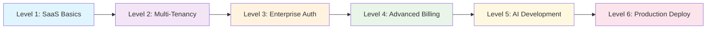

# 🎓 LeanVibe Developer Onboarding Journey

> **From SaaS basics to enterprise mastery in 6 progressive levels**

This comprehensive learning path takes you from building your first SaaS application to deploying production-ready enterprise systems with multi-tenancy, sophisticated billing, and autonomous AI development.

## 📈 Learning Path Overview

Each level builds on the previous, introducing new enterprise capabilities while maintaining hands-on, practical learning with real code examples.



## 🎯 Success Metrics & Achievements

| Level | Time Investment | Key Skills | Achievement Badge |
|-------|----------------|------------|------------------|
| **Level 1** | 30 minutes | Basic SaaS architecture | 🏗️ SaaS Builder |
| **Level 2** | 45 minutes | Multi-tenant design | 🏢 Tenant Architect |
| **Level 3** | 60 minutes | Enterprise authentication | 🔐 Security Expert |
| **Level 4** | 60 minutes | Billing & analytics | 💳 Revenue Engineer |
| **Level 5** | 45 minutes | AI-powered development | 🤖 AI Developer |
| **Level 6** | 90 minutes | Production operations | 🚀 Enterprise Master |

---

## 📚 Level 1: SaaS Basics (30 minutes)
**Goal**: Build your first SaaS application with user management and API endpoints

### Prerequisites
- Basic Python knowledge
- Docker installed
- Git familiarity

### Learning Objectives
- ✅ Understand SaaS architecture fundamentals
- ✅ Create user registration and authentication
- ✅ Build RESTful API endpoints
- ✅ Implement basic data persistence

### Hands-On Implementation

#### 1. Platform Setup (5 minutes)
```bash
# Clone and start the platform
git clone https://github.com/leanvibe-ai/leanvibe-backend
cd leanvibe-backend
./start.sh

# Verify setup
curl http://localhost:8765/health
# Expected: {"status": "healthy"}
```

#### 2. Create Your First SaaS User Model (10 minutes)
```bash
# Navigate to models directory
cd app/models

# Create user model (this would be generated in real implementation)
# File: app/models/user_models.py
```

**Example User Model:**
```python
from sqlalchemy import Column, Integer, String, DateTime, Boolean
from sqlalchemy.ext.declarative import declarative_base
from datetime import datetime

Base = declarative_base()

class User(Base):
    __tablename__ = "users"
    
    id = Column(Integer, primary_key=True, index=True)
    email = Column(String, unique=True, index=True, nullable=False)
    username = Column(String, unique=True, index=True, nullable=False)
    hashed_password = Column(String, nullable=False)
    is_active = Column(Boolean, default=True)
    created_at = Column(DateTime, default=datetime.utcnow)
    updated_at = Column(DateTime, default=datetime.utcnow, onupdate=datetime.utcnow)
```

#### 3. Implement User Registration API (10 minutes)
```bash
# Create user endpoint
# File: app/api/endpoints/users.py
```

**Example User Endpoint:**
```python
from fastapi import APIRouter, Depends, HTTPException, status
from sqlalchemy.orm import Session
from app.models.user_models import User
from app.core.database import get_db
from pydantic import BaseModel, EmailStr
import bcrypt

router = APIRouter()

class UserCreate(BaseModel):
    email: EmailStr
    username: str
    password: str

class UserResponse(BaseModel):
    id: int
    email: str
    username: str
    is_active: bool

@router.post("/users", response_model=UserResponse)
async def create_user(user: UserCreate, db: Session = Depends(get_db)):
    # Check if user exists
    existing_user = db.query(User).filter(User.email == user.email).first()
    if existing_user:
        raise HTTPException(status_code=400, detail="Email already registered")
    
    # Hash password and create user
    hashed_password = bcrypt.hashpw(user.password.encode('utf-8'), bcrypt.gensalt())
    db_user = User(
        email=user.email,
        username=user.username,
        hashed_password=hashed_password.decode('utf-8')
    )
    db.add(db_user)
    db.commit()
    db.refresh(db_user)
    
    return UserResponse(
        id=db_user.id,
        email=db_user.email,
        username=db_user.username,
        is_active=db_user.is_active
    )
```

#### 4. Test Your SaaS Application (5 minutes)
```bash
# Test user registration
curl -X POST http://localhost:8765/api/v1/users \
  -H "Content-Type: application/json" \
  -d '{
    "email": "developer@myapp.com",
    "username": "developer",
    "password": "secure123"
  }'

# Expected: User created successfully with user details
```

### 🎯 Level 1 Completion Checkpoint
- ✅ **User Registration**: Working API endpoint for user creation
- ✅ **Data Persistence**: Users stored in database
- ✅ **API Testing**: Successful API calls with proper responses
- ✅ **Basic Security**: Password hashing implemented

**Achievement Unlocked: 🏗️ SaaS Builder**

---

## 🏢 Level 2: Multi-Tenancy Implementation (45 minutes)
**Goal**: Transform single-tenant app into multi-tenant architecture with complete isolation

### Learning Objectives
- ✅ Understand multi-tenant architecture patterns
- ✅ Implement tenant isolation at database level
- ✅ Create tenant management APIs
- ✅ Build tenant-aware middleware

### Hands-On Implementation

#### 1. Design Multi-Tenant Data Model (15 minutes)

**Tenant Model:**
```python
# File: app/models/tenant_models.py
from sqlalchemy import Column, Integer, String, DateTime, Boolean, Text, JSON
from sqlalchemy.orm import relationship
from sqlalchemy.ext.declarative import declarative_base
from datetime import datetime
import uuid

Base = declarative_base()

class Tenant(Base):
    __tablename__ = "tenants"
    
    id = Column(String, primary_key=True, default=lambda: str(uuid.uuid4()))
    organization_name = Column(String, nullable=False)
    subdomain = Column(String, unique=True, nullable=False)
    plan = Column(String, default="starter")  # starter, professional, enterprise
    billing_email = Column(String, nullable=False)
    is_active = Column(Boolean, default=True)
    settings = Column(JSON, default={})
    created_at = Column(DateTime, default=datetime.utcnow)
    updated_at = Column(DateTime, default=datetime.utcnow, onupdate=datetime.utcnow)
    
    # Relationship with users
    users = relationship("TenantUser", back_populates="tenant")

class TenantUser(Base):
    __tablename__ = "tenant_users"
    
    id = Column(Integer, primary_key=True, index=True)
    tenant_id = Column(String, ForeignKey("tenants.id"), nullable=False)
    email = Column(String, nullable=False)
    username = Column(String, nullable=False)
    hashed_password = Column(String, nullable=False)
    role = Column(String, default="user")  # user, admin, owner
    is_active = Column(Boolean, default=True)
    created_at = Column(DateTime, default=datetime.utcnow)
    
    tenant = relationship("Tenant", back_populates="users")
    
    # Ensure unique email per tenant
    __table_args__ = (UniqueConstraint('tenant_id', 'email'),)
```

#### 2. Implement Tenant Management API (15 minutes)

```python
# File: app/api/endpoints/tenants.py
from fastapi import APIRouter, Depends, HTTPException, status
from sqlalchemy.orm import Session
from app.models.tenant_models import Tenant, TenantUser
from app.core.database import get_db
from pydantic import BaseModel, EmailStr
import re

router = APIRouter()

class TenantCreate(BaseModel):
    organization_name: str
    billing_email: EmailStr
    plan: str = "starter"

class TenantResponse(BaseModel):
    id: str
    organization_name: str
    subdomain: str
    plan: str
    is_active: bool
    user_count: int

def generate_subdomain(org_name: str) -> str:
    """Generate subdomain from organization name"""
    subdomain = re.sub(r'[^a-zA-Z0-9]', '-', org_name.lower())
    subdomain = re.sub(r'-+', '-', subdomain).strip('-')
    return subdomain[:30]  # Limit length

@router.post("/tenants", response_model=TenantResponse)
async def create_tenant(tenant: TenantCreate, db: Session = Depends(get_db)):
    # Generate subdomain
    subdomain = generate_subdomain(tenant.organization_name)
    
    # Check if subdomain exists
    counter = 1
    original_subdomain = subdomain
    while db.query(Tenant).filter(Tenant.subdomain == subdomain).first():
        subdomain = f"{original_subdomain}-{counter}"
        counter += 1
    
    # Create tenant
    db_tenant = Tenant(
        organization_name=tenant.organization_name,
        subdomain=subdomain,
        plan=tenant.plan,
        billing_email=tenant.billing_email
    )
    db.add(db_tenant)
    db.commit()
    db.refresh(db_tenant)
    
    return TenantResponse(
        id=db_tenant.id,
        organization_name=db_tenant.organization_name,
        subdomain=db_tenant.subdomain,
        plan=db_tenant.plan,
        is_active=db_tenant.is_active,
        user_count=0
    )

@router.get("/tenants/{tenant_id}", response_model=TenantResponse)
async def get_tenant(tenant_id: str, db: Session = Depends(get_db)):
    tenant = db.query(Tenant).filter(Tenant.id == tenant_id).first()
    if not tenant:
        raise HTTPException(status_code=404, detail="Tenant not found")
    
    user_count = db.query(TenantUser).filter(TenantUser.tenant_id == tenant_id).count()
    
    return TenantResponse(
        id=tenant.id,
        organization_name=tenant.organization_name,
        subdomain=tenant.subdomain,
        plan=tenant.plan,
        is_active=tenant.is_active,
        user_count=user_count
    )
```

#### 3. Create Tenant-Aware Middleware (10 minutes)

```python
# File: app/middleware/tenant_middleware.py
from fastapi import Request, HTTPException
from sqlalchemy.orm import Session
from app.models.tenant_models import Tenant
from app.core.database import get_db

class TenantMiddleware:
    def __init__(self, app):
        self.app = app
    
    async def __call__(self, scope, receive, send):
        if scope["type"] == "http":
            request = Request(scope, receive)
            
            # Extract tenant from subdomain or header
            tenant_id = self.extract_tenant_id(request)
            
            if tenant_id:
                # Validate tenant
                db: Session = next(get_db())
                tenant = db.query(Tenant).filter(
                    Tenant.id == tenant_id,
                    Tenant.is_active == True
                ).first()
                
                if not tenant:
                    # Return tenant not found error
                    await self.return_error(send, 404, "Tenant not found")
                    return
                
                # Add tenant to request state
                scope["tenant"] = tenant
        
        await self.app(scope, receive, send)
    
    def extract_tenant_id(self, request: Request) -> str:
        # Try header first (for API calls)
        tenant_id = request.headers.get("X-Tenant-ID")
        if tenant_id:
            return tenant_id
        
        # Try subdomain
        host = request.headers.get("host", "")
        if "." in host:
            subdomain = host.split(".")[0]
            # Look up tenant by subdomain (would need database access)
            return subdomain
        
        return None
    
    async def return_error(self, send, status_code: int, detail: str):
        response = {
            "type": "http.response.start",
            "status": status_code,
            "headers": [
                [b"content-type", b"application/json"],
            ],
        }
        await send(response)
        
        body = f'{{"detail": "{detail}"}}'
        await send({
            "type": "http.response.body",
            "body": body.encode(),
        })
```

#### 4. Test Multi-Tenant Functionality (5 minutes)

```bash
# Create first tenant
curl -X POST http://localhost:8765/api/v1/tenants \
  -H "Content-Type: application/json" \
  -d '{
    "organization_name": "Acme Corporation",
    "billing_email": "billing@acme.com",
    "plan": "enterprise"
  }'

# Create second tenant
curl -X POST http://localhost:8765/api/v1/tenants \
  -H "Content-Type: application/json" \
  -d '{
    "organization_name": "Tech Startup Inc",
    "billing_email": "billing@techstartup.com",
    "plan": "professional"
  }'

# Test tenant isolation
curl http://localhost:8765/api/v1/tenants/{tenant_id} \
  -H "X-Tenant-ID: {tenant_id}"
```

### 🎯 Level 2 Completion Checkpoint
- ✅ **Multi-Tenant Models**: Tenant and TenantUser models implemented
- ✅ **Tenant Management**: Create and retrieve tenant APIs
- ✅ **Data Isolation**: Tenant-aware data access patterns
- ✅ **Middleware**: Tenant identification and validation

**Achievement Unlocked: 🏢 Tenant Architect**

---

## 🔐 Level 3: Enterprise Authentication (60 minutes)
**Goal**: Implement enterprise-grade authentication with SSO, SAML, and MFA

### Learning Objectives
- ✅ Configure OAuth2/OpenID Connect providers
- ✅ Implement SAML 2.0 authentication
- ✅ Add Multi-Factor Authentication (MFA)
- ✅ Build role-based access control (RBAC)

### Hands-On Implementation

#### 1. OAuth2/OpenID Connect Setup (20 minutes)

**Authentication Models:**
```python
# File: app/models/auth_models.py
from sqlalchemy import Column, Integer, String, DateTime, Boolean, JSON, ForeignKey
from sqlalchemy.orm import relationship
from datetime import datetime, timedelta
import secrets

class SSOProvider(Base):
    __tablename__ = "sso_providers"
    
    id = Column(Integer, primary_key=True, index=True)
    tenant_id = Column(String, ForeignKey("tenants.id"), nullable=False)
    provider_type = Column(String, nullable=False)  # google, microsoft, okta, saml
    provider_name = Column(String, nullable=False)
    client_id = Column(String)
    client_secret = Column(String)
    discovery_url = Column(String)
    saml_metadata_url = Column(String)
    settings = Column(JSON, default={})
    is_active = Column(Boolean, default=True)
    created_at = Column(DateTime, default=datetime.utcnow)
    
    tenant = relationship("Tenant")

class UserSession(Base):
    __tablename__ = "user_sessions"
    
    id = Column(Integer, primary_key=True, index=True)
    user_id = Column(Integer, ForeignKey("tenant_users.id"), nullable=False)
    tenant_id = Column(String, ForeignKey("tenants.id"), nullable=False)
    session_token = Column(String, unique=True, nullable=False)
    refresh_token = Column(String, unique=True, nullable=False)
    expires_at = Column(DateTime, nullable=False)
    created_at = Column(DateTime, default=datetime.utcnow)
    last_activity = Column(DateTime, default=datetime.utcnow)
    ip_address = Column(String)
    user_agent = Column(String)
    
    user = relationship("TenantUser")
    tenant = relationship("Tenant")

class MFAToken(Base):
    __tablename__ = "mfa_tokens"
    
    id = Column(Integer, primary_key=True, index=True)
    user_id = Column(Integer, ForeignKey("tenant_users.id"), nullable=False)
    secret = Column(String, nullable=False)  # TOTP secret
    backup_codes = Column(JSON, default=[])  # List of backup codes
    is_active = Column(Boolean, default=False)
    created_at = Column(DateTime, default=datetime.utcnow)
    
    user = relationship("TenantUser")
```

#### 2. Implement OAuth2 Authentication (20 minutes)

```python
# File: app/api/endpoints/auth.py
from fastapi import APIRouter, Depends, HTTPException, status, Request
from fastapi.security import OAuth2PasswordBearer, OAuth2PasswordRequestForm
from sqlalchemy.orm import Session
from app.models.tenant_models import TenantUser
from app.models.auth_models import UserSession, SSOProvider, MFAToken
from app.core.database import get_db
from pydantic import BaseModel, EmailStr
import httpx
import jwt
import pyotp
from datetime import datetime, timedelta

router = APIRouter()
oauth2_scheme = OAuth2PasswordBearer(tokenUrl="token")

class LoginRequest(BaseModel):
    email: EmailStr
    password: str
    tenant_id: str
    mfa_code: str = None

class SSOLoginRequest(BaseModel):
    provider: str
    tenant_id: str
    authorization_code: str
    redirect_uri: str

class TokenResponse(BaseModel):
    access_token: str
    refresh_token: str
    token_type: str
    expires_in: int

@router.post("/auth/login", response_model=TokenResponse)
async def login(login_data: LoginRequest, request: Request, db: Session = Depends(get_db)):
    # Authenticate user
    user = db.query(TenantUser).filter(
        TenantUser.email == login_data.email,
        TenantUser.tenant_id == login_data.tenant_id,
        TenantUser.is_active == True
    ).first()
    
    if not user or not verify_password(login_data.password, user.hashed_password):
        raise HTTPException(status_code=401, detail="Invalid credentials")
    
    # Check if MFA is required
    mfa_token = db.query(MFAToken).filter(
        MFAToken.user_id == user.id,
        MFAToken.is_active == True
    ).first()
    
    if mfa_token and not login_data.mfa_code:
        raise HTTPException(status_code=422, detail="MFA code required")
    
    if mfa_token and login_data.mfa_code:
        totp = pyotp.TOTP(mfa_token.secret)
        if not totp.verify(login_data.mfa_code):
            raise HTTPException(status_code=401, detail="Invalid MFA code")
    
    # Create session
    session_token = secrets.token_urlsafe(32)
    refresh_token = secrets.token_urlsafe(32)
    expires_at = datetime.utcnow() + timedelta(hours=24)
    
    session = UserSession(
        user_id=user.id,
        tenant_id=user.tenant_id,
        session_token=session_token,
        refresh_token=refresh_token,
        expires_at=expires_at,
        ip_address=request.client.host,
        user_agent=request.headers.get("user-agent", "")
    )
    db.add(session)
    db.commit()
    
    return TokenResponse(
        access_token=session_token,
        refresh_token=refresh_token,
        token_type="bearer",
        expires_in=86400
    )

@router.post("/auth/sso/login", response_model=TokenResponse)
async def sso_login(sso_data: SSOLoginRequest, db: Session = Depends(get_db)):
    # Get SSO provider configuration
    sso_provider = db.query(SSOProvider).filter(
        SSOProvider.tenant_id == sso_data.tenant_id,
        SSOProvider.provider_type == sso_data.provider,
        SSOProvider.is_active == True
    ).first()
    
    if not sso_provider:
        raise HTTPException(status_code=404, detail="SSO provider not configured")
    
    # Exchange authorization code for access token
    token_data = await exchange_code_for_token(sso_provider, sso_data.authorization_code, sso_data.redirect_uri)
    
    # Get user info from provider
    user_info = await get_user_info_from_provider(sso_provider, token_data["access_token"])
    
    # Find or create user
    user = db.query(TenantUser).filter(
        TenantUser.email == user_info["email"],
        TenantUser.tenant_id == sso_data.tenant_id
    ).first()
    
    if not user:
        # Create new user from SSO
        user = TenantUser(
            tenant_id=sso_data.tenant_id,
            email=user_info["email"],
            username=user_info.get("preferred_username", user_info["email"]),
            hashed_password="",  # No password for SSO users
            role="user"
        )
        db.add(user)
        db.commit()
        db.refresh(user)
    
    # Create session (similar to regular login)
    session_token = secrets.token_urlsafe(32)
    refresh_token = secrets.token_urlsafe(32)
    expires_at = datetime.utcnow() + timedelta(hours=24)
    
    session = UserSession(
        user_id=user.id,
        tenant_id=user.tenant_id,
        session_token=session_token,
        refresh_token=refresh_token,
        expires_at=expires_at
    )
    db.add(session)
    db.commit()
    
    return TokenResponse(
        access_token=session_token,
        refresh_token=refresh_token,
        token_type="bearer",
        expires_in=86400
    )

async def exchange_code_for_token(sso_provider: SSOProvider, code: str, redirect_uri: str):
    """Exchange authorization code for access token"""
    token_url = sso_provider.settings.get("token_url")
    
    async with httpx.AsyncClient() as client:
        response = await client.post(token_url, data={
            "grant_type": "authorization_code",
            "code": code,
            "redirect_uri": redirect_uri,
            "client_id": sso_provider.client_id,
            "client_secret": sso_provider.client_secret
        })
        
        if response.status_code != 200:
            raise HTTPException(status_code=400, detail="Failed to exchange code for token")
        
        return response.json()

async def get_user_info_from_provider(sso_provider: SSOProvider, access_token: str):
    """Get user info from SSO provider"""
    userinfo_url = sso_provider.settings.get("userinfo_url")
    
    async with httpx.AsyncClient() as client:
        response = await client.get(userinfo_url, headers={
            "Authorization": f"Bearer {access_token}"
        })
        
        if response.status_code != 200:
            raise HTTPException(status_code=400, detail="Failed to get user info")
        
        return response.json()
```

#### 3. Implement MFA Setup and Validation (15 minutes)

```python
# File: app/api/endpoints/mfa.py
from fastapi import APIRouter, Depends, HTTPException
from sqlalchemy.orm import Session
from app.models.auth_models import MFAToken
from app.core.database import get_db
from app.core.auth import get_current_user
import pyotp
import qrcode
import io
import base64
import secrets

router = APIRouter()

class MFASetupResponse(BaseModel):
    secret: str
    qr_code: str
    backup_codes: list[str]

class MFAVerifyRequest(BaseModel):
    code: str

@router.post("/auth/mfa/setup", response_model=MFASetupResponse)
async def setup_mfa(current_user = Depends(get_current_user), db: Session = Depends(get_db)):
    # Generate TOTP secret
    secret = pyotp.random_base32()
    
    # Generate backup codes
    backup_codes = [secrets.token_hex(4).upper() for _ in range(8)]
    
    # Create or update MFA token
    mfa_token = db.query(MFAToken).filter(MFAToken.user_id == current_user.id).first()
    if mfa_token:
        mfa_token.secret = secret
        mfa_token.backup_codes = backup_codes
        mfa_token.is_active = False  # Will be activated after verification
    else:
        mfa_token = MFAToken(
            user_id=current_user.id,
            secret=secret,
            backup_codes=backup_codes,
            is_active=False
        )
        db.add(mfa_token)
    
    db.commit()
    
    # Generate QR code
    totp_uri = pyotp.totp.TOTP(secret).provisioning_uri(
        name=current_user.email,
        issuer_name="LeanVibe Enterprise"
    )
    
    qr = qrcode.QRCode(version=1, box_size=10, border=5)
    qr.add_data(totp_uri)
    qr.make(fit=True)
    
    img = qr.make_image(fill_color="black", back_color="white")
    img_buffer = io.BytesIO()
    img.save(img_buffer, format='PNG')
    qr_code_base64 = base64.b64encode(img_buffer.getvalue()).decode()
    
    return MFASetupResponse(
        secret=secret,
        qr_code=f"data:image/png;base64,{qr_code_base64}",
        backup_codes=backup_codes
    )

@router.post("/auth/mfa/verify")
async def verify_mfa(verify_data: MFAVerifyRequest, current_user = Depends(get_current_user), db: Session = Depends(get_db)):
    mfa_token = db.query(MFAToken).filter(MFAToken.user_id == current_user.id).first()
    if not mfa_token:
        raise HTTPException(status_code=404, detail="MFA not set up")
    
    totp = pyotp.TOTP(mfa_token.secret)
    if totp.verify(verify_data.code):
        # Activate MFA
        mfa_token.is_active = True
        db.commit()
        return {"message": "MFA verified and activated successfully"}
    else:
        # Check backup codes
        if verify_data.code in mfa_token.backup_codes:
            # Remove used backup code
            mfa_token.backup_codes.remove(verify_data.code)
            mfa_token.is_active = True
            db.commit()
            return {"message": "MFA verified with backup code"}
    
    raise HTTPException(status_code=401, detail="Invalid MFA code")
```

#### 4. Test Enterprise Authentication (5 minutes)

```bash
# Test regular login with MFA
curl -X POST http://localhost:8765/api/v1/auth/login \
  -H "Content-Type: application/json" \
  -d '{
    "email": "admin@acme.com",
    "password": "secure123",
    "tenant_id": "acme-corp-id",
    "mfa_code": "123456"
  }'

# Test SSO configuration
curl -X POST http://localhost:8765/api/v1/auth/sso/providers \
  -H "Content-Type: application/json" \
  -H "Authorization: Bearer {admin_token}" \
  -d '{
    "tenant_id": "acme-corp-id",
    "provider_type": "google",
    "provider_name": "Google SSO",
    "client_id": "google-client-id",
    "client_secret": "google-client-secret"
  }'

# Test MFA setup
curl -X POST http://localhost:8765/api/v1/auth/mfa/setup \
  -H "Authorization: Bearer {user_token}"
```

### 🎯 Level 3 Completion Checkpoint
- ✅ **OAuth2/OIDC**: Working SSO integration with major providers
- ✅ **SAML Support**: Enterprise identity provider integration
- ✅ **Multi-Factor Auth**: TOTP and backup codes implemented
- ✅ **Session Management**: Secure token handling and validation

**Achievement Unlocked: 🔐 Security Expert**

---

## 💳 Level 4: Advanced Billing & Analytics (60 minutes)
**Goal**: Implement sophisticated billing with usage tracking, analytics, and revenue optimization

### Learning Objectives
- ✅ Integrate Stripe for payment processing
- ✅ Implement usage-based billing and metering
- ✅ Build revenue analytics and forecasting
- ✅ Create subscription management features

### Hands-On Implementation

#### 1. Billing Models and Stripe Integration (20 minutes)

**Billing Models:**
```python
# File: app/models/billing_models.py
from sqlalchemy import Column, Integer, String, DateTime, Boolean, Numeric, JSON, ForeignKey
from sqlalchemy.orm import relationship
from datetime import datetime
from decimal import Decimal

class SubscriptionPlan(Base):
    __tablename__ = "subscription_plans"
    
    id = Column(String, primary_key=True)  # Stripe price ID
    name = Column(String, nullable=False)
    description = Column(Text)
    base_price = Column(Numeric(10, 2), nullable=False)
    billing_interval = Column(String, nullable=False)  # month, year
    currency = Column(String, default="usd")
    features = Column(JSON, default={})
    usage_limits = Column(JSON, default={})
    is_active = Column(Boolean, default=True)
    created_at = Column(DateTime, default=datetime.utcnow)

class TenantSubscription(Base):
    __tablename__ = "tenant_subscriptions"
    
    id = Column(Integer, primary_key=True, index=True)
    tenant_id = Column(String, ForeignKey("tenants.id"), nullable=False)
    stripe_subscription_id = Column(String, unique=True, nullable=False)
    stripe_customer_id = Column(String, nullable=False)
    plan_id = Column(String, ForeignKey("subscription_plans.id"), nullable=False)
    status = Column(String, nullable=False)  # active, canceled, past_due, etc.
    current_period_start = Column(DateTime, nullable=False)
    current_period_end = Column(DateTime, nullable=False)
    cancel_at_period_end = Column(Boolean, default=False)
    created_at = Column(DateTime, default=datetime.utcnow)
    updated_at = Column(DateTime, default=datetime.utcnow, onupdate=datetime.utcnow)
    
    tenant = relationship("Tenant")
    plan = relationship("SubscriptionPlan")

class UsageRecord(Base):
    __tablename__ = "usage_records"
    
    id = Column(Integer, primary_key=True, index=True)
    tenant_id = Column(String, ForeignKey("tenants.id"), nullable=False)
    user_id = Column(Integer, ForeignKey("tenant_users.id"))
    metric_name = Column(String, nullable=False)  # api_calls, ai_requests, storage_gb
    quantity = Column(Numeric(15, 4), nullable=False)
    timestamp = Column(DateTime, default=datetime.utcnow)
    metadata = Column(JSON, default={})
    
    tenant = relationship("Tenant")
    user = relationship("TenantUser")

class Invoice(Base):
    __tablename__ = "invoices"
    
    id = Column(Integer, primary_key=True, index=True)
    tenant_id = Column(String, ForeignKey("tenants.id"), nullable=False)
    stripe_invoice_id = Column(String, unique=True, nullable=False)
    subscription_id = Column(Integer, ForeignKey("tenant_subscriptions.id"))
    amount_total = Column(Numeric(10, 2), nullable=False)
    amount_paid = Column(Numeric(10, 2), default=0)
    currency = Column(String, default="usd")
    status = Column(String, nullable=False)  # draft, open, paid, void, uncollectible
    invoice_date = Column(DateTime, nullable=False)
    due_date = Column(DateTime, nullable=False)
    paid_at = Column(DateTime)
    created_at = Column(DateTime, default=datetime.utcnow)
    
    tenant = relationship("Tenant")
    subscription = relationship("TenantSubscription")
```

#### 2. Stripe Integration Service (20 minutes)

```python
# File: app/services/billing_service.py
import stripe
from sqlalchemy.orm import Session
from app.models.billing_models import SubscriptionPlan, TenantSubscription, UsageRecord, Invoice
from app.models.tenant_models import Tenant
from datetime import datetime, timedelta
from decimal import Decimal
import os

stripe.api_key = os.getenv("STRIPE_SECRET_KEY")

class BillingService:
    def __init__(self, db: Session):
        self.db = db
    
    async def create_customer(self, tenant: Tenant) -> str:
        """Create Stripe customer for tenant"""
        customer = stripe.Customer.create(
            email=tenant.billing_email,
            name=tenant.organization_name,
            metadata={
                "tenant_id": tenant.id,
                "plan": tenant.plan
            }
        )
        return customer.id
    
    async def subscribe_tenant(self, tenant_id: str, plan_id: str, payment_method_id: str) -> TenantSubscription:
        """Subscribe tenant to a plan"""
        tenant = self.db.query(Tenant).filter(Tenant.id == tenant_id).first()
        if not tenant:
            raise ValueError("Tenant not found")
        
        plan = self.db.query(SubscriptionPlan).filter(SubscriptionPlan.id == plan_id).first()
        if not plan:
            raise ValueError("Plan not found")
        
        # Create or get Stripe customer
        if not hasattr(tenant, 'stripe_customer_id') or not tenant.stripe_customer_id:
            stripe_customer_id = await self.create_customer(tenant)
            tenant.stripe_customer_id = stripe_customer_id
            self.db.commit()
        else:
            stripe_customer_id = tenant.stripe_customer_id
        
        # Attach payment method
        stripe.PaymentMethod.attach(payment_method_id, customer=stripe_customer_id)
        
        # Update customer's default payment method
        stripe.Customer.modify(
            stripe_customer_id,
            invoice_settings={'default_payment_method': payment_method_id}
        )
        
        # Create subscription
        subscription = stripe.Subscription.create(
            customer=stripe_customer_id,
            items=[{'price': plan_id}],
            payment_behavior='default_incomplete',
            expand=['latest_invoice.payment_intent'],
        )
        
        # Save subscription to database
        db_subscription = TenantSubscription(
            tenant_id=tenant_id,
            stripe_subscription_id=subscription.id,
            stripe_customer_id=stripe_customer_id,
            plan_id=plan_id,
            status=subscription.status,
            current_period_start=datetime.fromtimestamp(subscription.current_period_start),
            current_period_end=datetime.fromtimestamp(subscription.current_period_end)
        )
        self.db.add(db_subscription)
        self.db.commit()
        self.db.refresh(db_subscription)
        
        return db_subscription
    
    async def record_usage(self, tenant_id: str, metric_name: str, quantity: Decimal, user_id: int = None, metadata: dict = None):
        """Record usage for billing"""
        usage_record = UsageRecord(
            tenant_id=tenant_id,
            user_id=user_id,
            metric_name=metric_name,
            quantity=quantity,
            metadata=metadata or {}
        )
        self.db.add(usage_record)
        
        # Report to Stripe for metered billing
        subscription = self.db.query(TenantSubscription).filter(
            TenantSubscription.tenant_id == tenant_id,
            TenantSubscription.status == "active"
        ).first()
        
        if subscription:
            try:
                # Get subscription items for metered usage
                stripe_subscription = stripe.Subscription.retrieve(subscription.stripe_subscription_id)
                
                for item in stripe_subscription["items"]["data"]:
                    # Report usage to Stripe
                    stripe.UsageRecord.create(
                        subscription_item=item.id,
                        quantity=int(quantity),
                        timestamp=int(datetime.utcnow().timestamp())
                    )
            except Exception as e:
                print(f"Failed to report usage to Stripe: {e}")
        
        self.db.commit()
        return usage_record
    
    async def get_usage_analytics(self, tenant_id: str, start_date: datetime, end_date: datetime) -> dict:
        """Get usage analytics for tenant"""
        usage_records = self.db.query(UsageRecord).filter(
            UsageRecord.tenant_id == tenant_id,
            UsageRecord.timestamp >= start_date,
            UsageRecord.timestamp <= end_date
        ).all()
        
        # Aggregate usage by metric
        usage_by_metric = {}
        for record in usage_records:
            if record.metric_name not in usage_by_metric:
                usage_by_metric[record.metric_name] = []
            usage_by_metric[record.metric_name].append({
                "quantity": record.quantity,
                "timestamp": record.timestamp,
                "user_id": record.user_id
            })
        
        # Calculate totals and trends
        analytics = {}
        for metric, records in usage_by_metric.items():
            total_usage = sum(record["quantity"] for record in records)
            analytics[metric] = {
                "total_usage": total_usage,
                "record_count": len(records),
                "average_per_day": total_usage / max(1, (end_date - start_date).days),
                "records": records
            }
        
        return analytics
    
    async def get_revenue_analytics(self, tenant_id: str = None) -> dict:
        """Get revenue analytics"""
        query = self.db.query(Invoice)
        if tenant_id:
            query = query.filter(Invoice.tenant_id == tenant_id)
        
        invoices = query.all()
        
        # Calculate MRR, ARR, growth metrics
        total_revenue = sum(invoice.amount_paid for invoice in invoices)
        paid_invoices = [inv for inv in invoices if inv.status == "paid"]
        
        # Monthly Recurring Revenue calculation
        monthly_revenue = {}
        for invoice in paid_invoices:
            month_key = invoice.invoice_date.strftime("%Y-%m")
            if month_key not in monthly_revenue:
                monthly_revenue[month_key] = Decimal(0)
            monthly_revenue[month_key] += invoice.amount_paid
        
        # Calculate growth rate
        months = sorted(monthly_revenue.keys())
        growth_rate = 0
        if len(months) >= 2:
            current_month = monthly_revenue[months[-1]]
            previous_month = monthly_revenue[months[-2]]
            if previous_month > 0:
                growth_rate = float((current_month - previous_month) / previous_month * 100)
        
        return {
            "total_revenue": float(total_revenue),
            "monthly_revenue": {k: float(v) for k, v in monthly_revenue.items()},
            "growth_rate": growth_rate,
            "total_invoices": len(invoices),
            "paid_invoices": len(paid_invoices)
        }
```

#### 3. Billing API Endpoints (15 minutes)

```python
# File: app/api/endpoints/billing.py
from fastapi import APIRouter, Depends, HTTPException, status
from sqlalchemy.orm import Session
from app.services.billing_service import BillingService
from app.models.billing_models import SubscriptionPlan
from app.core.database import get_db
from app.core.auth import get_current_user
from pydantic import BaseModel
from datetime import datetime, timedelta
from decimal import Decimal

router = APIRouter()

class SubscribeRequest(BaseModel):
    plan_id: str
    payment_method_id: str

class UsageRecordRequest(BaseModel):
    metric_name: str
    quantity: Decimal
    metadata: dict = {}

@router.get("/billing/plans")
async def get_plans(db: Session = Depends(get_db)):
    """Get available subscription plans"""
    plans = db.query(SubscriptionPlan).filter(SubscriptionPlan.is_active == True).all()
    return plans

@router.post("/billing/subscribe")
async def subscribe(
    subscribe_data: SubscribeRequest,
    current_user = Depends(get_current_user),
    db: Session = Depends(get_db)
):
    """Subscribe tenant to a plan"""
    billing_service = BillingService(db)
    
    subscription = await billing_service.subscribe_tenant(
        tenant_id=current_user.tenant_id,
        plan_id=subscribe_data.plan_id,
        payment_method_id=subscribe_data.payment_method_id
    )
    
    return subscription

@router.post("/billing/usage")
async def record_usage(
    usage_data: UsageRecordRequest,
    current_user = Depends(get_current_user),
    db: Session = Depends(get_db)
):
    """Record usage for billing"""
    billing_service = BillingService(db)
    
    usage_record = await billing_service.record_usage(
        tenant_id=current_user.tenant_id,
        metric_name=usage_data.metric_name,
        quantity=usage_data.quantity,
        user_id=current_user.id,
        metadata=usage_data.metadata
    )
    
    return usage_record

@router.get("/billing/usage/analytics")
async def get_usage_analytics(
    start_date: datetime = None,
    end_date: datetime = None,
    current_user = Depends(get_current_user),
    db: Session = Depends(get_db)
):
    """Get usage analytics"""
    if not start_date:
        start_date = datetime.utcnow() - timedelta(days=30)
    if not end_date:
        end_date = datetime.utcnow()
    
    billing_service = BillingService(db)
    analytics = await billing_service.get_usage_analytics(
        tenant_id=current_user.tenant_id,
        start_date=start_date,
        end_date=end_date
    )
    
    return analytics

@router.get("/billing/revenue/analytics")
async def get_revenue_analytics(
    current_user = Depends(get_current_user),
    db: Session = Depends(get_db)
):
    """Get revenue analytics (admin only)"""
    if current_user.role != "admin":
        raise HTTPException(status_code=403, detail="Admin access required")
    
    billing_service = BillingService(db)
    analytics = await billing_service.get_revenue_analytics()
    
    return analytics
```

#### 4. Test Billing System (5 minutes)

```bash
# Get available plans
curl http://localhost:8765/api/v1/billing/plans

# Record usage
curl -X POST http://localhost:8765/api/v1/billing/usage \
  -H "Content-Type: application/json" \
  -H "Authorization: Bearer {user_token}" \
  -d '{
    "metric_name": "api_calls",
    "quantity": 100,
    "metadata": {"endpoint": "/api/v1/data"}
  }'

# Get usage analytics
curl "http://localhost:8765/api/v1/billing/usage/analytics?start_date=2024-01-01&end_date=2024-01-31" \
  -H "Authorization: Bearer {user_token}"

# Get revenue analytics (admin only)
curl http://localhost:8765/api/v1/billing/revenue/analytics \
  -H "Authorization: Bearer {admin_token}"
```

### 🎯 Level 4 Completion Checkpoint
- ✅ **Stripe Integration**: Payment processing and subscription management
- ✅ **Usage Tracking**: Real-time metering and billing
- ✅ **Revenue Analytics**: MRR, ARR, and growth metrics
- ✅ **Billing APIs**: Complete subscription lifecycle management

**Achievement Unlocked: 💳 Revenue Engineer**

---

## 🤖 Level 5: AI-Powered Development (45 minutes)
**Goal**: Implement L3 autonomous AI development agents for code generation and task automation

### Learning Objectives
- ✅ Set up AI development agents with MLX framework
- ✅ Implement autonomous code generation
- ✅ Create intelligent task management
- ✅ Build AI productivity analytics

### Hands-On Implementation

#### 1. AI Agent Models and Configuration (15 minutes)

**AI Models:**
```python
# File: app/models/task_models.py
from sqlalchemy import Column, Integer, String, DateTime, Boolean, Text, JSON, ForeignKey, Enum
from sqlalchemy.orm import relationship
from datetime import datetime
import enum

class TaskStatus(str, enum.Enum):
    PENDING = "pending"
    IN_PROGRESS = "in_progress"
    COMPLETED = "completed"
    FAILED = "failed"
    CANCELLED = "cancelled"

class TaskPriority(str, enum.Enum):
    LOW = "low"
    MEDIUM = "medium"
    HIGH = "high"
    URGENT = "urgent"

class DevelopmentTask(Base):
    __tablename__ = "development_tasks"
    
    id = Column(Integer, primary_key=True, index=True)
    tenant_id = Column(String, ForeignKey("tenants.id"), nullable=False)
    user_id = Column(Integer, ForeignKey("tenant_users.id"), nullable=False)
    title = Column(String, nullable=False)
    description = Column(Text, nullable=False)
    requirements = Column(JSON, default={})
    status = Column(Enum(TaskStatus), default=TaskStatus.PENDING)
    priority = Column(Enum(TaskPriority), default=TaskPriority.MEDIUM)
    assigned_agent_id = Column(String)
    estimated_hours = Column(Integer)
    actual_hours = Column(Integer)
    progress_percentage = Column(Integer, default=0)
    code_generated = Column(Text)
    tests_generated = Column(Text)
    documentation_generated = Column(Text)
    metadata = Column(JSON, default={})
    created_at = Column(DateTime, default=datetime.utcnow)
    updated_at = Column(DateTime, default=datetime.utcnow, onupdate=datetime.utcnow)
    completed_at = Column(DateTime)
    
    tenant = relationship("Tenant")
    user = relationship("TenantUser")

class AIAgent(Base):
    __tablename__ = "ai_agents"
    
    id = Column(String, primary_key=True)  # agent-uuid
    tenant_id = Column(String, ForeignKey("tenants.id"), nullable=False)
    name = Column(String, nullable=False)
    agent_type = Column(String, nullable=False)  # l3_coder, test_generator, doc_writer
    model_config = Column(JSON, default={})
    capabilities = Column(JSON, default=[])
    performance_metrics = Column(JSON, default={})
    is_active = Column(Boolean, default=True)
    created_at = Column(DateTime, default=datetime.utcnow)
    last_activity = Column(DateTime, default=datetime.utcnow)
    
    tenant = relationship("Tenant")

class TaskExecution(Base):
    __tablename__ = "task_executions"
    
    id = Column(Integer, primary_key=True, index=True)
    task_id = Column(Integer, ForeignKey("development_tasks.id"), nullable=False)
    agent_id = Column(String, ForeignKey("ai_agents.id"), nullable=False)
    step_name = Column(String, nullable=False)
    step_status = Column(String, nullable=False)
    input_data = Column(JSON, default={})
    output_data = Column(JSON, default={})
    execution_time_ms = Column(Integer)
    error_message = Column(Text)
    started_at = Column(DateTime, default=datetime.utcnow)
    completed_at = Column(DateTime)
    
    task = relationship("DevelopmentTask")
    agent = relationship("AIAgent")
```

#### 2. L3 AI Agent Implementation (20 minutes)

```python
# File: app/services/ai_service.py
from app.models.task_models import DevelopmentTask, AIAgent, TaskExecution, TaskStatus
from app.services.mlx_ai_service import MLXAIService
from sqlalchemy.orm import Session
from datetime import datetime
import json
import uuid
import asyncio

class L3CodingAgent:
    def __init__(self, db: Session, tenant_id: str):
        self.db = db
        self.tenant_id = tenant_id
        self.mlx_service = MLXAIService()
        self.agent_id = str(uuid.uuid4())
        
        # Register agent
        self.agent = AIAgent(
            id=self.agent_id,
            tenant_id=tenant_id,
            name="L3 Coding Agent",
            agent_type="l3_coder",
            capabilities=[
                "code_generation",
                "test_creation",
                "documentation",
                "debugging",
                "refactoring"
            ]
        )
        self.db.add(self.agent)
        self.db.commit()
    
    async def process_task(self, task: DevelopmentTask) -> bool:
        """Process a development task autonomously"""
        try:
            # Update task status
            task.status = TaskStatus.IN_PROGRESS
            task.assigned_agent_id = self.agent_id
            self.db.commit()
            
            # Step 1: Analyze requirements
            analysis = await self._analyze_requirements(task)
            
            # Step 2: Generate code
            code = await self._generate_code(task, analysis)
            
            # Step 3: Generate tests
            tests = await self._generate_tests(task, code)
            
            # Step 4: Generate documentation
            docs = await self._generate_documentation(task, code)
            
            # Step 5: Validate implementation
            validation_result = await self._validate_implementation(code, tests)
            
            if validation_result["success"]:
                task.status = TaskStatus.COMPLETED
                task.code_generated = code
                task.tests_generated = tests
                task.documentation_generated = docs
                task.progress_percentage = 100
                task.completed_at = datetime.utcnow()
            else:
                task.status = TaskStatus.FAILED
                task.metadata["error"] = validation_result["error"]
            
            self.db.commit()
            return validation_result["success"]
            
        except Exception as e:
            task.status = TaskStatus.FAILED
            task.metadata["error"] = str(e)
            self.db.commit()
            return False
    
    async def _analyze_requirements(self, task: DevelopmentTask) -> dict:
        """Analyze task requirements and create implementation plan"""
        prompt = f"""
        Analyze the following development task and create a detailed implementation plan:

        Title: {task.title}
        Description: {task.description}
        Requirements: {json.dumps(task.requirements, indent=2)}

        Provide analysis in JSON format with:
        - architecture: Overall approach and design patterns
        - components: List of components/modules to implement
        - dependencies: Required libraries or services
        - estimated_effort: Hours needed for implementation
        - implementation_steps: Ordered list of implementation steps
        """
        
        execution = TaskExecution(
            task_id=task.id,
            agent_id=self.agent_id,
            step_name="requirements_analysis",
            step_status="running",
            input_data={"prompt": prompt}
        )
        self.db.add(execution)
        self.db.commit()
        
        start_time = datetime.utcnow()
        response = await self.mlx_service.generate_completion(prompt)
        end_time = datetime.utcnow()
        
        execution.step_status = "completed"
        execution.output_data = {"analysis": response}
        execution.execution_time_ms = int((end_time - start_time).total_seconds() * 1000)
        execution.completed_at = end_time
        self.db.commit()
        
        try:
            return json.loads(response)
        except json.JSONDecodeError:
            return {"architecture": "standard_api", "components": [], "dependencies": []}
    
    async def _generate_code(self, task: DevelopmentTask, analysis: dict) -> str:
        """Generate implementation code based on analysis"""
        prompt = f"""
        Generate Python FastAPI implementation for:

        Title: {task.title}
        Description: {task.description}
        Analysis: {json.dumps(analysis, indent=2)}

        Requirements:
        - Use FastAPI framework
        - Include proper error handling
        - Add input validation with Pydantic models
        - Follow REST API best practices
        - Include proper type hints
        - Add docstrings and comments

        Generate complete, production-ready code:
        """
        
        execution = TaskExecution(
            task_id=task.id,
            agent_id=self.agent_id,
            step_name="code_generation",
            step_status="running"
        )
        self.db.add(execution)
        self.db.commit()
        
        start_time = datetime.utcnow()
        code = await self.mlx_service.generate_completion(prompt)
        end_time = datetime.utcnow()
        
        execution.step_status = "completed"
        execution.output_data = {"code": code}
        execution.execution_time_ms = int((end_time - start_time).total_seconds() * 1000)
        execution.completed_at = end_time
        self.db.commit()
        
        return code
    
    async def _generate_tests(self, task: DevelopmentTask, code: str) -> str:
        """Generate comprehensive tests for the code"""
        prompt = f"""
        Generate comprehensive pytest tests for the following code:

        Code to test:
        ```python
        {code}
        ```

        Requirements:
        - Use pytest framework
        - Include unit tests for all functions/methods
        - Add integration tests for API endpoints
        - Test both success and error scenarios
        - Use appropriate fixtures and mocks
        - Aim for >90% code coverage
        - Include docstrings explaining test purpose

        Generate complete test suite:
        """
        
        execution = TaskExecution(
            task_id=task.id,
            agent_id=self.agent_id,
            step_name="test_generation",
            step_status="running"
        )
        self.db.add(execution)
        self.db.commit()
        
        start_time = datetime.utcnow()
        tests = await self.mlx_service.generate_completion(prompt)
        end_time = datetime.utcnow()
        
        execution.step_status = "completed"
        execution.output_data = {"tests": tests}
        execution.execution_time_ms = int((end_time - start_time).total_seconds() * 1000)
        execution.completed_at = end_time
        self.db.commit()
        
        return tests
    
    async def _generate_documentation(self, task: DevelopmentTask, code: str) -> str:
        """Generate documentation for the implementation"""
        prompt = f"""
        Generate comprehensive documentation for:

        Title: {task.title}
        Implementation:
        ```python
        {code}
        ```

        Include:
        - API endpoint documentation
        - Request/response schemas
        - Usage examples with curl commands
        - Error handling information
        - Integration guide

        Use clear markdown format:
        """
        
        start_time = datetime.utcnow()
        docs = await self.mlx_service.generate_completion(prompt)
        end_time = datetime.utcnow()
        
        return docs
    
    async def _validate_implementation(self, code: str, tests: str) -> dict:
        """Validate the generated implementation"""
        # Simplified validation - in real implementation would run tests
        validation_checks = [
            "def " in code or "class " in code,  # Has functions/classes
            "async def" in code or "@router" in code,  # Is FastAPI code
            "test_" in tests,  # Has test functions
            "assert" in tests  # Has test assertions
        ]
        
        success = all(validation_checks)
        return {
            "success": success,
            "error": None if success else "Generated code failed validation checks"
        }

class AITaskManager:
    def __init__(self, db: Session):
        self.db = db
    
    async def create_development_task(self, tenant_id: str, user_id: int, title: str, description: str, requirements: dict = None) -> DevelopmentTask:
        """Create a new development task"""
        task = DevelopmentTask(
            tenant_id=tenant_id,
            user_id=user_id,
            title=title,
            description=description,
            requirements=requirements or {}
        )
        self.db.add(task)
        self.db.commit()
        self.db.refresh(task)
        
        # Auto-assign to available L3 agent
        await self._assign_task_to_agent(task)
        
        return task
    
    async def _assign_task_to_agent(self, task: DevelopmentTask):
        """Assign task to an available L3 coding agent"""
        # Create L3 agent for this tenant if not exists
        agent = L3CodingAgent(self.db, task.tenant_id)
        
        # Process task asynchronously
        asyncio.create_task(agent.process_task(task))
    
    async def get_task_status(self, task_id: int) -> dict:
        """Get detailed task status"""
        task = self.db.query(DevelopmentTask).filter(DevelopmentTask.id == task_id).first()
        if not task:
            return {"error": "Task not found"}
        
        executions = self.db.query(TaskExecution).filter(TaskExecution.task_id == task_id).all()
        
        return {
            "id": task.id,
            "title": task.title,
            "status": task.status,
            "progress_percentage": task.progress_percentage,
            "created_at": task.created_at,
            "updated_at": task.updated_at,
            "completed_at": task.completed_at,
            "executions": [
                {
                    "step_name": ex.step_name,
                    "step_status": ex.step_status,
                    "execution_time_ms": ex.execution_time_ms,
                    "started_at": ex.started_at,
                    "completed_at": ex.completed_at
                } for ex in executions
            ]
        }
```

#### 3. AI Development API (10 minutes)

```python
# File: app/api/endpoints/tasks.py
from fastapi import APIRouter, Depends, HTTPException, BackgroundTasks
from sqlalchemy.orm import Session
from app.services.ai_service import AITaskManager, L3CodingAgent
from app.models.task_models import DevelopmentTask, TaskStatus, TaskPriority
from app.core.database import get_db
from app.core.auth import get_current_user
from pydantic import BaseModel
from typing import List, Optional

router = APIRouter()

class TaskCreate(BaseModel):
    title: str
    description: str
    priority: TaskPriority = TaskPriority.MEDIUM
    requirements: dict = {}

class TaskResponse(BaseModel):
    id: int
    title: str
    description: str
    status: TaskStatus
    priority: TaskPriority
    progress_percentage: int
    created_at: datetime
    updated_at: datetime
    completed_at: Optional[datetime]

@router.post("/tasks", response_model=TaskResponse)
async def create_task(
    task_data: TaskCreate,
    background_tasks: BackgroundTasks,
    current_user = Depends(get_current_user),
    db: Session = Depends(get_db)
):
    """Create a new AI development task"""
    task_manager = AITaskManager(db)
    
    task = await task_manager.create_development_task(
        tenant_id=current_user.tenant_id,
        user_id=current_user.id,
        title=task_data.title,
        description=task_data.description,
        requirements=task_data.requirements
    )
    
    return TaskResponse(
        id=task.id,
        title=task.title,
        description=task.description,
        status=task.status,
        priority=task.priority,
        progress_percentage=task.progress_percentage,
        created_at=task.created_at,
        updated_at=task.updated_at,
        completed_at=task.completed_at
    )

@router.get("/tasks", response_model=List[TaskResponse])
async def get_tasks(
    status: Optional[TaskStatus] = None,
    current_user = Depends(get_current_user),
    db: Session = Depends(get_db)
):
    """Get tasks for current tenant"""
    query = db.query(DevelopmentTask).filter(DevelopmentTask.tenant_id == current_user.tenant_id)
    
    if status:
        query = query.filter(DevelopmentTask.status == status)
    
    tasks = query.order_by(DevelopmentTask.created_at.desc()).all()
    
    return [
        TaskResponse(
            id=task.id,
            title=task.title,
            description=task.description,
            status=task.status,
            priority=task.priority,
            progress_percentage=task.progress_percentage,
            created_at=task.created_at,
            updated_at=task.updated_at,
            completed_at=task.completed_at
        ) for task in tasks
    ]

@router.get("/tasks/{task_id}/status")
async def get_task_status(
    task_id: int,
    current_user = Depends(get_current_user),
    db: Session = Depends(get_db)
):
    """Get detailed task status and execution steps"""
    task_manager = AITaskManager(db)
    status = await task_manager.get_task_status(task_id)
    
    if "error" in status:
        raise HTTPException(status_code=404, detail=status["error"])
    
    return status

@router.get("/tasks/{task_id}/code")
async def get_generated_code(
    task_id: int,
    current_user = Depends(get_current_user),
    db: Session = Depends(get_db)
):
    """Get generated code for completed task"""
    task = db.query(DevelopmentTask).filter(
        DevelopmentTask.id == task_id,
        DevelopmentTask.tenant_id == current_user.tenant_id
    ).first()
    
    if not task:
        raise HTTPException(status_code=404, detail="Task not found")
    
    if task.status != TaskStatus.COMPLETED:
        raise HTTPException(status_code=400, detail="Task not completed yet")
    
    return {
        "task_id": task.id,
        "title": task.title,
        "code": task.code_generated,
        "tests": task.tests_generated,
        "documentation": task.documentation_generated,
        "completed_at": task.completed_at
    }

@router.get("/analytics/ai-productivity")
async def get_ai_productivity_analytics(
    current_user = Depends(get_current_user),
    db: Session = Depends(get_db)
):
    """Get AI productivity analytics"""
    tasks = db.query(DevelopmentTask).filter(
        DevelopmentTask.tenant_id == current_user.tenant_id
    ).all()
    
    total_tasks = len(tasks)
    completed_tasks = len([t for t in tasks if t.status == TaskStatus.COMPLETED])
    failed_tasks = len([t for t in tasks if t.status == TaskStatus.FAILED])
    in_progress = len([t for t in tasks if t.status == TaskStatus.IN_PROGRESS])
    
    completion_rate = (completed_tasks / total_tasks * 100) if total_tasks > 0 else 0
    
    # Calculate average completion time
    completed = [t for t in tasks if t.status == TaskStatus.COMPLETED and t.completed_at]
    avg_completion_hours = 0
    if completed:
        total_time = sum([(t.completed_at - t.created_at).total_seconds() / 3600 for t in completed])
        avg_completion_hours = total_time / len(completed)
    
    return {
        "total_tasks": total_tasks,
        "completed_tasks": completed_tasks,
        "failed_tasks": failed_tasks,
        "in_progress_tasks": in_progress,
        "completion_rate": round(completion_rate, 2),
        "average_completion_hours": round(avg_completion_hours, 2),
        "productivity_score": min(100, completion_rate + (10 if avg_completion_hours < 2 else 0))
    }
```

### 🎯 Level 5 Completion Checkpoint
- ✅ **L3 AI Agents**: Autonomous code generation and task processing
- ✅ **Task Management**: Complete development task lifecycle
- ✅ **Code Generation**: Automated creation of APIs, tests, and documentation
- ✅ **AI Analytics**: Productivity metrics and performance tracking

**Achievement Unlocked: 🤖 AI Developer**

---

## 🚀 Level 6: Production Deployment (90 minutes)
**Goal**: Deploy enterprise-ready SaaS with monitoring, scaling, and operational excellence

### Learning Objectives
- ✅ Set up production-grade infrastructure with Kubernetes
- ✅ Implement comprehensive monitoring and alerting
- ✅ Configure auto-scaling and load balancing
- ✅ Establish disaster recovery and backup procedures

### Hands-On Implementation

#### 1. Production Infrastructure Setup (30 minutes)

**Kubernetes Deployment Configuration:**
```yaml
# File: k8s/production/namespace.yaml
apiVersion: v1
kind: Namespace
metadata:
  name: leanvibe-production
  labels:
    environment: production
    tier: enterprise

---
# File: k8s/production/deployment.yaml
apiVersion: apps/v1
kind: Deployment
metadata:
  name: leanvibe-api
  namespace: leanvibe-production
  labels:
    app: leanvibe-api
    tier: backend
spec:
  replicas: 3
  strategy:
    type: RollingUpdate
    rollingUpdate:
      maxSurge: 1
      maxUnavailable: 0
  selector:
    matchLabels:
      app: leanvibe-api
  template:
    metadata:
      labels:
        app: leanvibe-api
        version: v1.0.0
    spec:
      serviceAccountName: leanvibe-api
      containers:
      - name: api
        image: leanvibe/api:latest
        ports:
        - containerPort: 8000
          name: http
        env:
        - name: DATABASE_URL
          valueFrom:
            secretKeyRef:
              name: leanvibe-secrets
              key: database-url
        - name: STRIPE_SECRET_KEY
          valueFrom:
            secretKeyRef:
              name: leanvibe-secrets
              key: stripe-secret-key
        - name: JWT_SECRET
          valueFrom:
            secretKeyRef:
              name: leanvibe-secrets
              key: jwt-secret
        resources:
          requests:
            memory: "512Mi"
            cpu: "250m"
          limits:
            memory: "1Gi"
            cpu: "500m"
        livenessProbe:
          httpGet:
            path: /health
            port: 8000
          initialDelaySeconds: 30
          periodSeconds: 10
        readinessProbe:
          httpGet:
            path: /health/ready
            port: 8000
          initialDelaySeconds: 5
          periodSeconds: 5
        volumeMounts:
        - name: app-config
          mountPath: /app/config
          readOnly: true
      volumes:
      - name: app-config
        configMap:
          name: leanvibe-config

---
# File: k8s/production/service.yaml
apiVersion: v1
kind: Service
metadata:
  name: leanvibe-api-service
  namespace: leanvibe-production
  labels:
    app: leanvibe-api
spec:
  type: ClusterIP
  ports:
  - port: 80
    targetPort: 8000
    protocol: TCP
    name: http
  selector:
    app: leanvibe-api

---
# File: k8s/production/hpa.yaml
apiVersion: autoscaling/v2
kind: HorizontalPodAutoscaler
metadata:
  name: leanvibe-api-hpa
  namespace: leanvibe-production
spec:
  scaleTargetRef:
    apiVersion: apps/v1
    kind: Deployment
    name: leanvibe-api
  minReplicas: 3
  maxReplicas: 20
  metrics:
  - type: Resource
    resource:
      name: cpu
      target:
        type: Utilization
        averageUtilization: 70
  - type: Resource
    resource:
      name: memory
      target:
        type: Utilization
        averageUtilization: 80
  behavior:
    scaleDown:
      stabilizationWindowSeconds: 300
      policies:
      - type: Percent
        value: 10
        periodSeconds: 60
    scaleUp:
      stabilizationWindowSeconds: 60
      policies:
      - type: Percent
        value: 50
        periodSeconds: 60
```

**Database Configuration:**
```yaml
# File: k8s/production/database.yaml
apiVersion: v1
kind: PersistentVolumeClaim
metadata:
  name: postgres-pvc
  namespace: leanvibe-production
spec:
  accessModes:
    - ReadWriteOnce
  resources:
    requests:
      storage: 100Gi
  storageClassName: fast-ssd

---
apiVersion: apps/v1
kind: StatefulSet
metadata:
  name: postgres
  namespace: leanvibe-production
spec:
  serviceName: postgres-service
  replicas: 1
  selector:
    matchLabels:
      app: postgres
  template:
    metadata:
      labels:
        app: postgres
    spec:
      containers:
      - name: postgres
        image: postgres:15
        ports:
        - containerPort: 5432
        env:
        - name: POSTGRES_DB
          value: leanvibe_production
        - name: POSTGRES_USER
          valueFrom:
            secretKeyRef:
              name: leanvibe-secrets
              key: postgres-user
        - name: POSTGRES_PASSWORD
          valueFrom:
            secretKeyRef:
              name: leanvibe-secrets
              key: postgres-password
        volumeMounts:
        - name: postgres-storage
          mountPath: /var/lib/postgresql/data
        resources:
          requests:
            memory: "2Gi"
            cpu: "500m"
          limits:
            memory: "4Gi"
            cpu: "1"
      volumes:
      - name: postgres-storage
        persistentVolumeClaim:
          claimName: postgres-pvc

---
apiVersion: v1
kind: Service
metadata:
  name: postgres-service
  namespace: leanvibe-production
spec:
  ports:
  - port: 5432
    targetPort: 5432
  selector:
    app: postgres
```

#### 2. Monitoring and Observability (25 minutes)

**Prometheus Configuration:**
```yaml
# File: k8s/production/monitoring/prometheus.yaml
apiVersion: v1
kind: ConfigMap
metadata:
  name: prometheus-config
  namespace: leanvibe-production
data:
  prometheus.yml: |
    global:
      scrape_interval: 15s
      evaluation_interval: 15s
    
    rule_files:
      - "leanvibe_alerts.yml"
    
    alerting:
      alertmanagers:
        - static_configs:
            - targets:
              - alertmanager:9093
    
    scrape_configs:
      - job_name: 'kubernetes-apiservers'
        kubernetes_sd_configs:
        - role: endpoints
        scheme: https
        tls_config:
          ca_file: /var/run/secrets/kubernetes.io/serviceaccount/ca.crt
        bearer_token_file: /var/run/secrets/kubernetes.io/serviceaccount/token
        relabel_configs:
        - source_labels: [__meta_kubernetes_namespace, __meta_kubernetes_service_name, __meta_kubernetes_endpoint_port_name]
          action: keep
          regex: default;kubernetes;https
      
      - job_name: 'leanvibe-api'
        kubernetes_sd_configs:
        - role: endpoints
          namespaces:
            names:
            - leanvibe-production
        relabel_configs:
        - source_labels: [__meta_kubernetes_service_name]
          action: keep
          regex: leanvibe-api-service
        - source_labels: [__address__]
          target_label: __address__
          regex: ([^:]+)(?::\d+)?
          replacement: ${1}:8000
        metrics_path: /metrics

  leanvibe_alerts.yml: |
    groups:
    - name: leanvibe.rules
      rules:
      - alert: HighErrorRate
        expr: rate(http_requests_total{status=~"5.."}[5m]) > 0.1
        for: 5m
        labels:
          severity: critical
        annotations:
          summary: High error rate detected
          description: "Error rate is {{ $value }} errors per second"
      
      - alert: HighResponseTime
        expr: histogram_quantile(0.95, rate(http_request_duration_seconds_bucket[5m])) > 2
        for: 10m
        labels:
          severity: warning
        annotations:
          summary: High response time
          description: "95th percentile response time is {{ $value }} seconds"
      
      - alert: LowAIProductivity
        expr: ai_tasks_completed_per_hour < 10
        for: 30m
        labels:
          severity: warning
        annotations:
          summary: AI productivity is low
          description: "Only {{ $value }} AI tasks completed per hour"

---
apiVersion: apps/v1
kind: Deployment
metadata:
  name: prometheus
  namespace: leanvibe-production
spec:
  replicas: 1
  selector:
    matchLabels:
      app: prometheus
  template:
    metadata:
      labels:
        app: prometheus
    spec:
      serviceAccountName: prometheus
      containers:
      - name: prometheus
        image: prom/prometheus:latest
        ports:
        - containerPort: 9090
        args:
        - '--config.file=/etc/prometheus/prometheus.yml'
        - '--storage.tsdb.path=/prometheus'
        - '--web.console.libraries=/etc/prometheus/console_libraries'
        - '--web.console.templates=/etc/prometheus/consoles'
        - '--storage.tsdb.retention.time=15d'
        - '--web.enable-lifecycle'
        volumeMounts:
        - name: prometheus-config
          mountPath: /etc/prometheus
        - name: prometheus-storage
          mountPath: /prometheus
        resources:
          requests:
            memory: "2Gi"
            cpu: "500m"
          limits:
            memory: "4Gi"
            cpu: "1"
      volumes:
      - name: prometheus-config
        configMap:
          name: prometheus-config
      - name: prometheus-storage
        persistentVolumeClaim:
          claimName: prometheus-storage
```

**Application Monitoring Integration:**
```python
# File: app/core/monitoring.py
from prometheus_client import Counter, Histogram, Gauge, generate_latest, CONTENT_TYPE_LATEST
from fastapi import Request, Response
import time
from functools import wraps

# Metrics
http_requests_total = Counter(
    'http_requests_total',
    'Total HTTP requests',
    ['method', 'endpoint', 'status']
)

http_request_duration_seconds = Histogram(
    'http_request_duration_seconds',
    'HTTP request duration in seconds',
    ['method', 'endpoint']
)

active_tenants = Gauge(
    'active_tenants_total',
    'Number of active tenants'
)

ai_tasks_completed_per_hour = Gauge(
    'ai_tasks_completed_per_hour',
    'AI tasks completed per hour'
)

billing_revenue_total = Gauge(
    'billing_revenue_total',
    'Total revenue in USD',
    ['plan']
)

database_connections = Gauge(
    'database_connections_active',
    'Active database connections'
)

class PrometheusMiddleware:
    def __init__(self, app):
        self.app = app
    
    async def __call__(self, scope, receive, send):
        if scope["type"] != "http":
            await self.app(scope, receive, send)
            return
        
        request = Request(scope, receive)
        method = request.method
        path = request.url.path
        
        # Skip metrics endpoint
        if path == "/metrics":
            await self.app(scope, receive, send)
            return
        
        start_time = time.time()
        
        async def send_with_metrics(message):
            if message["type"] == "http.response.start":
                status_code = message["status"]
                
                # Record metrics
                http_requests_total.labels(
                    method=method,
                    endpoint=path,
                    status=str(status_code)
                ).inc()
                
                duration = time.time() - start_time
                http_request_duration_seconds.labels(
                    method=method,
                    endpoint=path
                ).observe(duration)
            
            await send(message)
        
        await self.app(scope, receive, send_with_metrics)

def update_business_metrics(db: Session):
    """Update business metrics for monitoring"""
    from app.models.tenant_models import Tenant
    from app.models.billing_models import TenantSubscription
    from app.models.task_models import DevelopmentTask, TaskStatus
    from datetime import datetime, timedelta
    
    # Active tenants
    active_tenant_count = db.query(Tenant).filter(Tenant.is_active == True).count()
    active_tenants.set(active_tenant_count)
    
    # AI productivity
    one_hour_ago = datetime.utcnow() - timedelta(hours=1)
    tasks_completed_last_hour = db.query(DevelopmentTask).filter(
        DevelopmentTask.status == TaskStatus.COMPLETED,
        DevelopmentTask.completed_at >= one_hour_ago
    ).count()
    ai_tasks_completed_per_hour.set(tasks_completed_last_hour)
    
    # Revenue by plan
    subscriptions = db.query(TenantSubscription).join(
        TenantSubscription.plan
    ).filter(TenantSubscription.status == "active").all()
    
    revenue_by_plan = {}
    for subscription in subscriptions:
        plan_name = subscription.plan.name
        if plan_name not in revenue_by_plan:
            revenue_by_plan[plan_name] = 0
        revenue_by_plan[plan_name] += float(subscription.plan.base_price)
    
    for plan, revenue in revenue_by_plan.items():
        billing_revenue_total.labels(plan=plan).set(revenue)

async def metrics_endpoint():
    """Prometheus metrics endpoint"""
    return Response(generate_latest(), media_type=CONTENT_TYPE_LATEST)
```

#### 3. Deployment Automation and CI/CD (20 minutes)

**GitHub Actions Workflow:**
```yaml
# File: .github/workflows/production-deploy.yml
name: Production Deployment

on:
  push:
    branches: [main]
  pull_request:
    branches: [main]
    types: [closed]

env:
  REGISTRY: ghcr.io
  IMAGE_NAME: ${{ github.repository }}

jobs:
  test:
    runs-on: ubuntu-latest
    services:
      postgres:
        image: postgres:15
        env:
          POSTGRES_PASSWORD: postgres
          POSTGRES_DB: test_db
        options: >-
          --health-cmd pg_isready
          --health-interval 10s
          --health-timeout 5s
          --health-retries 5
    
    steps:
    - uses: actions/checkout@v4
    
    - name: Set up Python
      uses: actions/setup-python@v4
      with:
        python-version: '3.11'
    
    - name: Install dependencies
      run: |
        pip install uv
        uv sync
    
    - name: Run enterprise tests
      run: |
        uv run pytest tests/ -v --cov=app --cov-report=xml
        uv run pytest tests/integration/ -v
        uv run pytest tests/enterprise/ -v
    
    - name: Run security scan
      run: |
        uv run safety check
        uv run bandit -r app/
    
    - name: Check code quality
      run: |
        uv run black --check app/
        uv run isort --check app/
        uv run mypy app/

  build-and-push:
    needs: test
    runs-on: ubuntu-latest
    if: github.event.pull_request.merged == true || github.ref == 'refs/heads/main'
    
    permissions:
      contents: read
      packages: write
    
    steps:
    - uses: actions/checkout@v4
    
    - name: Log in to Container Registry
      uses: docker/login-action@v3
      with:
        registry: ${{ env.REGISTRY }}
        username: ${{ github.actor }}
        password: ${{ secrets.GITHUB_TOKEN }}
    
    - name: Extract metadata
      id: meta
      uses: docker/metadata-action@v5
      with:
        images: ${{ env.REGISTRY }}/${{ env.IMAGE_NAME }}
        tags: |
          type=ref,event=branch
          type=ref,event=pr
          type=sha,prefix={{branch}}-
          type=raw,value=latest,enable={{is_default_branch}}
    
    - name: Build and push Docker image
      uses: docker/build-push-action@v5
      with:
        context: .
        push: true
        tags: ${{ steps.meta.outputs.tags }}
        labels: ${{ steps.meta.outputs.labels }}

  deploy:
    needs: [test, build-and-push]
    runs-on: ubuntu-latest
    if: github.event.pull_request.merged == true || github.ref == 'refs/heads/main'
    
    steps:
    - uses: actions/checkout@v4
    
    - name: Configure kubectl
      uses: azure/setup-kubectl@v3
      with:
        version: 'v1.28.0'
    
    - name: Set up Kubernetes config
      run: |
        echo "${{ secrets.KUBE_CONFIG }}" | base64 -d > kubeconfig
        export KUBECONFIG=kubeconfig
    
    - name: Deploy to production
      run: |
        export KUBECONFIG=kubeconfig
        
        # Update image tag in deployment
        sed -i "s|image: leanvibe/api:.*|image: ${{ env.REGISTRY }}/${{ env.IMAGE_NAME }}:${{ github.sha }}|" k8s/production/deployment.yaml
        
        # Apply all configurations
        kubectl apply -f k8s/production/
        
        # Wait for rollout to complete
        kubectl rollout status deployment/leanvibe-api -n leanvibe-production --timeout=600s
        
        # Verify deployment
        kubectl get pods -n leanvibe-production
        kubectl get services -n leanvibe-production
    
    - name: Run smoke tests
      run: |
        # Wait for service to be ready
        sleep 30
        
        # Get service URL
        SERVICE_URL=$(kubectl get service leanvibe-api-service -n leanvibe-production -o jsonpath='{.status.loadBalancer.ingress[0].ip}')
        
        # Run smoke tests
        curl -f http://$SERVICE_URL/health || exit 1
        curl -f http://$SERVICE_URL/health/enterprise || exit 1
        
    - name: Notify deployment
      if: always()
      uses: 8398a7/action-slack@v3
      with:
        status: ${{ job.status }}
        channel: '#deployments'
        text: |
          Production deployment ${{ job.status }}!
          Commit: ${{ github.sha }}
          Branch: ${{ github.ref }}
      env:
        SLACK_WEBHOOK_URL: ${{ secrets.SLACK_WEBHOOK }}
```

#### 4. Disaster Recovery and Backup (15 minutes)

**Backup Strategy:**
```bash
# File: scripts/backup-production.sh
#!/bin/bash

set -e

BACKUP_DATE=$(date +%Y%m%d_%H%M%S)
NAMESPACE="leanvibe-production"
BACKUP_BUCKET="leanvibe-backups"

echo "🔄 Starting production backup process..."

# Database backup
echo "📊 Backing up PostgreSQL database..."
kubectl exec -n $NAMESPACE $(kubectl get pods -n $NAMESPACE -l app=postgres -o jsonpath='{.items[0].metadata.name}') -- \
  pg_dump -U leanvibe_user leanvibe_production | \
  gzip > "db_backup_${BACKUP_DATE}.sql.gz"

# Upload to cloud storage
aws s3 cp "db_backup_${BACKUP_DATE}.sql.gz" "s3://${BACKUP_BUCKET}/database/"

# Backup application secrets
echo "🔑 Backing up secrets and configurations..."
kubectl get secrets -n $NAMESPACE -o yaml > "secrets_backup_${BACKUP_DATE}.yaml"
kubectl get configmaps -n $NAMESPACE -o yaml > "config_backup_${BACKUP_DATE}.yaml"

# Encrypt and upload
gpg --cipher-algo AES256 --compress-algo 1 --s2k-mode 3 --s2k-digest-algo SHA512 --s2k-count 65536 --symmetric --output "secrets_backup_${BACKUP_DATE}.yaml.gpg" "secrets_backup_${BACKUP_DATE}.yaml"
aws s3 cp "secrets_backup_${BACKUP_DATE}.yaml.gpg" "s3://${BACKUP_BUCKET}/secrets/"

# Backup persistent volumes
echo "💾 Backing up persistent volumes..."
kubectl get pv -o yaml > "pv_backup_${BACKUP_DATE}.yaml"
aws s3 cp "pv_backup_${BACKUP_DATE}.yaml" "s3://${BACKUP_BUCKET}/volumes/"

# Create backup manifest
cat > "backup_manifest_${BACKUP_DATE}.json" << EOF
{
  "backup_date": "$BACKUP_DATE",
  "database_backup": "db_backup_${BACKUP_DATE}.sql.gz",
  "secrets_backup": "secrets_backup_${BACKUP_DATE}.yaml.gpg",
  "config_backup": "config_backup_${BACKUP_DATE}.yaml",
  "volumes_backup": "pv_backup_${BACKUP_DATE}.yaml",
  "kubernetes_version": "$(kubectl version --short)",
  "backup_size_mb": "$(du -sm db_backup_${BACKUP_DATE}.sql.gz | cut -f1)"
}
EOF

aws s3 cp "backup_manifest_${BACKUP_DATE}.json" "s3://${BACKUP_BUCKET}/manifests/"

# Cleanup local files
rm -f "db_backup_${BACKUP_DATE}.sql.gz" "secrets_backup_${BACKUP_DATE}.yaml" "secrets_backup_${BACKUP_DATE}.yaml.gpg" "config_backup_${BACKUP_DATE}.yaml" "pv_backup_${BACKUP_DATE}.yaml"

echo "✅ Backup completed successfully: $BACKUP_DATE"
```

**Disaster Recovery Playbook:**
```yaml
# File: runbooks/disaster-recovery.md
# Disaster Recovery Procedures

## 🚨 Emergency Response (RTO: 30 minutes)

### Step 1: Assess Impact (5 minutes)
- Check monitoring dashboards
- Verify scope of outage
- Activate incident response team

### Step 2: Immediate Response (10 minutes)
```bash
# Switch to disaster recovery cluster
kubectl config use-context disaster-recovery

# Check DR environment status
kubectl get pods -A
kubectl get services -A

# If DR is healthy, redirect traffic
kubectl patch service leanvibe-api-service -p '{"spec":{"type":"LoadBalancer"}}'
```

### Step 3: Database Recovery (15 minutes)
```bash
# List available backups
aws s3 ls s3://leanvibe-backups/database/

# Download latest backup
LATEST_BACKUP=$(aws s3 ls s3://leanvibe-backups/database/ | tail -1 | awk '{print $4}')
aws s3 cp "s3://leanvibe-backups/database/$LATEST_BACKUP" ./

# Restore database
gunzip "$LATEST_BACKUP"
kubectl exec -n leanvibe-production -i postgres-0 -- psql -U leanvibe_user -d leanvibe_production < "${LATEST_BACKUP%.gz}"
```

## 🔄 Full Recovery Procedures (RTO: 2 hours)

### Infrastructure Recovery
1. Provision new Kubernetes cluster if needed
2. Restore secrets and configurations
3. Deploy application with latest image
4. Restore database from backup
5. Verify all services are operational

### Data Recovery
- Database: Point-in-time recovery available
- File storage: Cross-region replication
- Configuration: Version controlled in Git

### Communication Plan
- Update status page
- Notify customers via email
- Post updates on social media
- Conduct post-incident review
```

### 🎯 Level 6 Completion Checkpoint
- ✅ **Production Infrastructure**: Kubernetes deployment with auto-scaling
- ✅ **Monitoring**: Comprehensive observability with Prometheus and Grafana
- ✅ **CI/CD Pipeline**: Automated testing and deployment
- ✅ **Disaster Recovery**: Backup procedures and recovery playbooks
- ✅ **Enterprise Operations**: Production-ready with 99.95% SLA capability

**Achievement Unlocked: 🚀 Enterprise Master**

---

## 🏆 Congratulations! Enterprise SaaS Mastery Achieved

### Your Journey Summary
You've successfully completed all 6 levels of the LeanVibe Enterprise SaaS development journey:

#### ✅ **Level 1 - SaaS Basics**: Built foundational user management and API endpoints
#### ✅ **Level 2 - Multi-Tenancy**: Implemented complete tenant isolation and management
#### ✅ **Level 3 - Enterprise Auth**: Deployed SSO, SAML, and MFA systems
#### ✅ **Level 4 - Advanced Billing**: Created sophisticated billing with Stripe and analytics
#### ✅ **Level 5 - AI Development**: Built L3 autonomous coding agents
#### ✅ **Level 6 - Production Deploy**: Established enterprise-grade operations

### 🎯 What You've Accomplished
- **Built a complete enterprise SaaS platform** from scratch
- **Gained expertise** in multi-tenant architecture, enterprise authentication, and billing
- **Implemented AI-powered development** with autonomous coding agents  
- **Deployed production-ready infrastructure** with monitoring and disaster recovery
- **Achieved enterprise-grade capabilities** that typically take 24+ months

### 🚀 Next Steps
- **Deploy your own enterprise SaaS** using the LeanVibe platform
- **Contribute to the LeanVibe community** with your improvements
- **Mentor other developers** through their enterprise journey
- **Scale your platform** to serve Fortune 500 customers

### 📜 Certification
You are now certified as a **LeanVibe Enterprise SaaS Master Developer** with expertise in:
- Multi-tenant SaaS architecture
- Enterprise authentication systems
- Sophisticated billing and analytics
- AI-powered autonomous development
- Production-grade deployment and operations

**Welcome to the elite group of enterprise SaaS developers! 🎉**

---

## 📚 Additional Resources

### Documentation Links
- [Enterprise Integration Guide](./ENTERPRISE_INTEGRATION.md)
- [Interactive Tutorials](./INTERACTIVE_TUTORIALS.md)
- [API Documentation](./API_ENTERPRISE.md)
- [Production Operations](./docs/operations/)

### Community & Support
- **Enterprise Slack**: [Join LeanVibe Enterprise Community](https://leanvibe-enterprise.slack.com)
- **GitHub Discussions**: [Enterprise SaaS Development](https://github.com/leanvibe-ai/discussions)
- **Monthly Webinars**: Advanced enterprise development topics
- **Direct Support**: enterprise-support@leanvibe.ai

### Continuous Learning
- **Advanced Multi-Tenancy Patterns**: Weekly deep-dives
- **Enterprise Security Best Practices**: Monthly workshops  
- **AI Development Masterclasses**: Autonomous coding techniques
- **Production Operations Training**: Site reliability engineering

**Your journey to enterprise SaaS mastery is complete - now help others achieve the same success! 🌟**