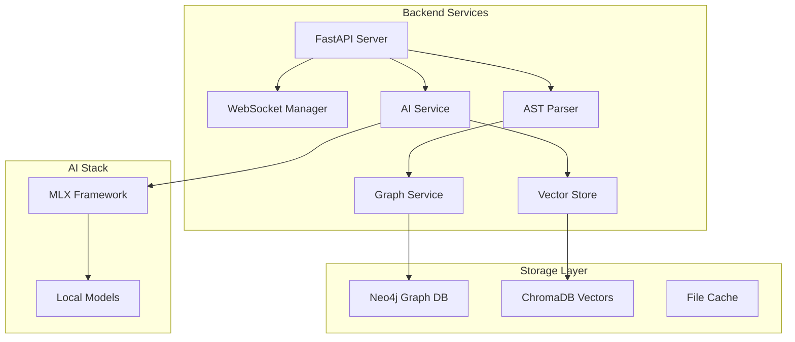

# 🧠 LeanVibe Backend

[](https://fastapi.tiangolo.com/)
[](https://www.python.org/downloads/)
[](https://ml-explore.github.io/mlx/build/html/index.html)
[](https://neo4j.com/)

> **The core AI-powered backend service that provides intelligent codebase analysis, real-time monitoring, and architectural insights.**

The LeanVibe backend is a FastAPI-based service that leverages Apple Silicon's MLX framework for on-device AI processing, ensuring complete privacy while delivering powerful development insights.

## ✨ Features

- **🔒 Privacy-First AI**: All processing happens locally using MLX
- **📊 Real-Time Analysis**: Live codebase monitoring and change detection
- **🏗️ Architecture Mapping**: Automatic dependency visualization with Neo4j
- **🧠 Intelligent Insights**: Context-aware code suggestions and refactoring
- **📡 WebSocket API**: Real-time communication with clients
- **⚡ High Performance**: Optimized for Apple Silicon

## 🏗️ Architecture



## 🚀 Quick Start

### Prerequisites

- **Hardware**: Mac with Apple Silicon (M1/M2/M3/M4)
- **Software**: macOS 13.0+, Python 3.11+
- **Memory**: 8GB+ RAM (16GB+ recommended)

### Installation

**Option 1: Automatic Setup (Recommended)**
```bash
# One command setup - installs uv, dependencies, and starts server
./start.sh
```

**Option 2: Manual Setup**
```bash
# Install uv package manager
curl -LsSf https://astral.sh/uv/install.sh | sh

# Sync dependencies
uv sync

# Optional: Install MLX for Apple Silicon
uv sync --extra mlx

# Start server
uv run uvicorn app.main:app --host 0.0.0.0 --port 8000 --reload
```

### Verify Installation

```bash
# Check health endpoint
curl http://localhost:8000/health

# Expected response:
# {"status": "healthy", "version": "1.0.0"}
```

## 📋 API Documentation

### REST Endpoints

| Endpoint | Method | Description |
|----------|--------|-------------|
| `/health` | GET | Service health check |
| `/api/v1/analyze` | POST | Analyze codebase |
| `/api/v1/tasks` | GET/POST | Task management |
| `/api/v1/code/complete` | POST | Code completion |
| `/api/v1/graph/query` | POST | Graph database queries |

### WebSocket Endpoints

- `/ws/test-client` - Development WebSocket client
- `/ws/monitor` - Real-time file monitoring
- `/ws/chat` - AI chat interface
- `/ws/metrics` - Performance metrics stream

### Available Commands

- `/list-files [directory]` - List files in current or specified directory
- `/read-file <path>` - Read contents of a file  
- `/current-dir` - Show current working directory
- `/status` - Show agent status
- `/help` - Show help information

### Example Usage

```python
import requests

# Analyze a file
response = requests.post(
    "http://localhost:8000/api/v1/analyze",
    json={
        "file_path": "/path/to/file.py",
        "analysis_type": "full"
    }
)

print(response.json())
```

**WebSocket Testing (using wscat):**
```bash
# Install wscat: npm install -g wscat
wscat -c ws://localhost:8000/ws/test-client

# Send command:
{"type": "command", "content": "/status"}
```

## 🧪 Testing

### Run Tests

```bash
# Using the test runner
python run_tests.py

# Or directly with pytest
uv run pytest tests/ -v

# Run integration tests (requires server running)
uv run python tests/test_integration.py
```

### Test Categories

```bash
# Unit tests
pytest tests/test_*.py

# Integration tests
pytest tests/integration/

# Performance tests
pytest tests/test_*_performance.py

# AI service tests
pytest tests/test_ai_*.py
```

## 🏗️ Project Structure

```
app/
├── main.py                    # FastAPI application entry point
├── core/
│   └── connection_manager.py  # WebSocket connection management
├── services/
│   ├── ai_service.py         # AI processing and command handling
│   ├── ast_parser_service.py # AST parsing and analysis
│   ├── graph_service.py      # Neo4j graph operations
│   ├── vector_store_service.py # ChromaDB vector operations
│   └── ...                   # Additional services
├── models/
│   ├── messages.py           # Pydantic data models
│   ├── ast_models.py         # AST-related models
│   └── ...                   # Additional models
├── api/
│   └── endpoints/            # REST API endpoints
└── utils/                    # Utility functions
```

## 🔧 Core Services

### AI Service (`app/services/ai_service.py`)
- **MLX Integration**: Local model inference
- **Code Analysis**: Semantic understanding and suggestions
- **Context Management**: Maintain conversation history

### AST Parser Service (`app/services/ast_parser_service.py`)
- **Multi-Language Support**: Python, JavaScript, TypeScript, Swift
- **Dependency Extraction**: Import/export analysis
- **Symbol Resolution**: Function, class, and variable mapping

### Graph Service (`app/services/graph_service.py`)
- **Neo4j Integration**: Store and query code relationships
- **Architecture Visualization**: Generate dependency graphs
- **Impact Analysis**: Track change propagation

### Vector Store Service (`app/services/vector_store_service.py`)
- **ChromaDB Integration**: Semantic code search
- **Embedding Generation**: Convert code to vectors
- **Similarity Search**: Find related code patterns

## ⚙️ Configuration

### Environment Variables

```bash
# Server Configuration
LEANVIBE_HOST=0.0.0.0
LEANVIBE_PORT=8000
LEANVIBE_LOG_LEVEL=INFO

# Database Configuration
NEO4J_URI=bolt://localhost:7687
NEO4J_USER=neo4j
NEO4J_PASSWORD=password

# AI Configuration
MLX_MODEL_PATH=./models
ENABLE_GPU=true
```

### Performance Tuning

```python
# Optimize for your hardware
MLX_GPU_MEMORY_LIMIT = 8192  # MB
MAX_CONCURRENT_REQUESTS = 10
CACHE_SIZE_LIMIT = 1024  # MB
```

## 🚀 Development

### Code Quality

```bash
# Install development dependencies
uv sync --extra dev

# Format and lint (using ruff)
ruff check . --fix
ruff format .

# Type checking
mypy app/
```

### Development Workflow

1. **Start development server**
   ```bash
   uvicorn app.main:app --reload --log-level debug
   ```

2. **Run tests continuously**
   ```bash
   pytest-watch tests/
   ```

3. **API documentation**
   - Swagger UI: http://localhost:8000/docs
   - ReDoc: http://localhost:8000/redoc

## 📊 Monitoring & Observability

### Health Checks

```bash
# Basic health
curl http://localhost:8000/health

# Detailed status
curl http://localhost:8000/api/v1/status
```

### Logging

```bash
# Debug mode
uvicorn app.main:app --log-level debug

# Structured logging
export LOG_FORMAT=json
```

## 🐛 Troubleshooting

### Common Issues

**Port already in use?**
```bash
# Find and kill process on port 8000
lsof -ti:8000 | xargs kill -9

# Or use different port
uvicorn app.main:app --port 8001
```

**MLX not available?**
```bash
# Check MLX installation
python -c "import mlx.core; print('MLX available')"

# Install if needed
uv sync --extra mlx
```

**Permission denied for directories?**
```bash
# Ensure read permissions
chmod -R 755 /path/to/project
```

### Debug Mode

```bash
# Start with debug logging
DEBUG=true uvicorn app.main:app --reload --log-level debug
```

## 🚀 Deployment

### Production Setup

```bash
# Production server
gunicorn app.main:app -w 4 -k uvicorn.workers.UvicornWorker

# With Docker
docker build -t leanvibe-backend .
docker run -p 8000:8000 leanvibe-backend
```

### Environment Variables for Production

```bash
export ENVIRONMENT=production
export LOG_LEVEL=INFO
export MLX_OPTIMIZATION_LEVEL=2
export ENABLE_METRICS=true
```

## 🤝 Contributing

### Development Setup

1. **Fork and clone**
2. **Create feature branch**
   ```bash
   git checkout -b feature/your-feature
   ```

3. **Install dependencies**
   ```bash
   uv sync --extra dev
   ```

4. **Make changes and test**
   ```bash
   ruff check . --fix && ruff format .
   python run_tests.py
   ```

5. **Submit pull request**

### Code Standards

- Use `ruff` for formatting and linting
- Write tests for new features
- Maintain >80% code coverage
- Follow conventional commit format

## 📄 License

This project is licensed under the MIT License - see the [LICENSE](../LICENSE) file for details.

## 🔗 Related Projects

- [LeanVibe CLI](../leanvibe-cli/README.md) - Command-line interface
- [LeanVibe iOS](../leanvibe-ios/README.md) - iOS companion app
- [Main Project](../README.md) - Overall project documentation

---

**Built with ❤️ for developers who value privacy and performance**