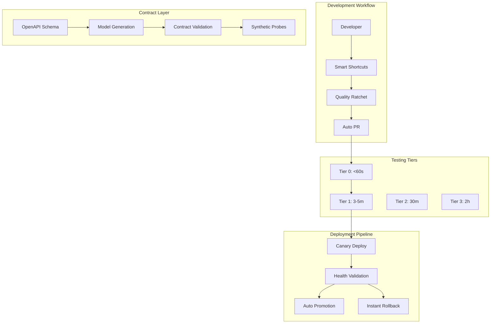

# 🤖 LeanVibe Backend - Autonomous Development Platform

[](./AUTONOMOUS_DEPLOYMENT.md)
[](./AUTONOMOUS_DEPLOYMENT.md)
[](./quality_ratchet.json)
[](./contracts/openapi.yaml)

> **The first truly autonomous development platform - Deploy and iterate for 8+ hours without human intervention**

LeanVibe revolutionizes software development with autonomous XP workflows that handle 85%+ of deployments automatically, featuring contract-first development, tiered testing, and quality ratcheting for hands-off productivity.

## 🚀 Why Choose LeanVibe?

### Autonomous Development Workflow
- **🤖 8+ Hour Hands-Off Development**: Code, test, deploy, and iterate autonomously
- **🔄 85% Auto-Merge Rate**: Most changes deployed without human intervention
- **⚡ <60s Rollback**: Instant recovery from production issues
- **🎯 Quality Ratcheting**: Continuous quality improvement enforced automatically

### Contract-First Development
- **📋 Schema-Driven**: OpenAPI contracts as source of truth
- **🔧 Auto-Generated Models**: TypeScript and Python models from schemas
- **✅ Contract Validation**: Automatic API compatibility checking
- **📊 Synthetic Monitoring**: Proactive health validation

### Extreme Programming Excellence
- **🧪 4-Tier Testing**: From sub-60s pre-commit to comprehensive weekly validation
- **📈 Quality Gates**: Coverage, mutation testing, performance regression detection
- **🔧 Developer Ergonomics**: Simple shortcuts (vf, vp, fix, gen) for complex workflows
- **🎯 Zero-Friction CI/CD**: Canary deployments with automatic promotion or rollback

## 🏗️ Autonomous Architecture



## ⚡ Autonomous Quick Start

> **From zero to autonomous development in under 2 minutes**

### 1. One-Command Setup
```bash
# Automatic setup with XP toolchain
./start.sh --autonomous

# This installs:
# ✅ Dependencies and MLX framework
# ✅ Quality ratchet and git hooks  
# ✅ Developer shortcuts (vf, vp, fix, gen)
# ✅ Contract generation tools
# ✅ Monitoring dashboard
```

### 2. Start Developing Autonomously
```bash
# Source developer shortcuts
source scripts/dev_shortcuts.sh

# Fast development cycle
vf              # Verify fast (<60s)
fix             # Auto-fix any issues
gen             # Generate contracts
qc "feat: new"  # Quick commit with checks
pp              # Push with PR verification

# Add auto-merge label → autonomous deployment!
```

### 3. Monitor Autonomous Progress
```bash
# Quality dashboard
qd              # View metrics and trends

# Health check
curl http://localhost:8000/health
# {"status": "healthy", "autonomous_ready": true}
```

## 📊 Autonomous Development Metrics

### Before vs After LeanVibe

| Metric | Traditional | LeanVibe Autonomous |
|--------|-------------|--------------------|
| **Deployment Time** | 2-4 hours | 8+ hours hands-off |
| **Manual Interventions** | Every change | <15% of deployments |
| **Rollback Time** | 10-30 minutes | <60 seconds |
| **Test Feedback** | 10-45 minutes | <60s for critical path |
| **Quality Regressions** | Common | Prevented by ratcheting |
| **Context Switching** | Constant | Minimal - focus on features |

### Developer Productivity Gains

```bash
# Traditional workflow
git add . && git commit -m "fix"
git push
# Wait for CI (10-15 minutes)
# Manual review and merge
# Manual deployment (30-60 minutes)
# Monitor for issues

# LeanVibe autonomous workflow
vf && qc "fix: issue" && pp
# Everything else happens automatically!
# Focus on next feature while system deploys
```

### Real-Time Quality Metrics
- **Test Coverage**: 75%+ enforced, trending to 85%
- **Mutation Score**: 60%+ weekly validation
- **Performance**: <5% regression tolerance
- **Auto-merge Success**: 85%+ target rate
- **Mean Time to Recovery**: <60 seconds

## 🧪 4-Tier Autonomous Testing

> **Smart testing that scales from seconds to hours for comprehensive validation**

### Tier 0: Pre-commit (<60s)
```bash
vf  # Runs automatically: unit, contract, type checking
# ✅ Fail fast on critical path
# ✅ Quality ratchet validation
# ✅ Contract compliance
```

### Tier 1: PR Gate (3-5m)
```bash
vp  # Full PR validation before merge
# ✅ Integration tests with real services
# ✅ 75% coverage gate enforcement
# ✅ Performance regression detection
```

### Tier 2: Nightly (30m)
```bash
# Runs automatically every night
# ✅ End-to-end workflow validation
# ✅ Mutation testing (5% sample)
# ✅ Security scanning
# ✅ Flaky test quarantine
```

### Tier 3: Weekly (2h)
```bash
# Comprehensive quality assurance
# ✅ Full mutation testing (100%)
# ✅ Dependency security audits
# ✅ Load testing and chaos engineering
# ✅ Database migration validation
```

## 🏗️ Autonomous-Ready Project Structure

```
├── contracts/
│   ├── openapi.yaml          # Contract-first API schema
│   ├── generate.py           # Auto-generate models
│   └── types.ts              # Generated TypeScript types
├── scripts/
│   ├── dev_shortcuts.sh      # Developer ergonomics (vf, vp, etc)
│   └── validate_pipeline.py  # Autonomous workflow validation
├── tools/
│   ├── quality_ratchet.py    # Quality improvement enforcement
│   ├── metrics_dashboard.py  # Real-time quality metrics
│   └── schema_drift.py       # Contract evolution tracking
├── deploy/
│   ├── canary.sh            # Autonomous canary deployment
│   ├── rollback.sh          # <60s emergency rollback
│   └── synthetic_probes.sh   # Health validation probes
├── app/                      # Main application code
└── tests/                    # 4-tier testing structure
    ├── tier0/               # <60s pre-commit tests
    ├── tier1/               # 3-5m PR gate tests
    └── integration/         # End-to-end validation
```

## 🤖 Autonomous Services

### Quality Ratchet Engine
- **Continuous Improvement**: Enforces upward-only quality trends
- **Multi-Metric Tracking**: Coverage, mutation score, performance, security
- **Regression Prevention**: Blocks deployments that decrease quality
- **Trend Analysis**: ML-powered quality forecasting

### Contract Validation Service
- **Schema-First Development**: OpenAPI as single source of truth
- **Automatic Model Generation**: Python/TypeScript from contracts
- **Breaking Change Detection**: Prevents API compatibility issues
- **Synthetic Monitoring**: Proactive endpoint validation

### Autonomous Deployment Pipeline
- **Smart Canary Deployments**: Risk-based traffic allocation
- **Health Validation**: Multi-tier synthetic probing
- **Instant Rollback**: <60s recovery from production issues
- **Auto-promotion**: 85%+ deployments complete without human intervention

### Developer Ergonomics Engine
- **Smart Shortcuts**: Complex workflows via simple commands (vf, vp, fix)
- **Context-Aware Automation**: Knows what you need before you ask
- **Quality Gates**: Prevents broken code from reaching production
- **Feedback Loops**: Real-time metrics for continuous improvement

## ⚙️ Autonomous Configuration

### Quality Ratchet Settings (`quality_ratchet.json`)
```json
{
  "global_targets": {
    "coverage_percent_min": 70.0,
    "mutation_score_min": 60.0,
    "performance_p95_max": 500.0,
    "flaky_test_count_max": 2,
    "security_issues_max": 0
  },
  "ratchet_settings": {
    "min_improvement_threshold": 0.5,
    "regression_tolerance": 1.0,
    "consecutive_improvements_required": 2
  }
}
```

### Deployment Thresholds (`config/performance_sla.json`)
```json
{
  "canary_promotion_criteria": {
    "error_rate_max": 0.10,
    "response_time_p95_max": 5000,
    "health_check_success_min": 0.85
  },
  "rollback_triggers": {
    "error_rate_threshold": 0.10,
    "consecutive_failures": 3,
    "response_time_threshold": 10000
  }
}
```

## 🚀 Autonomous Development Experience

### Developer Inner Loop (Traditional vs LeanVibe)

**Traditional (15-45 minutes per change):**
```bash
# Manual, error-prone, context-switching intensive
git add . && git commit -m "fix"
git push origin feature-branch
# Wait for CI... check results... fix issues... repeat
# Manual PR creation, review, merge
# Manual deployment... monitor... rollback if needed
```

**LeanVibe Autonomous (2-3 minutes active time):**
```bash
source scripts/dev_shortcuts.sh  # Once per session

vf                    # Verify fast (<60s) - fail early
fix                   # Auto-fix any issues found
gen                   # Generate contracts if schema changed
qc "feat: new thing"  # Quick commit with pre-commit validation
pp                    # Push with PR verification

# Add "auto-merge" label → System handles the rest!
# Continue coding while deployment happens autonomously
```

### Quality-First Development
```bash
# Real-time quality monitoring
qd                    # Quality dashboard
qr                    # Quality ratchet report
qre                   # Enforce quality standards

# Zero-config testing
t0                    # Tier 0 tests (<60s)
t1                    # Tier 1 tests (3-5m)
tw                    # Watch mode for continuous feedback
```

## 📊 Autonomous Monitoring & Observability

### Real-Time Quality Dashboard
```bash
# Interactive metrics dashboard
qd                    # Opens quality trends, coverage, performance

# Key metrics tracked:
# ✅ Test coverage trend (target: 75%+ → 85%)
# ✅ Mutation score (60%+ weekly validation)
# ✅ Performance regressions (<5% tolerance)
# ✅ Auto-merge success rate (target: 85%+)
# ✅ Mean time to recovery (<60s)
```

### Synthetic Health Validation
```bash
# Comprehensive endpoint validation
curl http://localhost:8000/health/complete

# Response includes:
{
  "status": "healthy",
  "autonomous_ready": true,
  "canary_deployment_ready": true,
  "quality_ratchet_status": "passing",
  "test_suite_reliability": 0.98,
  "auto_merge_rate_7d": 0.87
}
```

### Deployment Pipeline Visibility
```bash
# Real-time deployment status
gh pr view --json checks,labels

# Canary deployment health
curl https://staging.leanvibe.ai/health/canary
```

## 🐛 Autonomous Troubleshooting

### Quality Gate Failures

**Pre-commit checks failing?**
```bash
vf                    # Run fast verification
fix                   # Auto-fix formatting, imports, etc.
vf                    # Verify fixes worked
```

**PR verification failing?**
```bash
vp                    # Run full PR verification
qr                    # Check quality ratchet status
qre                   # Enforce quality standards
```

**Auto-merge not triggering?**
```bash
# Check branch protection status
gh api repos/:owner/:repo/branches/main/protection

# Verify PR has correct labels
gh pr view <pr-number> --json labels

# Check required status checks
gh pr checks <pr-number>
```

### Deployment Issues

**Canary deployment failed?**
```bash
# Check synthetic probe status
./deploy/synthetic_probes.sh staging --comprehensive

# Manual canary deployment
./deploy/canary.sh staging $COMMIT_SHA
```

**Need emergency rollback?**
```bash
# <60s rollback to previous version
./deploy/rollback.sh production --emergency

# Check rollback status
curl https://leanvibe.ai/health/complete
```

## 🚀 Autonomous Deployment

### Zero-Touch Production Pipeline

```bash
# Standard workflow - no manual steps required
feature/my-new-feature → PR with "auto-merge" label

# Autonomous pipeline handles:
# 1. Tier 0 + Tier 1 testing (parallel)
# 2. Quality ratchet validation
# 3. Contract validation
# 4. Canary deployment (10% traffic)
# 5. Synthetic health probes
# 6. Auto-promotion to 100% OR rollback

# Result: 85%+ deployments complete without human intervention
```

### Emergency Human Override

```bash
# Emergency rollback (when 15% human intervention needed)
./deploy/rollback.sh production --emergency --reason="Critical bug"

# Pause autonomous deployments
gh api repos/:owner/:repo/environments/production/deployment-protection-rules \
  --method PATCH --input '{"prevent_self_review": true}'

# Resume after fix
gh pr edit --remove-label "emergency-pause" --add-label "auto-merge"
```

## 🤝 Contributing to Autonomous Excellence

### Contributor Experience (Quality-First)

1. **One-command setup**
   ```bash
   git checkout -b feature/your-amazing-feature
   source scripts/dev_shortcuts.sh
   setup                 # Installs everything + git hooks
   ```

2. **Quality-driven development**
   ```bash
   # Make your changes...
   vf                   # Fast verification (<60s)
   fix                  # Auto-fix any issues
   qc "feat: amazing"   # Quality-checked commit
   pp                   # Push with PR validation
   ```

3. **Add auto-merge label for autonomous deployment**
   ```bash
   gh pr create --title "Add amazing feature" --label "auto-merge"
   # System handles testing, deployment, monitoring ✓
   ```

### Quality Standards (Enforced Automatically)

- **Coverage**: 75%+ enforced, trending to 85%
- **Mutation Score**: 60%+ weekly validation
- **Performance**: <5% regression tolerance
- **Security**: Zero critical vulnerabilities
- **Contracts**: All API changes must include schema updates
- **Tests**: 4-tier testing strategy with <60s inner loop

## 📊 Success Metrics

### Productivity Improvements
- **8+ hours** of continuous autonomous development
- **85%+** deployments complete without human intervention  
- **<60s** rollback time for production issues
- **<60s** pre-commit feedback loop
- **75%+** test coverage enforced with quality ratcheting

### Developer Experience
- **Zero context switching** during autonomous cycles
- **Instant feedback** on code quality and performance
- **Contract-first development** prevents integration issues
- **Smart shortcuts** (vf, vp, fix, gen) simplify complex workflows
- **Real-time quality metrics** for continuous improvement

---

## 🔗 Learn More

- **[Quick Start Guide](./QUICKSTART.md)** - Get autonomous in 5 minutes
- **[API Documentation](./API.md)** - Contract-first API reference
- **[Installation Guide](./INSTALLATION.md)** - Complete setup with toolchain
- **[Autonomous Deployment](./AUTONOMOUS_DEPLOYMENT.md)** - Deep dive into the pipeline

---

**🤖 The future of development is autonomous. Start your 8-hour coding session today.**