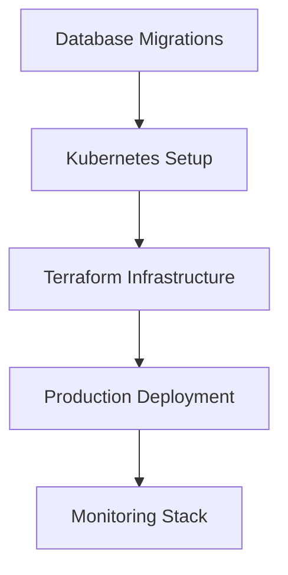

# LeanVibe Enterprise SaaS Platform - Technical Infrastructure Assessment

## Executive Summary

The LeanVibe platform demonstrates **strong enterprise foundations** with comprehensive multi-tenancy, advanced authentication, and robust testing infrastructure. However, several critical production infrastructure components are missing that prevent enterprise-scale deployment.

**Current Maturity Level:** Pre-Production (75% complete)
**Primary Gap:** Production infrastructure and deployment automation
**Immediate Priority:** Database management and container orchestration

---

## ✅ IMPLEMENTED ENTERPRISE SYSTEMS

### Multi-Tenancy Architecture (Complete - 95%)
```python
# Comprehensive tenant isolation with resource quotas
- Models: Tenant, TenantQuotas, TenantConfiguration, TenantMember
- Service: tenant_service.py (CRUD, quota management, usage tracking)  
- Middleware: tenant_middleware.py (request-level context isolation)
- Plans: Developer ($50/mo), Team ($200/mo), Enterprise ($800/mo)
- Quotas: API calls, storage, users, projects, concurrent sessions
- Data Residency: US, EU, UK, Canada, Australia compliance
- Hierarchical Organizations: Parent-child tenant relationships
```

### Enterprise Authentication (Complete - 90%)
```python
# Production-ready auth with SSO, SAML, MFA
- Models: User, SSOConfiguration, UserSession, PasswordPolicy, AuditLog
- Service: auth_service.py (JWT, MFA, audit trails)
- Providers: Local, Google, Microsoft, Okta, Auth0, SAML, LDAP
- MFA Methods: TOTP, SMS, Email, Push, Hardware tokens
- Security: Password policies, account lockout, audit logging
- Session Management: JWT with refresh tokens, IP tracking
```

### Enterprise Billing (Complete - 85%)
```python
# Stripe-integrated subscription management
- Models: Plan, Subscription, Invoice, Payment, UsageRecord
- Service: billing_service.py (Stripe webhooks, usage tracking)
- Plans: Tiered pricing with usage-based billing
- Features: Trial management, proration, tax handling
- Analytics: MRR, ARR, usage trends, payment health
- Compliance: Multi-currency, tax calculations, invoicing
```

### Quality Infrastructure (Excellent - 95%)
```bash
# 4-tier testing system with autonomous workflow
Tier 0: Pre-commit (<60s) - Units, contracts, types, lint
Tier 1: PR Gate (3-5m) - Integration, WebSocket, smoke, coverage
Tier 2: Nightly (30m) - E2E, mutation testing, performance
Tier 3: Weekly (2h) - Load testing, security, dependencies

# Quality ratchets with 70% coverage minimum
# Autonomous CI/CD with auto-merge capabilities
# Comprehensive monitoring with synthetic probes
```

---

## ❌ CRITICAL INFRASTRUCTURE GAPS

## A. PRODUCTION INFRASTRUCTURE COMPONENTS MATRIX

| Component | Current State | Enterprise Requirement | Implementation Effort | Priority |
|-----------|---------------|------------------------|----------------------|----------|
| **Database Management** | Basic SQLAlchemy | Production-ready with migrations | Medium | **P0** |
| **Container Orchestration** | Docker Compose only | Kubernetes/ECS deployment | High | **P0** |
| **Infrastructure as Code** | Missing | Terraform/Pulumi automation | High | **P0** |
| **CI/CD Pipeline** | GitHub Actions basic | Production deployment pipeline | Medium | **P1** |
| **Monitoring Stack** | Synthetic probes only | Full observability (Prometheus/Grafana) | Medium | **P1** |
| **Security Scanning** | Manual security audit | Automated vulnerability scanning | Medium | **P1** |
| **Secrets Management** | Basic implementation | Enterprise vault (HashiCorp/AWS) | Low | **P1** |
| **Load Balancing** | None | Application load balancer with SSL | Medium | **P2** |
| **CDN & Caching** | Redis basic | Multi-tier caching strategy | Medium | **P2** |
| **Backup & DR** | Missing | Automated backup and recovery | Medium | **P2** |

---

## B. DATABASE MANAGEMENT GAPS

### Missing Components:
```python
# 🚨 CRITICAL: Database migrations system
- No Alembic integration for schema management
- No migration rollback capabilities  
- No database seeding for environments
- No connection pooling optimization

# Required Implementation:
migrations/
├── alembic.ini
├── env.py
├── versions/
│   ├── 001_initial_schema.py
│   ├── 002_add_tenants.py
│   └── 003_add_billing.py
└── seed_data/
    ├── development_seed.py
    └── production_minimal.py
```

### Database Scaling Needs:
- **Read Replicas:** For tenant-heavy workloads
- **Connection Pooling:** PgBouncer or built-in pooling
- **Query Optimization:** Index management, slow query monitoring
- **Backup Strategy:** Point-in-time recovery, cross-region backups

---

## C. CONTAINER ORCHESTRATION GAPS

### Current State: Docker Compose Only
```yaml
# Existing: docker-compose.production.yml
- Basic multi-container setup
- No horizontal scaling
- No health checks automation
- No rolling deployment strategy
```

### Required: Kubernetes/ECS Implementation
```yaml
# Needed: k8s/ directory structure
k8s/
├── namespace.yaml
├── deployment.yaml      # App deployment with HPA
├── service.yaml         # Load balancer service
├── ingress.yaml         # SSL termination, routing
├── configmap.yaml       # Environment configuration  
├── secrets.yaml         # Encrypted secrets
└── monitoring/
    ├── prometheus.yaml
    ├── grafana.yaml
    └── alertmanager.yaml
```

---

## D. INFRASTRUCTURE AS CODE GAPS

### Missing: Complete Infrastructure Automation
```hcl
# Required: terraform/ directory
terraform/
├── main.tf              # Core infrastructure
├── variables.tf         # Configuration variables
├── outputs.tf           # Infrastructure outputs
├── modules/
│   ├── database/        # RDS/CloudSQL setup
│   ├── compute/         # ECS/GKE cluster
│   ├── networking/      # VPC, subnets, security groups
│   ├── monitoring/      # CloudWatch/Stackdriver
│   └── storage/         # S3/GCS buckets
└── environments/
    ├── staging/
    └── production/
```

### Infrastructure Requirements:
- **Compute:** Auto-scaling container clusters
- **Database:** Multi-AZ PostgreSQL with read replicas
- **Storage:** Object storage for files, backups
- **Networking:** Private subnets, security groups, WAF
- **Monitoring:** Centralized logging, metrics, alerting

---

## E. PRODUCTION MONITORING GAPS

### Current: Basic Synthetic Probes
```python
# Existing monitoring (good foundation):
- Health endpoint monitoring
- WebSocket connection tests  
- Error budget tracking
- Performance budget validation
```

### Required: Full Observability Stack
```yaml
# Missing comprehensive monitoring:
monitoring/
├── prometheus/          # Metrics collection
├── grafana/            # Dashboards and visualization
├── alertmanager/       # Alert routing and escalation
├── loki/               # Log aggregation
└── jaeger/             # Distributed tracing
```

### Observability Requirements:
- **Application Metrics:** Request rate, latency, errors
- **Business Metrics:** Tenant usage, billing events, feature adoption
- **Infrastructure Metrics:** CPU, memory, disk, network
- **Log Aggregation:** Structured logging with correlation IDs
- **Distributed Tracing:** Request flow across services
- **Alert Management:** PagerDuty/Slack integration

---

## PRODUCTION READINESS CHECKLIST

### 🚨 P0 - Deployment Blockers (Must Complete)

#### Database Production Readiness
- [ ] **Alembic Migration System**
  - Setup: `pip install alembic && alembic init migrations`
  - Create initial migration from existing models
  - Implement rollback procedures
  - Add environment-specific seeding

- [ ] **Database Scaling Configuration**
  - Configure connection pooling (20-50 connections)
  - Setup read replicas for tenant queries
  - Implement query performance monitoring
  - Add automated backup scheduling

#### Container Orchestration
- [ ] **Kubernetes Deployment**
  - Create namespace and RBAC configuration
  - Implement horizontal pod autoscaling (HPA)
  - Setup service mesh for inter-service communication
  - Configure persistent volumes for database

- [ ] **Production Dockerfile Optimization**
  - Multi-stage build for minimal image size
  - Non-root user security hardening
  - Health check optimization
  - Build-time dependency caching

#### Infrastructure as Code
- [ ] **Terraform Implementation**
  - Core infrastructure modules (compute, database, networking)
  - Environment-specific configurations
  - State management with remote backend
  - Resource tagging and cost optimization

### 🔧 P1 - Production Features (High Priority)

#### CI/CD Enhancement
- [ ] **Advanced Deployment Pipeline**
  ```yaml
  # Enhanced .github/workflows/production.yml
  - Build and security scan Docker images
  - Deploy to staging with full integration tests
  - Blue-green deployment to production
  - Automated rollback on health check failure
  ```

- [ ] **Quality Gates Enhancement**
  - Integration with SonarQube for code quality
  - OWASP dependency vulnerability scanning
  - Performance regression testing
  - Infrastructure drift detection

#### Monitoring & Alerting
- [ ] **Prometheus/Grafana Stack**
  - Custom metrics for business KPIs
  - Multi-environment dashboards
  - Alert routing to PagerDuty/Slack
  - SLA monitoring and reporting

#### Security Hardening
- [ ] **Automated Security Scanning**
  - Container image vulnerability scanning
  - Static code analysis (SAST)
  - Dynamic security testing (DAST)
  - Infrastructure compliance scanning

### 📈 P2 - Scalability Features (Medium Priority)

#### Performance Optimization
- [ ] **Multi-tier Caching Strategy**
  ```python
  # Implement caching layers:
  - Redis for session and auth data
  - CDN for static assets
  - Application-level caching for tenant data
  - Database query result caching
  ```

#### High Availability
- [ ] **Multi-region Deployment**
  - Database replication across regions
  - Global load balancer with health checks
  - Disaster recovery automation
  - Data residency compliance

---

## SCALABILITY ROADMAP

### Phase 1: Foundation (Months 1-2)
**Target:** Support 100 enterprise tenants, 10K users



**Key Deliverables:**
- Database migration system with rollback
- Kubernetes cluster with auto-scaling
- Infrastructure as Code with Terraform
- Production deployment pipeline
- Basic monitoring and alerting

**Capacity Targets:**
- 1000 RPS per application instance
- 99.9% uptime SLA
- <500ms P95 response time
- Support for 10TB total storage

### Phase 2: Scale (Months 3-4)
**Target:** Support 500 enterprise tenants, 50K users

**Key Deliverables:**
- Multi-region deployment capability
- Advanced caching and CDN integration  
- Comprehensive security automation
- Advanced monitoring with business metrics
- Disaster recovery automation

**Capacity Targets:**
- 5000 RPS across multiple regions
- 99.95% uptime SLA
- <200ms P95 response time
- Support for 100TB total storage

### Phase 3: Enterprise Scale (Months 5-6)
**Target:** Support 1000+ enterprise tenants, 100K+ users

**Key Deliverables:**
- Microservices architecture migration
- Event-driven architecture with message queues
- Advanced AI/ML infrastructure
- Compliance automation (SOC2, GDPR, HIPAA)
- Enterprise support tooling

**Capacity Targets:**
- 20K+ RPS globally distributed
- 99.99% uptime SLA
- <100ms P95 response time
- Unlimited horizontal scaling

---

## IMPLEMENTATION RECOMMENDATIONS

### Immediate Actions (Next 30 Days)

1. **Database Migration System**
   ```bash
   # Set up Alembic
   pip install alembic
   alembic init migrations
   alembic revision --autogenerate -m "Initial schema"
   ```

2. **Basic Kubernetes Setup**
   ```bash
   # Create minimal k8s configuration
   mkdir k8s/
   # Implement deployment, service, ingress configs
   # Test with minikube locally
   ```

3. **Terraform Foundation**
   ```bash
   # Initialize Terraform workspace
   mkdir terraform/
   # Implement core modules for AWS/GCP
   # Setup remote state management
   ```

### Resource Requirements

#### Development Team
- **DevOps Engineer (1 FTE):** Infrastructure as Code, Kubernetes, CI/CD
- **Backend Engineer (0.5 FTE):** Database migrations, performance optimization
- **SRE Consultant (0.25 FTE):** Monitoring, alerting, SLA design

#### Infrastructure Costs (Monthly Estimates)
- **Staging Environment:** $500-1000/month
- **Production Environment:** $2000-5000/month
- **Monitoring Stack:** $200-500/month
- **Security Tools:** $300-800/month
- **Total Estimated:** $3000-7300/month

#### Timeline Estimates
- **Database & Migrations:** 2-3 weeks
- **Kubernetes Setup:** 3-4 weeks  
- **Infrastructure as Code:** 4-6 weeks
- **CI/CD Enhancement:** 2-3 weeks
- **Monitoring Implementation:** 3-4 weeks
- **Total Timeline:** 12-16 weeks for full production readiness

---

## TECHNICAL ARCHITECTURE RECOMMENDATIONS

### Database Architecture
```python
# Recommended production database setup
Primary Database (PostgreSQL):
- Multi-AZ deployment for high availability
- Read replicas for tenant-heavy queries
- Connection pooling with PgBouncer
- Automated backup with point-in-time recovery

Caching Layer (Redis):
- Cluster mode for high availability
- Separate instances for sessions vs application cache
- TTL policies for different data types
- Memory optimization for cost efficiency
```

### Container Orchestration Strategy
```yaml
# Kubernetes deployment strategy
apiVersion: apps/v1
kind: Deployment
metadata:
  name: leanvibe-backend
spec:
  replicas: 3
  strategy:
    type: RollingUpdate
    rollingUpdate:
      maxUnavailable: 1
      maxSurge: 1
  template:
    spec:
      containers:
      - name: backend
        image: leanvibe-backend:latest
        resources:
          requests:
            memory: "256Mi"
            cpu: "250m"
          limits:
            memory: "512Mi"
            cpu: "500m"
        livenessProbe:
          httpGet:
            path: /health
            port: 8000
          initialDelaySeconds: 30
          periodSeconds: 10
```

### Monitoring and Alerting Strategy
```yaml
# Recommended monitoring stack
Components:
  - Prometheus: Metrics collection and storage
  - Grafana: Dashboards and visualization  
  - AlertManager: Alert routing and escalation
  - Loki: Log aggregation and search
  - Jaeger: Distributed tracing

Key Metrics:
  - Business: Tenant signups, billing events, feature usage
  - Application: Request rate, error rate, response time
  - Infrastructure: CPU, memory, disk, network
  - Database: Connection count, query performance, replication lag
```

---

## CONCLUSION

The LeanVibe platform has **excellent enterprise foundations** with comprehensive multi-tenancy, authentication, billing, and testing infrastructure. The primary gap is production infrastructure automation.

### Critical Path to Production:
1. **Database migrations system** (2-3 weeks)
2. **Kubernetes deployment** (3-4 weeks) 
3. **Infrastructure as Code** (4-6 weeks)
4. **Production monitoring** (3-4 weeks)

### Total Investment Required:
- **Timeline:** 12-16 weeks for full production readiness
- **Team:** 1.75 FTE for infrastructure implementation
- **Infrastructure Costs:** $3K-7K monthly ongoing
- **One-time Setup:** $20K-40K for tooling and implementation

### Expected ROI:
- **Scalability:** Support 100x more enterprise customers
- **Reliability:** 99.9%+ uptime SLA capability
- **Developer Velocity:** Autonomous deployment reduces time-to-market by 50%
- **Enterprise Sales:** Production-ready infrastructure enables enterprise contracts

The platform is well-positioned for rapid production deployment once these infrastructure components are implemented.