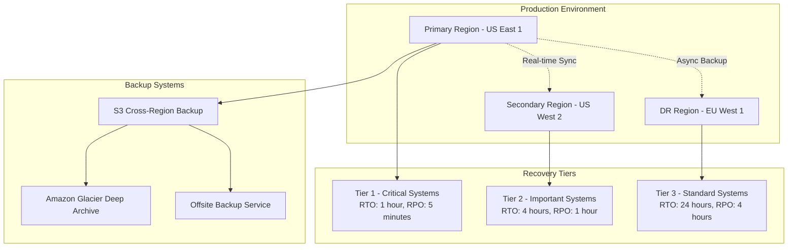

# LeanVibe Enterprise Disaster Recovery & Business Continuity Guide

## Table of Contents

1. [Disaster Recovery Overview](#disaster-recovery-overview)
2. [Business Continuity Framework](#business-continuity-framework)
3. [Backup Infrastructure and Procedures](#backup-infrastructure-and-procedures)
4. [Multi-Region Failover Procedures](#multi-region-failover-procedures)
5. [Data Recovery and Restoration](#data-recovery-and-restoration)
6. [Communication and Incident Management](#communication-and-incident-management)
7. [Testing and Validation](#testing-and-validation)
8. [Recovery Time and Point Objectives](#recovery-time-and-point-objectives)
9. [Business Impact Analysis](#business-impact-analysis)
10. [Vendor and Third-Party Dependencies](#vendor-and-third-party-dependencies)

## Disaster Recovery Overview

### Enterprise DR Strategy

LeanVibe's disaster recovery strategy ensures business continuity with minimal service disruption through a comprehensive multi-tier approach:



### Disaster Categories and Response Levels

#### Level 1: Minor Incidents
**Definition**: Localized failures affecting <5% of infrastructure
- **Examples**: Single pod failures, temporary network issues
- **Response**: Automated failover, monitoring alerts
- **RTO**: < 5 minutes (automated)
- **RPO**: Real-time

#### Level 2: Major Incidents  
**Definition**: Regional service degradation affecting 5-25% of infrastructure
- **Examples**: Availability zone failures, database performance issues
- **Response**: Regional failover, manual intervention
- **RTO**: < 1 hour
- **RPO**: < 5 minutes

#### Level 3: Critical Disasters
**Definition**: Complete regional failure affecting >25% of infrastructure
- **Examples**: Natural disasters, major cloud provider outages
- **Response**: Cross-region disaster recovery activation
- **RTO**: < 4 hours
- **RPO**: < 1 hour

#### Level 4: Catastrophic Events
**Definition**: Multi-region failure or major security incidents
- **Examples**: Coordinated cyber attacks, global infrastructure failures
- **Response**: Full business continuity plan activation
- **RTO**: < 24 hours
- **RPO**: < 4 hours

## Business Continuity Framework

### Critical Business Functions

#### Tier 1 - Mission Critical (RTO: 1 hour)
- **Customer API Services**: Core product functionality
- **Authentication Systems**: User login and access management
- **Billing System**: Payment processing and subscription management
- **Core Database**: Primary tenant and user data
- **Monitoring and Alerting**: System health and incident response

#### Tier 2 - Important (RTO: 4 hours)
- **Analytics and Reporting**: Business intelligence and customer dashboards
- **Integration Services**: Third-party API connections
- **Backup Systems**: Data protection and recovery services
- **Documentation Platform**: Knowledge base and user guides
- **Customer Support Tools**: Ticketing and communication systems

#### Tier 3 - Standard (RTO: 24 hours)
- **Development Environments**: Non-production systems
- **Internal Tools**: Administrative and operational utilities
- **Marketing Systems**: Website and promotional content
- **Archive Data**: Historical records and audit logs
- **Training Platforms**: Internal learning and development

### Business Impact Assessment

#### Revenue Impact Analysis
```python
# Business impact calculation framework
class BusinessImpactCalculator:
    def __init__(self):
        self.hourly_revenue_rates = {
            'enterprise': 150,    # $150/hour average
            'team': 45,          # $45/hour average
            'developer': 15      # $15/hour average
        }
        
        self.customer_distribution = {
            'enterprise': 0.15,   # 15% of customers
            'team': 0.35,        # 35% of customers
            'developer': 0.50    # 50% of customers
        }
    
    def calculate_revenue_loss(self, outage_duration_hours: float, 
                             affected_percentage: float = 1.0) -> dict:
        """Calculate revenue loss from service outage"""
        
        total_loss = 0
        impact_breakdown = {}
        
        for tier, hourly_rate in self.hourly_revenue_rates.items():
            customer_percentage = self.customer_distribution[tier]
            tier_loss = (hourly_rate * customer_percentage * 
                        outage_duration_hours * affected_percentage)
            
            impact_breakdown[tier] = {
                'hourly_rate': hourly_rate,
                'customers_affected': customer_percentage * affected_percentage,
                'total_loss': tier_loss
            }
            
            total_loss += tier_loss
        
        return {
            'total_revenue_loss': total_loss,
            'breakdown_by_tier': impact_breakdown,
            'outage_duration_hours': outage_duration_hours,
            'affected_percentage': affected_percentage
        }
    
    def calculate_sla_credits(self, uptime_percentage: float, 
                            monthly_revenue: float) -> dict:
        """Calculate SLA credits based on uptime"""
        
        sla_credits = {
            'enterprise': {
                99.95: 0,      # No credit for meeting SLA
                99.90: 0.10,   # 10% credit for 99.90-99.95%
                99.50: 0.25,   # 25% credit for 99.50-99.90%
                99.00: 0.50,   # 50% credit for 99.00-99.50%
                0.00: 1.00     # 100% credit for <99.00%
            }
        }
        
        credit_percentage = 0
        if uptime_percentage < 99.00:
            credit_percentage = 1.00
        elif uptime_percentage < 99.50:
            credit_percentage = 0.50
        elif uptime_percentage < 99.90:
            credit_percentage = 0.25
        elif uptime_percentage < 99.95:
            credit_percentage = 0.10
        
        return {
            'uptime_percentage': uptime_percentage,
            'credit_percentage': credit_percentage,
            'credit_amount': monthly_revenue * credit_percentage,
            'sla_target': 99.95
        }
```

### Stakeholder Communication Matrix

#### Internal Stakeholders
| Role | Contact Method | Notification Time | Responsibilities |
|------|---------------|-------------------|------------------|
| **CEO** | Phone + Email | Immediate (Level 3+) | Executive decision making, external communication |
| **CTO** | Phone + Slack | Immediate (Level 2+) | Technical leadership, resource allocation |
| **VP Engineering** | Slack + Email | 15 minutes (Level 2+) | Engineering team coordination |
| **Platform Team Lead** | Slack | 5 minutes (All levels) | Incident response coordination |
| **Customer Success** | Slack + Email | 30 minutes (Level 2+) | Customer communication and support |
| **Marketing** | Email | 1 hour (Level 3+) | Public relations and communication |

#### External Stakeholders  
| Stakeholder | Contact Method | Notification Time | Communication Channel |
|-------------|---------------|-------------------|----------------------|
| **Enterprise Customers** | Email + Phone | 30 minutes (Level 2+) | Dedicated customer portal + direct contact |
| **Team Customers** | Email + Status Page | 1 hour (Level 3+) | Status page + email notifications |
| **Developer Customers** | Status Page | 2 hours (Level 3+) | Public status page updates |
| **Partners/Vendors** | Email | As needed | Direct communication |
| **Regulatory Bodies** | Email + Formal Notice | As required | Compliance team coordination |

## Backup Infrastructure and Procedures

### Comprehensive Backup Architecture

#### Multi-Tier Backup Strategy
```yaml
# Backup architecture configuration
backup_architecture:
  tier_1_realtime:
    systems: ["primary_database", "transaction_logs", "user_sessions"]
    frequency: "continuous"
    retention: "7_days"
    storage: "primary_region_ssd"
    encryption: "AES-256"
    
  tier_2_frequent:
    systems: ["application_data", "configuration", "metrics"]
    frequency: "15_minutes"
    retention: "30_days"
    storage: "cross_region_s3"
    encryption: "AES-256"
    compression: true
    
  tier_3_daily:
    systems: ["full_system_snapshot", "audit_logs", "business_data"]
    frequency: "daily"
    retention: "90_days"
    storage: "glacier"
    encryption: "AES-256"
    verification: "integrity_check"
    
  tier_4_archival:
    systems: ["historical_data", "compliance_records", "system_images"]
    frequency: "weekly"
    retention: "7_years"
    storage: "glacier_deep_archive"
    encryption: "AES-256"
    location: "geographically_distributed"
```

#### Automated Backup System Implementation
```python
# Enterprise backup management system
import asyncio
import boto3
from datetime import datetime, timedelta
from typing import Dict, List, Optional
import kubernetes
import subprocess
import logging

class EnterpriseBackupManager:
    def __init__(self, backup_config: Dict):
        self.config = backup_config
        self.s3_client = boto3.client('s3')
        self.rds_client = boto3.client('rds')
        self.k8s_client = kubernetes.client.ApiClient()
        self.logger = logging.getLogger(__name__)
    
    async def execute_full_backup_suite(self) -> Dict:
        """Execute complete backup procedure across all tiers"""
        
        backup_results = {
            'backup_id': f"backup_{datetime.utcnow().strftime('%Y%m%d_%H%M%S')}",
            'start_time': datetime.utcnow().isoformat(),
            'tiers_completed': [],
            'failures': [],
            'total_size_gb': 0
        }
        
        # Execute backups in parallel by tier
        backup_tasks = [
            self.tier_1_realtime_backup(backup_results['backup_id']),
            self.tier_2_frequent_backup(backup_results['backup_id']),
            self.tier_3_daily_backup(backup_results['backup_id']),
            self.tier_4_archival_backup(backup_results['backup_id'])
        ]
        
        tier_results = await asyncio.gather(*backup_tasks, return_exceptions=True)
        
        # Process results
        for i, result in enumerate(tier_results):
            tier_name = f"tier_{i+1}"
            if isinstance(result, Exception):
                backup_results['failures'].append({
                    'tier': tier_name,
                    'error': str(result),
                    'timestamp': datetime.utcnow().isoformat()
                })
            else:
                backup_results['tiers_completed'].append(tier_name)
                backup_results['total_size_gb'] += result.get('size_gb', 0)
        
        backup_results['end_time'] = datetime.utcnow().isoformat()
        backup_results['success'] = len(backup_results['failures']) == 0
        
        # Store backup manifest
        await self.store_backup_manifest(backup_results)
        
        # Verify backup integrity
        verification_results = await self.verify_backup_integrity(backup_results['backup_id'])
        backup_results['verification'] = verification_results
        
        return backup_results
    
    async def tier_1_realtime_backup(self, backup_id: str) -> Dict:
        """Tier 1: Real-time backup of critical systems"""
        
        backup_tasks = [
            self.backup_primary_database(backup_id),
            self.backup_transaction_logs(backup_id),
            self.backup_active_sessions(backup_id),
            self.backup_critical_configurations(backup_id)
        ]
        
        results = await asyncio.gather(*backup_tasks)
        
        return {
            'tier': 'tier_1_realtime',
            'backup_id': backup_id,
            'components': results,
            'size_gb': sum(r.get('size_gb', 0) for r in results),
            'duration_seconds': sum(r.get('duration', 0) for r in results)
        }
    
    async def backup_primary_database(self, backup_id: str) -> Dict:
        """Backup primary PostgreSQL database"""
        
        start_time = datetime.utcnow()
        
        # Create RDS snapshot
        snapshot_id = f"{backup_id}-postgres-{start_time.strftime('%Y%m%d%H%M%S')}"
        
        response = await asyncio.to_thread(
            self.rds_client.create_db_snapshot,
            DBSnapshotIdentifier=snapshot_id,
            DBInstanceIdentifier='leanvibe-production-primary'
        )
        
        # Wait for snapshot completion
        waiter = self.rds_client.get_waiter('db_snapshot_completed')
        await asyncio.to_thread(
            waiter.wait,
            DBSnapshotIdentifier=snapshot_id,
            WaiterConfig={'Delay': 30, 'MaxAttempts': 120}
        )
        
        # Get snapshot details
        snapshot_details = await asyncio.to_thread(
            self.rds_client.describe_db_snapshots,
            DBSnapshotIdentifier=snapshot_id
        )
        
        snapshot_info = snapshot_details['DBSnapshots'][0]
        
        return {
            'component': 'primary_database',
            'snapshot_id': snapshot_id,
            'size_gb': snapshot_info['AllocatedStorage'],
            'duration': (datetime.utcnow() - start_time).total_seconds(),
            'status': 'completed',
            'snapshot_arn': snapshot_info['DBSnapshotArn']
        }
    
    async def backup_neo4j_cluster(self, backup_id: str) -> Dict:
        """Backup Neo4j cluster with consistency"""
        
        start_time = datetime.utcnow()
        
        # Create Kubernetes job for Neo4j backup
        backup_job = {
            "apiVersion": "batch/v1",
            "kind": "Job",
            "metadata": {
                "name": f"neo4j-backup-{backup_id}",
                "namespace": "leanvibe-production"
            },
            "spec": {
                "template": {
                    "spec": {
                        "restartPolicy": "Never",
                        "containers": [{
                            "name": "neo4j-backup",
                            "image": "neo4j:5.15-enterprise",
                            "command": [
                                "sh", "-c",
                                f"""
                                # Create consistent backup across cluster
                                neo4j-admin database backup \\
                                  --from=bolt://neo4j-cluster-0:7687 \\
                                  --to-path=/backup/{backup_id} \\
                                  --database=neo4j \\
                                  --compress \\
                                  --verbose
                                
                                # Upload to S3
                                aws s3 cp /backup/{backup_id} \\
                                  s3://leanvibe-backups-prod/neo4j/{backup_id}/ \\
                                  --recursive --sse AES256
                                """
                            ],
                            "env": [
                                {"name": "NEO4J_AUTH", "value": "neo4j/production-password"},
                                {"name": "AWS_DEFAULT_REGION", "value": "us-east-1"}
                            ],
                            "volumeMounts": [{
                                "name": "backup-storage",
                                "mountPath": "/backup"
                            }]
                        }],
                        "volumes": [{
                            "name": "backup-storage",
                            "emptyDir": {"sizeLimit": "100Gi"}
                        }]
                    }
                }
            }
        }
        
        # Submit backup job
        batch_v1 = kubernetes.client.BatchV1Api()
        await asyncio.to_thread(
            batch_v1.create_namespaced_job,
            namespace="leanvibe-production",
            body=backup_job
        )
        
        # Wait for job completion
        job_name = f"neo4j-backup-{backup_id}"
        await self.wait_for_job_completion(job_name, "leanvibe-production", timeout=3600)
        
        # Get job results
        job_details = await asyncio.to_thread(
            batch_v1.read_namespaced_job,
            name=job_name,
            namespace="leanvibe-production"
        )
        
        duration = (datetime.utcnow() - start_time).total_seconds()
        
        return {
            'component': 'neo4j_cluster',
            'backup_id': backup_id,
            'job_name': job_name,
            'duration': duration,
            'status': 'completed' if job_details.status.succeeded else 'failed',
            's3_location': f"s3://leanvibe-backups-prod/neo4j/{backup_id}/"
        }
    
    async def tier_2_frequent_backup(self, backup_id: str) -> Dict:
        """Tier 2: Frequent backup of important systems"""
        
        backup_tasks = [
            self.backup_application_configurations(backup_id),
            self.backup_kubernetes_objects(backup_id),
            self.backup_monitoring_data(backup_id),
            self.backup_user_uploaded_files(backup_id)
        ]
        
        results = await asyncio.gather(*backup_tasks)
        
        return {
            'tier': 'tier_2_frequent',
            'backup_id': backup_id,
            'components': results,
            'size_gb': sum(r.get('size_gb', 0) for r in results)
        }
    
    async def backup_kubernetes_objects(self, backup_id: str) -> Dict:
        """Backup all Kubernetes objects and configurations"""
        
        start_time = datetime.utcnow()
        
        # List of resources to backup
        resources_to_backup = [
            'deployments', 'services', 'configmaps', 'secrets',
            'statefulsets', 'persistentvolumeclaims', 'ingresses',
            'horizontalpodautoscalers', 'networkpolicies'
        ]
        
        backup_data = {}
        total_size = 0
        
        for resource_type in resources_to_backup:
            try:
                # Get all resources of this type
                api_version = "v1" if resource_type in ['services', 'configmaps', 'secrets', 'persistentvolumeclaims'] else "apps/v1"
                
                if resource_type == 'horizontalpodautoscalers':
                    api_version = "autoscaling/v2"
                elif resource_type == 'networkpolicies':
                    api_version = "networking.k8s.io/v1"
                elif resource_type == 'ingresses':
                    api_version = "networking.k8s.io/v1"
                
                # Use kubectl to export resources
                export_cmd = [
                    'kubectl', 'get', resource_type,
                    '-n', 'leanvibe-production',
                    '-o', 'yaml'
                ]
                
                result = await asyncio.create_subprocess_exec(
                    *export_cmd,
                    stdout=asyncio.subprocess.PIPE,
                    stderr=asyncio.subprocess.PIPE
                )
                
                stdout, stderr = await result.communicate()
                
                if result.returncode == 0:
                    backup_data[resource_type] = stdout.decode()
                    total_size += len(stdout)
                else:
                    self.logger.warning(f"Failed to backup {resource_type}: {stderr.decode()}")
                
            except Exception as e:
                self.logger.error(f"Error backing up {resource_type}: {e}")
        
        # Store backup in S3
        backup_content = {
            'backup_id': backup_id,
            'timestamp': datetime.utcnow().isoformat(),
            'kubernetes_resources': backup_data
        }
        
        import json
        backup_json = json.dumps(backup_content, indent=2)
        
        s3_key = f"kubernetes/{backup_id}/k8s-objects.json"
        await asyncio.to_thread(
            self.s3_client.put_object,
            Bucket='leanvibe-backups-prod',
            Key=s3_key,
            Body=backup_json,
            ServerSideEncryption='AES256'
        )
        
        duration = (datetime.utcnow() - start_time).total_seconds()
        
        return {
            'component': 'kubernetes_objects',
            'backup_id': backup_id,
            'resource_types': len(resources_to_backup),
            'total_objects': sum(backup_data[rt].count('---') for rt in backup_data),
            'size_gb': total_size / (1024**3),
            'duration': duration,
            's3_location': f"s3://leanvibe-backups-prod/{s3_key}"
        }
    
    async def verify_backup_integrity(self, backup_id: str) -> Dict:
        """Verify backup integrity and consistency"""
        
        verification_results = {
            'backup_id': backup_id,
            'verification_timestamp': datetime.utcnow().isoformat(),
            'tests_passed': 0,
            'tests_failed': 0,
            'detailed_results': []
        }
        
        # Test database backup integrity
        db_verification = await self.verify_database_backup(backup_id)
        verification_results['detailed_results'].append(db_verification)
        
        # Test file backup integrity
        file_verification = await self.verify_file_backup(backup_id)
        verification_results['detailed_results'].append(file_verification)
        
        # Test configuration backup
        config_verification = await self.verify_config_backup(backup_id)
        verification_results['detailed_results'].append(config_verification)
        
        # Calculate totals
        for result in verification_results['detailed_results']:
            if result['status'] == 'passed':
                verification_results['tests_passed'] += 1
            else:
                verification_results['tests_failed'] += 1
        
        verification_results['overall_status'] = (
            'passed' if verification_results['tests_failed'] == 0 else 'failed'
        )
        
        return verification_results
    
    async def restore_from_backup(self, backup_id: str, restore_options: Dict) -> Dict:
        """Comprehensive restore from backup"""
        
        restore_plan = {
            'backup_id': backup_id,
            'restore_id': f"restore_{datetime.utcnow().strftime('%Y%m%d_%H%M%S')}",
            'start_time': datetime.utcnow().isoformat(),
            'restore_options': restore_options,
            'steps_completed': [],
            'failures': []
        }
        
        try:
            # Step 1: Validate backup exists and is complete
            backup_validation = await self.validate_backup_completeness(backup_id)
            if not backup_validation['valid']:
                raise Exception(f"Backup validation failed: {backup_validation['errors']}")
            
            restore_plan['steps_completed'].append('backup_validation')
            
            # Step 2: Prepare restoration environment
            if restore_options.get('stop_services', True):
                await self.stop_application_services()
                restore_plan['steps_completed'].append('services_stopped')
            
            # Step 3: Restore database
            if restore_options.get('restore_database', True):
                db_restore_result = await self.restore_database_from_backup(backup_id)
                restore_plan['steps_completed'].append('database_restored')
            
            # Step 4: Restore application files
            if restore_options.get('restore_files', True):
                files_restore_result = await self.restore_files_from_backup(backup_id)
                restore_plan['steps_completed'].append('files_restored')
            
            # Step 5: Restore configurations
            if restore_options.get('restore_config', True):
                config_restore_result = await self.restore_config_from_backup(backup_id)
                restore_plan['steps_completed'].append('config_restored')
            
            # Step 6: Restart services
            if restore_options.get('restart_services', True):
                await self.restart_application_services()
                restore_plan['steps_completed'].append('services_restarted')
            
            # Step 7: Verify restoration
            verification_result = await self.verify_restore_success(backup_id)
            restore_plan['verification'] = verification_result
            restore_plan['steps_completed'].append('restoration_verified')
            
            restore_plan['status'] = 'completed'
            restore_plan['end_time'] = datetime.utcnow().isoformat()
            
        except Exception as e:
            restore_plan['status'] = 'failed'
            restore_plan['error'] = str(e)
            restore_plan['end_time'] = datetime.utcnow().isoformat()
            
            # Attempt to restore to previous state if possible
            if restore_options.get('rollback_on_failure', True):
                rollback_result = await self.rollback_failed_restore(restore_plan)
                restore_plan['rollback'] = rollback_result
        
        # Store restoration results
        await self.store_restore_manifest(restore_plan)
        
        return restore_plan
```

### Backup Scheduling and Automation

#### CronJob-based Backup Automation
```yaml
# comprehensive-backup-cronjobs.yaml
apiVersion: batch/v1
kind: CronJob
metadata:
  name: tier1-realtime-backup
  namespace: leanvibe-backup
  labels:
    backup.leanvibe.ai/tier: "1"
    backup.leanvibe.ai/frequency: "realtime"
spec:
  schedule: "*/5 * * * *"  # Every 5 minutes
  concurrencyPolicy: Forbid
  successfulJobsHistoryLimit: 24  # Keep 2 hours of history
  failedJobsHistoryLimit: 6
  jobTemplate:
    spec:
      template:
        spec:
          serviceAccountName: backup-operator
          restartPolicy: OnFailure
          containers:
          - name: tier1-backup
            image: leanvibe/backup-operator:latest
            command: ['python', '-m', 'backup_operator', 'tier1']
            env:
            - name: BACKUP_TIER
              value: "1"
            - name: AWS_DEFAULT_REGION
              value: "us-east-1"
            - name: BACKUP_BUCKET
              value: "leanvibe-backups-prod"
            envFrom:
            - secretRef:
                name: backup-credentials
            resources:
              requests:
                memory: "512Mi"
                cpu: "200m"
              limits:
                memory: "2Gi"
                cpu: "1000m"
            volumeMounts:
            - name: backup-storage
              mountPath: /backup-temp
          volumes:
          - name: backup-storage
            emptyDir:
              sizeLimit: 10Gi
---
apiVersion: batch/v1
kind: CronJob
metadata:
  name: tier2-frequent-backup
  namespace: leanvibe-backup
  labels:
    backup.leanvibe.ai/tier: "2"
    backup.leanvibe.ai/frequency: "frequent"
spec:
  schedule: "*/15 * * * *"  # Every 15 minutes
  concurrencyPolicy: Forbid
  successfulJobsHistoryLimit: 12
  failedJobsHistoryLimit: 3
  jobTemplate:
    spec:
      template:
        spec:
          serviceAccountName: backup-operator
          restartPolicy: OnFailure
          containers:
          - name: tier2-backup
            image: leanvibe/backup-operator:latest
            command: ['python', '-m', 'backup_operator', 'tier2']
            env:
            - name: BACKUP_TIER
              value: "2"
            resources:
              requests:
                memory: "1Gi"
                cpu: "500m"
              limits:
                memory: "4Gi"
                cpu: "2000m"
---
apiVersion: batch/v1
kind: CronJob
metadata:
  name: tier3-daily-backup
  namespace: leanvibe-backup
  labels:
    backup.leanvibe.ai/tier: "3"
    backup.leanvibe.ai/frequency: "daily"
spec:
  schedule: "0 2 * * *"  # Daily at 2 AM UTC
  concurrencyPolicy: Forbid
  successfulJobsHistoryLimit: 7
  failedJobsHistoryLimit: 3
  jobTemplate:
    spec:
      template:
        spec:
          serviceAccountName: backup-operator
          restartPolicy: OnFailure
          containers:
          - name: tier3-backup
            image: leanvibe/backup-operator:latest
            command: ['python', '-m', 'backup_operator', 'tier3']
            env:
            - name: BACKUP_TIER
              value: "3"
            resources:
              requests:
                memory: "2Gi"
                cpu: "1000m"
              limits:
                memory: "8Gi"
                cpu: "4000m"
            volumeMounts:
            - name: backup-storage
              mountPath: /backup-temp
          volumes:
          - name: backup-storage
            emptyDir:
              sizeLimit: 100Gi
---
apiVersion: batch/v1
kind: CronJob
metadata:
  name: tier4-archival-backup
  namespace: leanvibe-backup
  labels:
    backup.leanvibe.ai/tier: "4"
    backup.leanvibe.ai/frequency: "archival"
spec:
  schedule: "0 1 * * 0"  # Weekly on Sunday at 1 AM UTC
  concurrencyPolicy: Forbid
  successfulJobsHistoryLimit: 4
  failedJobsHistoryLimit: 2
  jobTemplate:
    spec:
      template:
        spec:
          serviceAccountName: backup-operator
          restartPolicy: OnFailure
          containers:
          - name: tier4-backup
            image: leanvibe/backup-operator:latest
            command: ['python', '-m', 'backup_operator', 'tier4']
            env:
            - name: BACKUP_TIER
              value: "4"
            resources:
              requests:
                memory: "4Gi"
                cpu: "2000m"
              limits:
                memory: "16Gi"
                cpu: "8000m"
```

## Multi-Region Failover Procedures

### Automated Failover System

#### Regional Health Monitoring and Failover Logic
```python
# Multi-region failover automation
class MultiRegionFailoverManager:
    def __init__(self):
        self.regions = {
            'primary': 'us-east-1',
            'secondary': 'us-west-2', 
            'dr': 'eu-west-1'
        }
        
        self.health_thresholds = {
            'error_rate': 0.05,        # 5% error rate threshold
            'response_time': 5.0,      # 5 second response time threshold
            'availability': 0.95,      # 95% availability threshold
            'consecutive_failures': 3   # 3 consecutive health check failures
        }
        
        self.failover_state = {
            'current_primary': 'us-east-1',
            'failover_in_progress': False,
            'last_failover': None,
            'consecutive_failures': {}
        }
    
    async def monitor_regional_health(self):
        """Continuous monitoring of all regions"""
        
        while True:
            try:
                health_results = await self.check_all_regions_health()
                
                # Analyze health results
                critical_issues = self.analyze_health_results(health_results)
                
                if critical_issues and not self.failover_state['failover_in_progress']:
                    # Determine if failover is needed
                    failover_decision = await self.evaluate_failover_necessity(critical_issues)
                    
                    if failover_decision['should_failover']:
                        await self.initiate_automatic_failover(
                            from_region=failover_decision['from_region'],
                            to_region=failover_decision['to_region'],
                            reason=failover_decision['reason']
                        )
                
                # Wait before next health check
                await asyncio.sleep(30)  # Check every 30 seconds
                
            except Exception as e:
                self.logger.error(f"Error in regional health monitoring: {e}")
                await asyncio.sleep(60)  # Longer wait on error
    
    async def check_all_regions_health(self) -> Dict:
        """Check health of all regions"""
        
        health_checks = []
        for region_name, region_code in self.regions.items():
            health_checks.append(self.check_region_health(region_name, region_code))
        
        results = await asyncio.gather(*health_checks, return_exceptions=True)
        
        health_results = {}
        for i, (region_name, region_code) in enumerate(self.regions.items()):
            if isinstance(results[i], Exception):
                health_results[region_name] = {
                    'region': region_code,
                    'healthy': False,
                    'error': str(results[i]),
                    'timestamp': datetime.utcnow().isoformat()
                }
            else:
                health_results[region_name] = results[i]
        
        return health_results
    
    async def check_region_health(self, region_name: str, region_code: str) -> Dict:
        """Comprehensive health check for a specific region"""
        
        health_check = {
            'region_name': region_name,
            'region_code': region_code,
            'timestamp': datetime.utcnow().isoformat(),
            'healthy': True,
            'checks': {},
            'overall_score': 0
        }
        
        # Check API endpoints
        api_health = await self.check_api_health(region_code)
        health_check['checks']['api'] = api_health
        
        # Check database connectivity
        db_health = await self.check_database_health(region_code)
        health_check['checks']['database'] = db_health
        
        # Check infrastructure services
        infra_health = await self.check_infrastructure_health(region_code)
        health_check['checks']['infrastructure'] = infra_health
        
        # Calculate overall health score
        checks_passed = sum(1 for check in health_check['checks'].values() if check['passed'])
        total_checks = len(health_check['checks'])
        health_check['overall_score'] = checks_passed / total_checks if total_checks > 0 else 0
        
        # Determine if region is healthy
        health_check['healthy'] = health_check['overall_score'] >= 0.8
        
        return health_check
    
    async def initiate_automatic_failover(self, from_region: str, to_region: str, reason: str):
        """Initiate automatic failover to healthy region"""
        
        failover_id = f"failover_{datetime.utcnow().strftime('%Y%m%d_%H%M%S')}"
        
        self.failover_state['failover_in_progress'] = True
        
        failover_plan = {
            'failover_id': failover_id,
            'from_region': from_region,
            'to_region': to_region,
            'reason': reason,
            'start_time': datetime.utcnow().isoformat(),
            'steps_completed': [],
            'estimated_duration': 300,  # 5 minutes
            'status': 'in_progress'
        }
        
        try:
            # Step 1: Notify stakeholders of impending failover
            await self.notify_failover_initiation(failover_plan)
            failover_plan['steps_completed'].append('notifications_sent')
            
            # Step 2: Update DNS to point to target region
            await self.update_dns_failover(from_region, to_region)
            failover_plan['steps_completed'].append('dns_updated')
            
            # Step 3: Scale up services in target region
            await self.scale_up_target_region(to_region)
            failover_plan['steps_completed'].append('services_scaled')
            
            # Step 4: Migrate active sessions if possible
            await self.migrate_active_sessions(from_region, to_region)
            failover_plan['steps_completed'].append('sessions_migrated')
            
            # Step 5: Update load balancer configuration
            await self.update_load_balancer_config(to_region)
            failover_plan['steps_completed'].append('load_balancer_updated')
            
            # Step 6: Verify target region is receiving traffic
            await self.verify_traffic_failover(to_region)
            failover_plan['steps_completed'].append('traffic_verified')
            
            # Step 7: Update internal state and monitoring
            self.failover_state['current_primary'] = to_region
            self.failover_state['last_failover'] = datetime.utcnow()
            await self.update_monitoring_config(to_region)
            failover_plan['steps_completed'].append('monitoring_updated')
            
            failover_plan['status'] = 'completed'
            failover_plan['end_time'] = datetime.utcnow().isoformat()
            
            # Notify successful failover
            await self.notify_failover_completion(failover_plan)
            
        except Exception as e:
            failover_plan['status'] = 'failed'
            failover_plan['error'] = str(e)
            failover_plan['end_time'] = datetime.utcnow().isoformat()
            
            # Attempt rollback if possible
            await self.attempt_failover_rollback(failover_plan)
            
            # Notify failed failover
            await self.notify_failover_failure(failover_plan)
        
        finally:
            self.failover_state['failover_in_progress'] = False
        
        # Store failover results
        await self.store_failover_results(failover_plan)
        
        return failover_plan
    
    async def manual_failover_initiation(self, target_region: str, reason: str, 
                                       authorized_user: str) -> Dict:
        """Manual failover initiated by operations team"""
        
        # Verify authorization
        if not await self.verify_failover_authorization(authorized_user):
            raise Exception(f"User {authorized_user} not authorized for manual failover")
        
        # Check target region health
        target_health = await self.check_region_health('manual_target', target_region)
        if not target_health['healthy']:
            raise Exception(f"Target region {target_region} is not healthy for failover")
        
        current_region = self.failover_state['current_primary']
        
        return await self.initiate_automatic_failover(
            from_region=current_region,
            to_region=target_region,
            reason=f"Manual failover: {reason} (authorized by {authorized_user})"
        )
```

### DNS and Load Balancer Management

#### Route 53 Failover Configuration
```python
# DNS failover management
class DNSFailoverManager:
    def __init__(self):
        self.route53_client = boto3.client('route53')
        self.hosted_zone_id = 'Z1234567890ABC'  # LeanVibe hosted zone
        self.domain_name = 'api.leanvibe.ai'
    
    async def setup_health_checks(self) -> Dict:
        """Setup Route 53 health checks for all regions"""
        
        health_checks = {}
        
        for region_name, region_endpoint in self.get_regional_endpoints().items():
            health_check_config = {
                'Type': 'HTTPS',
                'ResourcePath': '/health',
                'FullyQualifiedDomainName': region_endpoint,
                'Port': 443,
                'RequestInterval': 30,
                'FailureThreshold': 3,
                'MeasureLatency': True,
                'Regions': ['us-east-1', 'us-west-2', 'eu-west-1']
            }
            
            response = await asyncio.to_thread(
                self.route53_client.create_health_check,
                CallerReference=f"leanvibe-{region_name}-{int(datetime.utcnow().timestamp())}",
                HealthCheckConfig=health_check_config,
                Tags=[
                    {'Key': 'Name', 'Value': f'LeanVibe {region_name.title()} Health Check'},
                    {'Key': 'Service', 'Value': 'leanvibe'},
                    {'Key': 'Region', 'Value': region_name}
                ]
            )
            
            health_checks[region_name] = {
                'health_check_id': response['HealthCheck']['Id'],
                'endpoint': region_endpoint,
                'status': 'active'
            }
        
        return health_checks
    
    async def configure_failover_routing(self, health_checks: Dict) -> Dict:
        """Configure Route 53 failover routing policy"""
        
        routing_policies = {}
        
        # Primary record (us-east-1)
        primary_record = {
            'Name': self.domain_name,
            'Type': 'A',
            'SetIdentifier': 'primary-us-east-1',
            'Failover': 'PRIMARY',
            'TTL': 60,
            'ResourceRecords': [
                {'Value': self.get_region_ip('us-east-1')}
            ],
            'HealthCheckId': health_checks['primary']['health_check_id']
        }
        
        # Secondary record (us-west-2)
        secondary_record = {
            'Name': self.domain_name,
            'Type': 'A',
            'SetIdentifier': 'secondary-us-west-2',
            'Failover': 'SECONDARY',
            'TTL': 60,
            'ResourceRecords': [
                {'Value': self.get_region_ip('us-west-2')}
            ],
            'HealthCheckId': health_checks['secondary']['health_check_id']
        }
        
        # Create/update DNS records
        for record_name, record_config in [('primary', primary_record), ('secondary', secondary_record)]:
            change_batch = {
                'Changes': [{
                    'Action': 'UPSERT',
                    'ResourceRecordSet': record_config
                }]
            }
            
            response = await asyncio.to_thread(
                self.route53_client.change_resource_record_sets,
                HostedZoneId=self.hosted_zone_id,
                ChangeBatch=change_batch
            )
            
            routing_policies[record_name] = {
                'change_id': response['ChangeInfo']['Id'],
                'status': response['ChangeInfo']['Status'],
                'record_set': record_config
            }
        
        return routing_policies
    
    async def manual_dns_failover(self, target_region: str) -> Dict:
        """Manually switch DNS to target region"""
        
        # Get current DNS configuration
        current_records = await self.get_current_dns_records()
        
        # Create new record pointing to target region
        new_record = {
            'Name': self.domain_name,
            'Type': 'A',
            'TTL': 30,  # Lower TTL for faster propagation
            'ResourceRecords': [
                {'Value': self.get_region_ip(target_region)}
            ]
        }
        
        change_batch = {
            'Comment': f'Manual failover to {target_region}',
            'Changes': [{
                'Action': 'UPSERT',
                'ResourceRecordSet': new_record
            }]
        }
        
        # Execute DNS change
        response = await asyncio.to_thread(
            self.route53_client.change_resource_record_sets,
            HostedZoneId=self.hosted_zone_id,
            ChangeBatch=change_batch
        )
        
        # Monitor propagation
        propagation_status = await self.monitor_dns_propagation(response['ChangeInfo']['Id'])
        
        return {
            'change_id': response['ChangeInfo']['Id'],
            'target_region': target_region,
            'target_ip': self.get_region_ip(target_region),
            'propagation_status': propagation_status,
            'estimated_propagation_time': '5-10 minutes'
        }
```

## Testing and Validation

### Disaster Recovery Testing Program

#### Automated DR Testing Framework
```python
# Disaster recovery testing automation
class DRTestingFramework:
    def __init__(self):
        self.test_environments = {
            'dr_test': 'us-west-2',  # Dedicated DR testing region
            'staging': 'us-east-1'   # Staging for comparison
        }
        
        self.test_scenarios = {
            'database_failure': self.test_database_failure_recovery,
            'region_outage': self.test_regional_failover,
            'complete_disaster': self.test_complete_disaster_recovery,
            'data_corruption': self.test_data_corruption_recovery,
            'security_incident': self.test_security_incident_recovery
        }
    
    async def execute_quarterly_dr_test(self) -> Dict:
        """Execute comprehensive quarterly disaster recovery test"""
        
        test_execution = {
            'test_id': f"dr_test_{datetime.utcnow().strftime('%Y%m%d_%H%M%S')}",
            'start_time': datetime.utcnow().isoformat(),
            'test_type': 'quarterly_comprehensive',
            'scenarios_tested': [],
            'results': {},
            'overall_success': False
        }
        
        try:
            # Test Scenario 1: Database failure and recovery
            db_test_result = await self.test_database_failure_recovery()
            test_execution['scenarios_tested'].append('database_failure')
            test_execution['results']['database_failure'] = db_test_result
            
            # Test Scenario 2: Regional failover
            regional_test_result = await self.test_regional_failover()
            test_execution['scenarios_tested'].append('region_outage')
            test_execution['results']['region_outage'] = regional_test_result
            
            # Test Scenario 3: Complete disaster recovery
            complete_test_result = await self.test_complete_disaster_recovery()
            test_execution['scenarios_tested'].append('complete_disaster')
            test_execution['results']['complete_disaster'] = complete_test_result
            
            # Test Scenario 4: Data corruption recovery
            corruption_test_result = await self.test_data_corruption_recovery()
            test_execution['scenarios_tested'].append('data_corruption')
            test_execution['results']['data_corruption'] = corruption_test_result
            
            # Calculate overall success
            successful_tests = sum(
                1 for result in test_execution['results'].values() 
                if result.get('success', False)
            )
            total_tests = len(test_execution['results'])
            
            test_execution['success_rate'] = successful_tests / total_tests
            test_execution['overall_success'] = test_execution['success_rate'] >= 0.8
            
            test_execution['end_time'] = datetime.utcnow().isoformat()
            
            # Generate test report
            test_report = await self.generate_dr_test_report(test_execution)
            test_execution['report'] = test_report
            
            # Send results to stakeholders
            await self.distribute_test_results(test_execution)
            
        except Exception as e:
            test_execution['error'] = str(e)
            test_execution['overall_success'] = False
            test_execution['end_time'] = datetime.utcnow().isoformat()
        
        # Store test results
        await self.store_test_results(test_execution)
        
        return test_execution
    
    async def test_database_failure_recovery(self) -> Dict:
        """Test database failure and recovery procedures"""
        
        test_result = {
            'test_name': 'database_failure_recovery',
            'start_time': datetime.utcnow().isoformat(),
            'steps': [],
            'success': False
        }
        
        try:
            # Step 1: Create test database with sample data
            test_db_setup = await self.setup_test_database()
            test_result['steps'].append({
                'step': 'test_db_setup',
                'status': 'completed',
                'duration_seconds': test_db_setup['duration']
            })
            
            # Step 2: Simulate database failure
            db_failure_sim = await self.simulate_database_failure(test_db_setup['db_identifier'])
            test_result['steps'].append({
                'step': 'database_failure_simulation',
                'status': 'completed',
                'failure_type': db_failure_sim['failure_type']
            })
            
            # Step 3: Execute automatic backup recovery
            backup_recovery = await self.execute_backup_recovery(test_db_setup['db_identifier'])
            test_result['steps'].append({
                'step': 'backup_recovery',
                'status': 'completed' if backup_recovery['success'] else 'failed',
                'recovery_time_seconds': backup_recovery['duration'],
                'data_loss_minutes': backup_recovery.get('data_loss_minutes', 0)
            })
            
            # Step 4: Verify data integrity after recovery
            integrity_check = await self.verify_recovered_data_integrity(test_db_setup['db_identifier'])
            test_result['steps'].append({
                'step': 'data_integrity_verification',
                'status': 'completed' if integrity_check['valid'] else 'failed',
                'records_verified': integrity_check['records_checked'],
                'integrity_score': integrity_check['integrity_score']
            })
            
            # Step 5: Performance validation
            performance_check = await self.validate_recovered_db_performance(test_db_setup['db_identifier'])
            test_result['steps'].append({
                'step': 'performance_validation',
                'status': 'completed' if performance_check['acceptable'] else 'failed',
                'query_response_time_ms': performance_check['avg_response_time'],
                'throughput_qps': performance_check['queries_per_second']
            })
            
            # Determine overall test success
            failed_steps = [step for step in test_result['steps'] if step['status'] == 'failed']
            test_result['success'] = len(failed_steps) == 0
            
            # Calculate key metrics
            recovery_time = sum(
                step.get('recovery_time_seconds', 0) 
                for step in test_result['steps']
            )
            
            test_result['metrics'] = {
                'total_recovery_time_seconds': recovery_time,
                'rto_met': recovery_time <= 3600,  # 1 hour RTO
                'rpo_met': all(
                    step.get('data_loss_minutes', 0) <= 5 
                    for step in test_result['steps']
                ),  # 5 minute RPO
                'data_integrity_maintained': integrity_check.get('integrity_score', 0) >= 0.99
            }
            
        except Exception as e:
            test_result['error'] = str(e)
            test_result['success'] = False
        
        finally:
            # Cleanup test resources
            await self.cleanup_test_database(test_db_setup.get('db_identifier'))
        
        test_result['end_time'] = datetime.utcnow().isoformat()
        return test_result
    
    async def test_regional_failover(self) -> Dict:
        """Test automatic regional failover procedures"""
        
        test_result = {
            'test_name': 'regional_failover',
            'start_time': datetime.utcnow().isoformat(),
            'primary_region': 'us-east-1-test',
            'failover_region': 'us-west-2-test',
            'steps': [],
            'success': False
        }
        
        try:
            # Step 1: Deploy test environment in both regions
            deployment_result = await self.deploy_test_environments()
            test_result['steps'].append({
                'step': 'test_environment_deployment',
                'status': 'completed',
                'environments_deployed': len(deployment_result['environments'])
            })
            
            # Step 2: Generate baseline traffic
            traffic_gen = await self.start_test_traffic_generation()
            test_result['steps'].append({
                'step': 'baseline_traffic_generation',
                'status': 'completed',
                'requests_per_second': traffic_gen['rps']
            })
            
            # Step 3: Simulate primary region failure
            region_failure = await self.simulate_region_failure('us-east-1-test')
            test_result['steps'].append({
                'step': 'primary_region_failure_simulation',
                'status': 'completed',
                'failure_type': region_failure['failure_type']
            })
            
            # Step 4: Monitor automatic failover
            failover_monitoring = await self.monitor_automatic_failover()
            test_result['steps'].append({
                'step': 'automatic_failover_monitoring',
                'status': 'completed' if failover_monitoring['completed'] else 'failed',
                'failover_time_seconds': failover_monitoring['total_time'],
                'dns_propagation_seconds': failover_monitoring['dns_propagation_time']
            })
            
            # Step 5: Validate service availability in failover region
            availability_check = await self.validate_service_availability('us-west-2-test')
            test_result['steps'].append({
                'step': 'failover_region_availability',
                'status': 'completed' if availability_check['available'] else 'failed',
                'response_time_ms': availability_check['response_time'],
                'success_rate_percent': availability_check['success_rate']
            })
            
            # Step 6: Test data consistency across regions
            consistency_check = await self.verify_cross_region_data_consistency()
            test_result['steps'].append({
                'step': 'data_consistency_verification',
                'status': 'completed' if consistency_check['consistent'] else 'failed',
                'consistency_score': consistency_check['score'],
                'inconsistent_records': consistency_check.get('inconsistent_count', 0)
            })
            
            # Calculate test success
            critical_failures = [
                step for step in test_result['steps'] 
                if step['status'] == 'failed' and step['step'] in [
                    'automatic_failover_monitoring', 
                    'failover_region_availability'
                ]
            ]
            
            test_result['success'] = len(critical_failures) == 0
            
            # Calculate key metrics
            total_failover_time = failover_monitoring.get('total_time', float('inf'))
            
            test_result['metrics'] = {
                'total_failover_time_seconds': total_failover_time,
                'rto_met': total_failover_time <= 3600,  # 1 hour RTO
                'service_availability_maintained': availability_check.get('success_rate', 0) >= 95,
                'data_consistency_maintained': consistency_check.get('consistent', False),
                'dns_failover_functional': failover_monitoring.get('dns_propagation_time', float('inf')) <= 300
            }
            
        except Exception as e:
            test_result['error'] = str(e)
            test_result['success'] = False
        
        finally:
            # Cleanup test environments
            await self.cleanup_test_environments()
        
        test_result['end_time'] = datetime.utcnow().isoformat()
        return test_result
    
    async def generate_dr_test_report(self, test_execution: Dict) -> Dict:
        """Generate comprehensive DR test report"""
        
        report = {
            'test_id': test_execution['test_id'],
            'report_date': datetime.utcnow().isoformat(),
            'test_duration_hours': self.calculate_duration_hours(
                test_execution['start_time'], 
                test_execution['end_time']
            ),
            'executive_summary': {},
            'detailed_results': {},
            'recommendations': [],
            'compliance_status': {}
        }
        
        # Executive Summary
        total_scenarios = len(test_execution['results'])
        successful_scenarios = sum(
            1 for result in test_execution['results'].values() 
            if result.get('success', False)
        )
        
        report['executive_summary'] = {
            'overall_success': test_execution['overall_success'],
            'success_rate': f"{(successful_scenarios/total_scenarios)*100:.1f}%",
            'scenarios_tested': total_scenarios,
            'scenarios_passed': successful_scenarios,
            'critical_issues_identified': self.count_critical_issues(test_execution['results']),
            'estimated_recovery_readiness': 'HIGH' if successful_scenarios >= total_scenarios * 0.9 else 'MEDIUM'
        }
        
        # Detailed Results Analysis
        for scenario_name, scenario_result in test_execution['results'].items():
            report['detailed_results'][scenario_name] = {
                'success': scenario_result.get('success', False),
                'duration': self.calculate_test_duration(scenario_result),
                'key_metrics': scenario_result.get('metrics', {}),
                'issues_identified': self.extract_issues(scenario_result),
                'performance_against_sla': self.evaluate_sla_compliance(scenario_result)
            }
        
        # Generate Recommendations
        report['recommendations'] = await self.generate_test_recommendations(test_execution['results'])
        
        # Compliance Status
        report['compliance_status'] = {
            'rto_compliance': self.evaluate_rto_compliance(test_execution['results']),
            'rpo_compliance': self.evaluate_rpo_compliance(test_execution['results']),
            'data_integrity_compliance': self.evaluate_data_integrity(test_execution['results']),
            'regulatory_requirements_met': True  # Based on specific compliance needs
        }
        
        return report
```

---

**Document Version**: 1.0  
**Last Updated**: January 2025  
**Next Review**: April 2025  
**Owner**: Business Continuity and Platform Engineering Teams

This comprehensive disaster recovery guide ensures LeanVibe maintains enterprise-grade business continuity with robust backup procedures, multi-region failover capabilities, and comprehensive testing protocols that meet the most demanding SLA requirements.