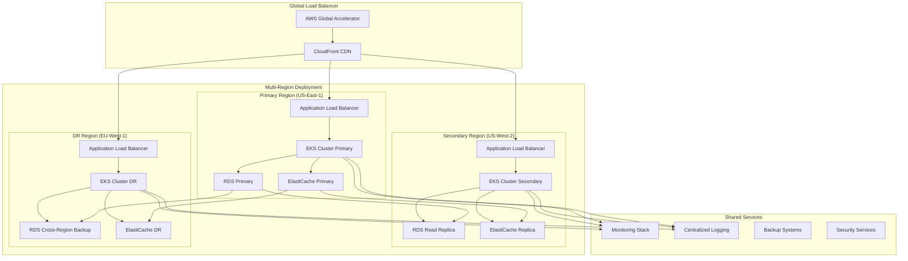

# LeanVibe Enterprise Operations Guide

## Executive Summary

This comprehensive guide provides enterprise customers and internal operations teams with detailed procedures for deploying, managing, and operating LeanVibe at enterprise scale. The guide covers multi-tenant operations, enterprise customer onboarding, compliance procedures, and business continuity planning.

## Table of Contents

1. [Enterprise Architecture Overview](#enterprise-architecture-overview)
2. [Multi-Tenant Operations](#multi-tenant-operations)
3. [Enterprise Customer Onboarding](#enterprise-customer-onboarding)
4. [Production Operations](#production-operations)
5. [Security and Compliance](#security-and-compliance)
6. [Performance Management](#performance-management)
7. [Business Continuity](#business-continuity)
8. [Support and SLA Management](#support-and-sla-management)
9. [Operational Procedures](#operational-procedures)
10. [Troubleshooting and Diagnostics](#troubleshooting-and-diagnostics)

## Enterprise Architecture Overview

### Production Infrastructure Stack



### Enterprise Infrastructure Components

#### Container Orchestration Layer
- **Kubernetes Clusters**: Multi-region EKS clusters with managed control planes
- **Node Groups**: Dedicated node groups for system, application, and database workloads
- **Service Mesh**: Istio for advanced traffic management and security
- **Container Registry**: Amazon ECR with vulnerability scanning

#### Data Layer
- **Primary Database**: Amazon RDS PostgreSQL 14+ with Multi-AZ deployment
- **Graph Database**: Neo4j Enterprise running in Kubernetes with clustering
- **Cache Layer**: Amazon ElastiCache for Redis with clustering and encryption
- **Object Storage**: Amazon S3 with cross-region replication and versioning

#### Networking & Security
- **Load Balancing**: AWS Application Load Balancer with SSL termination
- **CDN**: Amazon CloudFront with custom domain and SSL certificates
- **VPC**: Multi-AZ VPC with private/public subnets and NAT gateways
- **Security**: AWS WAF, Shield Advanced, and VPC Flow Logs

## Multi-Tenant Operations

### Tenant Isolation Architecture

#### Database-Level Isolation
```sql
-- Row-Level Security (RLS) implementation
CREATE POLICY tenant_isolation ON tenants
    USING (tenant_id = current_setting('rls.tenant_id'));

-- Tenant-specific schemas
CREATE SCHEMA tenant_abc123;
SET search_path TO tenant_abc123, public;
```

#### Application-Level Isolation
```python
# Tenant context middleware
class TenantContextMiddleware:
    async def __call__(self, request: Request, call_next):
        tenant_id = extract_tenant_from_request(request)
        
        # Set tenant context for database queries
        async with get_database_session() as db:
            await db.execute(text(f"SET rls.tenant_id = '{tenant_id}'"))
            
        # Set tenant context in request state
        request.state.tenant_id = tenant_id
        
        response = await call_next(request)
        return response
```

#### Resource Quota Management
```yaml
# Kubernetes ResourceQuota per tenant tier
apiVersion: v1
kind: ResourceQuota
metadata:
  name: enterprise-tier-quota
  namespace: tenant-enterprise-abc123
spec:
  hard:
    requests.cpu: "10"
    requests.memory: 20Gi
    requests.storage: 200Gi
    persistentvolumeclaims: "20"
    pods: "50"
    services: "10"
```

### Tenant Lifecycle Management

#### 1. Tenant Provisioning
```bash
#!/bin/bash
# Enterprise tenant provisioning script

TENANT_ID="$1"
TENANT_TIER="$2"
TENANT_NAME="$3"

echo "Provisioning enterprise tenant: $TENANT_NAME ($TENANT_ID)"

# Create tenant namespace
kubectl create namespace "tenant-${TENANT_TIER}-${TENANT_ID}"

# Apply resource quotas
kubectl apply -f - <<EOF
apiVersion: v1
kind: ResourceQuota
metadata:
  name: tenant-quota
  namespace: tenant-${TENANT_TIER}-${TENANT_ID}
spec:
  hard:
    requests.cpu: "${CPU_QUOTA}"
    requests.memory: "${MEMORY_QUOTA}"
    requests.storage: "${STORAGE_QUOTA}"
EOF

# Create tenant database schema
kubectl exec deployment/postgresql -n leanvibe-production -- \
  psql -U postgres -c "CREATE SCHEMA IF NOT EXISTS tenant_${TENANT_ID};"

# Initialize tenant configuration
kubectl create configmap tenant-config \
  --from-literal=tenant_id="$TENANT_ID" \
  --from-literal=tenant_tier="$TENANT_TIER" \
  --from-literal=tenant_name="$TENANT_NAME" \
  --namespace="tenant-${TENANT_TIER}-${TENANT_ID}"

# Create tenant monitoring dashboard
curl -X POST https://grafana.leanvibe.ai/api/dashboards/db \
  -H "Authorization: Bearer $GRAFANA_API_KEY" \
  -H "Content-Type: application/json" \
  -d @tenant-dashboard-template.json

echo "Tenant provisioning completed for $TENANT_NAME"
```

#### 2. Tenant Scaling Operations
```python
# Dynamic tenant resource scaling
class TenantScaler:
    async def scale_tenant_resources(self, tenant_id: str, usage_metrics: Dict):
        """Scale tenant resources based on usage patterns"""
        
        current_tier = await self.get_tenant_tier(tenant_id)
        usage_pattern = self.analyze_usage_pattern(usage_metrics)
        
        if usage_pattern.requires_upgrade:
            await self.upgrade_tenant_tier(tenant_id, usage_pattern.recommended_tier)
        
        # Horizontal scaling for high-usage tenants
        if usage_pattern.high_load:
            await self.scale_tenant_replicas(tenant_id, usage_pattern.recommended_replicas)
    
    async def upgrade_tenant_tier(self, tenant_id: str, new_tier: str):
        """Upgrade tenant to higher tier with zero downtime"""
        
        # Create new namespace with higher resource quotas
        await self.create_tenant_namespace(tenant_id, new_tier)
        
        # Migrate data to new tier
        await self.migrate_tenant_data(tenant_id, new_tier)
        
        # Update billing and subscription
        await self.update_tenant_billing(tenant_id, new_tier)
        
        # Switch traffic to new tier
        await self.switch_tenant_traffic(tenant_id, new_tier)
        
        # Cleanup old resources
        await self.cleanup_old_tenant_resources(tenant_id)
```

### Multi-Tenant Monitoring

#### Per-Tenant Metrics Collection
```yaml
# Prometheus scraping configuration for tenant metrics
scrape_configs:
- job_name: 'tenant-metrics'
  kubernetes_sd_configs:
  - role: pod
    namespaces:
      names:
      - tenant-enterprise-*
      - tenant-team-*
      - tenant-developer-*
  relabel_configs:
  - source_labels: [__meta_kubernetes_namespace]
    regex: tenant-(.+)-(.+)
    target_label: tenant_tier
    replacement: ${1}
  - source_labels: [__meta_kubernetes_namespace]
    regex: tenant-(.+)-(.+)
    target_label: tenant_id
    replacement: ${2}
  - source_labels: [__meta_kubernetes_pod_annotation_prometheus_io_scrape]
    action: keep
    regex: true
```

#### Tenant-Specific Alerting
```yaml
# Tenant-specific alert rules
groups:
- name: tenant.sla.rules
  rules:
  - alert: TenantSLABreach
    expr: |
      (
        sum(rate(http_requests_total{status=~"5.."}[5m])) by (tenant_id) /
        sum(rate(http_requests_total[5m])) by (tenant_id)
      ) * 100 > 5
    for: 2m
    labels:
      severity: critical
      tenant_id: "{{ $labels.tenant_id }}"
    annotations:
      summary: "SLA breach for tenant {{ $labels.tenant_id }}"
      description: "Error rate {{ $value }}% exceeds SLA threshold"
      
  - alert: TenantHighResourceUsage
    expr: |
      (
        sum(container_memory_usage_bytes{namespace=~"tenant-.*"}) by (namespace) /
        sum(container_spec_memory_limit_bytes{namespace=~"tenant-.*"}) by (namespace)
      ) * 100 > 80
    for: 5m
    labels:
      severity: warning
    annotations:
      summary: "High resource usage for {{ $labels.namespace }}"
      description: "Memory usage {{ $value }}% approaching quota limits"
```

## Enterprise Customer Onboarding

### Phase 1: Pre-Deployment Planning (1-2 weeks)

#### Customer Requirements Assessment
```yaml
# Customer onboarding checklist template
customer_onboarding:
  basic_info:
    company_name: "Enterprise Corp"
    primary_contact: "CTO Name <cto@enterprise.com>"
    technical_contact: "DevOps Lead <devops@enterprise.com>"
    billing_contact: "Finance Lead <finance@enterprise.com>"
    
  technical_requirements:
    expected_users: 500
    api_calls_per_month: 10000000
    storage_requirements: "1TB"
    data_residency: "US-East"
    compliance_requirements: ["SOC2", "GDPR", "HIPAA"]
    integration_requirements: ["Okta SSO", "Slack", "GitHub Enterprise"]
    
  deployment_preferences:
    deployment_model: "dedicated_vpc"
    backup_frequency: "continuous"
    disaster_recovery: "multi_region"
    maintenance_window: "Saturday 2-4 AM EST"
    
  sla_requirements:
    uptime_target: 99.95
    response_time_target: 200
    support_tier: "enterprise_24x7"
```

#### Infrastructure Sizing Calculator
```python
class EnterpriseSizingCalculator:
    def calculate_infrastructure_requirements(self, requirements: Dict) -> Dict:
        """Calculate infrastructure requirements based on customer needs"""
        
        users = requirements['expected_users']
        api_calls_monthly = requirements['api_calls_per_month']
        storage_tb = requirements['storage_requirements']
        
        # Calculate compute requirements
        compute_requirements = {
            'application_pods': max(3, users // 100),
            'cpu_cores': max(8, users // 50),
            'memory_gb': max(16, users // 25),
            'storage_gb': storage_tb * 1024
        }
        
        # Calculate database requirements
        database_requirements = {
            'instance_class': self.get_database_instance_class(users),
            'storage_gb': max(100, storage_tb * 1024 // 2),
            'read_replicas': 2 if users > 1000 else 1,
            'backup_retention_days': 30
        }
        
        # Calculate cache requirements
        cache_requirements = {
            'node_type': self.get_cache_node_type(api_calls_monthly),
            'num_nodes': max(2, api_calls_monthly // 1000000),
            'memory_gb': max(4, api_calls_monthly // 500000)
        }
        
        return {
            'compute': compute_requirements,
            'database': database_requirements,
            'cache': cache_requirements,
            'estimated_monthly_cost': self.calculate_cost(compute_requirements, database_requirements, cache_requirements)
        }
```

### Phase 2: Environment Setup (1 week)

#### Dedicated VPC Provisioning
```bash
#!/bin/bash
# Enterprise customer dedicated VPC setup

CUSTOMER_ID="$1"
CUSTOMER_NAME="$2"
REGION="$3"

echo "Setting up dedicated VPC for $CUSTOMER_NAME"

# Create customer-specific Terraform workspace
cd terraform/
terraform workspace new "enterprise-${CUSTOMER_ID}"

# Apply customer-specific infrastructure
terraform apply \
  -var="customer_id=${CUSTOMER_ID}" \
  -var="customer_name=${CUSTOMER_NAME}" \
  -var="region=${REGION}" \
  -var="vpc_cidr=10.${CUSTOMER_ID}.0.0/16" \
  -var="enable_dedicated_vpc=true" \
  -var="enable_advanced_monitoring=true" \
  -var="enable_compliance_logging=true"

# Wait for infrastructure provisioning
echo "Waiting for infrastructure to be ready..."
sleep 300

# Configure customer-specific Kubernetes cluster
aws eks update-kubeconfig --name "leanvibe-${CUSTOMER_ID}" --region "$REGION"

# Install customer-specific applications
helm install leanvibe-backend ./helm/leanvibe-backend \
  --namespace "leanvibe-${CUSTOMER_ID}" \
  --create-namespace \
  --values values-enterprise.yaml \
  --set customer.id="$CUSTOMER_ID" \
  --set customer.name="$CUSTOMER_NAME"

echo "Dedicated VPC setup completed for $CUSTOMER_NAME"
```

#### SSO Integration Setup
```python
# Enterprise SSO configuration automation
class SSOIntegrationManager:
    async def setup_customer_sso(self, customer_id: str, sso_config: Dict):
        """Setup SSO integration for enterprise customer"""
        
        provider = sso_config['provider']  # okta, azure_ad, google_workspace
        
        if provider == 'okta':
            await self.setup_okta_integration(customer_id, sso_config)
        elif provider == 'azure_ad':
            await self.setup_azure_ad_integration(customer_id, sso_config)
        elif provider == 'google_workspace':
            await self.setup_google_workspace_integration(customer_id, sso_config)
    
    async def setup_okta_integration(self, customer_id: str, config: Dict):
        """Configure Okta SAML integration"""
        
        # Create customer-specific SAML configuration
        saml_config = {
            'entity_id': f'leanvibe-{customer_id}',
            'assertion_consumer_service': f'https://{customer_id}.leanvibe.ai/auth/saml/callback',
            'single_logout_service': f'https://{customer_id}.leanvibe.ai/auth/saml/logout',
            'name_id_format': 'urn:oasis:names:tc:SAML:1.1:nameid-format:emailAddress'
        }
        
        # Store configuration in secrets manager
        await self.store_sso_configuration(customer_id, saml_config)
        
        # Configure customer-specific authentication endpoints
        await self.configure_auth_endpoints(customer_id, saml_config)
        
        # Test SSO integration
        test_result = await self.test_sso_integration(customer_id)
        
        return {
            'status': 'success' if test_result.passed else 'failed',
            'metadata_url': f'https://{customer_id}.leanvibe.ai/auth/saml/metadata',
            'test_results': test_result
        }
```

### Phase 3: Data Migration and Go-Live (1-2 weeks)

#### Data Migration Procedures
```python
class EnterpriseMigrationManager:
    async def migrate_customer_data(self, customer_id: str, migration_plan: Dict):
        """Execute enterprise customer data migration"""
        
        # Phase 1: Schema setup
        await self.setup_customer_schema(customer_id)
        
        # Phase 2: Data extraction and transformation
        source_data = await self.extract_customer_data(migration_plan['source'])
        transformed_data = await self.transform_data(source_data, customer_id)
        
        # Phase 3: Data validation and loading
        validation_results = await self.validate_data(transformed_data)
        if validation_results.passed:
            await self.load_data(customer_id, transformed_data)
        else:
            raise MigrationError(f"Data validation failed: {validation_results.errors}")
        
        # Phase 4: Post-migration verification
        verification_results = await self.verify_migration(customer_id)
        
        return {
            'status': 'completed',
            'records_migrated': len(transformed_data),
            'verification_results': verification_results
        }
    
    async def rollback_migration(self, customer_id: str, checkpoint: str):
        """Rollback migration to specific checkpoint"""
        
        # Stop all customer services
        await self.stop_customer_services(customer_id)
        
        # Restore from backup
        await self.restore_from_checkpoint(customer_id, checkpoint)
        
        # Restart services
        await self.start_customer_services(customer_id)
        
        # Verify rollback success
        return await self.verify_rollback(customer_id, checkpoint)
```

#### Go-Live Checklist
```yaml
# Enterprise go-live checklist
go_live_checklist:
  infrastructure:
    - [ ] Dedicated VPC provisioned and configured
    - [ ] Kubernetes cluster deployed with customer workloads
    - [ ] Database setup with customer-specific schemas
    - [ ] SSL certificates configured for custom domain
    - [ ] Load balancing and auto-scaling configured
    - [ ] Backup and disaster recovery tested
    
  security:
    - [ ] SSO integration tested and validated
    - [ ] Network security groups configured
    - [ ] Encryption at rest and in transit verified
    - [ ] Security scanning completed with no critical issues
    - [ ] Compliance audit completed
    
  monitoring:
    - [ ] Customer-specific dashboards created
    - [ ] SLA monitoring configured
    - [ ] Alert rules customized for customer
    - [ ] Log aggregation and analysis setup
    - [ ] Business metrics tracking enabled
    
  testing:
    - [ ] End-to-end functionality testing completed
    - [ ] Performance testing with expected load
    - [ ] Disaster recovery testing completed
    - [ ] SSO authentication testing completed
    - [ ] API integration testing completed
    
  documentation:
    - [ ] Customer-specific runbooks created
    - [ ] API documentation customized
    - [ ] User training materials prepared
    - [ ] Support procedures documented
    - [ ] Escalation contacts configured
```

## Production Operations

### Daily Operations Procedures

#### Morning Health Check
```bash
#!/bin/bash
# Daily morning health check for enterprise operations

echo "=== LeanVibe Enterprise Daily Health Check ==="
echo "Date: $(date)"
echo

# 1. Overall system health
echo "1. System Health Overview:"
kubectl get nodes --no-headers | awk '{print $1, $2}' | while read node status; do
    echo "  Node $node: $status"
done

echo
echo "2. Application Health:"
kubectl get pods -n leanvibe-production --no-headers | grep -v Running | wc -l | \
    awk '{if($1==0) print "  All pods running"; else print "  ",$1," pods not running"}'

# 3. Database health
echo
echo "3. Database Health:"
DB_STATUS=$(kubectl exec deployment/postgresql -n leanvibe-production -- \
    pg_isready -h localhost -p 5432 2>/dev/null && echo "healthy" || echo "unhealthy")
echo "  PostgreSQL: $DB_STATUS"

NEO4J_STATUS=$(kubectl exec deployment/neo4j -n leanvibe-production -- \
    cypher-shell -u neo4j -p "$NEO4J_PASSWORD" "RETURN 1" 2>/dev/null && echo "healthy" || echo "unhealthy")
echo "  Neo4j: $NEO4J_STATUS"

# 4. Cache health
echo
echo "4. Cache Health:"
REDIS_STATUS=$(kubectl exec deployment/redis -n leanvibe-production -- \
    redis-cli -a "$REDIS_PASSWORD" ping 2>/dev/null && echo "healthy" || echo "unhealthy")
echo "  Redis: $REDIS_STATUS"

# 5. External dependencies
echo
echo "5. External Dependencies:"
STRIPE_STATUS=$(curl -s -o /dev/null -w "%{http_code}" -u "$STRIPE_SECRET_KEY": https://api.stripe.com/v1/account)
echo "  Stripe API: $([ "$STRIPE_STATUS" = "200" ] && echo "healthy" || echo "unhealthy ($STRIPE_STATUS)")"

# 6. Recent alerts
echo
echo "6. Recent Alerts (last 24h):"
curl -s "https://prometheus.leanvibe.ai/api/v1/query?query=ALERTS" | \
    jq -r '.data.result[] | select(.value[1] == "1") | .metric.alertname' | \
    sort | uniq -c | awk '{print "  ", $2, "("$1" active)"}'

# 7. Business metrics
echo
echo "7. Business Metrics (last 24h):"
ACTIVE_TENANTS=$(curl -s "https://prometheus.leanvibe.ai/api/v1/query?query=active_tenants_total" | \
    jq -r '.data.result[0].value[1]')
echo "  Active Tenants: $ACTIVE_TENANTS"

NEW_SIGNUPS=$(curl -s "https://prometheus.leanvibe.ai/api/v1/query?query=increase(tenant_signups_total[24h])" | \
    jq -r '.data.result[0].value[1]')
echo "  New Signups (24h): $NEW_SIGNUPS"

echo
echo "=== Health Check Complete ==="
```

#### Weekly Maintenance Tasks
```python
# Weekly maintenance automation
class WeeklyMaintenance:
    async def run_weekly_maintenance(self):
        """Execute weekly maintenance tasks"""
        
        maintenance_tasks = [
            self.update_system_packages(),
            self.rotate_application_logs(),
            self.optimize_database_performance(),
            self.review_and_tune_alerts(),
            self.capacity_planning_analysis(),
            self.security_vulnerability_scan(),
            self.backup_verification(),
            self.performance_regression_analysis()
        ]
        
        results = await asyncio.gather(*maintenance_tasks, return_exceptions=True)
        
        # Generate weekly maintenance report
        report = self.generate_maintenance_report(results)
        await self.send_maintenance_report(report)
        
        return report
    
    async def optimize_database_performance(self):
        """Weekly database optimization"""
        
        # Analyze query performance
        slow_queries = await self.identify_slow_queries()
        
        # Update table statistics
        await self.update_database_statistics()
        
        # Rebuild fragmented indexes
        fragmented_indexes = await self.identify_fragmented_indexes()
        for index in fragmented_indexes:
            await self.rebuild_index(index)
        
        # Clean up old data
        await self.archive_old_data()
        
        return {
            'slow_queries_optimized': len(slow_queries),
            'indexes_rebuilt': len(fragmented_indexes),
            'archive_completed': True
        }
```

### Capacity Planning

#### Resource Usage Analysis
```python
class CapacityPlanner:
    def __init__(self):
        self.prometheus_client = PrometheusClient()
        self.prediction_model = ResourcePredictionModel()
    
    async def analyze_capacity_trends(self, days_back: int = 30) -> Dict:
        """Analyze resource usage trends and predict future needs"""
        
        end_time = datetime.utcnow()
        start_time = end_time - timedelta(days=days_back)
        
        # Collect metrics
        cpu_usage = await self.prometheus_client.query_range(
            'avg(rate(container_cpu_usage_seconds_total[5m]))',
            start_time, end_time
        )
        
        memory_usage = await self.prometheus_client.query_range(
            'avg(container_memory_usage_bytes)',
            start_time, end_time
        )
        
        storage_usage = await self.prometheus_client.query_range(
            'avg(kubelet_volume_stats_used_bytes)',
            start_time, end_time
        )
        
        # Analyze trends
        cpu_trend = self.analyze_trend(cpu_usage)
        memory_trend = self.analyze_trend(memory_usage)
        storage_trend = self.analyze_trend(storage_usage)
        
        # Predict future needs
        predictions = await self.prediction_model.predict_resource_needs(
            cpu_trend, memory_trend, storage_trend, days_ahead=90
        )
        
        # Generate recommendations
        recommendations = self.generate_scaling_recommendations(predictions)
        
        return {
            'current_usage': {
                'cpu': cpu_trend.current_avg,
                'memory': memory_trend.current_avg,
                'storage': storage_trend.current_avg
            },
            'trends': {
                'cpu_growth_rate': cpu_trend.growth_rate,
                'memory_growth_rate': memory_trend.growth_rate,
                'storage_growth_rate': storage_trend.growth_rate
            },
            'predictions': predictions,
            'recommendations': recommendations
        }
    
    def generate_scaling_recommendations(self, predictions: Dict) -> List[Dict]:
        """Generate actionable scaling recommendations"""
        
        recommendations = []
        
        # CPU scaling recommendations
        if predictions['cpu_utilization_90d'] > 0.8:
            recommendations.append({
                'type': 'scale_up',
                'resource': 'cpu',
                'action': 'Add 2 additional nodes to application node group',
                'timeline': '30 days',
                'estimated_cost': 480  # $480/month
            })
        
        # Memory scaling recommendations
        if predictions['memory_utilization_90d'] > 0.85:
            recommendations.append({
                'type': 'scale_up',
                'resource': 'memory',
                'action': 'Upgrade to r5.2xlarge instances',
                'timeline': '45 days',
                'estimated_cost': 720  # $720/month
            })
        
        # Storage scaling recommendations
        if predictions['storage_utilization_90d'] > 0.9:
            recommendations.append({
                'type': 'scale_up',
                'resource': 'storage',
                'action': 'Increase EBS volume size by 50%',
                'timeline': '60 days',
                'estimated_cost': 150  # $150/month
            })
        
        return recommendations
```

## Security and Compliance

### SOC 2 Type II Compliance

#### Security Control Implementation
```yaml
# Security controls configuration
security_controls:
  access_controls:
    multi_factor_authentication: enabled
    session_timeout: 30_minutes
    password_policy:
      min_length: 12
      require_special_chars: true
      require_numbers: true
      require_uppercase: true
      expiration_days: 90
    
  encryption:
    data_at_rest:
      algorithm: "AES-256"
      key_management: "AWS KMS"
      key_rotation: "annual"
    data_in_transit:
      tls_version: "1.3"
      cipher_suites: ["TLS_AES_256_GCM_SHA384"]
    
  logging_monitoring:
    audit_log_retention: 7_years
    log_integrity_protection: enabled
    security_monitoring: 24x7
    anomaly_detection: enabled
    
  backup_recovery:
    backup_frequency: "continuous"
    backup_encryption: enabled
    backup_testing: "monthly"
    disaster_recovery_testing: "quarterly"
```

#### Compliance Automation
```python
class ComplianceManager:
    async def run_compliance_audit(self) -> Dict:
        """Execute automated compliance checks"""
        
        audit_results = {
            'timestamp': datetime.utcnow().isoformat(),
            'controls_tested': 0,
            'controls_passed': 0,
            'findings': []
        }
        
        # Security controls audit
        security_findings = await self.audit_security_controls()
        audit_results['findings'].extend(security_findings)
        
        # Data protection audit
        data_protection_findings = await self.audit_data_protection()
        audit_results['findings'].extend(data_protection_findings)
        
        # Access management audit
        access_findings = await self.audit_access_management()
        audit_results['findings'].extend(access_findings)
        
        # Network security audit
        network_findings = await self.audit_network_security()
        audit_results['findings'].extend(network_findings)
        
        # Calculate compliance score
        audit_results['controls_tested'] = len([f for f in audit_results['findings']])
        audit_results['controls_passed'] = len([f for f in audit_results['findings'] if f['status'] == 'passed'])
        audit_results['compliance_score'] = (audit_results['controls_passed'] / audit_results['controls_tested']) * 100
        
        # Generate compliance report
        report = await self.generate_compliance_report(audit_results)
        
        return {
            'audit_results': audit_results,
            'compliance_report': report
        }
    
    async def audit_security_controls(self) -> List[Dict]:
        """Audit security control implementation"""
        
        findings = []
        
        # Check MFA enforcement
        mfa_enabled = await self.check_mfa_enforcement()
        findings.append({
            'control': 'CC6.1 - Multi-Factor Authentication',
            'status': 'passed' if mfa_enabled else 'failed',
            'description': 'MFA is enforced for all administrative access',
            'evidence': f'MFA enforcement: {mfa_enabled}'
        })
        
        # Check encryption at rest
        encryption_at_rest = await self.check_encryption_at_rest()
        findings.append({
            'control': 'CC6.7 - Encryption at Rest',
            'status': 'passed' if encryption_at_rest else 'failed',
            'description': 'All data is encrypted at rest using AES-256',
            'evidence': f'Encryption status: {encryption_at_rest}'
        })
        
        # Check encryption in transit
        encryption_in_transit = await self.check_encryption_in_transit()
        findings.append({
            'control': 'CC6.7 - Encryption in Transit',
            'status': 'passed' if encryption_in_transit else 'failed',
            'description': 'All data transmission uses TLS 1.3',
            'evidence': f'TLS configuration: {encryption_in_transit}'
        })
        
        return findings
```

### GDPR Compliance

#### Data Subject Rights Implementation
```python
class GDPRComplianceManager:
    async def handle_data_subject_request(self, request_type: str, subject_id: str) -> Dict:
        """Handle GDPR data subject requests"""
        
        if request_type == 'access':
            return await self.handle_access_request(subject_id)
        elif request_type == 'portability':
            return await self.handle_portability_request(subject_id)
        elif request_type == 'erasure':
            return await self.handle_erasure_request(subject_id)
        elif request_type == 'rectification':
            return await self.handle_rectification_request(subject_id)
        else:
            raise ValueError(f"Unknown request type: {request_type}")
    
    async def handle_access_request(self, subject_id: str) -> Dict:
        """Process GDPR access request (Article 15)"""
        
        # Collect all personal data for the subject
        personal_data = await self.collect_personal_data(subject_id)
        
        # Generate structured data export
        data_export = {
            'subject_id': subject_id,
            'export_date': datetime.utcnow().isoformat(),
            'data_categories': {
                'identity': personal_data.get('identity', {}),
                'contact': personal_data.get('contact', {}),
                'usage': personal_data.get('usage', {}),
                'preferences': personal_data.get('preferences', {})
            },
            'processing_purposes': [
                'Service provision',
                'Billing and payment processing',
                'Customer support',
                'Product improvement'
            ],
            'data_retention': {
                'active_account': '7 years',
                'deleted_account': '30 days'
            }
        }
        
        # Create secure download link
        download_link = await self.create_secure_download(data_export, expires_in=72)
        
        return {
            'status': 'completed',
            'download_link': download_link,
            'expires_at': (datetime.utcnow() + timedelta(hours=72)).isoformat()
        }
    
    async def handle_erasure_request(self, subject_id: str) -> Dict:
        """Process GDPR erasure request (Article 17)"""
        
        # Verify erasure eligibility
        eligibility = await self.check_erasure_eligibility(subject_id)
        if not eligibility.eligible:
            return {
                'status': 'rejected',
                'reason': eligibility.reason
            }
        
        # Execute data erasure across all systems
        erasure_results = await self.execute_data_erasure(subject_id)
        
        # Log erasure for audit trail
        await self.log_data_erasure(subject_id, erasure_results)
        
        return {
            'status': 'completed',
            'erasure_date': datetime.utcnow().isoformat(),
            'systems_processed': erasure_results.systems_processed,
            'records_erased': erasure_results.total_records
        }
```

## Business Continuity

### Disaster Recovery Plan

#### Multi-Region Failover Procedures
```bash
#!/bin/bash
# Disaster recovery failover script

PRIMARY_REGION="us-east-1"
DR_REGION="us-west-2"
CUSTOMER_ID="$1"

echo "=== DISASTER RECOVERY FAILOVER ==="
echo "Customer: $CUSTOMER_ID"
echo "Primary Region: $PRIMARY_REGION"
echo "DR Region: $DR_REGION"
echo "Initiated: $(date)"
echo

# Step 1: Assess primary region health
echo "Step 1: Assessing primary region health..."
PRIMARY_HEALTH=$(aws eks describe-cluster --name "leanvibe-${CUSTOMER_ID}" --region "$PRIMARY_REGION" \
    --query 'cluster.status' --output text 2>/dev/null || echo "FAILED")

if [ "$PRIMARY_HEALTH" = "ACTIVE" ]; then
    echo "WARNING: Primary region appears healthy. Confirm failover is necessary."
    read -p "Continue with failover? (yes/no): " CONFIRM
    if [ "$CONFIRM" != "yes" ]; then
        echo "Failover cancelled."
        exit 1
    fi
fi

# Step 2: Update DNS to point to DR region
echo
echo "Step 2: Updating DNS to DR region..."
aws route53 change-resource-record-sets \
    --hosted-zone-id "$HOSTED_ZONE_ID" \
    --change-batch file://dns-failover-changeset.json

# Step 3: Activate DR database
echo
echo "Step 3: Activating DR database..."
aws rds promote-read-replica \
    --db-instance-identifier "leanvibe-${CUSTOMER_ID}-dr" \
    --region "$DR_REGION"

# Wait for database promotion
echo "Waiting for database promotion to complete..."
aws rds wait db-instance-available \
    --db-instance-identifier "leanvibe-${CUSTOMER_ID}-dr" \
    --region "$DR_REGION"

# Step 4: Scale up DR application services
echo
echo "Step 4: Scaling up DR application services..."
aws eks update-kubeconfig --name "leanvibe-${CUSTOMER_ID}-dr" --region "$DR_REGION"

kubectl scale deployment leanvibe-backend \
    --replicas=5 \
    --namespace "leanvibe-${CUSTOMER_ID}"

kubectl scale deployment neo4j \
    --replicas=3 \
    --namespace "leanvibe-${CUSTOMER_ID}"

# Step 5: Update application configuration
echo
echo "Step 5: Updating application configuration..."
kubectl patch configmap leanvibe-config \
    --namespace "leanvibe-${CUSTOMER_ID}" \
    --type merge \
    --patch '{"data":{"DATABASE_URL":"'$DR_DATABASE_URL'","REDIS_URL":"'$DR_REDIS_URL'"}}'

# Step 6: Restart application pods
echo
echo "Step 6: Restarting application pods..."
kubectl rollout restart deployment/leanvibe-backend --namespace "leanvibe-${CUSTOMER_ID}"
kubectl rollout status deployment/leanvibe-backend --namespace "leanvibe-${CUSTOMER_ID}" --timeout=300s

# Step 7: Verify DR site health
echo
echo "Step 7: Verifying DR site health..."
DR_HEALTH_URL="https://${CUSTOMER_ID}.leanvibe.ai/health"
for i in {1..10}; do
    if curl -f "$DR_HEALTH_URL" > /dev/null 2>&1; then
        echo "DR site health check passed."
        break
    fi
    echo "Health check attempt $i failed, retrying..."
    sleep 30
done

# Step 8: Notify stakeholders
echo
echo "Step 8: Notifying stakeholders..."
curl -X POST "$SLACK_WEBHOOK_URL" \
    -H "Content-Type: application/json" \
    -d '{
        "text": "🚨 DISASTER RECOVERY ACTIVATED",
        "blocks": [
            {
                "type": "section",
                "text": {
                    "type": "mrkdwn",
                    "text": "*Disaster Recovery Failover Completed*\n• Customer: '$CUSTOMER_ID'\n• DR Region: '$DR_REGION'\n• Status: Active\n• Time: '$(date)'"
                }
            }
        ]
    }'

echo
echo "=== DISASTER RECOVERY FAILOVER COMPLETE ==="
echo "DR site is now active and serving traffic."
echo "Primary region recovery should be initiated as soon as possible."
```

#### Recovery Time Objectives (RTO) by Tier
```yaml
# RTO/RPO definitions by customer tier
recovery_objectives:
  enterprise:
    rto: "1 hour"        # Recovery Time Objective
    rpo: "5 minutes"     # Recovery Point Objective
    backup_frequency: "continuous"
    testing_frequency: "monthly"
    
  team:
    rto: "4 hours"
    rpo: "1 hour"
    backup_frequency: "every_15_minutes"
    testing_frequency: "quarterly"
    
  developer:
    rto: "8 hours"
    rpo: "4 hours"
    backup_frequency: "hourly"
    testing_frequency: "semi_annually"
```

### Backup and Recovery Automation

#### Automated Backup System
```python
class EnterpriseBackupManager:
    def __init__(self):
        self.s3_client = boto3.client('s3')
        self.rds_client = boto3.client('rds')
        self.k8s_client = kubernetes.client.ApiClient()
    
    async def execute_enterprise_backup(self, customer_id: str) -> Dict:
        """Execute comprehensive backup for enterprise customer"""
        
        backup_id = f"backup-{customer_id}-{datetime.utcnow().strftime('%Y%m%d%H%M%S')}"
        
        backup_tasks = [
            self.backup_database(customer_id, backup_id),
            self.backup_application_data(customer_id, backup_id),
            self.backup_kubernetes_configs(customer_id, backup_id),
            self.backup_secrets_configs(customer_id, backup_id)
        ]
        
        # Execute backups in parallel
        backup_results = await asyncio.gather(*backup_tasks, return_exceptions=True)
        
        # Verify backup integrity
        verification_results = await self.verify_backup_integrity(backup_id)
        
        # Create backup manifest
        manifest = {
            'backup_id': backup_id,
            'customer_id': customer_id,
            'timestamp': datetime.utcnow().isoformat(),
            'backup_results': backup_results,
            'verification_results': verification_results,
            'restore_instructions': f's3://leanvibe-backups/enterprise/{customer_id}/{backup_id}/'
        }
        
        # Store backup manifest
        await self.store_backup_manifest(manifest)
        
        return manifest
    
    async def restore_from_backup(self, customer_id: str, backup_id: str, restore_options: Dict) -> Dict:
        """Restore enterprise customer from backup"""
        
        # Retrieve backup manifest
        manifest = await self.get_backup_manifest(backup_id)
        
        # Create restore plan
        restore_plan = await self.create_restore_plan(manifest, restore_options)
        
        # Execute restore procedures
        restore_results = []
        
        if restore_options.get('restore_database', True):
            db_result = await self.restore_database(customer_id, backup_id)
            restore_results.append(db_result)
        
        if restore_options.get('restore_application_data', True):
            app_result = await self.restore_application_data(customer_id, backup_id)
            restore_results.append(app_result)
        
        if restore_options.get('restore_kubernetes_configs', True):
            k8s_result = await self.restore_kubernetes_configs(customer_id, backup_id)
            restore_results.append(k8s_result)
        
        # Post-restore verification
        verification = await self.verify_restore_success(customer_id)
        
        return {
            'restore_id': f"restore-{backup_id}-{datetime.utcnow().strftime('%Y%m%d%H%M%S')}",
            'backup_id': backup_id,
            'customer_id': customer_id,
            'restore_results': restore_results,
            'verification': verification,
            'duration': verification.total_time,
            'status': 'success' if verification.passed else 'failed'
        }
```

## Support and SLA Management

### Enterprise Support Tiers

#### 24/7 Enterprise Support
```python
class EnterpriseSupportManager:
    def __init__(self):
        self.pagerduty_client = PagerDutyClient()
        self.slack_client = SlackClient()
        self.zendesk_client = ZendeskClient()
    
    async def create_enterprise_incident(self, customer_id: str, incident_data: Dict) -> Dict:
        """Create and manage enterprise customer incidents"""
        
        severity = incident_data['severity']
        response_time = self.get_response_time_sla(customer_id, severity)
        
        # Create incident in tracking system
        incident = await self.zendesk_client.create_ticket({
            'subject': incident_data['subject'],
            'description': incident_data['description'],
            'priority': self.map_severity_to_priority(severity),
            'custom_fields': {
                'customer_id': customer_id,
                'severity': severity,
                'sla_response_time': response_time
            }
        })
        
        # Page appropriate on-call engineer
        if severity in ['critical', 'high']:
            await self.pagerduty_client.trigger_incident({
                'title': f"Enterprise Customer Incident: {incident_data['subject']}",
                'urgency': 'high' if severity == 'critical' else 'low',
                'details': {
                    'customer_id': customer_id,
                    'incident_id': incident.id,
                    'response_time_sla': response_time
                }
            })
        
        # Create dedicated incident channel
        if severity == 'critical':
            channel = await self.slack_client.create_channel(
                name=f"incident-{incident.id}",
                purpose=f"Enterprise incident for customer {customer_id}"
            )
            
            # Invite key stakeholders
            stakeholders = await self.get_customer_stakeholders(customer_id)
            await self.slack_client.invite_users(channel.id, stakeholders)
        
        return {
            'incident_id': incident.id,
            'severity': severity,
            'response_time_sla': response_time,
            'status': 'created',
            'assigned_engineer': incident.assignee,
            'estimated_resolution': self.calculate_resolution_time(severity)
        }
    
    def get_response_time_sla(self, customer_id: str, severity: str) -> timedelta:
        """Get SLA response time based on customer tier and incident severity"""
        
        customer_tier = self.get_customer_tier(customer_id)
        
        sla_matrix = {
            'enterprise': {
                'critical': timedelta(minutes=15),
                'high': timedelta(minutes=30),
                'medium': timedelta(hours=2),
                'low': timedelta(hours=8)
            },
            'team': {
                'critical': timedelta(hours=1),
                'high': timedelta(hours=2),
                'medium': timedelta(hours=4),
                'low': timedelta(hours=24)
            }
        }
        
        return sla_matrix.get(customer_tier, {}).get(severity, timedelta(hours=24))
```

### SLA Monitoring and Reporting

#### Automated SLA Tracking
```python
class SLATrackingSystem:
    async def track_customer_sla_compliance(self, customer_id: str, period: str = 'monthly') -> Dict:
        """Track and report SLA compliance for enterprise customer"""
        
        customer_tier = await self.get_customer_tier(customer_id)
        sla_targets = self.get_sla_targets(customer_tier)
        
        # Calculate actual performance metrics
        performance_metrics = await self.calculate_performance_metrics(customer_id, period)
        
        # Determine compliance status
        compliance_results = {
            'availability': {
                'target': sla_targets['availability'],
                'actual': performance_metrics['availability'],
                'compliant': performance_metrics['availability'] >= sla_targets['availability'],
                'downtime_minutes': performance_metrics['downtime_minutes']
            },
            'response_time': {
                'target': sla_targets['response_time_p95'],
                'actual': performance_metrics['response_time_p95'],
                'compliant': performance_metrics['response_time_p95'] <= sla_targets['response_time_p95']
            },
            'support_response': {
                'target': sla_targets['support_response_time'],
                'actual': performance_metrics['avg_support_response_time'],
                'compliant': performance_metrics['avg_support_response_time'] <= sla_targets['support_response_time']
            }
        }
        
        # Calculate SLA credits if applicable
        sla_credits = await self.calculate_sla_credits(customer_id, compliance_results)
        
        # Generate compliance report
        report = await self.generate_sla_report(customer_id, compliance_results, sla_credits)
        
        return {
            'customer_id': customer_id,
            'period': period,
            'compliance_results': compliance_results,
            'sla_credits': sla_credits,
            'report': report
        }
    
    async def calculate_sla_credits(self, customer_id: str, compliance_results: Dict) -> Dict:
        """Calculate SLA credits for non-compliance"""
        
        customer_contract = await self.get_customer_contract(customer_id)
        monthly_fee = customer_contract['monthly_fee']
        
        credits = {
            'availability_credits': 0,
            'performance_credits': 0,
            'total_credits': 0
        }
        
        # Availability SLA credits
        availability_compliance = compliance_results['availability']
        if not availability_compliance['compliant']:
            actual_uptime = availability_compliance['actual']
            target_uptime = availability_compliance['target']
            
            if actual_uptime < 99.5:  # Below 99.5% - 100% credit
                credits['availability_credits'] = monthly_fee
            elif actual_uptime < 99.8:  # 99.5-99.8% - 50% credit
                credits['availability_credits'] = monthly_fee * 0.5
            elif actual_uptime < 99.9:  # 99.8-99.9% - 25% credit
                credits['availability_credits'] = monthly_fee * 0.25
            else:  # 99.9-99.95% - 10% credit
                credits['availability_credits'] = monthly_fee * 0.1
        
        # Performance SLA credits
        performance_compliance = compliance_results['response_time']
        if not performance_compliance['compliant']:
            actual_response_time = performance_compliance['actual']
            target_response_time = performance_compliance['target']
            
            performance_degradation = (actual_response_time - target_response_time) / target_response_time
            
            if performance_degradation > 2.0:  # >200% slower - 50% credit
                credits['performance_credits'] = monthly_fee * 0.5
            elif performance_degradation > 1.0:  # >100% slower - 25% credit
                credits['performance_credits'] = monthly_fee * 0.25
            else:  # 50-100% slower - 10% credit
                credits['performance_credits'] = monthly_fee * 0.1
        
        credits['total_credits'] = credits['availability_credits'] + credits['performance_credits']
        
        return credits
```

## Troubleshooting and Diagnostics

### Enterprise Diagnostic Tools

#### Comprehensive Health Check System
```python
class EnterpriseHealthCheck:
    async def run_comprehensive_health_check(self, customer_id: str) -> Dict:
        """Run comprehensive health check for enterprise customer"""
        
        health_check_results = {
            'timestamp': datetime.utcnow().isoformat(),
            'customer_id': customer_id,
            'overall_status': 'unknown',
            'components': {}
        }
        
        # Infrastructure health checks
        infrastructure_health = await self.check_infrastructure_health(customer_id)
        health_check_results['components']['infrastructure'] = infrastructure_health
        
        # Application health checks
        application_health = await self.check_application_health(customer_id)
        health_check_results['components']['application'] = application_health
        
        # Database health checks
        database_health = await self.check_database_health(customer_id)
        health_check_results['components']['database'] = database_health
        
        # External dependencies health checks
        dependencies_health = await self.check_external_dependencies_health(customer_id)
        health_check_results['components']['dependencies'] = dependencies_health
        
        # Business logic health checks
        business_health = await self.check_business_logic_health(customer_id)
        health_check_results['components']['business_logic'] = business_health
        
        # Determine overall health status
        all_components_healthy = all(
            component['status'] == 'healthy' 
            for component in health_check_results['components'].values()
        )
        
        health_check_results['overall_status'] = 'healthy' if all_components_healthy else 'unhealthy'
        
        # Generate health report
        health_report = await self.generate_health_report(health_check_results)
        health_check_results['report'] = health_report
        
        return health_check_results
    
    async def check_infrastructure_health(self, customer_id: str) -> Dict:
        """Check infrastructure component health"""
        
        infrastructure_checks = {
            'kubernetes_cluster': await self.check_kubernetes_cluster(customer_id),
            'load_balancer': await self.check_load_balancer(customer_id),
            'networking': await self.check_networking(customer_id),
            'storage': await self.check_storage_health(customer_id),
            'monitoring': await self.check_monitoring_health(customer_id)
        }
        
        all_healthy = all(check['healthy'] for check in infrastructure_checks.values())
        
        return {
            'status': 'healthy' if all_healthy else 'unhealthy',
            'checks': infrastructure_checks,
            'summary': self.generate_infrastructure_summary(infrastructure_checks)
        }
    
    async def check_application_health(self, customer_id: str) -> Dict:
        """Check application component health"""
        
        app_checks = {
            'api_endpoints': await self.check_api_endpoints(customer_id),
            'authentication': await self.check_authentication(customer_id),
            'authorization': await self.check_authorization(customer_id),
            'background_jobs': await self.check_background_jobs(customer_id),
            'websocket_connections': await self.check_websocket_health(customer_id)
        }
        
        all_healthy = all(check['healthy'] for check in app_checks.values())
        
        return {
            'status': 'healthy' if all_healthy else 'unhealthy',
            'checks': app_checks,
            'performance_metrics': await self.get_performance_metrics(customer_id)
        }
```

### Performance Diagnostic Tools

#### Performance Bottleneck Analyzer
```python
class PerformanceAnalyzer:
    async def analyze_performance_bottlenecks(self, customer_id: str) -> Dict:
        """Analyze system performance and identify bottlenecks"""
        
        analysis_results = {
            'customer_id': customer_id,
            'analysis_timestamp': datetime.utcnow().isoformat(),
            'bottlenecks': [],
            'recommendations': []
        }
        
        # CPU bottleneck analysis
        cpu_analysis = await self.analyze_cpu_performance(customer_id)
        if cpu_analysis['bottleneck_detected']:
            analysis_results['bottlenecks'].append(cpu_analysis)
            analysis_results['recommendations'].extend(cpu_analysis['recommendations'])
        
        # Memory bottleneck analysis
        memory_analysis = await self.analyze_memory_performance(customer_id)
        if memory_analysis['bottleneck_detected']:
            analysis_results['bottlenecks'].append(memory_analysis)
            analysis_results['recommendations'].extend(memory_analysis['recommendations'])
        
        # Database performance analysis
        db_analysis = await self.analyze_database_performance(customer_id)
        if db_analysis['bottleneck_detected']:
            analysis_results['bottlenecks'].append(db_analysis)
            analysis_results['recommendations'].extend(db_analysis['recommendations'])
        
        # Network performance analysis
        network_analysis = await self.analyze_network_performance(customer_id)
        if network_analysis['bottleneck_detected']:
            analysis_results['bottlenecks'].append(network_analysis)
            analysis_results['recommendations'].extend(network_analysis['recommendations'])
        
        # Prioritize recommendations
        analysis_results['recommendations'] = self.prioritize_recommendations(
            analysis_results['recommendations']
        )
        
        return analysis_results
    
    async def generate_performance_optimization_plan(self, customer_id: str) -> Dict:
        """Generate comprehensive performance optimization plan"""
        
        # Run performance analysis
        bottleneck_analysis = await self.analyze_performance_bottlenecks(customer_id)
        
        # Get current performance baseline
        baseline_metrics = await self.get_performance_baseline(customer_id)
        
        # Generate optimization plan
        optimization_plan = {
            'customer_id': customer_id,
            'plan_created': datetime.utcnow().isoformat(),
            'current_performance': baseline_metrics,
            'identified_issues': bottleneck_analysis['bottlenecks'],
            'optimization_phases': []
        }
        
        # Phase 1: Quick wins (0-2 weeks)
        quick_wins = [rec for rec in bottleneck_analysis['recommendations'] 
                     if rec['effort'] == 'low' and rec['impact'] == 'high']
        if quick_wins:
            optimization_plan['optimization_phases'].append({
                'phase': 1,
                'name': 'Quick Wins',
                'duration': '0-2 weeks',
                'recommendations': quick_wins,
                'expected_improvement': '10-30%'
            })
        
        # Phase 2: Medium-term optimizations (2-6 weeks)
        medium_term = [rec for rec in bottleneck_analysis['recommendations'] 
                      if rec['effort'] == 'medium']
        if medium_term:
            optimization_plan['optimization_phases'].append({
                'phase': 2,
                'name': 'Infrastructure Optimizations',
                'duration': '2-6 weeks',
                'recommendations': medium_term,
                'expected_improvement': '20-50%'
            })
        
        # Phase 3: Long-term architectural changes (6-12 weeks)
        long_term = [rec for rec in bottleneck_analysis['recommendations'] 
                    if rec['effort'] == 'high']
        if long_term:
            optimization_plan['optimization_phases'].append({
                'phase': 3,
                'name': 'Architectural Improvements',
                'duration': '6-12 weeks',
                'recommendations': long_term,
                'expected_improvement': '30-100%'
            })
        
        return optimization_plan
```

---

## Contact Information

### Enterprise Operations Team
- **Email**: enterprise-ops@leanvibe.ai
- **Phone**: +1 (555) 123-4567 ext. 100
- **Emergency Hotline**: +1 (555) LEANVIBE (+1-555-532-6842)

### Technical Support
- **Level 1 Support**: support@leanvibe.ai
- **Level 2 Support**: engineering@leanvibe.ai
- **Level 3 Support**: platform-engineering@leanvibe.ai

### Business Contacts
- **Customer Success**: success@leanvibe.ai
- **Account Management**: accounts@leanvibe.ai
- **Billing Support**: billing@leanvibe.ai

### Emergency Escalation
- **Security Incidents**: security@leanvibe.ai
- **Data Breach Response**: privacy@leanvibe.ai
- **Executive Escalation**: executives@leanvibe.ai

---

**Document Version**: 1.0  
**Last Updated**: January 2025  
**Next Review**: April 2025  
**Owner**: Enterprise Operations Team

This comprehensive operations guide provides enterprise customers and internal teams with the detailed procedures and tools needed to successfully deploy, manage, and operate LeanVibe at enterprise scale while maintaining the highest standards of security, compliance, and performance.