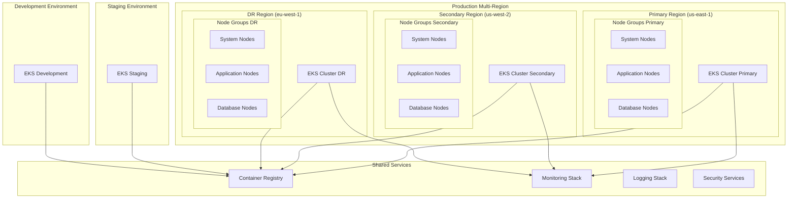

# LeanVibe Kubernetes Orchestration Guide

## Table of Contents

1. [Architecture Overview](#architecture-overview)
2. [Cluster Configuration](#cluster-configuration)
3. [Application Deployments](#application-deployments)
4. [Service Mesh and Networking](#service-mesh-and-networking)
5. [Storage and StatefulSets](#storage-and-statefulsets)
6. [Auto-scaling and Resource Management](#auto-scaling-and-resource-management)
7. [Security and RBAC](#security-and-rbac)
8. [Monitoring and Observability](#monitoring-and-observability)
9. [CI/CD Integration](#ci-cd-integration)
10. [Troubleshooting and Maintenance](#troubleshooting-and-maintenance)

## Architecture Overview

### Multi-Cluster Enterprise Architecture



### Kubernetes Components Overview

#### Core Infrastructure Components
- **EKS Control Plane**: Managed Kubernetes control plane with multi-AZ deployment
- **Node Groups**: Dedicated node groups for different workload types
- **Load Balancers**: AWS Application Load Balancer with SSL termination
- **Storage**: EBS volumes with encryption and backup automation
- **Networking**: VPC CNI with security groups and network policies

#### Application Layer Components
- **Backend Services**: FastAPI application with horizontal pod autoscaling
- **Database Layer**: Neo4j cluster with persistent volumes
- **Cache Layer**: Redis cluster for session and data caching
- **Message Queue**: Internal event processing with Redis Streams
- **Monitoring**: Prometheus, Grafana, and custom metrics collection

## Cluster Configuration

### EKS Cluster Setup

#### Primary Production Cluster
```yaml
# eks-production-primary.yaml
apiVersion: eksctl.io/v1alpha5
kind: ClusterConfig

metadata:
  name: leanvibe-production-primary
  region: us-east-1
  version: "1.28"

vpc:
  cidr: "10.0.0.0/16"
  enableDnsHostnames: true
  enableDnsSupport: true
  
  subnets:
    public:
      us-east-1a: { cidr: "10.0.1.0/24" }
      us-east-1b: { cidr: "10.0.2.0/24" }
      us-east-1c: { cidr: "10.0.3.0/24" }
    private:
      us-east-1a: { cidr: "10.0.10.0/24" }
      us-east-1b: { cidr: "10.0.11.0/24" }
      us-east-1c: { cidr: "10.0.12.0/24" }

iam:
  withOIDC: true
  serviceAccounts:
  - metadata:
      name: cluster-autoscaler
      namespace: kube-system
    wellKnownPolicies:
      autoScaler: true
  - metadata:
      name: aws-load-balancer-controller
      namespace: kube-system
    wellKnownPolicies:
      awsLoadBalancerController: true
  - metadata:
      name: external-dns
      namespace: kube-system
    wellKnownPolicies:
      externalDNS: true

managedNodeGroups:
  - name: system-nodes
    instanceType: t3.medium
    minSize: 2
    maxSize: 4
    desiredCapacity: 2
    volumeSize: 50
    volumeType: gp3
    amiFamily: AmazonLinux2
    iam:
      withAddonPolicies:
        imageBuilder: true
        autoScaler: true
        externalDNS: true
        certManager: true
        awsLoadBalancerController: true
        ebs: true
        efs: true
        fsx: true
        cloudWatch: true
    labels:
      role: system
      tier: infrastructure
    taints:
      - key: CriticalAddonsOnly
        value: "true"
        effect: NoSchedule

  - name: application-nodes
    instanceTypes: ["t3.large", "t3.xlarge", "m5.large", "m5.xlarge"]
    minSize: 3
    maxSize: 20
    desiredCapacity: 5
    volumeSize: 100
    volumeType: gp3
    amiFamily: AmazonLinux2
    spot: true
    iam:
      withAddonPolicies:
        imageBuilder: true
        autoScaler: true
        cloudWatch: true
        ebs: true
    labels:
      role: application
      tier: backend
    ssh:
      allow: true
      publicKeyName: leanvibe-production

  - name: database-nodes
    instanceTypes: ["r5.large", "r5.xlarge", "r5.2xlarge"]
    minSize: 2
    maxSize: 6
    desiredCapacity: 3
    volumeSize: 200
    volumeType: gp3
    amiFamily: AmazonLinux2
    iam:
      withAddonPolicies:
        ebs: true
        cloudWatch: true
    labels:
      role: database
      tier: data
    taints:
      - key: database
        value: "true"
        effect: NoSchedule

addons:
  - name: vpc-cni
    version: latest
    configurationValues: |-
      enableNetworkPolicy: "true"
  - name: coredns
    version: latest
  - name: kube-proxy
    version: latest
  - name: aws-ebs-csi-driver
    version: latest
  - name: aws-efs-csi-driver
    version: latest

cloudWatch:
  clusterLogging:
    enableTypes: ["api", "audit", "authenticator", "controllerManager", "scheduler"]

secretsEncryption:
  keyARN: arn:aws:kms:us-east-1:123456789012:key/12345678-1234-1234-1234-123456789012
```

#### Cluster Creation Commands
```bash
# Create production cluster
eksctl create cluster -f eks-production-primary.yaml

# Wait for cluster to be ready
kubectl wait --for=condition=Ready nodes --all --timeout=900s

# Install essential cluster components
helm repo add eks https://aws.github.io/eks-charts
helm repo add autoscaler https://kubernetes.github.io/autoscaler
helm repo update

# Install AWS Load Balancer Controller
helm install aws-load-balancer-controller eks/aws-load-balancer-controller \
  --set clusterName=leanvibe-production-primary \
  --set serviceAccount.create=false \
  --set serviceAccount.name=aws-load-balancer-controller \
  --namespace kube-system

# Install Cluster Autoscaler
helm install cluster-autoscaler autoscaler/cluster-autoscaler \
  --set autoDiscovery.clusterName=leanvibe-production-primary \
  --set awsRegion=us-east-1 \
  --set serviceAccount.create=false \
  --set serviceAccount.name=cluster-autoscaler \
  --namespace kube-system
```

### Namespace Organization

#### Production Namespace Structure
```yaml
# Core system namespaces
apiVersion: v1
kind: Namespace
metadata:
  name: leanvibe-production
  labels:
    name: leanvibe-production
    tier: application
    environment: production
  annotations:
    description: "Main LeanVibe application namespace"
---
apiVersion: v1
kind: Namespace
metadata:
  name: leanvibe-monitoring
  labels:
    name: leanvibe-monitoring
    tier: monitoring
    environment: production
  annotations:
    description: "Monitoring and observability stack"
---
apiVersion: v1
kind: Namespace
metadata:
  name: leanvibe-backup
  labels:
    name: leanvibe-backup
    tier: backup
    environment: production
  annotations:
    description: "Backup and disaster recovery services"
---
# Enterprise tenant namespaces (template)
apiVersion: v1
kind: Namespace
metadata:
  name: tenant-enterprise-{{ tenant_id }}
  labels:
    name: tenant-enterprise-{{ tenant_id }}
    tier: tenant
    tenant-type: enterprise
    tenant-id: "{{ tenant_id }}"
    environment: production
  annotations:
    description: "Enterprise tenant {{ tenant_id }} namespace"
    tenant.leanvibe.ai/billing-tier: "enterprise"
    tenant.leanvibe.ai/resource-quota: "enterprise"
```

#### Resource Quotas by Namespace
```yaml
# Enterprise tenant resource quota
apiVersion: v1
kind: ResourceQuota
metadata:
  name: enterprise-tenant-quota
  namespace: tenant-enterprise-{{ tenant_id }}
spec:
  hard:
    requests.cpu: "10"
    requests.memory: 20Gi
    requests.storage: 200Gi
    limits.cpu: "20"
    limits.memory: 40Gi
    persistentvolumeclaims: "20"
    pods: "50"
    services: "20"
    secrets: "50"
    configmaps: "50"
---
# Team tenant resource quota
apiVersion: v1
kind: ResourceQuota
metadata:
  name: team-tenant-quota
  namespace: tenant-team-{{ tenant_id }}
spec:
  hard:
    requests.cpu: "4"
    requests.memory: 8Gi
    requests.storage: 50Gi
    limits.cpu: "8"
    limits.memory: 16Gi
    persistentvolumeclaims: "10"
    pods: "20"
    services: "10"
    secrets: "20"
    configmaps: "20"
---
# Developer tenant resource quota
apiVersion: v1
kind: ResourceQuota
metadata:
  name: developer-tenant-quota
  namespace: tenant-developer-{{ tenant_id }}
spec:
  hard:
    requests.cpu: "2"
    requests.memory: 4Gi
    requests.storage: 10Gi
    limits.cpu: "4"
    limits.memory: 8Gi
    persistentvolumeclaims: "5"
    pods: "10"
    services: "5"
    secrets: "10"
    configmaps: "10"
```

## Application Deployments

### LeanVibe Backend Deployment

#### Production Deployment Manifest
```yaml
# leanvibe-backend-deployment.yaml
apiVersion: apps/v1
kind: Deployment
metadata:
  name: leanvibe-backend
  namespace: leanvibe-production
  labels:
    app.kubernetes.io/name: leanvibe
    app.kubernetes.io/instance: production
    app.kubernetes.io/component: backend
    app.kubernetes.io/version: "2.1.0"
    app.kubernetes.io/managed-by: kubernetes
    environment: production
    tier: backend
  annotations:
    deployment.kubernetes.io/revision: "1"
    description: "LeanVibe Enterprise Backend Application"
    last-applied-configuration: |
      Applied by: DevOps Team
      Date: 2025-01-09T10:00:00Z
      Git Commit: abc123def456
spec:
  replicas: 5
  strategy:
    type: RollingUpdate
    rollingUpdate:
      maxUnavailable: 1
      maxSurge: 2
  selector:
    matchLabels:
      app.kubernetes.io/name: leanvibe
      app.kubernetes.io/component: backend
      environment: production
  template:
    metadata:
      labels:
        app.kubernetes.io/name: leanvibe
        app.kubernetes.io/component: backend
        app.kubernetes.io/version: "2.1.0"
        environment: production
        tier: backend
      annotations:
        prometheus.io/scrape: "true"
        prometheus.io/port: "8000"
        prometheus.io/path: "/metrics"
        linkerd.io/inject: enabled
    spec:
      serviceAccountName: leanvibe-backend
      securityContext:
        runAsNonRoot: true
        runAsUser: 1000
        runAsGroup: 1000
        fsGroup: 1000
        seccompProfile:
          type: RuntimeDefault
      
      # Pod Anti-Affinity for High Availability
      affinity:
        podAntiAffinity:
          preferredDuringSchedulingIgnoredDuringExecution:
          - weight: 100
            podAffinityTerm:
              labelSelector:
                matchExpressions:
                - key: app.kubernetes.io/name
                  operator: In
                  values:
                  - leanvibe
              topologyKey: kubernetes.io/hostname
        nodeAffinity:
          requiredDuringSchedulingIgnoredDuringExecution:
            nodeSelectorTerms:
            - matchExpressions:
              - key: role
                operator: In
                values:
                - application
      
      # Init Container for Database Migration
      initContainers:
      - name: database-migration
        image: ghcr.io/leanvibe/leanvibe-backend:2.1.0
        command: ['python', '-m', 'alembic', 'upgrade', 'head']
        env:
        - name: ENVIRONMENT
          value: "production"
        - name: DATABASE_URL
          valueFrom:
            secretKeyRef:
              name: leanvibe-database-secrets
              key: database_url
        envFrom:
        - configMapRef:
            name: leanvibe-config
        securityContext:
          allowPrivilegeEscalation: false
          readOnlyRootFilesystem: true
          runAsNonRoot: true
          runAsUser: 1000
          capabilities:
            drop:
            - ALL
        volumeMounts:
        - name: tmp
          mountPath: /tmp
        resources:
          requests:
            memory: "256Mi"
            cpu: "100m"
          limits:
            memory: "512Mi"
            cpu: "200m"
      
      containers:
      - name: leanvibe-backend
        image: ghcr.io/leanvibe/leanvibe-backend:2.1.0
        imagePullPolicy: IfNotPresent
        
        ports:
        - name: http
          containerPort: 8000
          protocol: TCP
        - name: metrics
          containerPort: 9090
          protocol: TCP
        
        # Environment Variables from ConfigMap and Secrets
        envFrom:
        - configMapRef:
            name: leanvibe-config
        - secretRef:
            name: leanvibe-secrets
        
        env:
        - name: POD_NAME
          valueFrom:
            fieldRef:
              fieldPath: metadata.name
        - name: POD_NAMESPACE
          valueFrom:
            fieldRef:
              fieldPath: metadata.namespace
        - name: NODE_NAME
          valueFrom:
            fieldRef:
              fieldPath: spec.nodeName
        - name: POD_IP
          valueFrom:
            fieldRef:
              fieldPath: status.podIP
        
        # Resource Limits for Enterprise SLA
        resources:
          requests:
            memory: "1Gi"
            cpu: "500m"
            ephemeral-storage: "1Gi"
          limits:
            memory: "2Gi"
            cpu: "1000m"
            ephemeral-storage: "2Gi"
        
        # Liveness Probe - Restart container if unhealthy
        livenessProbe:
          httpGet:
            path: /health/liveness
            port: http
            scheme: HTTP
          initialDelaySeconds: 60
          periodSeconds: 30
          timeoutSeconds: 10
          successThreshold: 1
          failureThreshold: 3
        
        # Readiness Probe - Route traffic only when ready
        readinessProbe:
          httpGet:
            path: /health/readiness
            port: http
            scheme: HTTP
          initialDelaySeconds: 15
          periodSeconds: 10
          timeoutSeconds: 5
          successThreshold: 1
          failureThreshold: 3
        
        # Startup Probe - Allow longer startup time
        startupProbe:
          httpGet:
            path: /health/startup
            port: http
            scheme: HTTP
          initialDelaySeconds: 10
          periodSeconds: 10
          timeoutSeconds: 5
          successThreshold: 1
          failureThreshold: 30
        
        # Security Context
        securityContext:
          allowPrivilegeEscalation: false
          readOnlyRootFilesystem: true
          runAsNonRoot: true
          runAsUser: 1000
          capabilities:
            drop:
            - ALL
            add:
            - NET_BIND_SERVICE
        
        # Volume Mounts
        volumeMounts:
        - name: tmp
          mountPath: /tmp
        - name: logs
          mountPath: /app/logs
        - name: cache
          mountPath: /app/cache
        - name: config-volume
          mountPath: /app/config
          readOnly: true
      
      # Sidecar container for log forwarding
      - name: log-forwarder
        image: fluent/fluent-bit:2.2.0
        resources:
          requests:
            memory: "64Mi"
            cpu: "50m"
          limits:
            memory: "128Mi"
            cpu: "100m"
        volumeMounts:
        - name: logs
          mountPath: /var/log/app
        - name: fluent-bit-config
          mountPath: /fluent-bit/etc
      
      # Volumes
      volumes:
      - name: tmp
        emptyDir:
          sizeLimit: 1Gi
      - name: logs
        emptyDir:
          sizeLimit: 2Gi
      - name: cache
        emptyDir:
          sizeLimit: 1Gi
      - name: config-volume
        configMap:
          name: leanvibe-app-config
          defaultMode: 0644
      - name: fluent-bit-config
        configMap:
          name: fluent-bit-config
      
      # Image Pull Secrets
      imagePullSecrets:
      - name: ghcr-secret
      
      # Termination Grace Period for Graceful Shutdown
      terminationGracePeriodSeconds: 60
      
      # DNS Policy for Service Discovery
      dnsPolicy: ClusterFirst
      
      # Restart Policy
      restartPolicy: Always
      
      # Topology Spread Constraints
      topologySpreadConstraints:
      - maxSkew: 1
        topologyKey: topology.kubernetes.io/zone
        whenUnsatisfiable: DoNotSchedule
        labelSelector:
          matchLabels:
            app.kubernetes.io/name: leanvibe
            app.kubernetes.io/component: backend
```

#### Service Configuration
```yaml
# leanvibe-backend-service.yaml
apiVersion: v1
kind: Service
metadata:
  name: leanvibe-backend
  namespace: leanvibe-production
  labels:
    app.kubernetes.io/name: leanvibe
    app.kubernetes.io/component: backend
    environment: production
  annotations:
    service.beta.kubernetes.io/aws-load-balancer-type: nlb
    service.beta.kubernetes.io/aws-load-balancer-backend-protocol: http
    service.beta.kubernetes.io/aws-load-balancer-healthcheck-path: /health
    service.beta.kubernetes.io/aws-load-balancer-healthcheck-interval: "10"
    prometheus.io/scrape: "true"
    prometheus.io/port: "8000"
    prometheus.io/path: "/metrics"
spec:
  type: ClusterIP
  ports:
  - name: http
    port: 80
    targetPort: http
    protocol: TCP
  - name: https
    port: 443
    targetPort: http
    protocol: TCP
  - name: metrics
    port: 9090
    targetPort: metrics
    protocol: TCP
  selector:
    app.kubernetes.io/name: leanvibe
    app.kubernetes.io/component: backend
    environment: production
  sessionAffinity: None
---
# Headless service for StatefulSet discovery
apiVersion: v1
kind: Service
metadata:
  name: leanvibe-backend-headless
  namespace: leanvibe-production
  labels:
    app.kubernetes.io/name: leanvibe
    app.kubernetes.io/component: backend
    environment: production
spec:
  clusterIP: None
  ports:
  - name: http
    port: 8000
    targetPort: http
  selector:
    app.kubernetes.io/name: leanvibe
    app.kubernetes.io/component: backend
    environment: production
```

### Database Deployments

#### Neo4j Cluster Deployment
```yaml
# neo4j-cluster.yaml
apiVersion: apps/v1
kind: StatefulSet
metadata:
  name: neo4j-cluster
  namespace: leanvibe-production
  labels:
    app.kubernetes.io/name: neo4j
    app.kubernetes.io/instance: production
    app.kubernetes.io/component: database
    app.kubernetes.io/version: "5.15"
spec:
  serviceName: neo4j-cluster
  replicas: 3
  podManagementPolicy: Parallel
  selector:
    matchLabels:
      app.kubernetes.io/name: neo4j
      app.kubernetes.io/component: database
  template:
    metadata:
      labels:
        app.kubernetes.io/name: neo4j
        app.kubernetes.io/component: database
        app.kubernetes.io/version: "5.15"
        environment: production
      annotations:
        prometheus.io/scrape: "true"
        prometheus.io/port: "2004"
        prometheus.io/path: "/metrics"
    spec:
      serviceAccountName: neo4j
      securityContext:
        runAsNonRoot: true
        runAsUser: 7474
        runAsGroup: 7474
        fsGroup: 7474
      
      affinity:
        nodeAffinity:
          requiredDuringSchedulingIgnoredDuringExecution:
            nodeSelectorTerms:
            - matchExpressions:
              - key: role
                operator: In
                values:
                - database
        podAntiAffinity:
          requiredDuringSchedulingIgnoredDuringExecution:
          - labelSelector:
              matchExpressions:
              - key: app.kubernetes.io/name
                operator: In
                values:
                - neo4j
            topologyKey: kubernetes.io/hostname
      
      tolerations:
      - key: database
        operator: Equal
        value: "true"
        effect: NoSchedule
      
      initContainers:
      - name: init-plugins
        image: neo4j:5.15-enterprise
        command:
        - sh
        - -c
        - |
          cp /var/lib/neo4j/labs/neo4j-streams-*.jar /plugins/
          cp /var/lib/neo4j/labs/apoc-*-core.jar /plugins/
          chmod -R 755 /plugins/
        volumeMounts:
        - name: plugins
          mountPath: /plugins
        securityContext:
          runAsUser: 7474
          runAsGroup: 7474
      
      containers:
      - name: neo4j
        image: neo4j:5.15-enterprise
        imagePullPolicy: IfNotPresent
        
        ports:
        - name: http
          containerPort: 7474
          protocol: TCP
        - name: bolt
          containerPort: 7687
          protocol: TCP
        - name: backup
          containerPort: 6362
          protocol: TCP
        - name: cluster
          containerPort: 7688
          protocol: TCP
        - name: discovery
          containerPort: 5000
          protocol: TCP
        - name: raft
          containerPort: 7000
          protocol: TCP
        - name: metrics
          containerPort: 2004
          protocol: TCP
        
        env:
        - name: POD_NAME
          valueFrom:
            fieldRef:
              fieldPath: metadata.name
        - name: NEO4J_ACCEPT_LICENSE_AGREEMENT
          value: "yes"
        - name: NEO4J_AUTH
          valueFrom:
            secretKeyRef:
              name: neo4j-secrets
              key: auth
        - name: NEO4J_PLUGINS
          value: '["apoc", "streams"]'
        - name: NEO4J_dbms_mode
          value: "CORE"
        - name: NEO4J_causal__clustering_minimum__core__cluster__size__at__formation
          value: "3"
        - name: NEO4J_causal__clustering_minimum__core__cluster__size__at__runtime
          value: "2"
        - name: NEO4J_causal__clustering_discovery__type
          value: "K8S"
        - name: NEO4J_causal__clustering_k8s_label__selector
          value: "app.kubernetes.io/name=neo4j,app.kubernetes.io/component=database"
        - name: NEO4J_causal__clustering_k8s_service__port__name
          value: "discovery"
        - name: NEO4J_dbms_connector_bolt_advertised__address
          value: "$(POD_NAME).neo4j-cluster.leanvibe-production.svc.cluster.local:7687"
        - name: NEO4J_dbms_connector_http_advertised__address
          value: "$(POD_NAME).neo4j-cluster.leanvibe-production.svc.cluster.local:7474"
        - name: NEO4J_metrics_prometheus_enabled
          value: "true"
        - name: NEO4J_metrics_prometheus_endpoint
          value: "0.0.0.0:2004"
        
        resources:
          requests:
            memory: "4Gi"
            cpu: "1000m"
            ephemeral-storage: "2Gi"
          limits:
            memory: "8Gi"
            cpu: "2000m"
            ephemeral-storage: "4Gi"
        
        livenessProbe:
          httpGet:
            path: /
            port: http
          initialDelaySeconds: 60
          periodSeconds: 30
          timeoutSeconds: 10
          failureThreshold: 3
        
        readinessProbe:
          httpGet:
            path: /db/manage/server/core/available
            port: http
          initialDelaySeconds: 30
          periodSeconds: 10
          timeoutSeconds: 5
          failureThreshold: 3
        
        securityContext:
          allowPrivilegeEscalation: false
          readOnlyRootFilesystem: false
          runAsNonRoot: true
          runAsUser: 7474
          capabilities:
            drop:
            - ALL
        
        volumeMounts:
        - name: data
          mountPath: /data
        - name: logs
          mountPath: /logs
        - name: plugins
          mountPath: /var/lib/neo4j/plugins
        - name: conf
          mountPath: /var/lib/neo4j/conf
        
      volumes:
      - name: plugins
        emptyDir: {}
      - name: logs
        emptyDir: {}
      - name: conf
        configMap:
          name: neo4j-config
  
  volumeClaimTemplates:
  - metadata:
      name: data
    spec:
      accessModes: ["ReadWriteOnce"]
      storageClassName: gp3-encrypted
      resources:
        requests:
          storage: 500Gi
---
# Neo4j Service for cluster communication
apiVersion: v1
kind: Service
metadata:
  name: neo4j-cluster
  namespace: leanvibe-production
  labels:
    app.kubernetes.io/name: neo4j
    app.kubernetes.io/component: database
spec:
  clusterIP: None
  ports:
  - name: http
    port: 7474
    targetPort: http
  - name: bolt
    port: 7687
    targetPort: bolt
  - name: backup
    port: 6362
    targetPort: backup
  - name: cluster
    port: 7688
    targetPort: cluster
  - name: discovery
    port: 5000
    targetPort: discovery
  - name: raft
    port: 7000
    targetPort: raft
  - name: metrics
    port: 2004
    targetPort: metrics
  selector:
    app.kubernetes.io/name: neo4j
    app.kubernetes.io/component: database
```

#### Redis Cluster Deployment
```yaml
# redis-cluster.yaml
apiVersion: apps/v1
kind: StatefulSet
metadata:
  name: redis-cluster
  namespace: leanvibe-production
  labels:
    app.kubernetes.io/name: redis
    app.kubernetes.io/instance: production
    app.kubernetes.io/component: cache
spec:
  serviceName: redis-cluster
  replicas: 6
  selector:
    matchLabels:
      app.kubernetes.io/name: redis
      app.kubernetes.io/component: cache
  template:
    metadata:
      labels:
        app.kubernetes.io/name: redis
        app.kubernetes.io/component: cache
        environment: production
      annotations:
        prometheus.io/scrape: "true"
        prometheus.io/port: "9121"
    spec:
      affinity:
        podAntiAffinity:
          preferredDuringSchedulingIgnoredDuringExecution:
          - weight: 100
            podAffinityTerm:
              labelSelector:
                matchExpressions:
                - key: app.kubernetes.io/name
                  operator: In
                  values:
                  - redis
              topologyKey: kubernetes.io/hostname
      
      initContainers:
      - name: config-init
        image: redis:7.2-alpine
        command:
        - sh
        - -c
        - |
          cp /tmp/redis/redis.conf /etc/redis/redis.conf
          echo "cluster-config-file /data/nodes-${HOSTNAME}.conf" >> /etc/redis/redis.conf
          echo "cluster-node-timeout 5000" >> /etc/redis/redis.conf
          echo "cluster-announce-hostname ${HOSTNAME}.redis-cluster.leanvibe-production.svc.cluster.local" >> /etc/redis/redis.conf
        env:
        - name: HOSTNAME
          valueFrom:
            fieldRef:
              fieldPath: metadata.name
        volumeMounts:
        - name: redis-config
          mountPath: /tmp/redis/
        - name: config
          mountPath: /etc/redis/
      
      containers:
      - name: redis
        image: redis:7.2-alpine
        ports:
        - name: redis
          containerPort: 6379
        - name: gossip
          containerPort: 16379
        
        command:
        - redis-server
        - /etc/redis/redis.conf
        - --cluster-enabled
        - --cluster-require-full-coverage
        - --cluster-node-timeout
        - "5000"
        - --cluster-config-file
        - /data/nodes.conf
        - --cluster-announce-hostname
        - $(HOSTNAME).redis-cluster.leanvibe-production.svc.cluster.local
        
        env:
        - name: HOSTNAME
          valueFrom:
            fieldRef:
              fieldPath: metadata.name
        - name: REDIS_PASSWORD
          valueFrom:
            secretKeyRef:
              name: redis-secrets
              key: password
        
        resources:
          requests:
            memory: "1Gi"
            cpu: "500m"
          limits:
            memory: "2Gi"
            cpu: "1000m"
        
        livenessProbe:
          exec:
            command:
            - sh
            - -c
            - "redis-cli -h $(hostname) ping"
          initialDelaySeconds: 20
          periodSeconds: 3
        
        readinessProbe:
          exec:
            command:
            - sh
            - -c
            - "redis-cli -h $(hostname) ping"
          initialDelaySeconds: 5
          periodSeconds: 2
        
        volumeMounts:
        - name: data
          mountPath: /data
        - name: config
          mountPath: /etc/redis/
      
      # Redis exporter for monitoring
      - name: redis-exporter
        image: oliver006/redis_exporter:v1.55.0
        ports:
        - name: metrics
          containerPort: 9121
        env:
        - name: REDIS_ADDR
          value: "redis://localhost:6379"
        - name: REDIS_PASSWORD
          valueFrom:
            secretKeyRef:
              name: redis-secrets
              key: password
        resources:
          requests:
            memory: "64Mi"
            cpu: "50m"
          limits:
            memory: "128Mi"
            cpu: "100m"
      
      volumes:
      - name: redis-config
        configMap:
          name: redis-config
      - name: config
        emptyDir: {}
  
  volumeClaimTemplates:
  - metadata:
      name: data
    spec:
      accessModes: ["ReadWriteOnce"]
      storageClassName: gp3-encrypted
      resources:
        requests:
          storage: 100Gi
```

## Auto-scaling and Resource Management

### Horizontal Pod Autoscaler (HPA)

#### Application HPA Configuration
```yaml
# leanvibe-backend-hpa.yaml
apiVersion: autoscaling/v2
kind: HorizontalPodAutoscaler
metadata:
  name: leanvibe-backend-hpa
  namespace: leanvibe-production
  labels:
    app.kubernetes.io/name: leanvibe
    app.kubernetes.io/component: backend
    environment: production
spec:
  scaleTargetRef:
    apiVersion: apps/v1
    kind: Deployment
    name: leanvibe-backend
  minReplicas: 5
  maxReplicas: 50
  metrics:
  # CPU-based scaling
  - type: Resource
    resource:
      name: cpu
      target:
        type: Utilization
        averageUtilization: 70
  # Memory-based scaling
  - type: Resource
    resource:
      name: memory
      target:
        type: Utilization
        averageUtilization: 80
  # Custom metrics for request rate
  - type: Pods
    pods:
      metric:
        name: http_requests_per_second
      target:
        type: AverageValue
        averageValue: "100"
  # Custom metrics for tenant load
  - type: Pods
    pods:
      metric:
        name: active_tenants_per_pod
      target:
        type: AverageValue
        averageValue: "50"
  # External metrics for queue depth
  - type: External
    external:
      metric:
        name: redis_queue_depth
      target:
        type: AverageValue
        averageValue: "100"
  
  behavior:
    scaleDown:
      stabilizationWindowSeconds: 300  # 5 minutes
      policies:
      - type: Percent
        value: 20
        periodSeconds: 60
      - type: Pods
        value: 2
        periodSeconds: 60
      selectPolicy: Min
    scaleUp:
      stabilizationWindowSeconds: 60   # 1 minute
      policies:
      - type: Percent
        value: 100
        periodSeconds: 30
      - type: Pods
        value: 5
        periodSeconds: 30
      selectPolicy: Max
```

### Vertical Pod Autoscaler (VPA)

#### VPA Configuration for Resource Optimization
```yaml
# leanvibe-backend-vpa.yaml
apiVersion: autoscaling.k8s.io/v1
kind: VerticalPodAutoscaler
metadata:
  name: leanvibe-backend-vpa
  namespace: leanvibe-production
  labels:
    app.kubernetes.io/name: leanvibe
    app.kubernetes.io/component: backend
spec:
  targetRef:
    apiVersion: apps/v1
    kind: Deployment
    name: leanvibe-backend
  updatePolicy:
    updateMode: "Initial"  # Only set resources on pod creation
  resourcePolicy:
    containerPolicies:
    - containerName: leanvibe-backend
      minAllowed:
        cpu: 250m
        memory: 512Mi
      maxAllowed:
        cpu: 4
        memory: 8Gi
      controlledResources: ["cpu", "memory"]
      controlledValues: RequestsAndLimits
    - containerName: log-forwarder
      mode: "Off"  # Don't adjust sidecar resources
```

### Pod Disruption Budget

#### PDB for High Availability
```yaml
# leanvibe-backend-pdb.yaml
apiVersion: policy/v1
kind: PodDisruptionBudget
metadata:
  name: leanvibe-backend-pdb
  namespace: leanvibe-production
  labels:
    app.kubernetes.io/name: leanvibe
    app.kubernetes.io/component: backend
    environment: production
spec:
  minAvailable: 3  # Always keep at least 3 pods running
  selector:
    matchLabels:
      app.kubernetes.io/name: leanvibe
      app.kubernetes.io/component: backend
      environment: production
---
# Database PDB for StatefulSet
apiVersion: policy/v1
kind: PodDisruptionBudget
metadata:
  name: neo4j-cluster-pdb
  namespace: leanvibe-production
  labels:
    app.kubernetes.io/name: neo4j
    app.kubernetes.io/component: database
spec:
  minAvailable: 2  # Always keep at least 2 database pods running
  selector:
    matchLabels:
      app.kubernetes.io/name: neo4j
      app.kubernetes.io/component: database
---
# Cache PDB
apiVersion: policy/v1
kind: PodDisruptionBudget
metadata:
  name: redis-cluster-pdb
  namespace: leanvibe-production
  labels:
    app.kubernetes.io/name: redis
    app.kubernetes.io/component: cache
spec:
  minAvailable: 4  # Keep majority of redis cluster running
  selector:
    matchLabels:
      app.kubernetes.io/name: redis
      app.kubernetes.io/component: cache
```

## Storage and StatefulSets

### Storage Classes

#### High-Performance Storage Classes
```yaml
# storage-classes.yaml
apiVersion: storage.k8s.io/v1
kind: StorageClass
metadata:
  name: gp3-encrypted
  labels:
    storageclass.leanvibe.ai/type: general-purpose
    storageclass.leanvibe.ai/encryption: enabled
provisioner: ebs.csi.aws.com
volumeBindingMode: WaitForFirstConsumer
allowVolumeExpansion: true
parameters:
  type: gp3
  iops: "3000"
  throughput: "125"
  encrypted: "true"
  kmsKeyId: arn:aws:kms:us-east-1:123456789012:key/12345678-1234-1234-1234-123456789012
---
apiVersion: storage.k8s.io/v1
kind: StorageClass
metadata:
  name: io2-high-performance
  labels:
    storageclass.leanvibe.ai/type: high-performance
    storageclass.leanvibe.ai/encryption: enabled
provisioner: ebs.csi.aws.com
volumeBindingMode: WaitForFirstConsumer
allowVolumeExpansion: true
parameters:
  type: io2
  iops: "10000"
  encrypted: "true"
  kmsKeyId: arn:aws:kms:us-east-1:123456789012:key/12345678-1234-1234-1234-123456789012
---
apiVersion: storage.k8s.io/v1
kind: StorageClass
metadata:
  name: efs-storage
  labels:
    storageclass.leanvibe.ai/type: shared
provisioner: efs.csi.aws.com
volumeBindingMode: Immediate
parameters:
  provisioningMode: efs-utils
  fileSystemId: fs-12345678
  directoryPerms: "0755"
```

### Persistent Volume Claims

#### Database Storage Configuration
```yaml
# database-storage-pvc.yaml
apiVersion: v1
kind: PersistentVolumeClaim
metadata:
  name: neo4j-backup-storage
  namespace: leanvibe-production
  labels:
    app.kubernetes.io/name: neo4j
    app.kubernetes.io/component: backup
spec:
  accessModes:
    - ReadWriteMany
  storageClassName: efs-storage
  resources:
    requests:
      storage: 1Ti
---
# Shared storage for logs and temporary files
apiVersion: v1
kind: PersistentVolumeClaim
metadata:
  name: shared-logs-storage
  namespace: leanvibe-production
  labels:
    app.kubernetes.io/component: logging
spec:
  accessModes:
    - ReadWriteMany
  storageClassName: efs-storage
  resources:
    requests:
      storage: 500Gi
```

### Backup Jobs for StatefulSets

#### Automated Database Backup
```yaml
# neo4j-backup-cronjob.yaml
apiVersion: batch/v1
kind: CronJob
metadata:
  name: neo4j-backup
  namespace: leanvibe-production
  labels:
    app.kubernetes.io/name: neo4j
    app.kubernetes.io/component: backup
spec:
  schedule: "0 2 * * *"  # Daily at 2 AM
  timeZone: "UTC"
  concurrencyPolicy: Forbid
  successfulJobsHistoryLimit: 7
  failedJobsHistoryLimit: 3
  jobTemplate:
    spec:
      template:
        metadata:
          labels:
            app.kubernetes.io/name: neo4j
            app.kubernetes.io/component: backup
        spec:
          serviceAccountName: neo4j-backup
          restartPolicy: OnFailure
          
          containers:
          - name: backup
            image: neo4j:5.15-enterprise
            command:
            - sh
            - -c
            - |
              # Create backup directory with timestamp
              BACKUP_DIR="/backup/$(date +%Y%m%d_%H%M%S)"
              mkdir -p "$BACKUP_DIR"
              
              # Perform backup for each neo4j instance
              for pod in neo4j-cluster-0 neo4j-cluster-1 neo4j-cluster-2; do
                echo "Backing up $pod..."
                neo4j-admin database backup \
                  --from="bolt://$pod.neo4j-cluster.leanvibe-production.svc.cluster.local:7687" \
                  --to-path="$BACKUP_DIR/$pod" \
                  --database=neo4j \
                  --compress
              done
              
              # Compress and upload to S3
              cd /backup
              tar -czf "$(basename $BACKUP_DIR).tar.gz" "$(basename $BACKUP_DIR)"
              aws s3 cp "$(basename $BACKUP_DIR).tar.gz" \
                s3://leanvibe-backups-prod/neo4j/$(basename $BACKUP_DIR).tar.gz
              
              # Cleanup local backup
              rm -rf "$BACKUP_DIR" "$(basename $BACKUP_DIR).tar.gz"
              
              echo "Backup completed successfully"
            
            env:
            - name: NEO4J_AUTH
              valueFrom:
                secretKeyRef:
                  name: neo4j-secrets
                  key: auth
            - name: AWS_DEFAULT_REGION
              value: "us-east-1"
            
            resources:
              requests:
                memory: "512Mi"
                cpu: "200m"
              limits:
                memory: "2Gi"
                cpu: "1000m"
            
            volumeMounts:
            - name: backup-storage
              mountPath: /backup
            - name: aws-credentials
              mountPath: /home/neo4j/.aws
              readOnly: true
          
          volumes:
          - name: backup-storage
            persistentVolumeClaim:
              claimName: neo4j-backup-storage
          - name: aws-credentials
            secret:
              secretName: aws-backup-credentials
```

## Monitoring and Observability

### ServiceMonitor for Prometheus

#### Application Metrics Collection
```yaml
# leanvibe-service-monitor.yaml
apiVersion: monitoring.coreos.com/v1
kind: ServiceMonitor
metadata:
  name: leanvibe-backend
  namespace: leanvibe-production
  labels:
    app.kubernetes.io/name: leanvibe
    app.kubernetes.io/component: backend
    prometheus: leanvibe
spec:
  selector:
    matchLabels:
      app.kubernetes.io/name: leanvibe
      app.kubernetes.io/component: backend
  endpoints:
  - port: metrics
    interval: 15s
    path: /metrics
    scheme: http
    scrapeTimeout: 10s
    metricRelabelings:
    - sourceLabels: [__name__]
      regex: 'go_.*'
      action: drop
    - sourceLabels: [__name__]
      regex: 'process_.*'
      action: drop
  - port: http
    interval: 30s
    path: /health/metrics
    scheme: http
    scrapeTimeout: 5s
  namespaceSelector:
    matchNames:
    - leanvibe-production
```

### Custom Metrics and Alerting

#### Business Metrics Collection
```yaml
# business-metrics-service-monitor.yaml
apiVersion: monitoring.coreos.com/v1
kind: ServiceMonitor
metadata:
  name: leanvibe-business-metrics
  namespace: leanvibe-production
  labels:
    app.kubernetes.io/name: leanvibe
    app.kubernetes.io/component: business-metrics
spec:
  selector:
    matchLabels:
      app.kubernetes.io/name: leanvibe
      app.kubernetes.io/component: backend
  endpoints:
  - port: metrics
    interval: 60s
    path: /business/metrics
    scheme: http
    metricRelabelings:
    - sourceLabels: [tenant_id]
      targetLabel: tenant
    - sourceLabels: [subscription_tier]
      targetLabel: tier
  namespaceSelector:
    matchNames:
    - leanvibe-production
```

## Troubleshooting and Maintenance

### Common Operational Commands

#### Pod Debugging Commands
```bash
# Get pod status and events
kubectl get pods -n leanvibe-production -o wide
kubectl describe pod <pod-name> -n leanvibe-production

# Check pod logs
kubectl logs -f <pod-name> -n leanvibe-production
kubectl logs <pod-name> -n leanvibe-production --previous

# Debug pod networking
kubectl exec -it <pod-name> -n leanvibe-production -- /bin/bash
kubectl exec <pod-name> -n leanvibe-production -- nslookup kubernetes.default.svc.cluster.local

# Check resource usage
kubectl top pods -n leanvibe-production --sort-by=cpu
kubectl top pods -n leanvibe-production --sort-by=memory

# Get pod manifests
kubectl get pod <pod-name> -n leanvibe-production -o yaml
kubectl get deployment leanvibe-backend -n leanvibe-production -o yaml
```

#### Service and Network Debugging
```bash
# Check service endpoints
kubectl get endpoints -n leanvibe-production
kubectl describe service leanvibe-backend -n leanvibe-production

# Test service connectivity
kubectl run debug-pod --image=curlimages/curl --rm -it --restart=Never -- /bin/sh
# Inside the pod:
curl http://leanvibe-backend.leanvibe-production.svc.cluster.local/health

# Check ingress status
kubectl get ingress -n leanvibe-production
kubectl describe ingress leanvibe-backend -n leanvibe-production

# Network policy debugging
kubectl get networkpolicy -n leanvibe-production
kubectl describe networkpolicy <policy-name> -n leanvibe-production
```

#### StatefulSet Operations
```bash
# Scale StatefulSet
kubectl scale statefulset neo4j-cluster --replicas=5 -n leanvibe-production

# Rolling update of StatefulSet
kubectl patch statefulset neo4j-cluster -n leanvibe-production \
  -p='{"spec":{"updateStrategy":{"type":"RollingUpdate"}}}'

# Delete StatefulSet pod for recreation
kubectl delete pod neo4j-cluster-0 -n leanvibe-production

# Check PVC status
kubectl get pvc -n leanvibe-production
kubectl describe pvc <pvc-name> -n leanvibe-production
```

### Disaster Recovery Procedures

#### Cluster Backup and Restore
```bash
#!/bin/bash
# cluster-backup.sh - Complete cluster backup

BACKUP_DATE=$(date +%Y%m%d_%H%M%S)
NAMESPACE="leanvibe-production"
BACKUP_DIR="/tmp/cluster-backup-$BACKUP_DATE"

mkdir -p "$BACKUP_DIR"

echo "Starting cluster backup: $BACKUP_DATE"

# Backup all deployments
kubectl get deployments -n "$NAMESPACE" -o yaml > "$BACKUP_DIR/deployments.yaml"

# Backup all services
kubectl get services -n "$NAMESPACE" -o yaml > "$BACKUP_DIR/services.yaml"

# Backup all configmaps
kubectl get configmaps -n "$NAMESPACE" -o yaml > "$BACKUP_DIR/configmaps.yaml"

# Backup all secrets (base64 encoded)
kubectl get secrets -n "$NAMESPACE" -o yaml > "$BACKUP_DIR/secrets.yaml"

# Backup all persistent volume claims
kubectl get pvc -n "$NAMESPACE" -o yaml > "$BACKUP_DIR/pvc.yaml"

# Backup StatefulSets
kubectl get statefulsets -n "$NAMESPACE" -o yaml > "$BACKUP_DIR/statefulsets.yaml"

# Backup HPAs
kubectl get hpa -n "$NAMESPACE" -o yaml > "$BACKUP_DIR/hpa.yaml"

# Backup NetworkPolicies
kubectl get networkpolicy -n "$NAMESPACE" -o yaml > "$BACKUP_DIR/networkpolicy.yaml"

# Compress backup
cd /tmp
tar -czf "cluster-backup-$BACKUP_DATE.tar.gz" "cluster-backup-$BACKUP_DATE"

# Upload to S3
aws s3 cp "cluster-backup-$BACKUP_DATE.tar.gz" \
  s3://leanvibe-backups-prod/cluster/cluster-backup-$BACKUP_DATE.tar.gz

# Cleanup
rm -rf "$BACKUP_DIR" "cluster-backup-$BACKUP_DATE.tar.gz"

echo "Cluster backup completed: cluster-backup-$BACKUP_DATE.tar.gz"
```

#### Emergency Recovery Procedures
```bash
#!/bin/bash
# emergency-recovery.sh - Emergency cluster recovery

BACKUP_FILE="$1"
NAMESPACE="leanvibe-production"

if [ -z "$BACKUP_FILE" ]; then
    echo "Usage: $0 <backup-file>"
    exit 1
fi

echo "Starting emergency recovery from: $BACKUP_FILE"

# Download backup from S3
aws s3 cp "s3://leanvibe-backups-prod/cluster/$BACKUP_FILE" ./

# Extract backup
tar -xzf "$BACKUP_FILE"
BACKUP_DIR=$(basename "$BACKUP_FILE" .tar.gz)

# Stop all current deployments
kubectl scale deployment --all --replicas=0 -n "$NAMESPACE"

# Wait for pods to terminate
kubectl wait --for=delete pods --all -n "$NAMESPACE" --timeout=300s

# Restore secrets first
kubectl apply -f "$BACKUP_DIR/secrets.yaml"

# Restore configmaps
kubectl apply -f "$BACKUP_DIR/configmaps.yaml"

# Restore PVCs
kubectl apply -f "$BACKUP_DIR/pvc.yaml"

# Restore StatefulSets
kubectl apply -f "$BACKUP_DIR/statefulsets.yaml"

# Wait for StatefulSets to be ready
kubectl wait --for=condition=Ready pods -l "app.kubernetes.io/component=database" \
  -n "$NAMESPACE" --timeout=900s

# Restore Deployments
kubectl apply -f "$BACKUP_DIR/deployments.yaml"

# Restore Services
kubectl apply -f "$BACKUP_DIR/services.yaml"

# Restore HPAs
kubectl apply -f "$BACKUP_DIR/hpa.yaml"

# Restore Network Policies
kubectl apply -f "$BACKUP_DIR/networkpolicy.yaml"

# Verify recovery
kubectl get pods -n "$NAMESPACE"
kubectl get services -n "$NAMESPACE"

echo "Emergency recovery completed"
echo "Please verify all services are functioning correctly"
```

---

**Document Version**: 1.0  
**Last Updated**: January 2025  
**Next Review**: April 2025  
**Owner**: Platform Engineering Team

This comprehensive Kubernetes orchestration guide provides detailed procedures for deploying, managing, and operating LeanVibe on Kubernetes at enterprise scale, ensuring high availability, security, and operational excellence.