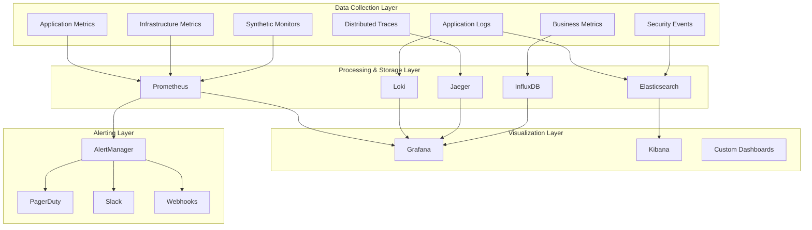

# LeanVibe Enterprise Monitoring & Observability Guide

## Table of Contents

1. [Observability Architecture Overview](#observability-architecture-overview)
2. [Metrics Collection and Storage](#metrics-collection-and-storage)
3. [Logging Infrastructure](#logging-infrastructure)
4. [Distributed Tracing](#distributed-tracing)
5. [Alerting and Notification](#alerting-and-notification)
6. [Dashboard Configuration](#dashboard-configuration)
7. [Business Metrics and KPIs](#business-metrics-and-kpis)
8. [Synthetic Monitoring](#synthetic-monitoring)
9. [Security Monitoring](#security-monitoring)
10. [Troubleshooting and Diagnostics](#troubleshooting-and-diagnostics)

## Observability Architecture Overview

### Enterprise Monitoring Stack



### Key Components

#### Metrics Stack
- **Prometheus**: Primary metrics collection and storage
- **Node Exporter**: System and hardware metrics
- **cAdvisor**: Container metrics
- **Kube State Metrics**: Kubernetes object metrics
- **Custom Application Metrics**: Business and application-specific metrics

#### Logging Stack
- **Loki**: Log aggregation and storage
- **Promtail**: Log collection agent
- **Fluentd**: Advanced log processing
- **Elasticsearch**: Search and analytics for security logs

#### Tracing Stack
- **Jaeger**: Distributed tracing collection and storage
- **OpenTelemetry**: Tracing instrumentation
- **Zipkin**: Alternative tracing backend

## Metrics Collection and Storage

### Prometheus Configuration

#### Production Prometheus Setup
```yaml
# prometheus-deployment.yaml
apiVersion: apps/v1
kind: Deployment
metadata:
  name: prometheus
  namespace: leanvibe-monitoring
  labels:
    app.kubernetes.io/name: prometheus
    app.kubernetes.io/version: "2.45.0"
spec:
  replicas: 2
  strategy:
    type: RollingUpdate
    rollingUpdate:
      maxUnavailable: 1
  selector:
    matchLabels:
      app.kubernetes.io/name: prometheus
  template:
    metadata:
      labels:
        app.kubernetes.io/name: prometheus
      annotations:
        prometheus.io/scrape: "true"
        prometheus.io/port: "9090"
    spec:
      serviceAccountName: prometheus
      securityContext:
        runAsNonRoot: true
        runAsUser: 65534
        fsGroup: 65534
      
      affinity:
        podAntiAffinity:
          preferredDuringSchedulingIgnoredDuringExecution:
          - weight: 100
            podAffinityTerm:
              labelSelector:
                matchExpressions:
                - key: app.kubernetes.io/name
                  operator: In
                  values:
                  - prometheus
              topologyKey: kubernetes.io/hostname
      
      containers:
      - name: prometheus
        image: prom/prometheus:v2.45.0
        args:
        - '--config.file=/etc/prometheus/prometheus.yml'
        - '--storage.tsdb.path=/prometheus/'
        - '--web.console.libraries=/etc/prometheus/console_libraries'
        - '--web.console.templates=/etc/prometheus/consoles'
        - '--storage.tsdb.retention.time=90d'
        - '--storage.tsdb.retention.size=100GB'
        - '--web.enable-lifecycle'
        - '--web.enable-admin-api'
        - '--web.external-url=https://prometheus.leanvibe.ai'
        - '--web.route-prefix=/'
        - '--storage.tsdb.wal-compression'
        - '--storage.tsdb.min-block-duration=2h'
        - '--storage.tsdb.max-block-duration=2h'
        
        ports:
        - name: http
          containerPort: 9090
        
        resources:
          requests:
            memory: "4Gi"
            cpu: "1000m"
          limits:
            memory: "8Gi"
            cpu: "2000m"
        
        livenessProbe:
          httpGet:
            path: /-/healthy
            port: http
          initialDelaySeconds: 60
          periodSeconds: 30
        
        readinessProbe:
          httpGet:
            path: /-/ready
            port: http
          initialDelaySeconds: 30
          periodSeconds: 10
        
        securityContext:
          allowPrivilegeEscalation: false
          readOnlyRootFilesystem: true
          runAsNonRoot: true
          capabilities:
            drop:
            - ALL
        
        volumeMounts:
        - name: config-volume
          mountPath: /etc/prometheus
        - name: prometheus-storage
          mountPath: /prometheus
        - name: tmp
          mountPath: /tmp
      
      volumes:
      - name: config-volume
        configMap:
          name: prometheus-config
      - name: tmp
        emptyDir:
          sizeLimit: 2Gi
      - name: prometheus-storage
        persistentVolumeClaim:
          claimName: prometheus-storage
```

#### Comprehensive Prometheus Configuration
```yaml
# prometheus-config.yaml
apiVersion: v1
kind: ConfigMap
metadata:
  name: prometheus-config
  namespace: leanvibe-monitoring
data:
  prometheus.yml: |
    global:
      scrape_interval: 15s
      evaluation_interval: 15s
      external_labels:
        cluster: 'leanvibe-production'
        region: 'us-east-1'
        environment: 'production'
    
    rule_files:
    - "/etc/prometheus/rules/*.yml"
    
    alerting:
      alertmanagers:
      - static_configs:
        - targets:
          - alertmanager:9093
        timeout: 10s
        api_version: v2
    
    scrape_configs:
    # Prometheus itself
    - job_name: 'prometheus'
      static_configs:
      - targets: ['localhost:9090']
      scrape_interval: 5s
      metrics_path: /metrics
    
    # Kubernetes API server
    - job_name: 'kubernetes-apiservers'
      kubernetes_sd_configs:
      - role: endpoints
      scheme: https
      tls_config:
        ca_file: /var/run/secrets/kubernetes.io/serviceaccount/ca.crt
      bearer_token_file: /var/run/secrets/kubernetes.io/serviceaccount/token
      relabel_configs:
      - source_labels: [__meta_kubernetes_namespace, __meta_kubernetes_service_name, __meta_kubernetes_endpoint_port_name]
        action: keep
        regex: default;kubernetes;https
      - source_labels: [__address__]
        target_label: __address__
        regex: (.+)(?::\d+)
        replacement: $1:443
    
    # Kubernetes nodes
    - job_name: 'kubernetes-nodes'
      kubernetes_sd_configs:
      - role: node
      scheme: https
      tls_config:
        ca_file: /var/run/secrets/kubernetes.io/serviceaccount/ca.crt
      bearer_token_file: /var/run/secrets/kubernetes.io/serviceaccount/token
      relabel_configs:
      - action: labelmap
        regex: __meta_kubernetes_node_label_(.+)
      - target_label: __address__
        replacement: kubernetes.default.svc:443
      - source_labels: [__meta_kubernetes_node_name]
        regex: (.+)
        target_label: __metrics_path__
        replacement: /api/v1/nodes/${1}/proxy/metrics
    
    # Kubernetes pods
    - job_name: 'kubernetes-pods'
      kubernetes_sd_configs:
      - role: pod
      relabel_configs:
      - source_labels: [__meta_kubernetes_pod_annotation_prometheus_io_scrape]
        action: keep
        regex: true
      - source_labels: [__meta_kubernetes_pod_annotation_prometheus_io_path]
        action: replace
        target_label: __metrics_path__
        regex: (.+)
      - source_labels: [__address__, __meta_kubernetes_pod_annotation_prometheus_io_port]
        action: replace
        regex: ([^:]+)(?::\d+)?;(\d+)
        replacement: $1:$2
        target_label: __address__
      - action: labelmap
        regex: __meta_kubernetes_pod_label_(.+)
      - source_labels: [__meta_kubernetes_namespace]
        action: replace
        target_label: kubernetes_namespace
      - source_labels: [__meta_kubernetes_pod_name]
        action: replace
        target_label: kubernetes_pod_name
    
    # LeanVibe Backend Application
    - job_name: 'leanvibe-backend'
      kubernetes_sd_configs:
      - role: endpoints
        namespaces:
          names:
          - leanvibe-production
      relabel_configs:
      - source_labels: [__meta_kubernetes_service_name]
        action: keep
        regex: leanvibe-backend
      - source_labels: [__meta_kubernetes_endpoint_port_name]
        action: keep
        regex: metrics
      - action: labelmap
        regex: __meta_kubernetes_service_label_(.+)
      - source_labels: [__meta_kubernetes_namespace]
        target_label: kubernetes_namespace
      - source_labels: [__meta_kubernetes_service_name]
        target_label: kubernetes_name
      metric_relabel_configs:
      - source_labels: [__name__]
        regex: 'http_request_duration_seconds_bucket'
        target_label: __tmp_le
        replacement: '${1}'
      - source_labels: [__tmp_le]
        regex: '(.+)'
        target_label: le
        replacement: '${1}'
    
    # Neo4j Database Metrics
    - job_name: 'neo4j'
      kubernetes_sd_configs:
      - role: endpoints
        namespaces:
          names:
          - leanvibe-production
      relabel_configs:
      - source_labels: [__meta_kubernetes_service_name]
        action: keep
        regex: neo4j-cluster
      - source_labels: [__meta_kubernetes_endpoint_port_name]
        action: keep
        regex: metrics
      - action: labelmap
        regex: __meta_kubernetes_service_label_(.+)
      - source_labels: [__meta_kubernetes_pod_name]
        target_label: neo4j_instance
    
    # Redis Cache Metrics
    - job_name: 'redis'
      kubernetes_sd_configs:
      - role: endpoints
        namespaces:
          names:
          - leanvibe-production
      relabel_configs:
      - source_labels: [__meta_kubernetes_service_name]
        action: keep
        regex: redis-cluster
      - source_labels: [__meta_kubernetes_endpoint_port_name]
        action: keep
        regex: metrics
      - action: labelmap
        regex: __meta_kubernetes_service_label_(.+)
      - source_labels: [__meta_kubernetes_pod_name]
        target_label: redis_instance
    
    # Node Exporter
    - job_name: 'node-exporter'
      kubernetes_sd_configs:
      - role: endpoints
      relabel_configs:
      - source_labels: [__meta_kubernetes_endpoints_name]
        action: keep
        regex: node-exporter
      - source_labels: [__meta_kubernetes_endpoint_address_target_name]
        target_label: node_name
    
    # kube-state-metrics
    - job_name: 'kube-state-metrics'
      static_configs:
      - targets: ['kube-state-metrics:8080']
    
    # Business Metrics
    - job_name: 'business-metrics'
      kubernetes_sd_configs:
      - role: service
        namespaces:
          names:
          - leanvibe-production
      relabel_configs:
      - source_labels: [__meta_kubernetes_service_annotation_prometheus_io_scrape_business]
        action: keep
        regex: true
      - source_labels: [__meta_kubernetes_service_annotation_prometheus_io_path]
        action: replace
        target_label: __metrics_path__
        regex: (.+)
      - source_labels: [__address__, __meta_kubernetes_service_annotation_prometheus_io_port]
        action: replace
        regex: ([^:]+)(?::\d+)?;(\d+)
        replacement: $1:$2
        target_label: __address__
    
    # External services monitoring
    - job_name: 'stripe-api'
      metrics_path: /external/stripe/metrics
      static_configs:
      - targets: ['leanvibe-backend:8765']
      scrape_interval: 60s
    
    - job_name: 'aws-resources'
      ec2_sd_configs:
      - region: us-east-1
        port: 9100
        filters:
        - name: tag:Environment
          values: [production]
        - name: tag:Project
          values: [leanvibe]
      relabel_configs:
      - source_labels: [__meta_ec2_tag_Name]
        target_label: instance_name
      - source_labels: [__meta_ec2_instance_type]
        target_label: instance_type
      - source_labels: [__meta_ec2_availability_zone]
        target_label: availability_zone
  
  # Alert rules configuration
  alert_rules.yml: |
    groups:
    - name: leanvibe.enterprise.rules
      rules:
      # High-level application alerts
      - alert: LeanVibeHighErrorRate
        expr: |
          (
            rate(http_requests_total{job="leanvibe-backend",status=~"5.."}[5m]) /
            rate(http_requests_total{job="leanvibe-backend"}[5m])
          ) * 100 > 5
        for: 2m
        labels:
          severity: critical
          service: leanvibe-backend
          team: platform
        annotations:
          summary: "LeanVibe high error rate detected"
          description: "Error rate is {{ $value | humanizePercentage }} for instance {{ $labels.instance }}"
          runbook_url: "https://runbooks.leanvibe.ai/high-error-rate"
      
      - alert: LeanVibeHighResponseTime
        expr: |
          histogram_quantile(0.95,
            rate(http_request_duration_seconds_bucket{job="leanvibe-backend"}[5m])
          ) > 2
        for: 5m
        labels:
          severity: warning
          service: leanvibe-backend
          team: platform
        annotations:
          summary: "LeanVibe high response time detected"
          description: "95th percentile response time is {{ $value }}s for instance {{ $labels.instance }}"
          runbook_url: "https://runbooks.leanvibe.ai/high-response-time"
      
      - alert: LeanVibeHighMemoryUsage
        expr: |
          (
            container_memory_usage_bytes{pod=~"leanvibe-backend-.*"} /
            container_spec_memory_limit_bytes{pod=~"leanvibe-backend-.*"}
          ) * 100 > 90
        for: 10m
        labels:
          severity: warning
          service: leanvibe-backend
          team: platform
        annotations:
          summary: "LeanVibe high memory usage"
          description: "Memory usage is {{ $value | humanizePercentage }} for pod {{ $labels.pod }}"
      
      - alert: LeanVibeHighCPUUsage
        expr: |
          (
            rate(container_cpu_usage_seconds_total{pod=~"leanvibe-backend-.*"}[5m]) /
            container_spec_cpu_quota{pod=~"leanvibe-backend-.*"} * 100000
          ) * 100 > 90
        for: 15m
        labels:
          severity: warning
          service: leanvibe-backend
          team: platform
        annotations:
          summary: "LeanVibe high CPU usage"
          description: "CPU usage is {{ $value | humanizePercentage }} for pod {{ $labels.pod }}"
      
      # Database alerts
      - alert: Neo4jDown
        expr: up{job="neo4j"} == 0
        for: 1m
        labels:
          severity: critical
          service: neo4j
          team: platform
        annotations:
          summary: "Neo4j database is down"
          description: "Neo4j instance {{ $labels.instance }} is down"
          runbook_url: "https://runbooks.leanvibe.ai/neo4j-down"
      
      - alert: Neo4jHighConnections
        expr: neo4j_bolt_connections_opened_total - neo4j_bolt_connections_closed_total > 80
        for: 5m
        labels:
          severity: warning
          service: neo4j
          team: platform
        annotations:
          summary: "Neo4j high connection count"
          description: "Neo4j has {{ $value }} active connections on {{ $labels.instance }}"
      
      - alert: Neo4jSlowQueries
        expr: |
          rate(neo4j_cypher_query_duration_seconds_bucket{quantile="0.95"}[5m]) > 2
        for: 10m
        labels:
          severity: warning
          service: neo4j
          team: platform
        annotations:
          summary: "Neo4j slow queries detected"
          description: "95th percentile query time is {{ $value }}s on {{ $labels.instance }}"
      
      # Redis alerts
      - alert: RedisDown
        expr: up{job="redis"} == 0
        for: 1m
        labels:
          severity: critical
          service: redis
          team: platform
        annotations:
          summary: "Redis cache is down"
          description: "Redis instance {{ $labels.instance }} is down"
          runbook_url: "https://runbooks.leanvibe.ai/redis-down"
      
      - alert: RedisHighMemoryUsage
        expr: |
          (redis_memory_used_bytes / redis_memory_max_bytes) * 100 > 90
        for: 5m
        labels:
          severity: warning
          service: redis
          team: platform
        annotations:
          summary: "Redis high memory usage"
          description: "Redis memory usage is {{ $value | humanizePercentage }} on {{ $labels.instance }}"
      
      - alert: RedisLowHitRate
        expr: |
          (
            redis_keyspace_hits_total /
            (redis_keyspace_hits_total + redis_keyspace_misses_total)
          ) * 100 < 80
        for: 15m
        labels:
          severity: warning
          service: redis
          team: platform
        annotations:
          summary: "Redis low cache hit rate"
          description: "Cache hit rate is {{ $value | humanizePercentage }} on {{ $labels.instance }}"
      
      # Business metrics alerts
      - alert: LowTenantSignupRate
        expr: increase(tenant_signups_total[1h]) < 5
        for: 2h
        labels:
          severity: warning
          category: business
          team: product
        annotations:
          summary: "Low tenant signup rate detected"
          description: "Only {{ $value }} tenant signups in the last hour"
      
      - alert: HighTenantChurnRate
        expr: |
          (
            increase(tenant_cancellations_total[24h]) /
            increase(tenant_signups_total[24h])
          ) * 100 > 10
        for: 4h
        labels:
          severity: critical
          category: business
          team: product
        annotations:
          summary: "High tenant churn rate detected"
          description: "Tenant churn rate is {{ $value | humanizePercentage }} over the last 24 hours"
      
      - alert: RevenueDropAlert
        expr: |
          (
            (monthly_recurring_revenue_usd - monthly_recurring_revenue_usd offset 30d) /
            monthly_recurring_revenue_usd offset 30d
          ) * 100 < -5
        for: 1h
        labels:
          severity: critical
          category: business
          team: finance
        annotations:
          summary: "Monthly Recurring Revenue drop detected"
          description: "MRR has dropped {{ $value | humanizePercentage }} compared to last month"
      
      # Infrastructure alerts
      - alert: KubernetesNodeNotReady
        expr: kube_node_status_condition{condition="Ready",status="true"} == 0
        for: 5m
        labels:
          severity: critical
          category: infrastructure
          team: platform
        annotations:
          summary: "Kubernetes node not ready"
          description: "Node {{ $labels.node }} is not ready"
          runbook_url: "https://runbooks.leanvibe.ai/node-not-ready"
      
      - alert: KubernetesPodCrashLooping
        expr: rate(kube_pod_container_status_restarts_total[15m]) > 0
        for: 5m
        labels:
          severity: warning
          category: infrastructure
          team: platform
        annotations:
          summary: "Kubernetes pod crash looping"
          description: "Pod {{ $labels.pod }} in namespace {{ $labels.namespace }} is crash looping"
      
      - alert: KubernetesPodNotReady
        expr: kube_pod_status_ready{condition="true"} == 0
        for: 10m
        labels:
          severity: warning
          category: infrastructure
          team: platform
        annotations:
          summary: "Kubernetes pod not ready"
          description: "Pod {{ $labels.pod }} in namespace {{ $labels.namespace }} is not ready"
      
      # Storage alerts
      - alert: PersistentVolumeSpaceUsage
        expr: |
          (
            (
              kubelet_volume_stats_capacity_bytes -
              kubelet_volume_stats_available_bytes
            ) /
            kubelet_volume_stats_capacity_bytes
          ) * 100 > 85
        for: 5m
        labels:
          severity: warning
          category: storage
          team: platform
        annotations:
          summary: "Persistent volume space usage high"
          description: "PV {{ $labels.persistentvolumeclaim }} usage is {{ $value | humanizePercentage }}"
      
      - alert: PersistentVolumeInodeUsage
        expr: |
          (
            (
              kubelet_volume_stats_inodes -
              kubelet_volume_stats_inodes_free
            ) /
            kubelet_volume_stats_inodes
          ) * 100 > 90
        for: 5m
        labels:
          severity: warning
          category: storage
          team: platform
        annotations:
          summary: "Persistent volume inode usage high"
          description: "PV {{ $labels.persistentvolumeclaim }} inode usage is {{ $value | humanizePercentage }}"
```

### Custom Application Metrics

#### Business Metrics Implementation
```python
# app/monitoring/business_metrics.py
from prometheus_client import Counter, Histogram, Gauge, Summary, Info
from prometheus_client.core import CollectorRegistry
from typing import Dict, Optional
import asyncio
from datetime import datetime, timedelta

class BusinessMetricsCollector:
    def __init__(self):
        self.registry = CollectorRegistry()
        self._setup_metrics()
    
    def _setup_metrics(self):
        """Initialize all business metrics"""
        
        # Tenant metrics
        self.tenant_registrations = Counter(
            'leanvibe_tenant_registrations_total',
            'Total number of tenant registrations',
            ['plan', 'region', 'source'],
            registry=self.registry
        )
        
        self.active_tenants = Gauge(
            'leanvibe_active_tenants_total',
            'Current number of active tenants',
            ['plan'],
            registry=self.registry
        )
        
        self.tenant_churn = Counter(
            'leanvibe_tenant_churn_total',
            'Total number of tenant cancellations',
            ['plan', 'reason'],
            registry=self.registry
        )
        
        # Revenue metrics
        self.monthly_recurring_revenue = Gauge(
            'leanvibe_monthly_recurring_revenue_usd',
            'Monthly Recurring Revenue in USD',
            ['plan'],
            registry=self.registry
        )
        
        self.annual_recurring_revenue = Gauge(
            'leanvibe_annual_recurring_revenue_usd',
            'Annual Recurring Revenue in USD',
            ['plan'],
            registry=self.registry
        )
        
        # Usage metrics
        self.api_requests = Counter(
            'leanvibe_api_requests_total',
            'Total API requests',
            ['method', 'endpoint', 'tenant_plan', 'status'],
            registry=self.registry
        )
        
        self.api_request_duration = Histogram(
            'leanvibe_api_request_duration_seconds',
            'API request duration',
            ['method', 'endpoint', 'tenant_plan'],
            buckets=[0.01, 0.05, 0.1, 0.25, 0.5, 1.0, 2.5, 5.0, 10.0],
            registry=self.registry
        )
        
        # Feature usage metrics
        self.feature_usage = Counter(
            'leanvibe_feature_usage_total',
            'Feature usage count',
            ['feature_name', 'tenant_plan', 'tenant_id'],
            registry=self.registry
        )
        
        # AI processing metrics
        self.ai_requests = Counter(
            'leanvibe_ai_requests_total',
            'Total AI processing requests',
            ['request_type', 'model', 'tenant_plan', 'status'],
            registry=self.registry
        )
        
        self.ai_processing_duration = Histogram(
            'leanvibe_ai_processing_duration_seconds',
            'AI processing duration',
            ['request_type', 'model'],
            buckets=[0.1, 0.5, 1.0, 2.0, 5.0, 10.0, 30.0, 60.0],
            registry=self.registry
        )
        
        # Billing metrics
        self.payment_events = Counter(
            'leanvibe_payment_events_total',
            'Payment processing events',
            ['event_type', 'status', 'plan'],
            registry=self.registry
        )
        
        self.payment_amount = Summary(
            'leanvibe_payment_amount_usd',
            'Payment amounts in USD',
            ['plan'],
            registry=self.registry
        )
        
        # System health metrics
        self.database_connections = Gauge(
            'leanvibe_database_connections_active',
            'Active database connections',
            ['database_type'],
            registry=self.registry
        )
        
        self.cache_hit_ratio = Gauge(
            'leanvibe_cache_hit_ratio',
            'Cache hit ratio',
            ['cache_type'],
            registry=self.registry
        )
        
        # Custom SLA metrics
        self.sla_uptime = Gauge(
            'leanvibe_sla_uptime_percentage',
            'Current SLA uptime percentage',
            ['service', 'tenant_tier'],
            registry=self.registry
        )
        
        self.sla_response_time_p95 = Gauge(
            'leanvibe_sla_response_time_p95_seconds',
            '95th percentile response time for SLA',
            ['service', 'tenant_tier'],
            registry=self.registry
        )
    
    async def record_tenant_registration(self, plan: str, region: str, source: str):
        """Record new tenant registration"""
        self.tenant_registrations.labels(plan=plan, region=region, source=source).inc()
    
    async def update_active_tenants(self, plan: str, count: int):
        """Update active tenant count"""
        self.active_tenants.labels(plan=plan).set(count)
    
    async def record_tenant_churn(self, plan: str, reason: str):
        """Record tenant churn"""
        self.tenant_churn.labels(plan=plan, reason=reason).inc()
    
    async def update_revenue_metrics(self, plan: str, mrr: float, arr: float):
        """Update revenue metrics"""
        self.monthly_recurring_revenue.labels(plan=plan).set(mrr)
        self.annual_recurring_revenue.labels(plan=plan).set(arr)
    
    async def record_api_request(self, method: str, endpoint: str, tenant_plan: str, 
                               status: str, duration: float):
        """Record API request metrics"""
        self.api_requests.labels(
            method=method, 
            endpoint=endpoint, 
            tenant_plan=tenant_plan, 
            status=status
        ).inc()
        
        self.api_request_duration.labels(
            method=method, 
            endpoint=endpoint, 
            tenant_plan=tenant_plan
        ).observe(duration)
    
    async def record_feature_usage(self, feature_name: str, tenant_plan: str, tenant_id: str):
        """Record feature usage"""
        self.feature_usage.labels(
            feature_name=feature_name, 
            tenant_plan=tenant_plan, 
            tenant_id=tenant_id
        ).inc()
    
    async def record_ai_processing(self, request_type: str, model: str, tenant_plan: str, 
                                 status: str, duration: float):
        """Record AI processing metrics"""
        self.ai_requests.labels(
            request_type=request_type, 
            model=model, 
            tenant_plan=tenant_plan, 
            status=status
        ).inc()
        
        self.ai_processing_duration.labels(
            request_type=request_type, 
            model=model
        ).observe(duration)
    
    async def record_payment_event(self, event_type: str, status: str, plan: str, amount: float):
        """Record payment events"""
        self.payment_events.labels(
            event_type=event_type, 
            status=status, 
            plan=plan
        ).inc()
        
        if status == 'success':
            self.payment_amount.labels(plan=plan).observe(amount)
    
    async def update_system_health(self, db_connections: Dict[str, int], cache_hit_ratios: Dict[str, float]):
        """Update system health metrics"""
        for db_type, connections in db_connections.items():
            self.database_connections.labels(database_type=db_type).set(connections)
        
        for cache_type, hit_ratio in cache_hit_ratios.items():
            self.cache_hit_ratio.labels(cache_type=cache_type).set(hit_ratio)
    
    async def update_sla_metrics(self, service: str, tenant_tier: str, uptime: float, response_time_p95: float):
        """Update SLA compliance metrics"""
        self.sla_uptime.labels(service=service, tenant_tier=tenant_tier).set(uptime)
        self.sla_response_time_p95.labels(service=service, tenant_tier=tenant_tier).set(response_time_p95)

# Middleware to automatically collect request metrics
class MetricsMiddleware:
    def __init__(self, app, metrics_collector: BusinessMetricsCollector):
        self.app = app
        self.metrics = metrics_collector
    
    async def __call__(self, scope, receive, send):
        if scope["type"] != "http":
            await self.app(scope, receive, send)
            return
        
        start_time = asyncio.get_event_loop().time()
        
        # Extract request info
        method = scope["method"]
        path = scope["path"]
        tenant_plan = scope.get("tenant_plan", "unknown")
        
        # Process request
        async def send_wrapper(message):
            if message["type"] == "http.response.start":
                end_time = asyncio.get_event_loop().time()
                duration = end_time - start_time
                status_code = message["status"]
                
                # Record metrics
                await self.metrics.record_api_request(
                    method=method,
                    endpoint=path,
                    tenant_plan=tenant_plan,
                    status=str(status_code),
                    duration=duration
                )
            
            await send(message)
        
        await self.app(scope, receive, send_wrapper)
```

## Logging Infrastructure

### Structured Logging Configuration

#### Application Logging Setup
```python
# app/core/logging_config.py
import logging
import json
from datetime import datetime
from typing import Dict, Any, Optional
import structlog
from structlog.stdlib import LoggerFactory
from structlog.dev import ConsoleRenderer
from structlog.processors import JSONRenderer, TimeStamper, add_log_level, StackInfoRenderer

class StructuredLogger:
    def __init__(self, service_name: str = "leanvibe-backend", environment: str = "production"):
        self.service_name = service_name
        self.environment = environment
        self.setup_structured_logging()
    
    def setup_structured_logging(self):
        """Configure structured logging with JSON output for production"""
        
        # Define processors
        processors = [
            structlog.stdlib.filter_by_level,
            structlog.stdlib.add_logger_name,
            structlog.stdlib.add_log_level,
            structlog.stdlib.PositionalArgumentsFormatter(),
            TimeStamper(fmt="ISO"),
            StackInfoRenderer(),
            structlog.processors.format_exc_info,
        ]
        
        # Use JSON renderer for production, console for development
        if self.environment == "production":
            processors.append(JSONRenderer())
            logging.basicConfig(
                format="%(message)s",
                stream=None,
                level=logging.INFO,
            )
        else:
            processors.append(ConsoleRenderer())
            logging.basicConfig(
                format="%(message)s",
                stream=None,
                level=logging.DEBUG,
            )
        
        # Configure structlog
        structlog.configure(
            processors=processors,
            wrapper_class=structlog.stdlib.BoundLogger,
            logger_factory=LoggerFactory(),
            context_class=dict,
            cache_logger_on_first_use=True,
        )
        
        # Create logger instance
        self.logger = structlog.get_logger()
    
    def get_logger(self, **context):
        """Get logger with additional context"""
        return self.logger.bind(
            service=self.service_name,
            environment=self.environment,
            **context
        )
    
    def log_request(self, request_id: str, method: str, path: str, 
                   status_code: int, duration_ms: float, **kwargs):
        """Log HTTP request with structured format"""
        self.logger.info(
            "HTTP request processed",
            request_id=request_id,
            method=method,
            path=path,
            status_code=status_code,
            duration_ms=duration_ms,
            **kwargs
        )
    
    def log_error(self, error: Exception, context: Dict[str, Any] = None):
        """Log error with structured format and context"""
        self.logger.error(
            "Application error occurred",
            error_type=type(error).__name__,
            error_message=str(error),
            error_context=context or {},
            exc_info=True
        )
    
    def log_business_event(self, event_type: str, tenant_id: str = None, **kwargs):
        """Log business events for analytics"""
        self.logger.info(
            "Business event",
            event_type=event_type,
            tenant_id=tenant_id,
            **kwargs
        )
    
    def log_security_event(self, event_type: str, severity: str = "info", **kwargs):
        """Log security events for monitoring"""
        self.logger.bind(
            security_event=True,
            event_type=event_type,
            severity=severity,
            **kwargs
        ).warning("Security event logged")

# Request logging middleware
class RequestLoggingMiddleware:
    def __init__(self, app, logger: StructuredLogger):
        self.app = app
        self.logger = logger
    
    async def __call__(self, scope, receive, send):
        if scope["type"] != "http":
            await self.app(scope, receive, send)
            return
        
        import uuid
        import asyncio
        
        request_id = str(uuid.uuid4())
        start_time = asyncio.get_event_loop().time()
        
        # Add request ID to scope
        scope["request_id"] = request_id
        
        method = scope["method"]
        path = scope["path"]
        
        async def send_wrapper(message):
            if message["type"] == "http.response.start":
                end_time = asyncio.get_event_loop().time()
                duration_ms = (end_time - start_time) * 1000
                status_code = message["status"]
                
                # Log the request
                self.logger.log_request(
                    request_id=request_id,
                    method=method,
                    path=path,
                    status_code=status_code,
                    duration_ms=duration_ms,
                    user_agent=scope.get("headers", {}).get("user-agent", ""),
                    remote_addr=scope.get("client", ["unknown"])[0]
                )
            
            await send(message)
        
        await self.app(scope, receive, send_wrapper)
```

### Loki Configuration

#### Loki Deployment for Log Aggregation
```yaml
# loki-deployment.yaml
apiVersion: apps/v1
kind: Deployment
metadata:
  name: loki
  namespace: leanvibe-monitoring
  labels:
    app.kubernetes.io/name: loki
    app.kubernetes.io/version: "2.9.0"
spec:
  replicas: 2
  selector:
    matchLabels:
      app.kubernetes.io/name: loki
  template:
    metadata:
      labels:
        app.kubernetes.io/name: loki
    spec:
      serviceAccountName: loki
      securityContext:
        runAsUser: 10001
        runAsGroup: 10001
        fsGroup: 10001
      
      containers:
      - name: loki
        image: grafana/loki:2.9.0
        args:
        - -config.file=/etc/loki/loki.yaml
        - -target=all
        
        ports:
        - name: http
          containerPort: 3100
        
        resources:
          requests:
            memory: "2Gi"
            cpu: "500m"
          limits:
            memory: "4Gi"
            cpu: "1000m"
        
        livenessProbe:
          httpGet:
            path: /ready
            port: http
          initialDelaySeconds: 60
          periodSeconds: 30
        
        readinessProbe:
          httpGet:
            path: /ready
            port: http
          initialDelaySeconds: 30
          periodSeconds: 10
        
        securityContext:
          allowPrivilegeEscalation: false
          readOnlyRootFilesystem: true
          runAsNonRoot: true
          capabilities:
            drop:
            - ALL
        
        volumeMounts:
        - name: config
          mountPath: /etc/loki
        - name: storage
          mountPath: /loki
        - name: tmp
          mountPath: /tmp
      
      volumes:
      - name: config
        configMap:
          name: loki-config
      - name: tmp
        emptyDir:
          sizeLimit: 1Gi
      - name: storage
        persistentVolumeClaim:
          claimName: loki-storage
```

#### Loki Configuration
```yaml
# loki-config.yaml
apiVersion: v1
kind: ConfigMap
metadata:
  name: loki-config
  namespace: leanvibe-monitoring
data:
  loki.yaml: |
    auth_enabled: false
    
    server:
      http_listen_port: 3100
      grpc_listen_port: 9096
      log_level: info
    
    common:
      path_prefix: /loki
      storage:
        filesystem:
          chunks_directory: /loki/chunks
          rules_directory: /loki/rules
      replication_factor: 1
      ring:
        kvstore:
          store: inmemory
    
    query_scheduler:
      max_outstanding_requests_per_tenant: 2048
    
    frontend:
      max_outstanding_per_tenant: 2048
      compress_responses: true
    
    query_range:
      align_queries_with_step: true
      max_retries: 5
      parallelise_shardable_queries: true
      cache_results: true
      results_cache:
        cache:
          filesystem:
            directory: /loki/query-cache
    
    ingester:
      lifecycler:
        address: 127.0.0.1
        ring:
          kvstore:
            store: inmemory
          replication_factor: 1
      chunk_idle_period: 5m
      chunk_retain_period: 30s
      max_transfer_retries: 0
      wal:
        dir: /loki/wal
    
    schema_config:
      configs:
      - from: 2023-01-01
        store: boltdb-shipper
        object_store: s3
        schema: v11
        index:
          prefix: index_
          period: 24h
    
    storage_config:
      aws:
        s3: s3://us-east-1/leanvibe-loki-storage-prod
        region: us-east-1
        access_key_id: ${AWS_ACCESS_KEY_ID}
        secret_access_key: ${AWS_SECRET_ACCESS_KEY}
        sse_encryption: true
      
      boltdb_shipper:
        active_index_directory: /loki/index
        shared_store: s3
        cache_location: /loki/boltdb-cache
    
    compactor:
      working_directory: /loki/compactor
      shared_store: s3
      compaction_interval: 5m
      retention_enabled: true
      retention_delete_delay: 2h
      retention_delete_worker_count: 150
    
    limits_config:
      enforce_metric_name: false
      reject_old_samples: true
      reject_old_samples_max_age: 168h
      ingestion_rate_mb: 100
      ingestion_burst_size_mb: 200
      per_stream_rate_limit: 10MB
      per_stream_rate_limit_burst: 20MB
      max_streams_per_user: 10000
      max_line_size: 0
      retention_period: 30d
    
    chunk_store_config:
      max_look_back_period: 0s
    
    table_manager:
      retention_deletes_enabled: true
      retention_period: 30d
    
    ruler:
      storage:
        type: local
        local:
          directory: /loki/rules
      rule_path: /loki/rules
      alertmanager_url: http://alertmanager:9093
      ring:
        kvstore:
          store: inmemory
      enable_api: true
      enable_alertmanager_v2: true
    
    analytics:
      reporting_enabled: false
```

### Promtail Configuration

#### Log Collection Agent Setup
```yaml
# promtail-daemonset.yaml
apiVersion: apps/v1
kind: DaemonSet
metadata:
  name: promtail
  namespace: leanvibe-monitoring
  labels:
    app.kubernetes.io/name: promtail
spec:
  selector:
    matchLabels:
      app.kubernetes.io/name: promtail
  template:
    metadata:
      labels:
        app.kubernetes.io/name: promtail
    spec:
      serviceAccountName: promtail
      tolerations:
      - key: node-role.kubernetes.io/master
        effect: NoSchedule
      - key: node-role.kubernetes.io/control-plane
        effect: NoSchedule
      
      containers:
      - name: promtail
        image: grafana/promtail:2.9.0
        args:
        - -config.file=/etc/promtail/config.yml
        - -client.url=http://loki:3100/loki/api/v1/push
        
        ports:
        - name: http
          containerPort: 3101
        
        resources:
          requests:
            memory: "128Mi"
            cpu: "50m"
          limits:
            memory: "256Mi"
            cpu: "200m"
        
        securityContext:
          allowPrivilegeEscalation: false
          readOnlyRootFilesystem: true
          runAsNonRoot: true
          runAsUser: 0  # Required for reading container logs
          capabilities:
            drop:
            - ALL
        
        volumeMounts:
        - name: config
          mountPath: /etc/promtail
        - name: varlog
          mountPath: /var/log
          readOnly: true
        - name: varlibdockercontainers
          mountPath: /var/lib/docker/containers
          readOnly: true
        - name: tmp
          mountPath: /tmp
      
      volumes:
      - name: config
        configMap:
          name: promtail-config
      - name: varlog
        hostPath:
          path: /var/log
      - name: varlibdockercontainers
        hostPath:
          path: /var/lib/docker/containers
      - name: tmp
        emptyDir:
          sizeLimit: 100Mi
```

#### Promtail Configuration for Log Processing
```yaml
# promtail-config.yaml
apiVersion: v1
kind: ConfigMap
metadata:
  name: promtail-config
  namespace: leanvibe-monitoring
data:
  config.yml: |
    server:
      http_listen_port: 3101
      grpc_listen_port: 0
    
    clients:
    - url: http://loki:3100/loki/api/v1/push
      tenant_id: leanvibe-production
    
    positions:
      filename: /tmp/positions.yaml
    
    scrape_configs:
    # Kubernetes pod logs
    - job_name: kubernetes-pods
      kubernetes_sd_configs:
      - role: pod
      
      relabel_configs:
      - source_labels: [__meta_kubernetes_pod_controller_name]
        regex: ([0-9a-z-.]+?)(-[0-9a-f]{8,10})?
        action: replace
        target_label: __tmp_controller_name
      
      - source_labels: [__meta_kubernetes_pod_label_app_kubernetes_io_name]
        action: replace
        target_label: app
      
      - source_labels: [__meta_kubernetes_pod_label_app_kubernetes_io_component]
        action: replace
        target_label: component
      
      - source_labels: [__meta_kubernetes_pod_node_name]
        action: replace
        target_label: node_name
      
      - source_labels: [__meta_kubernetes_namespace]
        action: replace
        target_label: namespace
      
      - source_labels: [__meta_kubernetes_pod_name]
        action: replace
        target_label: pod
      
      - source_labels: [__meta_kubernetes_pod_container_name]
        action: replace
        target_label: container
      
      - source_labels: [__meta_kubernetes_pod_label_version]
        action: replace
        target_label: version
      
      - replacement: /var/log/pods/*$1/*.log
        separator: /
        source_labels: [__meta_kubernetes_pod_uid, __meta_kubernetes_pod_container_name]
        target_label: __path__
    
    # System logs
    - job_name: syslog
      static_configs:
      - targets:
        - localhost
        labels:
          job: syslog
          __path__: /var/log/syslog
    
    # Journal logs
    - job_name: journal
      journal:
        json: false
        max_age: 12h
        path: /var/log/journal
        labels:
          job: systemd-journal
      
      relabel_configs:
      - source_labels: ['__journal__systemd_unit']
        target_label: 'unit'
      - source_labels: ['__journal_priority']
        target_label: 'priority'
      - source_labels: ['__journal__hostname']
        target_label: 'hostname'
    
    # Application-specific log parsing
    - job_name: leanvibe-backend
      kubernetes_sd_configs:
      - role: pod
        namespaces:
          names:
          - leanvibe-production
      
      relabel_configs:
      - source_labels: [__meta_kubernetes_pod_label_app_kubernetes_io_name]
        action: keep
        regex: leanvibe
      - source_labels: [__meta_kubernetes_pod_container_name]
        action: keep
        regex: leanvibe-backend
      
      # Parse structured JSON logs
      pipeline_stages:
      - json:
          expressions:
            timestamp: timestamp
            level: level
            logger: logger
            message: message
            request_id: request_id
            tenant_id: tenant_id
            method: method
            path: path
            status_code: status_code
            duration_ms: duration_ms
            error_type: error_type
      
      - timestamp:
          source: timestamp
          format: RFC3339
      
      - labels:
          level:
          logger:
          request_id:
          tenant_id:
          method:
          status_code:
          error_type:
      
      # Add metrics based on logs
      - metrics:
          log_lines_total:
            type: Counter
            description: "Total number of log lines"
            config:
              action: inc
          
          http_requests_total:
            type: Counter
            description: "Total HTTP requests from logs"
            config:
              action: inc
            match_all: true
            count_entry_bytes: false
          
          error_logs_total:
            type: Counter
            description: "Total error log entries"
            config:
              action: inc
              match_all: true
              count_entry_bytes: false
            source: level
            regex: "error|ERROR"
    
    # Neo4j database logs
    - job_name: neo4j
      kubernetes_sd_configs:
      - role: pod
        namespaces:
          names:
          - leanvibe-production
      
      relabel_configs:
      - source_labels: [__meta_kubernetes_pod_label_app_kubernetes_io_name]
        action: keep
        regex: neo4j
      
      pipeline_stages:
      - regex:
          expression: '^(?P<timestamp>\d{4}-\d{2}-\d{2} \d{2}:\d{2}:\d{2}\.\d{3})\+\d{4} (?P<level>\w+)\s+(?P<component>\S+) (?P<message>.*)'
      
      - timestamp:
          source: timestamp
          format: '2006-01-02 15:04:05.000'
      
      - labels:
          level:
          component:
      
      # Parse slow query logs
      - match:
          selector: '{component="neo4j.cypher"}'
          stages:
          - regex:
              expression: 'Query slow.*took (?P<duration>\d+)ms.*query: (?P<query>.*)'
          - labels:
              slow_query: "true"
          - metrics:
              slow_queries_total:
                type: Counter
                description: "Total slow queries"
                config:
                  action: inc
    
    # Redis logs
    - job_name: redis
      kubernetes_sd_configs:
      - role: pod
        namespaces:
          names:
          - leanvibe-production
      
      relabel_configs:
      - source_labels: [__meta_kubernetes_pod_label_app_kubernetes_io_name]
        action: keep
        regex: redis
      
      pipeline_stages:
      - regex:
          expression: '^(?P<pid>\d+):(?P<role>\w) (?P<timestamp>\d{2} \w{3} \d{4} \d{2}:\d{2}:\d{2}\.\d{3}) (?P<level>\w+) (?P<message>.*)'
      
      - timestamp:
          source: timestamp
          format: '02 Jan 2006 15:04:05.000'
      
      - labels:
          level:
          role:
          pid:
```

## Dashboard Configuration

### Comprehensive Grafana Dashboards

#### Main Application Dashboard JSON
```json
{
  "dashboard": {
    "id": null,
    "title": "LeanVibe Enterprise Overview",
    "tags": ["leanvibe", "production", "overview"],
    "timezone": "UTC",
    "refresh": "30s",
    "time": {
      "from": "now-1h",
      "to": "now"
    },
    "panels": [
      {
        "id": 1,
        "title": "API Request Rate",
        "type": "stat",
        "targets": [
          {
            "expr": "sum(rate(leanvibe_api_requests_total[5m]))",
            "legendFormat": "Requests/sec"
          }
        ],
        "fieldConfig": {
          "defaults": {
            "unit": "reqps",
            "min": 0,
            "thresholds": {
              "steps": [
                {"color": "green", "value": null},
                {"color": "yellow", "value": 100},
                {"color": "red", "value": 500}
              ]
            }
          }
        },
        "gridPos": {"h": 8, "w": 6, "x": 0, "y": 0}
      },
      {
        "id": 2,
        "title": "API Response Time (95th percentile)",
        "type": "stat",
        "targets": [
          {
            "expr": "histogram_quantile(0.95, rate(leanvibe_api_request_duration_seconds_bucket[5m]))",
            "legendFormat": "95th percentile"
          }
        ],
        "fieldConfig": {
          "defaults": {
            "unit": "s",
            "min": 0,
            "thresholds": {
              "steps": [
                {"color": "green", "value": null},
                {"color": "yellow", "value": 0.5},
                {"color": "red", "value": 2.0}
              ]
            }
          }
        },
        "gridPos": {"h": 8, "w": 6, "x": 6, "y": 0}
      },
      {
        "id": 3,
        "title": "Error Rate",
        "type": "stat",
        "targets": [
          {
            "expr": "sum(rate(leanvibe_api_requests_total{status=~\"5..\"}[5m])) / sum(rate(leanvibe_api_requests_total[5m])) * 100",
            "legendFormat": "Error Rate"
          }
        ],
        "fieldConfig": {
          "defaults": {
            "unit": "percent",
            "min": 0,
            "max": 100,
            "thresholds": {
              "steps": [
                {"color": "green", "value": null},
                {"color": "yellow", "value": 1},
                {"color": "red", "value": 5}
              ]
            }
          }
        },
        "gridPos": {"h": 8, "w": 6, "x": 12, "y": 0}
      },
      {
        "id": 4,
        "title": "Active Tenants",
        "type": "stat",
        "targets": [
          {
            "expr": "sum(leanvibe_active_tenants_total)",
            "legendFormat": "Total Active"
          }
        ],
        "fieldConfig": {
          "defaults": {
            "unit": "short",
            "min": 0,
            "color": {"mode": "palette-classic"}
          }
        },
        "gridPos": {"h": 8, "w": 6, "x": 18, "y": 0}
      },
      {
        "id": 5,
        "title": "API Request Rate by Endpoint",
        "type": "graph",
        "targets": [
          {
            "expr": "sum(rate(leanvibe_api_requests_total[5m])) by (endpoint)",
            "legendFormat": "{{endpoint}}"
          }
        ],
        "yAxes": [
          {
            "label": "Requests/sec",
            "min": 0
          }
        ],
        "legend": {
          "show": true,
          "rightSide": false
        },
        "gridPos": {"h": 8, "w": 12, "x": 0, "y": 8}
      },
      {
        "id": 6,
        "title": "Response Time Distribution",
        "type": "heatmap",
        "targets": [
          {
            "expr": "sum(rate(leanvibe_api_request_duration_seconds_bucket[5m])) by (le)",
            "format": "heatmap",
            "legendFormat": "{{le}}"
          }
        ],
        "heatmap": {
          "xBucketSize": null,
          "yBucketSize": null
        },
        "gridPos": {"h": 8, "w": 12, "x": 12, "y": 8}
      },
      {
        "id": 7,
        "title": "Database Connection Pool",
        "type": "graph",
        "targets": [
          {
            "expr": "leanvibe_database_connections_active",
            "legendFormat": "{{database_type}} - Active Connections"
          }
        ],
        "yAxes": [
          {
            "label": "Connections",
            "min": 0
          }
        ],
        "gridPos": {"h": 8, "w": 8, "x": 0, "y": 16}
      },
      {
        "id": 8,
        "title": "Cache Hit Ratio",
        "type": "graph",
        "targets": [
          {
            "expr": "leanvibe_cache_hit_ratio * 100",
            "legendFormat": "{{cache_type}} - Hit Ratio"
          }
        ],
        "yAxes": [
          {
            "label": "Percentage",
            "min": 0,
            "max": 100
          }
        ],
        "gridPos": {"h": 8, "w": 8, "x": 8, "y": 16}
      },
      {
        "id": 9,
        "title": "Pod Resource Usage",
        "type": "graph",
        "targets": [
          {
            "expr": "sum(rate(container_cpu_usage_seconds_total{pod=~\"leanvibe-backend-.*\"}[5m])) by (pod)",
            "legendFormat": "{{pod}} - CPU"
          },
          {
            "expr": "sum(container_memory_usage_bytes{pod=~\"leanvibe-backend-.*\"}) by (pod) / 1024/1024/1024",
            "legendFormat": "{{pod}} - Memory (GB)"
          }
        ],
        "yAxes": [
          {
            "label": "Usage",
            "min": 0
          }
        ],
        "gridPos": {"h": 8, "w": 8, "x": 16, "y": 16}
      },
      {
        "id": 10,
        "title": "Business Metrics - Revenue",
        "type": "graph",
        "targets": [
          {
            "expr": "sum(leanvibe_monthly_recurring_revenue_usd) by (plan)",
            "legendFormat": "{{plan}} - MRR"
          }
        ],
        "yAxes": [
          {
            "label": "USD",
            "min": 0
          }
        ],
        "gridPos": {"h": 8, "w": 12, "x": 0, "y": 24}
      },
      {
        "id": 11,
        "title": "Tenant Growth",
        "type": "graph",
        "targets": [
          {
            "expr": "increase(leanvibe_tenant_registrations_total[1h])",
            "legendFormat": "New Registrations/hour"
          },
          {
            "expr": "increase(leanvibe_tenant_churn_total[1h])",
            "legendFormat": "Churn/hour"
          }
        ],
        "yAxes": [
          {
            "label": "Count",
            "min": 0
          }
        ],
        "gridPos": {"h": 8, "w": 12, "x": 12, "y": 24}
      }
    ],
    "templating": {
      "list": [
        {
          "name": "environment",
          "type": "custom",
          "query": "production,staging,development",
          "current": {
            "value": "production",
            "text": "production"
          }
        },
        {
          "name": "namespace",
          "type": "query",
          "query": "label_values(kube_pod_info, namespace)",
          "regex": "/leanvibe.*/",
          "current": {
            "value": "leanvibe-production",
            "text": "leanvibe-production"
          }
        }
      ]
    },
    "annotations": {
      "list": [
        {
          "name": "Deployments",
          "datasource": "Prometheus",
          "expr": "changes(kube_deployment_status_observed_generation{namespace=\"leanvibe-production\"}[5m]) > 0",
          "titleFormat": "Deployment: {{deployment}}",
          "textFormat": "Generation: {{value}}",
          "iconColor": "blue"
        }
      ]
    }
  }
}
```

#### Business Metrics Dashboard Configuration
```json
{
  "dashboard": {
    "id": null,
    "title": "LeanVibe Business Metrics",
    "tags": ["leanvibe", "business", "kpi"],
    "timezone": "UTC",
    "refresh": "5m",
    "time": {
      "from": "now-24h",
      "to": "now"
    },
    "panels": [
      {
        "id": 1,
        "title": "Monthly Recurring Revenue",
        "type": "stat",
        "targets": [
          {
            "expr": "sum(leanvibe_monthly_recurring_revenue_usd)",
            "legendFormat": "Total MRR"
          }
        ],
        "fieldConfig": {
          "defaults": {
            "unit": "currencyUSD",
            "displayName": "MRR",
            "color": {"mode": "value", "fixedColor": "green"}
          }
        },
        "gridPos": {"h": 8, "w": 6, "x": 0, "y": 0}
      },
      {
        "id": 2,
        "title": "Active Tenants by Plan",
        "type": "piechart",
        "targets": [
          {
            "expr": "sum(leanvibe_active_tenants_total) by (plan)",
            "legendFormat": "{{plan}}"
          }
        ],
        "gridPos": {"h": 8, "w": 6, "x": 6, "y": 0}
      },
      {
        "id": 3,
        "title": "Customer Acquisition Cost",
        "type": "stat",
        "targets": [
          {
            "expr": "sum(marketing_spend_usd) / sum(increase(leanvibe_tenant_registrations_total[30d]))",
            "legendFormat": "CAC"
          }
        ],
        "fieldConfig": {
          "defaults": {
            "unit": "currencyUSD"
          }
        },
        "gridPos": {"h": 8, "w": 6, "x": 12, "y": 0}
      },
      {
        "id": 4,
        "title": "Churn Rate",
        "type": "stat",
        "targets": [
          {
            "expr": "(sum(increase(leanvibe_tenant_churn_total[30d])) / sum(leanvibe_active_tenants_total offset 30d)) * 100",
            "legendFormat": "Monthly Churn"
          }
        ],
        "fieldConfig": {
          "defaults": {
            "unit": "percent",
            "thresholds": {
              "steps": [
                {"color": "green", "value": null},
                {"color": "yellow", "value": 5},
                {"color": "red", "value": 10}
              ]
            }
          }
        },
        "gridPos": {"h": 8, "w": 6, "x": 18, "y": 0}
      },
      {
        "id": 5,
        "title": "Revenue Growth Trend",
        "type": "graph",
        "targets": [
          {
            "expr": "sum(leanvibe_monthly_recurring_revenue_usd)",
            "legendFormat": "Total MRR"
          },
          {
            "expr": "sum(leanvibe_annual_recurring_revenue_usd) / 12",
            "legendFormat": "ARR (Monthly)"
          }
        ],
        "yAxes": [
          {
            "label": "USD",
            "min": 0
          }
        ],
        "gridPos": {"h": 8, "w": 12, "x": 0, "y": 8}
      },
      {
        "id": 6,
        "title": "Feature Adoption Rate",
        "type": "graph",
        "targets": [
          {
            "expr": "sum(rate(leanvibe_feature_usage_total[1h])) by (feature_name)",
            "legendFormat": "{{feature_name}}"
          }
        ],
        "yAxes": [
          {
            "label": "Usage/hour",
            "min": 0
          }
        ],
        "gridPos": {"h": 8, "w": 12, "x": 12, "y": 8}
      },
      {
        "id": 7,
        "title": "Customer Lifetime Value",
        "type": "table",
        "targets": [
          {
            "expr": "avg(leanvibe_monthly_recurring_revenue_usd) by (plan) * 12 / (avg(leanvibe_tenant_churn_total) by (plan) / avg(leanvibe_active_tenants_total) by (plan))",
            "format": "table",
            "instant": true
          }
        ],
        "transformations": [
          {
            "id": "organize",
            "options": {
              "excludeByName": {},
              "indexByName": {},
              "renameByName": {
                "plan": "Plan",
                "Value": "CLV (USD)"
              }
            }
          }
        ],
        "gridPos": {"h": 8, "w": 8, "x": 0, "y": 16}
      },
      {
        "id": 8,
        "title": "API Usage by Plan",
        "type": "graph",
        "targets": [
          {
            "expr": "sum(rate(leanvibe_api_requests_total[1h])) by (tenant_plan)",
            "legendFormat": "{{tenant_plan}}"
          }
        ],
        "yAxes": [
          {
            "label": "Requests/hour",
            "min": 0
          }
        ],
        "gridPos": {"h": 8, "w": 8, "x": 8, "y": 16}
      },
      {
        "id": 9,
        "title": "Payment Success Rate",
        "type": "stat",
        "targets": [
          {
            "expr": "sum(rate(leanvibe_payment_events_total{status=\"success\"}[1h])) / sum(rate(leanvibe_payment_events_total[1h])) * 100",
            "legendFormat": "Success Rate"
          }
        ],
        "fieldConfig": {
          "defaults": {
            "unit": "percent",
            "min": 0,
            "max": 100,
            "thresholds": {
              "steps": [
                {"color": "red", "value": null},
                {"color": "yellow", "value": 95},
                {"color": "green", "value": 99}
              ]
            }
          }
        },
        "gridPos": {"h": 8, "w": 8, "x": 16, "y": 16}
      }
    ]
  }
}
```

## Alerting and Notification

### AlertManager Configuration

#### Production AlertManager Setup
```yaml
# alertmanager-deployment.yaml
apiVersion: apps/v1
kind: Deployment
metadata:
  name: alertmanager
  namespace: leanvibe-monitoring
  labels:
    app.kubernetes.io/name: alertmanager
    app.kubernetes.io/version: "0.25.0"
spec:
  replicas: 2
  selector:
    matchLabels:
      app.kubernetes.io/name: alertmanager
  template:
    metadata:
      labels:
        app.kubernetes.io/name: alertmanager
    spec:
      serviceAccountName: alertmanager
      securityContext:
        runAsUser: 65534
        runAsGroup: 65534
        fsGroup: 65534
      
      affinity:
        podAntiAffinity:
          preferredDuringSchedulingIgnoredDuringExecution:
          - weight: 100
            podAffinityTerm:
              labelSelector:
                matchExpressions:
                - key: app.kubernetes.io/name
                  operator: In
                  values:
                  - alertmanager
              topologyKey: kubernetes.io/hostname
      
      containers:
      - name: alertmanager
        image: prom/alertmanager:v0.25.0
        args:
        - --config.file=/etc/alertmanager/config.yml
        - --storage.path=/alertmanager
        - --data.retention=120h
        - --cluster.listen-address=0.0.0.0:9094
        - --cluster.peer=alertmanager-0.alertmanager:9094
        - --cluster.peer=alertmanager-1.alertmanager:9094
        - --cluster.reconnect-timeout=10m
        - --web.external-url=https://alertmanager.leanvibe.ai
        
        ports:
        - name: http
          containerPort: 9093
        - name: cluster
          containerPort: 9094
        
        resources:
          requests:
            memory: "256Mi"
            cpu: "100m"
          limits:
            memory: "512Mi"
            cpu: "200m"
        
        livenessProbe:
          httpGet:
            path: /-/healthy
            port: http
          initialDelaySeconds: 30
          periodSeconds: 30
        
        readinessProbe:
          httpGet:
            path: /-/ready
            port: http
          initialDelaySeconds: 5
          periodSeconds: 10
        
        securityContext:
          allowPrivilegeEscalation: false
          readOnlyRootFilesystem: true
          runAsNonRoot: true
          capabilities:
            drop:
            - ALL
        
        volumeMounts:
        - name: config
          mountPath: /etc/alertmanager
        - name: storage
          mountPath: /alertmanager
        - name: tmp
          mountPath: /tmp
      
      volumes:
      - name: config
        configMap:
          name: alertmanager-config
      - name: tmp
        emptyDir:
          sizeLimit: 100Mi
      - name: storage
        persistentVolumeClaim:
          claimName: alertmanager-storage
```

#### AlertManager Configuration with Multiple Receivers
```yaml
# alertmanager-config.yaml
apiVersion: v1
kind: ConfigMap
metadata:
  name: alertmanager-config
  namespace: leanvibe-monitoring
data:
  config.yml: |
    global:
      smtp_smarthost: 'smtp.sendgrid.net:587'
      smtp_from: 'alerts@leanvibe.ai'
      smtp_auth_username: 'apikey'
      smtp_auth_password: '${SENDGRID_API_KEY}'
      slack_api_url: '${SLACK_WEBHOOK_URL}'
      pagerduty_url: 'https://events.pagerduty.com/v2/enqueue'
    
    templates:
    - '/etc/alertmanager/templates/*.tmpl'
    
    route:
      group_by: ['alertname', 'cluster', 'service']
      group_wait: 30s
      group_interval: 5m
      repeat_interval: 12h
      receiver: 'default-receiver'
      
      routes:
      # Critical alerts go to PagerDuty
      - match:
          severity: critical
        receiver: 'pagerduty-critical'
        group_wait: 10s
        repeat_interval: 5m
        continue: true
      
      # Business alerts to business team
      - match:
          category: business
        receiver: 'business-team'
        group_wait: 5m
        repeat_interval: 2h
      
      # Infrastructure alerts to platform team
      - match:
          category: infrastructure
        receiver: 'platform-team'
        group_wait: 2m
        repeat_interval: 1h
      
      # Security alerts to security team
      - match:
          category: security
        receiver: 'security-team'
        group_wait: 30s
        repeat_interval: 30m
        continue: true
      
      # Database alerts
      - match:
          service: neo4j
        receiver: 'database-team'
        group_wait: 1m
        repeat_interval: 30m
      
      - match:
          service: redis
        receiver: 'database-team'
        group_wait: 1m
        repeat_interval: 30m
    
    inhibit_rules:
    # Inhibit any warning if the same alert is already critical
    - source_match:
        severity: 'critical'
      target_match:
        severity: 'warning'
      equal: ['alertname', 'instance']
    
    # Inhibit any info if the same alert is already warning
    - source_match:
        severity: 'warning'
      target_match:
        severity: 'info'
      equal: ['alertname', 'instance']
    
    receivers:
    - name: 'default-receiver'
      slack_configs:
      - channel: '#alerts-general'
        title: 'LeanVibe Alert'
        text: '{{ range .Alerts }}{{ .Annotations.summary }}{{ end }}'
        send_resolved: true
    
    - name: 'pagerduty-critical'
      pagerduty_configs:
      - service_key: '${PAGERDUTY_SERVICE_KEY}'
        description: '{{ range .Alerts }}{{ .Annotations.summary }}{{ end }}'
        incident_key: '{{ .GroupLabels.alertname }}'
        details:
          firing: '{{ .Alerts.Firing | len }}'
          resolved: '{{ .Alerts.Resolved | len }}'
          summary: '{{ range .Alerts }}{{ .Annotations.summary }}{{ end }}'
          description: '{{ range .Alerts }}{{ .Annotations.description }}{{ end }}'
      
      slack_configs:
      - channel: '#alerts-critical'
        title: '🚨 CRITICAL ALERT 🚨'
        color: 'danger'
        text: |
          {{ range .Alerts }}
          *Alert:* {{ .Annotations.summary }}
          *Description:* {{ .Annotations.description }}
          *Service:* {{ .Labels.service }}
          *Severity:* {{ .Labels.severity }}
          *Runbook:* {{ .Annotations.runbook_url }}
          {{ end }}
        send_resolved: true
    
    - name: 'business-team'
      slack_configs:
      - channel: '#alerts-business'
        title: 'Business Metrics Alert'
        color: 'warning'
        text: |
          {{ range .Alerts }}
          *Alert:* {{ .Annotations.summary }}
          *Description:* {{ .Annotations.description }}
          *Impact:* Business KPI affected
          {{ end }}
        send_resolved: true
      
      email_configs:
      - to: 'business-team@leanvibe.ai'
        subject: 'LeanVibe Business Alert: {{ range .Alerts }}{{ .Annotations.summary }}{{ end }}'
        body: |
          {{ range .Alerts }}
          Alert: {{ .Annotations.summary }}
          Description: {{ .Annotations.description }}
          Severity: {{ .Labels.severity }}
          Time: {{ .StartsAt }}
          {{ end }}
    
    - name: 'platform-team'
      slack_configs:
      - channel: '#alerts-platform'
        title: 'Platform Infrastructure Alert'
        color: 'warning'
        text: |
          {{ range .Alerts }}
          *Alert:* {{ .Annotations.summary }}
          *Description:* {{ .Annotations.description }}
          *Service:* {{ .Labels.service }}
          *Node:* {{ .Labels.node_name }}
          {{ end }}
        send_resolved: true
    
    - name: 'security-team'
      slack_configs:
      - channel: '#alerts-security'
        title: '🔒 Security Alert 🔒'
        color: 'danger'
        text: |
          {{ range .Alerts }}
          *SECURITY EVENT DETECTED*
          *Alert:* {{ .Annotations.summary }}
          *Description:* {{ .Annotations.description }}
          *Severity:* {{ .Labels.severity }}
          *Time:* {{ .StartsAt }}
          {{ end }}
        send_resolved: true
      
      email_configs:
      - to: 'security-team@leanvibe.ai'
        subject: 'SECURITY ALERT: {{ range .Alerts }}{{ .Annotations.summary }}{{ end }}'
        body: |
          SECURITY EVENT DETECTED
          
          {{ range .Alerts }}
          Alert: {{ .Annotations.summary }}
          Description: {{ .Annotations.description }}
          Severity: {{ .Labels.severity }}
          Time: {{ .StartsAt }}
          Labels: {{ .Labels }}
          {{ end }}
      
      pagerduty_configs:
      - service_key: '${PAGERDUTY_SECURITY_KEY}'
        description: 'Security Alert: {{ range .Alerts }}{{ .Annotations.summary }}{{ end }}'
        incident_key: '{{ .GroupLabels.alertname }}'
    
    - name: 'database-team'
      slack_configs:
      - channel: '#alerts-database'
        title: 'Database Alert'
        color: 'warning'
        text: |
          {{ range .Alerts }}
          *Database Alert:* {{ .Annotations.summary }}
          *Service:* {{ .Labels.service }}
          *Instance:* {{ .Labels.instance }}
          *Description:* {{ .Annotations.description }}
          {{ if .Annotations.runbook_url }}*Runbook:* {{ .Annotations.runbook_url }}{{ end }}
          {{ end }}
        send_resolved: true
  
  # Email template
  email.tmpl: |
    {{ define "email.subject" }}
    [{{ .Status | toUpper }}{{ if eq .Status "firing" }}:{{ .Alerts.Firing | len }}{{ end }}] {{ .GroupLabels.alertname }}
    {{ end }}
    
    {{ define "email.body" }}
    <h2>Alert Summary</h2>
    <p><strong>Status:</strong> {{ .Status | title }}</p>
    <p><strong>Group:</strong> {{ .GroupLabels.alertname }}</p>
    
    {{ if gt (len .Alerts.Firing) 0 }}
    <h3>Firing Alerts ({{ len .Alerts.Firing }})</h3>
    <table border="1" style="border-collapse: collapse; width: 100%;">
      <tr style="background-color: #f2f2f2;">
        <th>Alert</th>
        <th>Service</th>
        <th>Severity</th>
        <th>Description</th>
        <th>Started</th>
      </tr>
      {{ range .Alerts.Firing }}
      <tr>
        <td>{{ .Annotations.summary }}</td>
        <td>{{ .Labels.service }}</td>
        <td>{{ .Labels.severity }}</td>
        <td>{{ .Annotations.description }}</td>
        <td>{{ .StartsAt.Format "2006-01-02 15:04:05 UTC" }}</td>
      </tr>
      {{ end }}
    </table>
    {{ end }}
    
    {{ if gt (len .Alerts.Resolved) 0 }}
    <h3>Resolved Alerts ({{ len .Alerts.Resolved }})</h3>
    <table border="1" style="border-collapse: collapse; width: 100%;">
      <tr style="background-color: #e8f5e8;">
        <th>Alert</th>
        <th>Service</th>
        <th>Resolved</th>
      </tr>
      {{ range .Alerts.Resolved }}
      <tr>
        <td>{{ .Annotations.summary }}</td>
        <td>{{ .Labels.service }}</td>
        <td>{{ .EndsAt.Format "2006-01-02 15:04:05 UTC" }}</td>
      </tr>
      {{ end }}
    </table>
    {{ end }}
    
    <p><a href="{{ .ExternalURL }}">View in AlertManager</a></p>
    {{ end }}
  
  # Slack template
  slack.tmpl: |
    {{ define "slack.title" }}
    {{ if eq .Status "firing" }}🔥{{ else }}✅{{ end }} {{ .GroupLabels.alertname }}
    {{ end }}
    
    {{ define "slack.text" }}
    {{ range .Alerts }}
    *Service:* {{ .Labels.service | default "unknown" }}
    *Severity:* {{ .Labels.severity | default "info" }}
    *Description:* {{ .Annotations.description }}
    {{ if .Annotations.runbook_url }}*Runbook:* <{{ .Annotations.runbook_url }}|View Runbook>{{ end }}
    {{ end }}
    {{ end }}
```

---

**Document Version**: 1.0  
**Last Updated**: January 2025  
**Next Review**: April 2025  
**Owner**: SRE and Platform Engineering Team

This comprehensive monitoring and observability guide provides enterprise-grade visibility into all aspects of the LeanVibe platform, enabling proactive issue detection, comprehensive troubleshooting, and data-driven operational decisions.