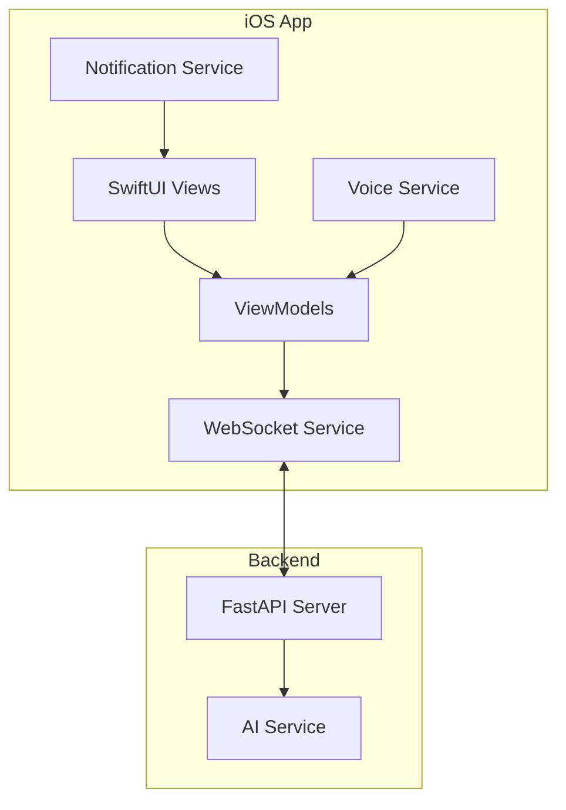

# 📱 LeanVibe iOS

[](https://developer.apple.com/ios/)
[](https://swift.org/)
[](https://developer.apple.com/xcode/swiftui/)
[](https://developer.apple.com/xcode/)

> **A native iOS companion app that provides real-time monitoring, voice commands, and mobile access to your LeanVibe AI development assistant.**

The LeanVibe iOS app is a SwiftUI-based mobile companion that connects to your LeanVibe backend, offering voice-controlled development assistance, real-time project monitoring, and task management on the go.

## ✨ Features

- **🗣️ Voice Commands**: "Hey Lean" wake phrase with natural language queries
- **📊 Real-Time Monitoring**: Live project status and file change notifications
- **🎯 Task Management**: Kanban boards with voice-controlled task creation
- **📈 Metrics Dashboard**: Performance insights and development analytics
- **🏗️ Architecture Viewer**: Interactive dependency graphs and code structure
- **🔔 Smart Notifications**: Intelligent alerts for code changes and issues
- **🎨 Adaptive UI**: Beautiful interface that adapts to your workflow

## 🚀 Quick Start

### Prerequisites

- **iOS 17.0+** or **iPadOS 17.0+**
- **Xcode 15.0+** (for development)
- **LeanVibe Backend**: Running on your network (see [Backend README](../leanvibe-backend/README.md))

### Installation

**Option 1: Xcode (Development)**
```bash
# Clone repository
git clone https://github.com/LeanVibe/leanvibe-ai.git
cd leanvibe-ai/leanvibe-ios

# Open in Xcode
open LeanVibe.xcodeproj

# Select target device and run (⌘+R)
```

**Option 2: TestFlight (Coming Soon)**
```
Join beta program via TestFlight invitation
```

### First Launch Setup

1. **Connect to Backend**: Use QR code scan or manual configuration
2. **Voice Permissions**: Grant microphone access for voice commands  
3. **Notifications**: Enable push notifications for alerts
4. **Project Setup**: Select or add your development projects

## 🛠️ Core Features

### Voice Assistant

**Wake Phrase**: "Hey Lean" + your command

**Voice Commands**:
```
"Hey Lean, show project status"
"Hey Lean, create a new task"
"Hey Lean, what files changed recently?"
"Hey Lean, show architecture diagram"
"Hey Lean, start monitoring mode"
```

### Dashboard Views

| Tab | Purpose | Key Features |
|-----|---------|--------------|
| **Dashboard** | Project overview | Status cards, recent activity, quick actions |
| **Kanban** | Task management | Drag-and-drop boards, voice task creation |
| **Architecture** | Code structure | Interactive diagrams, dependency graphs |
| **Metrics** | Analytics | Performance charts, development insights |
| **Settings** | Configuration | Backend setup, voice settings, notifications |

### Real-Time Features

- **Live Monitoring**: File changes, build status, error notifications
- **WebSocket Connection**: Instant updates from backend
- **Background Sync**: Maintains connection when app is backgrounded
- **Offline Mode**: Cache important data for offline viewing

## 📊 User Interface

### Dashboard Overview

```
┌─────────────────────────────────────┐
│ 🏠 My Projects              ●●● │
├─────────────────────────────────────┤
│                                     │
│ 📊 awesome-app        🟢 Healthy   │
│ 📁 1,247 files       📈 +3 today   │
│ 🧠 AI: Ready         ⚡ Fast       │
│                                     │
├─ Recent Activity ──────────────────┤
│ • main.py updated     2m ago       │
│ • New test added      5m ago       │
│ • Deploy started      1h ago       │
│                                     │
├─ Quick Actions ────────────────────┤
│ [Monitor] [Tasks] [Query] [Build]   │
│                                     │
└─────────────────────────────────────┘
```

### Voice Interface

```
┌─────────────────────────────────────┐
│ 🎤 Voice Assistant                  │
├─────────────────────────────────────┤
│                                     │
│ 🔊 "Hey Lean, show me what's new"   │
│                                     │
│ ✅ Found 3 recent changes:          │
│ • API endpoint updated              │
│ • Database schema modified          │
│ • Tests passing ✅                  │
│                                     │
│ 💬 Anything else I can help with?   │
│                                     │
│ [🎤 Tap to speak]                   │
│                                     │
└─────────────────────────────────────┘
```

## ⚙️ Configuration

### Backend Connection

**QR Code Setup** (Recommended):
1. Run `leanvibe qr` in CLI
2. Scan QR code with iPhone camera
3. Auto-configure connection settings

**Manual Setup**:
```swift
// Settings → Server Configuration
Host: 192.168.1.100
Port: 8000
Use SSL: false
Auth Token: your-token-here
```

### Voice Settings

```swift
// Settings → Voice & Audio
Wake Word: "Hey Lean" (customizable)
Auto-start Listening: true
Voice Commands: Extended
Speech Rate: 1.0x
Language: English (US)
```

### Notification Preferences

```swift
// Settings → Notifications
Code Changes: ✅ Enabled
Build Results: ✅ Enabled  
Error Alerts: ✅ Enabled
Task Updates: ✅ Enabled
Sound: Default
Badge Count: Show unread
```

## 🏗️ Architecture

### App Structure

```
LeanVibe/
├── LeanVibeApp.swift              # Main app entry point
├── Views/                         # SwiftUI views
│   ├── ContentView.swift         # Main tab container
│   ├── Dashboard/                # Project dashboard
│   ├── Kanban/                   # Task management
│   ├── Architecture/             # Code visualization  
│   ├── Metrics/                  # Analytics views
│   ├── Settings/                 # Configuration
│   └── Voice/                    # Voice interface
├── Services/                     # Core services
│   ├── WebSocketService.swift    # Backend communication
│   ├── VoiceManager.swift        # Speech recognition
│   ├── NotificationService.swift # Push notifications
│   ├── SettingsManager.swift     # User preferences
│   └── TaskService.swift         # Task management
├── Models/                       # Data models
│   ├── Project.swift            # Project information
│   ├── Task.swift               # Task representation
│   ├── MetricData.swift         # Analytics data
│   └── VoiceCommand.swift       # Voice command models
├── Resources/                    # Assets and resources
└── Info.plist                   # App configuration
```

### Data Flow



## 🔧 Development

### Prerequisites

- **macOS 13.0+**
- **Xcode 15.0+**  
- **iOS 17.0+ SDK**
- **Swift 6.0**

### Setup Development Environment

```bash
# Clone repository
git clone https://github.com/LeanVibe/leanvibe-ai.git
cd leanvibe-ai/leanvibe-ios

# Open in Xcode
open LeanVibe.xcodeproj

# Install dependencies (if using Swift Package Manager)
# Dependencies are managed in project settings
```

### Project Configuration

**Build Settings**:
- **iOS Deployment Target**: 17.0
- **Swift Language Version**: 6.0
- **SwiftUI**: Native support
- **Supported Devices**: iPhone, iPad

**Capabilities**:
- **Background Modes**: Background fetch, Voice over IP
- **Microphone**: Required for voice commands
- **Network**: Local network access for backend connection

### Testing

**Unit Tests**:
```bash
# Run unit tests in Xcode
⌘+U

# Or via command line
xcodebuild test -scheme LeanVibe -destination 'platform=iOS Simulator,name=iPhone 15 Pro'
```

**UI Tests**:
```bash
# Run UI tests
xcodebuild test -scheme LeanVibeUITests -destination 'platform=iOS Simulator,name=iPhone 15 Pro'
```

### Code Quality

**SwiftLint Integration**:
```bash
# Install SwiftLint
brew install swiftlint

# Run linting
swiftlint lint

# Auto-fix issues
swiftlint --fix
```

## 🎨 Design System

### Color Palette

```swift
// Custom colors defined in Assets.xcassets
.accent        // Primary brand color
.secondary     // Secondary actions
.success       // Positive states (green)
.warning       // Caution states (orange)
.error         // Error states (red)
.background    // Main background
.surface       // Card/panel backgrounds
```

### Typography

```swift
// Responsive typography system
.largeTitle    // Hero text
.title         // Section headers
.headline      // Subsection headers
.body          // Regular content
.caption       // Supporting text
.footnote      // Small details
```

### Components

**Custom Views**:
- `ProjectCard` - Project status display
- `TaskItem` - Kanban task representation
- `VoiceIndicator` - Active listening indicator
- `MetricChart` - Analytics visualization
- `ArchitectureDiagram` - Code structure display

## 📱 Platform Features

### iOS Integration

- **Siri Shortcuts**: Add voice commands to Siri
- **Widgets**: Home screen project status widgets
- **Control Center**: Quick access to monitoring
- **Spotlight Search**: Search projects and tasks
- **Handoff**: Continue tasks between devices

### iPadOS Features

- **Split View**: Use alongside development tools
- **Slide Over**: Quick access while coding
- **Stage Manager**: Multi-window support
- **External Display**: Present architecture diagrams
- **Apple Pencil**: Annotate diagrams and tasks

### watchOS Companion (Future)

- **Quick Status**: Project health at a glance
- **Voice Commands**: "Hey Lean" on Apple Watch
- **Notifications**: Important alerts on wrist
- **Complications**: Dashboard data on watch face

## 🔔 Notifications

### Smart Notifications

**Build Status**:
```
✅ awesome-app Build Successful
Tests passed • 2 warnings fixed
Tap to view details
```

**Code Changes**:
```
📝 3 files changed in awesome-app
• main.py (critical changes)
• tests.py (new tests added)
Tap to review changes
```

**Task Updates**:
```
✅ Task "Fix login bug" completed
Moved to Done • Assigned to you
Great work! 🎉
```

### Notification Actions

- **Quick Reply**: Respond with voice or text
- **View Details**: Open specific view in app
- **Snooze**: Remind me later
- **Mark Complete**: Finish task directly from notification

## 🎯 Advanced Features

### Voice Command Examples

**Project Management**:
```
"Hey Lean, create task 'Fix database connection'"
"Hey Lean, move task 123 to in progress"
"Hey Lean, show me today's completed tasks"
"Hey Lean, what's the project health score?"
```

**Code Analysis**:
```
"Hey Lean, are there any critical errors?"
"Hey Lean, show the dependency graph"
"Hey Lean, what files have high complexity?"
"Hey Lean, explain the architecture pattern"
```

**Monitoring**:
```
"Hey Lean, start monitoring awesome-app"
"Hey Lean, what changed in the last hour?"
"Hey Lean, show recent deployments"
"Hey Lean, is the build pipeline healthy?"
```

### Shortcuts Integration

Create custom shortcuts for common workflows:

```swift
// Example: "Check Project Status" shortcut
Intent: GetProjectStatus
Parameters: project_name
Response: Status summary with health metrics
```

### Automation

**Background Sync**:
- Fetch updates every 15 minutes when app is backgrounded
- Smart sync based on user activity patterns
- Respect Low Power Mode and cellular data settings

**Smart Suggestions**:
- Suggest tasks based on recent code changes
- Recommend code reviews based on complexity changes
- Proactive notifications for important events

## 🐛 Troubleshooting

### Common Issues

**Backend Connection Failed**:
```swift
// Check network connectivity
// Verify backend URL and port
// Ensure backend is running and accessible
// Try QR code setup for automatic configuration
```

**Voice Commands Not Working**:
```swift
// Check microphone permissions
// Verify "Hey Lean" wake phrase is enabled
// Test with simple commands first
// Check voice recognition language settings
```

**Notifications Not Appearing**:
```swift
// Check notification permissions
// Verify notification settings in app
// Ensure backend is sending proper events
// Check Do Not Disturb settings
```

### Debug Mode

Enable debug mode in Settings → Advanced:

```swift
// Shows detailed connection info
// Logs voice recognition events  
// Displays raw WebSocket messages
// Network request/response details
```

### Performance Issues

**Battery Optimization**:
- Background refresh settings
- Reduce voice recognition frequency
- Limit real-time monitoring scope
- Use Wi-Fi instead of cellular when possible

**Memory Management**:
- Clear cached data regularly
- Limit number of projects monitored simultaneously
- Restart app if performance degrades

## 🚀 Future Features

### Roadmap

**Version 2.0**:
- [ ] Apple Watch companion app
- [ ] Siri Shortcuts integration
- [ ] Home screen widgets
- [ ] iPad multi-window support

**Version 2.1**:
- [ ] Code review interface
- [ ] Collaborative task management
- [ ] Team communication features
- [ ] Advanced analytics

**Version 2.2**:
- [ ] AI code generation
- [ ] Automated testing suggestions
- [ ] Smart deployment triggers
- [ ] Performance profiling

## 🤝 Contributing

### Development Guidelines

1. **Fork the repository**
2. **Create feature branch**
   ```bash
   git checkout -b feature/ios-new-feature
   ```

3. **Follow Swift conventions**
   - Use Swift 6 features
   - Follow Apple's Human Interface Guidelines
   - Write comprehensive unit tests
   - Update documentation

4. **Test thoroughly**
   - Test on multiple device sizes
   - Verify voice commands work correctly
   - Check real-time features
   - Validate offline behavior

5. **Submit pull request**
   - Include screenshots/videos of changes
   - Update README if needed
   - Ensure all tests pass

### Code Standards

- **SwiftUI**: Use native SwiftUI patterns
- **Async/Await**: Use modern concurrency
- **MVVM**: Follow Model-View-ViewModel architecture
- **Testing**: Maintain >80% code coverage
- **Accessibility**: Full VoiceOver support

### Design Guidelines

- **Human Interface Guidelines**: Follow Apple's design principles
- **Accessibility**: Support all accessibility features
- **Responsive Design**: Work on all iOS device sizes
- **Dark Mode**: Full dark mode support
- **Dynamic Type**: Support all text sizes

## 📄 License

This project is licensed under the MIT License - see the [LICENSE](../LICENSE) file for details.

## 🔗 Related Projects

- [LeanVibe Backend](../leanvibe-backend/README.md) - Core AI backend service
- [LeanVibe CLI](../leanvibe-cli/README.md) - Command-line interface
- [Main Project](../README.md) - Overall project documentation

---

**Built with ❤️ for iOS developers who want AI assistance on the go**