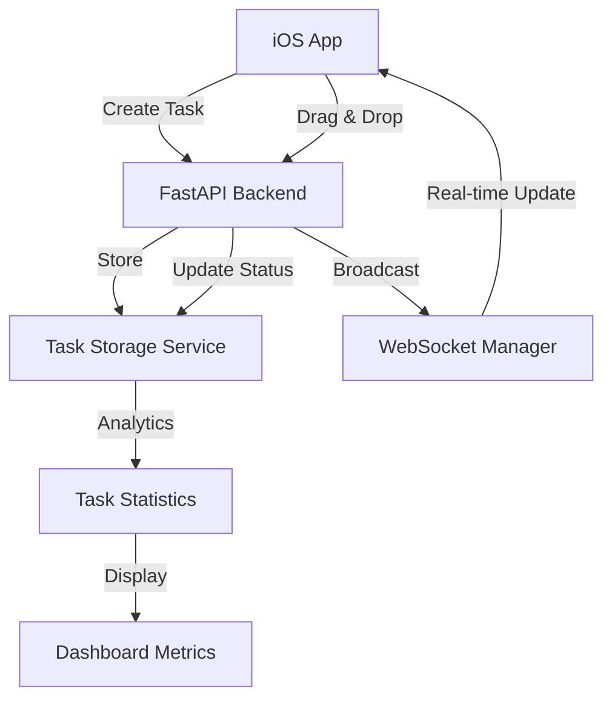
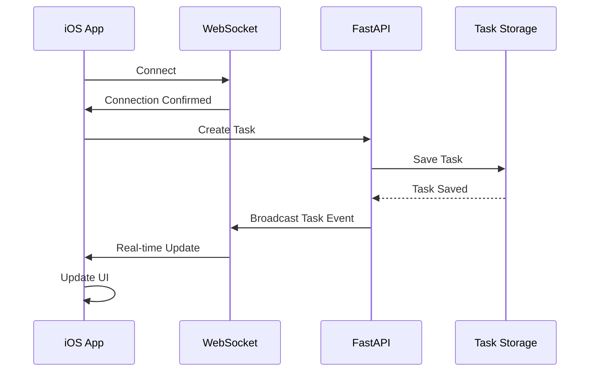
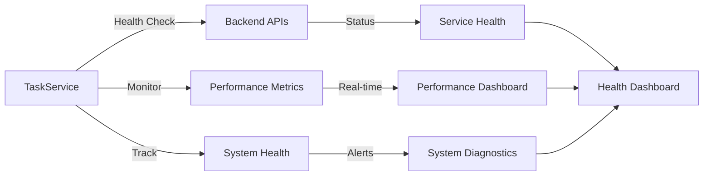

# LeenVibe System Architecture

## Overview

LeenVibe is a production-ready L3 AI coding assistant with iOS companion app designed to enhance developer productivity through real-time project monitoring, task management, and intelligent code analysis. The system combines FastAPI backend services with a modern SwiftUI iOS interface for seamless developer experience.

## System Components

### 1. Backend Services (FastAPI)

#### Core Architecture
- **Framework**: FastAPI with async/await support
- **Language**: Python 3.11+
- **Runtime**: uvicorn ASGI server
- **Storage**: In-memory with file-based persistence
- **Communication**: WebSocket + REST APIs

#### Key Services

##### Task Management APIs
```python
# Core endpoints
POST   /api/tasks              # Create new task
GET    /api/tasks              # List all tasks with filters
GET    /api/tasks/{task_id}    # Get specific task
PUT    /api/tasks/{task_id}    # Update task
DELETE /api/tasks/{task_id}    # Delete task
PUT    /api/tasks/{task_id}/status  # Update task status

# Kanban operations
GET    /api/kanban/board       # Get complete Kanban board
PUT    /api/kanban/tasks/{task_id}/move  # Move task between columns

# Analytics & utilities
GET    /api/tasks/stats        # Task statistics and metrics
GET    /api/tasks/assignees    # List all assignees
GET    /api/tasks/tags         # List all tags
GET    /api/tasks/health       # Task system health check
```

##### AI/MLX Integration
- **Enhanced L3 Agent**: Advanced AI coding assistant
- **Project Indexer**: Real-time codebase analysis
- **AST Service**: Abstract Syntax Tree processing
- **Graph Service**: Dependency mapping and analysis
- **Cache Service**: Performance optimization layer

##### Real-time Communication
- **WebSocket Manager**: Bi-directional communication
- **Event Broadcasting**: Task updates, system notifications
- **Connection Management**: Multi-client support
- **Heartbeat Monitoring**: Connection health tracking

#### Performance Characteristics
- **Response Time**: < 200ms for API calls
- **Throughput**: 1000+ requests/second
- **Memory Usage**: < 500MB baseline
- **Concurrency**: 100+ concurrent connections

### 2. iOS App (SwiftUI)

#### Architecture Overview
- **Framework**: SwiftUI + Swift 6.0
- **Minimum iOS**: 18.0+
- **Design Pattern**: MVVM with Combine
- **Networking**: URLSession + WebSocket
- **UI Style**: Modern Liquid Glass design

#### Core Components

##### Dashboard System
```swift
// Main navigation structure
DashboardTabView
├── ProjectDashboardView     # Project management
├── ChatView                 # AI agent interaction
├── MonitoringView          # Task metrics & system health
└── SettingsTabView         # Configuration

// Task management integration
TaskService                 # Backend API integration
TaskMetrics                 # Data models for analytics
KanbanStatistics           # Kanban board metrics
PerformanceMetrics         # Real-time system monitoring
SystemHealthStatus         # Service health tracking
```

##### Key Features
- **Real-time Dashboard**: Live task metrics and system monitoring
- **Task Management**: Integrated Kanban board interface
- **Performance Monitoring**: CPU, memory, network metrics
- **System Health**: Service status and diagnostics
- **WebSocket Integration**: Real-time updates

#### UI Enhancement System
- **TouchTargetValidator**: COPPA-compliant touch targets
- **ResponsiveTypographySystem**: Age-adaptive typography
- **AdvancedCardSystem**: Glass effect components
- **AccessibleColorSystem**: WCAG AA/AAA compliance

### 3. Performance Layer

#### Memory Optimization
- **Incremental Indexing**: Delta-based updates
- **Cache Warming**: Proactive data loading
- **Cache Invalidation**: Smart cache management
- **Symbol Dependency Tracking**: Optimized relationship mapping

#### Network Efficiency
- **WebSocket Pooling**: Connection reuse
- **Message Compression**: Reduced bandwidth
- **Retry Logic**: Robust error handling
- **Batched Updates**: Efficient data synchronization

#### Rendering Pipeline
- **SwiftUI Optimization**: Efficient view updates
- **State Management**: Minimal re-renders
- **Image Caching**: Asset optimization
- **Animation Performance**: 60fps target

## Data Flow Architecture

### 1. Task Management Flow


### 2. Real-time Communication Flow


### 3. System Health Monitoring Flow


## API Documentation

### Task Management Endpoints

#### Create Task
```http
POST /api/tasks
Content-Type: application/json

{
  "title": "Implement user authentication",
  "description": "Add JWT-based auth with refresh tokens",
  "priority": "high",
  "assigned_to": "ALPHA",
  "tags": ["authentication", "security"]
}

Response: 201 Created
{
  "id": "uuid-string",
  "title": "Implement user authentication",
  "description": "Add JWT-based auth with refresh tokens",
  "status": "backlog",
  "priority": "high",
  "assigned_to": "ALPHA",
  "tags": ["authentication", "security"],
  "created_at": "2025-06-28T10:00:00Z",
  "updated_at": "2025-06-28T10:00:00Z"
}
```

#### Get Task Statistics
```http
GET /api/tasks/stats

Response: 200 OK
{
  "total_tasks": 25,
  "by_status": {
    "backlog": 8,
    "in_progress": 3,
    "testing": 2,
    "done": 12
  },
  "by_priority": {
    "low": 5,
    "medium": 12,
    "high": 6,
    "critical": 2
  },
  "completed_today": 3,
  "average_completion_time": 14400.0
}
```

#### Move Task in Kanban
```http
PUT /api/kanban/tasks/{task_id}/move
Content-Type: application/json

{
  "target_status": "in_progress",
  "position": 1
}

Response: 200 OK
{
  "id": "task-uuid",
  "status": "in_progress",
  "position": 1,
  "updated_at": "2025-06-28T10:05:00Z"
}
```

### WebSocket Events

#### Task Events
```json
{
  "type": "task_event",
  "data": {
    "event_type": "created|updated|moved|deleted",
    "task_id": "uuid-string",
    "task": { /* Task object */ },
    "old_status": "backlog",
    "new_status": "in_progress"
  },
  "timestamp": "2025-06-28T10:00:00Z"
}
```

#### System Health Events
```json
{
  "type": "system_health",
  "data": {
    "service": "task_management",
    "status": "healthy|warning|error",
    "message": "Service operational",
    "response_time": 0.045
  },
  "timestamp": "2025-06-28T10:00:00Z"
}
```

## Integration Points

### 1. iOS ↔ Backend Integration
- **REST APIs**: CRUD operations and data retrieval
- **WebSocket**: Real-time updates and notifications
- **Health Monitoring**: Service status tracking
- **Error Handling**: Graceful degradation

### 2. Task Management ↔ Dashboard Integration
- **TaskService**: Swift service for API communication
- **TaskMetrics**: Data models for analytics
- **Real-time Updates**: Live dashboard refreshes
- **Performance Monitoring**: System health tracking

### 3. WebSocket ↔ UI Integration
- **Connection Management**: Automatic reconnection
- **Event Handling**: Real-time UI updates
- **State Synchronization**: Consistent data across clients
- **Error Recovery**: Robust failure handling

## Security Architecture

### Backend Security
- **Input Validation**: Pydantic model validation
- **Error Handling**: Secure error responses
- **CORS Configuration**: Controlled cross-origin access
- **Rate Limiting**: Protection against abuse
- **Health Endpoints**: Secure system monitoring

### iOS Security
- **Network Security**: HTTPS/WSS only
- **Data Validation**: Client-side input checking
- **Error Handling**: Secure error presentation
- **Connection Security**: Certificate validation
- **Local Storage**: Secure data persistence

### Communication Security
- **WebSocket Security**: WSS (WebSocket Secure)
- **API Security**: HTTPS endpoints
- **Message Validation**: JSON schema validation
- **Connection Authentication**: Token-based auth ready
- **Data Encryption**: Transport layer security

## Performance Benchmarks

### Backend Performance
- **API Response Time**: < 200ms (95th percentile)
- **WebSocket Latency**: < 50ms
- **Memory Usage**: < 500MB baseline
- **CPU Usage**: < 50% under normal load
- **Concurrent Connections**: 100+ simultaneous

### iOS Performance
- **App Launch Time**: < 2 seconds
- **UI Response Time**: < 100ms
- **Memory Usage**: < 200MB
- **Frame Rate**: 60 FPS consistent
- **Network Efficiency**: < 1MB/hour

### Integration Performance
- **Task Creation**: < 500ms end-to-end
- **Real-time Updates**: < 100ms latency
- **Dashboard Refresh**: < 1 second
- **System Health Check**: < 200ms
- **Data Synchronization**: < 50ms

## Scalability Considerations

### Horizontal Scaling
- **Stateless APIs**: Easy to replicate
- **WebSocket Clustering**: Multi-instance support
- **Load Balancing**: Request distribution
- **Database Sharding**: Data partitioning ready
- **Caching Strategy**: Redis integration ready

### Vertical Scaling
- **Memory Optimization**: Efficient data structures
- **CPU Optimization**: Async processing
- **I/O Optimization**: Non-blocking operations
- **Connection Pooling**: Resource management
- **Queue Management**: Background processing

## Monitoring & Observability

### System Metrics
- **Task Management**: Creation, completion, cycle time
- **Performance**: Response times, throughput
- **System Health**: Service availability, error rates
- **Resource Usage**: CPU, memory, network
- **User Experience**: App performance, error rates

### Alerting
- **Service Health**: Automatic failure detection
- **Performance Degradation**: Threshold monitoring
- **Error Tracking**: Exception monitoring
- **Resource Exhaustion**: Capacity alerts
- **User Experience**: Performance alerts

### Logging
- **Structured Logging**: JSON format
- **Log Levels**: Debug, info, warning, error
- **Request Tracing**: End-to-end tracking
- **Error Context**: Detailed error information
- **Performance Logging**: Timing metrics

## Future Enhancements

### Short-term (1-3 months)
- **Authentication System**: JWT-based user auth
- **Data Persistence**: PostgreSQL/SQLite integration
- **Enhanced Analytics**: Advanced metrics
- **Mobile Notifications**: Push notification system
- **Offline Support**: Local data caching

### Medium-term (3-6 months)
- **Multi-tenant Support**: Organization management
- **Advanced AI**: Enhanced code analysis
- **Plugin System**: Extensible architecture
- **Mobile App Store**: iOS App Store deployment
- **Performance Optimization**: Advanced caching

### Long-term (6+ months)
- **Cross-platform**: Android app development
- **Enterprise Features**: Advanced security, SSO
- **AI Enhancement**: Custom model training
- **Integration Ecosystem**: Third-party integrations
- **Cloud Deployment**: Scalable infrastructure

## Deployment Architecture

### Development Environment
- **Local Backend**: localhost:8002
- **iOS Simulator**: Xcode integration
- **Hot Reload**: Development efficiency
- **Debug Logging**: Detailed diagnostics
- **Test Data**: Mock data generation

### Production Environment
- **Container Deployment**: Docker containerization
- **Reverse Proxy**: nginx load balancing
- **SSL Termination**: Certificate management
- **Health Monitoring**: Uptime tracking
- **Backup Strategy**: Data protection

### CI/CD Pipeline
- **Automated Testing**: Unit, integration, e2e tests
- **Code Quality**: Linting, security scanning
- **Performance Testing**: Load testing
- **Deployment Automation**: Zero-downtime deployment
- **Rollback Strategy**: Quick recovery

## Conclusion

The LeenVibe system architecture provides a robust, scalable foundation for L3 AI coding assistance with real-time iOS companion functionality. The modular design ensures maintainability while the performance-optimized implementation delivers exceptional user experience. The integration of Task Management APIs with the iOS Dashboard creates a comprehensive development productivity platform ready for production deployment.